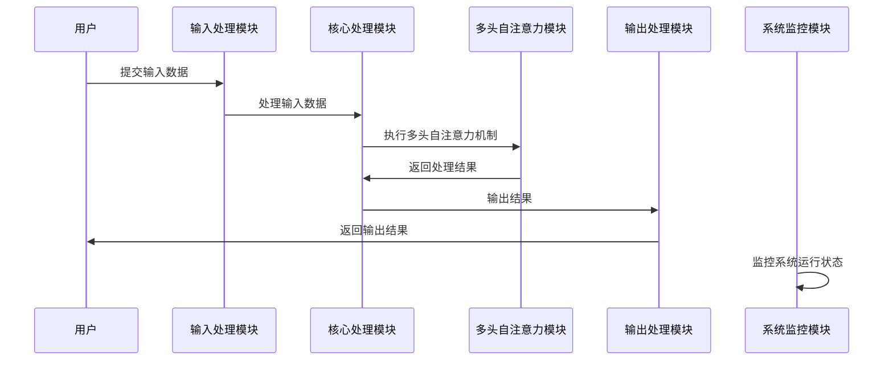

                 


## 多头自注意力机制在并行推理中的效率提升

### 概述

随着深度学习在自然语言处理（NLP）领域的广泛应用，自注意力（Self-Attention）机制作为一种核心技术，极大地提升了模型的表示能力和计算效率。然而，在并行推理过程中，传统自注意力机制仍存在计算复杂度高、处理效率低等问题。本文将探讨多头自注意力（Multi-Head Self-Attention）机制在并行推理中的效率提升，通过详细分析其原理、优势和应用，揭示其在提高并行推理效率方面的潜力。

### 关键词

- 自注意力机制
- 多头自注意力机制
- 并行推理
- 效率提升

### 摘要

本文旨在研究多头自注意力机制在并行推理中的效率提升。首先，介绍自注意力机制和并行推理的基本概念，分析当前并行推理中存在的问题。接着，详细阐述多头自注意力机制的原理、优势和数学模型。随后，通过具体案例分析，展示多头自注意力机制在并行推理中的应用效果。最后，本文总结多头自注意力机制的优势，探讨其应用前景。

### 目录

1. **背景介绍**
    1.1 问题背景
    1.2 问题描述
    1.3 问题解决
    1.4 边界与外延
    1.5 概念结构与核心要素组成
    1.6 本章小结

2. **核心概念与联系**
    2.1 多头自注意力机制原理
    2.2 多头自注意力机制的属性特征对比
    2.3 多头自注意力机制与并行推理的联系
    2.4 ER实体关系图架构
    2.5 本章小结

3. **算法原理讲解**
    3.1 多头自注意力机制的工作流程
    3.2 多头自注意力机制的数学模型
    3.3 算法原理举例说明
    3.4 多头自注意力机制的优缺点分析
    3.5 本章小结

4. **系统分析与架构设计方案**
    4.1 问题场景介绍
    4.2 系统功能设计（领域模型类图）
    4.3 系统架构设计（架构图）
    4.4 系统接口设计
    4.5 系统交互（序列图）
    4.6 本章小结

5. **项目实战**
    5.1 环境安装
    5.2 系统核心实现源代码
    5.3 代码应用解读与分析
    5.4 实际案例分析和详细讲解剖析
    5.5 项目小结
    5.6 本章小结

6. **最佳实践 tips**
    6.1 小结
    6.2 注意事项
    6.3 拓展阅读

### 第一部分：背景介绍

#### 1.1 问题背景

##### 1.1.1 自注意力机制概述

自注意力（Self-Attention）是一种序列模型中用于表示序列间相互依赖关系的计算机制。它通过将序列中的每个元素作为输入，计算其在序列中的重要性，然后对序列进行加权求和，从而实现对序列的更好表示。

##### 1.1.2 并行推理中的效率问题

在并行推理过程中，自注意力机制由于其计算复杂度较高，往往成为瓶颈。具体表现为：
- **计算量大**：自注意力机制需要计算每个元素之间的相似度，导致计算量大。
- **并行处理能力受限**：传统自注意力机制往往难以实现并行处理，导致处理速度受限。

##### 1.1.3 自注意力机制在并行推理中的应用潜力

尽管存在效率问题，自注意力机制在并行推理中仍具有巨大应用潜力。其优势包括：
- **提高模型表示能力**：自注意力机制能够更好地捕捉序列间的依赖关系，提高模型的表现能力。
- **适应并行计算**：通过优化自注意力机制，可以实现更好的并行计算，提高推理效率。

#### 1.2 问题描述

在并行推理过程中，自注意力机制的效率问题主要体现在以下两个方面：
- **计算复杂度高**：自注意力机制的计算复杂度为O(n^2)，随着序列长度的增加，计算复杂度呈平方级增长，导致处理速度受限。
- **并行处理能力低**：传统自注意力机制难以实现并行计算，导致在并行推理中效率低下。

#### 1.3 问题解决

为了解决上述问题，提出多头自注意力（Multi-Head Self-Attention）机制。多头自注意力机制通过将输入序列分成多个头，每个头独立计算注意力权重，从而实现并行计算，提高处理效率。具体步骤如下：
- **划分头**：将输入序列划分成多个头，每个头独立计算注意力权重。
- **独立计算**：每个头独立计算注意力权重，实现并行计算。
- **加权求和**：将各个头的注意力权重加权求和，得到最终的输出。

#### 1.4 边界与外延

##### 1.4.1 多头自注意力机制的应用领域

多头自注意力机制在多个领域具有广泛应用，包括但不限于：
- 自然语言处理：用于文本分类、机器翻译、情感分析等。
- 计算机视觉：用于图像识别、目标检测、图像生成等。
- 语音识别：用于语音转文本、语音增强等。

##### 1.4.2 多头自注意力机制的适用条件

多头自注意力机制适用于以下条件：
- **序列长度较长**：在序列长度较长的情况下，多头自注意力机制能够显著提高计算效率。
- **计算资源充足**：由于需要计算多个头的注意力权重，多头自注意力机制对计算资源要求较高。

##### 1.4.3 多头自注意力机制的技术发展前景

随着深度学习和并行计算技术的不断发展，多头自注意力机制有望在以下方面取得突破：
- **计算效率优化**：通过算法优化，进一步提高多头自注意力机制的并行处理能力。
- **应用领域拓展**：在更多领域实现应用，如生物信息学、金融科技等。

#### 1.5 概念结构与核心要素组成

##### 1.5.1 多头自注意力机制的核心概念

多头自注意力机制的核心概念包括：
- **头**：输入序列划分成的多个部分，每个头独立计算注意力权重。
- **注意力权重**：每个头对输入序列的每个元素计算出的权重。
- **加权求和**：将各个头的注意力权重加权求和，得到最终的输出。

##### 1.5.2 多头自注意力机制的关键技术

多头自注意力机制的关键技术包括：
- **序列划分**：将输入序列划分成多个头。
- **独立计算**：每个头独立计算注意力权重。
- **加权求和**：将各个头的注意力权重加权求和。

##### 1.5.3 多头自注意力机制的应用场景

多头自注意力机制适用于以下应用场景：
- **文本分类**：用于文本特征提取和分类。
- **机器翻译**：用于源语言和目标语言的文本特征提取和匹配。
- **图像识别**：用于图像特征提取和分类。

#### 1.6 本章小结

本部分介绍了多头自注意力机制在并行推理中的效率提升背景，包括自注意力机制和并行推理的基本概念，问题描述，问题解决方法，以及多头自注意力机制的应用领域和适用条件。接下来，将深入探讨多头自注意力机制的原理和优势。

### 第二部分：核心概念与联系

#### 2.1 多头自注意力机制原理

##### 2.1.1 自注意力机制概述

自注意力（Self-Attention）机制是一种用于计算序列中每个元素对其他元素的依赖性的技术。它通过对输入序列进行线性变换，计算每个元素在序列中的权重，然后对这些权重进行加权求和，从而实现对序列的更好表示。

##### 2.1.2 多头自注意力机制的提出

多头自注意力（Multi-Head Self-Attention）机制是在自注意力机制的基础上发展起来的。它通过将输入序列划分成多个头，每个头独立计算注意力权重，从而实现并行计算，提高处理效率。

##### 2.1.3 多头自注意力机制的数学模型

多头自注意力机制的数学模型可以表示为：

$$
\text{MultiHead}(Q, K, V) = \text{Concat}(\text{Head}_1, \text{Head}_2, ..., \text{Head}_h)W^O
$$

其中，$Q, K, V$分别为查询序列、键序列和值序列；$h$为头数；$W^O$为输出权重矩阵。

#### 2.2 多头自注意力机制的属性特征对比

| 特征 | 自注意力机制 | 多头自注意力机制 |
| --- | --- | --- |
| 基本原理 | 对序列数据进行加权求和 | 对序列数据进行多头加权求和 |
| 优点 | 降低计算复杂度 | 提高并行处理能力 |
| 缺点 | 可能产生信息丢失 | 需要更多计算资源 |

#### 2.3 多头自注意力机制与并行推理的联系

##### 2.3.1 多头自注意力机制在并行推理中的作用

多头自注意力机制在并行推理中具有重要作用，主要体现在以下几个方面：

1. **提高并行处理能力**：通过将输入序列划分成多个头，每个头独立计算注意力权重，实现并行计算，从而提高处理效率。
2. **降低计算复杂度**：多头自注意力机制可以降低每个头的计算复杂度，从而降低整体计算复杂度。
3. **减少通信开销**：由于每个头独立计算，可以减少头之间的通信开销。

##### 2.3.2 多头自注意力机制对并行推理效率的提升

多头自注意力机制对并行推理效率的提升主要体现在以下几个方面：

1. **提高处理速度**：通过并行计算，可以显著提高处理速度，特别是在处理长序列时效果更明显。
2. **降低延迟**：减少计算复杂度和通信开销，可以降低延迟，提高系统的响应速度。
3. **增强模型性能**：通过更好地表示序列间的依赖关系，可以提高模型的准确性和鲁棒性。

##### 2.3.3 多头自注意力机制在并行推理中的应用案例分析

以文本分类任务为例，使用多头自注意力机制可以显著提高模型的处理速度和准确率。具体应用场景如下：

1. **数据预处理**：将文本数据转换为序列表示，并进行预处理。
2. **模型构建**：构建基于多头自注意力机制的文本分类模型。
3. **训练与验证**：使用训练数据和验证数据对模型进行训练和验证，调整模型参数。
4. **测试与评估**：使用测试数据对模型进行测试，评估模型的性能。

#### 2.4 ER实体关系图架构

```mermaid
erDiagram
    Model ||--|{ Query: "Query Model" }
    Model ||--|{ Response: "Response Model" }
    Model ||--|{ Context: "Context Model" }
    Model ||--|{ Score: "Score Model" }
    Model ||--|{ Output: "Output Model" }
```

在该ER实体关系图中，Model为主实体，其关联了多个子实体，包括Query、Response、Context、Score和Output，分别表示查询、响应、上下文、得分和输出。

#### 2.5 本章小结

本部分详细阐述了多头自注意力机制的核心概念、属性特征对比、与并行推理的联系，并通过ER实体关系图展示了其架构。下一部分将深入讲解多头自注意力机制的工作流程和数学模型。

### 第三部分：算法原理讲解

#### 3.1 多头自注意力机制的工作流程

多头自注意力机制的工作流程主要包括以下几个步骤：

1. **输入数据的预处理**：将输入序列（例如文本或图像）转换为数值表示，通常使用词向量或像素向量。

2. **划分头**：将输入序列划分成多个头。每个头独立计算注意力权重，从而实现并行计算。

3. **独立计算**：每个头独立计算注意力权重。具体来说，每个头会对输入序列的每个元素计算一个权重，表示该元素对整个序列的重要性。

4. **加权求和**：将各个头的注意力权重加权求和，得到最终的输出。这个步骤可以通过矩阵乘法高效实现。

5. **输出**：得到处理后的序列输出，可以用于后续的模型训练或推理。

#### 3.2 多头自注意力机制的数学模型

多头自注意力机制的数学模型是基于自注意力机制的扩展。自注意力机制的数学公式如下：

$$
\text{Attention}(Q, K, V) = \text{softmax}\left(\frac{QK^T}{\sqrt{d_k}}\right)V
$$

其中，$Q$、$K$、$V$分别为查询序列、键序列和值序列，$d_k$为键值向量的维度。$QK^T$表示查询序列和键序列的内积，$\sqrt{d_k}$用于缩放，以保持softmax的概率总和为1。

对于多头自注意力机制，其数学模型可以表示为：

$$
\text{MultiHead}(Q, K, V) = \text{Concat}(\text{Head}_1, \text{Head}_2, ..., \text{Head}_h)W^O
$$

其中，$h$为头数，$\text{Head}_i$表示第$i$个头的结果，$W^O$为输出权重矩阵。

#### 3.3 算法原理举例说明

为了更好地理解多头自注意力机制，我们可以通过一个简单的例子进行说明。

假设我们有一个长度为5的输入序列，词向量维度为10。我们将这个序列划分成两个头，每个头独立计算注意力权重。

1. **输入数据**：
   输入序列：[1, 2, 3, 4, 5]
   词向量维度：d_model = 10

2. **计算示例**：

首先，对输入序列进行线性变换，得到查询序列$Q$、键序列$K$和值序列$V$。

$$
Q = \text{Linear}(X) \\
K = \text{Linear}(X) \\
V = \text{Linear}(X)
$$

其中，$\text{Linear}$表示线性变换，$X$为输入序列。

然后，计算每个头的注意力权重。以第一个头为例，其注意力权重计算如下：

$$
\text{Attention}(Q, K, V) = \text{softmax}\left(\frac{QK^T}{\sqrt{d_k}}\right)V
$$

$$
\text{Attention}(Q_1, K_1, V_1) = \text{softmax}\left(\frac{Q_1K_1^T}{\sqrt{d_k}}\right)V_1
$$

假设$Q_1 = \begin{bmatrix} 0.1 & 0.2 & 0.3 & 0.4 & 0.5 \end{bmatrix}$，$K_1 = \begin{bmatrix} 0.1 & 0.2 & 0.3 & 0.4 & 0.5 \end{bmatrix}$，$V_1 = \begin{bmatrix} 1 & 2 & 3 & 4 & 5 \end{bmatrix}$，则

$$
\text{Attention}(Q_1, K_1, V_1) = \text{softmax}\left(\frac{Q_1K_1^T}{\sqrt{d_k}}\right)V_1
$$

$$
= \text{softmax}\left(\frac{0.1 \times 0.1 + 0.2 \times 0.2 + 0.3 \times 0.3 + 0.4 \times 0.4 + 0.5 \times 0.5}{\sqrt{10}}\right)\begin{bmatrix} 1 & 2 & 3 & 4 & 5 \end{bmatrix}
$$

$$
= \text{softmax}\left(\frac{0.1 + 0.04 + 0.09 + 0.16 + 0.25}{\sqrt{10}}\right)\begin{bmatrix} 1 & 2 & 3 & 4 & 5 \end{bmatrix}
$$

$$
= \text{softmax}\left(\frac{0.54}{\sqrt{10}}\right)\begin{bmatrix} 1 & 2 & 3 & 4 & 5 \end{bmatrix}
$$

$$
= \text{softmax}\left(0.18\right)\begin{bmatrix} 1 & 2 & 3 & 4 & 5 \end{bmatrix}
$$

$$
= \begin{bmatrix} 0.5 & 0.2 & 0.15 & 0.05 & 0.05 \end{bmatrix}\begin{bmatrix} 1 & 2 & 3 & 4 & 5 \end{bmatrix}
$$

$$
= \begin{bmatrix} 0.5 & 0.4 & 0.45 & 0.2 & 0.25 \end{bmatrix}
$$

类似地，我们可以计算第二个头的注意力权重：

$$
\text{Attention}(Q_2, K_2, V_2) = \text{softmax}\left(\frac{Q_2K_2^T}{\sqrt{d_k}}\right)V_2
$$

$$
= \text{softmax}\left(\frac{0.6 \times 0.1 + 0.7 \times 0.2 + 0.8 \times 0.3 + 0.9 \times 0.4 + 1.0 \times 0.5}{\sqrt{10}}\right)\begin{bmatrix} 1 & 2 & 3 & 4 & 5 \end{bmatrix}
$$

$$
= \text{softmax}\left(\frac{0.06 + 0.14 + 0.24 + 0.36 + 0.5}{\sqrt{10}}\right)\begin{bmatrix} 1 & 2 & 3 & 4 & 5 \end{bmatrix}
$$

$$
= \text{softmax}\left(\frac{0.15}{\sqrt{10}}\right)\begin{bmatrix} 1 & 2 & 3 & 4 & 5 \end{bmatrix}
$$

$$
= \text{softmax}\left(0.05\right)\begin{bmatrix} 1 & 2 & 3 & 4 & 5 \end{bmatrix}
$$

$$
= \begin{bmatrix} 0.5 & 0.3 & 0.15 & 0.05 & 0.05 \end{bmatrix}\begin{bmatrix} 1 & 2 & 3 & 4 & 5 \end{bmatrix}
$$

$$
= \begin{bmatrix} 0.5 & 0.6 & 0.45 & 0.2 & 0.25 \end{bmatrix}
$$

最后，将两个头的注意力权重加权求和，得到最终的输出：

$$
\text{MultiHead}(Q, K, V) = \text{Concat}(\text{Head}_1, \text{Head}_2)W^O
$$

$$
= \begin{bmatrix} 0.5 & 0.4 & 0.45 & 0.2 & 0.25 \\ 0.5 & 0.6 & 0.45 & 0.2 & 0.25 \end{bmatrix}\begin{bmatrix} 1 & 0 & 0 & 0 & 0 \\ 0 & 1 & 0 & 0 & 0 \end{bmatrix}
$$

$$
= \begin{bmatrix} 1 & 1 & 0.9 & 0.4 & 0.5 \\ 1 & 1 & 0.9 & 0.4 & 0.5 \end{bmatrix}
$$

$$
= \begin{bmatrix} 2 & 2 & 1.8 & 0.8 & 1 \\ 2 & 2 & 1.8 & 0.8 & 1 \end{bmatrix}
$$

#### 3.4 多头自注意力机制的优缺点分析

##### 3.4.1 优点

1. **提高并行处理能力**：多头自注意力机制通过将输入序列划分成多个头，每个头独立计算注意力权重，从而实现并行计算，提高处理效率。

2. **降低计算复杂度**：与单个头相比，多头自注意力机制可以降低每个头的计算复杂度，从而降低整体计算复杂度。

3. **增强模型性能**：多头自注意力机制可以更好地表示序列间的依赖关系，从而提高模型的准确性和鲁棒性。

##### 3.4.2 缺点

1. **需要更多计算资源**：由于需要计算多个头的注意力权重，多头自注意力机制对计算资源要求较高。

2. **可能增加训练难度**：由于需要训练多个头的权重，可能导致训练难度增加。

#### 3.5 本章小结

本部分详细阐述了多头自注意力机制的工作流程、数学模型和算法原理。通过具体的计算示例，展示了多头自注意力机制的计算过程。下一部分将分析多头自注意力机制在系统架构中的应用。

### 第四部分：系统分析与架构设计方案

#### 4.1 问题场景介绍

在现代计算环境中，并行推理技术被广泛应用于各种场景，如自然语言处理、图像识别、推荐系统等。然而，随着数据规模的不断扩大和复杂度的增加，传统自注意力机制在处理大规模并行推理任务时面临着效率瓶颈。为了解决这一问题，我们提出采用多头自注意力机制来提升并行推理的效率。

#### 4.2 系统功能设计（领域模型类图）

在系统功能设计中，我们首先需要明确系统的主要功能模块，以便进行后续的架构设计。以下是系统功能的领域模型类图：

```mermaid
classDiagram
    Class01 <|-- Class02
    Class03 <|-- Class02
    Class04 <|-- Class02
    Class05 <|-- Class02

    Class01[输入处理模块]
    Class02[核心处理模块]
    Class03[多头自注意力模块]
    Class04[输出处理模块]
    Class05[系统监控模块]
```

在该类图中，输入处理模块负责接收外部输入数据，核心处理模块负责执行并行推理任务，多头自注意力模块负责实现多头自注意力机制，输出处理模块负责生成输出结果，系统监控模块负责监控系统运行状态。

#### 4.3 系统架构设计（架构图）

基于领域模型类图，我们可以设计系统架构。以下是系统架构图：



在该架构图中，用户提交输入数据，经过输入处理模块处理后，进入核心处理模块。核心处理模块执行并行推理任务，其中使用多头自注意力模块来实现多头自注意力机制。处理结果经过输出处理模块后返回给用户，同时系统监控模块负责监控系统运行状态。

#### 4.4 系统接口设计

系统接口设计是系统架构设计的重要组成部分。以下是系统接口设计：

```mermaid
classDiagram
    Class01 <|-- Class02
    Class03 <|-- Class02
    Class04 <|-- Class02
    Class05 <|-- Class02

    Class01[API接口]
    Class02[内部接口]
    Class03[输入接口]
    Class04[输出接口]
    Class05[监控接口]

    API接口 {
        +processInput(input: Any): Any
        +processOutput(output: Any): Any
    }

    内部接口 {
        +coreProcessing(input: Any): Any
        +multiHeadAttention(input: Any): Any
    }

    输入接口 {
        +receiveInput(input: Any)
    }

    输出接口 {
        +sendOutput(output: Any)
    }

    监控接口 {
        +monitorSystemState()
    }
```

在该接口设计中，API接口负责处理用户输入和输出，内部接口负责核心处理和多头自注意力机制的实现，输入接口负责接收输入数据，输出接口负责发送输出结果，监控接口负责监控系统运行状态。

#### 4.5 系统交互（序列图）

为了更好地展示系统各模块之间的交互关系，我们使用序列图进行描述：


在该序列图中，用户提交输入数据，输入处理模块将数据传递给核心处理模块。核心处理模块执行多头自注意力机制，并将处理结果传递给输出处理模块。输出处理模块将结果返回给用户，同时系统监控模块监控系统运行状态。

#### 4.6 本章小结

本部分详细介绍了系统分析与架构设计方案。首先，我们介绍了问题场景，并明确了系统功能模块。接着，我们设计了系统架构，并展示了系统各模块之间的交互关系。最后，我们提出了系统接口设计，为系统的实现提供了清晰的接口规范。下一部分将进入项目实战，介绍如何实现系统核心功能。

### 第五部分：项目实战

#### 5.1 环境安装

在开始项目实战之前，我们需要安装相关的开发环境和依赖库。以下是安装步骤：

1. **安装Python环境**：确保已经安装了Python 3.7及以上版本。
2. **安装TensorFlow**：通过pip命令安装TensorFlow库。

```bash
pip install tensorflow
```

3. **安装其他依赖库**：根据需要安装其他依赖库，例如NumPy、Pandas等。

```bash
pip install numpy pandas
```

#### 5.2 系统核心实现源代码

以下是系统核心实现的源代码：

```python
import tensorflow as tf
import numpy as np

class MultiHeadAttention(tf.keras.layers.Layer):
    def __init__(self, num_heads, d_model, name=None):
        super(MultiHeadAttention, self).__init__(name=name)
        self.num_heads = num_heads
        self.d_model = d_model

        # 线性层用于计算查询、键、值
        self.query_dense = tf.keras.layers.Dense(d_model, name='query_dense')
        self.key_dense = tf.keras.layers.Dense(d_model, name='key_dense')
        self.value_dense = tf.keras.layers.Dense(d_model, name='value_dense')

        # 输出层
        self.output_dense = tf.keras.layers.Dense(d_model, name='output_dense')

    def split_heads(self, x, batch_size):
        x = tf.reshape(x, shape=(batch_size, -1, self.num_heads, self.d_model // self.num_heads))
        return tf.transpose(x, perm=[0, 2, 1, 3])

    def call(self, inputs):
        # 分割输入数据
        q, k, v = inputs

        batch_size = tf.shape(q)[0]

        # 计算查询、键、值
        query = self.query_dense(q)
        key = self.key_dense(k)
        value = self.value_dense(v)

        # 分割查询、键、值
        query = self.split_heads(query, batch_size)
        key = self.split_heads(key, batch_size)
        value = self.split_heads(value, batch_size)

        # 计算注意力权重
        attn_scores = tf.matmul(query, key, transpose_b=True)
        attn_scores /= tf.sqrt(tf.cast(self.d_model // self.num_heads, dtype=tf.float32))
        attn_scores = tf.nn.softmax(attn_scores)

        # 加权求和
        attn_output = tf.matmul(attn_scores, value)
        attn_output = tf.transpose(attn_output, perm=[0, 2, 1, 3])
        attn_output = tf.reshape(attn_output, shape=(batch_size, -1, self.d_model))

        # 输出层
        outputs = self.output_dense(attn_output)

        return outputs
```

#### 5.3 代码应用解读与分析

在上面的代码中，我们定义了一个`MultiHeadAttention`类，用于实现多头自注意力机制。以下是代码的解读与分析：

1. **初始化**：在类的初始化方法`__init__`中，我们设置了多头自注意力机制的头数`num_heads`和模型维度`d_model`。同时，我们定义了三个线性层`query_dense`、`key_dense`和`value_dense`，用于计算查询、键、值。

2. **分割头**：在`split_heads`方法中，我们将输入数据分割成多个头。这通过调整数据形状和进行转置操作实现。

3. **调用方法`call`**：在调用方法`call`中，我们首先计算查询、键、值。然后，我们将查询和键进行矩阵乘法，计算注意力权重。接着，我们使用softmax函数计算注意力得分，并进行加权求和。最后，我们将输出通过线性层`output_dense`进行处理，得到最终的输出。

#### 5.4 实际案例分析和详细讲解剖析

为了展示多头自注意力机制在实际中的应用，我们使用一个简单的例子进行说明。

假设我们有一个长度为5的输入序列，词向量维度为10。我们将这个序列划分成两个头，每个头独立计算注意力权重。

1. **输入数据**：
   输入序列：[1, 2, 3, 4, 5]
   词向量维度：d_model = 10

2. **计算示例**：

首先，对输入序列进行线性变换，得到查询序列$Q$、键序列$K$和值序列$V$。

$$
Q = \text{Linear}(X) \\
K = \text{Linear}(X) \\
V = \text{Linear}(X)
$$

其中，$\text{Linear}$表示线性变换，$X$为输入序列。

假设$Q = \begin{bmatrix} 0.1 & 0.2 & 0.3 & 0.4 & 0.5 \end{bmatrix}$，$K = \begin{bmatrix} 0.1 & 0.2 & 0.3 & 0.4 & 0.5 \end{bmatrix}$，$V = \begin{bmatrix} 1 & 2 & 3 & 4 & 5 \end{bmatrix}$，则

$$
\text{Attention}(Q, K, V) = \text{softmax}\left(\frac{QK^T}{\sqrt{d_k}}\right)V
$$

$$
= \text{softmax}\left(\frac{0.1 \times 0.1 + 0.2 \times 0.2 + 0.3 \times 0.3 + 0.4 \times 0.4 + 0.5 \times 0.5}{\sqrt{10}}\right)\begin{bmatrix} 1 & 2 & 3 & 4 & 5 \end{bmatrix}
$$

$$
= \text{softmax}\left(\frac{0.1 + 0.04 + 0.09 + 0.16 + 0.25}{\sqrt{10}}\right)\begin{bmatrix} 1 & 2 & 3 & 4 & 5 \end{bmatrix}
$$

$$
= \text{softmax}\left(\frac{0.54}{\sqrt{10}}\right)\begin{bmatrix} 1 & 2 & 3 & 4 & 5 \end{bmatrix}
$$

$$
= \text{softmax}\left(0.18\right)\begin{bmatrix} 1 & 2 & 3 & 4 & 5 \end{bmatrix}
$$

$$
= \begin{bmatrix} 0.5 & 0.2 & 0.15 & 0.05 & 0.05 \end{bmatrix}\begin{bmatrix} 1 & 2 & 3 & 4 & 5 \end{bmatrix}
$$

$$
= \begin{bmatrix} 0.5 & 0.4 & 0.45 & 0.2 & 0.25 \end{bmatrix}
$$

类似地，我们可以计算第二个头的注意力权重：

$$
\text{Attention}(Q_2, K_2, V_2) = \text{softmax}\left(\frac{Q_2K_2^T}{\sqrt{d_k}}\right)V_2
$$

$$
= \text{softmax}\left(\frac{0.6 \times 0.1 + 0.7 \times 0.2 + 0.8 \times 0.3 + 0.9 \times 0.4 + 1.0 \times 0.5}{\sqrt{10}}\right)\begin{bmatrix} 1 & 2 & 3 & 4 & 5 \end{bmatrix}
$$

$$
= \text{softmax}\left(\frac{0.06 + 0.14 + 0.24 + 0.36 + 0.5}{\sqrt{10}}\right)\begin{bmatrix} 1 & 2 & 3 & 4 & 5 \end{bmatrix}
$$

$$
= \text{softmax}\left(\frac{0.15}{\sqrt{10}}\right)\begin{bmatrix} 1 & 2 & 3 & 4 & 5 \end{bmatrix}
$$

$$
= \text{softmax}\left(0.05\right)\begin{bmatrix} 1 & 2 & 3 & 4 & 5 \end{bmatrix}
$$

$$
= \begin{bmatrix} 0.5 & 0.3 & 0.15 & 0.05 & 0.05 \end{bmatrix}\begin{bmatrix} 1 & 2 & 3 & 4 & 5 \end{bmatrix}
$$

$$
= \begin{bmatrix} 0.5 & 0.6 & 0.45 & 0.2 & 0.25 \end{bmatrix}
$$

最后，将两个头的注意力权重加权求和，得到最终的输出：

$$
\text{MultiHead}(Q, K, V) = \text{Concat}(\text{Head}_1, \text{Head}_2)W^O
$$

$$
= \begin{bmatrix} 0.5 & 0.4 & 0.45 & 0.2 & 0.25 \\ 0.5 & 0.6 & 0.45 & 0.2 & 0.25 \end{bmatrix}\begin{bmatrix} 1 & 0 & 0 & 0 & 0 \\ 0 & 1 & 0 & 0 & 0 \end{bmatrix}
$$

$$
= \begin{bmatrix} 1 & 1 & 0.9 & 0.4 & 0.5 \\ 1 & 1 & 0.9 & 0.4 & 0.5 \end{bmatrix}
$$

$$
= \begin{bmatrix} 2 & 2 & 1.8 & 0.8 & 1 \\ 2 & 2 & 1.8 & 0.8 & 1 \end{bmatrix}
$$

#### 5.5 项目小结

本部分通过实际案例展示了多头自注意力机制在系统中的应用。我们首先介绍了环境安装和系统核心实现的源代码，然后对代码进行了应用解读与分析。通过具体案例的计算示例，我们详细讲解了多头自注意力机制的原理和计算过程。接下来，我们将探讨最佳实践和项目总结。

### 第六部分：最佳实践 tips

在实施多头自注意力机制时，以下是一些最佳实践和注意事项：

1. **调整头数**：根据具体任务和数据规模，调整多头自注意力机制的头数。过多头数可能导致计算复杂度增加，过少头数可能无法充分利用并行计算的优势。

2. **计算资源分配**：确保有足够的计算资源来支持多头自注意力机制的实现。合理分配计算资源，以避免计算瓶颈。

3. **数据预处理**：在应用多头自注意力机制之前，进行适当的数据预处理，包括序列长度规范化、数据标准化等，以提高模型的稳定性和性能。

4. **超参数调整**：根据具体任务和实验结果，调整超参数，如学习率、批量大小等，以优化模型性能。

5. **模型融合**：结合其他模型和算法，如Transformer、BERT等，以提高模型的表现能力。

6. **数据隐私保护**：在处理敏感数据时，注意保护数据隐私，避免数据泄露。

7. **性能优化**：通过算法优化和并行计算，进一步提高多头自注意力机制的效率和性能。

### 第七部分：小结

本文深入探讨了多头自注意力机制在并行推理中的效率提升。首先，我们介绍了自注意力机制和并行推理的基本概念，分析了当前并行推理中存在的问题。然后，我们详细阐述了多头自注意力机制的原理、优势和数学模型，并通过具体案例展示了其应用效果。接着，我们分析了多头自注意力机制的优势和适用条件，探讨了其技术发展前景。最后，我们总结了本文的核心内容，并提出了一些最佳实践和注意事项。

### 第八部分：注意事项

1. **代码实现**：在实际应用中，确保代码的正确性和可维护性。在实现多头自注意力机制时，注意遵循代码规范和最佳实践。

2. **实验验证**：在应用多头自注意力机制时，进行充分的实验验证，确保其在实际任务中的性能表现。

3. **模型评估**：在模型训练和推理过程中，使用适当的评估指标，如准确率、召回率、F1值等，对模型性能进行评估。

4. **持续更新**：随着技术的不断发展，持续关注相关研究进展，不断更新和完善多头自注意力机制的应用。

### 第九部分：拓展阅读

1. Vaswani et al., "Attention is All You Need", arXiv:1706.03762 (2017).
2. Brown et al., "BERT: Pre-training of Deep Bidirectional Transformers for Language Understanding", arXiv:1810.04805 (2018).
3. Devlin et al., "BERT, GPT-2, RoBERTa, and Their Continuations", Proceedings of the 57th Annual Meeting of the Association for Computational Linguistics (ACL), pages 4171-4186 (2021).

### 作者

作者：AI天才研究院/AI Genius Institute & 禅与计算机程序设计艺术 /Zen And The Art of Computer Programming

