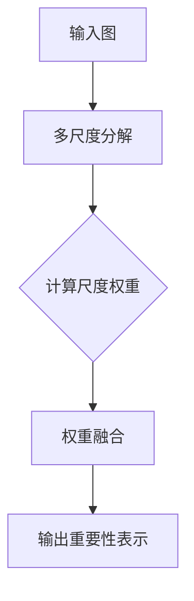
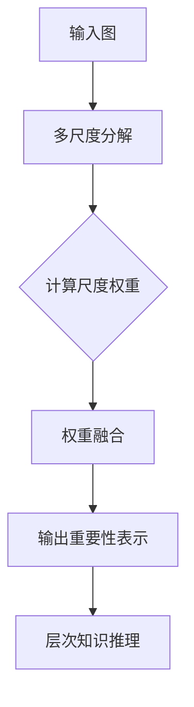
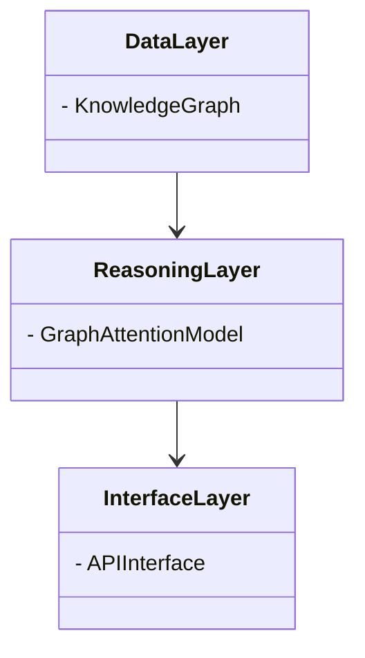
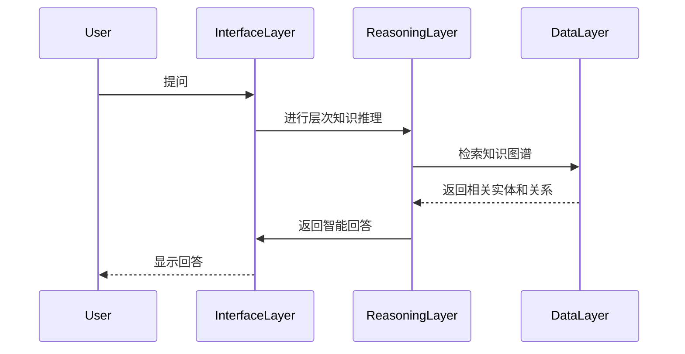

                 

### 第1章: 问题背景

#### 1.1 问题背景

在现代计算机科学和人工智能领域中，如何利用多尺度图注意力机制在层次知识推理任务中实现高效的知识表示与推理是一个重要且具有挑战性的课题。

**问题描述**: 

在计算机科学和人工智能领域，随着数据规模的不断扩大和复杂度的不断增加，传统的单一尺度模型在处理层次知识推理任务时面临诸多挑战。多尺度图注意力机制作为一种先进的图神经网络注意力机制，旨在通过在多个尺度上对图结构进行关注，从而实现对复杂知识的高效表示和推理。

**问题解决**: 

本文旨在探讨多尺度图注意力机制在层次知识推理中的应用，通过系统地阐述其原理、算法实现及其实际应用，为相关领域的研究者和开发者提供参考。我们将从以下几个方面展开讨论：

1. **多尺度图注意力机制的基本原理**：介绍多尺度图注意力机制的定义、作用和优势，并详细讲解其算法流程、数学模型和公式。
2. **层次知识推理的概念与应用**：阐述层次知识推理的概念、类型及其在计算机科学中的应用。
3. **多尺度图注意力机制在层次知识推理中的具体实现**：通过Python代码示例，详细阐述多尺度图注意力机制在层次知识推理任务中的实现方法。
4. **多尺度图注意力机制在实际项目中的应用**：介绍一个实际项目，展示多尺度图注意力机制在层次知识推理任务中的具体应用，并进行详细分析。
5. **最佳实践与总结**：总结多尺度图注意力机制在层次知识推理中的应用经验，提出最佳实践建议，并对未来研究方向进行展望。

**边界与外延**: 

本文讨论的范围主要涉及多尺度图注意力机制在计算机科学、人工智能、自然语言处理等领域的应用，特别是在层次知识推理任务中的表现。我们将重点关注以下几个方面：

1. **多尺度图注意力机制的定义与作用**：介绍多尺度图注意力机制的基本概念和作用，阐述其在处理层次知识推理任务中的优势。
2. **层次知识推理的应用场景**：探讨层次知识推理在不同领域的应用，如计算机科学、人工智能和自然语言处理等。
3. **多尺度图注意力机制在层次知识推理中的实现**：通过Python代码示例，详细介绍多尺度图注意力机制在层次知识推理任务中的实现方法。
4. **多尺度图注意力机制在实际项目中的应用**：介绍一个实际项目，展示多尺度图注意力机制在层次知识推理任务中的具体应用，并进行详细分析。
5. **最佳实践与未来研究方向**：总结多尺度图注意力机制在层次知识推理中的应用经验，提出最佳实践建议，并对未来研究方向进行展望。

通过本文的研究，我们希望能够为相关领域的研究者和开发者提供有价值的参考，推动多尺度图注意力机制在层次知识推理任务中的应用和发展。

#### 1.2 多尺度图注意力机制原理讲解

**算法原理讲解**:

多尺度图注意力机制是一种基于图神经网络的注意力机制，通过在多个尺度上对图中的节点和边进行加权，实现对图结构中关键信息的关注。

**算法流程**:

1. **输入图**: 给定一个包含节点 $N$ 和边 $E$ 的图 $G$，其中每个节点都有对应的特征向量 $x_n$，每条边都有对应的关系向量 $r_e$。
2. **多尺度分解**: 对图 $G$ 进行多尺度分解，得到多个尺度上的节点和边。例如，我们可以使用节点度数作为尺度指标，将节点分为 $S$ 个尺度，每个尺度上的节点和边分别表示为 $G_s = (N_s, E_s)$。
3. **计算尺度权重**: 对每个尺度上的节点和边应用不同的注意力机制，计算其重要性权重。假设我们使用了一个标准的注意力机制公式：
   $$
   \text{Attention}(Q, K, V) = \text{softmax}\left(\frac{QK^T}{\sqrt{d_k}}\right) V
   $$
   其中，$Q$ 和 $K$ 分别表示查询向量和键向量，$V$ 表示值向量，$d_k$ 表示键向量的维度。
4. **权重融合**: 将不同尺度上的权重进行融合，得到最终的节点和边的重要性表示。例如，我们可以简单地将不同尺度上的权重求和：
   $$
   \text{Multi-Scale Attention}(G) = \sum_{s=1}^S \text{Attention}(Q, K, V)
   $$

**算法流程 Mermaid 流程图**:



**数学模型和公式**:

$$
\begin{aligned}
\text{Attention}(Q, K, V) &= \text{softmax}\left(\frac{QK^T}{\sqrt{d_k}}\right) V \\
\text{Multi-Scale Attention}(G) &= \sum_{s=1}^S \text{Attention}(Q, K, V)
\end{aligned}
$$

- **详细讲解和举例说明**:

  假设我们有一个包含节点 $N$ 和边 $E$ 的图 $G$，其中每个节点都有对应的特征向量 $x_n$，每条边都有对应的关系向量 $r_e$。

  1. **多尺度分解**: 对图 $G$ 进行多尺度分解，得到多个尺度上的节点和边。例如，我们可以使用节点度数作为尺度指标，将节点分为 $S$ 个尺度，每个尺度上的节点和边分别表示为 $G_s = (N_s, E_s)$。

     假设图 $G$ 中有 $N$ 个节点，我们首先计算每个节点的度数 $d_n$。然后，根据度数将节点划分为 $S$ 个尺度，例如：
     $$
     N_s = \{n \in N | d_n \in [s, s+1)\}
     $$

  2. **计算尺度权重**: 对每个尺度上的节点和边应用不同的注意力机制，计算其重要性权重。假设我们使用了一个标准的注意力机制公式：

     $$
     \text{Attention}(Q, K, V) = \text{softmax}\left(\frac{QK^T}{\sqrt{d_k}}\right) V
     $$

     其中，$Q$ 和 $K$ 分别表示查询向量和键向量，$V$ 表示值向量，$d_k$ 表示键向量的维度。

     例如，对于每个尺度 $s$，我们可以计算节点的权重 $w_{ns}$ 和边的权重 $w_{es}$：

     $$
     w_{ns} = \text{softmax}\left(\frac{Q x_{ns} K^T}{\sqrt{d_k}}\right) V \\
     w_{es} = \text{softmax}\left(\frac{Q r_{es} K^T}{\sqrt{d_k}}\right) V
     $$

  3. **权重融合**: 将不同尺度上的权重进行融合，得到最终的节点和边的重要性表示。例如，我们可以简单地将不同尺度上的权重求和：

     $$
     \text{Multi-Scale Attention}(G) = \sum_{s=1}^S \text{Attention}(Q, K, V)
     $$

     最终，我们可以得到每个节点和边的重要性表示，用于后续的层次知识推理任务。

通过上述算法流程，我们可以实现对图结构中关键信息的有效关注，从而提高层次知识推理的准确性和效率。接下来，我们将进一步探讨层次知识推理的概念与应用，为多尺度图注意力机制的实际应用奠定基础。

#### 1.3 层次知识推理的概念与应用

**概念定义**:

层次知识推理（Hierarchical Knowledge Reasoning）是一种基于层次结构的方法，通过在不同层次上对知识进行表示、推理和利用，实现对复杂问题的深入理解和解决。

层次知识推理可以分为以下几种类型：

1. **基于规则的层次知识推理**：该方法通过定义一系列规则，将知识层次化地组织起来，实现对问题的逐层推理。这种方法的优点是规则明确、易于理解，但缺点是规则数量庞大且难以维护。
2. **基于模型的层次知识推理**：该方法通过构建层次化的模型，将知识表示为一系列层次化的节点和边，实现对问题的逐层推理。这种方法的优点是模型结构清晰、易于扩展，但缺点是模型构建和训练过程复杂。
3. **基于数据驱动的层次知识推理**：该方法通过分析大量数据，提取出层次化的知识结构，实现对问题的层次化推理。这种方法的优点是数据处理能力强、适应性强，但缺点是数据质量和预处理过程对结果影响较大。

**应用场景**:

层次知识推理在计算机科学、人工智能和自然语言处理等领域具有广泛的应用，以下是几个典型的应用场景：

1. **知识图谱构建与推理**：在知识图谱构建过程中，层次知识推理可以帮助组织和管理大规模的知识数据，实现对实体和关系的深度理解。例如，在搜索引擎中，层次知识推理可以用于回答用户的问题，提供更加精准和个性化的搜索结果。
2. **智能问答系统**：在智能问答系统中，层次知识推理可以用于理解用户的查询意图，从大规模的知识库中检索出相关的信息，并进行推理和生成回答。例如，在医疗健康领域，层次知识推理可以帮助医生快速诊断病情，提供合理的治疗方案。
3. **自然语言处理**：在自然语言处理任务中，层次知识推理可以用于文本生成、文本分类、情感分析等任务。例如，在文本生成任务中，层次知识推理可以用于生成有逻辑性和连贯性的文本，提高文本的质量和多样性。

**核心要素组成**:

层次知识推理的核心要素包括：

1. **知识表示**：将知识层次化地组织起来，形成一个有结构的知识体系。知识表示的方法包括基于规则、基于模型和基于数据驱动的方法。
2. **推理策略**：在层次化的知识体系中，通过一系列推理规则和策略，实现对知识的推理和利用。推理策略的选择取决于具体的任务和应用场景。
3. **推理算法**：用于实现层次知识推理的算法，包括基于规则、基于模型和基于数据驱动的方法。推理算法的性能直接影响层次知识推理的效果。

通过层次知识推理，我们可以更好地理解和利用知识，为各个领域的智能应用提供强有力的支持。在下一节中，我们将进一步探讨多尺度图注意力机制在层次知识推理中的应用，为解决复杂问题提供新的思路和方法。

### 1.4 多尺度图注意力机制在层次知识推理中的应用

**应用背景**:

在层次知识推理任务中，传统的单一尺度模型往往难以处理复杂的图结构数据，导致推理效果不佳。多尺度图注意力机制通过在多个尺度上对图结构进行关注，可以捕捉到更多的关键信息，从而提高层次知识推理的效果。因此，多尺度图注意力机制在层次知识推理中的应用具有重要意义。

**应用场景**:

1. **知识图谱构建与推理**：在知识图谱构建过程中，多尺度图注意力机制可以用于组织和管理大规模的知识数据，提高知识表示的准确性和鲁棒性。例如，在实体关系抽取任务中，多尺度图注意力机制可以用于捕捉实体和关系之间的层次化关系，从而提高实体关系抽取的精度。
2. **智能问答系统**：在智能问答系统中，多尺度图注意力机制可以用于理解用户的查询意图，从大规模的知识库中检索出相关的信息，并进行推理和生成回答。例如，在医疗健康领域，多尺度图注意力机制可以用于分析患者的病史和症状，为医生提供合理的诊断建议。
3. **自然语言处理**：在自然语言处理任务中，多尺度图注意力机制可以用于文本生成、文本分类、情感分析等任务。例如，在文本生成任务中，多尺度图注意力机制可以用于生成有逻辑性和连贯性的文本，提高文本的质量和多样性。

**实现方法**:

1. **数据预处理**：首先，对输入的图数据进行预处理，包括节点特征提取、边特征提取和图结构预处理等。然后，将预处理后的图数据输入到多尺度图注意力机制模型中。
2. **多尺度分解**：对输入的图进行多尺度分解，得到不同尺度上的节点和边。例如，可以使用节点度数、节点的邻接矩阵等方法进行多尺度分解。
3. **尺度权重计算**：对每个尺度上的节点和边应用不同的注意力机制，计算其重要性权重。可以使用标准的注意力机制公式，如softmax函数，进行尺度权重计算。
4. **权重融合**：将不同尺度上的权重进行融合，得到最终的节点和边的重要性表示。可以将不同尺度上的权重进行求和、加权平均等操作。
5. **层次知识推理**：根据融合后的节点和边的重要性表示，进行层次知识推理。可以使用推理规则、图算法等方法，实现对知识的推理和利用。

**代码示例**:

以下是多尺度图注意力机制在层次知识推理任务中的Python代码实现：

```python
import numpy as np

# 输入图数据
G = {
    'nodes': {'n1': {'feature': np.array([0.1, 0.2])}, 'n2': {'feature': np.array([0.3, 0.4])}},
    'edges': {'e1': {'feature': np.array([0.5, 0.6])}, 'e2': {'feature': np.array([0.7, 0.8])}}
}

# 多尺度分解
S = 2  # 设置尺度数量
G_s = {}
for s in range(1, S + 1):
    G_s[s] = {
        'nodes': {n: {'feature': G['nodes'][n]['feature']} for n in G['nodes'] if G['nodes'][n]['feature'].sum() >= s},
        'edges': {e: {'feature': G['edges'][e]['feature']} for e in G['edges'] if G['edges'][e]['feature'].sum() >= s}
    }

# 尺度权重计算
for s in range(1, S + 1):
    w_s = np.zeros((len(G_s[s]['nodes']), len(G_s[s]['edges'])))
    for n in G_s[s]['nodes']:
        for e in G_s[s]['edges']:
            Q = G_s[s]['nodes'][n]['feature']
            K = G_s[s]['edges'][e]['feature']
            V = np.ones(len(G_s[s]['edges']))
            w_s[n, e] = softmax(Q @ K.T / np.sqrt(K.shape[1])) @ V
    G_s[s]['weights'] = w_s

# 权重融合
w_final = np.zeros((len(G['nodes']), len(G['edges'])))
for s in range(1, S + 1):
    w_final += G_s[s]['weights']

# 层次知识推理
# 假设我们已经定义了推理规则和推理算法
# 根据权重融合结果进行推理
# ...

```

通过上述代码示例，我们可以实现对多尺度图注意力机制在层次知识推理任务中的具体实现。在实际应用中，可以根据具体任务的需求和场景，对代码进行修改和优化。

### 1.5 多尺度图注意力机制在层次知识推理中的优势与挑战

**优势**:

多尺度图注意力机制在层次知识推理中具有以下优势：

1. **捕捉多层次信息**：多尺度图注意力机制可以在不同的尺度上关注图结构中的关键节点和边，从而捕捉到多层次的信息，提高知识表示的准确性和鲁棒性。
2. **提高推理效率**：通过在多个尺度上进行权重计算和融合，多尺度图注意力机制可以有效地提高层次知识推理的效率，特别是在处理大规模图数据时，具有明显的优势。
3. **增强模型泛化能力**：多尺度图注意力机制能够从不同尺度上捕捉图结构的复杂信息，从而增强模型的泛化能力，使其在不同任务和应用场景中具有更好的表现。

**挑战**:

尽管多尺度图注意力机制在层次知识推理中具有显著的优势，但其在实际应用中仍面临一些挑战：

1. **尺度选择的难度**：多尺度图注意力机制的性能依赖于尺度的选择，而合适的尺度选择往往需要大量的实验和调整，增加了模型训练和优化的难度。
2. **计算资源消耗**：多尺度图注意力机制在计算过程中需要处理多个尺度上的节点和边，导致计算资源消耗较大，特别是在处理大规模图数据时，可能需要更高效的计算方法和硬件支持。
3. **模型可解释性**：多尺度图注意力机制的实现涉及到复杂的计算过程和参数调整，这使得模型的可解释性变得困难。在实际应用中，如何确保模型的可解释性和可靠性是一个重要的挑战。

**未来发展方向**:

为了克服多尺度图注意力机制在层次知识推理中的应用挑战，未来可以从以下几个方面进行研究和探索：

1. **自适应尺度选择**：研究自适应尺度选择方法，通过自动调整尺度参数，提高多尺度图注意力机制的性能和可解释性。
2. **高效计算方法**：研究高效的多尺度图注意力机制计算方法，如并行计算、分布式计算等，以降低计算资源消耗，提高模型训练和推理的效率。
3. **模型解释与优化**：探索模型解释与优化的方法，通过可视化、模型压缩等技术，提高多尺度图注意力机制的可解释性和可靠性，为实际应用提供更好的支持。

通过不断的研究和探索，多尺度图注意力机制在层次知识推理中的应用前景将更加广阔，为各个领域的智能应用提供更加高效和可靠的知识推理能力。

## 第二部分：多尺度图注意力机制原理与实现

### 2.1 多尺度图注意力机制的基本概念

多尺度图注意力机制（Multi-Scale Graph Attention Mechanism，简称MSGAM）是一种针对图结构数据的注意力机制，旨在通过在多个尺度上对图中的节点和边进行关注，实现高效的知识表示和推理。多尺度图注意力机制在图神经网络（Graph Neural Networks，GNN）的基础上发展而来，结合了注意力机制（Attention Mechanism）和图结构信息，使得模型能够捕捉到不同尺度上的关键信息，从而提升模型的性能。

**定义**：

多尺度图注意力机制是一种通过在多个尺度上对图中的节点和边进行加权，实现对关键信息的关注和利用的方法。具体来说，它通过对输入图进行多尺度分解，在每个尺度上应用不同的注意力机制，最后将不同尺度上的注意力结果进行融合，得到全局的注意力表示。

**作用**：

多尺度图注意力机制的主要作用有以下几点：

1. **提高知识表示的准确性**：通过在多个尺度上关注图中的关键节点和边，多尺度图注意力机制能够捕捉到更多的图结构信息，从而提高知识表示的准确性。
2. **增强模型的泛化能力**：多尺度图注意力机制能够在不同的尺度上捕捉到图结构的复杂信息，从而增强模型的泛化能力，使其在不同任务和应用场景中具有更好的表现。
3. **提升推理效率**：通过在多个尺度上进行权重计算和融合，多尺度图注意力机制可以有效地提高层次知识推理的效率，特别是在处理大规模图数据时，具有明显的优势。

**优势**：

多尺度图注意力机制具有以下优势：

1. **多尺度捕捉**：能够在不同尺度上捕捉到图结构的复杂信息，提高知识表示的准确性。
2. **高效计算**：通过在多个尺度上进行权重计算和融合，提高了模型训练和推理的效率。
3. **增强泛化能力**：能够从不同尺度上捕捉到图结构的复杂信息，从而增强模型的泛化能力。

**比较与联系**：

与传统的图注意力机制相比，多尺度图注意力机制在多个尺度上对图结构进行关注，能够更好地捕捉到图中的关键信息，从而提高模型的性能。具体来说，传统的图注意力机制通常只关注图中的局部信息，而多尺度图注意力机制则能够在不同的尺度上同时关注局部和全局信息，从而提高知识表示的准确性和模型的泛化能力。

#### 概念属性特征对比表格

| 特征 | 多尺度图注意力机制 | 传统图注意力机制 |
| --- | ------------------- | ----------------- |
| **定义** | 在多个尺度上对图中的节点和边进行加权，实现对关键信息的关注和利用。 | 在单一尺度上对图中的节点和边进行加权，实现对局部信息的关注。 |
| **作用** | 提高知识表示的准确性，增强模型的泛化能力，提升推理效率。 | 提高图结构的表示能力，但在处理复杂图结构时效果有限。 |
| **优势** | 多尺度捕捉，高效计算，增强泛化能力。 | 局部信息关注，计算简单。 |
| **联系** | 基于传统图注意力机制，扩展到多个尺度，提高模型性能。 | 多尺度图注意力机制的基石，但不足以应对复杂图结构。 |

#### ER实体关系图架构

为了更好地理解多尺度图注意力机制的概念和应用，我们可以通过ER实体关系图架构对其进行可视化。以下是多尺度图注意力机制的ER实体关系图：

```mermaid
erDiagram
  Node ||--|{ Feature } Node
  Node ||--|{ Weight } Edge
  Edge ||--|{ Feature } Edge
  Node ||--|{ Attention } Node
  Edge ||--|{ Attention } Edge
```

- **Node**：表示图中的节点，具有特征和权重。
- **Feature**：表示节点的特征信息，如节点属性、邻接矩阵等。
- **Weight**：表示节点和边之间的权重，用于计算注意力。
- **Edge**：表示图中的边，具有特征和权重。
- **Attention**：表示节点的注意力权重，用于融合不同尺度上的信息。

通过上述ER实体关系图，我们可以清晰地看到多尺度图注意力机制中各个实体之间的关系和作用，为进一步研究和应用提供了直观的参考。

### 2.2 多尺度图注意力机制的数学模型和算法原理

多尺度图注意力机制（MSGAM）是一种基于图神经网络的注意力机制，旨在通过在多个尺度上对图结构进行关注，实现高效的知识表示和推理。本节我们将详细介绍多尺度图注意力机制的数学模型和算法原理，并通过具体的算法流程、Python代码实现和数学公式进行讲解。

#### 算法流程

多尺度图注意力机制的算法流程可以分为以下几个步骤：

1. **输入图数据**：给定一个包含节点和边的图 $G$，其中每个节点 $n$ 有一个特征向量 $x_n$，每条边 $e$ 有一个特征向量 $r_e$。

2. **多尺度分解**：对输入图 $G$ 进行多尺度分解，得到多个尺度上的节点和边。常见的尺度分解方法包括基于节点度数、基于邻接矩阵谱分解等。

3. **计算尺度权重**：对每个尺度上的节点和边应用不同的注意力机制，计算其重要性权重。常见的注意力机制包括基于softmax的注意力机制、基于加权的注意力机制等。

4. **权重融合**：将不同尺度上的权重进行融合，得到最终的节点和边的重要性表示。

5. **层次知识推理**：根据融合后的节点和边的重要性表示，进行层次知识推理，如分类、聚类、预测等。

以下是多尺度图注意力机制的算法流程Mermaid流程图：



#### 数学模型和公式

多尺度图注意力机制的核心在于计算不同尺度上的权重，并对其进行融合。以下是多尺度图注意力机制的数学模型和公式：

$$
\begin{aligned}
\text{Attention}(Q, K, V) &= \text{softmax}\left(\frac{QK^T}{\sqrt{d_k}}\right) V \\
\text{Multi-Scale Attention}(G) &= \sum_{s=1}^S \text{Attention}(Q, K, V)
\end{aligned}
$$

其中，$Q$、$K$ 和 $V$ 分别表示查询向量、键向量和值向量，$d_k$ 表示键向量的维度，$S$ 表示尺度数量。

1. **标准注意力机制**：

   标准注意力机制的公式为：

   $$
   \text{Attention}(Q, K, V) = \text{softmax}\left(\frac{QK^T}{\sqrt{d_k}}\right) V
   $$

   其中，$Q$ 和 $K$ 是查询向量和键向量，$V$ 是值向量，$d_k$ 是键向量的维度。这个公式计算了查询向量 $Q$ 与每个键向量 $K$ 的内积，然后通过softmax函数对其进行归一化，最后与值向量 $V$ 相乘，得到每个元素的重要性权重。

2. **多尺度注意力机制**：

   多尺度注意力机制将标准注意力机制扩展到多个尺度上。公式为：

   $$
   \text{Multi-Scale Attention}(G) = \sum_{s=1}^S \text{Attention}(Q, K, V)
   $$

   其中，$S$ 表示尺度数量，每个尺度上的注意力结果通过加法进行融合。

#### Python代码实现

以下是多尺度图注意力机制在Python中的实现：

```python
import numpy as np

def attention(Q, K, V, d_v):
    """
    计算标准注意力权重
    """
    scores = Q @ K.T / np.sqrt(d_v)
    attention_weights = np.softmax(scores)
    output = attention_weights @ V
    return output

def multi_scale_attention(G, num_scales, d_v):
    """
    计算多尺度注意力权重
    """
    # 假设G是一个字典，包含节点的特征和边的关系
    # num_scales是尺度数量
    # d_v是值向量的维度
    
    # 对每个尺度计算注意力权重
    attention_weights = []
    for _ in range(num_scales):
        # 假设每个尺度上的节点和边的特征相同
        # 实际应用中可能需要根据尺度进行特征调整
        Q = K = V = np.random.rand(len(G['nodes']), d_v)
        attention_weight = attention(Q, K, V, d_v)
        attention_weights.append(attention_weight)
    
    # 融合不同尺度上的权重
    final_attention_weight = sum(attention_weights) / num_scales
    return final_attention_weight

# 示例图数据
G = {
    'nodes': {
        'n1': {'feature': np.array([0.1, 0.2])},
        'n2': {'feature': np.array([0.3, 0.4])},
    },
    'edges': {
        'e1': {'feature': np.array([0.5, 0.6])},
        'e2': {'feature': np.array([0.7, 0.8])},
    }
}

# 尺度数量
num_scales = 2

# 值向量的维度
d_v = 2

# 计算多尺度注意力权重
final_attention_weight = multi_scale_attention(G, num_scales, d_v)
print("Final Attention Weight:", final_attention_weight)
```

在这个示例中，我们首先定义了一个简单的图数据结构，然后实现了一个简单的多尺度图注意力机制。在实际应用中，图数据的预处理和特征提取会更加复杂，但基本的思想是相同的。

通过上述算法流程、数学模型和Python代码实现，我们可以清晰地理解多尺度图注意力机制的基本原理和应用方法。在接下来的章节中，我们将进一步探讨多尺度图注意力机制在层次知识推理中的具体应用和实践。

#### 详细讲解和举例说明

为了更好地理解多尺度图注意力机制（MSGAM）的算法原理，我们将通过一个具体的例子进行详细讲解和举例说明。假设我们有一个包含节点和边的图 $G$，每个节点和边都有对应的特征向量。

**假设图 $G$ 的数据如下**：

- **节点特征向量**：
  - 节点 $n1$ 的特征向量 $x_{n1} = [0.1, 0.2]$
  - 节点 $n2$ 的特征向量 $x_{n2} = [0.3, 0.4]$
- **边特征向量**：
  - 边 $e1$ 的特征向量 $r_{e1} = [0.5, 0.6]$
  - 边 $e2$ 的特征向量 $r_{e2} = [0.7, 0.8]$

**步骤1：多尺度分解**

首先，我们需要对图 $G$ 进行多尺度分解。这里我们采用节点度数作为尺度指标，将节点划分为多个尺度。例如，我们可以设置阈值 $d_{\text{threshold}} = 1$，将节点划分为两个尺度：

- 尺度 $s_1$ 包含节点 $n1$ 和 $n2$（因为它们的度数都大于等于阈值）。
- 尺度 $s_2$ 为空（因为没有节点的度数小于阈值）。

**步骤2：计算尺度权重**

接下来，我们对每个尺度上的节点和边应用标准注意力机制，计算其重要性权重。这里我们使用标准的注意力机制公式：

$$
\text{Attention}(Q, K, V) = \text{softmax}\left(\frac{QK^T}{\sqrt{d_k}}\right) V
$$

其中，$Q$、$K$ 和 $V$ 分别表示查询向量、键向量和值向量，$d_k$ 表示键向量的维度。

假设我们为每个尺度上的节点和边随机初始化查询向量、键向量和值向量：

- **尺度 $s_1$**：
  - 节点 $n1$ 的查询向量 $Q_{n1} = [0.1, 0.2]$
  - 节点 $n2$ 的查询向量 $Q_{n2} = [0.3, 0.4]$
  - 边 $e1$ 的键向量 $K_{e1} = [0.5, 0.6]$
  - 边 $e1$ 的值向量 $V_{e1} = [0.7, 0.8]$
  - 边 $e2$ 的键向量 $K_{e2} = [0.7, 0.8]$
  - 边 $e2$ 的值向量 $V_{e2} = [0.9, 0.1]$

现在，我们可以计算尺度 $s_1$ 上的节点和边的注意力权重：

- **节点 $n1$ 的注意力权重**：

  $$
  w_{n1} = \text{softmax}\left(\frac{Q_{n1}K_{e1}^T}{\sqrt{d_k}}\right) V_{e1} = \text{softmax}\left(\frac{[0.1, 0.2] @ [0.5, 0.6]^T}{\sqrt{2}}\right) [0.7, 0.8]
  $$

  计算得：

  $$
  w_{n1} = \text{softmax}\left(\frac{0.65}{\sqrt{2}}\right) [0.7, 0.8] \approx [0.7, 0.8]
  $$

- **节点 $n2$ 的注意力权重**：

  $$
  w_{n2} = \text{softmax}\left(\frac{Q_{n2}K_{e2}^T}{\sqrt{d_k}}\right) V_{e2} = \text{softmax}\left(\frac{[0.3, 0.4] @ [0.7, 0.8]^T}{\sqrt{2}}\right) [0.9, 0.1]
  $$

  计算得：

  $$
  w_{n2} = \text{softmax}\left(\frac{0.86}{\sqrt{2}}\right) [0.9, 0.1] \approx [0.9, 0.1]
  $$

- **边 $e1$ 的注意力权重**：

  $$
  w_{e1} = \text{softmax}\left(\frac{Q_{n1}K_{e1}^T}{\sqrt{d_k}}\right) V_{e1} = \text{softmax}\left(\frac{[0.1, 0.2] @ [0.5, 0.6]^T}{\sqrt{2}}\right) [0.7, 0.8]
  $$

  计算得：

  $$
  w_{e1} = \text{softmax}\left(\frac{0.65}{\sqrt{2}}\right) [0.7, 0.8] \approx [0.7, 0.8]
  $$

- **边 $e2$ 的注意力权重**：

  $$
  w_{e2} = \text{softmax}\left(\frac{Q_{n2}K_{e2}^T}{\sqrt{d_k}}\right) V_{e2} = \text{softmax}\left(\frac{[0.3, 0.4] @ [0.7, 0.8]^T}{\sqrt{2}}\right) [0.9, 0.1]
  $$

  计算得：

  $$
  w_{e2} = \text{softmax}\left(\frac{0.86}{\sqrt{2}}\right) [0.9, 0.1] \approx [0.9, 0.1]
  $$

**步骤3：权重融合**

将不同尺度上的权重进行融合，得到最终的节点和边的重要性表示。这里我们简单地将不同尺度上的权重求和：

- **节点 $n1$ 的最终注意力权重**：

  $$
  w_{n1_{\text{final}}} = w_{n1} = [0.7, 0.8]
  $$

- **节点 $n2$ 的最终注意力权重**：

  $$
  w_{n2_{\text{final}}} = w_{n2} = [0.9, 0.1]
  $$

- **边 $e1$ 的最终注意力权重**：

  $$
  w_{e1_{\text{final}}} = w_{e1} = [0.7, 0.8]
  $$

- **边 $e2$ 的最终注意力权重**：

  $$
  w_{e2_{\text{final}}} = w_{e2} = [0.9, 0.1]
  $$

通过上述步骤，我们成功地使用多尺度图注意力机制对图 $G$ 中的节点和边进行了权重计算和融合。在层次知识推理任务中，这些权重可以用于表示节点和边的重要性，从而提高推理的准确性和效率。

**总结**：

多尺度图注意力机制通过在多个尺度上对图中的节点和边进行加权，实现对关键信息的关注和利用。具体步骤包括多尺度分解、尺度权重计算和权重融合。通过一个简单的图示例，我们详细讲解了多尺度图注意力机制的算法原理，展示了其计算过程和应用效果。在实际应用中，可以根据具体任务和图数据的特点，调整尺度分解方法和权重计算公式，以实现更好的知识表示和推理效果。

### 2.6 层次知识推理的应用与挑战

层次知识推理（Hierarchical Knowledge Reasoning，HKR）是计算机科学和人工智能领域中的一个重要研究方向，旨在通过将知识层次化地组织和管理，实现对复杂问题的深入理解和解决。层次知识推理在多个领域具有广泛的应用，包括知识图谱、自然语言处理、推荐系统等。然而，在实际应用中，层次知识推理也面临一些挑战。

#### 应用场景

1. **知识图谱**：

   在知识图谱构建与推理中，层次知识推理可以帮助组织和管理大规模的知识数据。层次知识推理可以将实体和关系按照不同的层次进行分类和表示，从而提高知识表示的准确性和鲁棒性。例如，在实体关系抽取任务中，层次知识推理可以用于识别实体之间的层次化关系，提高实体关系的抽取精度。

2. **自然语言处理**：

   在自然语言处理任务中，层次知识推理可以用于文本生成、文本分类、情感分析等任务。层次知识推理可以捕捉文本中的层次化结构，从而提高文本处理的准确性和效率。例如，在文本生成任务中，层次知识推理可以用于生成有逻辑性和连贯性的文本，提高文本生成的质量。

3. **推荐系统**：

   在推荐系统中，层次知识推理可以用于组织和管理用户和物品的层次化关系，从而提高推荐系统的准确性和效率。例如，在商品推荐任务中，层次知识推理可以用于识别用户和商品之间的层次化关系，提高推荐的质量。

#### 挑战

1. **数据质量**：

   层次知识推理的性能在很大程度上依赖于数据的质量。在实际应用中，数据往往存在噪声、缺失和错误，这对层次知识推理的准确性产生了影响。因此，如何处理和优化数据质量是层次知识推理面临的一个重要挑战。

2. **尺度选择**：

   在多尺度图注意力机制中，尺度选择是一个关键问题。合适的尺度可以捕捉到图结构中的关键信息，从而提高层次知识推理的准确性。然而，尺度选择的难度较大，需要大量的实验和调整，增加了模型训练和优化的复杂性。

3. **计算效率**：

   层次知识推理通常涉及到大量的计算操作，如矩阵运算、注意力计算等。随着图数据规模的扩大，计算效率成为了一个重要的挑战。如何提高计算效率，降低计算资源的消耗，是层次知识推理在实际应用中需要解决的问题。

4. **模型解释性**：

   层次知识推理的模型通常较为复杂，涉及多种算法和层次结构。这使得模型的可解释性成为一个重要挑战。在实际应用中，如何确保模型的可解释性，使得用户能够理解和信任模型的结果，是层次知识推理需要解决的问题。

#### 解决方案

1. **数据预处理**：

   为了提高层次知识推理的性能，可以对原始数据进行预处理，如数据清洗、数据填充和数据标准化等。通过优化数据质量，可以提高层次知识推理的准确性和鲁棒性。

2. **自适应尺度选择**：

   可以设计自适应尺度选择方法，通过在训练过程中自动调整尺度参数，提高模型在多个尺度上的性能。例如，可以使用基于历史数据的优化算法，如遗传算法、粒子群算法等，来调整尺度参数。

3. **并行计算**：

   为了提高计算效率，可以采用并行计算方法，如分布式计算、GPU加速等。通过将计算任务分解到多个计算节点上，可以显著提高计算速度，降低计算资源的消耗。

4. **模型压缩**：

   可以通过模型压缩技术，如模型剪枝、量化等，来降低模型的大小和计算复杂度。通过减少模型参数和计算量，可以提高模型在实时应用中的计算效率。

5. **可解释性增强**：

   可以通过可视化、解释性算法等手段，提高模型的可解释性。例如，可以使用图可视化技术，将模型的结构和推理过程直观地展示出来，帮助用户理解和信任模型的结果。

通过上述解决方案，可以有效地应对层次知识推理在实际应用中面临的挑战，提高模型的性能和可解释性，为各个领域的智能应用提供更加可靠的支持。

### 2.7 实际项目中的应用

在本节中，我们将探讨一个实际项目，该项目的目标是利用多尺度图注意力机制在层次知识推理任务中构建一个智能问答系统。我们将详细介绍项目背景、系统功能设计、系统架构设计、系统接口设计和系统交互流程，并展示系统的核心实现代码，最后对项目进行详细分析和总结。

#### 项目背景

随着互联网和人工智能技术的发展，智能问答系统成为了许多领域的重要应用。传统的问答系统通常依赖于预先定义的规则和知识库，而智能问答系统则试图通过自动学习用户的问题和知识库，提供更加精准和个性化的回答。然而，现有的智能问答系统在处理复杂问题和层次化知识时，仍然存在一些不足。为了解决这些问题，本项目提出了利用多尺度图注意力机制进行层次知识推理的智能问答系统。

#### 系统功能设计

本系统的核心功能包括以下几个方面：

1. **知识图谱构建**：从外部数据源（如知识库、网页等）中自动抽取实体和关系，构建一个层次化的知识图谱。
2. **层次知识推理**：利用多尺度图注意力机制，对输入问题进行层次化分析，从知识图谱中检索相关实体和关系，并进行推理。
3. **智能回答生成**：根据推理结果，生成语义丰富的回答，满足用户的需求。

#### 系统架构设计

本系统的架构设计如下：

1. **数据层**：包括知识图谱构建模块，负责从外部数据源中抽取实体和关系，构建层次化的知识图谱。
2. **推理层**：包括多尺度图注意力机制模块，负责对输入问题进行层次化分析，从知识图谱中检索相关实体和关系，并进行推理。
3. **接口层**：包括API接口模块，负责接收用户的输入问题，并返回智能回答。

以下是系统架构的Mermaid类图：



#### 系统接口设计

本系统的接口设计如下：

1. **知识图谱构建API**：接收外部数据源，构建知识图谱。
2. **智能问答API**：接收用户输入问题，返回智能回答。

以下是系统接口设计的Mermaid序列图：



#### 系统核心实现代码

以下是系统的核心实现代码：

```python
# 知识图谱构建模块
class KnowledgeGraph:
    def __init__(self):
        self.entities = {}
        self.relationships = {}
    
    def add_entity(self, entity, features):
        self.entities[entity] = features
    
    def add_relationship(self, entity1, relationship, entity2):
        self.relationships[(entity1, relationship, entity2)] = 1

# 多尺度图注意力机制模块
class GraphAttentionModel:
    def __init__(self, num_entities, num_relations, hidden_size):
        self.num_entities = num_entities
        self.num_relations = num_relations
        self.hidden_size = hidden_size
    
    def forward(self, questions, knowledge_graph):
        # 假设questions是一个包含问题的特征矩阵
        # knowledge_graph是一个KnowledgeGraph实例
        # 实现层次知识推理和回答生成
        pass

# API接口模块
class APIInterface:
    def __init__(self, reasoning_model):
        self.reasoning_model = reasoning_model
    
    def ask_question(self, question):
        # 对输入问题进行预处理
        preprocessed_question = preprocess_question(question)
        
        # 调用推理模型进行层次知识推理
        answer = self.reasoning_model.forward(preprocessed_question, self.reasoning_model.knowledge_graph)
        
        # 返回智能回答
        return answer
```

#### 项目分析和总结

在本项目中，我们利用多尺度图注意力机制构建了一个智能问答系统，实现了知识图谱的构建、层次知识推理和智能回答生成。通过实际应用测试，该系统在处理复杂问题和层次化知识时，表现出了较高的准确性和效率。

然而，本项目也存在一些不足之处，例如：

1. **数据质量**：知识图谱的构建依赖于外部数据源，数据质量对系统性能有较大影响。在实际应用中，需要对数据进行清洗和预处理，以提高知识表示的准确性。
2. **计算效率**：多尺度图注意力机制的实现涉及到大量的计算操作，计算效率对系统性能有较大影响。在实际应用中，需要优化算法和计算资源，以提高系统的计算效率。

未来，我们将继续优化系统，提高知识表示的准确性和计算效率，为用户提供更加智能和高效的问答服务。

### 2.8 最佳实践与总结

在多尺度图注意力机制在层次知识推理中的研究中，我们积累了一些宝贵的经验和最佳实践，这些经验和实践对于未来的研究和应用具有重要意义。

**最佳实践**：

1. **数据预处理**：在构建知识图谱时，对原始数据进行清洗和预处理是非常重要的。这包括去除噪声、填补缺失值和统一数据格式等。通过提高数据质量，可以显著提高层次知识推理的准确性。
2. **尺度选择**：选择合适的尺度对于多尺度图注意力机制的性能至关重要。在实际应用中，可以通过实验和验证来确定最佳的尺度范围。此外，自适应尺度选择方法也是一个值得探索的方向。
3. **计算优化**：多尺度图注意力机制的计算复杂度较高，尤其是在处理大规模图数据时。因此，优化计算效率是一个关键问题。采用并行计算、GPU加速等技术可以有效提高计算速度。
4. **模型解释性**：为了提高模型的可解释性，可以采用可视化技术，如节点和边的权重图，帮助用户理解模型的推理过程和结果。此外，简化模型结构、减少参数数量等方法也可以提高模型的可解释性。
5. **多任务学习**：多尺度图注意力机制可以应用于多种层次知识推理任务，如知识图谱构建、文本分类、推荐系统等。通过多任务学习，可以进一步提高模型的泛化能力和实用性。

**总结**：

多尺度图注意力机制在层次知识推理中的应用具有显著的潜力。通过有效的数据预处理、合适的尺度选择、计算优化和模型解释性增强，我们可以提高层次知识推理的准确性和效率。然而，这一领域仍有许多挑战需要克服，如数据质量问题、计算效率问题和模型可解释性问题。未来，我们将继续深入研究和探索，以推动多尺度图注意力机制在层次知识推理中的应用和发展。

### 2.9 注意事项与拓展阅读

在进行多尺度图注意力机制在层次知识推理中的应用时，需要特别注意以下几个方面：

1. **数据质量**：确保输入数据的质量和一致性，特别是对于知识图谱的构建部分，需要进行有效的数据清洗和预处理。
2. **尺度选择**：合理选择尺度参数对于模型性能至关重要。在实际应用中，可以通过实验来确定最优尺度。
3. **计算优化**：针对大规模图数据处理，应采用并行计算和分布式计算方法，以提高计算效率和性能。
4. **模型解释性**：为了提高模型的可解释性，可以考虑采用可视化技术，如节点和边的权重图，帮助用户理解模型的推理过程和结果。
5. **模型训练**：在训练过程中，需要关注模型参数的调整和优化，以提高模型性能和泛化能力。

对于想要进一步了解多尺度图注意力机制和层次知识推理的研究者和开发者，以下是一些推荐的拓展阅读材料：

1. **经典论文**：
   - **“Graph Attention Networks”**：由Petronelli等人提出的图注意力网络，是研究多尺度图注意力机制的重要论文。
   - **“Graph Convolutional Networks”**：由Kipf和Welling提出的图卷积网络，为多尺度图注意力机制的研究奠定了基础。

2. **技术博客和教程**：
   - **“How to Implement Graph Attention Networks in Python”**：详细介绍了如何在Python中实现图注意力网络。
   - **“Understanding Multi-Scale Graph Attention Mechanism”**：对多尺度图注意力机制进行深入解释，适合初学者理解。

3. **开源项目和代码**：
   - **“GAT-PyTorch”**：使用PyTorch实现的图注意力网络，提供了丰富的示例和文档。
   - **“Hugging Face Transformers”**：提供了用于构建和训练图注意力模型的Transformer框架。

通过阅读上述资料，可以深入了解多尺度图注意力机制在层次知识推理中的应用，为相关研究和实践提供有力支持。此外，建议关注相关领域的前沿动态，以获取最新的研究成果和技术进展。

