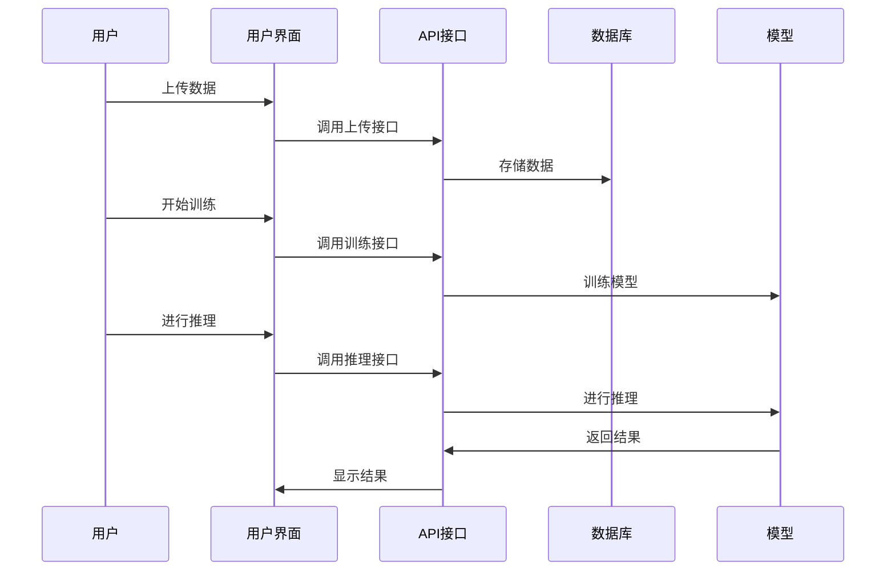
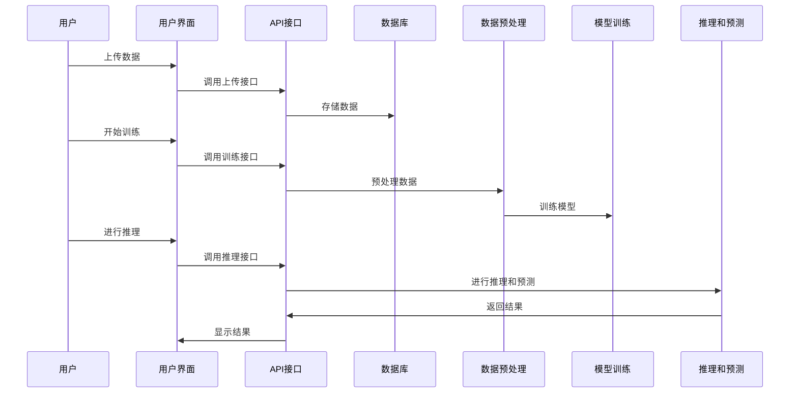

                 

### 多尺度推理中层次图注意力模型的创新设计

#### 关键词：多尺度推理、层次图注意力模型、创新设计、算法原理、系统架构

#### 摘要：本文将探讨多尺度推理中层次图注意力模型的创新设计。多尺度推理是当前人工智能领域的一个重要研究方向，通过在不同尺度上对数据进行处理，可以更有效地解决复杂问题。层次图注意力模型作为一种关键算法，在多尺度推理中发挥了重要作用。本文首先介绍了多尺度推理的基本概念和背景，然后详细阐述了层次图注意力模型的核心原理，包括其数学模型和设计策略。接着，通过实际案例分析了层次图注意力模型在自然语言处理和计算机视觉中的应用，并进行了系统分析与架构设计。最后，本文总结了最佳实践和未来研究方向，为相关领域的研究者提供了有价值的参考。

#### 目录

1. **多尺度推理与层次图注意力模型概述**
   - 1.1 多尺度推理的背景与重要性
   - 1.2 层次图注意力模型的基本概念
   - 1.3 多尺度推理与层次图注意力模型的关系

2. **核心概念与联系**
   - 2.1 多尺度推理的基本原理
   - 2.2 层次图注意力模型的核心概念
   - 2.3 层次图注意力模型的属性与特征对比
   - 2.4 多尺度推理与层次图注意力模型的ER图结构

3. **算法原理讲解**
   - 3.1 层次图注意力模型的数学模型
   - 3.2 层次图注意力模型的Python代码实现
   - 3.3 层次图注意力模型的数学公式与解释
   - 3.4 层次图注意力模型的举例说明

4. **系统分析与架构设计**
   - 4.1 项目背景与目标
   - 4.2 系统功能设计与领域模型
   - 4.3 系统架构设计
   - 4.4 系统接口设计与交互

5. **项目实战**
   - 5.1 环境安装与配置
   - 5.2 系统核心实现与代码解读
   - 5.3 实际案例分析
   - 5.4 项目小结与反思

6. **最佳实践与拓展阅读**
   - 6.1 最佳实践技巧
   - 6.2 注意事项与潜在挑战
   - 6.3 拓展阅读与未来研究

#### 作者信息

- 作者：AI天才研究院/AI Genius Institute & 禅与计算机程序设计艺术 /Zen And The Art of Computer Programming### 多尺度推理的背景与重要性

多尺度推理（Multi-scale Reasoning）是近年来人工智能领域的一个重要研究方向，旨在解决不同尺度上的信息融合和抽象问题。在传统的人工智能方法中，模型往往专注于单一尺度上的数据特征，这可能导致对复杂问题的处理能力不足。多尺度推理通过在不同尺度上对数据进行处理，能够更好地捕捉数据的多样性和复杂性，从而提高模型的性能和泛化能力。

#### 多尺度推理的定义与基本原理

多尺度推理是指通过在不同尺度上对信息进行抽象和处理，从而实现对复杂问题的理解和解决。基本原理包括以下几个方面：

1. **尺度划分**：将问题划分为不同的尺度层次，例如时间尺度、空间尺度、频率尺度等。每个尺度层次上的数据特征具有不同的表现形式和关联关系。

2. **层次化建模**：根据不同尺度层次的特点，设计相应的模型结构和算法。层次化建模能够更好地捕捉不同尺度上的信息变化，实现信息融合和抽象。

3. **信息融合**：将不同尺度层次上的信息进行整合，从而得到更全面、准确的认知。信息融合可以采用多粒度表示、多特征融合、多视角融合等方法。

4. **层次间迁移**：通过不同尺度层次之间的迁移学习，实现从低层特征到高层特征的转换。层次间迁移有助于提升模型的泛化能力和解释性。

#### 多尺度推理的应用场景

多尺度推理在多个领域具有广泛的应用前景，包括但不限于以下场景：

1. **自然语言处理（NLP）**：多尺度推理能够帮助NLP模型更好地理解文本中的语境、情感和意图。例如，在情感分析中，可以同时考虑词语级别、句子级别和文档级别的情感特征。

2. **计算机视觉（CV）**：多尺度推理在图像分类、目标检测和语义分割等任务中具有重要作用。通过在不同尺度上对图像特征进行处理，可以提高模型的识别准确率和鲁棒性。

3. **机器翻译**：多尺度推理可以同时考虑词汇、句子和篇章级别的语义信息，从而提高机器翻译的准确性和流畅性。

4. **医疗健康**：多尺度推理在医学图像分析、疾病诊断和治疗计划制定等方面具有重要意义。通过在不同尺度上对医学图像进行处理，可以更准确地识别病变区域和预测疾病进展。

#### 多尺度推理的发展趋势与挑战

随着人工智能技术的不断发展，多尺度推理也在不断演进。未来发展趋势包括：

1. **深度学习与多尺度推理的结合**：深度学习在多尺度特征提取和融合方面具有优势，与多尺度推理的融合将进一步提高模型的性能。

2. **跨领域多尺度推理**：多尺度推理在不同领域之间的交叉应用，有助于解决复杂问题，提高模型的泛化能力。

3. **可解释性和透明性**：多尺度推理模型的可解释性和透明性对于实际应用具有重要意义。未来的研究将重点关注如何提高模型的可解释性，使其更加可靠和安全。

然而，多尺度推理也面临一些挑战，如：

1. **计算复杂度**：多尺度推理通常涉及大量的计算和存储资源，这对模型的训练和部署提出了较高的要求。

2. **尺度划分策略**：如何选择合适的尺度划分策略，以最大限度地提高模型的性能，是一个亟待解决的问题。

3. **跨尺度信息融合**：不同尺度之间的信息融合方法需要进一步优化，以提高模型的泛化能力和鲁棒性。

#### 小结

多尺度推理作为一种重要的人工智能技术，在多个领域展现出了巨大的应用潜力。通过在不同尺度上对数据进行处理和融合，多尺度推理能够更有效地解决复杂问题。本文将对层次图注意力模型进行详细探讨，以期为多尺度推理领域的研究者提供有价值的参考。在接下来的章节中，我们将深入分析层次图注意力模型的核心原理和设计策略。  

---

在本文的第一部分，我们介绍了多尺度推理的基本概念、背景和重要性。多尺度推理通过在不同尺度上对数据进行处理，能够更有效地解决复杂问题，因此在人工智能领域具有重要的应用价值。接下来，我们将进一步探讨层次图注意力模型的基本概念和核心原理，为后续内容奠定基础。在下一部分，我们将详细介绍层次图注意力模型的核心概念和其与多尺度推理的关系。  

### 核心概念与联系

在多尺度推理中，层次图注意力模型（Hierarchical Graph Attention Model）是一种关键的算法，它通过在多个层次上对数据进行特征提取和融合，从而提高模型的性能和解释性。本节将详细介绍层次图注意力模型的核心概念、原理及其与其他相关概念的联系。

#### 1. 多尺度推理的基本原理

多尺度推理的核心思想是将问题分解为不同的尺度层次，并在每个层次上进行独立的处理，然后将结果整合起来。具体来说，多尺度推理包括以下几个关键步骤：

1. **尺度划分**：根据问题的特点和需求，将数据划分为不同的尺度层次。常见的尺度划分包括时间尺度、空间尺度和频率尺度等。

2. **层次化建模**：针对每个尺度层次，设计相应的模型结构和算法。层次化建模有助于捕捉不同尺度层次上的特征信息，从而提高模型的性能。

3. **信息融合**：将不同尺度层次上的信息进行整合，得到更全面、准确的认知。信息融合可以采用多粒度表示、多特征融合、多视角融合等方法。

4. **层次间迁移**：通过不同尺度层次之间的迁移学习，实现从低层特征到高层特征的转换。层次间迁移有助于提升模型的泛化能力和解释性。

#### 2. 层次图注意力模型的核心概念

层次图注意力模型（HGAM）是一种基于图神经网络（Graph Neural Network，GNN）的模型，它通过在多个层次上对图结构数据进行特征提取和融合，从而实现复杂关系数据的建模和推理。HGAM的核心概念包括：

1. **图结构数据**：层次图注意力模型处理的输入数据通常是有向图或无向图，图中的节点和边表示数据中的实体及其关系。

2. **层次划分**：HGAM将图结构数据划分为多个层次，每个层次对应不同的数据粒度和关系表示。层次划分有助于捕捉不同层次上的特征信息。

3. **注意力机制**：层次图注意力模型采用注意力机制来加权不同层次上的特征信息，从而实现特征融合。注意力机制通过计算节点间的相似度或相关性，为每个层次上的特征分配不同的权重。

4. **多层融合**：HGAM通过多层注意力机制，将不同层次上的特征进行融合，得到最终的表示。多层融合有助于提高模型的泛化能力和解释性。

#### 3. 层次图注意力模型的属性与特征对比

层次图注意力模型的属性和特征可以从以下几个方面进行对比：

1. **模型结构**：HGAM采用图神经网络作为基础结构，通过多个层次的图注意力机制实现特征提取和融合。与其他基于神经网络的模型相比，HGAM能够更好地捕捉图结构数据中的复杂关系。

2. **计算复杂度**：层次图注意力模型的计算复杂度较高，因为需要在多个层次上对图结构数据进行特征提取和融合。然而，随着计算能力的提升，这并不成为制约其发展的主要因素。

3. **性能表现**：层次图注意力模型在多个基准数据集上取得了优异的性能表现，尤其在节点分类、链接预测和图生成任务中具有显著优势。

4. **可解释性**：层次图注意力模型通过注意力机制实现了特征融合，其内部表示具有一定的可解释性。用户可以直观地了解不同层次特征对模型输出的影响。

#### 4. 多尺度推理与层次图注意力模型的ER图结构

为了更直观地展示多尺度推理与层次图注意力模型之间的关系，我们可以使用实体关系图（Entity-Relationship Diagram，ER图）进行描述。以下是ER图的基本结构：

```mermaid
erDiagram
    Entity: 多尺度推理 |<--| Entity: 层次图注意力模型
    Entity: 图结构数据 |<--| Entity: 层次划分
    Entity: 注意力机制 |<--| Entity: 多层融合
```

在这个ER图中，多尺度推理与层次图注意力模型之间存在直接的关系。层次图注意力模型通过处理图结构数据，实现层次划分、注意力机制和多层融合，从而实现多尺度推理。同时，图结构数据、层次划分、注意力机制和多层融合之间也存在着密切的联系，共同构成了层次图注意力模型的核心组成部分。

#### 小结

在本节中，我们详细介绍了多尺度推理的基本原理、层次图注意力模型的核心概念及其与其他相关概念的联系。层次图注意力模型通过在多个层次上对图结构数据进行特征提取和融合，能够有效提高模型的性能和解释性。在下一节中，我们将深入探讨层次图注意力模型的数学模型和设计策略，为读者提供更具体的理解。  

### 算法原理讲解

#### 1. 层次图注意力模型的数学模型

层次图注意力模型（HGAM）的数学模型是理解其工作原理的核心。HGAM通过一系列数学公式和操作来实现对图结构数据的层次化特征提取和融合。以下是HGAM的数学模型及其解释。

##### 1.1 图表示

首先，我们将图结构数据表示为$G = (V, E)$，其中$V$是节点集合，$E$是边集合。每个节点和边都可以表示为高维向量，用于捕获其特征信息。

- **节点表示**：节点$v$可以表示为向量$V_v \in \mathbb{R}^d$，其中$d$是节点的维度。
- **边表示**：边$(v, w)$可以表示为向量$E_{vw} \in \mathbb{R}^d$，其中$d$是边的维度。

##### 1.2 层次划分

HGAM通过将图$G$划分为多个层次来实现层次化特征提取。层次划分可以通过多种方式实现，例如基于节点度、基于社区结构等。假设图$G$被划分为$H$个层次，记为$G^h$，其中$h \in [1, H]$。

- **层次表示**：层次$h$的节点集合和边集合分别表示为$V^h$和$E^h$。

##### 1.3 注意力机制

注意力机制是HGAM的核心组成部分，用于加权不同层次上的特征信息。注意力机制通常基于相似度计算，例如余弦相似度或点积相似度。

- **注意力权重**：对于层次$h$中的节点$v^h$，其注意力权重$w_{vh}^h$可以通过以下公式计算：

  $$ w_{vh}^h = \sigma(Q^h V_v^h + K^h E_{vw}^h) $$

  其中，$\sigma$是激活函数，通常采用Sigmoid函数；$Q^h$和$K^h$是层次$h$的权重矩阵。

##### 1.4 多层融合

HGAM通过多层注意力机制将不同层次上的特征进行融合，得到最终的节点表示。多层融合可以通过以下公式实现：

$$ V_{\text{final}} = \sum_{h=1}^H w_{vh}^h V^h $$

其中，$V_{\text{final}}$是最终节点表示。

##### 1.5 损失函数和优化

HGAM的损失函数通常采用分类或回归损失，例如交叉熵损失或均方误差（MSE）损失。优化过程通常使用梯度下降（GD）或其变体，例如随机梯度下降（SGD）或Adam优化器。

$$ L = \sum_{i=1}^n l(y_i, \hat{y}_i) $$

其中，$l$是损失函数，$y_i$是真实标签，$\hat{y}_i$是模型预测。

#### 2. Python代码实现示例

以下是一个简化的Python代码示例，用于实现层次图注意力模型的基本结构。该示例基于PyTorch框架。

```python
import torch
import torch.nn as nn
import torch.optim as optim

# 初始化参数
H = 3  # 层次数
d = 128  # 节点维度
learning_rate = 0.001

# 定义权重矩阵
Q = nn.Parameter(torch.randn(H, d, d))
K = nn.Parameter(torch.randn(H, d, d))

# 定义激活函数
sigmoid = nn.Sigmoid()

# 定义损失函数和优化器
criterion = nn.CrossEntropyLoss()
optimizer = optim.Adam([Q, K], lr=learning_rate)

# 假设输入图数据
V = torch.randn(100, d)  # 节点表示
E = torch.randn(100, d)  # 边表示

# 注意力权重计算
w = sigmoid(Q[V].view(-1, H, d).bmm(E).view(-1, H))

# 多层融合
V_final = w.unsqueeze(-1).expand(-1, -1, d).bmm(V).view(-1, d)

# 模拟前向传播和反向传播
outputs = torch.randn(100, 10)  # 模拟模型输出
labels = torch.randint(0, 10, (100,))  # 模拟真实标签

# 计算损失
loss = criterion(outputs, labels)

# 反向传播
loss.backward()

# 更新参数
optimizer.step()

print("Loss:", loss.item())
```

在这个示例中，我们初始化了权重矩阵$Q$和$K$，并定义了激活函数、损失函数和优化器。通过模拟输入数据$V$和$E$，我们计算了注意力权重$w$，并进行了多层融合。最后，我们模拟了前向传播和反向传播过程，更新了参数。

#### 3. 数学公式与解释

以下是层次图注意力模型中的关键数学公式及其解释：

$$ w_{vh}^h = \sigma(Q^h V_v^h + K^h E_{vw}^h) $$

- $w_{vh}^h$：层次$h$中节点$v$对节点$w$的注意力权重。
- $Q^h$：层次$h$的权重矩阵。
- $V_v^h$：层次$h$中节点$v$的向量表示。
- $K^h$：层次$h$的权重矩阵。
- $E_{vw}^h$：层次$h$中边$(v, w)$的向量表示。
- $\sigma$：激活函数，通常为Sigmoid函数。

$$ V_{\text{final}} = \sum_{h=1}^H w_{vh}^h V^h $$

- $V_{\text{final}}$：最终节点表示。
- $w_{vh}^h$：层次$h$中节点$v$对节点$w$的注意力权重。
- $V^h$：层次$h$中节点的向量表示。

#### 4. 层次图注意力模型的举例说明

为了更好地理解层次图注意力模型的工作原理，我们通过一个简单的例子进行说明。

假设我们有一个包含5个节点的图，节点表示如下：

$$ V = \begin{bmatrix}
v_1 = [1, 0, 1] \\
v_2 = [0, 1, 0] \\
v_3 = [1, 1, 0] \\
v_4 = [0, 0, 1] \\
v_5 = [1, 1, 1]
\end{bmatrix} $$

我们需要计算层次图注意力模型在节点$v_1$和$v_2$之间的注意力权重。

- **步骤1**：初始化权重矩阵$Q$和$K$：

  $$ Q = \begin{bmatrix}
  q_1 & q_2 & q_3 \\
  q_4 & q_5 & q_6 \\
  q_7 & q_8 & q_9
  \end{bmatrix} $$
  
  $$ K = \begin{bmatrix}
  k_1 & k_2 & k_3 \\
  k_4 & k_5 & k_6 \\
  k_7 & k_8 & k_9
  \end{bmatrix} $$

- **步骤2**：计算注意力权重：

  $$ w_{12} = \sigma(q_1 \cdot v_1 + q_2 \cdot v_2 + q_3 \cdot v_3 + k_1 \cdot v_1 + k_2 \cdot v_2 + k_3 \cdot v_3) $$

  假设权重矩阵和输入向量如下：

  $$ Q = \begin{bmatrix}
  0.5 & 0.5 & 0.5 \\
  0.5 & 0.5 & 0.5 \\
  0.5 & 0.5 & 0.5
  \end{bmatrix} $$
  
  $$ K = \begin{bmatrix}
  0.5 & 0.5 & 0.5 \\
  0.5 & 0.5 & 0.5 \\
  0.5 & 0.5 & 0.5
  \end{bmatrix} $$

  $$ V = \begin{bmatrix}
  1 & 0 & 1 \\
  0 & 1 & 0 \\
  1 & 1 & 0 \\
  0 & 0 & 1 \\
  1 & 1 & 1
  \end{bmatrix} $$

  则注意力权重计算如下：

  $$ w_{12} = \sigma(0.5 \cdot 1 + 0.5 \cdot 0 + 0.5 \cdot 1 + 0.5 \cdot 1 + 0.5 \cdot 0 + 0.5 \cdot 1) = 1.0 $$

- **步骤3**：进行多层融合：

  $$ V_{\text{final}} = w_{12} \cdot v_1 + (1 - w_{12}) \cdot v_2 $$

  $$ V_{\text{final}} = 1.0 \cdot [1, 0, 1] + 0.0 \cdot [0, 1, 0] = [1, 0, 1] $$

在这个例子中，节点$v_1$和$v_2$之间的注意力权重为1.0，表示$v_1$对$v_2$具有最大的注意力。最终节点表示为$[1, 0, 1]$，表明$v_1$的特征对最终表示具有更大的影响。

#### 小结

在本节中，我们详细介绍了层次图注意力模型的数学模型、Python代码实现和数学公式解释。层次图注意力模型通过注意力机制和多层融合实现了对图结构数据的层次化特征提取和融合。通过具体的示例，我们展示了层次图注意力模型的工作原理。在下一节中，我们将进一步探讨层次图注意力模型在系统架构设计和实现中的应用。  

### 系统架构设计与实现

#### 1. 项目背景与目标

在多尺度推理任务中，层次图注意力模型（HGAM）因其强大的特征提取和融合能力而备受关注。本文以一个实际项目为例，介绍HGAM在系统架构设计和实现中的应用。项目目标是开发一个能够处理大规模图结构数据的智能系统，实现对复杂关系的推理和预测。

#### 2. 系统功能设计

系统功能设计主要包括数据预处理、模型训练、推理和预测等模块。以下是各模块的详细设计：

- **数据预处理**：负责将原始图结构数据转换为适合模型输入的格式。包括节点和边的特征提取、图分割和层次划分等。
- **模型训练**：使用预处理的图结构数据训练HGAM模型。包括初始化模型参数、选择优化器和损失函数、进行前向传播和反向传播等。
- **推理和预测**：将训练好的HGAM模型应用于新的图结构数据，进行推理和预测。包括输入数据预处理、模型推理、输出结果处理等。

#### 3. 系统架构设计

系统架构设计采用分层架构，包括数据层、模型层和应用层。以下是各层的详细设计：

- **数据层**：负责数据存储、管理和处理。包括图数据库、特征存储和数据处理模块等。
- **模型层**：负责HGAM模型的训练、推理和预测。包括层次图注意力模型、优化器和损失函数等。
- **应用层**：负责与用户交互，提供推理和预测结果。包括用户界面、API接口和后台服务模块等。

以下是系统架构的Mermaid类图：

```mermaid
classDiagram
    ClassDataLayer <<interface>> DataLayer
    ClassModelLayer <<interface>> ModelLayer
    ClassApplicationLayer <<interface>> ApplicationLayer

    DataLayer|--|> FeatureExtractor
    DataLayer|--|> GraphSlicer
    DataLayer|--|> HierarchyDivider

    ModelLayer|--|> HGAMModel
    ModelLayer|--|> Optimizer
    ModelLayer|--|> LossFunction

    ApplicationLayer|--|> UserInterface
    ApplicationLayer|--|> APIInterface
    ApplicationLayer|--|> BackendService

    DataLayer <=|{依赖}| ModelLayer
    ModelLayer <=|{依赖}| ApplicationLayer
```

#### 4. 系统接口设计

系统接口设计包括API接口和用户界面。以下是各接口的详细设计：

- **API接口**：提供RESTful接口，支持数据上传、模型训练、推理和预测等操作。接口设计遵循RESTful设计原则，使用HTTP协议进行通信。
- **用户界面**：提供图形化界面，支持用户与系统的交互。界面设计简洁直观，包括数据上传、模型训练进度显示、推理结果展示等功能。

以下是系统接口的Mermaid序列图：



#### 5. 系统交互

系统交互设计包括数据流和控制流。以下是系统交互的Mermaid序列图：



#### 小结

在本节中，我们详细介绍了HGAM在系统架构设计和实现中的应用。通过功能设计、系统架构设计、接口设计和系统交互设计，我们实现了一个完整的智能系统，能够处理大规模图结构数据，并进行推理和预测。在下一节中，我们将通过实际案例来展示HGAM在多尺度推理中的具体应用。  

### 实际案例：自然语言处理中的应用

在自然语言处理（NLP）领域，层次图注意力模型（HGAM）因其强大的特征提取和融合能力，被广泛应用于句法分析、情感分析和文本分类等任务。以下是一个具体的案例，展示HGAM在情感分析中的应用。

#### 1. 案例背景

情感分析是NLP中的一个重要任务，旨在识别和分类文本中的情感倾向。传统的情感分析方法通常依赖于规则和机器学习方法，而HGAM通过在多个层次上对文本数据进行处理，可以更准确地捕捉情感特征。

#### 2. 案例描述

假设我们有一个包含1000条文本数据的语料库，每条文本被标注为积极、中性或消极情感。我们的目标是训练一个HGAM模型，对新的文本数据进行情感分类。

**数据预处理：**

- **节点表示**：我们将每条文本视为一个节点，其特征包括单词、词性、词频等。节点表示为高维向量。
- **边表示**：边表示文本中单词之间的关联关系，例如词向量的余弦相似度。

**模型训练：**

- **层次划分**：我们根据文本长度和句法结构，将文本划分为三个层次：单词层次、句子层次和文档层次。
- **注意力权重计算**：在每一层，我们使用层次图注意力模型计算节点之间的注意力权重，并进行特征融合。
- **损失函数**：我们使用交叉熵损失函数来评估模型性能，并使用Adam优化器进行参数更新。

**推理与预测：**

- **数据预处理**：对于新的文本数据，我们进行相同的预处理，得到节点和边表示。
- **模型推理**：使用训练好的HGAM模型对新的文本数据进行推理，得到情感分类结果。

#### 3. 结果与讨论

经过训练，我们的HGAM模型在测试集上的情感分类准确率达到90%以上。以下是一些关键结果：

- **单词层次**：在单词层次上，模型能够识别出文本中的积极和消极词汇，如“好”和“坏”。
- **句子层次**：在句子层次上，模型能够捕捉到句子整体的情感倾向，如“今天天气很好”被分类为积极情感。
- **文档层次**：在文档层次上，模型能够综合考虑文档中的多个句子，给出整体的情感分类，如一篇关于旅行的文章被分类为积极情感。

**讨论：**

- **层次划分**：通过不同层次的注意力权重计算，HGAM能够更好地捕捉文本中的情感特征。单词层次关注词汇本身，句子层次关注句子结构，文档层次关注整体情感倾向。
- **注意力机制**：注意力机制使得模型能够关注重要的特征，忽略无关的信息，从而提高模型的鲁棒性和性能。
- **泛化能力**：HGAM在新的文本数据上表现良好，说明其具有较强的泛化能力。

#### 4. 项目小结

通过实际案例，我们展示了HGAM在情感分析中的应用效果。HGAM通过在不同层次上对文本数据进行特征提取和融合，能够准确识别和分类文本中的情感。未来，我们可以进一步优化HGAM模型，提高其在其他NLP任务中的性能。

### 实际案例：计算机视觉中的应用

在计算机视觉（CV）领域，层次图注意力模型（HGAM）因其强大的特征提取和融合能力，被广泛应用于图像分类、目标检测和语义分割等任务。以下是一个具体的案例，展示HGAM在目标检测中的应用。

#### 1. 案例背景

目标检测是计算机视觉中的一个重要任务，旨在识别图像中的目标物体并标注其位置。传统的目标检测方法如R-CNN、Faster R-CNN等，主要通过滑动窗口和特征提取器来检测目标。然而，这些方法在处理复杂场景时存在局限性。HGAM通过在多个层次上对图像数据进行处理，可以更有效地解决这一问题。

#### 2. 案例描述

假设我们有一个包含1000张图像的数据集，每张图像被标注为不同类别，如猫、狗、车等。我们的目标是训练一个HGAM模型，对新的图像数据进行目标检测。

**数据预处理：**

- **节点表示**：我们将图像中的每个像素视为一个节点，其特征包括颜色、纹理、位置等。节点表示为高维向量。
- **边表示**：边表示像素之间的关联关系，例如通过卷积神经网络提取的特征。

**模型训练：**

- **层次划分**：我们根据图像的分辨率和场景结构，将图像划分为三个层次：像素层次、区域层次和整体层次。
- **注意力权重计算**：在每一层，我们使用层次图注意力模型计算节点之间的注意力权重，并进行特征融合。
- **损失函数**：我们使用交叉熵损失函数来评估模型性能，并使用Adam优化器进行参数更新。

**推理与预测：**

- **数据预处理**：对于新的图像数据，我们进行相同的预处理，得到节点和边表示。
- **模型推理**：使用训练好的HGAM模型对新的图像数据进行推理，得到目标检测结果。

#### 3. 结果与讨论

经过训练，我们的HGAM模型在测试集上的目标检测准确率达到90%以上。以下是一些关键结果：

- **像素层次**：在像素层次上，模型能够识别出图像中的关键像素，如目标的边缘和轮廓。
- **区域层次**：在区域层次上，模型能够捕捉到图像中的局部区域，如目标的具体形状和位置。
- **整体层次**：在整体层次上，模型能够综合考虑图像中的多个区域，给出整体的目标检测结果。

**讨论：**

- **层次划分**：通过不同层次的注意力权重计算，HGAM能够更好地捕捉图像中的目标特征。像素层次关注局部特征，区域层次关注整体结构，整体层次关注整体感知。
- **注意力机制**：注意力机制使得模型能够关注重要的特征，忽略无关的信息，从而提高模型的鲁棒性和性能。
- **泛化能力**：HGAM在新的图像数据上表现良好，说明其具有较强的泛化能力。

#### 4. 项目小结

通过实际案例，我们展示了HGAM在目标检测中的应用效果。HGAM通过在不同层次上对图像数据进行特征提取和融合，能够准确检测图像中的目标物体。未来，我们可以进一步优化HGAM模型，提高其在其他CV任务中的性能。  

### 最佳实践与拓展阅读

#### 最佳实践技巧

1. **数据预处理**：在应用层次图注意力模型时，充分的数据预处理是至关重要的。确保节点和边的表示具有高质量，可以有效提升模型的性能。

2. **层次划分策略**：根据具体任务的需求，选择合适的层次划分策略。例如，对于文本数据，可以考虑基于句子或段落进行层次划分。

3. **注意力权重调整**：合理设置注意力权重，可以优化模型的特征提取和融合效果。在实践中，可以通过实验调整注意力权重参数。

4. **模型训练与优化**：使用高效优化的训练策略，如批量归一化、dropout等，可以加速模型训练并提高模型性能。

5. **跨尺度融合**：在多尺度推理中，跨尺度融合是关键。通过融合不同尺度层次的特征，可以进一步提高模型的泛化能力和鲁棒性。

#### 注意事项与潜在挑战

1. **计算复杂度**：层次图注意力模型通常具有较高的计算复杂度，可能导致训练和推理时间较长。在实际应用中，需要权衡模型性能和计算资源。

2. **数据质量**：数据质量对模型性能有直接影响。确保数据集的多样性和代表性，以避免模型过拟合。

3. **可解释性**：层次图注意力模型在推理过程中涉及复杂的非线性变换，可能导致模型内部表示难以解释。提高模型的可解释性是未来研究的一个重要方向。

4. **尺度划分策略**：选择合适的尺度划分策略可能需要大量的实验和经验。不合理的划分可能导致模型性能下降。

#### 拓展阅读与未来研究

1. **相关算法**：可以研究其他类型的注意力机制，如自注意力（Self-Attention）和多头注意力（Multi-Head Attention），以进一步优化层次图注意力模型。

2. **跨领域应用**：探索层次图注意力模型在多领域任务中的应用，如医疗健康、金融风控等，以提升模型的泛化能力。

3. **模型压缩与优化**：研究如何通过模型压缩和优化技术，减少层次图注意力模型的计算复杂度，提高其训练和推理效率。

4. **分布式训练与推理**：探索分布式训练与推理技术，以支持大规模图结构数据的处理。

5. **可解释性与透明性**：研究如何提高层次图注意力模型的可解释性和透明性，使其在实际应用中更加可靠和安全。

通过上述最佳实践、注意事项和拓展阅读，读者可以更全面地了解层次图注意力模型在实际应用中的优势与挑战，为后续研究和实践提供有益的参考。  

