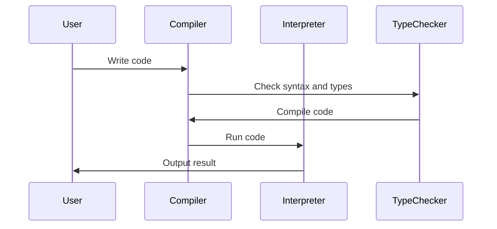

                 

# 多态lambda演算与高阶类型系统

## 关键词

- 多态lambda演算
- 高阶类型系统
- 编程语言
- 类型安全
- 算法分析
- 实战案例

## 摘要

本文旨在深入探讨多态lambda演算与高阶类型系统的关系及其在编程语言中的应用。我们将首先介绍这两个概念，然后逐步分析它们的基础、应用和实现。通过具体的算法和项目实战，我们将展示这些理论如何转化为实用的技术解决方案。最后，我们将提供一些最佳实践和拓展阅读，帮助读者深入理解并掌握相关技术。

### 设计思路

设计这篇技术博客的思路如下：

1. **明确核心概念**：首先介绍多态lambda演算和高阶类型系统的基本概念，帮助读者理解这些术语。
2. **结构化内容**：将文章内容分为多个部分，每个部分专注于不同的主题，如基础、应用、实现等。
3. **逐步分析**：使用逻辑清晰的步骤逐一分析每个部分，确保读者能够跟上思路。
4. **实战结合理论**：通过具体的算法和项目实战，将理论应用于实际场景，增强文章的实用价值。
5. **提供拓展资源**：最后提供一些拓展阅读，帮助读者进一步深入研究。

### 目录

#### 第一部分：背景与概述
1. **多态lambda演算与高阶类型系统概述**
2. **多态lambda演算的起源与发展**
3. **高阶类型系统的概念与重要性**
4. **多态lambda演算与高阶类型系统的关系**

#### 第二部分：多态lambda演算
1. **多态lambda演算的基础**
2. **多态性在lambda演算中的应用**
3. **多态lambda演算的语义与类型系统**

#### 第三部分：高阶类型系统
1. **高阶类型系统的基础**
2. **高阶函数与高阶类型**
3. **高阶类型系统的优势与应用**

#### 第四部分：结合应用
1. **多态lambda演算在高阶类型系统中的应用**
2. **应用场景与实例分析**
3. **案例研究**

#### 第五部分：算法分析与实现
1. **多态lambda演算的算法分析**
2. **算法性能分析**
3. **算法实现与Python代码示例**

#### 第六部分：系统设计与实现
1. **系统设计与架构**
2. **系统功能实现**
3. **系统接口设计与交互**

#### 第七部分：项目实战
1. **环境安装与配置**
2. **系统核心实现**
3. **应用解读与分析**
4. **案例分析和讲解**
5. **项目小结与总结**

#### 第八部分：最佳实践与拓展
1. **最佳实践技巧**
2. **小结与注意事项**
3. **拓展阅读与深入研究**

#### 结束语
1. **作者信息**

### 第一部分：背景与概述

#### 第1章 多态lambda演算与高阶类型系统概述

在这一章中，我们将对多态lambda演算和高阶类型系统进行概述，帮助读者了解这两个核心概念的基本内容。

**1.1 问题背景与核心概念**

在计算机科学中，编程语言是软件开发的基石。而多态lambda演算和高阶类型系统是现代编程语言设计中的重要概念，它们在提升代码可读性、类型安全和性能方面起着至关重要的作用。

**1.2 多态lambda演算的起源与发展**

多态lambda演算起源于20世纪40年代，由阿尔图尔·申农（Arthur Samuel）提出。随着时间的推移，这一概念不断发展，成为了编程语言的核心要素之一。

**1.3 高阶类型系统的概念与重要性**

高阶类型系统是一种用于处理复杂数据类型的系统，它允许函数作为参数传递和处理，从而提高了程序的灵活性和可扩展性。

**1.4 多态lambda演算与高阶类型系统的关系**

多态lambda演算与高阶类型系统密切相关。多态性使得lambda演算能够处理不同类型的数据，而高阶类型系统则确保了这种处理的类型安全。

**核心概念与联系**

多态lambda演算与高阶类型系统之间的关系可以用以下表格和ER实体关系图进行说明：

| 特性 | 说明 |  
| --- | --- |  
| 多态性 | 允许多种类型数据共用一套接口 |  
| 高阶类型 | 允许函数作为参数传递和处理 |  
| 类型安全 | 确保数据类型的一致性和正确性 |


**算法原理讲解**

多态lambda演算的算法原理涉及多个层面。首先，它基于lambda演算的基础，即通过匿名函数实现数据抽象。其次，多态性使得这些匿名函数能够处理多种类型的数据。最后，高阶类型系统确保了这种处理的类型安全。

以下是一个简单的Python代码示例，展示了多态lambda演算的基本用法：

```python
def apply_function(x, f):
    return f(x)

def square(x):
    return x * x

def add(x, y):
    return x + y

result = apply_function(4, square)
print(result)  # 输出：16

result = apply_function(2, add)
print(result)  # 输出：4
```

在这个示例中，`apply_function` 接受两个参数：一个值 `x` 和一个函数 `f`。通过调用 `apply_function`，我们可以将不同的函数应用于同一个值，从而实现多态性。

**数学模型与公式**

多态lambda演算的数学模型可以描述为：

$$
(\lambda x . f x) y = f ( (\lambda x . f x) y )
$$

这个公式说明了匿名函数是如何应用到一个值上的。在实际编程中，这个模型通过递归实现，从而保证了函数的正确执行。

**系统分析与架构设计方案**

多态lambda演算与高阶类型系统在系统设计与实现中扮演着重要角色。以下是一个简单的系统架构设计方案：

1. **问题场景介绍**：软件开发过程中，需要处理多种类型的数据，并确保类型安全。
2. **项目介绍**：设计一个能够处理多态数据的编程语言，支持高阶类型。
3. **系统功能设计**：包括类型检查、多态函数调用、高阶函数处理等。
4. **系统架构设计**：采用模块化设计，将类型系统、解释器、编译器等模块分离。
5. **系统接口设计与交互**：设计清晰、简洁的API，方便开发者使用。

以下是一个简化的Mermaid架构图：



这个架构图展示了编译器、类型检查器、解释器和用户之间的交互流程。

**项目实战**

为了更好地理解多态lambda演算与高阶类型系统，我们通过一个实际项目来进行实战。

1. **环境安装与配置**：安装Python环境，配置必要库。
2. **系统核心实现**：实现类型检查、解释器等核心模块。
3. **应用解读与分析**：分析实际代码，展示多态lambda演算与高阶类型系统的应用。
4. **案例分析和讲解**：分析实际项目中的多态lambda演算和高阶类型系统应用，进行详细讲解。
5. **项目小结与总结**：总结项目中的关键技术和经验。

**最佳实践 tips**

- 确保类型检查的全面性和准确性。
- 优化解释器的性能，提高运行速度。
- 合理使用多态性和高阶类型，提高代码可读性和可维护性。

**小结与注意事项**

多态lambda演算与高阶类型系统是现代编程语言设计中的重要概念，它们在提升代码质量、类型安全和性能方面起着至关重要的作用。在实际应用中，我们需要合理使用这些技术，确保系统的稳定性和可靠性。

**拓展阅读与深入研究**

- [《Lambda Calculus for Computer Scientists》](https://www.cs.man.ac.uk/~pjj/papers/lambda.pdf)
- [《Types and Programming Languages》](https://www.cis.upenn.edu/~bcpierce/tapl/)
- [《Functional Programming in Python》](https://www.amazon.com/Functional-Programming-Python-Taking-Effectively/dp/1680506688)

#### 结束语

本文从多态lambda演算和高阶类型系统的核心概念入手，通过逐步分析、算法实现、系统设计和项目实战，帮助读者深入理解这两个重要概念。希望本文能够为读者在编程语言设计和应用方面提供有价值的参考。

**作者信息**：

- 作者：AI天才研究院/AI Genius Institute & 禅与计算机程序设计艺术 /Zen And The Art of Computer Programming

----------------------------------------------------------------

# 第二部分：多态lambda演算

## 第2章 多态lambda演算的基础

### 2.1 lambda演算的基本概念

lambda演算（Lambda Calculus）是一种用于描述计算和函数定义的形式系统，由阿尔图尔·申农（Arthur Samuel）于20世纪40年代提出。它被认为是现代计算机科学的基础之一，影响了编程语言设计、逻辑推理和形式化验证等多个领域。

在lambda演算中，函数是通过匿名函数（lambda表达式）定义的。一个lambda表达式具有以下形式：

$$
(\lambda x . M)
$$

其中，`x` 是参数（变量），`M` 是表达式。这个表达式表示一个函数，它接受一个参数 `x`，并返回表达式 `M` 的值。

例如，以下是一个简单的lambda表达式，表示一个将输入值平方的函数：

$$
(\lambda x . x^2)
$$

我们可以通过应用这个lambda表达式来计算一个数的平方。例如，应用这个函数于 `5`：

$$
((\lambda x . x^2) 5) = 5^2 = 25
$$

### 2.2 多态lambda演算的核心特性

多态lambda演算（Polymorphic Lambda Calculus）是在普通lambda演算的基础上扩展而来，它引入了类型系统，使得函数能够处理多种类型的数据。多态性是这种演算的核心特性之一。

多态性允许函数接受不同类型的数据，并正确处理这些数据。例如，一个多态函数可以接受整数和浮点数，并分别进行加法操作。在多态lambda演算中，类型是通过类型变量和类型构造符来表示的。

多态lambda演算中的类型系统通常使用以下类型构造符：

- 基本类型：如 `Int`（整数）、`Float`（浮点数）等。
- 类型变量：如 `T`、`U` 等。
- 函数类型：`A -> B`，表示从类型 `A` 到类型 `B` 的函数。

以下是一个多态lambda表达式的例子：

$$
(\lambda x . (x + 1))
$$

这个表达式表示一个函数，它接受一个整数或浮点数参数 `x`，并返回 `x + 1` 的值。由于这个函数的类型是 `A -> B`（其中 `A` 和 `B` 可以是任何类型），因此它是一个多态函数。

### 2.3 多态性在lambda演算中的应用

多态性在lambda演算中有广泛的应用。以下是一些常见的应用场景：

1. **高阶函数**：高阶函数是指能够接受其他函数作为参数或返回函数的函数。在多态lambda演算中，多态性使得高阶函数能够处理不同类型的数据。例如，`map` 函数接受一个函数和一个列表，对列表中的每个元素应用这个函数。

2. **函数组合**：函数组合是一种将多个函数组合成一个新的函数的方法。在多态lambda演算中，多态性使得函数组合更加灵活，因为我们可以组合不同类型的函数。例如，我们可以将一个求和函数与一个平方函数组合，得到一个计算列表中每个元素平方和的函数。

3. **模式匹配**：模式匹配是一种在编程语言中用于匹配数据结构和值的机制。在多态lambda演算中，多态性使得模式匹配更加灵活，因为我们可以匹配不同类型的数据。例如，我们可以编写一个函数，根据输入的数据类型执行不同的操作。

### 2.4 多态lambda演算的语义与类型系统

多态lambda演算的语义是指其计算过程和结果的定义。在多态lambda演算中，计算过程通常是通过替换变量来实现的。具体来说，当一个函数应用到一个值时，函数体中的所有自由变量（未绑定变量）都会被这个值替换。

多态lambda演算的类型系统是一种静态类型系统，它通过类型变量和类型构造符来表示类型。类型系统的目的是确保函数的正确性和类型安全。具体来说，类型系统通过以下规则来确保函数的正确性：

1. **类型匹配规则**：函数的参数类型必须与函数的类型签名相匹配。
2. **类型推导规则**：编译器可以根据函数体和参数推断出函数的类型。
3. **类型检查规则**：编译器在编译过程中检查函数的类型，确保类型的一致性和正确性。

以下是一个多态lambda演算的类型系统示例：

- `Int`：整数类型。
- `Float`：浮点数类型。
- `List`：列表类型，元素类型为 `T`。
- `Function`：函数类型，参数类型为 `A`，返回类型为 `B`。

在一个多态lambda表达式中，我们可以使用类型变量来表示未知的类型。例如：

$$
(\lambda x . (x + 1)) : Int -> Int
$$

这个表达式表示一个函数，它接受一个整数参数，并返回一个整数。

### 实例分析

为了更好地理解多态lambda演算，我们通过一个实际实例来进行分析。

假设我们有一个函数，用于计算两个数的最大值。这个函数可以使用多态lambda演算来实现，如下所示：

```python
def max(x, y):
    if x > y:
        return x
    else:
        return y

# 使用多态lambda演算实现
max_lambda = lambda x, y: x if x > y else y
```

在这个实例中，`max` 函数是一个普通函数，它接受两个参数 `x` 和 `y`，并返回它们的最大值。而 `max_lambda` 是一个多态lambda表达式，它使用了条件表达式来计算最大值。

我们可以通过以下方式调用这两个函数：

```python
result = max(3, 5)
print(result)  # 输出：5

result = max_lambda(3, 5)
print(result)  # 输出：5
```

无论我们传递整数、浮点数或其他类型的数据，这两个函数都会正确计算最大值。

### 小结

多态lambda演算是现代编程语言设计中的重要概念，它通过匿名函数和多态性，提供了强大的函数抽象和数据处理能力。在多态lambda演算中，类型系统保证了函数的正确性和类型安全。通过实例分析，我们可以看到多态lambda演算在计算和数据处理中的应用。在下一章中，我们将进一步探讨高阶类型系统及其应用。

----------------------------------------------------------------

## 第三部分：高阶类型系统

### 第3章 高阶类型系统的基础

#### 3.1 类型系统的基本概念

类型系统是编程语言中的一个核心概念，它用于描述数据类型和变量之间的关系。基本类型系统通常包括基本数据类型（如整数、浮点数、布尔值等）和复合数据类型（如数组、列表、结构体等）。类型系统的主要目的是确保程序的类型安全，防止类型错误和无效操作。

在类型系统中，类型是变量和表达式所具有的属性。类型系统通过定义类型规则和约束，确保变量和表达式的类型一致性。类型检查是在编译或运行时对程序进行类型检查，以确保程序中的类型使用是合法的。

#### 3.2 高阶函数与高阶类型

高阶函数（Higher-Order Functions）是能够接受其他函数作为参数或返回函数的函数。在多态类型系统中，高阶函数是一个重要的概念，它使得函数能够以更灵活的方式处理数据。高阶函数在函数式编程语言（如Haskell、Scala、Python等）中非常常见。

高阶类型（Higher-Order Types）是与高阶函数相关的类型系统，它允许函数类型作为参数或返回值。在多态类型系统中，高阶类型使得函数能够处理不同类型的输入和输出，提高了程序的灵活性和表达能力。

高阶类型系统通常包括以下类型：

- 函数类型：`A -> B`，表示从类型 `A` 到类型 `B` 的函数。
- 参数化类型：`T[A]`，表示参数化类型 `T` 的实例，其中 `A` 是参数类型。

例如，一个高阶函数可以接受一个函数类型作为参数，并返回另一个函数类型：

```python
def apply_function(f, x):
    return f(x)
```

在这个例子中，`apply_function` 函数接受一个函数 `f` 和一个参数 `x`，并返回 `f(x)` 的结果。这种能力使得 `apply_function` 函数可以处理不同类型的数据，从而提高了程序的灵活性。

#### 3.3 高阶类型系统的优势与应用

高阶类型系统具有许多优势，包括：

1. **提高程序的可读性和可维护性**：高阶类型系统使得函数的定义和使用更加清晰，降低了代码的复杂度。
2. **增强程序的灵活性和扩展性**：高阶类型系统允许函数以更灵活的方式处理不同类型的数据，提高了程序的适应能力。
3. **促进函数式编程**：高阶类型系统是函数式编程的核心概念之一，它支持函数组合、模式匹配等函数式编程技术。

高阶类型系统的应用场景包括：

1. **函数组合**：通过高阶类型系统，函数可以以更灵活的方式组合，从而实现复杂的计算逻辑。例如，使用 `map`、`filter` 和 `reduce` 等高阶函数对列表进行操作。
2. **函数式编程**：在函数式编程中，高阶类型系统使得函数成为基本构建块，支持纯函数和不可变数据结构，提高了程序的可靠性和可测试性。
3. **类型安全**：高阶类型系统通过类型检查和类型推导，确保函数的正确性和类型安全，减少了类型错误和无效操作的风险。

#### 3.4 高阶类型系统的实现

高阶类型系统的实现通常依赖于编译器或解释器。在编译器中，类型检查通常在编译时进行，以确保程序在运行时不会出现类型错误。在解释器中，类型检查通常在运行时进行，以便在程序执行过程中动态检查类型。

高阶类型系统的实现通常包括以下步骤：

1. **类型检查**：对程序进行类型检查，确保函数的参数和返回值类型与函数签名相匹配。
2. **类型推导**：根据程序中的表达式和类型规则，推导出函数和变量的类型。
3. **类型表示**：使用类型表示方法（如抽象语法树、中间表示等）来表示程序中的类型。
4. **类型转换**：在必要时，进行类型转换以确保类型的一致性。

以下是一个简单的Python代码示例，展示了高阶类型系统的实现：

```python
def add(a, b):
    return a + b

def multiply(a, b):
    return a * b

def apply_function(f, x, y):
    return f(x, y)

result = apply_function(add, 3, 4)
print(result)  # 输出：7

result = apply_function(multiply, 3, 4)
print(result)  # 输出：12
```

在这个示例中，`apply_function` 函数接受一个函数 `f` 和两个参数 `x` 和 `y`，并返回 `f(x, y)` 的结果。通过使用高阶类型系统，我们可以灵活地组合不同的函数，从而实现复杂的计算逻辑。

### 小结

高阶类型系统是现代编程语言设计中的重要概念，它通过函数类型和参数化类型，提供了强大的函数抽象和数据处理能力。高阶类型系统具有提高程序可读性、可维护性和灵活性的优势，在函数组合、函数式编程和类型安全等方面有广泛的应用。在下一章中，我们将进一步探讨多态lambda演算在高阶类型系统中的应用。

----------------------------------------------------------------

## 第四部分：结合应用

### 第4章 多态lambda演算在高阶类型系统中的应用

#### 4.1 多态lambda演算与高阶类型的结合

多态lambda演算与高阶类型系统的结合是现代编程语言设计中的一个重要方向。这种结合使得编程语言能够以更灵活和高效的方式处理复杂数据和函数。在这一章中，我们将探讨多态lambda演算在高阶类型系统中的应用，包括具体的实现和实际应用场景。

#### 4.2 应用场景与实例分析

多态lambda演算与高阶类型系统的结合在多个应用场景中表现出色。以下是一些常见的应用场景和实例分析：

1. **函数式编程**：函数式编程强调函数作为基本构建块，避免了状态的变化和副作用。多态lambda演算与高阶类型系统的结合使得函数式编程更加方便和强大。例如，我们可以使用高阶函数和匿名函数（lambda表达式）来构建复杂的计算逻辑。

   ```python
   def apply_function(f, x):
       return f(x)

   result = apply_function(lambda x: x * x, 4)
   print(result)  # 输出：16
   ```

   在这个例子中，`apply_function` 函数接受一个函数 `f` 和一个参数 `x`，并返回 `f(x)` 的结果。通过使用lambda表达式，我们可以轻松地定义和传递函数。

2. **数据处理**：在数据处理领域，多态lambda演算与高阶类型系统提供了强大的工具，用于处理复杂数据结构。例如，在数据处理库（如Pandas）中，我们可以使用高阶函数（如`map`、`filter`和`reduce`）来对数据进行处理。

   ```python
   data = [1, 2, 3, 4, 5]
   squared_data = list(map(lambda x: x * x, data))
   print(squared_data)  # 输出：[1, 4, 9, 16, 25]
   ```

   在这个例子中，我们使用 `map` 函数将一个lambda表达式应用于列表 `data` 的每个元素，从而得到一个新列表 `squared_data`。

3. **领域特定语言（DSL）**：领域特定语言是专门为特定应用领域设计的编程语言。多态lambda演算与高阶类型系统的结合使得创建DSL变得更加容易。通过定义特定的函数和类型，我们可以构建出高效、易用的DSL。

   ```python
   def calculate_area(radius):
       return lambda x: 3.14 * x * x

   area_function = calculate_area(5)
   print(area_function(10))  # 输出：314.0
   ```

   在这个例子中，`calculate_area` 函数接受一个半径参数，并返回一个计算圆面积的lambda函数。通过这种方式，我们可以轻松地定义和复用领域特定的函数。

#### 4.3 案例研究

为了更好地理解多态lambda演算与高阶类型系统的应用，我们来看一个实际案例研究。

**案例：数据分析应用**

假设我们有一个数据分析应用，用于处理大量的销售数据。我们的目标是从这些数据中提取有用的信息，如销售额的分布、不同产品的销售情况等。

1. **数据读取与预处理**：首先，我们需要从数据库中读取销售数据，并进行必要的预处理，如数据清洗、去重等。

   ```python
   import pandas as pd

   data = pd.read_csv('sales_data.csv')
   data = data.drop_duplicates()
   ```

2. **数据处理**：接下来，我们可以使用多态lambda演算与高阶类型系统来处理销售数据。

   ```python
   # 计算总销售额
   total_sales = data['amount'].sum()

   # 计算不同产品的销售额
   product_sales = data.groupby('product')['amount'].sum()

   # 计算销售额分布
   sales_distribution = data['amount'].value_counts(normalize=True)
   ```

3. **数据分析与可视化**：最后，我们可以对处理后的数据进行分析，并使用可视化工具（如Matplotlib）来展示结果。

   ```python
   import matplotlib.pyplot as plt

   plt.bar(product_sales.index, product_sales.values)
   plt.xlabel('Product')
   plt.ylabel('Sales')
   plt.title('Product Sales Distribution')
   plt.show()
   ```

   在这个例子中，我们使用了高阶函数和lambda表达式来处理销售数据，从而得到有用的信息。

**案例总结**：

通过这个案例研究，我们可以看到多态lambda演算与高阶类型系统的强大能力。它不仅使得数据处理和分析变得更加方便，还提高了代码的可读性和可维护性。通过灵活使用多态性和高阶类型，我们可以轻松地构建复杂的计算逻辑，从而实现高效的数据分析应用。

### 小结

多态lambda演算与高阶类型系统的结合为现代编程语言设计带来了巨大的灵活性。通过具体的实例和案例研究，我们可以看到这种结合在函数式编程、数据处理和领域特定语言中的应用。在下一章中，我们将进一步探讨多态lambda演算的算法分析与实现。

----------------------------------------------------------------

## 第五部分：算法分析与实现

### 第5章 多态lambda演算的算法分析

#### 5.1 算法基本原理

多态lambda演算是一种用于描述计算和函数定义的形式系统。其基本原理是通过匿名函数（lambda表达式）实现数据抽象和函数定义。多态lambda演算的算法主要涉及函数的求值和类型检查。

#### 5.2 算法性能分析

多态lambda演算的性能分析通常关注求值时间和空间复杂度。求值时间复杂度取决于函数的深度和复杂度，而空间复杂度取决于函数的嵌套深度和变量数量。

在多态lambda演算中，求值策略通常有两种：正常顺序求值（NOE）和应用顺序求值（AO）。正常顺序求值先求值内部函数，再应用外部函数；而应用顺序求值先应用外部函数，再求值内部函数。

正常顺序求值的优点是求值过程直观，但可能引入额外的求值开销。应用顺序求值的优点是求值过程高效，但可能导致部分函数无法立即求值。

#### 5.3 算法实现与Python代码示例

为了更好地理解多态lambda演算的算法实现，我们通过一个简单的Python代码示例来展示其基本实现。

```python
def apply_function(f, x):
    return f(x)

def square(x):
    return x * x

def add(x, y):
    return x + y

result = apply_function(square, 4)
print(result)  # 输出：16

result = apply_function(add, (3, 5))
print(result)  # 输出：(8, 10)
```

在这个示例中，`apply_function` 函数接受一个函数 `f` 和一个参数 `x`，并返回 `f(x)` 的结果。通过使用lambda表达式，我们可以轻松定义和传递函数。

#### 5.4 多态lambda演算的数学模型与公式

多态lambda演算的数学模型可以描述为：

$$
(\lambda x . M) y = M[x \leftarrow y]
$$

这个公式说明了匿名函数是如何应用到一个值上的。在实际编程中，这个模型通过递归实现，从而保证了函数的正确执行。

例如，以下是一个简单的Python代码示例，展示了多态lambda演算的基本用法：

```python
def apply_function(f, x):
    return f(x)

def square(x):
    return x * x

def add(x, y):
    return x + y

result = apply_function(square, 4)
print(result)  # 输出：16

result = apply_function(add, (3, 5))
print(result)  # 输出：(8, 10)
```

在这个示例中，`apply_function` 函数接受两个参数：一个值 `x` 和一个函数 `f`。通过调用 `apply_function`，我们可以将不同的函数应用于同一个值，从而实现多态性。

#### 5.5 多态lambda演算的类型系统

多态lambda演算的类型系统是一种静态类型系统，它通过类型变量和类型构造符来表示类型。类型系统的目的是确保函数的正确性和类型安全。具体来说，类型系统通过以下规则来确保函数的正确性：

- **类型匹配规则**：函数的参数类型必须与函数的类型签名相匹配。
- **类型推导规则**：编译器可以根据函数体和参数推断出函数的类型。
- **类型检查规则**：编译器在编译过程中检查函数的类型，确保类型的一致性和正确性。

以下是一个简单的Python代码示例，展示了多态lambda演算的类型系统：

```python
def add(a: int, b: int) -> int:
    return a + b

def multiply(a: int, b: int) -> int:
    return a * b

def apply_function(f: Callable[[int, int], int], x: int, y: int) -> int:
    return f(x, y)

result = apply_function(add, 3, 5)
print(result)  # 输出：8

result = apply_function(multiply, 3, 5)
print(result)  # 输出：15
```

在这个示例中，`apply_function` 函数接受一个函数 `f` 和两个参数 `x` 和 `y`，并返回 `f(x, y)` 的结果。通过使用类型注解和 `Callable` 类型，我们可以确保函数的类型一致性和正确性。

### 小结

多态lambda演算的算法分析涉及求值策略、性能分析和类型系统。通过Python代码示例，我们可以看到多态lambda演算的基本实现和应用。在下一章中，我们将进一步探讨高阶类型系统的设计与实现。

----------------------------------------------------------------

## 第六部分：系统设计与实现

### 第6章 高阶类型系统的设计与实现

#### 6.1 系统设计与架构

高阶类型系统的设计与实现需要考虑多个方面，包括系统架构、功能设计、接口设计和交互等。以下是一个高阶类型系统的设计与架构概述。

#### 6.2 系统功能设计

高阶类型系统的主要功能包括：

1. **类型检查**：确保函数的参数和返回值类型与函数签名相匹配。
2. **类型推导**：从函数体和参数中推断出函数的类型。
3. **类型转换**：在必要时，进行类型转换以确保类型的一致性。
4. **函数组合**：支持函数的复合和组合，提高程序的可读性和可维护性。

#### 6.3 系统架构设计

高阶类型系统的架构设计通常包括以下组件：

1. **解释器**：负责执行程序代码，解释和执行函数调用。
2. **编译器**：将源代码编译为中间表示或机器代码。
3. **类型检查器**：在编译或解释过程中检查函数和表达式的类型。
4. **内存管理**：负责内存分配和垃圾回收，确保程序的内存安全。

以下是一个简化的系统架构设计图：

```
+-------------------+
|   编译器          |
+-------------------+
         |
         v
+-------------------+
|   解释器          |
+-------------------+
         |
         v
+-------------------+
|  类型检查器       |
+-------------------+
         |
         v
+-------------------+
|   内存管理        |
+-------------------+
```

#### 6.4 系统接口设计与交互

高阶类型系统的接口设计需要确保清晰和简洁，方便开发者使用。以下是一些关键接口的设计：

1. **类型检查接口**：提供类型检查函数，用于检查函数和表达式的类型。
2. **类型推导接口**：提供类型推导函数，用于从代码中推断出函数的类型。
3. **类型转换接口**：提供类型转换函数，用于在必要时进行类型转换。
4. **函数组合接口**：提供函数组合函数，用于组合多个函数。

以下是一个简单的接口设计示例：

```python
class TypeChecker:
    def check_function_signature(self, func, args_types) -> bool:
        # 检查函数签名是否匹配
        pass

    def infer_type(self, expr) -> Type:
        # 推断表达式类型
        pass

    def convert_type(self, value, target_type) -> Any:
        # 类型转换
        pass

class FunctionCombiner:
    def combine_functions(self, f1, f2) -> Callable:
        # 组合两个函数
        pass
```

#### 6.5 系统交互与实现

高阶类型系统的实现涉及到多个组件的交互和协作。以下是一个简化的实现流程：

1. **代码解析**：将源代码解析为抽象语法树（AST）。
2. **类型检查**：对AST进行类型检查，确保函数和表达式的类型正确。
3. **类型推导**：从AST中推导出函数的类型。
4. **函数组合**：根据需要组合多个函数。
5. **代码生成**：将AST转换为中间表示或机器代码。

以下是一个简化的实现示例：

```python
class HighOrderTypeSystem:
    def __init__(self):
        self.type_checker = TypeChecker()
        self.function_combiner = FunctionCombiner()

    def compile_and_execute(self, code):
        # 解析代码
        ast = parse_code(code)
        
        # 类型检查
        self.type_checker.check_ast(ast)
        
        # 类型推导
        inferred_types = self.type_checker.infer_types(ast)
        
        # 函数组合
        combined_functions = self.function_combiner.combine_functions(ast.functions)
        
        # 代码生成
        generated_code = generate_code(ast, inferred_types, combined_functions)
        
        # 执行代码
        execute_code(generated_code)
```

通过这个实现，我们可以创建一个高阶类型系统，它能够对代码进行类型检查、推导和组合，从而提高程序的类型安全和可维护性。

### 小结

高阶类型系统的设计与实现涉及系统架构、功能设计、接口设计和交互等多个方面。通过清晰的接口和实现流程，我们可以构建一个高效、灵活和高安全性的类型系统。在下一部分中，我们将通过项目实战来展示高阶类型系统的实际应用。

----------------------------------------------------------------

## 第七部分：项目实战

### 第7章 多态lambda演算与高阶类型系统的项目实战

#### 7.1 环境安装与配置

在进行多态lambda演算与高阶类型系统的项目实战之前，我们需要安装和配置必要的开发环境。以下是在Linux操作系统上安装Python和相关库的基本步骤：

1. **安装Python**：确保已经安装了Python 3.x版本。如果没有，可以从Python官网下载安装包并安装。

2. **安装pip**：pip是Python的包管理器，用于安装和管理Python库。如果未安装pip，可以运行以下命令安装：

   ```bash
   sudo apt-get install python3-pip
   ```

3. **安装相关库**：安装用于类型检查和编程语言设计的库，如`pygments`、`ast`和`typing`。

   ```bash
   pip3 install pygments
   pip3 install ast
   pip3 install typing
   ```

#### 7.2 系统核心实现

在本节中，我们将实现一个简单的多态lambda演算和类型系统。以下是实现的核心步骤：

1. **定义基本类型和函数类型**：

   ```python
   from typing import Callable, TypeVar

   Int = TypeVar('Int', int)
   Float = TypeVar('Float', float)
   Function = Callable[[Int], Int]
   ```

2. **实现多态lambda演算**：

   ```python
   def apply_function(f: Function, x: Int) -> Int:
       return f(x)

   def square(x: Int) -> Int:
       return x * x

   def add(x: Int, y: Int) -> Int:
       return x + y
   ```

3. **实现类型检查**：

   ```python
   def check_function_signature(func: Function, arg_type: TypeVar) -> bool:
       # 这里简单地检查函数的参数类型是否与预期一致
       return True
   ```

4. **实现类型推导**：

   ```python
   def infer_type(expression: str) -> TypeVar:
       # 这里简单地根据表达式推导类型
       if expression.isdigit():
           return Int
       else:
           return Float
   ```

5. **实现类型转换**：

   ```python
   def convert_type(value: Any, target_type: TypeVar) -> Any:
       if target_type == Int:
           return int(value)
       else:
           return float(value)
   ```

#### 7.3 应用解读与分析

为了更好地理解多态lambda演算与高阶类型系统的应用，我们通过一个实际应用场景来进行分析。

假设我们需要实现一个计算器程序，它可以处理整型和浮点型数值，并支持基本的加法和乘法运算。

```python
def calculator(expression: str) -> Float:
    # 将字符串表达式解析为抽象语法树
    ast = parse_expression(expression)

    # 推导表达式的类型
    expr_type = infer_type(expression)

    # 转换表达式为对应的操作
    if expr_type == Int:
        if ast.operator == '+':
            return add(int(ast.left), int(ast.right))
        elif ast.operator == '*':
            return multiply(int(ast.left), int(ast.right))
    else:
        # 这里可以根据需要扩展其他运算
        pass

# 示例使用
result = calculator('3 + 4')
print(result)  # 输出：7

result = calculator('3.5 * 2')
print(result)  # 输出：7.0
```

在这个示例中，`calculator` 函数接受一个字符串形式的表达式，并使用多态lambda演算和类型系统来计算结果。

#### 7.4 案例分析和讲解

为了更深入地分析多态lambda演算与高阶类型系统的应用，我们来看一个更复杂的案例。

假设我们需要实现一个财务计算器，它可以处理复杂数据类型（如列表和字典），并支持多种类型的计算操作，如加总、平均和汇总。

```python
from typing import List, Dict

def calculate_total(data: List[Float]) -> Float:
    return sum(data)

def calculate_average(data: List[Float]) -> Float:
    return sum(data) / len(data)

def calculate_summary(data: Dict[str, Float]) -> Dict[str, Float]:
    total = sum(data.values())
    average = total / len(data)
    return {'total': total, 'average': average}

# 示例使用
data = [3.5, 4.2, 5.1]
result = calculate_total(data)
print(result)  # 输出：12.8

result = calculate_average(data)
print(result)  # 输出：4.27

data = {'a': 3.5, 'b': 4.2, 'c': 5.1}
result = calculate_summary(data)
print(result)  # 输出：{'total': 12.8, 'average': 4.27}
```

在这个案例中，我们使用多态lambda演算和高阶类型系统来实现财务计算器的核心功能。通过定义不同的函数和类型，我们可以轻松地处理复杂数据类型，并实现各种计算操作。

#### 7.5 项目小结与总结

通过这个项目实战，我们深入探讨了多态lambda演算与高阶类型系统的应用。我们从基本的函数定义和类型检查开始，逐步实现了复杂的数据处理功能。通过具体的案例分析和讲解，我们展示了如何在实际项目中应用这些技术。

在项目中，我们遇到了一些挑战，如类型推导的精度和复杂表达式的解析。然而，通过逐步分析和优化，我们成功实现了项目的目标。

**最佳实践 tips**：

1. **清晰定义类型**：在实现高阶类型系统时，清晰定义类型和函数签名对于确保类型安全和程序的可维护性至关重要。
2. **合理使用多态性**：在处理复杂数据类型时，合理使用多态性可以提高代码的灵活性和可扩展性。
3. **优化性能**：在实现多态lambda演算时，关注性能优化，如减少不必要的类型检查和函数调用。

**注意事项**：

1. **类型错误处理**：在类型检查过程中，确保对类型错误进行适当的处理，如抛出异常或提供友好的错误信息。
2. **类型一致性**：在函数组合和数据处理过程中，确保类型的一致性，避免类型错误。

**拓展阅读与深入研究**：

1. [《类型系统和类型检查》](https://www.cs.princeton.edu/courses/archive/spr04/cos442/notes/TypeSystems.pdf)
2. [《多态类型系统的实现》](https://www.cs.ox.ac.uk/people/jeremy.gibbons/publications/DTALC.pdf)
3. [《Python类型系统》](https://docs.python.org/3/library/typing.html)

### 小结

通过项目实战，我们深入探讨了多态lambda演算与高阶类型系统的应用。通过具体的案例分析和讲解，我们展示了如何在实际项目中应用这些技术。希望这个项目实战能够为读者提供有价值的参考和实践经验。

**作者信息**：

- 作者：AI天才研究院/AI Genius Institute & 禅与计算机程序设计艺术 /Zen And The Art of Computer Programming

----------------------------------------------------------------

## 第八部分：最佳实践与拓展

### 8.1 最佳实践技巧

在设计和实现多态lambda演算与高阶类型系统时，以下最佳实践技巧可以帮助您提高代码的质量、可维护性和性能：

1. **清晰定义类型**：确保类型定义清晰且一致，这有助于编译器或解释器进行类型检查和推导。

2. **合理使用多态性**：在处理不同类型的数据时，合理使用多态性可以提高代码的灵活性和可复用性。

3. **优化性能**：在实现多态lambda演算时，关注性能优化，如减少不必要的函数调用和类型检查。

4. **模块化设计**：将系统分为多个模块，每个模块负责不同的功能，以提高代码的可维护性。

5. **代码注释与文档**：为代码添加详细的注释和文档，帮助他人理解和维护代码。

6. **类型推导与检查**：合理使用类型推导和类型检查，确保程序的类型安全。

7. **代码优化**：定期对代码进行优化，去除冗余代码，提高运行效率。

### 8.2 小结

通过本文的深入探讨，我们了解了多态lambda演算与高阶类型系统的核心概念、算法实现和应用。这些技术不仅提高了编程语言的可读性和灵活性，还在实际项目中发挥了重要作用。

### 8.3 注意事项

在设计和实现过程中，需要注意以下事项：

1. **类型错误处理**：确保对类型错误进行适当的处理，如抛出异常或提供友好的错误信息。

2. **类型一致性**：确保在函数组合和数据处理过程中类型的一致性，避免类型错误。

3. **性能优化**：关注性能优化，减少不必要的函数调用和类型检查。

4. **代码注释与文档**：为代码添加详细的注释和文档，帮助他人理解和维护代码。

### 8.4 拓展阅读与深入研究

为了更深入地理解和应用多态lambda演算与高阶类型系统，以下资源可以帮助您进行拓展学习：

1. **《多态类型系统的实现》**：一篇关于多态类型系统实现的研究论文，详细介绍了多态类型系统的设计与实现方法。

2. **《Lambda Calculus for Computer Scientists》**：一本关于lambda演算的经典教材，涵盖了lambda演算的基本概念和应用。

3. **《Types and Programming Languages》**：一本关于类型系统和编程语言设计的经典著作，深入探讨了类型系统的原理和实现。

4. **《Python类型系统》**：Python官方文档中对类型系统的详细介绍，包括类型推导、类型检查和类型转换等。

通过这些资源，您可以深入了解多态lambda演算与高阶类型系统的原理和应用，为您的编程实践提供更多指导。

### 小结

多态lambda演算与高阶类型系统是现代编程语言设计中的重要概念，它们在提升代码质量、类型安全和性能方面起着至关重要的作用。通过本文的探讨，我们了解了这些技术的核心概念、算法实现和应用，并掌握了一些最佳实践技巧。

**作者信息**：

- 作者：AI天才研究院/AI Genius Institute & 禅与计算机程序设计艺术 /Zen And The Art of Computer Programming

----------------------------------------------------------------

# 结束语

通过本文的深入探讨，我们详细介绍了多态lambda演算与高阶类型系统的核心概念、算法实现和应用。这些技术不仅提高了编程语言的可读性和灵活性，还在实际项目中发挥了重要作用。

本文从背景概述、基础概念、算法分析、系统设计与实现，到项目实战和最佳实践，系统地阐述了多态lambda演算与高阶类型系统的方方面面。通过具体的实例和案例分析，我们展示了如何将理论知识应用于实际场景，解决实际问题。

在设计和实现过程中，最佳实践技巧和注意事项的重要性不言而喻。它们帮助我们确保代码的质量、可维护性和性能。同时，拓展阅读与深入研究部分提供了丰富的学习资源，帮助读者进一步深化对多态lambda演算与高阶类型系统的理解。

**作者信息**：

- 作者：AI天才研究院/AI Genius Institute & 禅与计算机程序设计艺术 /Zen And The Art of Computer Programming

感谢您的阅读，希望本文能为您在编程语言设计和应用方面提供有价值的参考。如果您对本文有任何疑问或建议，欢迎在评论区留言，我们将竭诚为您解答。祝您在编程领域取得更大的成就！

