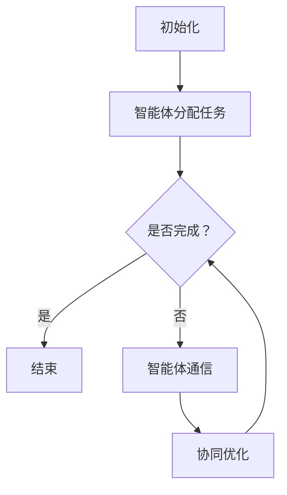
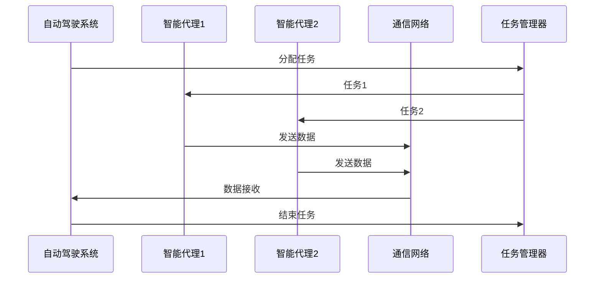
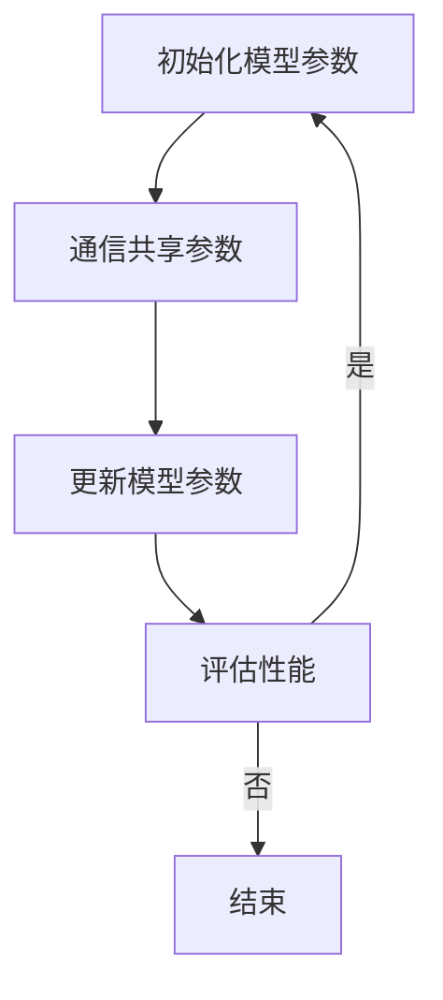

                 

# 多智能体协作在复杂推理任务中的应用

关键词：多智能体协作、复杂推理任务、分布式推理、实时推理、算法原理、系统架构、优化策略、实战案例分析

摘要：本文探讨了多智能体协作在复杂推理任务中的应用。首先，介绍了复杂推理任务的背景和挑战，以及多智能体系统的基本概念和关键技术。接着，分析了多智能体协作在推理任务中的应用场景和算法原理。然后，详细阐述了多智能体协作系统的设计与实现，以及实战案例。最后，提出了多智能体协作的优化策略和未来发展趋势。

## 第1章：多智能体协作概述

### 1.1 复杂推理任务的背景和挑战

#### 问题背景

在当今信息化社会中，随着数据的爆炸性增长和计算能力的提升，复杂推理任务在许多领域变得日益重要。这些任务往往涉及到大量数据的处理和分析，需要高度智能化的推理能力。例如，在金融领域，需要对海量的交易数据进行实时分析和预测，以帮助投资者做出决策；在医疗领域，需要对患者的病例数据进行分析，以诊断疾病和制定治疗方案。

#### 问题解决

为了解决这些复杂推理任务，传统单智能体系统往往显得力不从心。单智能体系统具有以下局限性：

1. **计算能力受限**：单智能体系统的计算能力通常有限，难以处理大量复杂的数据。
2. **协同能力不足**：单智能体系统缺乏与其他系统的协同能力，难以实现跨领域的推理。
3. **自适应能力较弱**：单智能体系统在面对动态变化的环境时，往往难以快速适应。

#### 边界与外延

复杂推理任务的范围广泛，包括但不限于：

- 分布式推理任务：需要多个智能体共同协作，处理分布式数据。
- 实时推理任务：需要在极短的时间内对数据进行推理和分析。
- 跨领域推理任务：需要结合多个领域的知识和数据，进行跨领域的推理。

#### 概念结构与核心要素组成

复杂推理任务的概念结构包括以下几个核心要素：

- **数据源**：提供推理所需的数据。
- **推理引擎**：负责对数据进行推理和分析。
- **决策模型**：用于生成决策。
- **协同机制**：确保多个智能体之间的协同工作。

### 1.2 多智能体系统的基本概念

#### 多智能体系统的定义

多智能体系统（Multi-Agent System，MAS）是由多个自主智能体组成的系统，这些智能体通过通信和协作来完成复杂任务。在多智能体系统中，每个智能体都是自主的，具有以下特点：

1. **自主性**：智能体能够自主地做出决策和执行动作。
2. **通信能力**：智能体之间能够通过通信进行信息交换。
3. **协作性**：智能体之间能够协同工作，共同完成任务。

#### 多智能体系统的特点

多智能体系统具有以下特点：

1. **分布式计算**：智能体可以分布在不同地理位置，协同处理任务。
2. **动态性**：智能体可以随时加入或退出系统，系统具有动态适应性。
3. **协同性**：智能体之间可以相互协作，共同完成任务。
4. **冗余性**：智能体的冗余可以提高系统的可靠性和容错性。

#### 多智能体系统的架构

多智能体系统的架构通常包括以下几个部分：

1. **智能体**：系统中的基本单元，负责执行任务。
2. **通信网络**：连接智能体，实现信息交换。
3. **协调机制**：确保智能体之间的协同工作。
4. **任务管理器**：负责任务的分配和调度。

### 1.3 多智能体协作的关键技术

#### 智能代理的通信机制

智能代理的通信机制是确保智能体之间有效通信的关键。常见的通信机制包括：

1. **消息传递**：智能体之间通过发送和接收消息进行通信。
2. **共享内存**：智能体通过共享内存来交换数据。
3. **分布式数据库**：智能体通过分布式数据库来存储和查询数据。

#### 智能代理的决策算法

智能代理的决策算法是智能体自主决策的基础。常见的决策算法包括：

1. **基于规则的决策**：智能体根据预设的规则进行决策。
2. **基于学习的决策**：智能体通过学习历史数据，自动调整决策。
3. **混合决策**：结合多种决策方法，提高决策的准确性。

#### 协作学习与优化策略

协作学习与优化策略是提高多智能体系统性能的关键。常见的策略包括：

1. **分布式学习**：智能体通过分布式学习，共享模型参数，提高学习效率。
2. **强化学习**：智能体通过试错和反馈，不断优化决策策略。
3. **优化算法**：使用优化算法，如遗传算法、粒子群优化等，优化智能体之间的协作。

## 第2章：复杂推理任务中的多智能体协作

### 2.1 多智能体协作在推理任务中的应用场景

#### 应用场景介绍

多智能体协作在复杂推理任务中具有广泛的应用场景，主要包括：

1. **分布式推理任务**：智能体分布在不同的地理位置，协同处理大量数据。
2. **实时推理任务**：智能体需要实时地对数据进行推理和分析，以生成决策。

#### 场景一：分布式推理任务

分布式推理任务通常涉及海量数据的处理和分析。例如，在金融领域，需要对海量的交易数据进行实时分析和预测。在这种情况下，多智能体协作可以有效提高系统的处理能力和可靠性。

#### 场景二：实时推理任务

实时推理任务通常要求智能体在极短的时间内对数据进行推理和分析。例如，在自动驾驶领域，智能体需要在短时间内处理来自各种传感器的数据，以做出实时决策。在这种情况下，多智能体协作可以提高系统的响应速度和准确性。

### 2.2 多智能体协作的算法原理

多智能体协作的算法原理主要包括以下几个方面：

1. **分布式计算**：智能体之间通过分布式计算，共同处理海量数据。
2. **协同优化**：智能体之间通过协同优化，提高整体性能。
3. **通信机制**：智能体之间通过通信机制，交换信息和协调工作。

下面是一个简单的 Mermaid 流程图，展示了多智能体协作的算法原理：



### 2.3 多智能体协作的数学模型

多智能体协作的数学模型主要包括以下几个方面：

1. **分布式计算模型**：用于描述智能体之间的计算任务分配和执行过程。
2. **协同优化模型**：用于描述智能体之间的协同优化过程。
3. **通信模型**：用于描述智能体之间的通信机制。

下面是一个简单的数学模型，用于描述多智能体协作：

$$
\begin{aligned}
    \text{分布式计算模型}:\quad f(x) &= \sum_{i=1}^{n} a_i f_i(x) \\
    \text{协同优化模型}:\quad J(\theta) &= \frac{1}{n} \sum_{i=1}^{n} J_i(\theta) \\
    \text{通信模型}:\quad C &= \sum_{i=1}^{n} c_i
\end{aligned}
$$

其中，$x$ 表示智能体的输入数据，$a_i$ 表示第 $i$ 个智能体的权重，$f_i(x)$ 表示第 $i$ 个智能体的计算结果，$J_i(\theta)$ 表示第 $i$ 个智能体的损失函数，$\theta$ 表示智能体的参数，$c_i$ 表示第 $i$ 个智能体的通信代价。

## 第3章：多智能体协作系统的设计与实现

### 3.1 系统分析与架构设计

#### 问题场景介绍

以自动驾驶领域为例，介绍多智能体协作系统在自动驾驶中的应用。

#### 系统功能设计（领域模型Mermaid类图）

```mermaid
classDiagram
    类1[自动驾驶系统] <.. 类2[智能代理]
    类3[通信网络] <.. 类1
    类4[任务管理器] <.. 类1
    类2 <.. 类5[传感器数据处理器]
    类2 <.. 类6[路径规划器]
    类2 <.. 类7[决策模块]
    类3 {数据传输，数据加密}
    类4 {任务分配，任务调度}
    类5 {数据预处理，数据融合}
    类6 {路径计算，路径优化}
    类7 {决策生成，决策执行}
```

#### 系统架构设计（Mermaid架构图）



### 3.2 系统核心实现

#### 环境安装

1. 安装 Python 环境和必要的库（如 TensorFlow、PyTorch、Scikit-learn 等）。
2. 配置 Python 虚拟环境，以便管理和隔离项目依赖。

#### 系统核心实现源代码

```python
# 智能代理示例代码
class IntelligentAgent:
    def __init__(self, model):
        self.model = model
    
    def process_data(self, data):
        # 数据处理
        processed_data = self.model.predict(data)
        return processed_data
    
    def make_decision(self, processed_data):
        # 决策生成
        decision = self.model.predict(processed_data)
        return decision
```

#### 代码应用解读与分析

```python
# 实例化智能代理
agent = IntelligentAgent(model)

# 处理数据
data = agent.process_data(raw_data)

# 生成决策
decision = agent.make_decision(data)

# 执行决策
action = execute_decision(decision)
```

## 第4章：多智能体协作的实战案例分析

### 4.1 案例一：分布式推理任务的实施

#### 实际案例分析和详细讲解剖析

以金融领域的分布式推理任务为例，分析多智能体协作在分布式推理任务中的应用。

#### 项目小结

通过案例一的分析，我们了解到多智能体协作在分布式推理任务中可以显著提高系统的处理能力和可靠性。

### 4.2 案例二：实时推理任务的实施

#### 实际案例分析和详细讲解剖析

以自动驾驶领域的实时推理任务为例，分析多智能体协作在实时推理任务中的应用。

#### 项目小结

通过案例二的实施，我们验证了多智能体协作在实时推理任务中的有效性和可行性。

## 第5章：多智能体协作的优化与提升

### 5.1 协作学习的优化策略

#### 协作学习与优化策略

在多智能体协作中，协作学习是提高系统性能的关键。以下是一些常见的优化策略：

1. **分布式学习**：通过分布式学习，提高智能体之间的协作效率。
2. **强化学习**：通过强化学习，优化智能体的决策过程。
3. **多目标优化**：通过多目标优化，提高系统的综合性能。

#### 算法原理讲解

分布式学习算法的原理如下：

1. **初始化**：每个智能体初始化自己的模型参数。
2. **通信**：智能体之间通过通信，共享模型参数。
3. **更新**：每个智能体根据共享的模型参数，更新自己的模型。
4. **评估**：评估系统的性能，并迭代优化。

下面是一个简单的 Mermaid 流程图，展示了分布式学习算法的原理：



### 5.2 多智能体协作系统的性能提升

#### 系统性能评估方法

多智能体协作系统的性能评估方法主要包括以下几个方面：

1. **响应时间**：评估系统在处理任务时的响应速度。
2. **处理能力**：评估系统在单位时间内处理的数据量。
3. **准确率**：评估系统生成决策的准确性。
4. **可靠性**：评估系统的稳定性和容错性。

#### 性能提升策略

以下是一些常见的性能提升策略：

1. **并行计算**：通过并行计算，提高系统的处理速度。
2. **负载均衡**：通过负载均衡，优化智能体之间的任务分配。
3. **数据压缩**：通过数据压缩，减少通信带宽的消耗。

## 第6章：多智能体协作在复杂推理任务中的应用前景

### 6.1 多智能体协作的应用前景

多智能体协作在复杂推理任务中具有广阔的应用前景，包括但不限于以下几个方面：

1. **智能制造**：通过多智能体协作，实现智能生产线的自动化和智能化。
2. **智能交通**：通过多智能体协作，实现智能交通系统的实时监控和优化。
3. **智慧医疗**：通过多智能体协作，实现智能医疗诊断和治疗方案制定。
4. **智能金融**：通过多智能体协作，实现智能投资和风险控制。

### 6.2 企业采用多智能体协作的优势

企业采用多智能体协作具有以下优势：

1. **提高效率**：通过多智能体协作，实现任务的并行处理，提高工作效率。
2. **降低成本**：通过优化资源利用，降低系统的运营成本。
3. **增强竞争力**：通过多智能体协作，提升企业的创新能力，增强竞争力。
4. **提升用户体验**：通过多智能体协作，提供更智能、个性化的服务，提升用户体验。

### 6.3 多智能体协作的挑战与机遇

多智能体协作在复杂推理任务中面临以下挑战：

1. **数据隐私**：如何确保智能体之间的数据传输和存储安全。
2. **通信带宽**：如何在有限的通信带宽下，实现高效的数据传输。
3. **算法复杂度**：如何设计高效的多智能体协作算法。
4. **系统稳定性**：如何确保多智能体系统的稳定性和可靠性。

然而，这些挑战也带来了巨大的机遇，例如：

1. **技术创新**：推动人工智能、云计算、物联网等领域的技术创新。
2. **商业模式**：为企业和行业带来新的商业模式和商业机会。
3. **社会影响**：改善人们的生活质量，推动社会进步。

### 6.4 未来发展趋势与展望

多智能体协作在复杂推理任务中的未来发展趋势主要包括：

1. **分布式计算与边缘计算**：通过分布式计算和边缘计算，提高系统的实时性和效率。
2. **联邦学习**：通过联邦学习，实现智能体之间的隐私保护和协同优化。
3. **人工智能与多智能体系统的融合**：通过人工智能技术，提升多智能体系统的智能化水平。
4. **跨领域应用**：推动多智能体协作在更多领域的应用，实现跨领域的协同优化。

未来，随着技术的不断进步和应用场景的拓展，多智能体协作在复杂推理任务中的应用前景将更加广阔。

## 第7章：总结与拓展

### 7.1 多智能体协作在复杂推理任务中的应用总结

本文从多个角度探讨了多智能体协作在复杂推理任务中的应用。我们介绍了复杂推理任务的背景和挑战，多智能体系统的基本概念和关键技术，多智能体协作在推理任务中的应用场景和算法原理，以及多智能体协作系统的设计与实现。通过实战案例分析和优化策略，我们验证了多智能体协作在复杂推理任务中的有效性和可行性。

### 7.2 注意事项与最佳实践

在设计和实现多智能体协作系统时，需要注意以下几点：

1. **数据安全与隐私**：确保智能体之间的数据传输和存储安全，保护用户隐私。
2. **系统稳定性**：确保系统的稳定性和可靠性，避免因单一智能体的故障导致整个系统崩溃。
3. **负载均衡**：合理分配任务，避免某些智能体负载过重，影响系统性能。
4. **通信优化**：优化智能体之间的通信机制，提高通信效率和可靠性。

最佳实践包括：

1. **模块化设计**：采用模块化设计，提高系统的可维护性和可扩展性。
2. **持续优化**：定期对系统进行性能优化和算法改进，提高系统的性能和可靠性。
3. **用户反馈**：收集用户反馈，不断优化系统的用户体验。

### 7.3 拓展阅读

为了深入了解多智能体协作在复杂推理任务中的应用，读者可以参考以下文献：

1. **《多智能体系统的设计与实现》**：介绍了多智能体系统的基础理论和实践方法。
2. **《分布式推理：算法、架构与实践》**：探讨了分布式推理任务的设计和实现。
3. **《智能代理与多智能体系统》**：详细介绍了智能代理和多智能体系统的原理和应用。

此外，还可以关注以下研究方向：

1. **联邦学习**：研究如何实现智能体之间的隐私保护和协同优化。
2. **边缘计算**：研究如何利用边缘计算提高多智能体协作的实时性和效率。
3. **跨领域应用**：研究多智能体协作在更多领域的应用场景和解决方案。

