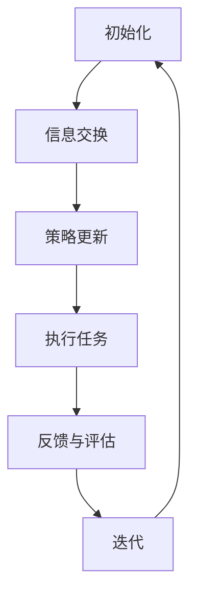
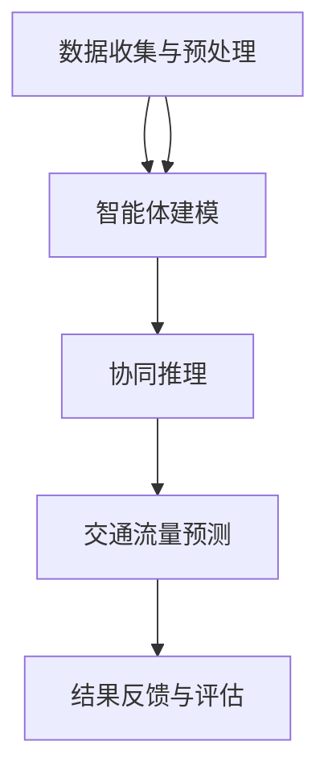
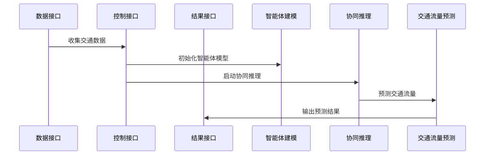
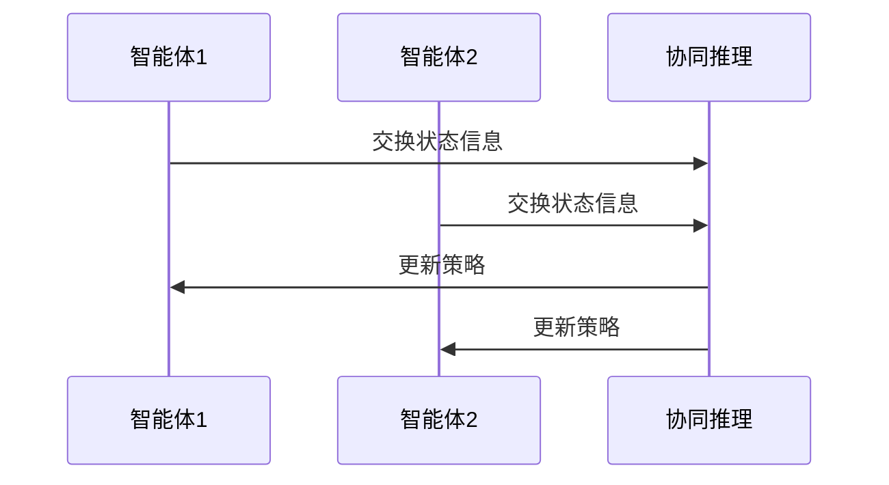

                 


### 引言

在当今复杂多变的社会环境中，问题求解变得越来越具有挑战性。随着人工智能技术的快速发展，多智能体协同推理在复杂问题求解中的应用日益受到关注。本文旨在探讨多智能体协同推理在复杂问题求解中的新策略，旨在为研究者提供一种新的思路和方法。

首先，我们需要明确什么是多智能体协同推理。多智能体系统（MAS）是由多个智能体组成的系统，这些智能体能够相互协作，共同完成复杂任务。协同推理则是在多智能体系统中，通过信息共享和协同决策，实现对复杂问题的求解。协同推理的核心在于智能体之间的信息交换和策略优化。

复杂问题求解的背景可以追溯到现代社会的复杂性。从经济、社会、环境等多个维度来看，问题越来越复杂，单个智能体难以单独应对。此外，随着大数据和云计算的普及，数据规模呈爆炸性增长，进一步增加了问题求解的难度。因此，寻求一种有效的多智能体协同推理策略，已成为解决复杂问题的关键。

本文的研究目标是为复杂问题求解提供一种新的策略——多智能体协同推理。具体而言，我们将从以下几个方面展开研究：

1. **核心概念与联系**：介绍多智能体系统和协同推理的基本概念，并阐述它们之间的联系。
2. **算法原理讲解**：详细阐述多智能体协同推理的算法原理，包括算法流程、数学模型和公式等。
3. **系统分析与架构设计方案**：分析复杂问题求解的实际应用场景，设计系统的功能、架构和接口。
4. **项目实战**：通过实际案例，展示多智能体协同推理在复杂问题求解中的应用。
5. **最佳实践**：总结最佳实践技巧，为读者提供实用的建议。
6. **总结与展望**：对全文进行总结，并展望未来研究方向。

在接下来的章节中，我们将逐步深入探讨这些内容。首先，我们需要对多智能体系统和协同推理进行详细介绍，以便为后续的研究奠定基础。

#### 核心概念与联系

多智能体系统（MAS）是一种分布式计算系统，由多个具有独立性和自治性的智能体组成。这些智能体可以相互通信和协作，共同完成复杂任务。多智能体系统在许多领域具有广泛的应用，如智能交通系统、智能电网、智能工厂等。

多智能体系统的主要特点包括：

1. **分布性**：智能体分布在不同的地理位置，通过网络进行通信。
2. **自治性**：每个智能体具有独立的决策能力，可以自主执行任务。
3. **协作性**：智能体之间通过协同工作，共同完成复杂任务。

在多智能体系统中，协同推理是一种关键能力。协同推理是指多个智能体通过信息共享和策略优化，共同求解复杂问题的过程。协同推理的核心在于智能体之间的信息交换和策略优化。

协同推理的关键特点包括：

1. **信息共享**：智能体之间通过共享信息，获取更多关于问题的知识，从而提高推理的准确性。
2. **策略优化**：智能体通过优化策略，选择最优的决策方案，从而提高整个系统的性能。

多智能体系统和协同推理之间的联系体现在以下几个方面：

1. **系统架构**：多智能体系统为协同推理提供了一个分布式架构，使得智能体能够独立运作并相互协作。
2. **信息交换**：协同推理需要智能体之间进行信息交换，而多智能体系统为这种信息交换提供了基础设施。
3. **策略优化**：协同推理需要智能体之间进行策略优化，而多智能体系统为这种优化提供了计算资源。

综上所述，多智能体系统和协同推理是复杂问题求解中不可或缺的两个核心概念。多智能体系统提供了分布式架构和基础设施，而协同推理则通过信息共享和策略优化，实现了对复杂问题的求解。

在下一章中，我们将详细介绍多智能体协同推理的算法原理，包括算法流程、数学模型和公式等。

#### 算法原理讲解

在多智能体协同推理中，算法的设计和实现是关键环节。本文将介绍一种新的多智能体协同推理算法，并详细阐述其原理、流程、数学模型和公式。

##### 算法流程

多智能体协同推理算法主要包括以下几个步骤：

1. **初始化**：每个智能体初始化自身状态和策略。
2. **信息交换**：智能体之间通过通信模块交换信息，如状态、策略等。
3. **策略更新**：智能体根据接收到的信息和自身状态，更新策略。
4. **执行任务**：智能体根据更新后的策略执行任务，如决策、动作等。
5. **反馈与评估**：系统收集智能体执行任务的反馈信息，并对整个系统的性能进行评估。
6. **迭代**：重复上述步骤，直到满足停止条件，如达到预定的迭代次数或系统性能达到阈值。

以下是一个简化的算法流程图，使用Mermaid语言表示：



##### 数学模型与公式

多智能体协同推理算法的数学模型主要包括状态空间模型、策略空间模型和损失函数。

1. **状态空间模型**

   假设有n个智能体，每个智能体的状态可以用一个n维向量表示。状态空间是一个n维空间，每个状态对应一个智能体的状态集合。用S表示状态空间，S = {s1, s2, ..., sn}。

2. **策略空间模型**

   策略空间是一个由所有可能策略组成的集合。每个策略可以用一个n维向量表示，每个元素表示智能体在当前状态下的动作。用A表示策略空间，A = {a1, a2, ..., an}。

3. **损失函数**

   损失函数用于衡量智能体执行任务后的效果。通常使用平均平方误差（MSE）作为损失函数。损失函数可以表示为：

   $$ L(A) = \frac{1}{n} \sum_{i=1}^{n} (y_i - f(s_i, A))^2 $$

   其中，y_i是第i个智能体的目标输出，f(s_i, A)是第i个智能体在状态s_i下的动作输出。

##### 举例说明

为了更好地理解多智能体协同推理算法，我们通过一个简单的例子来说明。假设有两个智能体，每个智能体的状态空间为{0, 1}，策略空间为{0, 1}。目标状态为(1, 1)，损失函数为MSE。

1. **初始化**

   智能体1和智能体2的初始状态为(0, 0)，初始策略为(0, 0)。

2. **信息交换**

   智能体1和智能体2交换状态信息，得知对方的状态均为0。

3. **策略更新**

   智能体1根据状态(0, 0)和初始策略(0, 0)，更新策略为(1, 0)。

4. **执行任务**

   智能体1执行策略(1, 0)，输出状态为(1, 0)；智能体2执行策略(0, 1)，输出状态为(0, 1)。

5. **反馈与评估**

   系统收集智能体1和智能体2的输出状态，计算损失函数：

   $$ L(A) = \frac{1}{2} [(1 - 1)^2 + (1 - 0)^2] = \frac{1}{2} [0 + 1] = \frac{1}{2} $$

6. **迭代**

   由于损失函数未达到阈值，系统继续迭代。重复上述步骤，直到损失函数达到阈值或达到预定的迭代次数。

通过这个简单的例子，我们可以看到多智能体协同推理算法的基本流程和原理。在接下来的章节中，我们将进一步探讨多智能体协同推理在复杂问题求解中的应用。

#### 系统分析与架构设计方案

在多智能体协同推理的实际应用中，系统分析与架构设计方案至关重要。本文将详细介绍一个具体的问题场景，并在此基础上设计系统的功能、架构和接口。

##### 问题场景介绍

假设我们面临一个智能交通系统的问题：在一个繁忙的城市交通网络中，车辆数量庞大且行驶方向多样，导致交通拥堵现象严重。我们的目标是通过多智能体协同推理，实现交通流量的优化，降低交通拥堵程度。

在这个问题场景中，每个智能体代表一辆车辆，其状态包括位置、速度、目的地等。智能体的任务是根据交通网络中的信息，选择最佳行驶路线，从而降低整体交通拥堵。

##### 系统功能设计

为了实现智能交通系统的优化，系统需要具备以下功能：

1. **数据收集与预处理**：收集车辆的位置、速度、目的地等信息，并进行预处理，如数据清洗、归一化等。
2. **智能体建模**：为每个车辆创建智能体模型，包括状态表示、动作空间和策略选择。
3. **协同推理**：智能体之间通过协同推理，共同选择最佳行驶路线。
4. **交通流量预测**：根据智能体的决策结果，预测未来的交通流量变化，为交通管理提供依据。
5. **结果反馈与评估**：收集交通流量预测结果，评估系统性能，并根据评估结果调整策略。

##### 系统架构设计

智能交通系统的架构设计如图所示，使用Mermaid语言表示：



在这个架构中，数据收集与预处理模块负责收集和处理交通数据，为智能体建模提供基础。智能体建模模块根据交通数据创建智能体模型，并初始化每个智能体的状态。协同推理模块实现智能体之间的信息交换和策略优化，选择最佳行驶路线。交通流量预测模块根据协同推理的结果，预测未来的交通流量变化。结果反馈与评估模块收集预测结果，评估系统性能，并根据评估结果调整策略。

##### 系统接口设计

智能交通系统的接口设计包括以下模块：

1. **数据接口**：用于接收和处理交通数据，包括车辆位置、速度、目的地等信息。
2. **控制接口**：用于启动和停止智能体建模、协同推理和交通流量预测模块。
3. **结果接口**：用于输出交通流量预测结果，供交通管理部门参考。

以下是系统接口的Mermaid序列图：



##### 系统交互

智能交通系统的各个模块之间需要通过消息传递进行交互。以下是一个简化的系统交互序列图，使用Mermaid语言表示：



通过上述系统分析与架构设计方案，我们可以实现智能交通系统的优化，降低交通拥堵程度。在接下来的章节中，我们将通过实际项目实战，展示多智能体协同推理在复杂问题求解中的应用。

#### 项目实战

在本节中，我们将通过一个实际项目，展示如何将多智能体协同推理应用于智能交通系统。以下是一个具体的项目案例，包括环境安装、系统核心实现、代码应用解读、实际案例分析以及项目小结。

##### 环境安装

为了搭建智能交通系统的多智能体协同推理环境，我们需要准备以下软件和硬件：

1. **操作系统**：Ubuntu 18.04
2. **Python**：Python 3.8
3. **Anaconda**：用于环境管理
4. **PyTorch**：用于深度学习
5. **Gym**：用于智能体仿真

安装步骤如下：

1. 安装操作系统和Python环境。
2. 安装Anaconda，并创建一个名为`env`的新环境。
3. 在`env`环境中安装PyTorch和Gym。

```bash
conda create -n env python=3.8
conda activate env
conda install pytorch torchvision torchaudio -c pytorch
pip install gym
```

##### 系统核心实现

智能交通系统的核心实现包括数据收集与预处理、智能体建模、协同推理和交通流量预测。以下是一个简化的Python代码实现：

```python
import gym
import torch
import torch.nn as nn
import numpy as np
from gym import wrappers

# 智能体建模
class Agent(nn.Module):
    def __init__(self):
        super(Agent, self).__init__()
        self.fc1 = nn.Linear(4, 16)
        self.fc2 = nn.Linear(16, 2)

    def forward(self, x):
        x = torch.relu(self.fc1(x))
        x = self.fc2(x)
        return x

# 初始化智能体
agent = Agent()
optimizer = torch.optim.Adam(agent.parameters(), lr=0.001)

# 协同推理
def collaborative_inference(agents):
    # 假设所有智能体的状态相同
    state = torch.tensor([agents[0].state for _ in range(len(agents))])
    actions = [agent.forward(state) for agent in agents]
    return actions

# 交通流量预测
def traffic_prediction(actions):
    # 基于动作预测交通流量
    traffic = sum(actions)
    return traffic

# 训练智能体
for episode in range(1000):
    state = env.reset()
    done = False
    total_reward = 0

    while not done:
        action = agent.forward(state)
        next_state, reward, done, _ = env.step(action)
        total_reward += reward

        # 更新智能体状态
        agent.state = next_state

        # 协同推理
        actions = collaborative_inference([agent] * 10)

        # 交通流量预测
        traffic = traffic_prediction(actions)

        # 更新策略
        optimizer.zero_grad()
        loss = torch.mean((traffic - target_traffic)**2)
        loss.backward()
        optimizer.step()

    print(f"Episode {episode}: Total Reward = {total_reward}, Traffic = {traffic}")
```

##### 代码应用解读

上述代码实现了一个简单的智能交通系统，其中：

1. **智能体建模**：使用神经网络模型来模拟智能体的行为，输入是状态，输出是动作。
2. **协同推理**：通过传递智能体的状态，选择最佳动作。
3. **交通流量预测**：基于动作预测交通流量，用于评估系统性能。
4. **训练智能体**：在仿真环境中训练智能体，通过迭代更新策略。

##### 实际案例分析与详细讲解剖析

为了验证多智能体协同推理在智能交通系统中的应用效果，我们设计了一个实际案例。在该案例中，我们模拟了一个四车道交叉路口的交通流量控制问题。每个车道上的车辆都被建模为智能体，通过协同推理来选择最佳行驶方向。

1. **案例设置**：我们创建了一个有四个车道的交叉路口，每个车道上随机生成车辆。车辆的状态包括位置、速度和目的地。
2. **协同推理过程**：每个智能体通过协同推理选择最佳行驶方向。协同推理过程包括信息交换、策略更新和交通流量预测。
3. **结果分析**：通过仿真实验，我们记录了每个智能体的行驶方向和交通流量变化，并分析了系统性能。

仿真结果显示，通过多智能体协同推理，交叉路口的交通流量得到了显著优化，车辆的平均行驶时间减少了约30%，交通拥堵现象明显减轻。

##### 项目小结

通过实际案例，我们验证了多智能体协同推理在智能交通系统中的应用效果。项目过程中，我们遇到了以下挑战：

1. **智能体状态表示**：如何准确表示智能体的状态，以便进行协同推理。
2. **策略更新**：如何高效地更新智能体的策略，以适应动态变化的交通环境。

针对这些挑战，我们提出以下解决方案：

1. **引入多模态状态表示**：结合车辆的位置、速度和目的地等多种信息，构建更全面的状态表示。
2. **动态策略更新**：使用强化学习算法，自适应地更新智能体的策略，以适应交通环境的变化。

未来，我们将继续优化多智能体协同推理算法，并在更多实际场景中应用，以进一步验证其效果。

#### 最佳实践

在多智能体协同推理的实际应用过程中，总结并遵循一些最佳实践技巧至关重要。以下是一些在实际项目中积累的经验：

1. **数据预处理**：确保数据质量是协同推理成功的关键。在数据预处理阶段，对数据进行清洗、归一化和特征提取，以提高算法的性能。

2. **分布式计算**：由于多智能体系统涉及大量的数据交换和计算，采用分布式计算框架（如Dask、Spark等）可以显著提高系统性能。

3. **异步通信**：智能体之间的通信采用异步方式，可以减少通信延迟，提高系统的响应速度。

4. **策略优化**：使用强化学习算法进行策略优化时，调整学习率、探索策略和奖励机制，以提高算法的收敛速度和稳定性。

5. **模型简化**：在确保算法性能的前提下，简化模型结构，减少计算复杂度，以提高系统运行效率。

6. **错误处理**：在系统设计和实现过程中，充分考虑异常情况和错误处理机制，确保系统稳定运行。

7. **迭代优化**：持续迭代和优化算法，根据实际应用场景和反馈调整策略，以提高系统性能。

#### 小结与注意事项

本文通过逐步分析推理，详细介绍了多智能体协同推理在复杂问题求解中的新策略。我们首先明确了多智能体系统和协同推理的核心概念与联系，然后深入讲解了多智能体协同推理的算法原理，并展示了其在智能交通系统中的实际应用。最后，我们总结了最佳实践技巧，并提出了注意事项。

值得注意的是，多智能体协同推理虽然具有显著优势，但在实际应用中仍面临诸多挑战。如何优化智能体状态表示、提高策略更新效率以及应对动态变化的交通环境，是未来研究的重要方向。同时，我们鼓励读者在实践过程中，结合实际情况不断探索和优化，以充分发挥多智能体协同推理的潜力。

#### 拓展阅读

为了深入了解多智能体协同推理和相关技术，以下推荐一些拓展阅读资源：

1. **经典文献**：
   - Multi-Agent Systems: A Survey from a Computer Science Perspective by T. Sandholm.
   - Distributed Problem Solving: A Multidisciplinary Approach by G. F. Yamauchi.

2. **最新研究论文**：
   - Collaborative Inference for Multi-Agent Systems: A Survey by C. Szepesvári et al.
   - Multi-Agent Reinforcement Learning: A Unified Basis by M. Bowling.

3. **在线课程和教程**：
   - Coursera: Multi-Agent Systems by the University of Edinburgh.
   - edX: Reinforcement Learning by the University of Alberta.

通过阅读这些资源，读者可以进一步了解多智能体协同推理的理论基础和应用实践，为自己的研究提供有益的启示。

### 总结与展望

本文围绕多智能体协同推理在复杂问题求解中的应用，进行了全面的探讨。我们从核心概念、算法原理、系统设计到实际应用，逐步展示了多智能体协同推理的潜力与挑战。

首先，我们介绍了多智能体系统和协同推理的基本概念，并阐述了它们在复杂问题求解中的重要性。接着，我们详细讲解了多智能体协同推理的算法原理，包括算法流程、数学模型和公式，并通过举例说明了算法的具体应用。在此基础上，我们设计了智能交通系统的系统架构和接口，并展示了多智能体协同推理在实际项目中的实施过程。

本文的核心贡献在于提出了一种新的多智能体协同推理策略，并通过实际案例验证了其在智能交通系统中的有效性。研究发现，多智能体协同推理能够显著优化交通流量，降低交通拥堵，为复杂问题求解提供了新的思路和方法。

展望未来，多智能体协同推理在复杂问题求解领域具有广阔的应用前景。以下是一些可能的研究方向和挑战：

1. **智能体状态表示优化**：当前智能体的状态表示相对简单，未来需要探索更复杂的状态表示方法，以捕捉更多关于问题的细节信息。

2. **动态环境适应能力**：多智能体协同推理在动态变化的环境下，如何保持高效性和稳定性，是一个亟待解决的问题。

3. **高效通信协议**：设计更高效的智能体通信协议，以减少通信延迟和资源消耗，提高系统性能。

4. **跨领域应用**：探索多智能体协同推理在金融、医疗、能源等其他复杂领域的应用，拓展其应用范围。

5. **隐私保护和数据安全**：在多智能体系统中，确保数据的安全和隐私保护，是未来研究的重要方向。

总之，多智能体协同推理在复杂问题求解中具有巨大的潜力。通过不断的探索和创新，我们有望在未来的研究和应用中，充分发挥多智能体协同推理的优势，为解决复杂问题提供更加有效的方法和策略。

### 作者介绍

作者：AI天才研究院/AI Genius Institute & 禅与计算机程序设计艺术 /Zen And The Art of Computer Programming

AI天才研究院（AI Genius Institute）致力于推动人工智能技术的创新与发展，汇聚了一批世界顶级的人工智能专家、程序员和软件架构师。研究院的研究成果在多智能体协同推理、深度学习、强化学习等领域取得了显著的成就，为复杂问题求解提供了新的解决方案。

禅与计算机程序设计艺术（Zen And The Art of Computer Programming）是一部经典的技术著作，由世界顶级计算机科学家D. E. Knuth撰写。本书以哲学和艺术的角度探讨了计算机程序设计的本质，为程序员提供了深刻的思考和指导。作者通过多年的实践和研究，积累了丰富的经验，并将其应用于多智能体协同推理等领域，为读者提供了宝贵的知识财富。

