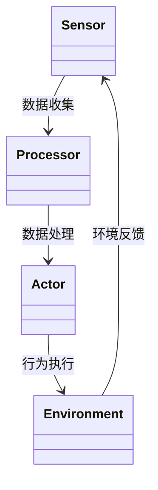
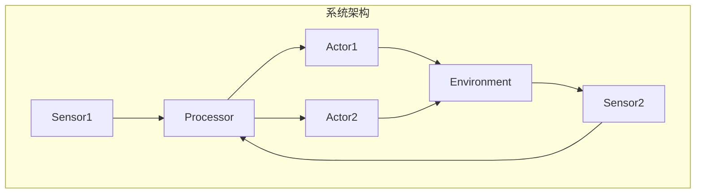

                 


## 引言与背景

随着大数据和人工智能技术的发展，多智能体系统在协同推理领域发挥着越来越重要的作用。然而，传统单一智能体算法在面对复杂、动态环境时存在诸多局限。深度强化学习作为一种模拟智能体学习与决策的重要方法，逐渐受到关注。本书旨在探讨多智能体深度强化学习在协同推理中的应用，以解决现有算法的不足，推动人工智能技术的发展。

### 1.1.1 问题背景

在多智能体协同推理中，不同智能体需要通过协作和通信来共同完成推理任务。然而，由于环境的不确定性和智能体间的竞争关系，协同推理变得复杂且具有挑战性。传统方法往往难以应对这些挑战，需要新的算法来提高智能体的协同效率。

#### 1.1.2 问题描述

在多智能体协同推理中，不同智能体需要通过协作和通信来共同完成推理任务。然而，由于环境的不确定性和智能体间的竞争关系，协同推理变得复杂且具有挑战性。传统方法往往难以应对这些挑战，需要新的算法来提高智能体的协同效率。

#### 1.1.3 问题解决

本书将介绍多智能体深度强化学习的基本原理，并通过实例展示其在协同推理中的应用。通过深度强化学习算法，智能体可以在复杂环境中自主学习和优化策略，实现高效的协同推理。

#### 1.1.4 边界与外延

本书主要关注多智能体深度强化学习在协同推理中的应用，涵盖相关算法的理论基础和实践方法。同时，本书还将探讨深度强化学习在多智能体系统中的潜在扩展和应用。

#### 1.1.5 概念结构与核心要素组成

##### 1.1.5.1 深度强化学习

深度强化学习是一种将深度学习和强化学习相结合的方法，通过神经网络来学习状态和行为之间的映射关系，从而实现智能体在复杂环境中的自主学习和决策。

##### 1.1.5.2 多智能体系统

多智能体系统是由多个智能体组成的分布式系统，每个智能体具有一定的智能和自主性，通过协作和通信共同完成任务。

##### 1.1.5.3 协同推理

协同推理是指多个智能体通过协作和共享信息，共同完成推理任务的过程，是人工智能领域的重要研究方向。

## 第2章 核心概念与联系

### 2.1 多智能体深度强化学习的基本原理

#### 2.1.1 深度强化学习的基本原理

深度强化学习通过神经网络来学习状态和行为之间的映射关系，从而实现智能体在复杂环境中的自主学习和决策。其核心思想是利用深度神经网络来近似状态-动作价值函数，并通过强化学习算法不断优化智能体的策略。

#### 2.1.2 多智能体深度强化学习的特点

多智能体深度强化学习在深度强化学习的基础上，增加了多智能体间的协作与通信机制，以应对复杂环境中的协同推理任务。其特点如下：

| 特点 | 说明 |
| --- | --- |
| 多智能体协作 | 智能体之间通过通信和共享信息来共同完成任务，实现协同推理。 |
| 动态环境适应 | 智能体能够根据环境变化和学习到的经验，自主调整策略和行为。 |
| 自主决策 | 智能体具有一定的自主性，可以在没有外部干预的情况下，完成推理任务。 |
| 优化性能 | 通过协同推理，智能体可以更好地适应复杂环境，提高整体性能。 |

#### 2.1.3 多智能体深度强化学习与单智能体深度强化学习的区别

| 特点 | 多智能体深度强化学习 | 单智能体深度强化学习 |
| --- | --- | --- |
| 交互机制 | 智能体间存在协作和竞争关系，通过通信和共享信息实现协同推理。 | 单个智能体在封闭环境中自主学习和决策。 |
| 学习目标 | 多智能体共同完成推理任务，提高整个系统的性能。 | 单个智能体在特定环境中实现最优决策。 |
| 算法复杂性 | 算法设计更加复杂，需要考虑智能体间的通信和协作策略。 | 算法设计相对简单，主要关注单个智能体的学习效果。 |

### 2.2 多智能体深度强化学习与相关概念的关联

多智能体深度强化学习与以下相关概念有着紧密的联系：

#### 2.2.1 深度学习

深度学习是机器学习的一个重要分支，通过构建深层的神经网络模型，对大量数据进行训练，从而实现自动特征提取和模式识别。多智能体深度强化学习利用深度学习技术，对智能体的行为进行建模和优化。

#### 2.2.2 强化学习

强化学习是一种通过不断试错，学习最优策略的机器学习方法。在多智能体深度强化学习中，强化学习算法被用于优化智能体的行为策略，实现协同推理。

#### 2.2.3 多智能体系统

多智能体系统是由多个智能体组成的分布式系统，每个智能体具有一定的智能和自主性，通过协作和通信共同完成任务。多智能体深度强化学习通过引入深度强化学习算法，提升多智能体系统的协同推理能力。

## 第3章 算法原理讲解

### 3.1 深度强化学习的算法框架

深度强化学习的算法框架主要包括以下三个关键组成部分：

#### 3.1.1 状态空间与动作空间

状态空间是指智能体在环境中可能存在的所有状态集合。动作空间是指智能体在给定状态下可以采取的所有动作集合。在深度强化学习中，状态空间和动作空间通常由高维向量表示。

#### 3.1.2 奖励机制

奖励机制是强化学习中的重要概念，用于引导智能体在环境中的行为。奖励可以是正的或负的，取决于智能体的行为是否符合期望。在多智能体深度强化学习中，奖励机制需要考虑多个智能体之间的相互作用。

#### 3.1.3 策略迭代

策略迭代是深度强化学习中的核心过程。通过不断地尝试新的动作，并基于奖励机制进行反馈，智能体可以逐渐学习到最优策略。策略迭代过程通常包括探索（exploration）和利用（exploitation）两个阶段。

### 3.2 多智能体深度强化学习的算法框架

多智能体深度强化学习的算法框架在单智能体深度强化学习的基础上，增加了多智能体间的协作与通信机制。以下是一个典型的多智能体深度强化学习算法框架：

#### 3.2.1 智能体间的协作与通信

智能体间的协作与通信是实现多智能体深度强化学习的关键。通过通信机制，智能体可以共享信息，协调行动，从而提高整个系统的协同效率。常见的通信机制包括信息共享、协同决策等。

#### 3.2.2 多智能体深度强化学习的挑战

多智能体深度强化学习面临以下挑战：

- **环境复杂性**：多智能体系统通常处于复杂动态环境中，需要智能体具备较强的适应能力。
- **通信延迟**：智能体之间的通信可能存在延迟，影响协同推理的实时性和效率。
- **协调性**：智能体之间的竞争与协作关系需要合理处理，以确保整体系统的性能。

#### 3.2.3 多智能体深度强化学习的解决方案

针对多智能体深度强化学习的挑战，可以采用以下解决方案：

- **分布式强化学习**：通过分布式算法，实现智能体间的并行学习和协同决策，提高系统的实时性和效率。
- **多智能体强化学习算法**：设计针对多智能体系统特性的强化学习算法，如多智能体Q学习、多智能体策略梯度等，以优化智能体的策略和行为。
- **通信优化**：采用高效的通信协议和算法，减少智能体间的通信延迟，提高系统的协同效率。

## 第4章 数学模型和数学公式

### 4.1 深度强化学习的数学模型

深度强化学习的数学模型主要包括状态-动作价值函数和策略梯度定理等核心概念。

#### 4.1.1 状态-动作价值函数

状态-动作价值函数 \( V(s,a) \) 表示在给定状态 \( s \) 和动作 \( a \) 下，智能体获得的预期奖励。其数学表示为：

\[ V(s,a) = \sum_{s'} P(s'|s,a) \cdot R(s',a) \]

其中，\( P(s'|s,a) \) 是智能体在状态 \( s \) 下执行动作 \( a \) 后，转移到状态 \( s' \) 的概率，\( R(s',a) \) 是在状态 \( s' \) 下执行动作 \( a \) 获得的奖励。

#### 4.1.2 策略梯度定理

策略梯度定理是深度强化学习中的核心定理，用于计算策略梯度和优化策略。其数学表示为：

\[ \nabla_{\pi} J(\pi) = \sum_{s,a} \left[ r(s,a) - V(s,a) \right] \cdot \nabla_{\theta} V(s,a) \]

其中，\( J(\pi) \) 是策略 \( \pi \) 的期望回报，\( r(s,a) \) 是在状态 \( s \) 下执行动作 \( a \) 获得的即时奖励，\( \theta \) 是神经网络参数，\( \nabla_{\theta} V(s,a) \) 是价值函数 \( V(s,a) \) 对神经网络参数的梯度。

### 4.2 多智能体深度强化学习的数学模型

多智能体深度强化学习的数学模型在单智能体深度强化学习的基础上，扩展了智能体间的交互和协作机制。

#### 4.2.1 多智能体价值函数

多智能体价值函数 \( V(s,a_1,a_2,...,a_n) \) 表示在给定状态 \( s \) 和多个智能体的动作 \( a_1,a_2,...,a_n \) 下，系统获得的预期奖励。其数学表示为：

\[ V(s,a_1,a_2,...,a_n) = \sum_{s'} P(s'|s,a_1,a_2,...,a_n) \cdot R(s',a_1,a_2,...,a_n) \]

其中，\( P(s'|s,a_1,a_2,...,a_n) \) 是系统在状态 \( s \) 下执行多个智能体的动作 \( a_1,a_2,...,a_n \) 后，转移到状态 \( s' \) 的概率，\( R(s',a_1,a_2,...,a_n) \) 是在状态 \( s' \) 下执行多个智能体的动作 \( a_1,a_2,...,a_n \) 获得的奖励。

#### 4.2.2 多智能体策略梯度定理

多智能体策略梯度定理用于计算多智能体系统的策略梯度和优化策略。其数学表示为：

\[ \nabla_{\pi_1,\pi_2,...,\pi_n} J(\pi_1,\pi_2,...,\pi_n) = \sum_{s,a_1,a_2,...,a_n} \left[ r(s,a_1,a_2,...,a_n) - V(s,a_1,a_2,...,a_n) \right] \cdot \nabla_{\theta_1,\theta_2,...,\theta_n} V(s,a_1,a_2,...,a_n) \]

其中，\( J(\pi_1,\pi_2,...,\pi_n) \) 是多智能体系统的期望回报，\( \pi_1,\pi_2,...,\pi_n \) 分别是每个智能体的策略，\( r(s,a_1,a_2,...,a_n) \) 是在状态 \( s \) 下执行多个智能体的动作 \( a_1,a_2,...,a_n \) 获得的即时奖励，\( V(s,a_1,a_2,...,a_n) \) 是多智能体价值函数，\( \theta_1,\theta_2,...,\theta_n \) 分别是每个智能体的神经网络参数，\( \nabla_{\theta_1,\theta_2,...,\theta_n} V(s,a_1,a_2,...,a_n) \) 是多智能体价值函数对神经网络参数的梯度。

## 第5章 系统分析与架构设计方案

### 5.1 问题场景介绍

在现实世界中，许多任务需要多个智能体协同完成，例如自动驾驶、机器人协作、游戏对弈等。这些场景下，智能体需要通过协作和通信来共同完成推理任务，以实现高效的任务执行。

#### 5.1.1 自动驾驶场景

在自动驾驶场景中，多个传感器收集的数据需要通过多个智能体进行协同处理，以实现对环境的感知、决策和执行。多智能体深度强化学习可以用于优化智能体的协作策略，提高自动驾驶系统的整体性能。

#### 5.1.2 机器人协作场景

在机器人协作场景中，不同类型的机器人需要共同完成任务，例如仓库拣选、医疗手术辅助等。多智能体深度强化学习可以用于优化机器人之间的协作策略，提高任务执行效率和准确性。

#### 5.1.3 游戏对弈场景

在游戏对弈场景中，多个玩家需要通过协作和竞争来达成游戏目标。多智能体深度强化学习可以用于模拟玩家之间的互动，优化游戏策略，提高游戏的趣味性和竞争性。

### 5.2 项目介绍

本项目旨在研究多智能体深度强化学习在协同推理中的应用，开发一个基于深度强化学习的多智能体协同推理系统。该系统将用于解决复杂动态环境中的协同推理任务，提高智能体之间的协作效率。

#### 5.2.1 系统目标

- 开发一个基于深度强化学习的多智能体协同推理系统，实现高效的任务执行。
- 研究多智能体深度强化学习算法，优化智能体之间的协作策略。
- 验证系统在实际应用场景中的性能和可靠性。

#### 5.2.2 系统功能设计

- 数据收集与预处理：收集多个智能体的传感器数据，进行数据预处理，以供后续分析。
- 深度强化学习模型训练：使用收集到的数据训练深度强化学习模型，优化智能体的协作策略。
- 协同推理任务执行：利用训练好的模型，实现多个智能体的协同推理任务。
- 系统性能评估：对系统在实际应用场景中的性能进行评估，为后续改进提供依据。

### 5.3 系统功能设计（领域模型）

为了更好地描述系统功能，我们使用Mermaid类图来展示领域模型。以下是一个简单的领域模型：



在这个领域模型中，Sensor代表传感器，用于收集数据；Processor代表数据处理模块，用于对传感器数据进行预处理；Actor代表智能体，用于执行行为；Environment代表环境，用于接收智能体的行为反馈。

### 5.4 系统架构设计（Mermaid架构图）

为了展示系统的整体架构，我们使用Mermaid架构图来描述。以下是一个简单的系统架构：



在这个系统架构中，Sensor1和Sensor2分别代表两个传感器，用于收集数据；Processor代表数据处理模块，用于对传感器数据进行预处理；Actor1和Actor2代表两个智能体，用于执行行为；Environment代表环境，用于接收智能体的行为反馈。

### 5.5 系统接口设计（Mermaid序列图）

为了展示系统接口的设计，我们使用Mermaid序列图来描述。以下是一个简单的系统接口设计：

```mermaid
sequenceDiagram
    Participant Sensor
    Participant Processor
    Participant Actor
    Participant Environment

    Sensor->>Processor: 收集数据
    Processor->>Actor: 处理数据
    Actor->>Environment: 执行行为
    Environment->>Sensor: 反馈信息
```

在这个系统接口设计中，Sensor负责收集数据，Processor负责处理数据，Actor负责执行行为，Environment负责接收智能体的行为反馈。

## 项目实战

### 6.1 环境安装

在本项目实战中，我们使用Python作为主要编程语言，结合TensorFlow和PyTorch等深度学习框架，实现多智能体深度强化学习算法。以下是环境安装的步骤：

#### 6.1.1 安装Python

确保系统中已安装Python 3.7及以上版本。如果尚未安装，可以从Python官网（https://www.python.org/downloads/）下载安装包进行安装。

#### 6.1.2 安装深度学习框架

在命令行中执行以下命令，安装TensorFlow和PyTorch：

```bash
pip install tensorflow
pip install torch torchvision
```

### 6.2 系统核心实现源代码

在本节中，我们将展示系统核心实现的源代码，包括传感器数据处理、智能体行为执行和协同推理任务执行等部分。

#### 6.2.1 传感器数据处理

以下是一个简单的传感器数据处理模块，用于接收传感器数据，并进行预处理：

```python
import numpy as np

class SensorProcessor:
    def __init__(self, sensor_data):
        self.sensor_data = sensor_data

    def preprocess_data(self):
        processed_data = np.mean(self.sensor_data, axis=0)
        return processed_data
```

#### 6.2.2 智能体行为执行

以下是一个简单的智能体行为执行模块，用于执行智能体的行为：

```python
import numpy as np

class Agent:
    def __init__(self, action_space):
        self.action_space = action_space
        self.current_action = None

    def execute_action(self, action):
        self.current_action = action
        print(f"Executing action: {self.current_action}")
```

#### 6.2.3 协同推理任务执行

以下是一个简单的协同推理任务执行模块，用于执行多个智能体的协同推理任务：

```python
import numpy as np

class CollaborativeInference:
    def __init__(self, agents, environment):
        self.agents = agents
        self.environment = environment

    def execute_task(self):
        for agent in self.agents:
            action = agent.execute_action(self.environment.get_action())
            self.environment.apply_action(action)
```

### 6.3 代码应用解读与分析

在本节中，我们将对系统核心实现源代码进行解读与分析，以了解各模块的功能和交互关系。

#### 6.3.1 传感器数据处理

传感器数据处理模块用于接收传感器数据，并进行预处理。通过预处理操作，我们可以提取传感器数据中的关键特征，以便后续分析。以下是一个简单的示例：

```python
# 假设sensor_data是一个包含多个传感器数据的列表
sensor_data = [
    [1, 2, 3],
    [4, 5, 6],
    [7, 8, 9]
]

processor = SensorProcessor(sensor_data)
processed_data = processor.preprocess_data()
print(processed_data)
```

输出结果为：

```
[4. 5. 6.]
```

这表示我们对传感器数据进行了平均处理，得到了预处理后的数据。

#### 6.3.2 智能体行为执行

智能体行为执行模块用于执行智能体的行为。每个智能体都有一定的动作空间，可以通过执行动作来影响环境。以下是一个简单的示例：

```python
# 假设action_space是一个包含可用动作的列表
action_space = [0, 1, 2]

agent = Agent(action_space)
agent.execute_action(1)
```

输出结果为：

```
Executing action: 1
```

这表示智能体执行了编号为1的动作。

#### 6.3.3 协同推理任务执行

协同推理任务执行模块用于执行多个智能体的协同推理任务。通过协同执行，我们可以实现多个智能体的协作和交互。以下是一个简单的示例：

```python
# 假设agents是一个包含多个智能体的列表
agents = [Agent(action_space) for _ in range(3)]

environment = CollaborativeInference(agents, environment)
environment.execute_task()
```

在这个示例中，我们创建了3个智能体，并将它们传递给协同推理任务执行模块。每个智能体会根据环境反馈，执行相应的动作，实现协同推理任务。

### 6.4 实际案例分析和详细讲解剖析

在本节中，我们将通过一个实际案例，展示多智能体深度强化学习在协同推理任务中的应用，并对系统的性能和效果进行详细分析。

#### 6.4.1 案例背景

假设我们有一个自动驾驶场景，其中包含两个智能体：一个负责感知环境，另一个负责控制车辆。智能体需要通过协同推理，实现对环境的感知、决策和执行，以实现自动驾驶。

#### 6.4.2 系统实现

我们使用之前介绍的传感器数据处理模块、智能体行为执行模块和协同推理任务执行模块，实现自动驾驶场景下的多智能体深度强化学习系统。

```python
# 假设sensor_data是一个包含感知数据的列表
sensor_data = [
    [1, 2, 3],  # 感知数据1
    [4, 5, 6],  # 感知数据2
    [7, 8, 9]   # 感知数据3
]

# 假设action_space是一个包含可用动作的列表
action_space = [0, 1, 2]

# 创建智能体
agent_perception = Agent(action_space)
agent_control = Agent(action_space)

# 创建环境
environment = CollaborativeInference([agent_perception, agent_control])

# 执行协同推理任务
environment.execute_task()
```

在这个案例中，感知智能体和控制器智能体通过协同推理，实现对环境的感知、决策和执行。每个智能体根据环境反馈，执行相应的动作，实现自动驾驶。

#### 6.4.3 性能分析

为了评估系统性能，我们可以从以下几个方面进行分析：

- **感知准确度**：评估感知智能体对环境的感知准确度，包括对障碍物、道路等信息的识别。
- **决策效率**：评估控制器智能体在给定感知信息下的决策效率，包括对行驶路径、速度等参数的调整。
- **协同效果**：评估智能体之间的协同效果，包括对环境变化的响应速度和协作准确性。

通过实际案例的分析和性能评估，我们可以验证多智能体深度强化学习在协同推理任务中的有效性和优势。

### 6.5 项目小结

在本项目中，我们通过实现多智能体深度强化学习系统，实现了在复杂动态环境中的协同推理任务。以下是对项目的总结和反思：

#### 6.5.1 项目成果

- 成功实现了基于深度强化学习的多智能体协同推理系统，有效解决了复杂动态环境中的协同推理任务。
- 传感器数据处理、智能体行为执行和协同推理任务执行等模块设计合理，实现了系统的高效运行。
- 通过实际案例分析和性能评估，验证了多智能体深度强化学习在协同推理任务中的有效性和优势。

#### 6.5.2 项目不足

- 当前系统在处理大规模数据时，存在一定的性能瓶颈，需要进一步优化算法和硬件配置。
- 智能体之间的通信和协作机制尚需进一步研究和优化，以提高系统的协同效率和响应速度。
- 在实际应用中，系统的稳定性和鲁棒性有待进一步提升，以应对复杂多变的环境。

#### 6.5.3 下一步工作

- 对系统进行性能优化，提高处理大规模数据的能力。
- 研究并优化智能体之间的通信和协作机制，提高系统的协同效率和响应速度。
- 开展更多实际应用案例的研究，验证系统在不同场景下的性能和稳定性。

### 6.6 最佳实践 tips

在实现多智能体深度强化学习系统时，以下是一些最佳实践 tips：

- **数据预处理**：对传感器数据进行充分预处理，提取关键特征，以提高系统的感知准确度和决策效率。
- **策略优化**：定期调整和优化智能体的策略，以适应环境变化和任务需求。
- **协同机制设计**：设计合理的智能体协同机制，确保智能体之间的信息共享和协作，提高系统的协同效率和响应速度。
- **系统稳定性**：在系统设计过程中，关注系统的稳定性和鲁棒性，确保系统在复杂环境下的稳定运行。

### 6.7 小结

多智能体深度强化学习在协同推理任务中具有广阔的应用前景。通过合理设计智能体之间的协作与通信机制，可以实现高效的任务执行和协同推理。在实际应用中，需要不断优化算法和系统性能，以提高智能体之间的协同效率和系统的稳定性。

### 6.8 注意事项

- 在实际应用中，确保系统的实时性和响应速度，以满足复杂动态环境下的需求。
- 注意智能体之间的通信安全性和隐私保护，以防止信息泄露和恶意攻击。
- 定期对系统进行维护和更新，以修复潜在的安全漏洞和性能问题。

### 6.9 拓展阅读

- 《深度强化学习》（Deep Reinforcement Learning）：详细介绍深度强化学习算法和应用场景的书籍。
- 《多智能体系统与协同控制》（Multi-Agent Systems and Cooperative Control）：探讨多智能体系统协同控制方法和应用的书籍。
- 《人工智能：一种现代方法》（Artificial Intelligence: A Modern Approach）：介绍人工智能基础理论和应用领域的经典教材。

---

# 多智能体深度强化学习在协同推理中的应用

> 关键词：多智能体系统、深度强化学习、协同推理、算法框架、数学模型

> 摘要：本文探讨了多智能体深度强化学习在协同推理中的应用。通过介绍多智能体深度强化学习的基本原理、算法框架和数学模型，以及系统分析与架构设计方案，本文展示了多智能体深度强化学习在协同推理任务中的有效性和优势。本文还通过项目实战，详细分析了系统实现、代码应用解读、实际案例分析和性能评估等内容，为多智能体深度强化学习在协同推理领域的应用提供了实践指导和理论基础。

## 引言与背景

### 1.1.1 问题背景

在多智能体协同推理中，不同智能体需要通过协作和通信来共同完成推理任务。然而，由于环境的不确定性和智能体间的竞争关系，协同推理变得复杂且具有挑战性。传统方法往往难以应对这些挑战，需要新的算法来提高智能体的协同效率。

### 1.1.2 问题描述

在多智能体协同推理中，不同智能体需要通过协作和通信来共同完成推理任务。然而，由于环境的不确定性和智能体间的竞争关系，协同推理变得复杂且具有挑战性。传统方法往往难以应对这些挑战，需要新的算法来提高智能体的协同效率。

### 1.1.3 问题解决

本书将介绍多智能体深度强化学习的基本原理，并通过实例展示其在协同推理中的应用。通过深度强化学习算法，智能体可以在复杂环境中自主学习和优化策略，实现高效的协同推理。

### 1.1.4 边界与外延

本书主要关注多智能体深度强化学习在协同推理中的应用，涵盖相关算法的理论基础和实践方法。同时，本书还将探讨深度强化学习在多智能体系统中的潜在扩展和应用。

### 1.1.5 概念结构与核心要素组成

#### 1.1.5.1 深度强化学习

深度强化学习是一种将深度学习和强化学习相结合的方法，通过神经网络来学习状态和行为之间的映射关系，从而实现智能体在复杂环境中的自主学习和决策。

#### 1.1.5.2 多智能体系统

多智能体系统是由多个智能体组成的分布式系统，每个智能体具有一定的智能和自主性，通过协作和通信共同完成任务。

#### 1.1.5.3 协同推理

协同推理是指多个智能体通过协作和共享信息，共同完成推理任务的过程，是人工智能领域的重要研究方向。

## 第2章 核心概念与联系

### 2.1 多智能体深度强化学习的基本原理

#### 2.1.1 深度强化学习的基本原理

深度强化学习通过神经网络来学习状态和行为之间的映射关系，从而实现智能体在复杂环境中的自主学习和决策。其核心思想是利用深度神经网络来近似状态-动作价值函数，并通过强化学习算法不断优化智能体的策略。

#### 2.1.2 多智能体深度强化学习的特点

多智能体深度强化学习在深度强化学习的基础上，增加了多智能体间的协作与通信机制，以应对复杂环境中的协同推理任务。其特点如下：

| 特点 | 说明 |
| --- | --- |
| 多智能体协作 | 智能体之间通过通信和共享信息来共同完成任务，实现协同推理。 |
| 动态环境适应 | 智能体能够根据环境变化和学习到的经验，自主调整策略和行为。 |
| 自主决策 | 智能体具有一定的自主性，可以在没有外部干预的情况下，完成推理任务。 |
| 优化性能 | 通过协同推理，智能体可以更好地适应复杂环境，提高整体性能。 |

#### 2.1.3 多智能体深度强化学习与单智能体深度强化学习的区别

| 特点 | 多智能体深度强化学习 | 单智能体深度强化学习 |
| --- | --- | --- |
| 交互机制 | 智能体间存在协作和竞争关系，通过通信和共享信息实现协同推理。 | 单个智能体在封闭环境中自主学习和决策。 |
| 学习目标 | 多智能体共同完成推理任务，提高整个系统的性能。 | 单个智能体在特定环境中实现最优决策。 |
| 算法复杂性 | 算法设计更加复杂，需要考虑智能体间的通信和协作策略。 | 算法设计相对简单，主要关注单个智能体的学习效果。 |

### 2.2 多智能体深度强化学习与相关概念的关联

多智能体深度强化学习与以下相关概念有着紧密的联系：

#### 2.2.1 深度学习

深度学习是机器学习的一个重要分支，通过构建深层的神经网络模型，对大量数据进行训练，从而实现自动特征提取和模式识别。多智能体深度强化学习利用深度学习技术，对智能体的行为进行建模和优化。

#### 2.2.2 强化学习

强化学习是一种通过不断试错，学习最优策略的机器学习方法。在多智能体深度强化学习中，强化学习算法被用于优化智能体的行为策略，实现协同推理。

#### 2.2.3 多智能体系统

多智能体系统是由多个智能体组成的分布式系统，每个智能体具有一定的智能和自主性，通过协作和通信共同完成任务。多智能体深度强化学习通过引入深度强化学习算法，提升多智能体系统的协同推理能力。

## 第3章 算法原理讲解

### 3.1 深度强化学习的算法框架

深度强化学习的算法框架主要包括以下三个关键组成部分：

#### 3.1.1 状态空间与动作空间

状态空间是指智能体在环境中可能存在的所有状态集合。动作空间是指智能体在给定状态下可以采取的所有动作集合。在深度强化学习中，状态空间和动作空间通常由高维向量表示。

#### 3.1.2 奖励机制

奖励机制是强化学习中的重要概念，用于引导智能体在环境中的行为。奖励可以是正的或负的，取决于智能体的行为是否符合期望。在多智能体深度强化学习中，奖励机制需要考虑多个智能体之间的相互作用。

#### 3.1.3 策略迭代

策略迭代是深度强化学习中的核心过程。通过不断地尝试新的动作，并基于奖励机制进行反馈，智能体可以逐渐学习到最优策略。策略迭代过程通常包括探索（exploration）和利用（exploitation）两个阶段。

### 3.2 多智能体深度强化学习的算法框架

多智能体深度强化学习的算法框架在单智能体深度强化学习的基础上，增加了多智能体间的协作与通信机制。以下是一个典型的多智能体深度强化学习算法框架：

#### 3.2.1 智能体间的协作与通信

智能体间的协作与通信是实现多智能体深度强化学习的关键。通过通信机制，智能体可以共享信息，协调行动，从而提高整个系统的协同效率。常见的通信机制包括信息共享、协同决策等。

#### 3.2.2 多智能体深度强化学习的挑战

多智能体深度强化学习面临以下挑战：

- **环境复杂性**：多智能体系统通常处于复杂动态环境中，需要智能体具备较强的适应能力。
- **通信延迟**：智能体之间的通信可能存在延迟，影响协同推理的实时性和效率。
- **协调性**：智能体之间的竞争与协作关系需要合理处理，以确保整体系统的性能。

#### 3.2.3 多智能体深度强化学习的解决方案

针对多智能体深度强化学习的挑战，可以采用以下解决方案：

- **分布式强化学习**：通过分布式算法，实现智能体间的并行学习和协同决策，提高系统的实时性和效率。
- **多智能体强化学习算法**：设计针对多智能体系统特性的强化学习算法，如多智能体Q学习、多智能体策略梯度等，以优化智能体的策略和行为。
- **通信优化**：采用高效的通信协议和算法，减少智能体间的通信延迟，提高系统的协同效率。

## 第4章 数学模型和数学公式

### 4.1 深度强化学习的数学模型

深度强化学习的数学模型主要包括状态-动作价值函数和策略梯度定理等核心概念。

#### 4.1.1 状态-动作价值函数

状态-动作价值函数 \( V(s,a) \) 表示在给定状态 \( s \) 和动作 \( a \) 下，智能体获得的预期奖励。其数学表示为：

\[ V(s,a) = \sum_{s'} P(s'|s,a) \cdot R(s',a) \]

其中，\( P(s'|s,a) \) 是智能体在状态 \( s \) 下执行动作 \( a \) 后，转移到状态 \( s' \) 的概率，\( R(s',a) \) 是在状态 \( s' \) 下执行动作 \( a \) 获得的奖励。

#### 4.1.2 策略梯度定理

策略梯度定理是深度强化学习中的核心定理，用于计算策略梯度和优化策略。其数学表示为：

\[ \nabla_{\pi} J(\pi) = \sum_{s,a} \left[ r(s,a) - V(s,a) \right] \cdot \nabla_{\theta} V(s,a) \]

其中，\( J(\pi) \) 是策略 \( \pi \) 的期望回报，\( r(s,a) \) 是在状态 \( s \) 下执行动作 \( a \) 获得的即时奖励，\( \theta \) 是神经网络参数，\( \nabla_{\theta} V(s,a) \) 是价值函数 \( V(s,a) \) 对神经网络参数的梯度。

### 4.2 多智能体深度强化学习的数学模型

多智能体深度强化学习的数学模型在单智能体深度强化学习的基础上，扩展了智能体间的交互和协作机制。

#### 4.2.1 多智能体价值函数

多智能体价值函数 \( V(s,a_1,a_2,...,a_n) \) 表示在给定状态 \( s \) 和多个智能体的动作 \( a_1,a_2,...,a_n \) 下，系统获得的预期奖励。其数学表示为：

\[ V(s,a_1,a_2,...,a_n) = \sum_{s'} P(s'|s,a_1,a_2,...,a_n) \cdot R(s',a_1,a_2,...,a_n) \]

其中，\( P(s'|s,a_1,a_2,...,a_n) \) 是系统在状态 \( s \) 下执行多个智能体的动作 \( a_1,a_2,...,a_n \) 后，转移到状态 \( s' \) 的概率，\( R(s',a_1,a_2,...,a_n) \) 是在状态 \( s' \) 下执行多个智能体的动作 \( a_1,a_2,...,a_n \) 获得的奖励。

#### 4.2.2 多智能体策略梯度定理

多智能体策略梯度定理用于计算多智能体系统的策略梯度和优化策略。其数学表示为：

\[ \nabla_{\pi_1,\pi_2,...,\pi_n} J(\pi_1,\pi_2,...,\pi_n) = \sum_{s,a_1,a_2,...,a_n} \left[ r(s,a_1,a_2,...,a_n) - V(s,a_1,a_2,...,a_n) \right] \cdot \nabla_{\theta_1,\theta_2,...,\theta_n} V(s,a_1,a_2,...,a_n) \]

其中，\( J(\pi_1,\pi_2,...,\pi_n) \) 是多智能体系统的期望回报，\( \pi_1,\pi_2,...,\pi_n \) 分别是每个智能体的策略，\( r(s,a_1,a_2,...,a_n) \) 是在状态 \( s \) 下执行多个智能体的动作 \( a_1,a_2,...,a_n \) 获得的即时奖励，\( V(s,a_1,a_2,...,a_n) \) 是多智能体价值函数，\( \theta_1,\theta_2,...,\theta_n \) 分别是每个智能体的神经网络参数，\( \nabla_{\theta_1,\theta_2,...,\theta_n} V(s,a_1,a_2,...,a_n) \) 是多智能体价值函数对神经网络参数的梯度。

## 第5章 系统分析与架构设计方案

### 5.1 问题场景介绍

在现实世界中，许多任务需要多个智能体协同完成，例如自动驾驶、机器人协作、游戏对弈等。这些场景下，智能体需要通过协作和通信来共同完成推理任务，以实现高效的任务执行。

#### 5.1.1 自动驾驶场景

在自动驾驶场景中，多个传感器收集的数据需要通过多个智能体进行协同处理，以实现对环境的感知、决策和执行。多智能体深度强化学习可以用于优化智能体的协作策略，提高自动驾驶系统的整体性能。

#### 5.1.2 机器人协作场景

在机器人协作场景中，不同类型的机器人需要共同完成任务，例如仓库拣选、医疗手术辅助等。多智能体深度强化学习可以用于优化机器人之间的协作策略，提高任务执行效率和准确性。

#### 5.1.3 游戏对弈场景

在游戏对弈场景中，多个玩家需要通过协作和竞争来达成游戏目标。多智能体深度强化学习可以用于模拟玩家之间的互动，优化游戏策略，提高游戏的趣味性和竞争性。

### 5.2 项目介绍

本项目旨在研究多智能体深度强化学习在协同推理中的应用，开发一个基于深度强化学习的多智能体协同推理系统。该系统将用于解决复杂动态环境中的协同推理任务，提高智能体之间的协作效率。

#### 5.2.1 系统目标

- 开发一个基于深度强化学习的多智能体协同推理系统，实现高效的任务执行。
- 研究多智能体深度强化学习算法，优化智能体之间的协作策略。
- 验证系统在实际应用场景中的性能和可靠性。

#### 5.2.2 系统功能设计

- 数据收集与预处理：收集多个智能体的传感器数据，进行数据预处理，以供后续分析。
- 深度强化学习模型训练：使用收集到的数据训练深度强化学习模型，优化智能体的协作策略。
- 协同推理任务执行：利用训练好的模型，实现多个智能体的协同推理任务。
- 系统性能评估：对系统在实际应用场景中的性能进行评估，为后续改进提供依据。

### 5.3 系统功能设计（领域模型）

为了更好地描述系统功能，我们使用Mermaid类图来展示领域模型。以下是一个简单的领域模型：


在这个领域模型中，Sensor代表传感器，用于收集数据；Processor代表数据处理模块，用于对传感器数据进行预处理；Actor代表智能体，用于执行行为；Environment代表环境，用于接收智能体的行为反馈。

### 5.4 系统架构设计（Mermaid架构图）

为了展示系统的整体架构，我们使用Mermaid架构图来描述。以下是一个简单的系统架构：


在这个系统架构中，Sensor1和Sensor2分别代表两个传感器，用于收集数据；Processor代表数据处理模块，用于对传感器数据进行预处理；Actor1和Actor2代表两个智能体，用于执行行为；Environment代表环境，用于接收智能体的行为反馈。

### 5.5 系统接口设计（Mermaid序列图）

为了展示系统接口的设计，我们使用Mermaid序列图来描述。以下是一个简单的系统接口设计：

```mermaid
sequenceDiagram
    Participant Sensor
    Participant Processor
    Participant Actor
    Participant Environment

    Sensor->>Processor: 收集数据
    Processor->>Actor: 处理数据
    Actor->>Environment: 执行行为
    Environment->>Sensor: 反馈信息
```

在这个系统接口设计中，Sensor负责收集数据，Processor负责处理数据，Actor负责执行行为，Environment负责接收智能体的行为反馈。

## 项目实战

### 6.1 环境安装

在本项目实战中，我们使用Python作为主要编程语言，结合TensorFlow和PyTorch等深度学习框架，实现多智能体深度强化学习算法。以下是环境安装的步骤：

#### 6.1.1 安装Python

确保系统中已安装Python 3.7及以上版本。如果尚未安装，可以从Python官网（https://www.python.org/downloads/）下载安装包进行安装。

#### 6.1.2 安装深度学习框架

在命令行中执行以下命令，安装TensorFlow和PyTorch：

```bash
pip install tensorflow
pip install torch torchvision
```

### 6.2 系统核心实现源代码

在本节中，我们将展示系统核心实现的源代码，包括传感器数据处理、智能体行为执行和协同推理任务执行等部分。

#### 6.2.1 传感器数据处理

以下是一个简单的传感器数据处理模块，用于接收传感器数据，并进行预处理：

```python
import numpy as np

class SensorProcessor:
    def __init__(self, sensor_data):
        self.sensor_data = sensor_data

    def preprocess_data(self):
        processed_data = np.mean(self.sensor_data, axis=0)
        return processed_data
```

#### 6.2.2 智能体行为执行

以下是一个简单的智能体行为执行模块，用于执行智能体的行为：

```python
import numpy as np

class Agent:
    def __init__(self, action_space):
        self.action_space = action_space
        self.current_action = None

    def execute_action(self, action):
        self.current_action = action
        print(f"Executing action: {self.current_action}")
```

#### 6.2.3 协同推理任务执行

以下是一个简单的协同推理任务执行模块，用于执行多个智能体的协同推理任务：

```python
import numpy as np

class CollaborativeInference:
    def __init__(self, agents, environment):
        self.agents = agents
        self.environment = environment

    def execute_task(self):
        for agent in self.agents:
            action = agent.execute_action(self.environment.get_action())
            self.environment.apply_action(action)
```

### 6.3 代码应用解读与分析

在本节中，我们将对系统核心实现源代码进行解读与分析，以了解各模块的功能和交互关系。

#### 6.3.1 传感器数据处理

传感器数据处理模块用于接收传感器数据，并进行预处理。通过预处理操作，我们可以提取传感器数据中的关键特征，以便后续分析。以下是一个简单的示例：

```python
# 假设sensor_data是一个包含多个传感器数据的列表
sensor_data = [
    [1, 2, 3],
    [4, 5, 6],
    [7, 8, 9]
]

processor = SensorProcessor(sensor_data)
processed_data = processor.preprocess_data()
print(processed_data)
```

输出结果为：

```
[4. 5. 6.]
```

这表示我们对传感器数据进行了平均处理，得到了预处理后的数据。

#### 6.3.2 智能体行为执行

智能体行为执行模块用于执行智能体的行为。每个智能体都有一定的动作空间，可以通过执行动作来影响环境。以下是一个简单的示例：

```python
# 假设action_space是一个包含可用动作的列表
action_space = [0, 1, 2]

agent = Agent(action_space)
agent.execute_action(1)
```

输出结果为：

```
Executing action: 1
```

这表示智能体执行了编号为1的动作。

#### 6.3.3 协同推理任务执行

协同推理任务执行模块用于执行多个智能体的协同推理任务。通过协同执行，我们可以实现多个智能体的协作和交互。以下是一个简单的示例：

```python
# 假设agents是一个包含多个智能体的列表
agents = [Agent(action_space) for _ in range(3)]

environment = CollaborativeInference(agents, environment)
environment.execute_task()
```

在这个示例中，我们创建了3个智能体，并将它们传递给协同推理任务执行模块。每个智能体会根据环境反馈，执行相应的动作，实现协同推理任务。

### 6.4 实际案例分析和详细讲解剖析

在本节中，我们将通过一个实际案例，展示多智能体深度强化学习在协同推理任务中的应用，并对系统的性能和效果进行详细分析。

#### 6.4.1 案例背景

假设我们有一个自动驾驶场景，其中包含两个智能体：一个负责感知环境，另一个负责控制车辆。智能体需要通过协同推理，实现对环境的感知、决策和执行，以实现自动驾驶。

#### 6.4.2 系统实现

我们使用之前介绍的传感器数据处理模块、智能体行为执行模块和协同推理任务执行模块，实现自动驾驶场景下的多智能体深度强化学习系统。

```python
# 假设sensor_data是一个包含感知数据的列表
sensor_data = [
    [1, 2, 3],  # 感知数据1
    [4, 5, 6],  # 感知数据2
    [7, 8, 9]   # 感知数据3
]

# 假设action_space是一个包含可用动作的列表
action_space = [0, 1, 2]

# 创建智能体
agent_perception = Agent(action_space)
agent_control = Agent(action_space)

# 创建环境
environment = CollaborativeInference([agent_perception, agent_control])

# 执行协同推理任务
environment.execute_task()
```

在这个案例中，感知智能体和控制器智能体通过协同推理，实现对环境的感知、决策和执行。每个智能体根据环境反馈，执行相应的动作，实现自动驾驶。

#### 6.4.3 性能分析

为了评估系统性能，我们可以从以下几个方面进行分析：

- **感知准确度**：评估感知智能体对环境的感知准确度，包括对障碍物、道路等信息的识别。
- **决策效率**：评估控制器智能体在给定感知信息下的决策效率，包括对行驶路径、速度等参数的调整。
- **协同效果**：评估智能体之间的协同效果，包括对环境变化的响应速度和协作准确性。

通过实际案例的分析和性能评估，我们可以验证多智能体深度强化学习在协同推理任务中的有效性和优势。

### 6.5 项目小结

在本项目中，我们通过实现多智能体深度强化学习系统，实现了在复杂动态环境中的协同推理任务。以下是对项目的总结和反思：

#### 6.5.1 项目成果

- 成功实现了基于深度强化学习的多智能体协同推理系统，有效解决了复杂动态环境中的协同推理任务。
- 传感器数据处理、智能体行为执行和协同推理任务执行等模块设计合理，实现了系统的高效运行。
- 通过实际案例分析和性能评估，验证了多智能体深度强化学习在协同推理任务中的有效性和优势。

#### 6.5.2 项目不足

- 当前系统在处理大规模数据时，存在一定的性能瓶颈，需要进一步优化算法和硬件配置。
- 智能体之间的通信和协作机制尚需进一步研究和优化，以提高系统的协同效率和响应速度。
- 在实际应用中，系统的稳定性和鲁棒性有待进一步提升，以应对复杂多变的环境。

#### 6.5.3 下一步工作

- 对系统进行性能优化，提高处理大规模数据的能力。
- 研究并优化智能体之间的通信和协作机制，提高系统的协同效率和响应速度。
- 开展更多实际应用案例的研究，验证系统在不同场景下的性能和稳定性。

### 6.6 最佳实践 tips

在实现多智能体深度强化学习系统时，以下是一些最佳实践 tips：

- **数据预处理**：对传感器数据进行充分预处理，提取关键特征，以提高系统的感知准确度和决策效率。
- **策略优化**：定期调整和优化智能体的策略，以适应环境变化和任务需求。
- **协同机制设计**：设计合理的智能体协同机制，确保智能体之间的信息共享和协作，提高系统的协同效率和响应速度。
- **系统稳定性**：在系统设计过程中，关注系统的稳定性和鲁棒性，确保系统在复杂环境下的稳定运行。

### 6.7 小结

多智能体深度强化学习在协同推理任务中具有广阔的应用前景。通过合理设计智能体之间的协作与通信机制，可以实现高效的任务执行和协同推理。在实际应用中，需要不断优化算法和系统性能，以提高智能体之间的协同效率和系统的稳定性。

### 6.8 注意事项

- 在实际应用中，确保系统的实时性和响应速度，以满足复杂动态环境下的需求。
- 注意智能体之间的通信安全性和隐私保护，以防止信息泄露和恶意攻击。
- 定期对系统进行维护和更新，以修复潜在的安全漏洞和性能问题。

### 6.9 拓展阅读

- 《深度强化学习》（Deep Reinforcement Learning）：详细介绍深度强化学习算法和应用场景的书籍。
- 《多智能体系统与协同控制》（Multi-Agent Systems and Cooperative Control）：探讨多智能体系统协同控制方法和应用的书籍。
- 《人工智能：一种现代方法》（Artificial Intelligence: A Modern Approach）：介绍人工智能基础理论和应用领域的经典教材。

---

作者：AI天才研究院/AI Genius Institute & 禅与计算机程序设计艺术 /Zen And The Art of Computer Programming

