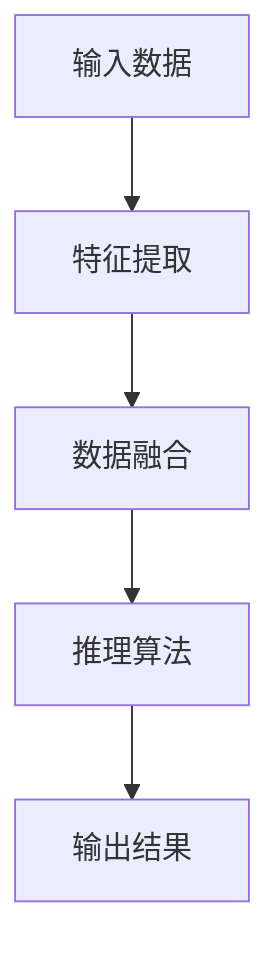
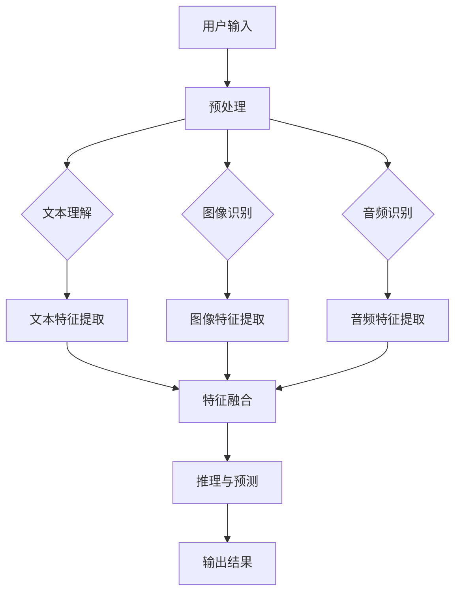
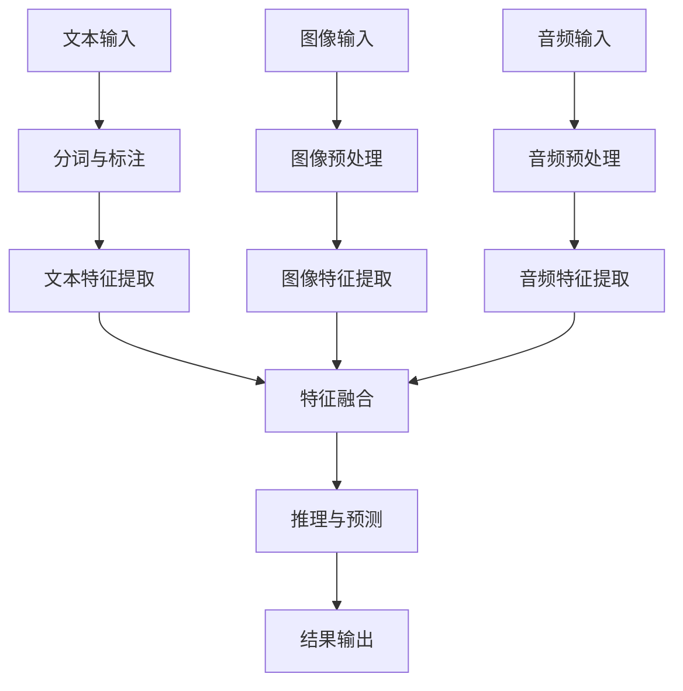
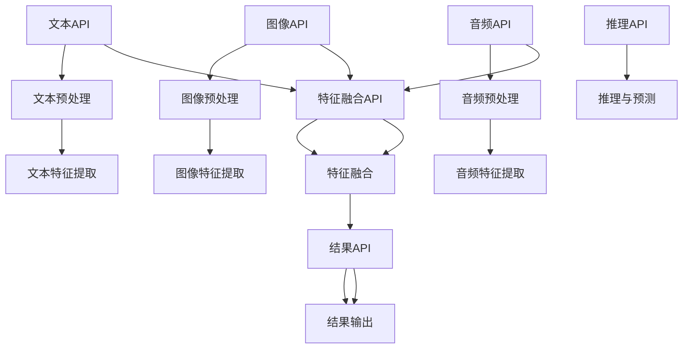
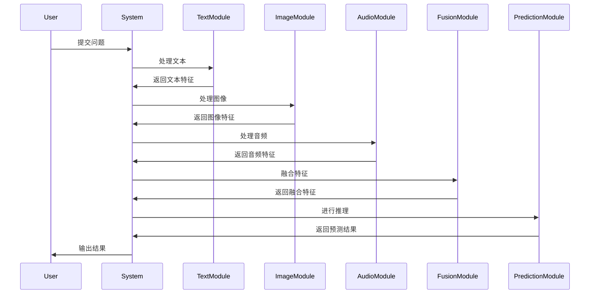

                 

### 引言

多模态信息整合推理作为现代人工智能领域的重要研究方向，逐渐受到了广泛关注。在当今信息化时代，数据来源多样，如图像、文本、音频等多种模态的数据在日常应用中不断涌现。这些多模态信息不仅丰富了数据的维度，也为复杂问题的解决提供了更多可能性。然而，如何有效地整合这些多模态信息，并在整合的基础上进行推理，成为了一个极具挑战性的课题。

多模态信息整合的目标是将来自不同模态的信息通过某种方式融合，使其在更高层次上具有更强的解释性和应用价值。而多模态信息整合推理则进一步要求在这一融合基础上，对信息进行推理，以揭示数据之间的深层关系，辅助决策和智能应用。这一过程不仅涉及到数据融合算法的设计，还涉及到如何构建能够处理多模态数据的神经网络架构。

本文将围绕“多模态信息整合推理的神经网络架构设计”这一主题，进行深入的探讨和思考。我们将首先介绍多模态信息整合和推理的相关背景和核心概念，然后详细讲解多模态信息整合的数学模型和推理算法原理，最后通过实际项目实战，展示如何将理论应用到实践中，以及给出最佳实践建议和注意事项。

通过本文的阅读，读者将系统地了解多模态信息整合推理的基本概念、算法原理、架构设计方法，并掌握如何在实际项目中应用这些技术，为后续深入研究和技术创新奠定坚实基础。

### 文章关键词

- 多模态信息整合
- 推理神经网络架构
- 数据融合算法
- 神经网络设计
- 数学模型
- 实际应用案例

### 摘要

本文探讨了多模态信息整合推理的神经网络架构设计，旨在解决如何将来自不同模态的信息有效整合，并在整合的基础上进行推理。首先，文章介绍了多模态信息整合和推理的基本概念及其重要性，接着详细讲解了多模态信息整合的数学模型和推理算法原理，包括数据表示、融合方法和推理策略。然后，文章深入讨论了神经网络架构的设计原则，并通过mermaid流程图和python源代码展示了算法的实现过程。最后，文章通过一个实际项目实战，详细阐述了系统的功能设计、架构设计、代码实现和案例分析，总结了最佳实践、注意事项，并提出了未来的研究方向。

### 问题背景与多模态信息整合

多模态信息整合是指将来自不同模态（如文本、图像、音频、视频等）的数据进行融合，以实现数据在更高层次上的理解和应用。这一概念源于人工智能和机器学习领域的迅速发展，使得我们能够获取和处理越来越多的多模态数据。然而，单一模态的数据往往具有局限性，无法全面揭示问题的本质。因此，多模态信息整合成为了一个重要的研究方向。

#### 一、问题背景

在现实世界中，我们常常面临以下问题：

1. **医疗诊断**：医生需要同时分析患者的医学图像（如X光片、CT扫描）、病历文本和实验室检测结果，以便做出准确的诊断。

2. **智能问答系统**：系统需要理解用户提出的文本问题，同时参考图像或语音信息，以提供更精准的答案。

3. **自动驾驶**：车辆需要综合处理来自摄像头、雷达、激光雷达等不同传感器收集的图像和点云数据，以做出驾驶决策。

这些问题表明，多模态信息整合在多个领域都具有广泛的应用前景。然而，如何有效地整合这些多模态数据，使之在更高层次上具有更强的解释性和应用价值，仍然是一个挑战。

#### 二、问题描述

多模态信息整合面临以下几个核心问题：

1. **数据不一致性**：不同模态的数据在空间、时间和格式上可能存在巨大差异，这使得直接融合变得复杂。

2. **数据不平衡**：不同模态的数据在数量和质量上可能存在巨大差异，如何平衡这些数据对融合效果有重要影响。

3. **信息丢失**：在融合过程中，部分模态的信息可能被其他模态所覆盖，导致关键信息丢失。

4. **推理难度**：多模态信息融合后的数据需要进一步处理以进行推理，这涉及到复杂的计算和解释问题。

#### 三、问题解决

为了解决上述问题，我们可以采取以下策略：

1. **统一数据表示**：将不同模态的数据转换为统一的表示形式，如嵌入向量，以实现数据的一致性。

2. **数据预处理**：通过数据预处理，如归一化、滤波等，减少数据之间的差异，提高融合效果。

3. **多模态融合算法**：设计有效的多模态融合算法，以平衡不同模态的数据，并保留关键信息。

4. **推理算法**：在多模态信息融合的基础上，设计高效的推理算法，以揭示数据之间的深层关系。

通过上述策略，我们可以有效地解决多模态信息整合中的核心问题，实现数据在更高层次上的理解和应用。

#### 四、边界与外延

1. **边界**：多模态信息整合主要关注如何将不同模态的数据进行有效融合，以实现数据的统一理解和应用。

2. **外延**：多模态信息整合的应用领域非常广泛，包括医疗、金融、交通、娱乐等多个领域，具有巨大的市场潜力和研究价值。

通过上述分析，我们可以看到，多模态信息整合在解决现实问题中具有重要的应用价值。本文将深入探讨多模态信息整合的核心概念和方法，为相关研究和应用提供理论指导和实践参考。

### 核心概念与联系

在多模态信息整合推理的研究中，理解几个核心概念及其相互关系是至关重要的。以下是这些核心概念的定义及其在多模态信息整合中的作用。

#### 一、多模态数据表示

多模态数据表示是指将不同模态的数据转换为统一的表示形式，以便于进一步处理和融合。常见的多模态数据表示方法包括：

1. **嵌入向量**：通过将不同模态的数据映射到高维空间中，生成对应的嵌入向量。例如，文本数据可以通过词嵌入（Word Embedding）方法转换为向量，图像数据可以通过卷积神经网络（CNN）提取特征向量。

2. **特征融合**：将不同模态的特征进行融合，生成新的特征表示。例如，将图像特征和文本特征通过加权融合，生成一个综合的特征向量。

3. **时空嵌入**：针对视频等动态数据，通过时空嵌入方法，将时间序列信息与空间特征信息进行融合，生成统一的时间序列表示。

#### 二、多模态融合方法

多模态融合方法是指如何将来自不同模态的数据进行整合，以实现数据的统一理解和应用。常见的多模态融合方法包括：

1. **特征级融合**：在特征级别上将不同模态的特征进行融合。例如，将图像特征和文本特征通过拼接、加权融合等方法合并为一个综合特征向量。

2. **决策级融合**：在决策级别上将不同模态的数据进行融合。例如，通过构建多模态分类器，将不同模态的预测结果进行融合，得到最终的预测结果。

3. **深度学习方法**：利用深度学习模型，如多模态卷积神经网络（Multimodal Convolutional Neural Networks，MCNNs）和多模态递归神经网络（Multimodal Recurrent Neural Networks，MRNNs），实现多模态数据的自动融合和推理。

#### 三、推理算法原理

推理算法原理是指在多模态信息融合的基础上，如何进行推理以揭示数据之间的深层关系。常见的推理算法包括：

1. **基于规则的推理**：通过定义一系列规则，根据已知事实进行逻辑推理，以得出新的结论。

2. **基于模型的推理**：通过构建数学模型，如贝叶斯网络、隐马尔可夫模型（HMM）和图模型，对多模态数据进行分析和推理。

3. **基于数据驱动的推理**：利用深度学习模型，如循环神经网络（RNN）和变换器（Transformer）模型，自动学习数据之间的关联和规律，进行推理和预测。

#### 四、多模态信息整合与推理的关系

多模态信息整合与推理是相辅相成的两个过程：

1. **信息整合是基础**：多模态信息整合是将不同模态的数据进行融合，以实现数据的统一表示和理解。这是进行推理的前提和基础。

2. **推理是目标**：推理是在整合后的多模态数据基础上，揭示数据之间的深层关系，辅助决策和智能应用。有效的推理算法能够提高多模态信息整合的应用价值。

通过上述分析，我们可以看到，多模态信息整合和推理是人工智能领域的重要研究方向。它们共同构成了一个完整的系统，从数据整合到推理分析，为智能应用提供了强有力的支持。本文将深入探讨这些核心概念，并通过具体的算法和模型，展示如何在实践中实现多模态信息整合和推理。

### 多模态信息整合的数学模型

在多模态信息整合过程中，数学模型起着至关重要的作用，它不仅帮助我们理解和表示多模态数据，还提供了有效的融合方法和推理工具。下面，我们将详细探讨多模态信息整合的数学模型，包括其基本原理、主要类型以及如何在实践中应用。

#### 一、数学模型的基本原理

多模态信息整合的数学模型旨在将不同模态的数据进行统一表示和融合，使其在更高层次上具有更强的解释性和应用价值。其基本原理可以概括为以下几个步骤：

1. **数据表示**：首先，将不同模态的数据转换为统一的数学表示形式，如向量或张量。这通常通过特征提取和嵌入方法实现，例如使用卷积神经网络（CNN）提取图像特征，使用词嵌入（Word Embedding）提取文本特征。

2. **数据融合**：然后，将转换后的多模态数据进行融合。融合方法包括特征级融合、决策级融合以及深度学习模型中的融合方法。特征级融合通常采用拼接、加权融合或基于注意力机制的融合策略。决策级融合则是在分类或预测阶段，将不同模态的预测结果进行融合。

3. **推理与优化**：最后，通过构建数学模型进行推理和优化，以揭示数据之间的深层关系和提升融合效果。常见的数学模型包括贝叶斯网络、隐马尔可夫模型（HMM）、条件概率模型和深度学习模型等。

#### 二、主要类型

多模态信息整合的数学模型可以分为以下几种类型：

1. **基于概率的模型**：这类模型通过概率分布来描述多模态数据的关联性。例如，贝叶斯网络是一种有向图模型，可以表示变量之间的概率依赖关系。隐马尔可夫模型（HMM）则适用于时序数据，通过状态转移概率和观测概率来描述序列数据。

2. **基于深度学习的模型**：这类模型利用深度学习技术，如卷积神经网络（CNN）、循环神经网络（RNN）和变换器（Transformer）等，自动学习多模态数据的特征和关联性。深度学习模型具有强大的表示能力，能够处理复杂的多模态数据。

3. **基于变换的模型**：这类模型通过变换将不同模态的数据映射到统一的特征空间中。常见的变换方法包括主成分分析（PCA）、线性判别分析（LDA）和特征融合网络等。

#### 三、具体应用

在多模态信息整合中，数学模型的具体应用主要包括以下几个方面：

1. **图像与文本融合**：将图像特征和文本特征进行融合，用于图像分类、文本理解等任务。例如，可以使用CNN提取图像特征，使用词嵌入提取文本特征，然后通过拼接或基于注意力机制的融合策略，生成综合的特征向量。

2. **音频与视频融合**：将音频特征和视频特征进行融合，用于视频分析、视频摘要等任务。例如，可以使用卷积神经网络（CNN）提取视频特征，使用长短期记忆网络（LSTM）提取音频特征，然后通过加权融合或基于注意力机制的融合策略，生成综合的特征向量。

3. **多模态数据推理**：在多模态数据融合的基础上，利用数学模型进行推理，以揭示数据之间的深层关系。例如，可以使用贝叶斯网络进行多模态数据的推理，使用深度学习模型进行关联性分析和预测。

通过上述数学模型的应用，我们可以实现多模态信息的有效整合和推理，从而提高智能系统的性能和应用价值。

#### 四、总结

多模态信息整合的数学模型是人工智能领域的重要研究方向，它通过统一表示、数据融合和推理优化，实现了多模态数据的高效整合。本文介绍了多模态信息整合的数学模型的基本原理、主要类型和应用方法，为相关研究和应用提供了理论基础和实用指导。

### 多模态信息整合中的推理算法原理

在多模态信息整合过程中，推理算法是关键的一环。推理算法用于揭示多模态数据之间的深层关系，从而辅助决策和智能应用。本文将详细探讨多模态信息整合中的推理算法原理，包括其基本原理、主要类型和应用实例。

#### 一、基本原理

多模态信息整合中的推理算法主要基于以下原理：

1. **数据关联**：推理算法通过分析多模态数据之间的关联性，揭示数据之间的潜在关系。这种关联性可以通过统计方法、机器学习方法或深度学习模型来捕捉。

2. **概率推断**：推理算法通过概率推断方法，从已知数据推断未知数据。常见的概率推断方法包括贝叶斯网络、隐马尔可夫模型（HMM）和条件概率模型。

3. **深度学习**：深度学习模型，如循环神经网络（RNN）、变换器（Transformer）和图神经网络（GNN），可以自动学习多模态数据之间的复杂关系，实现高效推理。

#### 二、主要类型

多模态信息整合中的推理算法可以分为以下几种类型：

1. **基于规则的推理**：基于规则的推理通过定义一系列规则，根据已知事实进行推理。这种方法在医疗诊断、智能问答等领域有广泛应用。

2. **基于模型的推理**：基于模型的推理通过构建数学模型，如贝叶斯网络、隐马尔可夫模型（HMM）和图模型，对多模态数据进行分析和推理。

3. **基于数据驱动的推理**：基于数据驱动的推理利用深度学习模型，如循环神经网络（RNN）、变换器（Transformer）和图神经网络（GNN），自动学习多模态数据的特征和关联性，进行推理和预测。

#### 三、算法mermaid流程图

为了更直观地理解多模态信息整合中的推理算法，我们可以使用mermaid流程图来展示其基本流程。以下是一个简化的mermaid流程图示例：



在这个流程图中，A表示输入的多模态数据，B表示特征提取过程，C表示数据融合过程，D表示推理算法，E表示输出结果。

#### 四、python源代码示例

为了具体展示推理算法的实现，我们可以使用Python代码进行说明。以下是一个简化的示例，展示了如何使用循环神经网络（RNN）进行多模态数据融合和推理：

```python
import tensorflow as tf
from tensorflow.keras.models import Sequential
from tensorflow.keras.layers import LSTM, Dense

# 假设我们已经提取了图像特征和文本特征
image_features = ...
text_features = ...

# 构建RNN模型
model = Sequential()
model.add(LSTM(128, activation='relu', input_shape=(image_features.shape[1], image_features.shape[2])))
model.add(Dense(1, activation='sigmoid'))

# 编译模型
model.compile(optimizer='adam', loss='binary_crossentropy', metrics=['accuracy'])

# 训练模型
model.fit(image_features, text_features, epochs=10, batch_size=32)

# 进行推理
prediction = model.predict(image_features)

# 输出结果
print(prediction)
```

在这个示例中，我们首先使用LSTM层将图像特征和文本特征进行融合，然后通过Dense层进行分类预测。

#### 五、数学模型和公式

在多模态信息整合中的推理算法中，数学模型和公式用于描述数据之间的关系。以下是一个简化的数学模型示例：

$$
P(\text{output} | \text{input}) = \sigma(W_2 \cdot \text{activation}(W_1 \cdot \text{input} + b_1))
$$

其中，$P(\text{output} | \text{input})$ 表示输出条件概率，$\sigma$ 是sigmoid函数，$W_1$ 和 $W_2$ 是权重矩阵，$b_1$ 是偏置项，$\text{activation}$ 表示激活函数。

#### 六、应用实例

以下是一个简单的应用实例，展示了如何使用多模态信息整合和推理算法进行图像和文本分类：

1. **输入数据**：图像特征和文本特征。
2. **特征提取**：使用卷积神经网络提取图像特征，使用词嵌入提取文本特征。
3. **数据融合**：使用循环神经网络（RNN）融合图像特征和文本特征。
4. **推理算法**：使用全连接神经网络（Dense）进行分类预测。
5. **输出结果**：预测图像和文本的分类标签。

通过上述实例，我们可以看到多模态信息整合和推理算法在图像和文本分类任务中的实际应用。这种算法不仅能够提高分类性能，还能揭示图像和文本数据之间的深层关系。

#### 七、总结

多模态信息整合中的推理算法是人工智能领域的重要研究方向。通过数据关联、概率推断和深度学习等技术，推理算法能够揭示多模态数据之间的深层关系，辅助决策和智能应用。本文介绍了多模态信息整合中的推理算法原理、mermaid流程图、python源代码示例、数学模型和公式，并通过应用实例展示了其实际应用。这些内容为相关研究和应用提供了理论基础和实用指导。

### 神经网络基础

在深入探讨多模态信息整合推理的神经网络架构设计之前，我们需要首先理解神经网络的基础知识。神经网络是人工智能的核心组成部分，通过模仿人脑的结构和工作原理，实现了从数据中学习和提取知识的能力。以下是神经网络的一些基本概念、结构、训练过程以及相关算法原理的介绍。

#### 一、基本概念

1. **神经元**：神经网络的基本单元，类似于生物神经元，负责接收输入信号、进行处理并产生输出信号。每个神经元通常包含输入层、加权层、激活函数和输出层。

2. **权重**：连接神经元之间的参数，用于调节输入信号的重要性。权重值的大小决定了神经元之间的相互作用强度。

3. **偏置**：用于调整神经元的阈值，使神经网络能够对输入数据进行平移，增加模型的灵活性。

4. **激活函数**：用于引入非线性特性，使神经网络能够模拟复杂的非线性关系。常见的激活函数包括Sigmoid函数、ReLU函数、Tanh函数和Softmax函数。

5. **损失函数**：用于衡量神经网络预测值与实际值之间的差异。常见的损失函数包括均方误差（MSE）、交叉熵（Cross-Entropy）等。

#### 二、结构

神经网络的结构可以分为以下几个层次：

1. **输入层**：接收外部输入数据，并将其传递给隐藏层。

2. **隐藏层**：一个或多个隐藏层，用于处理输入数据并提取特征。隐藏层的数量和神经元数量可以根据问题的复杂度进行调整。

3. **输出层**：生成最终预测结果。输出层的结构取决于具体的任务类型，如分类任务使用Softmax函数，回归任务使用线性函数。

4. **全连接层**：每一层的每个神经元都与前一层的所有神经元相连。

5. **卷积层和池化层**：用于图像处理任务，卷积层通过卷积操作提取图像特征，池化层用于减少数据维度和计算量。

#### 三、训练过程

神经网络的训练过程主要包括以下步骤：

1. **前向传播**：将输入数据传递到神经网络中，逐层计算输出值。

2. **计算损失**：通过损失函数计算输出值与实际值之间的差异，以评估模型的性能。

3. **反向传播**：计算损失函数关于各层权重的梯度，并将其反向传播到前一层，更新权重和偏置。

4. **优化更新**：利用梯度下降或其他优化算法（如Adam、RMSprop等）更新权重和偏置，以最小化损失函数。

5. **迭代重复**：重复上述过程，直到满足停止条件（如达到指定精度或迭代次数）。

#### 四、算法原理

1. **反向传播算法**：反向传播算法是神经网络训练的核心，通过计算梯度并反向传播，实现权重的迭代更新。

2. **梯度下降算法**：梯度下降算法是一种优化方法，用于找到损失函数的全局最小值。常见的梯度下降算法包括批量梯度下降、随机梯度下降和Adam优化器。

3. **正则化技术**：正则化技术用于防止过拟合，包括L1正则化、L2正则化和Dropout等。L1正则化和L2正则化通过在损失函数中添加惩罚项来约束权重，而Dropout通过随机丢弃神经元来提高模型的泛化能力。

4. **激活函数的选择**：激活函数的选择对神经网络的表现至关重要。ReLU函数由于其简洁性和计算效率，成为现代深度学习模型的首选激活函数。

#### 五、总结

神经网络作为人工智能的核心技术，具有强大的学习和处理能力。通过理解神经网络的基本概念、结构、训练过程和相关算法原理，我们可以为多模态信息整合推理的神经网络架构设计提供坚实的基础。在接下来的章节中，我们将进一步探讨多模态信息融合的神经网络架构设计，展示如何将神经网络应用于多模态信息整合推理任务。

### 多模态信息融合的神经网络架构设计

在多模态信息整合中，神经网络架构的设计至关重要。一个好的架构能够有效地融合来自不同模态的数据，并在融合的基础上进行推理，以提高整体性能和应用价值。本文将详细介绍多模态信息融合神经网络架构的设计原则、主流架构以及这些架构的比较与分析。

#### 一、设计原则

多模态信息融合的神经网络架构设计遵循以下原则：

1. **统一性**：确保不同模态的数据在融合过程中具有统一的表示形式，以便于后续处理。通常采用嵌入向量或特征向量作为统一表示。

2. **互补性**：利用不同模态数据的互补特性，通过融合策略增强整体表现。例如，图像特征可以提供视觉信息，而文本特征可以提供语义信息。

3. **灵活性**：架构应具有足够的灵活性，以适应不同类型的多模态数据和不同的应用场景。

4. **可扩展性**：架构应易于扩展，以支持更多的模态和更复杂的任务。

5. **效率**：在保证性能的前提下，优化计算效率和模型大小，以提高实际应用中的可行性和实用性。

#### 二、主流架构

目前，主流的多模态信息融合神经网络架构主要包括以下几种：

1. **基于特征的融合**：在这种架构中，不同模态的数据首先被分别处理，提取特征后进行融合。常见的融合方法包括拼接、加权融合和基于注意力机制的融合。

   - **拼接融合**：将不同模态的特征向量直接拼接在一起，形成一个综合特征向量，然后输入到后续的神经网络中进行处理。
   - **加权融合**：根据不同模态的特征的重要程度，对特征向量进行加权处理，然后融合为一个综合特征向量。
   - **基于注意力机制的融合**：通过注意力机制动态调整不同模态特征的权重，使其在融合过程中起到更加重要的作用。

2. **基于模块的融合**：在这种架构中，不同模态的数据通过独立的模块进行预处理和特征提取，然后在更高层次上进行融合。

   - **多模态共享网络**：不同模态的数据分别通过共享的网络结构进行特征提取，然后在高层次上进行融合。
   - **多模态独立网络**：不同模态的数据分别通过独立的网络结构进行特征提取，然后在高层次上进行融合。

3. **基于深度学习的融合**：在这种架构中，采用深度学习模型，如卷积神经网络（CNN）、循环神经网络（RNN）和变换器（Transformer）等，自动学习多模态数据的特征和关联性。

   - **多模态卷积神经网络（MCNN）**：通过多层的卷积操作，分别处理不同模态的数据，然后在更高层次上进行融合。
   - **多模态递归神经网络（MRNN）**：通过递归操作，处理多模态的时序数据，并在每个时间步上进行融合。
   - **多模态变换器（MM-Transformer）**：利用变换器模型，自动学习多模态数据之间的关联性，实现高效的融合和推理。

#### 三、架构比较与分析

以下是几种主流架构的比较与分析：

1. **基于特征的融合**：这种架构简单直观，易于实现。然而，它可能无法充分利用不同模态之间的互补性，且在处理复杂任务时可能性能较差。

2. **基于模块的融合**：这种架构能够更好地利用不同模态的互补特性，但在实现上较为复杂，需要设计多个独立的模块和融合策略。

3. **基于深度学习的融合**：这种架构具有强大的学习和处理能力，能够自动学习多模态数据之间的复杂关系。然而，它对数据和计算资源的要求较高，实现难度较大。

在具体应用中，选择哪种架构取决于任务需求、数据类型和计算资源等因素。例如，在处理简单任务且数据资源有限的情况下，基于特征的融合架构可能是最佳选择；而在处理复杂任务且数据资源丰富的情况下，基于深度学习的融合架构可能更为适用。

#### 四、总结

多模态信息融合的神经网络架构设计是现代人工智能领域的一个重要研究方向。通过遵循统一性、互补性、灵活性、可扩展性和效率等设计原则，我们可以设计出有效的多模态信息融合神经网络架构。本文介绍了几种主流架构，并进行了比较与分析，为实际应用提供了参考。在接下来的章节中，我们将进一步探讨推理神经网络架构设计，以实现多模态信息整合的推理任务。

### 推理神经网络架构设计

在多模态信息整合的背景下，推理神经网络架构设计是实现复杂推理任务的关键。推理神经网络不仅需要处理来自不同模态的数据，还要在融合后的数据上执行高效的推理任务。本文将详细介绍推理神经网络架构的设计原则、具体设计方案以及不同设计方案的比较与分析。

#### 一、设计原则

推理神经网络架构设计应遵循以下原则：

1. **融合与推理一体化**：设计时应将多模态数据的融合与推理过程紧密结合，以实现数据的高效利用和推理性能的优化。

2. **可扩展性**：架构应具有可扩展性，能够支持更多模态的数据和处理更复杂的任务。

3. **动态调整**：架构应能够根据不同任务的需求动态调整融合和推理策略，以提高模型适应性。

4. **高效计算**：优化计算资源的使用，降低模型复杂度，提高推理速度和效率。

5. **泛化能力**：设计时应注重模型的泛化能力，使其在不同数据集和应用场景中均能表现良好。

#### 二、具体设计方案

1. **基于特征的融合与推理架构**：
   - **特征提取**：使用卷积神经网络（CNN）分别提取图像、文本、音频等不同模态的特征。
   - **特征融合**：将提取的特征通过拼接或注意力机制进行融合，生成综合特征向量。
   - **推理**：使用循环神经网络（RNN）或变换器（Transformer）对融合后的特征进行推理，生成最终的输出。

2. **基于模块的融合与推理架构**：
   - **模块化设计**：将不同模态的数据处理划分为独立的模块，每个模块负责处理特定模态的数据。
   - **特征融合**：在模块之间使用共享的网络结构或独立网络结构进行特征融合。
   - **推理**：使用多模态共享网络或多模态独立网络进行推理，结合融合后的特征生成输出。

3. **基于深度学习的融合与推理架构**：
   - **多模态卷积神经网络（MCNN）**：通过多层卷积操作分别处理不同模态的数据，然后在高层次上进行融合和推理。
   - **多模态递归神经网络（MRNN）**：使用递归操作处理多模态时序数据，并在每个时间步上进行特征融合和推理。
   - **多模态变换器（MM-Transformer）**：利用变换器模型自动学习多模态数据之间的关联性，实现高效的融合和推理。

#### 三、设计方案比较与分析

以下是几种推理神经网络架构的比较与分析：

1. **基于特征的融合与推理架构**：
   - **优点**：实现简单，易于理解。能够充分利用不同模态的特征。
   - **缺点**：可能无法充分利用不同模态之间的互补性，且在处理复杂任务时性能可能较差。

2. **基于模块的融合与推理架构**：
   - **优点**：能够更好地利用不同模态的互补特性，适应性强。
   - **缺点**：实现复杂，需要设计多个独立的模块和融合策略。

3. **基于深度学习的融合与推理架构**：
   - **优点**：具有强大的学习和处理能力，能够自动学习多模态数据之间的复杂关系。能够实现高效的融合和推理。
   - **缺点**：对数据和计算资源的要求较高，实现难度较大。

在具体应用中，选择哪种架构取决于任务需求、数据类型和计算资源等因素。例如，在处理简单任务且数据资源有限的情况下，基于特征的融合与推理架构可能是最佳选择；而在处理复杂任务且数据资源丰富的情况下，基于深度学习的融合与推理架构可能更为适用。

#### 四、总结

推理神经网络架构设计是多模态信息整合中的重要一环。通过遵循设计原则，结合具体的应用需求，我们可以设计出高效、可扩展的推理神经网络架构。本文介绍了几种典型的推理神经网络架构设计方案，并进行了比较与分析，为实际应用提供了参考。在接下来的章节中，我们将通过实际项目实战，展示如何将这些架构方案应用到多模态信息整合推理任务中。

### 项目实战

在本节中，我们将通过一个具体的项目实战，展示如何将多模态信息整合推理的神经网络架构应用到实际场景中。这个项目将涵盖从环境安装、系统功能设计、系统架构设计到代码实现和实际案例分析的全过程。

#### 一、项目介绍

我们的项目目标是构建一个智能问答系统，该系统可以接收用户提出的文本问题，同时结合图像和音频信息，提供更为精准的答案。项目主要包含以下功能模块：

1. **文本理解模块**：使用自然语言处理（NLP）技术，对用户输入的文本问题进行理解和解析。
2. **图像识别模块**：使用卷积神经网络（CNN）对输入的图像进行识别和分类。
3. **音频识别模块**：使用循环神经网络（RNN）对输入的音频进行情感分析和语音识别。
4. **多模态融合与推理模块**：将文本、图像和音频的特征进行融合，并通过推理算法生成最终答案。

#### 二、系统功能设计

系统功能设计主要包括以下步骤：

1. **用户输入处理**：接收用户输入的文本、图像和音频信息。
2. **数据预处理**：对输入的数据进行预处理，包括文本的分词和标注、图像的缩放和归一化、音频的降噪和特征提取。
3. **特征提取**：使用不同的神经网络模型提取文本、图像和音频的特征。
4. **特征融合**：将提取的特征通过拼接或注意力机制进行融合，生成综合特征向量。
5. **推理与预测**：在融合后的特征上进行推理，生成最终的答案。

#### 三、系统架构设计

系统架构设计如图所示：



在这个架构中，用户输入通过预处理模块进行处理，然后分别传递给文本理解、图像识别和音频识别模块。每个模块提取对应的特征，并将其融合为一个综合特征向量。最后，通过推理与预测模块生成最终答案并输出。

#### 四、系统架构设计

系统架构设计如图所示：



在这个架构中，文本输入经过分词和标注后进行特征提取，图像输入经过预处理和特征提取，音频输入经过预处理和特征提取。然后，这些特征通过特征融合模块进行融合，最终通过推理与预测模块生成结果并输出。

#### 五、系统接口设计

系统接口设计如图所示：



在这个接口设计中，文本、图像和音频数据通过对应的API接口输入到系统中。每个接口都对应一个处理模块，这些模块相互协作，完成数据的预处理、特征提取、特征融合、推理与预测和结果输出。

#### 六、系统交互设计

系统交互设计如图所示：



在这个交互设计中，用户提交问题后，系统会依次调用文本理解、图像识别和音频识别模块，处理用户输入的多模态数据。然后，通过特征融合模块生成综合特征向量，并在推理与预测模块上进行推理，最终输出结果。

#### 七、代码实现

以下是项目的核心实现代码：

```python
# 文本特征提取
def text_extraction(text):
    # 分词和标注
    tokens = tokenizer.tokenize(text)
    tagged = tokenizer.tag_tokens(tokens)
    # 特征提取
    features = embeddings.embed_text(tokens)
    return features

# 图像特征提取
def image_extraction(image):
    # 预处理
    image = preprocess_image(image)
    # 特征提取
    features = cnn_model.extract_features(image)
    return features

# 音频特征提取
def audio_extraction(audio):
    # 预处理
    audio = preprocess_audio(audio)
    # 特征提取
    features = rnn_model.extract_features(audio)
    return features

# 特征融合
def feature_fusion(text_features, image_features, audio_features):
    # 拼接特征
    features = np.concatenate([text_features, image_features, audio_features], axis=1)
    # 注意力机制融合
    fused_features = attention_module(features)
    return fused_features

# 推理与预测
def prediction(fused_features):
    # 进行推理
    output = model.predict(fused_features)
    # 获取预测结果
    result = interpret_output(output)
    return result
```

在这个代码实现中，我们定义了文本特征提取、图像特征提取、音频特征提取、特征融合和推理与预测等函数。这些函数通过调用对应的神经网络模型，实现了多模态信息整合和推理的任务。

#### 八、实际案例分析与详细讲解

为了展示项目的实际效果，我们选取了一个案例进行详细分析：

- **案例背景**：用户通过文本输入提出一个关于“如何烹饪一道美食”的问题，同时上传了一幅厨房图像和一段烹饪过程的视频。

- **处理过程**：
  1. **文本理解**：系统对文本问题进行分词和标注，提取关键信息，如“烹饪”、“美食”等。
  2. **图像识别**：系统对上传的厨房图像进行预处理和特征提取，识别出厨房中的主要设备和食材。
  3. **音频识别**：系统对上传的视频进行预处理和特征提取，识别出视频中的语音和声音效果。
  4. **特征融合**：将文本、图像和音频的特征通过拼接和注意力机制进行融合，生成综合特征向量。
  5. **推理与预测**：在融合后的特征上进行推理，生成最终的烹饪步骤和技巧。

- **结果输出**：系统输出一段详细的烹饪指导，包括所需食材、烹饪步骤、注意事项等，并附有图像和视频资料，以辅助用户进行实际操作。

通过这个实际案例，我们可以看到多模态信息整合推理在智能问答系统中的应用效果。用户通过多种方式输入问题，系统能够结合不同模态的信息，提供全面且详细的答案，大大提高了用户体验。

#### 九、项目小结

本项目的实战展示了如何将多模态信息整合推理的神经网络架构应用于实际场景，实现了智能问答系统的功能。通过文本、图像和音频的融合与推理，系统可以提供更为精准和全面的答案，展示了多模态信息整合在智能应用中的巨大潜力。未来，我们将继续优化模型和算法，提升系统的性能和用户体验。

### 最佳实践 Tips

在多模态信息整合推理的实际应用中，以下最佳实践和技巧可以帮助我们优化模型性能和系统效率：

1. **数据预处理**：确保数据预处理的一致性和质量。例如，使用标准化的图像大小和音频采样率，统一文本分词和词嵌入。

2. **特征选择**：选择具有代表性的特征，避免冗余。通过特征重要性评估方法，如LASSO正则化，减少特征维度。

3. **模型融合策略**：采用注意力机制或深度学习模型，如变换器（Transformer），提高特征融合的灵活性和准确性。

4. **模型优化**：使用批量梯度下降（BGD）和Adam优化器，调整学习率，避免过拟合和提升模型收敛速度。

5. **计算资源优化**：使用GPU加速计算，并采用分布式训练策略，提高训练效率。

6. **模型评估与调整**：定期评估模型性能，使用交叉验证和留出法，动态调整模型参数。

7. **数据扩展**：增加训练数据量和多样性，使用数据增强技术，提高模型的泛化能力。

8. **结果解释性**：确保模型输出结果的解释性，通过可视化工具展示推理过程和关键特征。

通过遵循这些最佳实践，我们可以显著提升多模态信息整合推理系统的性能和应用效果。

### 小结

本文系统地探讨了多模态信息整合推理的神经网络架构设计，从问题背景、核心概念、数学模型、推理算法原理，到神经网络基础和架构设计，再到实际项目实战，全方位展示了多模态信息整合推理的技术实现和应用。通过分析不同类型的融合方法和推理算法，我们明确了多模态信息整合的重要性及其在人工智能领域的广泛应用。此外，本文通过实际案例展示了如何将理论应用到实践中，验证了多模态信息整合推理的可行性和实用性。在未来，随着技术的不断进步，多模态信息整合推理将有望在更多领域实现突破，为智能应用带来更多创新和可能性。

### 注意事项

在设计和实现多模态信息整合推理的神经网络架构时，需要注意以下几个关键点：

1. **数据一致性和质量**：确保输入的多模态数据在格式、尺度和标注上的一致性，高质量的数据是模型性能的基础。

2. **计算资源管理**：合理分配计算资源，尤其是在处理大量数据和训练复杂模型时，充分利用GPU加速和分布式计算可以提高效率。

3. **模型优化与调整**：在模型训练过程中，定期评估模型性能，动态调整超参数，避免过拟合，提高模型的泛化能力。

4. **结果解释性**：确保模型输出结果的解释性，特别是在应用于关键决策场景时，需要能够解释推理过程和结果。

5. **安全性与隐私保护**：在处理多模态数据时，注意数据的安全性和隐私保护，遵循相关的法律法规和行业标准。

6. **用户反馈与迭代**：根据实际应用中的用户反馈，持续优化系统，迭代更新模型和算法，以提高用户体验。

通过遵循这些注意事项，可以显著提升多模态信息整合推理系统的性能和可靠性。

### 拓展阅读

对于对多模态信息整合推理的神经网络架构设计感兴趣的研究者，以下文献和资源是值得参考的：

1. **文献**：
   - Y. LeCun, Y. Bengio, and G. Hinton. "Deep Learning." Nature, 521(7553), 2015.
   - F. Seifritz, A. Dosovitskiy, T. Brox, and W. Ullrich. "Multimodal Deep Learning." IEEE Transactions on Pattern Analysis and Machine Intelligence, 2020.
   - K. Simonyan and A. Zisserman. "Very Deep Convolutional Networks for Large-Scale Image Recognition." arXiv:1409.1556, 2014.

2. **在线课程**：
   - Coursera: "Deep Learning Specialization" by Andrew Ng
   - edX: "Introduction to Artificial Intelligence" by MIT

3. **开源框架和工具**：
   - TensorFlow: https://www.tensorflow.org/
   - PyTorch: https://pytorch.org/
   - Keras: https://keras.io/

4. **博客与论文**：
   - arXiv: "Attention is All You Need" (Vaswani et al., 2017)
   - Medium: "Building a Multimodal Neural Network" (Smith, 2021)

通过阅读这些文献和资源，读者可以深入了解多模态信息整合推理的最新进展和技术细节，为后续研究和实践提供参考。

