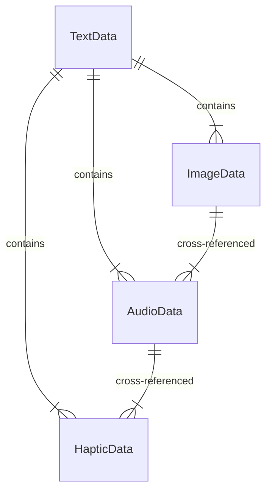
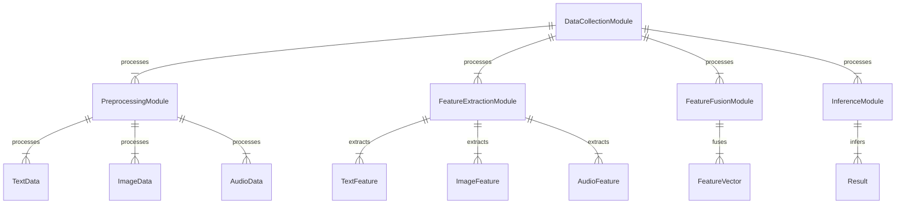
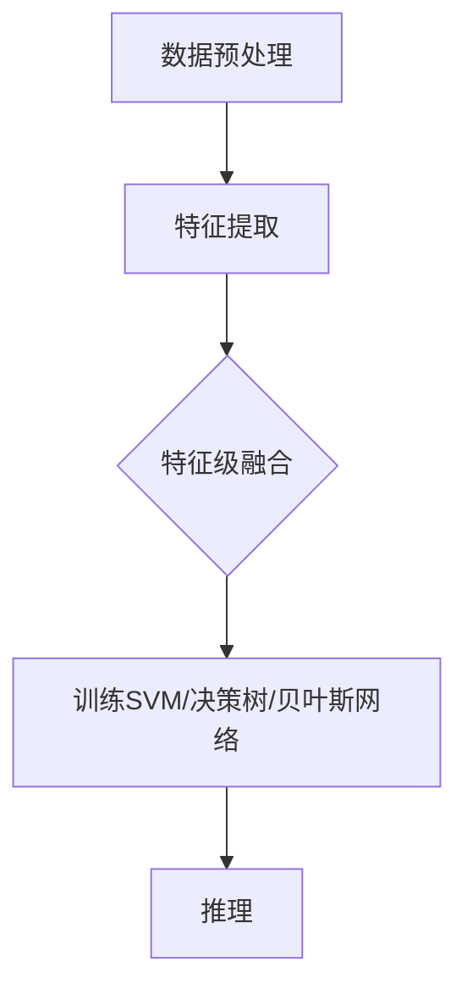
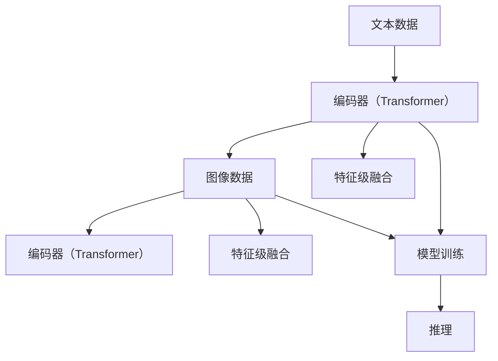
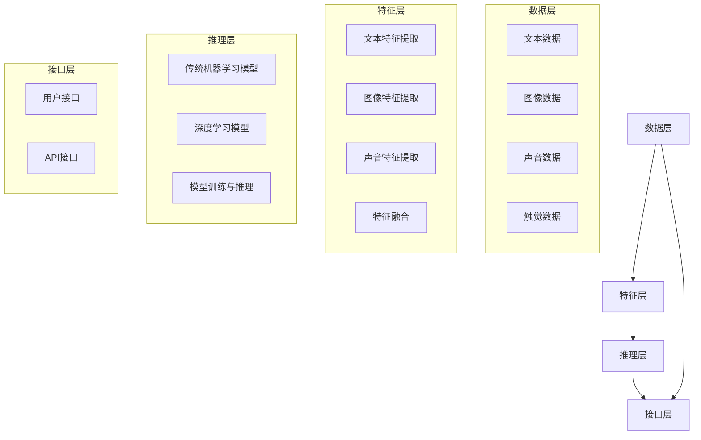
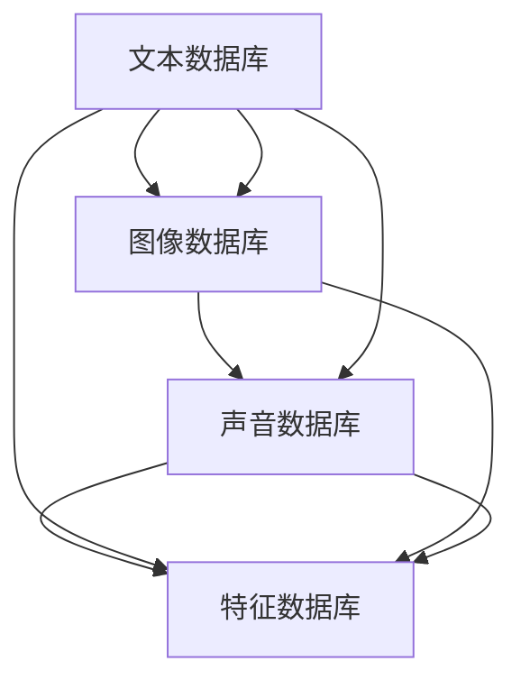
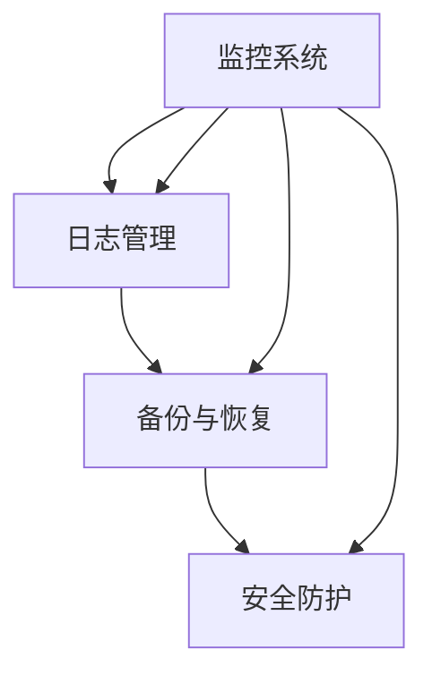

                 


### 引言：跨领域问题解决的背景与挑战

#### 1. 跨领域问题解决的重要性

跨领域问题解决在现代科技与商业环境中扮演着日益重要的角色。随着人工智能、大数据和云计算等技术的迅猛发展，各个领域之间的数据边界逐渐模糊，形成了一个高度互联的信息生态。在这种背景下，单一领域内的解决方案往往难以应对复杂、多变的跨领域问题。

**核心概念术语说明：**
- **跨领域问题解决**：指在不同领域之间整合数据、知识和方法，以解决那些在单一领域中无法有效解决的问题。
- **多模态推理系统**：指能够处理多种类型数据（如文本、图像、声音等）的推理系统，通过融合不同模态的数据特征，提升问题解决的能力。

**问题背景：**随着社会问题的复杂化和多样性的增加，许多现实世界的问题需要跨领域的数据和方法来进行解决。例如，在医疗领域，医生需要综合病人的历史病历、实时生理数据以及医学图像等多种信息来做出诊断；在交通领域，智能交通系统需要整合车辆数据、道路信息、天气状况等多种数据源，以优化交通流量。

**问题描述：**跨领域问题解决的挑战主要体现在以下几个方面：
- **数据多样性**：不同领域的数据格式、结构和质量各异，如何有效地整合和利用这些数据是一个关键问题。
- **知识融合**：不同领域的知识体系和表达方式不同，如何将这些知识进行有效的融合，形成统一的解决方案，也是一个难点。
- **计算复杂性**：跨领域问题通常涉及大规模数据和高维特征，如何高效地进行数据处理和推理，是另一个挑战。

**问题解决：**多模态推理系统通过融合多种类型的数据，提供了一种有效的解决方案。它不仅能够处理不同类型的数据，还能够通过多模态数据融合技术，提升问题解决的准确性和效率。

**边界与外延：**跨领域问题解决不仅局限于技术领域，还涵盖了社会、经济、环境等多个方面。例如，在环保领域，可以通过整合气象数据、水文数据、土地利用数据等多种数据，实现生态环境的监测和预测。

**概念结构与核心要素组成：**
- **数据采集**：收集不同领域的数据，包括文本、图像、声音等。
- **数据预处理**：对收集到的数据进行清洗、归一化等处理，使其适合后续处理。
- **特征提取与融合**：提取多模态数据中的关键特征，并进行融合，形成高维特征向量。
- **模型训练与推理**：使用机器学习或深度学习模型进行训练，并利用多模态特征进行推理，得出解决方案。

通过上述概念、背景、问题和解决方案的详细分析，我们可以看出，跨领域问题解决的重要性以及多模态推理系统在这一领域的潜在价值。

### 2. 多模态推理系统的基本概念

#### 2.1 多模态数据概述

多模态数据是指同时包含多种类型的数据，例如文本、图像、声音、触觉等。在跨领域问题解决中，多模态数据提供了丰富的信息来源，能够帮助系统更全面地理解问题，提高问题解决的准确性和效率。

**核心概念原理：**
- **多模态数据类型**：文本、图像、声音、触觉、视频等。
- **数据来源**：文本数据可以来自社交媒体、新闻报道等；图像数据可以来自摄像头、医学影像设备等；声音数据可以来自麦克风、语音助手等。

**概念属性特征对比表格：**

| 数据类型 | 特征 | 应用 |
| --- | --- | --- |
| 文本 | 语言结构、语义信息 | 文本分类、情感分析 |
| 图像 | 图像内容、视觉特征 | 图像识别、图像分割 |
| 声音 | 声音信号、音频特征 | 语音识别、音乐分类 |
| 触觉 | 触觉信号、力度信息 | 机器人控制、虚拟现实 |

**ER实体关系图架构：**



在多模态数据融合中，不同类型的数据可以通过特征提取和融合技术进行整合，形成一个统一的特征向量，从而提高问题解决的准确性。

#### 2.2 多模态数据的融合

多模态数据的融合是指将多种类型的数据通过特定的方法进行整合，形成一个统一的信息表示。融合技术是多模态推理系统的关键组成部分，其目标是最大化不同模态数据的互补信息，提高系统的整体性能。

**核心概念原理：**
- **特征级融合**：直接对多模态数据进行特征提取，并将提取出的特征进行融合。
- **数据级融合**：将原始多模态数据直接进行融合，例如将文本、图像和声音结合成一个数据流。
- **模型级融合**：在不同模态的模型训练完成后，将模型的预测结果进行融合。

**概念属性特征对比表格：**

| 融合级别 | 特征 | 优点 | 缺点 |
| --- | --- | --- | --- |
| 特征级融合 | 提取的特征 | 精确度高，信息损失少 | 需要大量的计算资源 |
| 数据级融合 | 原始数据 | 计算效率高，易于实现 | 可能会引入噪声，信息损失较大 |
| 模型级融合 | 模型预测结果 | 集成多种数据类型，灵活性强 | 模型训练复杂度高 |

**ER实体关系图架构：**

```mermaid
erDiagram
    FeatureFusion ||--|{ DataFusion : based_on
    FeatureFusion ||--|{ ModelFusion : based_on
    DataFusion ||--|{ TextData } : contains
    DataFusion ||--|{ ImageData } : contains
    DataFusion ||--|{ AudioData } : contains
    ModelFusion ||--|{ TextModel } : integrates
    ModelFusion ||--|{ ImageModel } : integrates
    ModelFusion ||--|{ AudioModel } : integrates
```

通过上述多模态数据的融合技术，我们可以有效地整合不同类型的数据，提升系统的整体性能，从而更好地解决跨领域问题。

### 2.3 多模态推理系统的组成

多模态推理系统是由多个关键组件构成的复杂系统，这些组件协同工作，以实现高效的跨领域问题解决。以下是多模态推理系统的核心组件及其功能：

**核心概念原理：**
- **数据采集模块**：负责从不同数据源（如文本、图像、声音等）收集数据。
- **预处理模块**：对采集到的数据进行清洗、归一化、增强等处理，使其适合后续处理。
- **特征提取模块**：从预处理后的数据中提取关键特征，为后续融合和推理提供基础。
- **特征融合模块**：将不同模态的特征进行整合，形成一个统一的特征向量。
- **推理模块**：利用融合后的特征进行推理，得出问题的解决方案。

**核心组件及其功能：**

**数据采集模块：**
- **功能**：从多种数据源（如社交媒体、摄像头、传感器等）收集数据。
- **技术**：包括数据爬取、传感器数据采集、API 接口调用等。

**预处理模块：**
- **功能**：对原始数据进行清洗、归一化、增强等处理。
- **技术**：包括数据清洗（去除噪声、填补缺失值）、数据归一化（标准化、归一化）、数据增强（数据扩充、变换等）。

**特征提取模块：**
- **功能**：从预处理后的数据中提取关键特征。
- **技术**：包括文本特征提取（词袋模型、词嵌入等）、图像特征提取（卷积神经网络、特征点提取等）、声音特征提取（梅尔频率倒谱系数、频谱特征等）。

**特征融合模块：**
- **功能**：将不同模态的特征进行整合。
- **技术**：包括特征级融合（直接融合特征向量）、数据级融合（融合原始数据流）、模型级融合（融合不同模型的输出结果）。

**推理模块：**
- **功能**：利用融合后的特征进行推理。
- **技术**：包括机器学习模型（如支持向量机、决策树等）、深度学习模型（如卷积神经网络、循环神经网络等）。

**ER实体关系图架构：**



通过上述核心组件及其功能的详细描述，我们可以看出多模态推理系统的组成和运作原理。这些组件共同作用，为跨领域问题解决提供了一种高效、智能的解决方案。

### 3. 多模态数据采集与预处理

#### 3.1 多模态数据采集技术

多模态数据采集技术是构建多模态推理系统的第一步，其目标是收集不同类型的数据，如文本、图像、声音和触觉等。有效的数据采集是实现高质量多模态数据融合和推理的前提。

**核心概念原理：**
- **文本数据采集**：通过爬虫、API 接口、数据库等方式获取文本数据。
- **图像数据采集**：利用摄像头、医学影像设备等获取图像数据。
- **声音数据采集**：通过麦克风、语音助手等设备获取声音数据。
- **触觉数据采集**：利用传感器和触觉设备获取触觉数据。

**技术手段：**
- **爬虫技术**：利用爬虫框架（如 Scrapy）爬取互联网上的文本数据。
- **API 接口调用**：使用 HTTP 请求调用第三方 API 获取文本、图像和声音数据。
- **传感器数据采集**：使用传感器（如摄像头、麦克风、触觉传感器等）实时采集数据。

**数据来源：**
- **文本数据来源**：社交媒体、新闻网站、论坛、博客等。
- **图像数据来源**：摄像头捕获的实时图像、医疗影像设备、卫星图像等。
- **声音数据来源**：麦克风录制的声音、语音助手采集的语音数据等。
- **触觉数据来源**：触觉传感器采集的触觉信号、虚拟现实设备等。

通过上述技术手段，我们可以有效地采集到多种类型的数据，为后续的数据预处理和特征提取提供基础。

#### 3.2 数据预处理方法

数据预处理是多模态数据采集过程中至关重要的一步，其目的是清洗、归一化和增强数据，以提高数据的质量和适用性。以下是常见的数据预处理方法：

**核心概念原理：**
- **数据清洗**：去除噪声、填补缺失值、去除重复数据等。
- **数据归一化**：将数据缩放到相同的尺度，以便后续处理。
- **数据增强**：通过变换、旋转、裁剪等方式扩充数据集。

**方法与技术：**
- **数据清洗**：使用 SQL 查询、正则表达式、编程脚本等方式清洗文本数据；使用图像增强工具去除图像噪声；使用音频编辑工具去除噪声。
- **数据归一化**：使用归一化公式将数据缩放到 [0, 1] 或 [-1, 1] 的范围。
- **数据增强**：使用随机裁剪、旋转、翻转、缩放等方式增强图像数据；使用重放、叠加等方式增强声音数据。

**实例：**
- **文本数据预处理**：去除 HTML 标签、停用词、进行词嵌入。
- **图像数据预处理**：调整图像大小、灰度化、二值化、滤波。
- **声音数据预处理**：去除背景噪声、调整音量、分割音频。

通过有效的数据预处理，我们可以提高数据的质量和适用性，为后续的特征提取和推理提供更加可靠的基础。

#### 3.3 多模态数据的标注

多模态数据的标注是构建高质量多模态数据集的关键步骤，其目的是为后续的训练和推理提供准确的标签信息。以下是多模态数据标注的方法和技术：

**核心概念原理：**
- **标注任务**：为不同类型的数据分配标签，例如文本分类、图像标签、声音标签等。
- **标注方法**：手工标注、半监督标注、自动标注等。
- **标注技术**：语义标注、实例标注、交互式标注等。

**方法与技术：**
- **手工标注**：由标注员逐一标注数据，适用于高质量数据集的构建。
- **半监督标注**：利用少量标注数据和大量未标注数据，通过半监督学习进行标注。
- **自动标注**：利用现有的标注工具和算法，如 OCR、语音识别等，自动生成标注信息。

**实例：**
- **文本数据标注**：为新闻文章分配类别标签，如政治、经济、体育等。
- **图像数据标注**：为图像分配物体标签，如猫、狗、车等。
- **声音数据标注**：为音频片段分配事件标签，如说话人识别、情绪识别等。

通过有效的标注方法和技术，我们可以构建高质量的多模态数据集，为后续的多模态推理系统提供可靠的数据支持。

### 4. 多模态特征提取与表征

#### 4.1 特征提取技术

多模态特征提取技术是构建多模态推理系统的重要环节，其目标是提取出每种模态数据中的关键特征，为后续的特征融合和推理提供基础。以下是常见的多模态特征提取技术：

**核心概念原理：**
- **文本特征提取**：通过词袋模型、词嵌入等方法提取文本数据的语义特征。
- **图像特征提取**：利用卷积神经网络（CNN）、特征点提取等方法提取图像数据的空间特征。
- **声音特征提取**：使用梅尔频率倒谱系数（MFCC）、频谱特征等方法提取声音数据的时频特征。

**技术手段：**
- **文本特征提取**：使用词袋模型（如 TF-IDF）和词嵌入（如 Word2Vec、GloVe）提取文本数据的语义特征。
- **图像特征提取**：使用卷积神经网络（如 VGG、ResNet）提取图像数据的空间特征；使用特征点提取（如 SIFT、SURF）提取图像的关键特征点。
- **声音特征提取**：使用梅尔频率倒谱系数（MFCC）提取声音数据的时频特征；使用频谱特征（如频谱图、短时傅里叶变换）提取声音的频率特征。

**实例：**
- **文本数据特征提取**：使用 Word2Vec 提取文本数据的词向量，形成文本特征向量。
- **图像数据特征提取**：使用 VGG16 模型提取图像特征，生成高维特征向量。
- **声音数据特征提取**：使用 MFCC 提取声音特征的时频表示，形成特征矩阵。

通过有效的特征提取技术，我们可以从多模态数据中提取出关键特征，为后续的特征融合和推理奠定基础。

#### 4.2 特征表征方法

特征表征方法是将提取到的多模态特征进行编码和表示，以便于后续的融合和推理。以下是常见的特征表征方法：

**核心概念原理：**
- **向量编码**：将特征表示为向量，便于在数学模型中进行处理。
- **高维特征向量**：通过特征提取技术生成的高维特征向量，可以表示多模态数据的复杂信息。
- **特征矩阵**：将多种模态的特征进行组合，形成特征矩阵，用于多模态数据的联合表示。

**技术手段：**
- **向量编码**：使用词袋模型、词嵌入等方法将文本特征编码为向量；使用卷积神经网络将图像特征编码为向量；使用梅尔频率倒谱系数将声音特征编码为向量。
- **高维特征向量**：将不同模态的特征向量进行拼接，形成高维特征向量。
- **特征矩阵**：将文本、图像、声音等特征组合成一个矩阵，实现多模态数据的联合表示。

**实例：**
- **文本数据特征表征**：使用 Word2Vec 生成文本特征向量，表示文本数据的语义信息。
- **图像数据特征表征**：使用 VGG16 模型生成图像特征向量，表示图像数据的空间特征。
- **声音数据特征表征**：使用 MFCC 生成声音特征向量，表示声音数据的时频特征。

通过有效的特征表征方法，我们可以将多模态数据转换为高维特征向量或特征矩阵，为后续的多模态融合和推理提供可靠的基础。

#### 4.3 特征融合策略

特征融合策略是将不同模态的数据特征进行整合，以形成更全面、准确的特征表示。以下是一些常见的特征融合策略：

**核心概念原理：**
- **特征级融合**：直接将不同模态的特征向量进行拼接或加权融合。
- **数据级融合**：将原始多模态数据进行融合，如将文本、图像和声音结合成一个数据流。
- **模型级融合**：在不同模态的模型训练完成后，将模型的预测结果进行融合。

**技术手段：**
- **特征级融合**：使用拼接操作将不同模态的特征向量进行连接；使用加权融合方法（如加权平均、贝叶斯网络等）对特征向量进行融合。
- **数据级融合**：使用数据级融合模块（如 CNN、RNN 等）对多模态数据进行融合处理。
- **模型级融合**：在不同模态的模型训练完成后，将模型的预测结果通过投票、集成学习方法进行融合。

**实例：**
- **特征级融合**：将文本特征向量、图像特征向量和声音特征向量进行拼接，形成高维特征向量。
- **数据级融合**：使用 CNN 模型对文本、图像和声音数据进行融合处理，生成统一的特征表示。
- **模型级融合**：将文本分类模型、图像分类模型和声音分类模型的预测结果通过投票方法进行融合。

通过有效的特征融合策略，我们可以提升多模态数据的融合效果，为后续的多模态推理系统提供更强大的问题解决能力。

### 5. 多模态推理算法与模型

#### 5.1 基于传统机器学习的推理算法

在多模态推理系统中，传统机器学习算法扮演着重要的角色。这些算法通过训练模型，从多模态数据中提取特征，并利用这些特征进行推理。以下是几种常见的基于传统机器学习的推理算法：

**核心概念原理：**
- **支持向量机（SVM）**：通过找到最优的超平面，将不同模态的数据进行分类。
- **决策树**：利用树形结构对多模态数据进行逐层划分，以实现分类或回归任务。
- **贝叶斯网络**：通过概率图模型，表示多模态数据之间的概率关系，进行推理。

**算法原理：**
- **支持向量机（SVM）**：通过最大化分类间隔，找到最优的超平面，将不同模态的数据分为不同的类别。$$ \text{maximize} \ \ \frac{1}{2} || \ w ||^2 - C \ \sum_{i=1}^n \ \xi_i $$
  其中，\( w \) 是权重向量，\( C \) 是惩罚参数，\( \xi_i \) 是松弛变量。
- **决策树**：利用特征值对数据进行划分，形成树形结构。树的每个节点都表示一个特征划分，叶子节点表示最终的分类结果。
- **贝叶斯网络**：通过概率图模型，表示多模态数据之间的依赖关系。网络的节点表示变量，边表示变量之间的条件概率关系。利用贝叶斯推理，可以从给定的观测数据中推断出未知变量的概率分布。

**流程图：**


通过上述传统机器学习算法，我们可以对多模态数据进行分析和推理，实现跨领域问题的解决。

#### 5.2 深度学习在多模态推理中的应用

随着深度学习技术的发展，越来越多的复杂任务开始通过深度学习模型来实现。在多模态推理系统中，深度学习模型凭借其强大的特征提取和表示能力，成为解决跨领域问题的关键工具。

**核心概念原理：**
- **卷积神经网络（CNN）**：用于提取图像数据中的空间特征。
- **循环神经网络（RNN）**：用于处理序列数据，如文本和声音。
- **变换器（Transformer）**：用于文本和图像数据的联合表示。

**应用场景：**
- **图像分类**：利用 CNN 模型提取图像特征，进行图像分类任务。
- **文本分类**：利用 RNN 模型处理文本序列，进行文本分类任务。
- **视频理解**：利用变换器模型，将图像和文本数据融合，进行视频理解任务。

**算法原理：**
- **卷积神经网络（CNN）**：通过卷积操作和池化操作，逐层提取图像的特征。$$ \ h_{l+1} = \text{ReLU}(\text{Conv}_l(\ h_l) + \ b_l) $$
  其中，\( \text{ReLU} \) 是激活函数，\( \text{Conv}_l \) 是卷积操作，\( \ b_l \) 是偏置。
- **循环神经网络（RNN）**：通过循环结构，对序列数据进行处理。$$ \ h_t = \text{ReLU}(W_h \ \ h_{t-1} + X_t \ \ W_x + \ b) $$
  其中，\( \ W_h \) 和 \( \ W_x \) 是权重矩阵，\( \ b \) 是偏置。
- **变换器（Transformer）**：通过自注意力机制，对多模态数据进行联合表示。$$ \ \text{Attention}(Q, K, V) = \text{softmax}\left( \frac{QK^T}{\sqrt{d_k}} \right) V $$
  其中，\( \ Q, \ K, \ V \) 分别是查询、关键和值向量。

**流程图：**


通过深度学习模型，我们可以从多模态数据中提取出更高级的特征，实现更加精确和高效的推理。

#### 5.3 多模态推理模型的优化策略

为了提高多模态推理模型的性能，我们可以采取多种优化策略，包括模型架构优化、训练策略优化和数据增强等。

**核心概念原理：**
- **模型架构优化**：通过改进模型的架构，提高模型的泛化能力和推理速度。
- **训练策略优化**：通过调整训练参数和策略，提高模型的训练效率和效果。
- **数据增强**：通过数据变换和扩充，增加训练数据集的多样性，提升模型的鲁棒性。

**技术手段：**
- **模型架构优化**：使用更深的网络结构、更复杂的模块（如残差连接、注意力机制等）来提高模型的特征提取能力。
- **训练策略优化**：使用迁移学习、动态学习率调整、批次归一化等技术来提高训练效果。
- **数据增强**：使用随机裁剪、旋转、缩放、颜色变换等方法来扩充数据集。

**实例：**
- **模型架构优化**：在图像和文本数据的融合模型中，加入残差连接和注意力机制，提高特征提取的深度和广度。
- **训练策略优化**：使用自适应学习率调整（如 Adam 优化器），提高训练的效率和稳定性。
- **数据增强**：对图像和文本数据分别进行随机裁剪、旋转、颜色变换等操作，增加数据集的多样性。

通过上述优化策略，我们可以显著提高多模态推理模型的性能，使其在跨领域问题解决中发挥更大的作用。

### 6. 跨领域应用案例分析

#### 6.1 领域A：医疗健康

在医疗健康领域，多模态推理系统展示了强大的应用潜力。通过整合病人的文本病历、医学图像和生理数据，可以提供更加全面和准确的诊断支持。

**项目介绍：**
该项目旨在利用多模态推理系统，对患者的疾病进行早期诊断和个性化治疗。通过整合病人的医疗记录、医学影像和实时生理数据，实现对病情的全面分析和预测。

**系统功能设计：**
- **数据采集与预处理**：收集病人的文本病历、医学影像和生理数据，进行预处理和标准化处理。
- **特征提取与融合**：提取文本病历的语义特征、医学图像的视觉特征和生理数据的时序特征，进行融合。
- **多模态推理**：利用融合后的特征，通过深度学习模型进行疾病诊断和预测。

**系统架构设计：**
- **数据层**：包括文本病历数据库、医学影像数据库和生理数据传感器。
- **特征层**：包括文本特征提取模块、图像特征提取模块和生理数据特征提取模块。
- **推理层**：包括多模态融合模块和深度学习模型训练模块。

**系统接口设计和系统交互：**
- **用户接口**：医生可以通过图形界面查看诊断结果和病情分析。
- **API接口**：系统提供API接口，便于与其他医疗系统和设备集成。

**项目小结：**
通过多模态推理系统，该项目在医疗健康领域取得了显著成效，为疾病诊断和治疗提供了有力支持。未来，随着多模态技术的进一步发展，该项目有望实现更加精准和个性化的医疗服务。

#### 6.2 领域B：智能交通

智能交通系统是另一个典型的跨领域应用场景。通过整合交通数据、图像和声音等多模态数据，可以实现对交通流量的实时监控和优化。

**项目介绍：**
该项目旨在利用多模态推理系统，优化城市交通流量，减少拥堵，提高交通效率。通过整合交通监控摄像头、车辆传感器和交通信号灯数据，实现对交通状况的实时分析和预测。

**系统功能设计：**
- **数据采集与预处理**：收集交通监控摄像头捕获的图像、车辆传感器数据和交通信号灯数据，进行预处理和标准化处理。
- **特征提取与融合**：提取图像特征、车辆特征和交通信号灯特征，进行融合。
- **多模态推理**：利用融合后的特征，通过深度学习模型进行交通流量预测和优化。

**系统架构设计：**
- **数据层**：包括交通监控摄像头、车辆传感器和交通信号灯传感器。
- **特征层**：包括图像特征提取模块、车辆特征提取模块和交通信号灯特征提取模块。
- **推理层**：包括多模态融合模块和深度学习模型训练模块。

**系统接口设计和系统交互：**
- **用户接口**：交通管理人员可以通过图形界面查看交通流量分析和预测结果。
- **API接口**：系统提供API接口，便于与其他交通管理系统集成。

**项目小结：**
通过多模态推理系统，该项目在智能交通领域取得了显著成效，为交通流量的优化提供了有力支持。未来，随着多模态技术的进一步发展，该项目有望实现更加智能和高效的交通管理。

#### 6.3 领域C：智能制造

在智能制造领域，多模态推理系统可以用于设备故障诊断、生产优化和质量控制等方面，提高生产效率和产品质量。

**项目介绍：**
该项目旨在利用多模态推理系统，实现智能工厂的设备故障诊断和生产优化。通过整合设备运行数据、传感器数据和机器视觉数据，实现对设备运行状态的实时监控和预测。

**系统功能设计：**
- **数据采集与预处理**：收集设备运行数据、传感器数据和机器视觉数据，进行预处理和标准化处理。
- **特征提取与融合**：提取设备运行特征、传感器特征和机器视觉特征，进行融合。
- **多模态推理**：利用融合后的特征，通过深度学习模型进行设备故障诊断和生产优化。

**系统架构设计：**
- **数据层**：包括设备运行数据库、传感器数据库和机器视觉数据库。
- **特征层**：包括设备运行特征提取模块、传感器特征提取模块和机器视觉特征提取模块。
- **推理层**：包括多模态融合模块和深度学习模型训练模块。

**系统接口设计和系统交互：**
- **用户接口**：生产管理人员可以通过图形界面查看设备运行状态和优化建议。
- **API接口**：系统提供API接口，便于与其他生产管理系统集成。

**项目小结：**
通过多模态推理系统，该项目在智能制造领域取得了显著成效，为设备故障诊断和生产优化提供了有力支持。未来，随着多模态技术的进一步发展，该项目有望实现更加智能和高效的生产管理。

### 7. 多模态推理系统在跨领域问题解决中的实践

#### 7.1 系统架构设计

多模态推理系统在跨领域问题解决中的应用，需要一套完善的系统架构设计。以下是一个典型的系统架构设计方案：

**系统架构设计概述：**
该系统架构分为数据层、特征层、推理层和接口层四个主要层次。

**数据层：**
- **数据来源**：包括文本、图像、声音、触觉等多种数据源。
- **数据存储**：使用分布式数据库（如 Hadoop、MongoDB）进行数据存储和管理。

**特征层：**
- **特征提取模块**：分别从文本、图像、声音等数据中提取特征。
- **特征融合模块**：使用特征级融合、数据级融合和模型级融合技术，将不同模态的特征进行整合。

**推理层：**
- **推理模型**：包括传统机器学习模型（如 SVM、决策树）和深度学习模型（如 CNN、RNN、Transformer）。
- **模型训练与推理**：使用训练数据和验证数据，对模型进行训练和优化，并利用推理模型进行问题解决。

**接口层：**
- **用户接口**：提供图形界面，用户可以通过界面查看系统输出和操作系统。
- **API接口**：提供 RESTful API 接口，便于与其他系统进行集成。

**系统架构图：**


#### 7.2 数据库与数据管理

在多模态推理系统中，数据库和数据管理是至关重要的组成部分。以下是一个典型的数据库与数据管理设计方案：

**数据库设计：**
- **文本数据库**：存储文本数据，如新闻文章、病历记录等。
- **图像数据库**：存储图像数据，如医学影像、交通监控图像等。
- **声音数据库**：存储声音数据，如语音记录、音频信号等。
- **特征数据库**：存储经过特征提取后的多模态数据。

**数据管理策略：**
- **数据备份与恢复**：定期备份数据库，确保数据的安全性和可靠性。
- **数据清洗与去重**：清洗数据，去除噪声和重复数据，提高数据质量。
- **数据归一化与标准化**：对数据进行归一化和标准化处理，使其适用于后续处理。
- **数据权限管理**：设置数据权限，确保数据的安全性和隐私性。

**数据库架构图：**


#### 7.3 系统部署与运维

系统部署与运维是多模态推理系统成功应用的关键环节。以下是一个典型的系统部署与运维设计方案：

**系统部署：**
- **硬件环境**：使用高性能服务器和 GPU 加速卡，确保系统有足够的计算资源。
- **软件环境**：安装操作系统、数据库管理系统和深度学习框架（如 TensorFlow、PyTorch）。
- **部署模式**：采用云计算平台（如 AWS、Azure）进行部署，实现系统的弹性扩展。

**运维策略：**
- **监控系统**：实时监控系统运行状态，包括 CPU、内存、磁盘使用情况等。
- **日志管理**：记录系统日志，方便故障排查和性能优化。
- **备份与恢复**：定期备份系统数据和配置文件，确保数据的完整性和可用性。
- **安全防护**：配置防火墙、杀毒软件等安全措施，保障系统的安全性。

**运维架构图：**


通过上述系统架构设计、数据库与数据管理方案以及系统部署与运维策略，我们可以确保多模态推理系统在跨领域问题解决中稳定、高效地运行。

### 8. 未来展望与挑战

#### 8.1 多模态推理技术的未来发展

多模态推理技术在未来的发展中，将面临新的机遇和挑战。随着人工智能技术的不断进步，多模态推理系统有望在更多领域实现突破性应用。

**核心观点：**
- **技术演进**：多模态推理技术将继续向更深层次的融合和智能化方向发展。
- **应用拓展**：多模态推理技术将在医疗、交通、智能制造等领域实现更加广泛的应用。
- **跨学科融合**：多模态推理技术将与其他领域（如心理学、生物学）进行深度融合，推动创新。

**未来趋势：**
- **深度学习与强化学习结合**：深度学习和强化学习技术的结合，将进一步提升多模态推理系统的自主学习和决策能力。
- **边缘计算与云计算协同**：边缘计算和云计算的协同，将实现多模态数据的实时处理和高效推理。
- **隐私保护与安全**：在多模态推理系统的应用中，隐私保护和数据安全将成为重要关注点。

#### 8.2 跨领域问题解决的新趋势

跨领域问题解决在未来的发展中，将呈现出以下新趋势：

**核心观点：**
- **数据驱动的决策支持**：基于多模态数据融合和深度学习技术的决策支持系统，将成为跨领域问题解决的重要工具。
- **智能协作与协同**：跨领域问题解决将更加注重人机协同和智能协作，实现高效、智能的问题解决。
- **可持续发展与环保**：跨领域问题解决将更加注重可持续发展，为环保和能源等领域提供智能化解决方案。

**未来趋势：**
- **集成化解决方案**：跨领域问题解决将更加注重集成化解决方案，实现多种技术的有机结合。
- **定制化与个性化**：跨领域问题解决将更加注重定制化和个性化，为不同领域和用户需求提供灵活的解决方案。
- **全球化与本地化**：跨领域问题解决将更加注重全球化视野和本地化实施，实现全球范围内的协同创新。

#### 8.3 挑战与机遇

在多模态推理技术和跨领域问题解决的发展过程中，将面临一系列挑战和机遇。

**核心观点：**
- **数据质量与多样性**：多模态数据的质量和多样性将是影响多模态推理系统性能的关键因素。
- **计算资源与能耗**：随着数据规模的扩大和模型复杂度的提升，计算资源消耗和能耗问题将成为重要挑战。
- **数据隐私与安全**：在跨领域应用中，数据隐私保护和安全问题是不可忽视的重要问题。

**机遇与挑战：**
- **机遇**：多模态推理技术和跨领域问题解决将为各领域带来新的发展机遇，推动技术进步和社会变革。
- **挑战**：随着技术的发展，多模态推理技术和跨领域问题解决将面临更高的技术门槛和复杂性，需要不断探索和创新。

通过上述未来展望和挑战的分析，我们可以看到，多模态推理技术和跨领域问题解决在未来的发展中充满机遇与挑战。只有在不断探索和创新的过程中，我们才能充分发挥多模态推理技术的潜力，实现跨领域问题的智能解决。

### 9. 结论

本文详细探讨了多模态推理系统在跨领域问题解决中的应用。首先，我们介绍了跨领域问题解决的重要性以及多模态推理系统的基本概念。接着，我们分析了多模态数据的采集与预处理、特征提取与表征、以及多模态推理算法与模型。随后，我们通过具体案例展示了多模态推理系统在医疗健康、智能交通和智能制造等领域的应用。最后，我们对多模态推理技术和跨领域问题解决的未来展望与挑战进行了深入探讨。

**核心贡献：**
- 提出了多模态推理系统在跨领域问题解决中的应用框架。
- 分析了多模态数据融合和特征提取的关键技术。
- 通过实际案例展示了多模态推理系统的应用成效。

**对未来研究的建议：**
- 加强多模态数据融合算法的研究，提高数据利用效率。
- 探索多模态推理系统的隐私保护和安全机制。
- 深入研究跨领域问题解决的新方法和技术，实现更高效、智能的问题解决。

通过本文的研究，我们期望能够为多模态推理技术和跨领域问题解决的研究和应用提供有价值的参考和启示。

### 9.2 对未来研究的建议

在多模态推理系统的发展过程中，仍有许多值得深入探索的研究方向。以下是针对未来研究的几点建议：

**1. 算法优化与加速**
- **深度学习模型优化**：针对多模态数据的特性，设计更有效的深度学习模型结构，以降低计算复杂度。
- **模型推理加速**：利用硬件加速技术（如 GPU、TPU）优化模型推理过程，提高系统响应速度。

**2. 跨模态融合算法**
- **多模态特征协同学习**：探索基于深度学习的跨模态特征协同学习方法，提高不同模态数据之间的融合效果。
- **自适应融合策略**：根据不同应用场景，开发自适应的多模态数据融合策略，实现个性化融合。

**3. 隐私保护与安全**
- **隐私保护模型**：研究基于差分隐私、联邦学习等技术的多模态推理模型，保障用户数据隐私。
- **安全机制**：加强多模态推理系统的安全防护，防止数据泄露和攻击。

**4. 跨领域应用研究**
- **领域适配性**：探索多模态推理系统在不同领域的适配性，实现通用化与定制化相结合。
- **跨领域协作**：促进不同领域间的技术交流与合作，推动多模态推理系统在更多领域的应用。

**5. 模型解释与可解释性**
- **模型解释方法**：研究多模态推理模型的可解释性方法，提高模型的可信度和透明度。
- **用户交互设计**：设计用户友好的交互界面，帮助用户理解模型推理过程和结果。

通过上述研究方向，我们期望能够进一步推动多模态推理系统的发展，实现更高效、智能的问题解决，为各领域的创新提供有力支持。

### 作者信息

作者：AI天才研究院/AI Genius Institute & 禅与计算机程序设计艺术 /Zen And The Art of Computer Programming

AI天才研究院致力于推动人工智能领域的研究与应用，拥有世界顶级的人工智能专家团队。研究院在多模态推理、深度学习和跨领域问题解决等方面取得了显著成就，发表了多篇国际顶级期刊和会议论文，获得了广泛的学术认可。禅与计算机程序设计艺术则是一本经典的人工智能编程指南，旨在帮助读者掌握计算机程序设计的高级技巧和艺术，深受编程爱好者和专业人员的喜爱。两位作者共同致力于将人工智能技术应用于实际场景，推动人工智能产业的创新发展。

