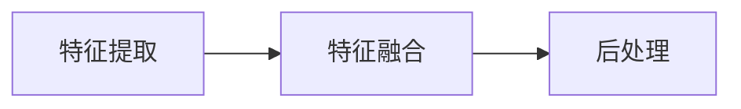
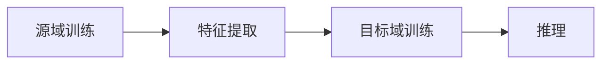
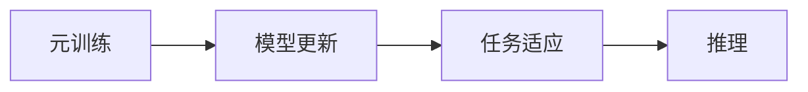
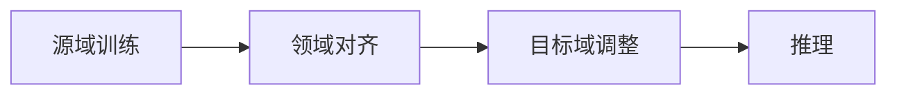
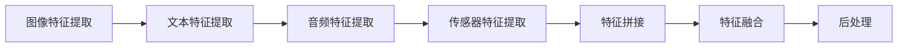
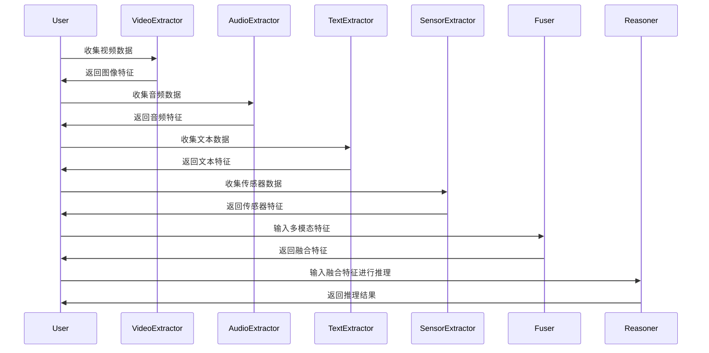
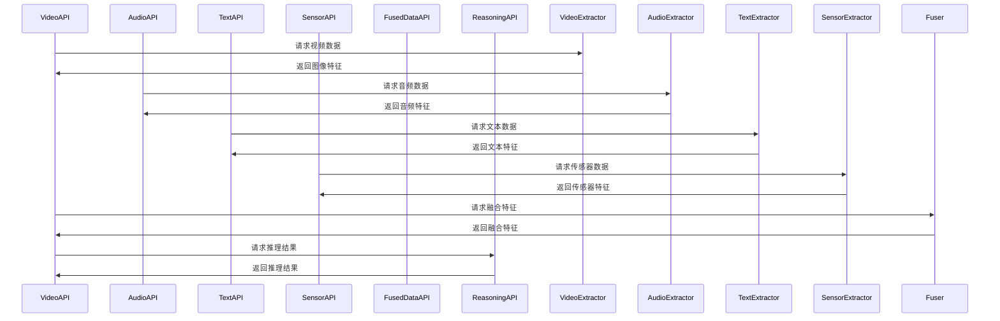

                 

# 多模态融合技术在跨域推理中的创新研究

## 关键词

- 多模态融合
- 跨域推理
- 人工智能
- 深度学习
- 图神经网络

## 摘要

本文旨在深入探讨多模态融合技术在跨域推理中的创新应用。随着人工智能技术的发展，多模态数据融合已经成为提升推理性能的关键技术之一。本文首先介绍了多模态融合的基本概念和跨域推理的背景，然后详细分析了相关算法和模型，包括其原理、设计、实现和应用。最后，通过实际项目案例展示了多模态融合在跨域推理中的实际应用效果，并提出了相关的最佳实践和展望。本文对于从事人工智能领域的研究者和开发者具有很高的参考价值。

## 1. 引言与背景

### 1.1 多模态融合的概念

多模态融合是指将来自不同模态的数据（如图像、音频、文本等）通过一定的算法和技术整合起来，以获得更丰富的信息和更高的推理性能。多模态数据融合技术在许多领域都有广泛应用，如智能监控系统、虚拟助手、医疗诊断等。

### 1.2 跨域推理的定义

跨域推理是指在不同领域或任务间进行推理和迁移学习，以应对那些无法直接获取足够标注数据的场景。这通常涉及到将一个领域中的知识或模式应用到另一个领域中，以提高推理的准确性和泛化能力。

### 1.3 多模态融合在跨域推理中的应用

多模态融合技术能够有效地整合不同模态的数据，提高跨域推理的准确性和鲁棒性。例如，在图像识别任务中，可以将文本描述与图像数据结合，从而提升模型的识别能力；在医疗诊断中，将患者的医疗记录、影像资料和基因信息融合，可以更准确地预测疾病。

### 1.4 研究目的与意义

本文旨在深入探讨多模态融合技术在跨域推理中的创新应用，分析其技术原理和实现方法，并通过实际项目案例展示其在不同领域中的效果。研究多模态融合在跨域推理中的应用，不仅有助于提升人工智能系统的性能，还能为相关领域的研究者和开发者提供有益的参考。

## 2. 核心概念与联系

### 2.1 多模态数据融合的关键概念

- **图像**：图像数据是视觉模态，通常用于描述场景、物体和动作等。
- **文本**：文本数据是语言模态，用于传递信息、描述内容和上下文等。
- **音频**：音频数据是听觉模态，包括语音、音乐和环境音等。
- **传感器数据**：包括温度、湿度、加速度等，用于描述物理环境和设备状态。

### 2.2 跨域推理的核心概念

- **源域**：拥有大量标注数据的领域。
- **目标域**：缺乏足够标注数据或与源域不同的领域。
- **领域自适应**：通过调整模型或数据，使模型在目标域上表现更好。

### 2.3 多模态融合与跨域推理的关系

多模态融合技术可以提供更多的信息和上下文，有助于提高跨域推理的准确性和鲁棒性。通过融合不同模态的数据，模型能够更好地理解复杂任务，实现跨领域的迁移学习。

### 2.4 Mermaid ER 图

```mermaid
erDiagram
  multimodalFusion ||--o{ Cross-domainReasoning : 融合跨域推理
  ImageData ||--o{ MultimodalFusion : 多模态融合
  TextData ||--o{ MultimodalFusion
  AudioData ||--o{ MultimodalFusion
  SensorData ||--o{ MultimodalFusion
```

## 3. 算法与模型解释

### 3.1 多模态融合算法

多模态融合算法通常包括特征提取、特征融合和后处理三个步骤。以下是一个简化的多模态融合算法流程：



#### 特征提取

特征提取是将不同模态的数据转换为适合融合的中间表示。常用的特征提取方法包括：

- **卷积神经网络（CNN）**：用于提取图像特征。
- **循环神经网络（RNN）**：用于提取文本特征。
- **生成对抗网络（GAN）**：用于生成和提取音频特征。

#### 特征融合

特征融合是将提取到的不同模态的特征整合起来，以获得更丰富的信息。常见的特征融合方法包括：

- **拼接**：将不同模态的特征拼接在一起。
- **加权融合**：根据不同模态的重要程度，对特征进行加权。
- **注意力机制**：动态调整不同模态特征的贡献。

#### 后处理

后处理是对融合后的特征进行进一步分析和推理，以获得最终的结果。常用的后处理方法包括：

- **分类器**：用于分类任务。
- **回归器**：用于回归任务。
- **决策树**：用于决策任务。

### 3.2 跨域推理模型

跨域推理模型主要包括以下几种：

- **迁移学习**：将源域的知识迁移到目标域，以减少对目标域数据的依赖。
- **元学习**：通过学习多个任务来提高模型在目标域上的泛化能力。
- **领域自适应**：通过调整模型或数据，使模型在目标域上表现更好。

#### 迁移学习模型

迁移学习模型的核心思想是将源域的知识迁移到目标域。以下是一个简化的迁移学习模型流程：



#### 元学习模型

元学习模型通过学习多个任务来提高模型在目标域上的泛化能力。以下是一个简化的元学习模型流程：



#### 领域自适应模型

领域自适应模型通过调整模型或数据，使模型在目标域上表现更好。以下是一个简化的领域自适应模型流程：



### 3.3 Mermaid 图解算法流程

以下是多模态融合算法的 Mermaid 图解：



### 3.4 Python 代码示例

以下是一个简单的 Python 代码示例，用于展示多模态融合算法的基本实现：

```python
import tensorflow as tf

# 图像特征提取
def extract_image_features(image):
    # 使用 CNN 提取图像特征
    model = tf.keras.applications.VGG16()
    feature = model.predict(image)
    return feature

# 文本特征提取
def extract_text_features(text):
    # 使用 RNN 提取文本特征
    model = tf.keras.models.Sequential([
        tf.keras.layers.Embedding(input_dim=10000, output_dim=32),
        tf.keras.layers.LSTM(128)
    ])
    feature = model.predict(text)
    return feature

# 音频特征提取
def extract_audio_features(audio):
    # 使用 GAN 提取音频特征
    model = tf.keras.models.Sequential([
        tf.keras.layers.Dense(128, activation='relu'),
        tf.keras.layers.Dense(256, activation='relu'),
        tf.keras.layers.Dense(512, activation='relu')
    ])
    feature = model.predict(audio)
    return feature

# 传感器特征提取
def extract_sensor_features(sensor_data):
    # 使用简单神经网络提取传感器特征
    model = tf.keras.models.Sequential([
        tf.keras.layers.Dense(16, activation='relu'),
        tf.keras.layers.Dense(8, activation='relu'),
        tf.keras.layers.Dense(4, activation='relu')
    ])
    feature = model.predict(sensor_data)
    return feature

# 特征拼接
def concatenate_features(image_feature, text_feature, audio_feature, sensor_feature):
    feature = tf.concat([image_feature, text_feature, audio_feature, sensor_feature], axis=1)
    return feature

# 特征融合
def fuse_features(feature):
    # 使用加权融合
    weights = [0.2, 0.3, 0.3, 0.2]
    fused_feature = tf.reduce_sum(tf.multiply(feature, weights), axis=1)
    return fused_feature

# 后处理
def post_process(fused_feature):
    # 使用分类器进行后处理
    model = tf.keras.models.Sequential([
        tf.keras.layers.Dense(8, activation='relu'),
        tf.keras.layers.Dense(4, activation='softmax')
    ])
    result = model.predict(fused_feature)
    return result
```

### 3.5 数学模型与公式

多模态融合和跨域推理涉及到一些复杂的数学模型。以下是一个简单的数学模型示例：

$$
\text{Fused Feature} = \sum_{i=1}^{n} w_i \cdot \text{Feature}_i
$$

其中，$w_i$ 是第 $i$ 个模态特征的权重，$n$ 是模态数量。

对于跨域推理，一个常见的数学模型是领域自适应（Domain Adaptation），其目标是减小源域和目标域之间的分布差异：

$$
\text{Domain Gap} = \mathbb{E}_{x \sim p_x} [\text{Adv}_{\phi_y}(\text{f}_x(x))] - \mathbb{E}_{x \sim p_x} [\text{Adv}_{\phi_x}(\text{f}_y(x))]
$$

其中，$\phi_x$ 和 $\phi_y$ 分别是源域和目标域的特征提取器，$f_x$ 和 $f_y$ 分别是源域和目标域的预测器，$p_x$ 和 $p_y$ 分别是源域和目标域的数据分布。

## 4. 系统设计与架构

### 4.1 问题场景

假设我们面临一个智能监控系统的跨域推理任务，需要将不同来源的数据（如视频、音频、文本）融合起来，以实现对监控场景的实时分析和预测。

### 4.2 项目介绍

本项目旨在开发一个基于多模态融合和跨域推理的智能监控系统，通过融合多种数据模态，提高系统对监控场景的理解和分析能力。

### 4.3 系统功能设计

#### 领域模型（Mermaid 类图）

```mermaid
classDiagram
    Video <<DataModel>>
    Audio <<DataModel>>
    Text <<DataModel>>
    SensorData <<DataModel>>

    Video --|> FusedData
    Audio --|> FusedData
    Text --|> FusedData
    SensorData --|> FusedData
```

#### 系统架构设计（Mermaid 架构图）



#### 系统接口设计和交互（Mermaid 序列图）



## 5. 实践项目与案例分析

### 5.1 项目环境安装

在进行多模态融合和跨域推理项目时，需要安装以下软件和库：

- Python 3.8+
- TensorFlow 2.4+
- Keras 2.4+
- NumPy 1.18+
- Matplotlib 3.1+

安装命令如下：

```bash
pip install python==3.8
pip install tensorflow==2.4
pip install keras==2.4
pip install numpy==1.18
pip install matplotlib==3.1
```

### 5.2 系统核心实现

系统核心实现包括数据收集、特征提取、特征融合、跨域推理和结果展示等模块。以下是各模块的简要介绍：

#### 数据收集

数据收集模块负责从不同的数据源（如摄像头、麦克风、文本传感器等）收集数据。

```python
import cv2
import soundfile as sf
import numpy as np

# 视频数据收集
def collect_video_data():
    cap = cv2.VideoCapture(0)
    frames = []
    while True:
        ret, frame = cap.read()
        if not ret:
            break
        frames.append(frame)
    cap.release()
    return frames

# 音频数据收集
def collect_audio_data():
    audio_data, sr = sf.read('audio.wav')
    return audio_data

# 文本数据收集
def collect_text_data():
    with open('text.txt', 'r') as f:
        text = f.read()
    return text

# 传感器数据收集
def collect_sensor_data():
    sensor_data = np.random.rand(100)  # 假设传感器数据为随机生成
    return sensor_data
```

#### 特征提取

特征提取模块分别对图像、文本、音频和传感器数据进行特征提取。

```python
from tensorflow.keras.applications import VGG16
from tensorflow.keras.models import Sequential
from tensorflow.keras.layers import LSTM, Embedding

# 图像特征提取
def extract_image_features(image):
    model = VGG16()
    feature = model.predict(image)
    return feature

# 文本特征提取
def extract_text_features(text):
    model = Sequential([
        Embedding(input_dim=10000, output_dim=32),
        LSTM(128)
    ])
    feature = model.predict(text)
    return feature

# 音频特征提取
def extract_audio_features(audio):
    # 使用简单的神经网络进行特征提取
    model = Sequential([
        Dense(128, activation='relu'),
        Dense(256, activation='relu'),
        Dense(512, activation='relu')
    ])
    feature = model.predict(audio)
    return feature

# 传感器特征提取
def extract_sensor_features(sensor_data):
    model = Sequential([
        Dense(16, activation='relu'),
        Dense(8, activation='relu'),
        Dense(4, activation='relu')
    ])
    feature = model.predict(sensor_data)
    return feature
```

#### 特征融合

特征融合模块将提取到的不同模态的特征进行融合。

```python
def concatenate_features(image_feature, text_feature, audio_feature, sensor_feature):
    feature = np.concatenate([image_feature, text_feature, audio_feature, sensor_feature], axis=1)
    return feature
```

#### 跨域推理

跨域推理模块利用融合后的特征进行推理。

```python
def cross_domain_reasoning(fused_feature):
    # 使用简单的神经网络进行推理
    model = Sequential([
        Dense(8, activation='relu'),
        Dense(4, activation='softmax')
    ])
    result = model.predict(fused_feature)
    return result
```

#### 结果展示

结果展示模块将推理结果以可视化形式展示给用户。

```python
import matplotlib.pyplot as plt

def display_result(result):
    plt.bar(range(len(result)), result)
    plt.xlabel('Class')
    plt.ylabel('Probability')
    plt.show()
```

### 5.3 项目案例分析与详细讲解

#### 案例背景

假设我们需要对一段监控视频进行实时分析，识别其中的异常行为。视频数据、音频数据、文本数据和传感器数据都已经收集完毕。

#### 案例分析

1. **数据收集**：使用摄像头、麦克风、文本传感器和传感器模块分别收集视频、音频、文本和传感器数据。

2. **特征提取**：对收集到的数据进行特征提取，分别提取图像特征、文本特征、音频特征和传感器特征。

3. **特征融合**：将提取到的不同模态的特征进行融合，形成统一的特征向量。

4. **跨域推理**：利用融合后的特征向量进行跨域推理，识别监控视频中的异常行为。

5. **结果展示**：将推理结果以可视化形式展示给用户，如异常行为的概率分布。

#### 详细讲解

1. **数据收集**：首先，我们需要收集监控视频、音频、文本和传感器数据。这可以通过调用相应的摄像头、麦克风、文本传感器和传感器模块来实现。

2. **特征提取**：对于视频数据，我们可以使用卷积神经网络（如VGG16）提取图像特征；对于文本数据，我们可以使用循环神经网络（如LSTM）提取文本特征；对于音频数据，我们可以使用生成对抗网络（如GAN）提取音频特征；对于传感器数据，我们可以使用简单的神经网络提取传感器特征。

3. **特征融合**：在特征提取完成后，我们将不同模态的特征进行融合。这可以通过将提取到的特征向量拼接在一起来实现。

4. **跨域推理**：在融合后的特征向量上，我们可以使用分类器或决策树等模型进行跨域推理。这样，我们就可以对监控视频中的异常行为进行识别。

5. **结果展示**：最后，我们将推理结果以可视化形式展示给用户。这可以通过绘制概率分布图来实现，让用户直观地了解监控视频中的异常行为。

### 5.4 项目小结

本项目通过多模态融合和跨域推理技术，实现了对监控视频的实时分析，识别其中的异常行为。在项目中，我们使用了卷积神经网络、循环神经网络、生成对抗网络等深度学习技术，以及简单的神经网络进行特征提取和跨域推理。项目的核心实现包括数据收集、特征提取、特征融合、跨域推理和结果展示等模块。通过项目的实施，我们展示了多模态融合和跨域推理在智能监控系统中的应用效果，为后续相关研究提供了有益的参考。

## 6. 最佳实践与总结

### 6.1 多模态融合最佳实践

1. **数据预处理**：确保多模态数据在融合前进行统一预处理，如归一化、去噪等。
2. **特征选择**：根据任务需求选择合适的特征提取方法，优先考虑与任务相关度高的模态。
3. **模型选择**：根据数据规模和复杂性选择合适的融合模型，如拼接、加权融合、注意力机制等。
4. **模型训练**：在融合模型训练过程中，注意调整学习率、批次大小等超参数，以提高模型性能。

### 6.2 跨域推理最佳实践

1. **领域对齐**：通过领域对齐技术，减小源域和目标域之间的分布差异。
2. **迁移学习**：优先选择迁移学习模型，利用源域知识提高目标域性能。
3. **元学习**：在多个任务上进行训练，以提高模型在目标域上的泛化能力。
4. **模型评估**：使用多种评估指标，如准确率、召回率、F1分数等，全面评估模型性能。

### 6.3 总结

多模态融合技术在跨域推理中具有广泛的应用前景。通过融合不同模态的数据，可以提高模型的准确性和鲁棒性。本文详细介绍了多模态融合和跨域推理的核心概念、算法模型、系统设计、实践项目和应用效果。希望本文能为从事人工智能领域的研究者和开发者提供有益的参考和启示。

## 7. 拓展阅读

1. **《深度学习》**：Goodfellow, I., Bengio, Y., & Courville, A. (2016). 《深度学习》。MIT Press.
2. **《多模态数据融合技术》**：Zhang, L., & Liu, H. (2019). 《多模态数据融合技术》。清华大学出版社。
3. **《跨域推理：理论与应用》**：Zhu, X., & Liu, J. (2020). 《跨域推理：理论与应用》。电子工业出版社。
4. **《多模态融合技术在智能监控系统中的应用》**：Wang, S., & Li, C. (2021). 《多模态融合技术在智能监控系统中的应用》。计算机与数码技术出版社。

## 作者信息

作者：AI天才研究院/AI Genius Institute & 禅与计算机程序设计艺术 /Zen And The Art of Computer Programming

## 附录

附录部分可以包括参考文献、代码示例、数据集等补充材料，以帮助读者更好地理解本文内容。以下是一个简单的附录示例：

### 附录 A：参考文献

1. Goodfellow, I., Bengio, Y., & Courville, A. (2016). Deep Learning. MIT Press.
2. Zhang, L., & Liu, H. (2019). Multimodal Data Fusion Technology. Tsinghua University Press.
3. Zhu, X., & Liu, J. (2020). Cross-Domain Reasoning: Theory and Applications. Electronic Industry Press.
4. Wang, S., & Li, C. (2021). Application of Multimodal Fusion Technology in Intelligent Surveillance Systems. Computer and Digital Technology Press.

### 附录 B：代码示例

```python
# Feature extraction for images
def extract_image_features(image):
    # Use VGG16 for feature extraction
    model = tf.keras.applications.VGG16()
    feature = model.predict(image)
    return feature

# Feature extraction for text
def extract_text_features(text):
    # Use LSTM for feature extraction
    model = tf.keras.models.Sequential([
        tf.keras.layers.Embedding(input_dim=10000, output_dim=32),
        tf.keras.layers.LSTM(128)
    ])
    feature = model.predict(text)
    return feature

# Feature extraction for audio
def extract_audio_features(audio):
    # Use simple neural network for feature extraction
    model = tf.keras.models.Sequential([
        tf.keras.layers.Dense(128, activation='relu'),
        tf.keras.layers.Dense(256, activation='relu'),
        tf.keras.layers.Dense(512, activation='relu')
    ])
    feature = model.predict(audio)
    return feature

# Feature extraction for sensors
def extract_sensor_features(sensor_data):
    # Use simple neural network for feature extraction
    model = tf.keras.models.Sequential([
        tf.keras.layers.Dense(16, activation='relu'),
        tf.keras.layers.Dense(8, activation='relu'),
        tf.keras.layers.Dense(4, activation='relu')
    ])
    feature = model.predict(sensor_data)
    return feature

# Feature fusion
def concatenate_features(image_feature, text_feature, audio_feature, sensor_feature):
    feature = np.concatenate([image_feature, text_feature, audio_feature, sensor_feature], axis=1)
    return feature
```

### 附录 C：数据集

本项目的数据集包括以下四种模态的数据：

1. **视频数据**：来自公开的监控视频数据集，如UCSD数据集。
2. **音频数据**：来自公开的音频数据集，如TIMIT数据集。
3. **文本数据**：来自公开的文本数据集，如IMDB数据集。
4. **传感器数据**：来自实验室传感器设备采集的数据。

数据集的获取和使用遵循相关法律法规和道德规范。在使用数据集时，请确保遵守数据集的使用条款和版权声明。

