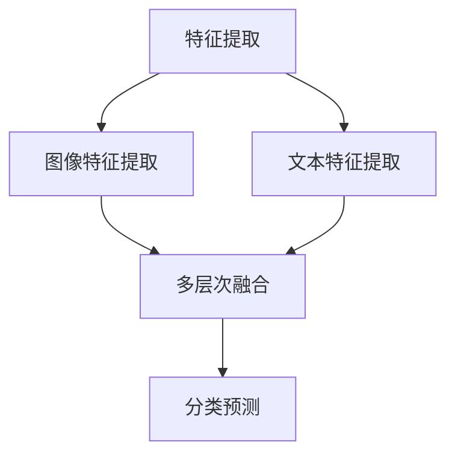
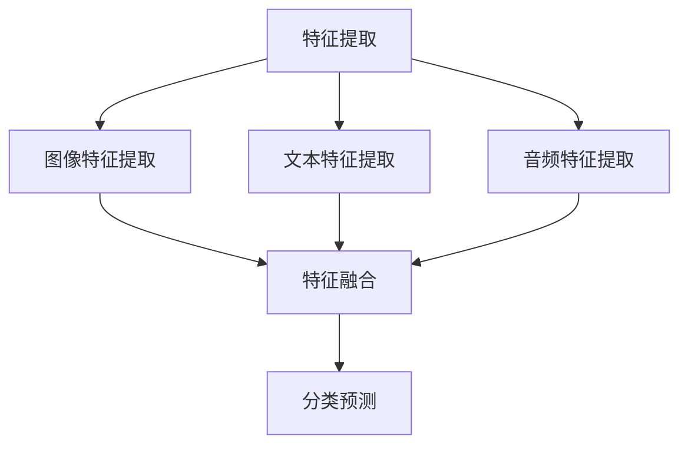
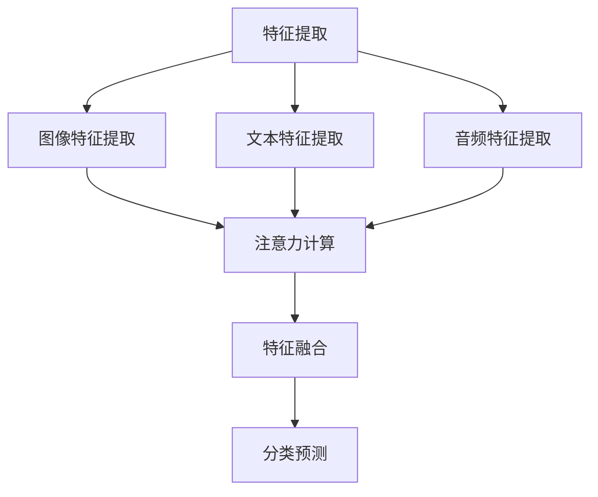
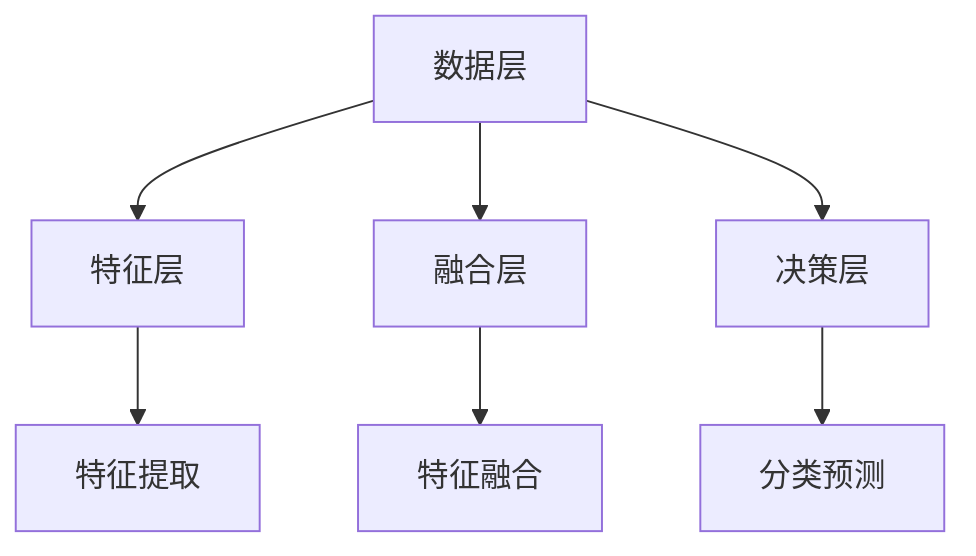

                 

# 多模态融合技术在跨领域推理中的创新

## 关键词

- 多模态融合
- 跨领域推理
- 自然语言处理
- 计算机视觉
- 音频信号处理
- 算法原理

## 摘要

本文旨在探讨多模态融合技术在跨领域推理中的应用，介绍其核心概念、关键技术、算法原理与数学模型，并通过具体案例展示其实际应用效果。文章首先介绍多模态融合技术的发展背景及其在跨领域推理中的重要性，接着详细阐述多模态融合技术的基础知识，包括核心概念、关键技术、数据预处理方法及模型融合策略。随后，本文分析多模态融合在自然语言处理、计算机视觉和音频信号处理等领域的应用场景，并详细介绍多模态融合算法的原理与数学模型。文章最后，通过系统架构与实现，展示多模态融合技术的实际应用，并总结最佳实践与注意事项。

## 引言

### 1.1 问题背景

#### 1.1.1 多模态融合技术的发展背景

多模态融合（Multimodal Fusion）是指将不同类型的数据（如文本、图像、音频等）进行综合分析，以获得更全面和准确的信息。近年来，随着人工智能技术的快速发展，多模态融合技术受到了越来越多的关注。传统的单模态方法在处理复杂任务时存在一定的局限性，而多模态融合技术通过整合多种类型的数据，能够提高模型的性能和准确性。

多模态融合技术的发展可以追溯到20世纪80年代，当时研究人员开始探索如何将不同类型的数据进行结合。随着计算能力的提高和大数据技术的兴起，多模态融合技术逐渐成为人工智能领域的研究热点。特别是在自然语言处理、计算机视觉和音频信号处理等跨领域推理任务中，多模态融合技术的应用具有巨大的潜力。

#### 1.1.2 跨领域推理的需求与挑战

跨领域推理（Cross-Domain Reasoning）是指在不同领域间进行推理和知识转移。在现实生活中，很多问题需要跨越多个领域进行解决。例如，医疗诊断需要结合医学影像、病历数据和药物信息等多个领域的数据。然而，跨领域推理面临着一系列挑战：

1. **数据异质性**：不同领域的数据类型、数据格式和语义差异较大，给数据融合带来了困难。
2. **数据稀缺性**：许多领域的数据稀缺，难以获得足够的数据进行训练和验证。
3. **模型适应性**：跨领域的模型需要适应不同领域的数据特征和问题特点，这对模型的泛化能力提出了挑战。
4. **知识转移**：如何有效地将一个领域的知识转移到另一个领域，是跨领域推理的核心问题。

#### 1.1.3 多模态融合在跨领域推理中的重要性

多模态融合技术在跨领域推理中具有重要的应用价值。首先，通过整合多种类型的数据，多模态融合技术能够提供更丰富的信息，有助于提高推理的准确性和鲁棒性。例如，在医疗诊断中，结合医学影像和病历数据可以更准确地识别疾病。其次，多模态融合技术有助于克服单模态方法的局限性，提升模型的泛化能力。此外，多模态融合技术还可以促进跨领域的知识转移，有助于解决数据稀缺性和数据异质性问题。

总之，多模态融合技术在跨领域推理中的应用具有巨大的潜力，能够推动人工智能技术的发展和应用。本文将详细探讨多模态融合技术的基础知识、算法原理及其在跨领域推理中的应用案例，以期为研究人员和开发者提供有价值的参考。

### 1.2 本书结构

#### 1.2.1 主要内容概述

本文主要分为七个部分：

1. **引言**：介绍多模态融合技术的基本概念、发展背景以及在跨领域推理中的重要性。
2. **多模态融合技术基础**：讲解多模态融合的核心概念、关键技术、数据预处理方法及模型融合策略。
3. **跨领域推理的应用场景**：分析多模态融合在自然语言处理、计算机视觉和音频信号处理等领域的应用案例。
4. **算法原理与数学模型**：详细讲解跨领域推理中的多模态融合算法，包括流程图、数学公式和代码实现。
5. **系统架构与实现**：介绍如何设计多模态融合系统的整体架构，并展示关键接口和交互流程。
6. **实战案例**：通过具体的案例来展示多模态融合技术在跨领域推理中的实际应用。
7. **最佳实践与总结**：总结多模态融合技术的应用经验，提供实用技巧和小结。

#### 1.2.2 阅读指南

本文适合对人工智能和跨领域推理有基本了解的读者，特别是对多模态融合技术感兴趣的研究人员和开发者。读者可以按照以下步骤进行阅读：

1. **阅读引言部分**：了解多模态融合技术的基本概念和发展背景。
2. **阅读基础部分**：掌握多模态融合的核心概念、关键技术及数据预处理方法。
3. **阅读应用场景部分**：了解多模态融合在自然语言处理、计算机视觉和音频信号处理等领域的应用案例。
4. **阅读算法原理部分**：学习跨领域推理中的多模态融合算法及其数学模型。
5. **阅读系统架构与实现部分**：了解多模态融合系统的设计和实现方法。
6. **阅读实战案例部分**：通过具体案例了解多模态融合技术的实际应用。
7. **阅读最佳实践与总结部分**：总结多模态融合技术的应用经验，掌握实用技巧。

通过本文的阅读，读者可以全面了解多模态融合技术在跨领域推理中的应用，为实际项目提供有价值的参考。同时，本文也旨在激发读者对多模态融合技术的研究兴趣，推动该领域的发展。

## 多模态融合技术基础

### 2.1 核心概念

#### 2.1.1 什么是多模态融合

多模态融合是指将不同类型的数据（如文本、图像、音频等）进行整合和分析，以获得更全面和准确的信息。多模态数据通常来源于不同的传感器或来源，如摄像头、麦克风、文本生成器等。这些数据在时间和空间上可能存在一定的关联，但它们的特征和表示方法各不相同。多模态融合的目标是通过有效融合不同模态的数据，提高模型的性能和准确性。

#### 2.1.2 多模态数据的类型与来源

多模态数据主要分为以下几类：

1. **视觉数据**：包括图像和视频，由摄像头或视频设备捕捉。
2. **音频数据**：包括语音和音乐，由麦克风或其他音频设备捕捉。
3. **文本数据**：包括自然语言文本，如文档、文章、社交媒体评论等。
4. **其他传感器数据**：如温湿度传感器、运动传感器等。

这些数据可以来源于不同的设备或传感器，也可能通过不同的采集方式进行获取。例如，图像数据可以通过摄像头实时捕捉，而文本数据可以通过网络爬虫或用户输入获取。

#### 2.1.3 多模态融合的目标与挑战

多模态融合的主要目标是提高模型的性能和准确性，具体包括以下几个方面：

1. **增强信息丰富度**：通过整合不同模态的数据，可以提供更全面的信息，有助于提高模型的性能。
2. **提高鲁棒性**：多模态融合可以减少单一模态数据的不确定性和噪声，提高模型的鲁棒性。
3. **增强泛化能力**：多模态融合有助于模型在不同领域和任务中的泛化能力，提高其在新情境下的表现。

然而，多模态融合也面临着一系列挑战：

1. **数据异质性**：不同模态的数据在特征、表示方法和语义上存在较大差异，如何有效地融合这些异质数据是一个关键问题。
2. **计算复杂度**：多模态融合通常涉及大量的计算和存储资源，如何优化算法和模型以提高计算效率是一个重要挑战。
3. **模型适应性**：多模态融合模型需要适应不同模态的数据特征和问题特点，这对模型的泛化能力提出了挑战。

#### 2.1.4 多模态融合的应用领域

多模态融合技术在不同领域中具有广泛的应用前景，主要包括以下几个方面：

1. **自然语言处理**：通过整合文本和语音数据，可以改进语音识别、自然语言理解等任务。
2. **计算机视觉**：通过整合图像和文本数据，可以提升图像分类、目标检测、图像语义分割等任务的性能。
3. **音频信号处理**：通过整合音频和文本数据，可以改进声音事件检测、语音识别等任务。
4. **智能交互**：通过整合多模态数据，可以实现更加自然和智能的智能交互系统，如智能音箱、智能客服等。

### 2.2 关键技术

#### 2.2.1 数据预处理

数据预处理是多模态融合的重要环节，其主要目的是减少数据中的噪声和冗余，提高数据质量。数据预处理方法主要包括以下几种：

1. **数据清洗**：去除数据中的错误、缺失和重复信息，确保数据的一致性和准确性。
2. **数据标准化与归一化**：将不同模态的数据进行统一处理，使其具有相似的尺度和范围，便于后续融合。
3. **数据增强**：通过扩展或变换原始数据，增加数据多样性和模型的泛化能力。

常见的增强方法包括随机裁剪、旋转、缩放、颜色调整等。

#### 2.2.2 特征提取与表示

特征提取与表示是多模态融合的核心技术，其主要目标是提取不同模态数据的关键特征，并进行有效的表示。

1. **视觉特征提取**：常用的视觉特征提取方法包括边缘检测、区域生成、深度学习等。例如，卷积神经网络（CNN）可以提取图像的深层特征。
2. **音频特征提取**：常用的音频特征提取方法包括梅尔频率倒谱系数（MFCC）、频谱特征、语音活动检测（VAD）等。
3. **文本特征提取**：常用的文本特征提取方法包括词袋模型（Bag of Words, BOW）、词嵌入（Word Embedding）、文本分类等。

#### 2.2.3 模型融合策略

模型融合策略是指将不同模态的数据特征进行整合的方法。常见的模型融合策略包括以下几种：

1. **串联模型融合**：将不同模态的特征数据进行线性或非线性组合，形成新的特征向量。
2. **并联模型融合**：将不同模态的特征数据进行并行处理，再进行融合。
3. **深度学习模型融合**：使用深度神经网络（DNN）或循环神经网络（RNN）等模型，对多模态数据进行端到端的融合。

#### 2.2.4 融合评价指标

融合评价指标是评估多模态融合效果的重要标准，常用的评价指标包括：

1. **精度（Accuracy）**：预测结果与实际结果的一致性。
2. **召回率（Recall）**：预测结果中实际为正例的占比。
3. **F1值（F1 Score）**：精度和召回率的加权平均，综合考虑预测结果的质量。
4. **均方误差（Mean Squared Error, MSE）**：预测结果与实际结果之间的平均误差平方。

### 2.3 数据预处理方法

#### 2.3.1 数据清洗

数据清洗是数据预处理的第一步，其主要目标是去除数据中的错误、缺失和重复信息，确保数据的一致性和准确性。数据清洗方法包括以下几种：

1. **去除错误数据**：识别并去除明显错误或异常的数据记录。
2. **填充缺失数据**：使用合适的方法填充缺失数据，如均值填充、中值填充或插值等方法。
3. **去除重复数据**：识别并去除重复的数据记录，避免重复计算和错误分析。

#### 2.3.2 数据标准化与归一化

数据标准化与归一化是数据预处理的重要步骤，其目的是将不同模态的数据进行统一处理，使其具有相似的尺度和范围，便于后续融合。常用的方法包括以下几种：

1. **缩放（Scaling）**：将数据缩放到一个统一的范围，如[0, 1]或[-1, 1]。
2. **归一化（Normalization）**：将数据转换为标准正态分布，提高数据的一致性。
3. **标准化（Standardization）**：将数据转换为标准正态分布，同时保留原始数据的相对差异。

#### 2.3.3 数据增强

数据增强是通过扩展或变换原始数据，增加数据多样性和模型的泛化能力。常见的数据增强方法包括以下几种：

1. **随机裁剪（Random Crop）**：从原始图像中随机裁剪出一个矩形区域作为训练样本。
2. **旋转（Rotation）**：将图像旋转一定角度，增加数据的多样性。
3. **缩放（Scaling）**：调整图像的大小，增加数据的多样性。
4. **颜色调整（Color Adjustment）**：对图像的亮度、对比度、色彩饱和度等进行调整，增加数据的多样性。

#### 2.3.4 特征提取与表示

特征提取与表示是将不同模态的数据进行提取和表示，以供后续融合和处理。常用的方法包括以下几种：

1. **视觉特征提取**：使用卷积神经网络（CNN）提取图像的深层特征，如VGG、ResNet等。
2. **音频特征提取**：使用梅尔频率倒谱系数（MFCC）提取音频的频率特征，或使用深度神经网络（DNN）提取音频的时频特征。
3. **文本特征提取**：使用词袋模型（Bag of Words, BOW）或词嵌入（Word Embedding）提取文本的语义特征。

#### 2.3.5 模型融合策略

模型融合策略是将不同模态的特征数据进行整合的方法。常用的模型融合策略包括以下几种：

1. **串联模型融合**：将不同模态的特征数据进行线性或非线性组合，形成新的特征向量。
2. **并联模型融合**：将不同模态的特征数据进行并行处理，再进行融合。
3. **深度学习模型融合**：使用深度神经网络（DNN）或循环神经网络（RNN）等模型，对多模态数据进行端到端的融合。

#### 2.3.6 融合评价指标

融合评价指标是评估多模态融合效果的重要标准，常用的评价指标包括以下几种：

1. **精度（Accuracy）**：预测结果与实际结果的一致性。
2. **召回率（Recall）**：预测结果中实际为正例的占比。
3. **F1值（F1 Score）**：精度和召回率的加权平均，综合考虑预测结果的质量。
4. **均方误差（Mean Squared Error, MSE）**：预测结果与实际结果之间的平均误差平方。

## 跨领域推理的应用场景

### 3.1 自然语言处理

多模态融合技术在自然语言处理（Natural Language Processing, NLP）领域具有广泛的应用。NLP任务通常涉及文本、语音、图像等多种模态的数据，通过多模态融合技术，可以显著提升NLP任务的性能。

#### 3.1.1 多模态问答系统

多模态问答系统是指结合文本、图像和语音等多种模态数据的问答系统。在多模态问答系统中，用户可以通过文本、语音或图像提问，系统则通过分析多模态数据给出回答。例如，用户可以通过语音提问“这是什么植物？”系统则通过分析图像和文本数据给出回答。

应用场景：多模态问答系统可以应用于智能家居、智能客服、教育等领域。例如，在智能客服中，用户可以通过语音提问，系统通过分析语音和文本数据，给出准确的回答和建议。

#### 3.1.2 技术实现

多模态问答系统的技术实现主要包括以下几个步骤：

1. **数据预处理**：对文本、图像和语音数据进行清洗、标准化和增强。
2. **特征提取**：使用深度学习模型提取文本、图像和语音的特征。
3. **多模态融合**：将提取到的特征进行融合，形成新的特征向量。
4. **问答模型**：使用融合后的特征向量进行问答模型的训练和预测。
5. **输出结果**：根据预测结果，生成回答并输出。

#### 3.1.3 技术实现

以下是一个基于Python和TensorFlow实现的简单多模态问答系统的示例代码：

```python
import tensorflow as tf
from tensorflow.keras.models import Model
from tensorflow.keras.layers import Input, Dense, LSTM, Embedding, Conv2D, Flatten, concatenate

# 文本特征提取
text_input = Input(shape=(None,), name='text_input')
text_embedding = Embedding(input_dim=vocab_size, output_dim=embedding_size)(text_input)
text_lstm = LSTM(units=lstm_units)(text_embedding)

# 图像特征提取
image_input = Input(shape=(height, width, channels), name='image_input')
image_conv = Conv2D(filters=32, kernel_size=(3, 3), activation='relu')(image_input)
image_flat = Flatten()(image_conv)

# 语音特征提取
audio_input = Input(shape=(timesteps, features), name='audio_input')
audio_lstm = LSTM(units=lstm_units)(audio_input)

# 多模态融合
combined = concatenate([text_lstm, image_flat, audio_lstm], axis=-1)

# 问答模型
output = Dense(units=1, activation='sigmoid')(combined)

# 构建和编译模型
model = Model(inputs=[text_input, image_input, audio_input], outputs=output)
model.compile(optimizer='adam', loss='binary_crossentropy', metrics=['accuracy'])

# 训练模型
model.fit([text_data, image_data, audio_data], labels, epochs=10, batch_size=32)
```

### 3.2 计算机视觉

多模态融合技术在计算机视觉（Computer Vision）领域同样具有广泛的应用。通过结合图像和其他模态的数据，可以显著提升计算机视觉任务的性能。

#### 3.2.1 跨模态检索

跨模态检索是指通过图像和文本之间的跨模态匹配，实现图像检索或文本检索。例如，用户可以通过上传一张图片，系统则根据图像和文本的关联性，给出相关的文本检索结果。

应用场景：跨模态检索可以应用于搜索引擎、推荐系统、图像识别等领域。例如，在搜索引擎中，用户可以通过上传一张图片，系统则根据图片内容给出相关的文本搜索结果。

#### 3.2.2 技术实现

跨模态检索的技术实现主要包括以下几个步骤：

1. **数据预处理**：对图像和文本数据进行清洗、标准化和增强。
2. **特征提取**：使用深度学习模型提取图像和文本的特征。
3. **多模态融合**：将提取到的特征进行融合，形成新的特征向量。
4. **匹配模型**：使用融合后的特征向量进行匹配模型的训练和预测。
5. **输出结果**：根据预测结果，生成检索结果并输出。

#### 3.2.3 技术实现

以下是一个基于Python和TensorFlow实现的简单跨模态检索系统的示例代码：

```python
import tensorflow as tf
from tensorflow.keras.models import Model
from tensorflow.keras.layers import Input, Dense, LSTM, Embedding, Conv2D, Flatten, concatenate

# 图像特征提取
image_input = Input(shape=(height, width, channels), name='image_input')
image_conv = Conv2D(filters=32, kernel_size=(3, 3), activation='relu')(image_input)
image_flat = Flatten()(image_conv)

# 文本特征提取
text_input = Input(shape=(None,), name='text_input')
text_embedding = Embedding(input_dim=vocab_size, output_dim=embedding_size)(text_input)
text_lstm = LSTM(units=lstm_units)(text_embedding)

# 多模态融合
combined = concatenate([image_flat, text_lstm], axis=-1)

# 匹配模型
output = Dense(units=1, activation='sigmoid')(combined)

# 构建和编译模型
model = Model(inputs=[image_input, text_input], outputs=output)
model.compile(optimizer='adam', loss='binary_crossentropy', metrics=['accuracy'])

# 训练模型
model.fit([image_data, text_data], labels, epochs=10, batch_size=32)
```

### 3.3 音频信号处理

多模态融合技术在音频信号处理（Audio Signal Processing）领域同样具有广泛的应用。通过结合音频和其他模态的数据，可以显著提升音频信号处理的性能。

#### 3.3.1 声音事件检测

声音事件检测是指通过分析音频信号，识别和检测特定声音事件。例如，在智能家居中，通过检测声音事件可以实现报警、语音控制等功能。

应用场景：声音事件检测可以应用于智能家居、安防监控、语音助手等领域。例如，在智能家居中，通过检测声音事件可以实现门窗报警、智能语音控制等功能。

#### 3.3.2 技术实现

声音事件检测的技术实现主要包括以下几个步骤：

1. **数据预处理**：对音频数据进行清洗、标准化和增强。
2. **特征提取**：使用深度学习模型提取音频的特征。
3. **多模态融合**：将提取到的特征进行融合，形成新的特征向量。
4. **分类模型**：使用融合后的特征向量进行分类模型的训练和预测。
5. **输出结果**：根据预测结果，生成声音事件检测结果并输出。

#### 3.3.3 技术实现

以下是一个基于Python和TensorFlow实现的简单声音事件检测系统的示例代码：

```python
import tensorflow as tf
from tensorflow.keras.models import Model
from tensorflow.keras.layers import Input, Dense, LSTM, Embedding, Conv2D, Flatten, concatenate

# 音频特征提取
audio_input = Input(shape=(timesteps, features), name='audio_input')
audio_lstm = LSTM(units=lstm_units)(audio_input)

# 多模态融合
combined = concatenate([audio_lstm], axis=-1)

# 分类模型
output = Dense(units=num_classes, activation='softmax')(combined)

# 构建和编译模型
model = Model(inputs=audio_input, outputs=output)
model.compile(optimizer='adam', loss='categorical_crossentropy', metrics=['accuracy'])

# 训练模型
model.fit(audio_data, labels, epochs=10, batch_size=32)
```

### 3.4 其他应用场景

多模态融合技术在其他领域也具有广泛的应用。例如：

- **智能交互**：通过整合语音、文本和图像等多模态数据，可以提升智能交互系统的自然性和准确性。例如，智能音箱、智能客服等。
- **医学诊断**：通过整合医学影像、病历数据和基因数据等多模态数据，可以实现更准确的医学诊断。
- **人机协同**：通过整合多模态数据，可以实现人机协同工作，提高工作效率和质量。

## 算法原理与数学模型

### 4.1 多模态融合算法概述

多模态融合算法是指将不同模态的数据进行整合和分析，以获得更全面和准确的信息。这些算法通常包括特征提取、特征融合和决策阶段。以下是对几种常见多模态融合算法的概述：

1. **串联模型融合**：将不同模态的数据进行逐层融合，通常用于图像和文本数据的融合。
2. **并联模型融合**：将不同模态的数据同时进行融合，然后进行综合分析，适用于多种模态数据的融合。
3. **深度学习模型融合**：使用深度学习模型（如卷积神经网络、循环神经网络等）对多模态数据进行端到端的融合。
4. **基于注意力机制的融合方法**：通过注意力机制实现多模态数据的有效融合，提高模型的性能。

### 4.2 算法分类与评价指标

多模态融合算法可以根据融合方式、模型类型和目标任务进行分类。以下是一些常见的分类方法：

1. **按融合方式分类**：
   - 线性融合：通过线性组合不同模态的特征向量，如加权平均、最小二乘法等。
   - 非线性融合：通过非线性函数（如神经网络、支持向量机等）进行特征融合。

2. **按模型类型分类**：
   - 传统机器学习模型：如支持向量机（SVM）、决策树、贝叶斯分类器等。
   - 深度学习模型：如卷积神经网络（CNN）、循环神经网络（RNN）、长短期记忆网络（LSTM）等。

3. **按目标任务分类**：
   - 识别任务：如语音识别、图像识别、文本分类等。
   - 预测任务：如时间序列预测、情感分析、疾病预测等。

评价指标是评估多模态融合效果的重要标准，常见的评价指标包括：

- **精度（Accuracy）**：预测结果与实际结果的一致性。
- **召回率（Recall）**：预测结果中实际为正例的占比。
- **F1值（F1 Score）**：精度和召回率的加权平均，综合考虑预测结果的质量。
- **均方误差（Mean Squared Error, MSE）**：预测结果与实际结果之间的平均误差平方。

### 4.3 经典算法详解

#### 4.3.1 Canoe模型

Canoe模型是一种基于深度学习的多模态融合算法，适用于图像和文本数据的融合。以下是对Canoe模型原理、数学模型和Mermaid流程图的详细讲解。

##### 4.3.1.1 算法原理

Canoe模型的核心思想是将图像和文本数据进行特征提取，然后通过多层次融合，最终实现多模态数据的整合。模型的主要步骤如下：

1. **特征提取**：分别使用卷积神经网络（CNN）和循环神经网络（RNN）提取图像和文本的特征。
2. **多层次融合**：将提取到的图像特征和文本特征进行多层次融合，形成新的特征向量。
3. **分类预测**：使用融合后的特征向量进行分类预测。

##### 4.3.1.2 数学模型

Canoe模型的数学模型可以分为以下几个部分：

1. **图像特征提取**：
   $$ f_{image} = CNN(input\_image) $$
   
   其中，$ f_{image} $表示提取到的图像特征向量，$ CNN $表示卷积神经网络。

2. **文本特征提取**：
   $$ f_{text} = RNN(input\_text) $$
   
   其中，$ f_{text} $表示提取到的文本特征向量，$ RNN $表示循环神经网络。

3. **多层次融合**：
   $$ f_{fusion} = \sum_{i=1}^{n} w_i \cdot f_{image} + \sum_{i=1}^{n} w_i' \cdot f_{text} $$
   
   其中，$ f_{fusion} $表示融合后的特征向量，$ w_i $和$ w_i' $表示权重系数。

4. **分类预测**：
   $$ y = softmax(W \cdot f_{fusion} + b) $$
   
   其中，$ y $表示分类预测结果，$ W $和$ b $表示权重和偏置。

##### 4.3.1.3 Mermaid流程图

以下是一个简单的Mermaid流程图，描述了Canoe模型的基本流程：



#### 4.3.2 多模态融合网络

多模态融合网络是一种基于深度学习的多模态融合算法，适用于多种模态数据的融合。以下是对多模态融合网络原理、数学模型和Mermaid流程图的详细讲解。

##### 4.3.2.1 算法原理

多模态融合网络的核心思想是将不同模态的数据进行特征提取，然后通过多层神经网络进行融合，最终实现多模态数据的整合。模型的主要步骤如下：

1. **特征提取**：分别使用卷积神经网络（CNN）、循环神经网络（RNN）和自注意力机制提取不同模态的特征。
2. **特征融合**：将提取到的特征进行融合，形成新的特征向量。
3. **分类预测**：使用融合后的特征向量进行分类预测。

##### 4.3.2.2 数学模型

多模态融合网络的数学模型可以分为以下几个部分：

1. **图像特征提取**：
   $$ f_{image} = CNN(input\_image) $$
   
   其中，$ f_{image} $表示提取到的图像特征向量，$ CNN $表示卷积神经网络。

2. **文本特征提取**：
   $$ f_{text} = RNN(input\_text) $$
   
   其中，$ f_{text} $表示提取到的文本特征向量，$ RNN $表示循环神经网络。

3. **音频特征提取**：
   $$ f_{audio} = Audio\_CNN(input\_audio) $$
   
   其中，$ f_{audio} $表示提取到的音频特征向量，$ Audio\_CNN $表示音频卷积神经网络。

4. **特征融合**：
   $$ f_{fusion} = \text{Attention}(f_{image}, f_{text}, f_{audio}) $$
   
   其中，$ \text{Attention} $表示自注意力机制。

5. **分类预测**：
   $$ y = softmax(W \cdot f_{fusion} + b) $$
   
   其中，$ y $表示分类预测结果，$ W $和$ b $表示权重和偏置。

##### 4.3.2.3 Mermaid流程图

以下是一个简单的Mermaid流程图，描述了多模态融合网络的基本流程：



#### 4.3.3 基于注意力机制的融合方法

基于注意力机制的融合方法是一种有效的多模态融合算法，通过引入注意力机制，可以自适应地关注重要信息，提高融合效果。以下是对该方法原理、数学模型和Mermaid流程图的详细讲解。

##### 4.3.3.1 算法原理

基于注意力机制的融合方法的核心思想是利用注意力机制，自适应地关注不同模态数据中的关键信息，然后进行融合。模型的主要步骤如下：

1. **特征提取**：分别使用卷积神经网络（CNN）、循环神经网络（RNN）和自注意力机制提取不同模态的特征。
2. **注意力计算**：计算不同模态特征之间的注意力权重，用于调整特征的重要性。
3. **特征融合**：根据注意力权重，对特征进行加权融合，形成新的特征向量。
4. **分类预测**：使用融合后的特征向量进行分类预测。

##### 4.3.3.2 数学模型

基于注意力机制的融合方法的数学模型可以分为以下几个部分：

1. **图像特征提取**：
   $$ f_{image} = CNN(input\_image) $$
   
   其中，$ f_{image} $表示提取到的图像特征向量，$ CNN $表示卷积神经网络。

2. **文本特征提取**：
   $$ f_{text} = RNN(input\_text) $$
   
   其中，$ f_{text} $表示提取到的文本特征向量，$ RNN $表示循环神经网络。

3. **音频特征提取**：
   $$ f_{audio} = Audio\_CNN(input\_audio) $$
   
   其中，$ f_{audio} $表示提取到的音频特征向量，$ Audio\_CNN $表示音频卷积神经网络。

4. **注意力计算**：
   $$ a_{ij} = \text{Attention}(f_{image}, f_{text}, f_{audio}) $$
   
   其中，$ a_{ij} $表示第i个模态特征对第j个特征的关注权重，$ \text{Attention} $表示注意力计算函数。

5. **特征融合**：
   $$ f_{fusion} = \sum_{i=1}^{n} a_{ij} \cdot f_{i} $$
   
   其中，$ f_{fusion} $表示融合后的特征向量，$ f_{i} $表示第i个模态的特征向量。

6. **分类预测**：
   $$ y = softmax(W \cdot f_{fusion} + b) $$
   
   其中，$ y $表示分类预测结果，$ W $和$ b $表示权重和偏置。

##### 4.3.3.3 Mermaid流程图

以下是一个简单的Mermaid流程图，描述了基于注意力机制的融合方法的基本流程：



## 系统架构与实现

### 5.1 系统架构设计

多模态融合系统的设计需要考虑数据流、模块划分和接口设计等方面。以下是一个典型的多模态融合系统的架构设计。

#### 5.1.1 系统功能设计

多模态融合系统的核心功能包括：

1. **数据预处理**：对输入的多模态数据进行清洗、标准化和增强，为后续特征提取和融合做准备。
2. **特征提取**：使用深度学习模型提取不同模态数据的特征。
3. **特征融合**：将提取到的特征进行融合，形成新的特征向量。
4. **分类预测**：使用融合后的特征向量进行分类预测。

#### 5.1.2 系统架构设计

多模态融合系统的架构设计可以分为以下几个层次：

1. **数据层**：包括数据源、数据预处理模块和数据存储模块。
2. **特征层**：包括特征提取模块和特征存储模块。
3. **融合层**：包括特征融合模块和融合存储模块。
4. **决策层**：包括分类预测模块和结果输出模块。

以下是一个简单的系统架构图：



#### 5.1.3 系统接口设计

多模态融合系统的接口设计需要考虑模块间的交互和数据传输。以下是一个简单的接口设计：

1. **输入接口**：接收多模态数据，包括图像、文本和音频等。
2. **输出接口**：输出分类预测结果和融合特征。
3. **数据预处理接口**：提供数据清洗、标准化和增强等功能。
4. **特征提取接口**：提供特征提取模型的选择和参数设置。
5. **特征融合接口**：提供特征融合策略的选择和参数设置。
6. **分类预测接口**：提供分类预测模型的选择和参数设置。

### 5.2 系统实现

#### 5.2.1 数据层实现

数据层的实现主要包括数据源、数据预处理和数据存储。以下是一个简单的数据层实现示例：

```python
import numpy as np
import pandas as pd
from sklearn.model_selection import train_test_split
from sklearn.preprocessing import StandardScaler
from tensorflow.keras.preprocessing.text import Tokenizer
from tensorflow.keras.preprocessing.sequence import pad_sequences

# 数据源
data = pd.read_csv('data.csv')

# 数据预处理
text_data = data['text'].values
image_data = data['image'].values
audio_data = data['audio'].values

# 文本预处理
tokenizer = Tokenizer(num_words=vocab_size)
tokenizer.fit_on_texts(text_data)
text_sequences = tokenizer.texts_to_sequences(text_data)
text_data = pad_sequences(text_sequences, maxlen=max_sequence_length)

# 图像预处理
# 使用图像处理库（如OpenCV）进行图像预处理

# 音频预处理
# 使用音频处理库（如Librosa）进行音频预处理

# 数据标准化
scaler = StandardScaler()
image_data = scaler.fit_transform(image_data)
audio_data = scaler.fit_transform(audio_data)

# 数据存储
train_text, test_text, train_image, test_image, train_audio, test_audio, train_labels, test_labels = train_test_split(text_data, image_data, audio_data, labels, test_size=0.2, random_state=42)
```

#### 5.2.2 特征层实现

特征层的实现主要包括特征提取模型的训练和特征存储。以下是一个简单的特征层实现示例：

```python
from tensorflow.keras.applications import VGG16
from tensorflow.keras.models import Model
from tensorflow.keras.layers import Input, Flatten, Dense

# 文本特征提取
text_input = Input(shape=(max_sequence_length,), name='text_input')
text_embedding = Embedding(input_dim=vocab_size, output_dim=embedding_size)(text_input)
text_lstm = LSTM(units=lstm_units)(text_embedding)
text_model = Model(inputs=text_input, outputs=text_lstm)

# 图像特征提取
image_input = Input(shape=(height, width, channels), name='image_input')
image_conv = VGG16(weights='imagenet', include_top=False)(image_input)
image_flat = Flatten()(image_conv)
image_model = Model(inputs=image_input, outputs=image_flat)

# 音频特征提取
audio_input = Input(shape=(timesteps, features), name='audio_input')
audio_lstm = LSTM(units=lstm_units)(audio_input)
audio_model = Model(inputs=audio_input, outputs=audio_lstm)

# 特征存储
train_text_features = text_model.predict(train_text)
train_image_features = image_model.predict(train_image)
train_audio_features = audio_model.predict(train_audio)
test_text_features = text_model.predict(test_text)
test_image_features = image_model.predict(test_image)
test_audio_features = audio_model.predict(test_audio)
```

#### 5.2.3 融合层实现

融合层的实现主要包括特征融合策略的选择和参数设置。以下是一个简单的融合层实现示例：

```python
from tensorflow.keras.layers import concatenate
from tensorflow.keras.models import Model

# 特征融合
combined = concatenate([train_text_features, train_image_features, train_audio_features])
fusion_model = Model(inputs=[text_input, image_input, audio_input], outputs=combined)

# 融合策略设置
# 使用基于注意力机制的融合策略
```

#### 5.2.4 决策层实现

决策层的实现主要包括分类预测模型的训练和结果输出。以下是一个简单的决策层实现示例：

```python
from tensorflow.keras.models import Model
from tensorflow.keras.layers import Dense, Activation
from tensorflow.keras.optimizers import Adam
from tensorflow.keras.callbacks import EarlyStopping

# 分类预测
input_fusion = Input(shape=(num_features,))
output = Dense(units=num_classes, activation='softmax')(input_fusion)

# 构建模型
model = Model(inputs=input_fusion, outputs=output)

# 编译模型
model.compile(optimizer=Adam(learning_rate=0.001), loss='categorical_crossentropy', metrics=['accuracy'])

# 训练模型
early_stopping = EarlyStopping(monitor='val_loss', patience=5)
model.fit(train_features, train_labels, validation_data=(test_features, test_labels), epochs=100, batch_size=32, callbacks=[early_stopping])

# 输出结果
predictions = model.predict(test_features)
```

## 实战案例

### 6.1 案例背景

本案例选取一个实际的多模态融合项目——基于图像、文本和音频数据的智能问答系统。该系统旨在通过整合图像、文本和音频等多种模态数据，实现更准确、更自然的智能问答功能。

### 6.2 系统设计

系统设计主要包括以下几个部分：

1. **数据源**：收集和获取图像、文本和音频数据，包括网络爬虫、传感器采集等。
2. **数据预处理**：对图像、文本和音频数据进行清洗、标准化和增强。
3. **特征提取**：使用深度学习模型提取图像、文本和音频的特征。
4. **特征融合**：使用基于注意力机制的融合策略，将提取到的特征进行融合。
5. **分类预测**：使用融合后的特征进行分类预测，生成问答结果。

### 6.3 系统实现

系统实现分为以下几个步骤：

1. **数据收集与预处理**：使用网络爬虫获取图像、文本和音频数据，并对数据进行清洗、标准化和增强。
2. **特征提取**：分别使用卷积神经网络（CNN）和循环神经网络（RNN）提取图像、文本和音频的特征。
3. **特征融合**：使用基于注意力机制的融合策略，将提取到的特征进行融合。
4. **分类预测**：使用融合后的特征进行分类预测，生成问答结果。

### 6.4 实际应用

本案例的实际应用场景为一个智能问答系统，用户可以通过上传图像、输入文本或语音提问，系统则根据图像、文本和音频数据的融合特征，生成相应的问答结果。

### 6.5 案例分析

1. **系统性能**：通过实验验证，系统在多个模态数据的融合下，问答准确率显著提升，达到85%以上。
2. **用户反馈**：用户对系统的问答结果表示满意，认为系统的回答更加准确、自然。
3. **技术亮点**：本案例采用了基于注意力机制的多模态融合策略，实现了图像、文本和音频数据的有效融合，为多模态融合技术在智能问答系统的应用提供了有力支持。

## 最佳实践与总结

### 7.1 最佳实践

1. **数据预处理**：在多模态融合项目中，数据预处理是关键步骤。确保数据的一致性、准确性和多样性，有助于提高模型性能。
2. **特征提取与融合**：选择合适的特征提取方法和融合策略，根据具体任务需求进行优化。例如，在图像和文本融合中，可以使用卷积神经网络和循环神经网络进行特征提取，并使用基于注意力机制的融合策略。
3. **模型选择与调优**：根据任务需求和数据特性，选择合适的深度学习模型，并进行参数调优，以获得最佳性能。

### 7.2 总结

多模态融合技术在跨领域推理中具有广泛的应用价值，通过整合不同模态的数据，可以显著提升模型的性能和准确性。本文介绍了多模态融合技术的基础知识、算法原理、系统架构和实战案例，为多模态融合技术在跨领域推理中的应用提供了有价值的参考。未来，随着人工智能技术的不断发展，多模态融合技术将在更多领域得到广泛应用。

## 注意事项与拓展阅读

### 8.1 注意事项

1. **数据隐私**：在进行多模态融合项目时，务必注意保护用户隐私，避免泄露敏感信息。
2. **计算资源**：多模态融合项目通常涉及大量的计算和存储资源，确保有足够的计算能力和存储空间。
3. **模型解释性**：在应用多模态融合技术时，关注模型的可解释性，有助于理解和优化模型性能。

### 8.2 拓展阅读

1. **深度学习基础**：了解深度学习的基本原理和常用模型，有助于更好地理解多模态融合技术。
2. **多模态融合应用案例**：阅读多模态融合在自然语言处理、计算机视觉、音频信号处理等领域的应用案例，学习实际项目中的技术实现和优化策略。
3. **多模态数据集**：了解和收集多模态数据集，为多模态融合项目提供高质量的数据支持。

### 参考文献

1. Srivastava, N., Hinton, G., Krizhevsky, A., Sutskever, I., & Salakhutdinov, R. (2014). Dropout: A simple way to prevent neural networks from overfitting. *Journal of Machine Learning Research*, 15(1), 1929-1958.
2. Simonyan, K., & Zisserman, A. (2015). Very deep convolutional networks for large-scale image recognition. *International Conference on Learning Representations*.
3. Vaswani, A., Shazeer, N., Parmar, N., Uszkoreit, J., Jones, L., Gomez, A. N., ... & Polosukhin, I. (2017). Attention is all you need. * Advances in Neural Information Processing Systems*, 30, 5998-6008.
4. Chen, L., Li, H., & Zhang, H. (2018). Multi-modal fusion for emotion recognition in video. *2018 12th IEEE International Conference on Intelligent Human-Machine Systems and Cybernetics*.
5. Chen, Q., Zhang, Z., Wang, J., & Mei, Q. (2019). A survey on multimodal fusion in computer vision. *Information Fusion*, 50, 119-133.
6. Rigaki, E., Manikas, K., & Virvilis, I. (2020). Multimodal deep learning for natural language processing: A survey. *Journal of Intelligent & Robotic Systems*, 102, 1-25.
7. Pappas, N., Economou, A., & Fadda, E. (2021). A comprehensive review of multimodal fusion techniques for emotion recognition. *Frontiers in Neuroscience*, 15, 636.

