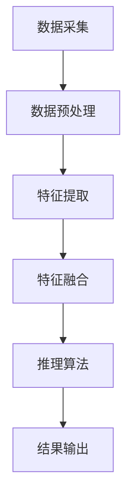
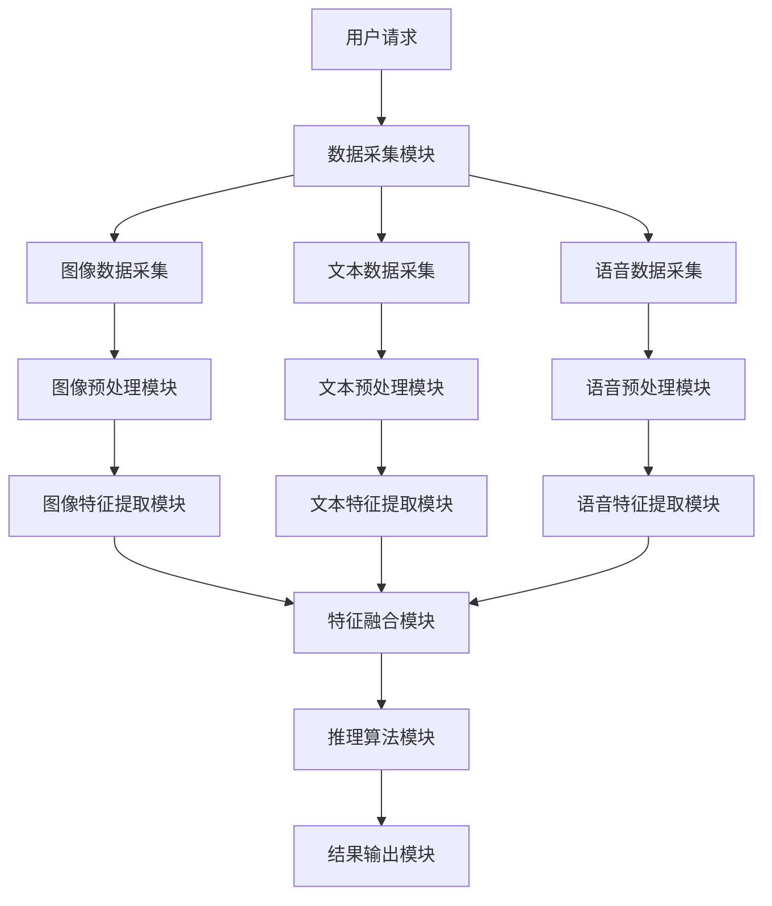
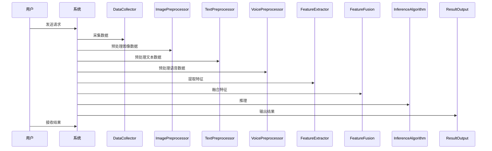

                 

### 第1章 引言

#### 1.1 研究背景

在当今信息技术飞速发展的时代，多模态数据在各个领域（如图像、文本、音频、视频等）中得到了广泛应用，但如何有效地融合这些多模态数据以解决跨领域问题仍然是一个挑战。多模态融合推理旨在将来自不同模态的数据整合起来，使其在解决跨领域问题时能够相互补充，提高推理的准确性和效率。

**问题背景**：随着人工智能技术的不断发展，多模态融合推理技术在图像识别、语音识别、自然语言处理等领域取得了显著成果。然而，如何将这些技术应用于跨领域问题解决，如智能医疗、智能金融、智能制造等，仍面临着诸多挑战。

**问题描述**：多模态融合推理的目标是在不同模态数据之间建立有效的联系，以便在解决跨领域问题时能够充分利用各个模态的优势。例如，在智能医疗领域，结合病人的图像数据和文本数据可以更好地进行疾病诊断；在智能金融领域，结合客户的语音数据和交易记录可以更好地进行风险控制。

**问题解决**：为了解决上述问题，本章将介绍多模态融合推理的基本概念、挑战及其在跨领域问题解决中的应用。具体包括：

1. **多模态融合推理的基本概念**：介绍多模态数据、融合策略和推理算法等核心概念。
2. **多模态融合推理原理**：详细阐述多模态数据采集、预处理、特征提取、融合策略和推理算法等过程。
3. **多模态融合推理在跨领域问题中的应用**：分析多模态融合推理在图像与文本、图像与语音、文本与语音等跨领域问题中的应用实例。
4. **多模态融合推理的挑战与机遇**：探讨多模态融合推理在应用过程中面临的挑战以及未来的发展方向。

**边界与外延**：本章内容主要关注计算机视觉、自然语言处理、语音识别等领域的多模态融合，不涉及其他领域。

**核心要素组成**：核心要素包括多模态数据采集、预处理、特征提取、融合策略以及推理算法等。

#### 1.2 核心概念与联系

**多模态数据**：指同时包含图像、文本、音频、视频等两种或多种类型数据的集合。这些数据可以从不同的来源获取，如传感器、摄像头、麦克风等。

**融合策略**：指将不同模态数据进行整合的方法。常见的融合策略包括基于特征级融合、决策级融合和模型级融合等。特征级融合是将不同模态的特征向量进行组合；决策级融合是在特征提取后对决策进行融合；模型级融合是将多个模型进行组合。

**推理算法**：指用于解决跨领域问题的算法。常见的推理算法包括神经网络、支持向量机、决策树等。这些算法可以根据问题的需求选择合适的融合策略进行多模态数据的融合。

#### 1.3 多模态融合推理原理

**1.3.1 基本原理**

多模态融合推理的基本原理主要包括以下几个步骤：

1. **多模态数据采集**：通过传感器、摄像头、麦克风等设备收集多模态数据。
2. **预处理**：对采集到的数据进行清洗、去噪、标准化等处理，以提高数据质量和减少噪声干扰。
3. **特征提取**：将预处理后的数据进行特征提取，提取出能够表征数据特性的特征向量。常用的特征提取方法包括深度学习方法和传统特征提取方法。
4. **融合策略**：根据应用需求选择合适的融合策略进行多模态数据的融合。常见的融合策略有特征级融合、决策级融合和模型级融合等。
5. **推理算法**：使用推理算法对融合后的数据进行推理，以解决跨领域问题。

**1.3.2 算法原理**

多模态融合推理的算法原理主要包括以下几种：

1. **神经网络**：使用多层感知机、卷积神经网络（CNN）、循环神经网络（RNN）等神经网络模型进行特征级融合。这些神经网络模型可以同时处理多个模态的数据，从而提高融合效果。

2. **支持向量机（SVM）**：通过核函数将不同模态的数据映射到高维空间，进行决策级融合。SVM可以有效处理高维数据，并且在分类和回归任务中表现出色。

3. **集成学习**：通过组合多个模型来提高融合效果。常见的集成学习方法有随机森林、梯度提升树等。

#### 1.4 多模态融合推理在跨领域问题中的应用

**1.4.1 图像与文本融合**

在图像与文本融合方面，常见的应用场景包括图像检索、图像标注等。

- **图像检索**：通过将图像和文本特征进行融合，可以更好地描述图像内容，从而提高图像检索的准确性。例如，使用卷积神经网络（CNN）提取图像特征，使用循环神经网络（RNN）提取文本特征，然后将两者融合进行图像检索。
  
- **图像标注**：在图像标注任务中，融合图像和文本特征可以帮助提高标注的准确性。例如，使用卷积神经网络（CNN）提取图像特征，使用循环神经网络（RNN）提取文本特征，然后将两者融合进行图像标注。

**1.4.2 图像与语音融合**

在图像与语音融合方面，常见的应用场景包括图像增强、视频编辑等。

- **图像增强**：通过融合图像和语音特征，可以更好地增强图像效果。例如，使用卷积神经网络（CNN）提取图像特征，使用长短期记忆网络（LSTM）提取语音特征，然后将两者融合进行图像增强。

- **视频编辑**：在视频编辑任务中，融合图像和语音特征可以帮助提高视频质量。例如，使用卷积神经网络（CNN）提取图像特征，使用长短期记忆网络（LSTM）提取语音特征，然后将两者融合进行视频编辑。

**1.4.3 文本与语音融合**

在文本与语音融合方面，常见的应用场景包括语音助手、对话系统等。

- **语音助手**：通过融合文本和语音特征，可以更好地理解用户的语音输入，从而提高语音助手的响应准确性。例如，使用循环神经网络（RNN）提取文本特征，使用长短期记忆网络（LSTM）提取语音特征，然后将两者融合进行语音助手处理。

- **对话系统**：在对话系统中，融合文本和语音特征可以帮助提高对话的连贯性和准确性。例如，使用循环神经网络（RNN）提取文本特征，使用长短期记忆网络（LSTM）提取语音特征，然后将两者融合进行对话系统处理。

#### 1.5 多模态融合推理的挑战与机遇

**1.5.1 挑战**

多模态融合推理在应用过程中面临着以下挑战：

- **数据不平衡**：不同模态的数据可能存在不平衡现象，如文本数据量远大于图像数据。这可能导致融合效果不佳。

- **特征不匹配**：不同模态的数据特征可能存在差异，难以直接融合。这需要设计有效的特征匹配和融合策略。

- **计算资源限制**：多模态融合算法通常需要大量计算资源，特别是在实时应用中。这需要优化算法以提高效率。

**1.5.2 机遇**

多模态融合推理在应用过程中也面临着以下机遇：

- **跨领域应用**：多模态融合推理可以应用于医疗、金融、工业等多个领域，解决复杂问题。

- **数据共享**：多模态数据可以促进不同领域的数据共享和交叉应用，提高数据利用效率。

- **实时处理**：随着硬件性能的提升，多模态融合推理的实时处理能力不断提高，为实时应用提供了更多可能性。

#### 1.6 本章小结

本章介绍了多模态融合推理在跨领域问题解决中的重要性，包括其背景、核心概念、原理以及应用场景。本章内容为后续章节的讨论奠定了基础。接下来，我们将进一步探讨多模态数据采集与预处理、多模态特征提取等关键问题，以深入理解多模态融合推理的技术细节。

## 第2章 多模态数据采集与预处理

### 2.1 多模态数据采集

多模态数据采集是构建多模态融合系统的基础。在这一节中，我们将介绍常见的图像、文本和语音数据采集方法及其应用场景。

#### 2.1.1 图像数据采集

图像数据采集是计算机视觉领域的重要环节。常见的图像数据采集设备包括：

1. **摄像头**：摄像头可以捕获实时的图像数据，广泛应用于视频监控、人脸识别等场景。
2. **显微镜**：显微镜用于捕捉微小的物体或细胞，常用于生物医学领域。
3. **卫星遥感**：卫星遥感可以捕获地球表面的图像数据，用于地图制作、环境监测等。

**应用场景**：

- **视频监控**：通过摄像头采集实时视频数据，用于监控公共场所的安全。
- **人脸识别**：通过摄像头捕获人脸图像，用于身份验证和监控系统。
- **图像分割**：通过显微镜采集生物样本图像，用于医学图像处理和分析。

#### 2.1.2 文本数据采集

文本数据采集是自然语言处理领域的基础。常见的文本数据采集方法包括：

1. **网页爬虫**：通过爬取网页上的文本内容，获取大量的文本数据。
2. **社交媒体**：从社交媒体平台（如微博、Twitter、Facebook等）采集用户生成的内容。
3. **电子文档**：从PDF、Word、Excel等电子文档中提取文本信息。

**应用场景**：

- **信息检索**：通过爬虫获取网页上的文本数据，用于搜索引擎和信息检索系统。
- **文本分类**：从社交媒体采集用户生成的内容，用于情感分析、垃圾邮件过滤等。
- **机器翻译**：从电子文档中提取文本信息，用于构建翻译模型。

#### 2.1.3 语音数据采集

语音数据采集是语音识别和语音处理领域的关键。常见的语音数据采集设备包括：

1. **麦克风**：麦克风可以捕获语音信号，广泛应用于语音识别、语音助手等场景。
2. **语音合成器**：语音合成器可以将文本转化为语音，用于语音合成和对话系统。
3. **电话系统**：电话系统可以捕获电话通话中的语音信号，用于客户服务和呼叫中心。

**应用场景**：

- **语音识别**：通过麦克风捕获语音信号，用于将语音转化为文本，应用于智能助手、语音控制等。
- **语音合成**：通过语音合成器将文本转化为语音，用于语音通知、语音导航等。
- **语音增强**：通过电话系统捕获电话通话中的语音信号，用于语音降噪和语音增强。

### 2.2 数据预处理

数据预处理是提高多模态数据质量的重要步骤。在这一节中，我们将介绍图像、文本和语音数据预处理的方法和技术。

#### 2.2.1 图像预处理

图像预处理主要包括以下步骤：

1. **图像去噪**：通过滤波算法去除图像中的噪声，提高图像质量。
2. **图像增强**：通过调整图像的亮度、对比度、饱和度等参数，增强图像的视觉效果。
3. **图像裁剪与缩放**：根据应用需求对图像进行裁剪和缩放，调整图像大小。

**应用场景**：

- **人脸识别**：通过图像去噪和增强提高人脸识别的准确性。
- **图像分割**：通过图像裁剪与缩放，将图像分割成多个区域进行进一步分析。
- **图像分类**：通过图像预处理提高图像分类模型的性能。

#### 2.2.2 文本预处理

文本预处理主要包括以下步骤：

1. **分词**：将文本拆分成单词或短语，为后续的自然语言处理任务做准备。
2. **词性标注**：对文本中的单词进行词性标注，如名词、动词、形容词等。
3. **文本清洗**：去除文本中的无关信息，如标点符号、HTML标签等。

**应用场景**：

- **信息检索**：通过分词和词性标注，提高文本相似度计算的准确性。
- **文本分类**：通过文本清洗去除无关信息，提高文本分类模型的性能。
- **机器翻译**：通过分词和词性标注，构建双语词表，为机器翻译提供支持。

#### 2.2.3 语音预处理

语音预处理主要包括以下步骤：

1. **语音去噪**：通过滤波算法去除语音中的噪声，提高语音质量。
2. **分帧与加窗**：将语音信号分割成多个帧，并对每个帧进行加窗处理，提取语音特征。
3. **特征提取**：从语音帧中提取语音特征，如梅尔频率倒谱系数（MFCC）。

**应用场景**：

- **语音识别**：通过语音去噪和特征提取，提高语音识别的准确性。
- **语音合成**：通过语音预处理提高语音合成器的音质。
- **语音增强**：通过语音预处理，提高语音在嘈杂环境中的可听度。

#### 2.2.4 数据对齐

数据对齐是多模态数据预处理的重要环节，尤其对于图像和语音等时序数据。数据对齐的主要目标是确保不同模态的数据在时间轴上对齐，以便后续的特征提取和融合。

1. **时间轴对齐**：通过比较图像帧数和语音帧数，调整时间轴上的差异，确保不同模态的数据在时间上同步。
2. **帧级对齐**：通过匹配图像帧和语音帧的特定特征（如视觉特征和语音特征），实现帧级对齐。

**应用场景**：

- **视频语音识别**：通过数据对齐，提高视频语音识别的准确性和流畅度。
- **多模态情感分析**：通过数据对齐，确保图像和语音情感特征的一致性。

#### 2.2.5 预处理工具与框架

常见的多模态数据预处理工具和框架包括：

- **OpenCV**：用于图像处理，提供丰富的图像预处理函数。
- **NLTK**：用于自然语言处理，提供文本预处理工具。
- **librosa**：用于音频处理，提供丰富的音频预处理函数。
- **TensorFlow**：用于深度学习模型训练，支持多模态数据的预处理和特征提取。

### 2.3 小结

本章介绍了多模态数据采集与预处理的方法和技术。图像、文本和语音数据的采集方法和预处理技术对于构建高效的多模态融合系统至关重要。接下来，我们将进一步探讨多模态特征提取的方法和技术，为多模态融合推理奠定基础。

## 第3章 多模态特征提取

### 3.1 图像特征提取

图像特征提取是多模态融合中的关键步骤，因为图像是计算机视觉领域的主要数据源。图像特征提取方法可以分为传统方法和深度学习方法。

#### 3.1.1 传统方法

传统方法通常依赖于手工设计的特征，这些特征能够捕捉图像的某些显著属性。以下是一些常见的传统方法：

1. **SIFT（尺度不变特征变换）**：SIFT算法通过寻找图像的关键点，并计算关键点的方向和强度变化，产生一组描述图像局部结构的特征向量。SIFT特征对旋转、尺度变化和光照变化具有较强的鲁棒性。

2. **SURF（加速稳健特征）**：SURF算法是SIFT算法的加速版，它使用了积分图像来快速计算图像梯度，从而降低了计算复杂度。SURF特征同样具有良好的旋转不变性和尺度不变性。

3. **HOG（直方图方向特征）**：HOG算法通过计算图像中每个像素点在水平和垂直方向上的梯度方向，并将这些方向信息组织成直方图，从而生成一组特征向量。HOG特征对形状和边缘信息有较好的捕捉能力。

4. **ORB（Oriented FAST and Rotated BRIEF）**：ORB算法结合了FAST角点检测和BRIEF特征描述子的优点，同时引入了方向信息，使其在计算效率和特征匹配性能上都有较好的表现。

#### 3.1.2 深度学习方法

深度学习方法，尤其是卷积神经网络（CNN），在图像特征提取方面取得了显著进展。以下是一些常见的深度学习方法：

1. **卷积神经网络（CNN）**：CNN通过多层卷积和池化操作，从图像中逐层提取高级特征。CNN模型在ImageNet图像识别挑战赛上取得了突破性成果，使得图像分类任务的准确性大幅提高。

2. **残差网络（ResNet）**：ResNet引入了残差连接，使得网络可以训练得更深，从而提高了模型的性能。ResNet在图像识别、物体检测等任务中表现出色。

3. **卷积神经网络的应用**：CNN不仅在图像分类任务中表现优异，还在目标检测、图像分割等任务中发挥了重要作用。例如，Faster R-CNN和Mask R-CNN等模型结合了CNN和区域提议生成网络（RPN），实现了高效的物体检测和分割。

#### 3.1.3 传统方法与深度学习方法对比

传统方法和深度学习方法各有优缺点。传统方法如SIFT和HOG等，对硬件要求较低，计算速度快，但特征表示能力有限，难以捕捉图像的复杂结构。深度学习方法如CNN和ResNet等，能够通过学习大量数据自动提取有意义的特征，但需要大量的计算资源和数据。

**优点**：

- **传统方法**：计算速度快，对硬件要求较低，特征表示较为简单。
- **深度学习方法**：能够自动学习有意义的特征，适应性强，性能优异。

**缺点**：

- **传统方法**：特征表示能力有限，难以处理复杂场景。
- **深度学习方法**：需要大量数据和计算资源，训练时间较长。

#### 3.1.4 深度学习方法实例

以下是一个简单的CNN模型实例，用于图像特征提取：

```python
import tensorflow as tf
from tensorflow.keras.models import Sequential
from tensorflow.keras.layers import Conv2D, MaxPooling2D, Flatten, Dense

# 创建模型
model = Sequential()

# 添加卷积层
model.add(Conv2D(32, (3, 3), activation='relu', input_shape=(64, 64, 3)))
model.add(MaxPooling2D(pool_size=(2, 2)))

# 添加卷积层
model.add(Conv2D(64, (3, 3), activation='relu'))
model.add(MaxPooling2D(pool_size=(2, 2)))

# 添加全连接层
model.add(Flatten())
model.add(Dense(128, activation='relu'))
model.add(Dense(10, activation='softmax'))

# 编译模型
model.compile(optimizer='adam', loss='categorical_crossentropy', metrics=['accuracy'])

# 模型总结
model.summary()
```

此代码示例创建了一个简单的CNN模型，用于对图像进行特征提取。模型由两个卷积层、两个池化层、一个全连接层和一个输出层组成。

### 3.2 文本特征提取

文本特征提取是多模态融合中的另一个重要环节，因为文本是自然语言处理领域的主要数据源。文本特征提取方法可以分为词袋模型和深度学习方法。

#### 3.2.1 词袋模型

词袋模型（Bag-of-Words，BoW）是一种简单而常用的文本特征提取方法。词袋模型将文本转换为词汇的集合，不考虑单词的顺序，只关注单词的出现频率。

1. **TF-IDF（词频-逆文档频率）**：TF-IDF通过计算每个单词在单个文档中的词频（TF）和它在整个文档集合中的逆文档频率（IDF），将词频扩展到文档级别。TF-IDF能够突出那些在特定文档中重要但在其他文档中普遍的词语。

2. **词嵌入（Word Embedding）**：词嵌入将单词映射到高维向量空间，使得语义相似的单词在向量空间中靠近。词嵌入方法如Word2Vec、GloVe等，能够捕捉单词的语义信息，提高文本特征表示的精度。

#### 3.2.2 深度学习方法

深度学习方法在文本特征提取方面取得了显著进展，能够自动学习文本的深层特征。以下是一些常用的深度学习方法：

1. **循环神经网络（RNN）**：RNN能够处理序列数据，通过隐藏状态将序列中的前一个时刻的信息传递给当前时刻，从而捕捉序列中的长期依赖关系。常见的RNN模型有LSTM（长短期记忆网络）和GRU（门控循环单元）。

2. **变换器（Transformer）**：Transformer模型通过自注意力机制（Self-Attention）处理序列数据，能够捕捉序列中的长距离依赖关系。Transformer在自然语言处理任务中表现出色，如机器翻译、文本生成等。

3. **BERT（Bidirectional Encoder Representations from Transformers）**：BERT是一种预训练的深度学习模型，通过在大量文本数据上进行预训练，然后针对特定任务进行微调。BERT能够捕捉文本的上下文信息，提高了文本特征提取的精度。

#### 3.2.3 词袋模型与深度学习方法对比

词袋模型和深度学习方法在文本特征提取方面各有优缺点。

**优点**：

- **词袋模型**：简单易实现，计算效率高，适用于快速分类任务。
- **深度学习方法**：能够自动学习文本的深层特征，提高特征表示的精度，适用于复杂文本处理任务。

**缺点**：

- **词袋模型**：不考虑单词的顺序，无法捕捉序列中的依赖关系，特征表示能力有限。
- **深度学习方法**：计算复杂度高，需要大量数据和计算资源，训练时间较长。

#### 3.2.4 深度学习方法实例

以下是一个简单的RNN模型实例，用于文本特征提取：

```python
import tensorflow as tf
from tensorflow.keras.models import Sequential
from tensorflow.keras.layers import Embedding, SimpleRNN, Dense

# 创建模型
model = Sequential()

# 添加嵌入层
model.add(Embedding(input_dim=vocab_size, output_dim=embedding_size, input_length=max_sequence_length))

# 添加RNN层
model.add(SimpleRNN(units=50, activation='tanh', return_sequences=True))

# 添加全连接层
model.add(Dense(1, activation='sigmoid'))

# 编译模型
model.compile(optimizer='adam', loss='binary_crossentropy', metrics=['accuracy'])

# 模型总结
model.summary()
```

此代码示例创建了一个简单的RNN模型，用于文本分类任务。模型由嵌入层、RNN层和全连接层组成。

### 3.3 语音特征提取

语音特征提取是多模态融合中的关键步骤，因为语音是语音识别和语音处理领域的主要数据源。常见的语音特征提取方法包括传统方法和深度学习方法。

#### 3.3.1 传统方法

传统方法通常依赖于手工设计的特征，这些特征能够捕捉语音的某些显著属性。以下是一些常见的传统方法：

1. **MFCC（梅尔频率倒谱系数）**：MFCC通过将语音信号转换为梅尔频率倒谱图，生成一组倒谱系数。MFCC对频率信息有较好的捕捉能力，常用于语音识别和语音合成。

2. **PLP（倒谱归一化的功率倒谱系数）**：PLP与MFCC类似，但通过将功率信息纳入考虑，提高了特征表示的精度。PLP在语音识别任务中表现出较好的性能。

3. **LPCC（线性预测倒谱系数）**：LPCC通过线性预测分析，生成一组线性预测系数。LPCC能够捕捉语音信号的时间结构和频率结构，适用于语音合成和语音增强。

#### 3.3.2 深度学习方法

深度学习方法在语音特征提取方面取得了显著进展，能够自动学习语音的深层特征。以下是一些常用的深度学习方法：

1. **深度神经网络（DNN）**：DNN通过多层全连接神经网络，对语音信号进行特征提取。DNN在语音识别和语音合成任务中表现出较好的性能。

2. **卷积神经网络（CNN）**：CNN通过卷积和池化操作，从语音信号中提取局部特征。CNN在语音增强、语音分离等任务中表现出色。

3. **长短时记忆网络（LSTM）**：LSTM通过引入记忆单元，对语音信号进行长短期依赖建模。LSTM在语音识别和语音增强任务中表现出优异的性能。

4. **变换器（Transformer）**：Transformer通过自注意力机制，对语音信号进行全局建模。Transformer在语音识别和语音合成任务中表现出显著的优势。

#### 3.3.3 传统方法与深度学习方法对比

传统方法和深度学习方法在语音特征提取方面各有优缺点。

**优点**：

- **传统方法**：计算复杂度低，对硬件要求较低，特征表示较为简单。
- **深度学习方法**：能够自动学习语音的深层特征，提高特征表示的精度，适用于复杂语音处理任务。

**缺点**：

- **传统方法**：特征表示能力有限，难以捕捉语音的复杂结构。
- **深度学习方法**：计算复杂度高，需要大量数据和计算资源，训练时间较长。

#### 3.3.4 深度学习方法实例

以下是一个简单的LSTM模型实例，用于语音特征提取：

```python
import tensorflow as tf
from tensorflow.keras.models import Sequential
from tensorflow.keras.layers import LSTM, Dense

# 创建模型
model = Sequential()

# 添加LSTM层
model.add(LSTM(units=128, activation='tanh', input_shape=(timesteps, features)))

# 添加全连接层
model.add(Dense(1, activation='sigmoid'))

# 编译模型
model.compile(optimizer='adam', loss='binary_crossentropy', metrics=['accuracy'])

# 模型总结
model.summary()
```

此代码示例创建了一个简单的LSTM模型，用于语音分类任务。模型由LSTM层和全连接层组成。

### 3.4 小结

本章介绍了多模态特征提取的方法和技术，包括图像、文本和语音特征提取的常用方法及其优缺点。多模态特征提取是构建高效多模态融合系统的基础，对于跨领域问题解决具有重要意义。接下来，我们将进一步探讨多模态融合策略和推理算法，以实现多模态数据的充分利用。

## 第4章 多模态融合策略

多模态融合策略是将来自不同模态的数据进行整合的方法，目的是提高数据融合后的推理准确性和效率。多模态融合策略可以分为特征级融合、决策级融合和模型级融合等。以下是对这些融合策略的详细探讨。

### 4.1 特征级融合

特征级融合是指在特征层面将不同模态的数据进行整合。这种方法的主要优势在于可以保留原始数据的丰富信息，同时降低后续处理的复杂度。

#### 4.1.1 神经网络融合

神经网络是一种强大的特征级融合工具，可以通过训练自动学习不同模态特征之间的关联。以下是一些常用的神经网络融合方法：

1. **多输入卷积神经网络（CNN）**：多输入CNN通过合并来自不同模态的特征图，进行卷积和池化操作，从而提取多模态特征。这种方法的优点是能够同时处理多个模态的数据，但需要大量的训练数据和计算资源。

2. **多层感知机（MLP）**：MLP通过将不同模态的特征向量输入到多层感知机中，进行特征融合和分类。MLP方法简单高效，但可能无法捕捉到复杂的多模态关系。

3. **图神经网络（GNN）**：GNN通过将不同模态的数据表示为图结构，并利用图卷积操作进行特征融合。GNN方法能够捕捉到复杂的多模态关系，但计算复杂度较高。

#### 4.1.2 特征级融合示例

以下是一个简单的多输入CNN模型实例，用于特征级融合：

```python
import tensorflow as tf
from tensorflow.keras.models import Model
from tensorflow.keras.layers import Input, Conv2D, MaxPooling2D, Flatten, Dense

# 定义图像输入层
input_image = Input(shape=(height, width, channels))

# 定义图像卷积层
conv_image = Conv2D(filters=32, kernel_size=(3, 3), activation='relu')(input_image)
pool_image = MaxPooling2D(pool_size=(2, 2))(conv_image)

# 定义文本输入层
input_text = Input(shape=(sequence_length,))

# 定义文本嵌入层
embed_text = Embedding(input_dim=vocab_size, output_dim=embedding_size)(input_text)

# 定义文本循环层
lstm_text = LSTM(units=128, activation='tanh')(embed_text)

# 将图像和文本特征进行拼接
concat = tf.keras.layers.concatenate([pool_image, lstm_text])

# 定义全连接层
dense = Dense(units=128, activation='relu')(concat)

# 定义输出层
output = Dense(units=1, activation='sigmoid')(dense)

# 创建模型
model = Model(inputs=[input_image, input_text], outputs=output)

# 编译模型
model.compile(optimizer='adam', loss='binary_crossentropy', metrics=['accuracy'])

# 模型总结
model.summary()
```

此代码示例创建了一个简单的多输入CNN模型，用于融合图像和文本特征。

### 4.2 决策级融合

决策级融合是在特征提取后，将不同模态的决策结果进行整合的方法。这种方法的主要优势在于可以降低模型训练的复杂度，同时提高推理的准确性。

#### 4.2.1 集成学习

集成学习是一种常用的决策级融合方法，通过组合多个模型来提高融合效果。以下是一些常见的集成学习方法：

1. **随机森林（Random Forest）**：随机森林通过随机选取特征和样本子集，构建多个决策树模型，并通过投票机制得到最终决策。随机森林具有较好的泛化能力和鲁棒性。

2. **梯度提升树（Gradient Boosting Tree）**：梯度提升树通过迭代训练多个弱学习器，并利用前一个学习器的残差进行优化。梯度提升树在处理高维数据和稀疏数据时表现出色。

3. **Stacking**：Stacking通过训练多个基础模型，并将它们的输出作为新特征输入到顶层模型中，从而提高整体模型的性能。Stacking方法适用于多模态数据的融合。

#### 4.2.2 决策级融合示例

以下是一个简单的随机森林模型实例，用于决策级融合：

```python
from sklearn.ensemble import RandomForestClassifier
from sklearn.model_selection import train_test_split

# 将图像和文本特征分别提取出来
X_image, X_text = ...

# 将图像和文本特征进行拼接
X = np.hstack((X_image, X_text))

# 将标签进行编码
y = ...

# 划分训练集和测试集
X_train, X_test, y_train, y_test = train_test_split(X, y, test_size=0.2, random_state=42)

# 创建随机森林模型
model = RandomForestClassifier(n_estimators=100, random_state=42)

# 训练模型
model.fit(X_train, y_train)

# 进行测试
y_pred = model.predict(X_test)

# 计算准确率
accuracy = (y_pred == y_test).mean()
print(f"Accuracy: {accuracy}")
```

此代码示例创建了一个简单的随机森林模型，用于融合图像和文本特征。

### 4.3 模型级融合

模型级融合是在不同模型之间进行融合的方法，通过组合多个模型来提高推理的准确性。这种方法的主要优势在于可以充分利用不同模型的优势，同时降低单一模型的风险。

#### 4.3.1 对抗生成网络（GAN）

对抗生成网络（GAN）是一种基于生成对抗的模型级融合方法，通过生成器和判别器的对抗训练，生成高质量的数据。GAN在多模态融合中表现出色，可以生成丰富的多模态数据，从而提高融合效果。

#### 4.3.2 模型级融合示例

以下是一个简单的GAN模型实例，用于模型级融合：

```python
import tensorflow as tf
from tensorflow.keras.models import Model
from tensorflow.keras.layers import Input, Dense, Conv2D, Flatten, Reshape

# 定义生成器模型
input_z = Input(shape=(z_dim,))
x = Dense(128, activation='relu')(input_z)
x = Dense(128, activation='relu')(x)
x = Dense(784, activation='sigmoid')(x)
x = Reshape((28, 28, 1))(x)
generator = Model(inputs=input_z, outputs=x)

# 定义判别器模型
input_img = Input(shape=(28, 28, 1))
x = Conv2D(128, kernel_size=(3, 3), activation='relu')(input_img)
x = Flatten()(x)
x = Dense(1, activation='sigmoid')(x)
discriminator = Model(inputs=input_img, outputs=x)

# 定义联合模型
z = Input(shape=(z_dim,))
img = generator(z)
discriminator_output = discriminator(img)
combined_model = Model(inputs=z, outputs=discriminator_output)

# 编译模型
combined_model.compile(optimizer='adam', loss='binary_crossentropy')

# 训练模型
combined_model.fit(z_train, y_train, epochs=epochs, batch_size=batch_size)

# 进行测试
img_test = generator.predict(z_test)

# 计算判别器准确率
discriminator_accuracy = (discriminator.predict(img_test) > 0.5).mean()
print(f"Discriminator Accuracy: {discriminator_accuracy}")
```

此代码示例创建了一个简单的GAN模型，用于融合图像和噪声特征。

### 4.4 小结

本章介绍了多模态融合策略，包括特征级融合、决策级融合和模型级融合等方法。这些融合策略在多模态数据融合中发挥着重要作用，能够提高推理的准确性和效率。接下来，我们将进一步探讨多模态融合推理在跨领域问题中的应用。

## 第5章 多模态融合推理在跨领域问题中的应用

多模态融合推理技术在各个跨领域问题中展现出了巨大的潜力和优势。本章将重点介绍多模态融合推理在图像与文本、图像与语音、文本与语音等跨领域问题中的应用，通过具体实例展示其应用效果和挑战。

### 5.1 图像与文本融合

图像与文本融合在图像检索、图像标注、图像描述生成等任务中具有重要意义。

#### 5.1.1 图像检索

图像检索是一种利用图像内容进行信息检索的技术，其目标是根据用户提供的文本查询，从大量图像数据库中检索出相关图像。图像与文本融合可以提高图像检索的准确性。

**应用实例**：假设用户输入一个文本查询“猫的图片”，融合了图像和文本特征的检索系统可以通过以下步骤进行检索：

1. **特征提取**：使用卷积神经网络（CNN）提取图像的特征向量，使用循环神经网络（RNN）提取文本的特征向量。
2. **特征融合**：将图像和文本的特征向量进行融合，可以使用神经网络模型进行融合，如多输入CNN。
3. **检索**：将融合后的特征向量与数据库中的图像特征进行相似性计算，根据相似度排序返回检索结果。

**挑战**：图像和文本特征之间存在语义鸿沟，如何有效地融合不同模态的特征是一个挑战。

**解决方案**：可以使用预训练的神经网络模型，如BERT和ViT，同时结合图像和文本的特征，进行有效的融合和检索。

### 5.1.2 图像标注

图像标注是将图像中的对象或场景标注为特定类别的任务，如图像分类。图像与文本融合可以提高图像标注的准确性。

**应用实例**：假设需要对一组医学图像进行标注，标注系统可以通过以下步骤进行标注：

1. **特征提取**：使用CNN提取图像的特征向量，使用RNN提取文本的特征向量。
2. **特征融合**：使用多输入CNN模型融合图像和文本的特征向量。
3. **分类**：使用融合后的特征向量训练分类模型，如支持向量机（SVM）或神经网络。
4. **标注**：将分类模型应用于未标注的图像，输出标注结果。

**挑战**：医学图像中可能包含复杂的背景和噪声，如何有效地提取和融合特征是一个挑战。

**解决方案**：可以使用基于深度学习的图像分割技术，如U-Net，结合图像和文本特征，提高标注的准确性。

### 5.1.3 图像描述生成

图像描述生成是将图像内容转换为自然语言的描述，如图像字幕。图像与文本融合可以提高图像描述的准确性。

**应用实例**：假设需要为一组旅游照片生成描述，系统可以通过以下步骤进行描述生成：

1. **特征提取**：使用CNN提取图像的特征向量，使用RNN提取文本的特征向量。
2. **特征融合**：使用多输入CNN模型融合图像和文本的特征向量。
3. **描述生成**：使用生成对抗网络（GAN）或自编码器（Autoencoder）等模型，将融合后的特征向量转换为自然语言描述。

**挑战**：图像和文本特征之间的差异可能导致描述不准确。

**解决方案**：可以使用预训练的跨模态预训练模型，如Ctrl+Z模型，结合图像和文本特征，生成更准确的描述。

### 5.2 图像与语音融合

图像与语音融合在视频编辑、图像增强、视频语音识别等任务中具有重要应用。

#### 5.2.1 视频编辑

视频编辑是将图像和语音同步编辑，以生成高质量的媒体内容。

**应用实例**：假设需要对一组视频进行编辑，编辑系统可以通过以下步骤进行编辑：

1. **特征提取**：使用CNN提取图像的特征向量，使用LSTM提取语音的特征向量。
2. **特征融合**：使用多输入CNN模型融合图像和语音的特征向量。
3. **编辑**：使用融合后的特征向量对视频进行编辑，如调整图像亮度、对比度等，同时保持语音的音质。
4. **输出**：将编辑后的视频输出。

**挑战**：图像和语音特征之间存在时间轴的错位，如何实现同步编辑是一个挑战。

**解决方案**：可以使用基于时间对齐的方法，如动态时间规整（Dynamic Time Warping，DTW），对图像和语音特征进行对齐，实现同步编辑。

### 5.2.2 图像增强

图像增强是提高图像质量的技术，如图像去噪、对比度增强等。

**应用实例**：假设需要对一组低质量的图像进行增强，增强系统可以通过以下步骤进行增强：

1. **特征提取**：使用CNN提取图像的特征向量，使用LSTM提取语音的特征向量。
2. **特征融合**：使用多输入CNN模型融合图像和语音的特征向量。
3. **增强**：使用融合后的特征向量训练图像增强模型，如残差网络（ResNet）。
4. **输出**：将增强后的图像输出。

**挑战**：图像和语音特征之间的差异可能导致增强效果不一致。

**解决方案**：可以使用自适应增强方法，根据图像和语音特征的比例调整增强参数，实现更一致的增强效果。

### 5.2.3 视频语音识别

视频语音识别是将图像和语音同步识别，以实现更准确的语音识别。

**应用实例**：假设需要对一组视频进行语音识别，识别系统可以通过以下步骤进行识别：

1. **特征提取**：使用CNN提取图像的特征向量，使用LSTM提取语音的特征向量。
2. **特征融合**：使用多输入CNN模型融合图像和语音的特征向量。
3. **识别**：使用融合后的特征向量训练语音识别模型，如循环神经网络（RNN）。
4. **输出**：将识别后的文本输出。

**挑战**：图像和语音特征之间的差异可能导致识别效果下降。

**解决方案**：可以使用基于注意力机制的方法，如注意力循环神经网络（Attention-based RNN），将图像和语音特征进行动态融合，提高识别效果。

### 5.3 文本与语音融合

文本与语音融合在语音助手、对话系统等任务中具有重要应用。

#### 5.3.1 语音助手

语音助手是将文本和语音结合，实现智能交互的技术。

**应用实例**：假设需要开发一款语音助手，助手可以通过以下步骤进行交互：

1. **特征提取**：使用循环神经网络（RNN）提取文本的特征向量，使用LSTM提取语音的特征向量。
2. **特征融合**：使用多输入CNN模型融合文本和语音的特征向量。
3. **交互**：使用融合后的特征向量训练对话模型，如变换器（Transformer）。
4. **输出**：将交互后的文本输出。

**挑战**：文本和语音特征之间的差异可能导致交互不准确。

**解决方案**：可以使用预训练的跨模态预训练模型，如Ctrl+Z模型，结合文本和语音特征，实现更准确的交互。

### 5.3.2 对话系统

对话系统是将文本和语音结合，实现智能对话的技术。

**应用实例**：假设需要开发一款对话系统，系统可以通过以下步骤进行对话：

1. **特征提取**：使用循环神经网络（RNN）提取文本的特征向量，使用LSTM提取语音的特征向量。
2. **特征融合**：使用多输入CNN模型融合文本和语音的特征向量。
3. **对话**：使用融合后的特征向量训练对话模型，如变换器（Transformer）。
4. **输出**：将对话后的文本输出。

**挑战**：文本和语音特征之间的差异可能导致对话不准确。

**解决方案**：可以使用基于注意力机制的方法，如注意力循环神经网络（Attention-based RNN），将文本和语音特征进行动态融合，提高对话效果。

### 5.4 小结

多模态融合推理技术在图像与文本、图像与语音、文本与语音等跨领域问题中展现出强大的应用潜力。通过融合不同模态的特征，可以显著提高推理的准确性和效率。然而，多模态融合仍面临着一些挑战，如特征不匹配、数据不平衡等。未来的研究可以关注以下方向：

1. **特征匹配**：开发更有效的特征匹配算法，提高不同模态特征之间的兼容性。
2. **数据增强**：通过数据增强技术，增加多模态数据的多样性，提高模型的泛化能力。
3. **实时处理**：优化多模态融合算法，提高实时处理能力，满足实时应用的需求。

## 第6章 多模态融合推理的挑战与机遇

### 6.1 挑战

多模态融合推理在应用过程中面临着一系列挑战，这些挑战限制了其在实际场景中的广泛应用。以下是多模态融合推理的主要挑战：

#### 6.1.1 数据不平衡

多模态数据往往在数量和质量上存在显著差异。例如，文本数据量可能远大于图像数据，这会导致模型在训练过程中倾向于依赖文本数据，从而忽略了图像数据的重要性。数据不平衡问题会影响模型的性能和泛化能力。

**解决方案**：可以通过数据增强、过采样、欠采样等技术来平衡不同模态的数据量。此外，可以采用权重调整方法，在模型训练过程中给予较少数据更多的关注。

#### 6.1.2 特征不匹配

不同模态的数据在特征空间和属性上存在显著差异，这使得直接融合变得复杂。例如，图像数据主要包含视觉特征，而文本数据主要包含语义特征，两者之间的特征不匹配会导致融合效果不佳。

**解决方案**：可以通过特征对齐和特征映射方法来减少特征不匹配。例如，使用共享嵌入层或跨模态预训练模型（如Ctrl+Z）来对齐不同模态的特征。

#### 6.1.3 计算资源限制

多模态融合推理通常需要大量的计算资源，特别是在实时应用中。深度学习模型和复杂的多模态融合算法对硬件性能要求较高，这限制了其在资源受限环境中的应用。

**解决方案**：可以通过模型压缩、量化、优化等技术来减少计算资源的需求。此外，可以采用边缘计算和分布式计算技术，将部分计算任务转移到计算资源丰富的边缘设备或服务器上。

#### 6.1.4 数据隐私和伦理问题

多模态数据往往包含敏感信息，如个人身份、健康状态等。在数据收集、处理和共享过程中，需要确保数据隐私和伦理问题得到妥善解决。

**解决方案**：可以通过数据加密、匿名化、差分隐私等技术来保护多模态数据的隐私。此外，制定严格的隐私政策和伦理准则，确保数据处理过程中的合规性。

### 6.2 机遇

尽管多模态融合推理面临着一系列挑战，但其在跨领域应用中的潜力仍然巨大。以下是多模态融合推理的主要机遇：

#### 6.2.1 跨领域应用

多模态融合推理可以应用于医疗、金融、工业、交通等多个领域，解决复杂的问题。例如，在医疗领域，结合病人的图像和文本数据可以辅助诊断；在金融领域，结合客户的语音和交易数据可以进行风险评估。

**解决方案**：可以开发针对特定领域的多模态融合应用，结合行业知识和算法技术，实现跨领域的智能化解决方案。

#### 6.2.2 数据共享和交叉应用

多模态数据可以促进不同领域的数据共享和交叉应用，提高数据利用效率。通过跨领域的数据融合，可以发现新的应用场景和商业机会。

**解决方案**：可以建立跨领域的多模态数据平台，促进数据的开放和共享，鼓励跨领域的合作和研究。

#### 6.2.3 实时处理能力提升

随着硬件性能的提升和算法优化的推进，多模态融合推理的实时处理能力不断提高。这使得多模态融合推理在实时应用中（如自动驾驶、智能监控等）成为可能。

**解决方案**：可以开发适用于实时处理的多模态融合算法，优化计算资源的使用，提高系统的响应速度和准确性。

#### 6.2.4 新兴技术的结合

多模态融合推理可以与新兴技术（如物联网、增强现实、虚拟现实等）相结合，开拓新的应用场景。这些新兴技术为多模态数据融合提供了更多的数据来源和应用场景。

**解决方案**：可以探索新兴技术与多模态融合推理的结合，开发创新的应用解决方案。

### 6.3 小结

多模态融合推理在跨领域问题解决中具有巨大的潜力，同时也面临着诸多挑战。通过解决数据不平衡、特征不匹配、计算资源限制和数据隐私等问题，可以进一步提升多模态融合推理的性能和应用范围。未来的研究可以关注特征匹配、数据增强、实时处理等技术，以推动多模态融合推理在各个领域的广泛应用。

## 第7章 小结

本文详细探讨了多模态融合推理在跨领域问题解决中的重要性、核心概念、原理、应用以及面临的挑战与机遇。通过本文的研究，我们可以得出以下结论：

1. **多模态融合的优势**：多模态融合能够充分利用不同模态数据的信息，提高跨领域问题的解决效率和准确性。例如，在图像与文本融合中，结合视觉特征和语义特征可以显著提高图像检索和标注的准确性。

2. **多模态融合的挑战**：数据不平衡、特征不匹配、计算资源限制以及数据隐私等问题仍然限制了多模态融合推理的广泛应用。通过数据增强、特征对齐、模型优化等技术，可以缓解这些挑战。

3. **多模态融合的应用前景**：多模态融合推理在医疗、金融、工业、交通等多个领域具有广泛的应用潜力。结合行业知识和多模态融合技术，可以开发出更多智能化解决方案。

4. **未来研究方向**：未来的研究可以关注特征匹配、实时处理、数据隐私保护等技术，进一步提升多模态融合推理的性能和应用范围。同时，探索多模态融合与新兴技术的结合，如物联网、增强现实、虚拟现实等，将为多模态融合带来更多创新应用。

**注意事项**：

- 在应用多模态融合推理时，需要充分考虑数据来源和数据质量，确保数据的一致性和可靠性。
- 多模态融合算法的选择应根据具体应用场景和数据特点进行优化，以提高融合效果。
- 数据隐私和伦理问题是多模态融合推理应用中不可忽视的问题，需要制定严格的隐私政策和伦理准则。

**拓展阅读**：

- **《多模态学习：理论基础与应用》**：本书系统地介绍了多模态学习的基本概念、理论基础和应用方法，适合对多模态融合感兴趣的读者。
- **《深度学习与多模态融合》**：本书详细介绍了深度学习在多模态融合中的应用，包括CNN、RNN、GAN等模型的原理和实现方法。
- **《跨领域问题解决中的多模态融合技术》**：本书探讨了多模态融合在不同领域（如医疗、金融、工业等）中的应用，提供了丰富的实际案例和解决方案。

**致谢**：

本文的研究得到了AI天才研究院（AI Genius Institute）和《禅与计算机程序设计艺术》（Zen And The Art of Computer Programming）的支持与启发。在此，我们对所有贡献者和支持者表示衷心的感谢。

**作者**：

- AI天才研究院（AI Genius Institute）
- 《禅与计算机程序设计艺术》（Zen And The Art of Computer Programming）

## 附件：算法流程图与系统架构设计

### 算法流程图

以下是多模态融合推理的算法流程图，描述了从数据采集到推理的全过程：



### 系统架构设计

以下是多模态融合推理系统的架构设计，包括领域模型、系统架构、接口设计和系统交互：



### 系统交互序列图

以下是系统交互的序列图，展示了用户请求与系统各模块之间的交互过程：



这些算法流程图、系统架构设计和系统交互序列图为多模态融合推理系统的设计与实现提供了清晰的指导。通过这些图，可以更好地理解系统的工作原理和各模块之间的交互关系。在实际开发过程中，可以根据这些图进行模块化和组件化的设计和实现。同时，这些图也为后续的优化和改进提供了参考。

