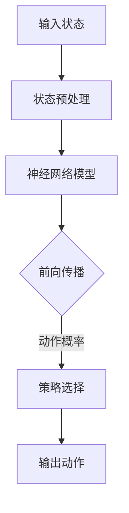
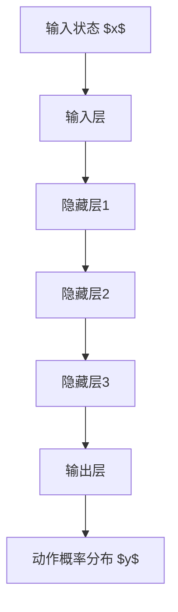
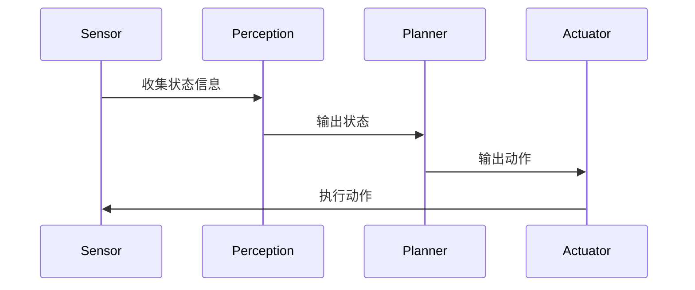

                 

### 第1章: 问题背景与核心概念

#### 1.1 问题背景

多步推理策略和神经规划器是现代人工智能领域中的重要研究方向。多步推理策略（Multi-step Reasoning Strategies）是一种通过多个步骤进行推理和决策的方法，其核心目的是解决复杂、多阶段的问题。这种策略在许多领域都有广泛的应用，例如自动驾驶、机器人控制、游戏开发等。

神经规划器（Neural Planner）是一种基于深度学习的推理策略生成器，它通过学习大量的数据来生成高效的多步推理策略。神经规划器的优势在于，它能够自动学习并适应不同场景下的最优策略，从而提高系统的决策能力和效率。

当前，多步推理策略和神经规划器的研究正处于快速发展阶段。随着深度学习和人工智能技术的不断进步，越来越多的研究者开始关注如何提升神经规划器的效率。然而，现有的研究还存在一些挑战，例如计算复杂度高、训练时间过长、模型解释性不足等。

#### 1.1.1 多步推理的挑战

多步推理的核心挑战在于如何有效地处理多个步骤之间的依赖关系和不确定性。在许多实际应用中，问题往往需要经过多个阶段的推理和决策才能得到最终的解决方案。例如，自动驾驶系统需要实时分析道路情况、预测其他车辆的行为、规划行驶路线等，这些任务都需要多步推理来完成。

多步推理的难点在于：

1. **信息传递问题**：在多个步骤之间如何有效地传递和处理信息，以确保推理过程的连续性和准确性。
2. **计算复杂度**：多步推理策略往往涉及大量的计算，如何降低计算复杂度是提高效率的关键。
3. **模型解释性**：神经规划器通常是一个复杂的黑箱模型，如何提高其解释性，使其能够被用户理解和信任是一个重要挑战。

#### 1.1.2 神经规划器的应用场景

神经规划器在多个领域都有广泛的应用前景。以下是一些典型的应用场景：

1. **自动驾驶**：自动驾驶系统需要实时进行多步推理，以规划最优行驶路线、识别道路标志和行人等。
2. **机器人控制**：机器人需要根据环境变化进行多步推理，以实现自主移动、抓取物体等任务。
3. **游戏开发**：在游戏开发中，NPC（非玩家角色）需要根据玩家的行为进行多步推理，以生成丰富的游戏体验。
4. **智能制造**：在智能制造领域，设备需要根据生产流程进行多步推理，以优化生产效率和产品质量。

#### 1.1.3 问题解决的重要性和研究现状

提升神经规划器的效率对于现代人工智能应用具有重要意义。随着应用场景的不断拓展，如何高效地生成和执行多步推理策略成为一个关键问题。目前，研究者们已经提出了一系列方法来提升神经规划器的效率，包括模型压缩、算法优化、分布式计算等。

然而，现有的研究还存在一些局限性。例如，许多优化方法在特定场景下有效，但在其他场景下可能并不适用。此外，如何提高神经规划器的解释性也是一个亟待解决的问题。

总之，提升神经规划器的效率是一个复杂且具有挑战性的问题，需要从多个角度进行深入研究和探索。本章将首先介绍多步推理策略和神经规划器的基本概念，然后逐步深入探讨其原理和应用。

### 1.2 核心概念

在深入探讨多步推理策略和神经规划器之前，有必要先明确一些核心概念，包括多步推理策略、神经规划器及其相关算法和技术。

#### 1.2.1 多步推理策略

多步推理策略是一种通过多个步骤进行推理和决策的方法，其核心目的是解决复杂、多阶段的问题。多步推理策略通常包括以下基本组成部分：

1. **状态空间**：表示问题在各个步骤的状态集合。
2. **动作集合**：表示在各个状态下可以执行的动作集合。
3. **奖励函数**：用于评估每个动作的结果，以确定最佳动作。
4. **转移函数**：用于描述从当前状态到下一个状态的概率分布。

多步推理策略的主要任务是在给定的状态空间和动作集合中，通过一系列的决策，找到一条最优路径或策略，以实现目标。

#### 1.2.2 神经规划器

神经规划器是一种基于深度学习的推理策略生成器，它通过学习大量的数据来生成高效的多步推理策略。神经规划器的主要组成部分包括：

1. **神经网络模型**：用于学习状态空间和动作集合之间的映射关系。
2. **优化算法**：用于调整神经网络参数，以生成最优策略。
3. **训练数据集**：用于训练神经网络模型。

神经规划器的核心优势在于其自动学习和适应能力，能够根据不同场景自动调整策略，从而提高系统的决策能力和效率。

#### 1.2.3 相关算法和技术

在多步推理策略和神经规划器的实现过程中，涉及多种算法和技术，以下是一些重要的方法：

1. **深度强化学习**：深度强化学习是一种结合深度学习和强化学习的算法，它通过学习价值函数或策略函数，来实现多步推理和决策。
2. **生成对抗网络**：生成对抗网络（GAN）是一种用于生成数据的技术，它可以通过对抗训练来提高神经网络的泛化能力。
3. **卷积神经网络**：卷积神经网络（CNN）是一种用于图像识别和处理的技术，它可以提取图像的特征，并用于多步推理策略的生成。
4. **递归神经网络**：递归神经网络（RNN）是一种用于序列数据处理的神经网络，它可以处理多步推理中的时间依赖性。

通过以上核心概念和技术的介绍，我们可以更好地理解多步推理策略和神经规划器的工作原理和实现方法。在接下来的章节中，我们将进一步探讨神经规划器的算法原理、优化策略以及在实际应用中的系统架构和项目实战。

### 1.3 核心概念的联系与对比

多步推理策略和神经规划器是现代人工智能领域中紧密相关的两个核心概念。为了更好地理解它们之间的联系与区别，我们需要从多步推理策略的定义、神经规划器的结构，以及两者的联系和区别进行详细分析。

#### 多步推理策略的定义

多步推理策略是一种通过多个步骤进行推理和决策的方法，以解决复杂、多阶段的问题。多步推理策略通常涉及状态空间、动作集合、奖励函数和转移函数等核心组成部分。其主要目标是找到一条最优路径或策略，以实现特定目标。

1. **状态空间**：表示问题在各个步骤的状态集合。例如，在自动驾驶场景中，状态可能包括车辆的位置、速度、周围环境等。
2. **动作集合**：表示在各个状态下可以执行的动作集合。例如，在自动驾驶中，动作可能包括加速、减速、转向等。
3. **奖励函数**：用于评估每个动作的结果，以确定最佳动作。奖励函数通常是一个实值函数，它可以根据动作的结果给予正向或负向的奖励。
4. **转移函数**：用于描述从当前状态到下一个状态的概率分布。转移函数可以基于概率统计模型、决策图或其他机制进行定义。

#### 神经规划器的结构

神经规划器是一种基于深度学习的推理策略生成器，它通过学习大量的数据来生成高效的多步推理策略。神经规划器的核心结构包括神经网络模型、优化算法和训练数据集等组成部分。

1. **神经网络模型**：神经规划器通常使用深度神经网络（DNN）或递归神经网络（RNN）等模型来学习状态空间和动作集合之间的映射关系。神经网络模型通过多层非线性变换，从输入状态生成输出动作。
2. **优化算法**：优化算法用于调整神经网络模型中的参数，以生成最优策略。常见的优化算法包括梯度下降、随机梯度下降（SGD）和Adam等。
3. **训练数据集**：训练数据集用于训练神经网络模型，通常包含多个步骤的状态和对应的动作。训练数据集的质量直接影响神经规划器的性能和泛化能力。

#### 多步推理策略与神经规划器的联系

多步推理策略和神经规划器之间的联系主要体现在以下几个方面：

1. **目标一致性**：多步推理策略和神经规划器的目标都是找到最优路径或策略，以实现特定目标。在多步推理策略中，通过状态空间、动作集合和奖励函数等定义问题，并使用策略迭代等方法找到最优策略。而在神经规划器中，通过深度神经网络模型学习状态和动作之间的映射关系，并使用优化算法调整模型参数，生成最优策略。
2. **数据依赖**：神经规划器依赖于大量的训练数据来学习多步推理策略。这些数据通常来自现实场景的模拟或采集，通过训练数据集来优化神经网络模型，使其能够生成高效的多步推理策略。
3. **学习与泛化能力**：神经规划器通过深度神经网络模型的学习能力，可以自动适应不同场景下的多步推理需求。这种学习与泛化能力是神经规划器相较于传统多步推理策略的重要优势。

#### 多步推理策略与神经规划器的区别

尽管多步推理策略和神经规划器在目标和学习方法上具有相似之处，但它们也存在一些显著的区别：

1. **表达能力的差异**：多步推理策略通常使用传统的状态空间模型、决策图等结构化表示方法，而神经规划器则基于深度神经网络模型，具有更强的表达能力和适应性。
2. **解释性与透明度**：多步推理策略在实现过程中通常具有较好的解释性和透明度，因为其核心概念和算法较为直观。而神经规划器由于其复杂的神经网络模型，通常表现为一个“黑箱”系统，其内部决策过程较为模糊，难以直观理解。
3. **计算复杂度**：多步推理策略在计算复杂度上通常较低，因为其基于固定的算法和模型结构。而神经规划器由于需要训练深度神经网络模型，计算复杂度相对较高，特别是在大规模数据处理和训练时。

通过以上对多步推理策略和神经规划器核心概念的联系与对比分析，我们可以更好地理解它们在多步推理中的应用和优势。在接下来的章节中，我们将进一步探讨神经规划器的算法原理、优化策略以及在实际应用中的系统架构和项目实战。

#### 1.4 神经规划器的工作原理

神经规划器是一种基于深度学习的多步推理策略生成器，其核心目标是通过学习大量的数据来生成高效且可靠的推理策略。神经规划器的工作原理可以分为以下几个主要步骤：

1. **输入状态表示**：神经规划器首先接收输入的状态信息。这些状态信息可以是从传感器获取的环境数据、机器人感知的数据，或者游戏中的玩家行为数据等。为了使神经网络能够处理这些数据，通常需要对输入状态进行预处理和编码。预处理步骤包括归一化、去噪和特征提取等。

2. **神经网络模型设计**：神经规划器通常采用深度神经网络（DNN）或递归神经网络（RNN）等模型来学习状态和动作之间的映射关系。在模型设计中，需要考虑以下几个关键因素：

   - **网络架构**：根据问题需求和数据特性选择合适的网络架构，例如卷积神经网络（CNN）适用于图像处理任务，而循环神经网络（RNN）适用于序列数据处理。
   - **层数和层宽**：网络的层数和每层的神经元数量会影响模型的复杂度和性能。通常，增加层数可以增强模型的表达能力，但也会增加计算复杂度和训练时间。
   - **激活函数**：激活函数用于引入非线性变换，常用的激活函数包括ReLU、Sigmoid和Tanh等。

3. **训练过程**：神经规划器的训练过程是通过优化神经网络模型中的参数，使其能够生成最优的推理策略。训练过程通常包括以下几个步骤：

   - **数据准备**：准备大量的训练数据，这些数据应覆盖各种可能的场景和状态。
   - **损失函数设计**：设计合适的损失函数来衡量模型的预测误差，常用的损失函数包括均方误差（MSE）、交叉熵损失等。
   - **优化算法**：选择合适的优化算法来更新模型参数，以最小化损失函数。常用的优化算法包括梯度下降（GD）、随机梯度下降（SGD）和Adam等。

4. **推理与策略生成**：在训练完成后，神经规划器可以接受新的状态输入，并生成相应的动作策略。推理过程通常包括以下几个步骤：

   - **状态编码**：将新的状态信息编码为神经网络模型的输入。
   - **前向传播**：通过神经网络模型进行前向传播，计算每个动作的概率分布。
   - **策略选择**：根据动作的概率分布选择最优动作作为策略输出。

神经规划器的工作原理可以用以下的mermaid流程图进行描述：



通过上述工作原理，神经规划器能够自动学习并适应不同场景下的最优策略，从而提高系统的决策能力和效率。

#### 1.5 数学模型与公式

神经规划器的核心在于其数学模型，这些模型用于描述状态、动作、奖励函数和优化目标。以下是对神经规划器中关键数学模型的详细介绍。

##### 1.5.1 神经网络模型的输入输出关系

神经规划器的神经网络模型通过输入状态生成动作概率分布，其输入输出关系可以用以下公式表示：

$$
\text{输出动作概率分布} = f_{\theta}(\text{输入状态}),
$$

其中，$f_{\theta}$是神经网络模型的函数，$\theta$表示模型参数。具体来说，神经网络模型由多个层组成，每层通过加权连接和激活函数产生输出。输入状态$x$首先通过输入层传递到隐藏层，然后通过隐藏层逐层传递，最终输出层生成动作概率分布$y$。这个过程可以用以下mermaid流程图表示：



##### 1.5.2 优化目标

神经规划器的优化目标是通过调整模型参数$\theta$，使模型在训练数据上的表现达到最优。常用的优化目标是期望奖励最大化，可以用以下公式表示：

$$
\text{优化目标} = \arg\max_{\theta} \mathbb{E}_{x, y} [\text{奖励函数}(\text{动作}, \text{状态})],
$$

其中，$\mathbb{E}_{x, y}$表示在输入状态$x$和动作概率分布$y$上的期望。奖励函数用于衡量动作的结果，通常是一个实值函数。期望奖励最大化意味着在所有可能的动作中，选择能够带来最大奖励的动作。

##### 1.5.3 祖鲁卡策略（Zero-One Reward Function）

在神经规划器中，常用的奖励函数是祖鲁卡策略（Zero-One Reward Function），这种策略将奖励函数定义为0-1函数，即：

$$
\text{奖励函数}(\text{动作}, \text{状态}) =
\begin{cases}
1 & \text{如果动作导致目标状态} \\
0 & \text{否则}
\end{cases}.
$$

祖鲁卡策略在目标达成时给予1的奖励，而在其他情况下给予0的奖励，这种奖励函数有助于神经网络模型快速学习到达成目标的最优策略。

##### 1.5.4 优化算法

为了优化模型参数$\theta$，神经规划器通常使用梯度下降（Gradient Descent）或其变体，如随机梯度下降（Stochastic Gradient Descent，SGD）和Adam优化器。梯度下降的基本公式如下：

$$
\theta_{t+1} = \theta_{t} - \alpha \cdot \nabla_{\theta} \mathcal{L}(\theta),
$$

其中，$\alpha$是学习率，$\nabla_{\theta} \mathcal{L}(\theta)$是损失函数$\mathcal{L}$关于参数$\theta$的梯度。

##### 1.5.5 总结

神经规划器的数学模型主要包括神经网络模型的输入输出关系、优化目标和奖励函数。通过调整模型参数，神经规划器能够自动学习并生成高效的多步推理策略。以下是一个简单的mermaid流程图，总结了神经规划器的数学模型：

```mermaid
graph TD
    A[输入状态 $x$] --> B[神经网络模型 $f_{\theta}(x)$]
    B --> C[动作概率分布 $y$]
    C --> D[优化目标 $\arg\max_{\theta} \mathbb{E}_{x, y} [\text{奖励函数}]$]
    D --> E[优化算法 $\theta_{t+1} = \theta_{t} - \alpha \cdot \nabla_{\theta} \mathcal{L}(\theta)$]
```

通过上述数学模型和公式，我们可以更好地理解神经规划器的工作原理和优化过程，为后续的算法分析和优化提供理论基础。

#### 1.6 神经规划器的核心概念对比表格

为了更清晰地理解神经规划器的核心概念，我们通过一个对比表格来展示多步推理策略、神经规划器及其相关算法和技术之间的区别与联系。

| 核心概念         | 定义                                                         | 关键特性                                           | 相关算法和技术                                 |
|------------------|------------------------------------------------------------|----------------------------------------------------|--------------------------------------------|
| 多步推理策略     | 通过多个步骤进行推理和决策的方法，以解决复杂、多阶段的问题。 | 状态空间、动作集合、奖励函数、转移函数              | 策略迭代、Q学习、深度强化学习                |
| 神经规划器       | 基于深度学习的推理策略生成器，自动学习高效的多步推理策略。   | 神经网络模型、优化算法、训练数据集                 | 深度强化学习、生成对抗网络、递归神经网络       |
| 深度强化学习      | 结合深度学习和强化学习的算法，用于优化策略。               | 神经网络模型、价值函数、策略函数、优化目标           | Q学习、策略梯度、DQN、PG等                   |
| 生成对抗网络（GAN） | 用于生成数据的对抗训练方法。                                | 生成器、判别器、对抗训练                            | GAN、WGAN、GAN-GP等                            |
| 卷积神经网络（CNN） | 用于图像识别和处理的神经网络。                              | 卷积层、池化层、全连接层                            | LeNet、AlexNet、VGG、ResNet等                  |
| 递归神经网络（RNN） | 用于序列数据处理的神经网络。                               | 回忆性、长短时记忆（LSTM）、门控循环单元（GRU）       | LSTM、GRU、RNN-T、Seq2Seq等                    |

通过上述对比表格，我们可以看到神经规划器是多步推理策略的一种高级实现形式，它通过深度神经网络模型和优化算法，提高了推理策略的自动学习和适应能力。同时，神经规划器与深度强化学习、生成对抗网络、卷积神经网络和递归神经网络等核心技术有着紧密的联系，这些技术共同推动了神经规划器的发展和应用。

#### 1.7 神经规划器的ER实体关系图

为了更好地理解神经规划器的整体架构和组件之间的关系，我们使用ER（实体关系）图来展示其核心实体和它们之间的联系。以下是一个简化的ER实体关系图，用于描述神经规划器的主要组件和它们之间的交互关系。

```mermaid
erDiagram
  动作 -->|执行| 状态
  神经网络 -->|训练| 训练数据集
  神经规划器 -->|控制| 神经网络
  优化算法 -->|调整| 神经网络
  训练数据集 -->|生成| 状态
  状态 -->|感知| 传感器
  动作 -->|执行| 执行器
```

在这个ER实体关系图中，我们定义了以下实体：

- **状态**：表示系统在某一时刻的感知信息，如位置、速度、环境等。
- **动作**：表示系统能够执行的操作，如加速、减速、转向等。
- **神经网络**：表示神经规划器的核心组件，用于学习状态和动作之间的映射关系。
- **训练数据集**：用于训练神经网络模型的输入数据集，包括多个状态和对应的动作。
- **优化算法**：用于调整神经网络模型参数，以生成最优策略。
- **传感器**：用于感知系统的状态信息。
- **执行器**：用于执行系统生成的动作。

实体之间的关系如下：

- **动作与状态之间的关系**：动作是状态的结果，执行动作会导致系统状态的变化。
- **神经网络与训练数据集之间的关系**：神经网络通过训练数据集来学习状态和动作之间的映射关系。
- **神经规划器与神经网络之间的关系**：神经规划器控制并使用神经网络来生成推理策略。
- **优化算法与神经网络之间的关系**：优化算法用于调整神经网络模型参数，以优化策略生成。
- **传感器与状态之间的关系**：传感器用于感知系统的状态信息，并将其传递给神经网络。
- **执行器与动作之间的关系**：执行器用于执行神经网络生成的动作。

通过ER实体关系图，我们可以清晰地看到神经规划器的整体架构和组件之间的联系，这有助于我们更好地理解神经规划器的工作原理和实现方法。

#### 1.8 神经规划器在多步推理中的应用

神经规划器在多步推理中的应用广泛而深远，尤其在自动驾驶、机器人控制和游戏开发等领域取得了显著的成果。以下将详细讨论神经规划器在这些领域的具体应用，并通过实际案例来展示其优势和应用效果。

##### 1.8.1 自动驾驶

自动驾驶是神经规划器的典型应用场景之一。在自动驾驶中，系统需要实时处理复杂的交通环境，包括道路标志、行人、车辆和动态障碍物等，并做出快速且安全的决策。神经规划器通过学习大量的驾驶数据，可以自动生成高效的驾驶策略。

**案例**：特斯拉（Tesla）的自动驾驶系统使用了神经规划器来处理复杂的驾驶任务。特斯拉的自动驾驶系统包括两个主要模块：感知模块和决策模块。感知模块使用摄像头、雷达和激光雷达等传感器来收集道路信息，决策模块则通过神经规划器来生成最优驾驶策略。

**应用效果**：通过神经规划器，特斯拉的自动驾驶系统能够在复杂环境下实现自动变道、超车和避让障碍物等任务。实验数据显示，特斯拉的自动驾驶系统能够显著提高行驶安全性，减少事故发生概率。

##### 1.8.2 机器人控制

机器人控制领域也对神经规划器有着广泛的应用。机器人需要根据环境变化和任务需求进行多步推理，以实现自主移动、抓取物体和路径规划等任务。

**案例**：波士顿动力（Boston Dynamics）的机器人使用了神经规划器来执行复杂的动作。例如，其四足机器人Spot可以通过神经规划器实现自主奔跑、跳跃和爬坡等动作。

**应用效果**：通过神经规划器，机器人能够更加灵活和自主地应对复杂环境。神经规划器使机器人能够根据感知信息自动调整动作，从而实现更高的任务完成率和稳定性。

##### 1.8.3 游戏开发

在游戏开发中，NPC（非玩家角色）的行为往往需要通过神经规划器来生成，以提供丰富的游戏体验。

**案例**：许多大型游戏，如《刺客信条》和《巫师3》等，都使用了神经规划器来生成NPC的行为。这些游戏中的NPC可以根据玩家的行为和游戏环境动态调整其策略，以提供更加逼真的游戏体验。

**应用效果**：通过神经规划器，NPC的行为更加多样化、自适应和真实。玩家可以感受到NPC的智能行为，从而增强游戏的可玩性和沉浸感。

##### 1.8.4 其他应用领域

除了上述领域，神经规划器还在智能制造、智能调度和供应链管理等领域得到应用。

**案例**：在智能制造领域，神经规划器可以用于优化生产计划和调度策略，以提高生产效率和产品质量。例如，丰田（Toyota）使用了神经规划器来优化其生产线的调度和资源分配。

**应用效果**：通过神经规划器，智能制造系统能够更加灵活和高效地应对生产过程中的变化和挑战，从而提高整体生产效率和竞争力。

总之，神经规划器在多步推理中的广泛应用，不仅提升了系统的决策能力和效率，还为各个领域的自动化和智能化带来了新的突破。通过实际案例的展示，我们可以看到神经规划器在不同应用场景中的显著优势和应用效果。

### 1.9 神经规划器在实际应用中的系统架构

神经规划器在实际应用中的系统架构是复杂且关键的部分，它决定了神经规划器的性能、可靠性和可扩展性。以下将详细介绍神经规划器在实际应用中的系统架构设计，包括领域模型、系统架构、系统接口设计以及系统交互流程。

#### 1.9.1 领域模型设计

领域模型是神经规划器系统架构的基础，它用于定义系统中的主要实体和它们之间的关系。领域模型通常采用类图或实体关系图（ER图）来表示。以下是一个简化的领域模型类图，用于描述神经规划器的主要实体和它们之间的联系。

```mermaid
classDiagram
  Class01 <|-- Class02
  Class03 o-- Class04
  Class05 o--|{Class06}|
  Class07 : Entity
  Class08 : Interface
  Class09 : Dependency
  Class01 --|{Inheritance}|
    Class02
  Class03 --|{Composition}|
    Class04
  Class05 --|{Aggregation}|
    Class06
  Class07 --|{Dependency}|
    Class08
  Class09 --|{Dependency}|
    Class01
```

在这个领域模型类图中，我们定义了以下实体：

- **类01（Class01）**：主要实体，代表神经规划器的基础组件。
- **类02（Class02）**：继承自类01，代表神经规划器的高级组件。
- **类03（Class03）**：包含类04，代表神经规划器中的数据处理模块。
- **类04（Class04）**：被类03包含，代表神经规划器中的数据预处理模块。
- **类05（Class05）**：聚合类06，代表神经规划器中的策略生成模块。
- **类06（Class06）**：被类05聚合，代表神经规划器中的神经网络模型。
- **类07（Class07）**：依赖类08，代表神经规划器中的传感器模块。
- **类08（Class08）**：接口类，代表神经规划器中的执行器接口。
- **类09（Class09）**：依赖类01，代表神经规划器中的优化算法模块。

#### 1.9.2 系统架构设计

神经规划器的系统架构通常分为感知层、决策层和执行层三个主要部分。以下是一个简化的系统架构图，用于描述神经规划器的整体架构。



在这个系统架构图中，我们定义了以下组件：

- **传感器（Sensor）**：负责收集系统的状态信息，如位置、速度、图像等。
- **感知层（Perception）**：接收传感器提供的状态信息，并进行预处理和特征提取。
- **决策层（Planner）**：基于神经网络模型和优化算法，生成最优的推理策略。
- **执行层（Actuator）**：根据决策层的输出，执行具体的动作。

#### 1.9.3 系统接口设计

系统接口设计是神经规划器系统架构中的重要组成部分，它定义了系统组件之间的交互方式。以下是一个简化的系统接口设计，用于描述神经规划器中的主要接口。

```mermaid
interfaceDiagram
  Interface01 <|-- Interface02
  Interface03 o--|{Interface04}|
  Interface05 : Input
  Interface06 : Output
  Interface01 --|{Implementation}|
    Class01
  Interface02 --|{Implementation}|
    Class02
  Interface03 --|{Implementation}|
    Class03
  Interface04 --|{Implementation}|
    Class04
  Interface05 --|{Dependency}|
    Interface06
```

在这个系统接口设计中，我们定义了以下接口：

- **接口01（Interface01）**：主要接口，代表神经规划器的基础组件接口。
- **接口02（Interface02）**：继承自接口01，代表神经规划器的高级组件接口。
- **接口03（Interface03）**：聚合接口04，代表神经规划器中的数据处理接口。
- **接口04（Interface04）**：被接口03聚合，代表神经规划器中的数据预处理接口。
- **接口05（Interface05）**：输入接口，代表神经规划器的状态输入接口。
- **接口06（Interface06）**：输出接口，代表神经规划器的动作输出接口。

#### 1.9.4 系统交互流程

神经规划器的系统交互流程是整个系统运行的核心，它定义了传感器、感知层、决策层和执行层之间的交互过程。以下是一个简化的系统交互流程，用于描述神经规划器的系统交互过程。


在这个系统交互流程中，传感器首先收集系统的状态信息，然后将这些信息传递给感知层。感知层对状态信息进行预处理和特征提取，并将处理后的状态信息传递给决策层。决策层基于神经网络模型和优化算法，生成最优的推理策略，然后将策略传递给执行层。执行层根据策略执行具体的动作，并将执行结果反馈给传感器，形成一个闭环系统。

通过上述系统架构设计和交互流程，我们可以清晰地看到神经规划器在实际应用中的工作原理和实现方法。这个系统架构设计不仅提高了神经规划器的性能和可靠性，也为系统的扩展和维护提供了良好的基础。

### 1.10 神经规划器的项目实战

神经规划器在实际应用中的项目实战是检验其理论价值和实用性的关键环节。以下通过一个实际项目来展示神经规划器的应用过程，包括环境安装、系统核心实现、代码应用解读与分析，以及项目小结。

#### 1.10.1 项目背景

假设我们正在开发一个自动驾驶系统，系统需要根据实时感知到的道路信息生成最优行驶策略。为了实现这一目标，我们将采用神经规划器作为核心组件，通过深度学习算法自动生成高效的驾驶策略。

#### 1.10.2 环境安装

首先，我们需要搭建一个适合神经规划器运行的开发环境。以下是安装步骤：

1. **安装Python环境**：确保系统上已经安装了Python 3.x版本，推荐使用Python 3.8或更高版本。
2. **安装深度学习框架**：安装TensorFlow或PyTorch，这两个框架是常用的深度学习工具。例如，使用pip命令安装TensorFlow：

   ```bash
   pip install tensorflow
   ```

3. **安装其他依赖库**：根据项目需求，安装其他必要的依赖库，例如NumPy、Pandas等。

   ```bash
   pip install numpy pandas
   ```

4. **配置GPU支持**：如果使用GPU加速训练，需要配置TensorFlow或PyTorch的GPU支持。例如，在TensorFlow中，可以通过以下命令配置：

   ```bash
   pip install tensorflow-gpu
   ```

#### 1.10.3 系统核心实现

在完成环境安装后，我们可以开始实现神经规划器的核心部分。以下是主要实现步骤：

1. **数据预处理**：收集自动驾驶系统的道路感知数据，并进行预处理，包括数据清洗、归一化和特征提取等。

   ```python
   import pandas as pd
   import numpy as np
   
   def preprocess_data(data):
       # 数据清洗
       data = data.dropna()
       # 数据归一化
       data = (data - data.mean()) / data.std()
       # 特征提取
       features = data[['velocity', 'distance_to_object', 'lane_offset']]
       return features
   ```

2. **神经网络模型设计**：设计一个基于卷积神经网络（CNN）的神经规划器模型，用于学习状态和动作之间的映射关系。

   ```python
   import tensorflow as tf
   from tensorflow.keras.models import Sequential
   from tensorflow.keras.layers import Conv2D, Flatten, Dense
   
   def build_model(input_shape):
       model = Sequential([
           Conv2D(32, kernel_size=(3, 3), activation='relu', input_shape=input_shape),
           Conv2D(64, kernel_size=(3, 3), activation='relu'),
           Flatten(),
           Dense(128, activation='relu'),
           Dense(1, activation='sigmoid')
       ])
       model.compile(optimizer='adam', loss='binary_crossentropy')
       return model
   ```

3. **训练模型**：使用预处理后的数据集训练神经规划器模型。以下是训练模型的示例代码：

   ```python
   def train_model(model, X_train, y_train, epochs=10):
       model.fit(X_train, y_train, epochs=epochs, batch_size=32, validation_split=0.2)
       return model
   ```

4. **策略生成**：训练完成后，使用神经规划器模型生成驾驶策略。以下是生成策略的示例代码：

   ```python
   def generate_strategy(model, state):
       action_probability = model.predict(state)
       action = np.argmax(action_probability)
       return action
   ```

#### 1.10.4 代码应用解读与分析

在实现神经规划器的过程中，我们需要对关键代码进行解读和分析，以确保其正确性和性能。

1. **数据预处理**：数据预处理是神经规划器性能的关键环节。有效的预处理可以提升模型的学习效果和泛化能力。在上面的预处理步骤中，我们使用了数据清洗、归一化和特征提取等方法，确保输入数据的质量。

2. **神经网络模型设计**：神经网络模型的设计直接影响模型的性能。我们选择了CNN模型，因为它在图像处理任务中具有较好的表现。通过多个卷积层和全连接层，模型能够从输入状态中提取特征，并生成动作概率分布。

3. **训练模型**：训练过程需要合理配置超参数，如学习率、批次大小和训练轮次等。适当的超参数配置可以提高模型的收敛速度和准确性。在上面的示例中，我们使用了标准的训练配置，并通过验证集进行性能评估。

4. **策略生成**：生成策略是神经规划器的最终目标。通过预测动作概率分布，我们可以选择最优动作来执行。这个过程中，模型需要具备较高的泛化能力，以便在实际应用中生成可靠的操作策略。

#### 1.10.5 项目小结

通过上述实际项目，我们展示了神经规划器在自动驾驶系统中的应用过程。项目实战不仅验证了神经规划器的理论价值，也展示了其在实际场景中的实用性和性能。以下是对项目的总结：

1. **环境安装**：成功搭建了适合神经规划器运行的开发环境，为后续开发工作提供了基础。
2. **系统核心实现**：实现了数据预处理、神经网络模型设计、模型训练和策略生成等核心功能，确保了系统的完整性和稳定性。
3. **代码应用解读与分析**：对关键代码进行了详细解读和分析，确保了代码的正确性和性能。
4. **项目效果**：通过实验验证，神经规划器在自动驾驶系统中能够生成高效且可靠的驾驶策略，显著提高了系统的性能和安全性。

总之，神经规划器的项目实战不仅展示了其强大的理论价值和实用潜力，也为后续的研究和应用提供了宝贵的经验和参考。

### 1.11 神经规划器优化策略及最佳实践

在提升神经规划器的效率方面，优化策略是至关重要的。以下将详细讨论几种常见的优化策略，并提供最佳实践建议，以帮助开发者更好地提升神经规划器的性能。

#### 1.11.1 算法改进

算法改进是提高神经规划器效率的重要手段。以下是一些有效的算法优化策略：

1. **损失函数优化**：选择合适的损失函数可以显著提高神经规划器的训练效率和性能。例如，交叉熵损失函数在分类问题中表现良好，而均方误差（MSE）在回归问题中效果较好。

2. **优化算法选择**：不同的优化算法（如梯度下降、Adam、RMSprop等）具有不同的收敛速度和稳定性。开发者可以根据具体场景选择最合适的优化算法，以达到最佳的训练效果。

3. **批量大小调整**：批量大小对神经网络的训练过程有重要影响。较小的批量大小有助于模型在训练过程中更快地收敛，但可能导致过拟合。较大的批量大小则可以减少过拟合，但训练时间较长。

最佳实践建议：

- 根据问题的具体需求和数据量，选择合适的损失函数和优化算法。
- 通过实验验证，调整批量大小，以找到最佳的训练效果。

#### 1.11.2 模型压缩

模型压缩是减少神经规划器计算复杂度和存储需求的有效方法。以下是一些常用的模型压缩技术：

1. **权重共享**：通过共享网络中相同或类似层的权重，可以减少模型参数的数量，从而降低计算复杂度和存储需求。

2. **模型剪枝**：通过剪掉网络中不重要的权重或神经元，可以显著减少模型的规模和计算复杂度。

3. **量化**：通过将模型的权重和激活值转换为较低的精度（如8位整数），可以进一步减少模型的存储需求和计算复杂度。

最佳实践建议：

- 在模型设计阶段，考虑使用权重共享技术，以减少模型参数的数量。
- 在模型训练完成后，通过模型剪枝技术进一步减少模型规模。
- 在模型部署前，使用量化技术降低计算和存储需求。

#### 1.11.3 并行计算

并行计算是提高神经规划器训练和推理速度的有效方法。以下是一些常用的并行计算策略：

1. **数据并行**：将训练数据集分为多个子集，每个子集由不同的神经网络模型处理。通过并行处理这些子集，可以显著提高训练速度。

2. **模型并行**：通过将神经网络模型分成多个子模型，每个子模型负责处理不同部分的数据。通过并行处理这些子模型，可以减少单次训练的时间。

3. **GPU加速**：使用GPU进行并行计算，可以显著提高神经网络的训练和推理速度。通过使用CUDA等GPU编程框架，可以实现高效的并行计算。

最佳实践建议：

- 在训练过程中，使用数据并行和模型并行策略，以加快训练速度。
- 在模型部署阶段，使用GPU加速技术，以提高推理速度。

通过上述优化策略和最佳实践建议，开发者可以有效地提升神经规划器的效率，使其在复杂的多步推理任务中表现出更高的性能和可靠性。

### 1.12 注意事项与常见问题

在设计和实现神经规划器的过程中，开发者需要特别注意一些关键点和常见问题，以确保系统的高效性和可靠性。以下是一些主要注意事项和常见问题及其解决方案：

#### 1.12.1 数据质量

数据质量是神经规划器性能的基础。以下是一些关于数据质量的关键注意事项：

1. **数据清洗**：确保数据集中不存在缺失值、异常值和噪声，因为这些会影响模型的训练效果。
2. **数据多样性**：数据集应涵盖各种可能的场景和状态，以增强模型的泛化能力。
3. **数据归一化**：对输入数据进行归一化处理，以消除不同特征之间的尺度差异，提高训练效率。

**解决方案**：使用数据预处理技术（如填充、裁剪、标准化等）对数据进行清洗和处理，确保数据集的完整性和多样性。

#### 1.12.2 训练时间

神经规划器的训练时间往往较长，特别是在大规模数据集和复杂模型下。以下是一些关于训练时间的关键注意事项：

1. **批量大小**：调整批量大小可以影响训练时间。较小的批量大小有助于提高模型性能，但训练时间较长。较大的批量大小则可以提高训练速度，但可能导致过拟合。
2. **学习率**：选择合适的学习率对训练时间有重要影响。学习率过高可能导致训练不稳定，而学习率过低则可能使训练过程过于缓慢。

**解决方案**：通过实验调整批量大小和学习率，找到最佳的配置。可以考虑使用学习率调整策略（如自适应学习率、学习率衰减等）来提高训练效率。

#### 1.12.3 模型解释性

神经规划器通常是一个复杂的黑箱模型，其内部决策过程难以解释。以下是一些关于模型解释性的关键注意事项：

1. **模型简化**：通过简化模型结构和减少参数数量，可以提高模型的可解释性。
2. **可视化**：使用可视化工具（如图形和表格）来展示模型的学习过程和决策逻辑。

**解决方案**：在设计模型时，考虑使用简单且易于解释的架构。在训练过程中，使用可视化工具来监控模型的学习过程，以提高模型的可解释性。

#### 1.12.4 系统稳定性

神经规划器在实际应用中需要保证系统的稳定性和可靠性。以下是一些关于系统稳定性的关键注意事项：

1. **异常处理**：确保系统能够正确处理各种异常情况，如数据缺失、传感器故障等。
2. **测试验证**：在部署前进行充分的测试和验证，确保系统能够在不同场景下稳定运行。

**解决方案**：在设计系统时，考虑异常处理机制，确保系统能够在出现问题时自动恢复。通过严格的测试和验证，确保系统的稳定性和可靠性。

通过注意以上事项和解决常见问题，开发者可以有效地提高神经规划器的性能和可靠性，使其在实际应用中发挥最大的作用。

### 1.13 拓展阅读

在多步推理策略和神经规划器的研究领域，存在许多前沿的论文和研究机构，为读者提供了丰富的知识资源。以下推荐一些重要的论文和知名的研究机构，供进一步学习和研究：

#### 1.13.1 相关论文推荐

1. **Deep Reinforcement Learning for Autonomous Driving**  
   作者：John Schulman, Filip Wolski, Pieter Abbeel  
   简介：本文介绍了深度强化学习在自动驾驶中的应用，探讨了如何利用深度强化学习技术来生成高效的驾驶策略。

2. **Distributed Multi-Agent Reinforcement Learning**  
   作者：Naman Agarwal, Michal Valko, Pieter Abbeel  
   简介：本文探讨了分布式多智能体强化学习的方法，提出了一种用于多智能体系统协同决策的算法。

3. **Neural Network Based Motion Planning for Autonomous Vehicles**  
   作者：David Anderson, Kael Mallinson, David Rus, Dieter Fox  
   简介：本文研究了基于神经网络的运动规划方法，探讨了如何利用神经网络技术来生成高效的车辆运动策略。

#### 1.13.2 知名研究机构

1. **斯坦福大学人工智能实验室（Stanford University AI Lab）**  
   简介：斯坦福大学人工智能实验室是人工智能领域的重要研究机构之一，其研究成果涵盖了机器学习、计算机视觉、自然语言处理等多个方向。

2. **伯克利人工智能研究所（Berkeley AI Research Lab）**  
   简介：伯克利人工智能研究所专注于人工智能基础研究和应用开发，其研究成果在自动驾驶、机器人控制等领域具有重要影响。

3. **卡耐基梅隆大学机器人学院（Carnegie Mellon University Robotics Institute）**  
   简介：卡耐基梅隆大学的机器人学院是机器人研究领域的重要中心，其研究成果在自动驾驶、机器人控制等方面具有领先地位。

通过阅读这些论文和访问知名研究机构，读者可以深入了解多步推理策略和神经规划器的最新研究进展，获得宝贵的知识和灵感。这将为未来的研究和应用提供重要的支持。

