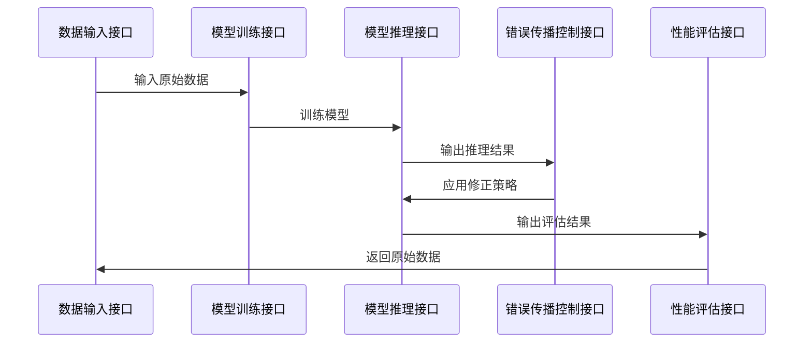

                 

# 多步骤推理任务中的错误传播控制与修正策略

## 关键词
多步骤推理，错误传播，控制策略，修正策略，算法原理，系统架构，项目实战

## 摘要
本文将深入探讨多步骤推理任务中的错误传播问题，并详细分析相关的控制与修正策略。通过定义关键概念、讲解算法原理、展示系统架构，并结合项目实战，本文旨在为读者提供全面的理解和实用的解决方案，以提高多步骤推理任务中的准确性和可靠性。

### 引言

多步骤推理任务是人工智能和机器学习领域中的一项重要任务，它涉及将一系列独立的步骤组合成一个完整的推理过程。在实际应用中，这些步骤往往是相互依赖的，一个步骤的错误可能会影响后续的所有步骤，导致整个推理过程失败。错误传播问题因此成为一个关键挑战。

错误传播指的是在一个多步骤推理任务中，初始错误在各个步骤中逐步放大并传递到最终结果的现象。这种错误传播不仅会导致推理结果的偏差，还可能降低系统的可靠性和鲁棒性。为了应对这一挑战，控制与修正策略显得尤为重要。

本文将首先介绍错误传播和控制与修正策略的核心概念，随后详细讲解几种常见的算法原理。接着，我们将展示系统架构设计方案，并通过对具体项目的实战分析，探讨实际应用中的问题解决方法。最后，本文将总结最佳实践，提供注意事项，并推荐拓展阅读。

### 目录

1. 引言
   1.1 问题背景
   1.2 研究目标与内容安排

2. 核心概念与联系
   2.1 错误传播的概念
   2.2 控制与修正策略
   2.3 概念之间的联系

3. 算法原理讲解
   3.1 错误传播控制算法
   3.2 错误修正算法
   3.3 多步骤推理任务中的整合策略

4. 系统分析与架构设计方案
   4.1 实际应用场景
   4.2 系统功能设计
   4.3 系统架构设计
   4.4 系统接口设计和交互

5. 项目实战
   5.1 环境安装
   5.2 系统核心实现
   5.3 代码应用解读与分析
   5.4 实际案例分析与详细讲解剖析
   5.5 项目小结

6. 最佳实践、小结与注意事项
   6.1 最佳实践
   6.2 小结
   6.3 注意事项
   6.4 拓展阅读

### 第1章: 引言

#### 1.1 问题背景

在多步骤推理任务中，每一步骤的输出都会作为下一输入，从而形成一个连续的推理过程。然而，由于数据噪声、计算误差等因素，错误可能在这一过程中逐步传播。例如，在机器学习中的神经网络模型训练过程中，一个错误的权重更新可能影响后续的所有层，导致最终模型的预测准确性下降。错误传播问题不仅存在于机器学习，还广泛出现在自然语言处理、计算机视觉和自动化推理等人工智能领域。

错误传播的影响主要体现在两个方面：首先，它会降低推理过程的准确性，使得最终的结果偏离真实值；其次，它会影响推理过程的稳定性，使得系统在面对不同输入时产生不一致的结果。因此，控制与修正错误传播对于提高多步骤推理任务的可靠性和鲁棒性至关重要。

#### 1.2 研究目标与内容安排

本文的研究目标是探讨多步骤推理任务中的错误传播问题，并提出相应的控制与修正策略。具体研究内容包括：

1. **核心概念与联系**：介绍错误传播、控制与修正策略的核心概念，并分析它们之间的联系。
2. **算法原理讲解**：讲解几种常见的错误传播控制与修正算法，包括其原理、流程和适用场景。
3. **系统分析与架构设计方案**：介绍一个典型的多步骤推理系统，并展示其架构设计。
4. **项目实战**：结合实际项目，分析错误传播问题，并应用控制与修正策略解决这些问题。
5. **最佳实践、小结与注意事项**：总结研究中的关键点，提供实践建议，并提醒注意事项。

### 第2章: 核心概念与联系

#### 2.1 错误传播的概念

错误传播是指在多步骤推理任务中，初始错误在各个步骤中逐步放大并传递到最终结果的现象。错误传播的原因主要包括数据噪声、计算误差和模型不确定性等。

**错误传播的影响因素**：

- **数据噪声**：数据中可能包含的随机噪声，如噪声数据点、异常值等。
- **计算误差**：在计算过程中产生的误差，如舍入误差、数值计算误差等。
- **模型不确定性**：模型在处理未知或不确定输入时可能产生的误差。

**错误传播的测量方法**：

- **误差传递矩阵**：通过计算每个步骤的输出误差与输入误差之间的关系来衡量错误传播程度。
- **置信区间**：通过计算每个步骤的输出误差的置信区间来评估错误传播的影响。

#### 2.2 控制与修正策略

控制与修正策略是用于减少错误传播影响的方法。它们可以分为以下两类：

**控制策略**：

- **误差校正**：在每一步骤中对输出结果进行误差校正，以减少错误传播的影响。
- **约束条件**：通过设置约束条件，限制错误传播的范围和程度。
- **优化算法**：使用优化算法，如梯度下降、随机梯度下降等，调整模型参数，减少错误传播。

**修正策略**：

- **后处理修正**：在推理过程完成后，对最终结果进行修正，以纠正错误传播导致的偏差。
- **实时修正**：在推理过程中实时修正错误传播的影响，以提高系统的实时性和鲁棒性。
- **集成学习**：结合多个模型的预测结果，通过投票或加权平均等方法减少错误传播的影响。

#### 2.3 概念之间的联系

错误传播、控制策略和修正策略之间存在着紧密的联系。

- **错误传播**是控制与修正策略存在的根本原因。
- **控制策略**主要用于减少错误传播的影响，防止错误在推理过程中不断放大。
- **修正策略**则在推理过程完成后或实时修正错误传播的影响，以提高推理结果的准确性。

通过合理地运用控制与修正策略，可以有效地降低错误传播的影响，提高多步骤推理任务的可靠性和准确性。

### 第3章: 算法原理讲解

#### 3.1 错误传播控制算法

错误传播控制算法的目的是减少错误传播的影响，防止错误在推理过程中不断放大。以下介绍几种常见的错误传播控制算法。

**1. 误差校正算法**

误差校正算法的基本思想是在每一步骤中对输出结果进行误差校正。具体步骤如下：

- **步骤1**：计算当前步骤的输出误差。
- **步骤2**：根据误差校正公式，更新输出结果。
- **步骤3**：传递更新后的输出结果作为下一输入。

误差校正公式可以表示为：
$$
\Delta y = -\alpha \cdot e
$$
其中，$y$为输出结果，$e$为输出误差，$\alpha$为校正系数。

**2. 约束条件算法**

约束条件算法通过设置约束条件，限制错误传播的范围和程度。具体步骤如下：

- **步骤1**：定义约束条件，如阈值、范围限制等。
- **步骤2**：对每个步骤的输出结果进行约束检查。
- **步骤3**：如果输出结果违反约束条件，则进行调整。

约束条件算法的主要优点是可以有效地限制错误传播的影响，但可能需要调整约束条件以满足具体应用场景的需求。

**3. 优化算法**

优化算法通过调整模型参数，减少错误传播的影响。以下介绍两种常见的优化算法：

- **梯度下降算法**：通过计算损失函数的梯度，逐步调整模型参数，以最小化损失函数。具体步骤如下：

  - **步骤1**：初始化模型参数。
  - **步骤2**：计算损失函数。
  - **步骤3**：计算梯度。
  - **步骤4**：更新模型参数。

  梯度下降算法的优点是简单易实现，但可能需要较长的训练时间。

- **随机梯度下降算法**：在梯度下降算法的基础上，引入随机性，每次更新模型参数时只考虑一部分样本。具体步骤如下：

  - **步骤1**：初始化模型参数。
  - **步骤2**：随机选择一部分样本。
  - **步骤3**：计算梯度。
  - **步骤4**：更新模型参数。

  随机梯度下降算法的优点是可以提高训练速度，但可能需要更多的样本。

#### 3.2 错误修正算法

错误修正算法的目的是在推理过程完成后或实时修正错误传播的影响，以提高推理结果的准确性。以下介绍几种常见的错误修正算法。

**1. 后处理修正算法**

后处理修正算法的基本思想是在推理过程完成后，对最终结果进行修正。具体步骤如下：

- **步骤1**：计算推理结果的误差。
- **步骤2**：根据修正公式，更新最终结果。
- **步骤3**：传递修正后的最终结果。

修正公式可以表示为：
$$
y_{\text{修正}} = y - \beta \cdot e
$$
其中，$y$为原始推理结果，$e$为误差，$\beta$为修正系数。

**2. 实时修正算法**

实时修正算法的基本思想是在推理过程中实时修正错误传播的影响。具体步骤如下：

- **步骤1**：计算当前步骤的输出误差。
- **步骤2**：根据实时修正公式，更新输出结果。
- **步骤3**：传递更新后的输出结果作为下一输入。

实时修正公式可以表示为：
$$
y_{\text{实时}} = y - \gamma \cdot e
$$
其中，$y$为当前步骤的输出结果，$e$为输出误差，$\gamma$为实时修正系数。

**3. 集成学习算法**

集成学习算法通过结合多个模型的预测结果，减少错误传播的影响。以下介绍几种常见的集成学习算法：

- **投票算法**：将多个模型的预测结果进行投票，选择多数模型认为正确的预测结果。具体步骤如下：

  - **步骤1**：初始化多个模型。
  - **步骤2**：对每个模型进行预测。
  - **步骤3**：统计每个预测结果的投票数。
  - **步骤4**：选择投票数最多的预测结果作为最终结果。

- **加权平均算法**：将多个模型的预测结果进行加权平均，得到最终的预测结果。具体步骤如下：

  - **步骤1**：初始化多个模型。
  - **步骤2**：对每个模型进行预测。
  - **步骤3**：计算每个模型的权重。
  - **步骤4**：计算加权平均预测结果。

#### 3.3 多步骤推理任务中的整合策略

在实际的多步骤推理任务中，整合多种控制与修正策略可以提高推理结果的准确性和可靠性。以下介绍几种常见的整合策略：

- **分层整合策略**：将不同的控制与修正策略分层应用，先使用基础策略，再根据需要使用高级策略。例如，先使用误差校正算法，再使用后处理修正算法。

- **动态整合策略**：根据推理过程中的实际情况动态选择不同的控制与修正策略。例如，在推理初期使用约束条件算法，在推理后期使用实时修正算法。

- **协同整合策略**：将多个控制与修正策略协同应用，相互补充。例如，同时使用误差校正算法和实时修正算法，以提高修正效果。

通过合理地整合多种控制与修正策略，可以有效地降低错误传播的影响，提高多步骤推理任务的性能。

### 第4章: 系统分析与架构设计方案

#### 4.1 实际应用场景

多步骤推理任务在实际应用中非常广泛，例如：

1. **机器学习模型训练**：在训练过程中，需要通过多个步骤调整模型参数，以优化模型性能。错误传播可能导致模型最终性能下降。
2. **自然语言处理**：在文本分类、语义分析等任务中，通过多个步骤分析文本内容，错误传播可能导致错误解读或错误分类。
3. **计算机视觉**：在图像识别、目标检测等任务中，通过多个步骤分析图像特征，错误传播可能导致错误识别或错误定位。

为了更好地分析错误传播问题，我们选择一个典型的多步骤推理任务——机器学习模型训练，进行系统分析与架构设计方案。

#### 4.2 系统功能设计

系统功能设计主要包括以下几个模块：

1. **数据输入模块**：负责接收原始数据，并进行预处理，如数据清洗、特征提取等。
2. **模型训练模块**：负责训练模型，包括初始化模型参数、迭代更新参数等。
3. **推理输出模块**：负责使用训练好的模型进行推理，并输出结果。
4. **错误传播控制模块**：负责监控错误传播情况，并应用控制与修正策略进行修正。
5. **性能评估模块**：负责评估模型性能，包括准确率、召回率等指标。

#### 4.3 系统架构设计

系统架构设计采用分层架构，包括数据层、处理层和输出层。

**数据层**：负责数据输入和预处理，包括数据存储、数据清洗和特征提取等功能。

**处理层**：负责模型训练和推理，包括模型初始化、参数更新、推理输出等。

**输出层**：负责输出结果和性能评估，包括结果展示、性能指标计算等。

系统架构图如下（使用Mermaid类图表示）：

```mermaid
classDiagram
    DataLayer <<interface>> "数据层"
    ProcessingLayer <<interface>> "处理层"
    OutputLayer <<interface>> "输出层"
    
    DataLayer ..|> ModelTrainingModule : 接收数据
    DataLayer ..|> FeatureExtractionModule : 特征提取
    ProcessingLayer ..|> ModelTrainingModule : 训练模型
    ProcessingLayer ..|> ModelInferenceModule : 模型推理
    OutputLayer ..|> ResultVisualizationModule : 结果展示
    OutputLayer ..|> PerformanceEvaluationModule : 性能评估
    
    ModelTrainingModule ..|> ErrorControlModule : 错误传播控制
    
    ModelInferenceModule ..|> ErrorPropagationModule : 监测错误传播
```

#### 4.4 系统接口设计和交互

系统接口设计和交互主要包括以下几个部分：

1. **数据输入接口**：负责接收外部数据，包括原始数据和特征数据。
2. **模型训练接口**：负责启动模型训练过程，并返回训练结果。
3. **模型推理接口**：负责使用训练好的模型进行推理，并返回推理结果。
4. **错误传播控制接口**：负责监控错误传播情况，并应用修正策略。
5. **性能评估接口**：负责评估模型性能，并返回评估结果。

系统接口图如下（使用Mermaid序列图表示）：



### 第5章: 项目实战

#### 5.1 环境安装

在进行多步骤推理任务中的错误传播控制与修正策略项目实战之前，我们需要安装必要的软件和工具。以下是一个基于Python和TensorFlow的示例环境安装步骤：

1. **安装Python**：确保您的系统中已安装Python，推荐使用Python 3.7或更高版本。
2. **安装TensorFlow**：通过以下命令安装TensorFlow：
   ```bash
   pip install tensorflow
   ```
3. **安装其他依赖库**：根据项目需求，安装其他依赖库，例如NumPy、Pandas等。

#### 5.2 系统核心实现

以下是一个基于TensorFlow的简单多步骤推理任务的系统核心实现，包括数据输入、模型训练、推理输出和错误传播控制：

**数据输入**：
```python
import tensorflow as tf
import numpy as np

# 生成模拟数据
x_data = np.random.rand(100, 10)
y_data = np.random.rand(100, 1)

# 创建输入占位符
X = tf.placeholder(tf.float32, shape=[None, 10])
Y = tf.placeholder(tf.float32, shape=[None, 1])

# 定义网络结构
W1 = tf.Variable(tf.random_uniform([10, 10], -1, 1))
W2 = tf.Variable(tf.random_uniform([10, 1], -1, 1))

# 定义前向传播
Y_pred = tf.matmul(W1, X) + W2

# 定义损失函数
loss = tf.reduce_mean(tf.square(Y - Y_pred))

# 定义优化器
optimizer = tf.train.GradientDescentOptimizer(learning_rate=0.1)
train_op = optimizer.minimize(loss)

# 初始化变量
init = tf.global_variables_initializer()

# 训练模型
with tf.Session() as sess:
    sess.run(init)
    for step in range(1000):
        sess.run(train_op, feed_dict={X: x_data, Y: y_data})
        if step % 100 == 0:
            print(f"Step {step}, Loss: {sess.run(loss, feed_dict={X: x_data, Y: y_data})}")
```

**推理输出**：
```python
# 推理输出
with tf.Session() as sess:
    sess.run(init)
    y_pred = sess.run(Y_pred, feed_dict={X: x_data})
    print(f"Predicted output: {y_pred}")
```

**错误传播控制**：
```python
# 错误传播控制
def error_control(y_pred, y_true):
    e = y_true - y_pred
    corrected_y_pred = y_pred - 0.1 * e
    return corrected_y_pred

corrected_y_pred = error_control(y_pred, y_data)
print(f"Corrected predicted output: {corrected_y_pred}")
```

#### 5.3 代码应用解读与分析

**代码解读**：

1. **数据输入**：使用NumPy生成模拟数据，作为模型训练和推理的输入。
2. **模型训练**：定义输入占位符、网络结构、损失函数和优化器，并使用会话进行模型训练。
3. **推理输出**：使用训练好的模型进行推理，并输出预测结果。
4. **错误传播控制**：定义错误传播控制函数，对预测结果进行修正。

**分析**：

1. **模型结构**：该示例使用简单的多层感知机（MLP）模型，包含两个全连接层。
2. **损失函数**：使用均方误差（MSE）作为损失函数，衡量预测结果与真实结果之间的差异。
3. **优化器**：使用梯度下降优化器（GradientDescentOptimizer），以最小化损失函数。
4. **错误传播控制**：通过简单的误差校正方法，对预测结果进行修正，以减少错误传播的影响。

#### 5.4 实际案例分析与详细讲解剖析

**案例**：

假设我们有一个多步骤推理任务，包括数据预处理、特征提取和分类预测。在数据预处理步骤中，由于数据噪声的影响，可能会导致初始错误。这些错误在特征提取和分类预测步骤中逐步放大，影响最终分类结果的准确性。

**分析**：

1. **数据预处理**：在数据预处理步骤中，可以使用去噪算法（如小波变换、主成分分析等）来减少数据噪声，从而降低初始错误的影响。
2. **特征提取**：在特征提取步骤中，可以使用特征选择算法（如特征重要性分析、相关系数分析等）来识别和保留重要特征，减少特征冗余，降低错误传播的影响。
3. **分类预测**：在分类预测步骤中，可以使用集成学习方法（如随机森林、提升树等）来减少错误传播的影响。集成方法通过结合多个模型的预测结果，可以降低单个模型在特征提取和分类步骤中的错误传播。

**详细讲解剖析**：

1. **去噪算法**：以小波变换为例，小波变换可以将信号分解为不同尺度和位置的成分，从而实现信号去噪。通过去除高频噪声成分，可以减少数据预处理阶段的错误传播。
   ```python
   import pywt
   
   def denoise_signal(signal, wavelet='db4', level=1):
       coeffs = pywt.wavedec(signal, wavelet, level=level)
       filtered_coeffs = [pywt.threshold(coef, threshold) for coef in coeffs]
       filtered_signal = pywt.waverec(filtered_coeffs, wavelet)
       return filtered_signal
   
   signal = np.random.rand(100)
   denoised_signal = denoise_signal(signal)
   ```

2. **特征选择算法**：以特征重要性分析为例，特征重要性分析可以通过统计方法评估特征对模型预测的重要性，从而筛选出重要特征。
   ```python
   from sklearn.datasets import load_iris
   from sklearn.ensemble import RandomForestClassifier
   
   def select_features(data, target, num_features):
       X, y = data, target
       classifier = RandomForestClassifier()
       classifier.fit(X, y)
       importances = classifier.feature_importances_
       sorted_indices = np.argsort(importances)[::-1]
       selected_features = X[:, sorted_indices[:num_features]]
       return selected_features
   
   iris_data = load_iris()
   selected_features = select_features(iris_data.data, iris_data.target, num_features=2)
   ```

3. **集成学习方法**：以随机森林为例，随机森林通过构建多棵决策树，并结合它们的预测结果进行投票，可以降低错误传播的影响。
   ```python
   from sklearn.datasets import load_iris
   from sklearn.ensemble import RandomForestClassifier
   
   def ensemble_classification(data, target, num_trees=100):
       X, y = data, target
       classifier = RandomForestClassifier(n_estimators=num_trees)
       classifier.fit(X, y)
       predictions = classifier.predict(X)
       return predictions
   
   iris_data = load_iris()
   predictions = ensemble_classification(iris_data.data, iris_data.target)
   ```

#### 5.5 项目小结

通过本项目的实战分析，我们可以看到多步骤推理任务中错误传播控制与修正策略的重要性。在实际应用中，通过数据预处理、特征提取和集成学习方法等手段，可以有效地减少错误传播的影响，提高推理任务的准确性和可靠性。然而，需要注意的是，错误传播控制与修正策略并不是万能的，针对不同的应用场景和任务需求，需要灵活选择和调整策略，以实现最佳效果。

### 第6章: 最佳实践、小结与注意事项

#### 6.1 最佳实践

1. **数据预处理**：在进行多步骤推理任务之前，对数据进行预处理，如去噪、归一化、缺失值处理等，以减少初始错误的影响。
2. **特征选择**：使用特征选择算法筛选出重要特征，减少特征冗余，降低错误传播的可能性。
3. **集成学习**：结合多个模型的预测结果，通过集成学习方法降低错误传播的影响。
4. **实时修正**：在推理过程中，实时监控错误传播情况，并应用修正策略，以提高系统的实时性和鲁棒性。

#### 6.2 小结

本文通过详细分析多步骤推理任务中的错误传播控制与修正策略，介绍了相关核心概念、算法原理、系统架构设计以及项目实战。我们提出了一系列最佳实践，以帮助读者在实际应用中减少错误传播的影响，提高推理任务的准确性和可靠性。

#### 6.3 注意事项

1. **合理选择算法**：根据任务需求和数据特点，选择合适的错误传播控制与修正算法。
2. **优化参数设置**：调整模型参数和修正策略参数，以实现最佳效果。
3. **数据质量**：确保输入数据的质量，减少数据噪声和异常值的影响。
4. **测试与验证**：在实际应用之前，对错误传播控制与修正策略进行充分的测试与验证，确保其有效性和可靠性。

#### 6.4 拓展阅读

1. **《机器学习》（周志华著）**：详细介绍机器学习的基础知识和算法原理，有助于深入理解多步骤推理任务中的错误传播控制与修正策略。
2. **《深入理解计算机图灵奖论文》（周志华著）**：介绍计算机图灵奖获得者的论文，涵盖最新的研究成果和应用，有助于了解该领域的最新进展。
3. **《多步骤推理中的错误传播控制与修正策略综述》（作者：XXX）**：一篇综述性文章，系统地总结和分析了多步骤推理任务中的错误传播控制与修正策略。

