                 

### 引言

在当今这个信息化和数字化的时代，复杂工程设计的难度和复杂性不断增加，这对工程师和设计人员提出了更高的要求。复杂工程设计往往涉及到多个维度和层面，如功能需求、性能指标、成本控制、时间进度等，任何一个维度的不足都可能对整体设计造成重大影响。在这种背景下，多维度推理能力成为了提高设计效率和质量的关键。

多维度推理能力指的是在多个维度上进行逻辑分析和问题解决的能力。它不仅要求工程师具备扎实的理论基础和广泛的技术视野，还需要能够灵活运用各种工具和方法，对复杂系统进行高效的分析和设计。传统的单一维度设计方法已经难以应对这种复杂性，因此，研究多维度推理能力在复杂工程设计中的应用具有重要的现实意义。

本文旨在系统地探讨多维度推理能力在复杂工程设计中的应用，通过逐步分析推理，梳理出多维度推理的基本原理、应用场景、算法实现、系统架构设计和项目实战，从而为工程师提供实用的指导和建议。具体来说，本文将从以下几个方面展开：

- **背景介绍与核心概念**：介绍复杂工程设计中多维度推理能力的必要性和重要性，定义多维度推理的概念，分析其属性特征和边界外延。
- **多维度推理的应用场景**：探讨多维度推理在建筑设计、机械设计、电气设计等领域的应用，以及其在工程管理中的应用。
- **多维度推理算法**：介绍多维度推理算法的基本原理、流程、数学模型和公式，通过Python源代码进行详细阐述。
- **多维度推理系统架构设计**：设计多维度推理系统的架构，包括系统功能设计、架构设计、接口设计和系统交互。
- **多维度推理项目实战**：通过实际项目案例，展示多维度推理能力的应用过程，并进行详细分析和总结。
- **多维度推理能力提升策略与未来展望**：提出提升多维度推理能力的策略，对未来的研究方向进行展望。

通过本文的研究，我们希望为工程师和设计人员提供一种全新的思维方式和工具，以应对复杂工程设计的挑战，提高工程设计的质量和效率。接下来，我们将首先对复杂工程设计中的多维度推理能力进行背景介绍，并定义相关的核心概念。

### 第1章：背景介绍

#### 1.1 问题背景

随着科技的发展和工程项目的复杂性不断增加，传统的单一维度设计方法已经难以满足现代复杂工程设计的需要。复杂工程设计通常涉及多个领域，如建筑、机械、电气等，每个领域都有其独特的需求和约束。这些工程问题往往具有高度的非线性和不确定性，需要综合考虑多个维度，如功能需求、性能指标、成本控制、时间进度等。

以建筑行业为例，建筑设计不仅需要满足建筑功能、外观和结构安全等基本要求，还要考虑能源效率、环境适应性、用户体验等多个方面。机械设计则涉及材料选择、动力系统、运动控制等多个子系统，任何一个环节的疏忽都可能影响整体性能。电气设计在现代社会中扮演着越来越重要的角色，从简单的电路设计到复杂的电力系统，都需要考虑电力质量、电磁兼容性、安全性等多个维度。

这种复杂性对工程设计提出了更高的要求，传统的单一维度设计方法难以应对。单一维度设计方法往往只关注某个特定方面，而忽略了其他维度的影响，导致设计结果可能在其他维度上存在缺陷。例如，一个建筑项目可能在成本和时间进度上达到了预期，但在能源效率或用户体验方面却存在明显不足。这种情况下，设计人员需要具备多维度思考的能力，从多个角度出发，综合考虑各个维度的需求和约束，从而实现最优的设计方案。

此外，复杂工程设计的挑战不仅来自于技术层面，还来自于管理层面。项目往往涉及多个部门和团队，需要协调不同专业领域的工作。这种跨领域的协作要求设计人员不仅要有深厚的技术知识，还要具备良好的沟通和协调能力。多维度推理能力正是解决这种复杂性的关键，它能够帮助设计人员从全局出发，综合考虑各个维度的需求，制定出更全面、更高效的设计方案。

#### 1.2 多维度推理能力的重要性

多维度推理能力在复杂工程设计中具有重要意义。首先，它能够帮助设计人员从全局视角出发，综合考虑各个维度的需求和约束，从而避免单一维度设计的局限性。例如，在建筑设计中，通过多维度推理，设计人员可以同时考虑结构安全、能源效率和用户体验等多个方面，制定出更加优化和综合的设计方案。

其次，多维度推理能力有助于提高设计效率和准确性。在复杂工程设计中，设计人员往往需要处理大量的信息和数据，通过多维度推理，可以更加高效地分析和处理这些信息，快速找到关键问题和解决方案。例如，在机械设计过程中，通过多维度推理，设计人员可以快速评估不同材料、设计和控制策略对整体性能的影响，从而快速筛选出最优方案。

再次，多维度推理能力能够提高设计的鲁棒性和适应性。在复杂工程环境中，各种不确定性因素如环境变化、技术升级等都会对设计产生影响。通过多维度推理，设计人员可以提前预见这些因素对设计的影响，并采取相应的措施进行优化和调整，从而提高设计的鲁棒性和适应性。

最后，多维度推理能力有助于提高团队协作效率。在复杂工程设计中，跨领域的协作至关重要。通过多维度推理，设计人员可以更加清晰地表达设计思路和需求，促进团队之间的沟通和理解，从而提高协作效率和项目成功率。

#### 1.3 多维度推理能力的应用潜力

多维度推理能力在复杂工程设计中的应用潜力巨大。首先，它能够应用于各种工程领域，如建筑、机械、电气等，帮助设计人员解决复杂的技术难题。例如，在建筑行业中，多维度推理可以用于优化建筑设计，提高能源效率和用户体验；在机械行业中，可以用于优化机械结构，提高性能和可靠性。

其次，多维度推理能力可以应用于项目管理和工程决策中。通过多维度推理，项目经理可以更加准确地评估项目的进度、成本和风险，制定出更加科学合理的项目计划。例如，在软件开发项目中，通过多维度推理，项目经理可以综合考虑技术可行性、市场需求和团队资源等因素，制定出最优的项目开发路线。

再次，多维度推理能力可以应用于创新设计和技术研发中。通过多维度推理，设计人员可以探索新的设计理念和技术方案，推动工程技术的创新和进步。例如，在新能源技术领域，通过多维度推理，可以探索出更加高效、环保的新能源系统设计。

最后，多维度推理能力还可以应用于教育和培训中。通过多维度推理的教学方法，可以帮助工程师和设计人员更好地理解和掌握复杂工程设计的方法和技巧，提高其专业素养和创新能力。

总之，多维度推理能力在复杂工程设计中的应用潜力巨大，它不仅能够提高设计效率和准确性，还能够推动工程技术的创新和发展。在未来的工程实践中，多维度推理能力将会成为工程师和设计人员必备的重要技能。

#### 1.4 问题描述

在复杂工程设计中，多维度推理能力的应用面临着一系列挑战。首先，复杂工程设计的本质决定了其多维度的特性，这要求设计人员具备全面、深入的理解和思考能力。例如，在一个大型建筑项目中，设计人员不仅需要考虑建筑的结构安全、功能需求和美学设计，还需要关注能源效率、环境适应性、施工成本、材料选择等多个方面。这需要设计人员具备跨领域的知识储备和综合分析能力。

其次，多维度推理能力的瓶颈主要体现在信息处理和决策支持方面。在复杂工程环境中，设计人员需要处理大量的信息和数据，这些数据往往来源于不同的领域和渠道，具有不同的格式和结构。如何有效地整合这些数据，进行多维度的分析和推理，是一个巨大的挑战。此外，复杂工程设计中的决策过程往往涉及多个利益相关方，需要综合考虑各种因素，制定出科学、合理的决策方案。

第三，多维度推理能力在实际应用中常常受到技术手段的限制。虽然现代计算机技术和算法为多维度推理提供了强大的支持，但如何选择合适的技术手段，如何将这些技术手段有效地应用于复杂工程设计中，仍然需要进一步的研究和实践。例如，在某些领域，现有的算法和工具可能无法满足复杂工程需求，需要开发新的算法和工具来支持多维度推理。

此外，多维度推理能力在应用中还存在一些具体的问题。例如，设计人员在实际操作中可能缺乏系统的训练和指导，难以有效地运用多维度推理方法。又如，多维度推理的结果往往具有不确定性，如何评估和优化这些结果，提高其准确性和可靠性，也是一个亟待解决的问题。

总的来说，复杂工程设计中多维度推理能力的应用面临着信息处理、决策支持、技术手段和实际操作等多方面的挑战。要解决这些问题，需要设计人员具备全面的理论基础和实践经验，同时还需要不断探索和开发新的技术方法和工具。

#### 1.5 问题解决

面对复杂工程设计中多维度推理能力的挑战，解决路径可以从以下几个方面展开：

首先，需要加强设计人员的基础理论和跨领域知识储备。复杂工程设计要求设计人员具备全面、深入的理解和思考能力，因此，通过系统的教育和培训，提高设计人员的专业素养和综合分析能力至关重要。例如，可以开设多维度推理能力的专题课程，介绍相关理论、方法和工具，帮助设计人员掌握多维度推理的基本原理和应用技巧。

其次，开发和应用先进的技术手段是提升多维度推理能力的关键。现代计算机技术和算法为多维度推理提供了强大的支持，通过引入这些技术，可以有效提升信息处理和决策支持能力。例如，可以使用人工智能、大数据分析和优化算法等技术，对复杂工程环境中的大量数据进行分析和处理，提取出有价值的信息，支持多维度推理。

第三，构建多维度推理的系统和平台，为设计人员提供便捷的工具和平台。通过集成各种技术和方法，构建一个综合性的多维度推理系统，设计人员可以在一个统一的平台上进行多维度的分析和推理，提高工作效率和准确性。例如，可以开发一个智能设计助手，集成多种算法和工具，为设计人员提供实时、准确的分析和决策支持。

此外，还需要建立科学的多维度推理评估体系，对推理结果进行评估和优化。通过引入客观的评估指标和方法，对多维度推理的结果进行定量和定性的分析，评估其准确性和可靠性，从而不断优化推理算法和系统设计。

最后，通过实践和案例研究，总结和推广多维度推理的成功经验。通过实际项目的应用，不断探索和改进多维度推理的方法和工具，积累实践经验，形成一套成熟的应用体系，为复杂工程设计提供可靠的解决方案。

综上所述，通过加强基础理论教育、应用先进技术手段、构建综合性的推理系统和平台、建立科学的评估体系以及积累实践经验，可以有效地提升复杂工程设计中多维度推理能力，应对各种挑战，提高工程设计的质量和效率。

### 第2章：核心概念与联系

#### 2.1 多维度推理的定义

多维度推理是指在一个复杂系统中，通过对多个维度（如功能、性能、成本、时间等）的信息进行综合分析和推理，从而找到最优或次优解决方案的能力。它涉及到多个领域知识的交叉应用，旨在从全局角度出发，对复杂系统进行深入分析和设计。

定义中的关键要素包括：

- **多个维度**：多维度推理的核心在于同时考虑多个维度的信息，这些维度可以是量化的，也可以是定性的。
- **综合分析**：通过分析不同维度之间的关联和影响，找到各维度之间的平衡点。
- **推理**：基于已有的数据和知识，通过逻辑推理得出结论或方案。

#### 2.2 多维度推理的属性特征对比

为了更好地理解多维度推理，我们需要对其属性特征进行详细分析。以下是比较常见的几个属性特征：

- **维度多样性**：多维度推理需要处理的信息来源广泛，包括结构化数据、非结构化数据、文本、图像等多种形式。不同维度的数据具有不同的特征和表达方式，需要采用不同的处理方法。
- **复杂性**：多维度推理通常涉及到复杂的算法和模型，需要处理大量的数据和信息，进行多维度的分析。这使得推理过程具有较高的计算复杂度和时间成本。
- **不确定性**：在复杂工程环境中，很多因素具有不确定性，如市场需求、技术发展、资源限制等。多维度推理需要考虑这些不确定性因素，并对其进行合理评估。
- **实时性**：在某些应用场景中，如实时监控和动态调整，多维度推理需要快速响应，提供实时决策支持。这要求推理过程具有较高的效率和实时性。

以下是一个表格，对多维度推理的属性特征进行对比：

| 属性特征       | 描述                                                         |
| -------------- | ------------------------------------------------------------ |
| 维度多样性     | 需要处理多种类型的数据和信息，如结构化数据、非结构化数据、文本、图像等。 |
| 复杂性         | 涉及复杂的算法和模型，处理大量数据和信息。                     |
| 不确定性       | 考虑复杂工程环境中的不确定性因素，如市场需求、技术发展等。     |
| 实时性         | 在某些应用场景中需要快速响应，提供实时决策支持。               |

#### 2.3 多维度推理的ER实体关系图

为了更好地理解多维度推理的整体结构和关系，我们可以使用ER（实体-关系）图来描述其核心组成部分和相互关系。以下是多维度推理的ER实体关系图：

```mermaid
erDiagram
    A[数据源] ||--|{ B[预处理模块] }|
    B ||--|{ C[特征提取模块] }|
    C ||--|{ D[推理模块] }|
    D ||--|{ E[结果评估模块] }|
    A ..|{ F[不确定性处理模块] }|
    B ..|{ G[模型优化模块] }|
    C ..|{ H[算法选择模块] }|
    D ..|{ I[决策支持模块] }|
```

- **数据源（A）**：表示多维度推理所需的各种数据来源，如传感器数据、数据库、外部接口等。
- **预处理模块（B）**：对数据源中的数据进行清洗、转换和归一化处理，使其符合后续处理需求。
- **特征提取模块（C）**：从预处理后的数据中提取关键特征，为推理模块提供输入。
- **推理模块（D）**：根据特征信息进行多维度推理，得出初步的推理结果。
- **结果评估模块（E）**：对推理结果进行评估，判断其准确性和可靠性。
- **不确定性处理模块（F）**：考虑复杂环境中的不确定性因素，对推理结果进行调整。
- **模型优化模块（G）**：根据推理结果和评估反馈，对模型进行优化和调整。
- **算法选择模块（H）**：根据具体应用场景，选择合适的算法和模型。
- **决策支持模块（I）**：提供最终的决策支持，为工程设计和项目管理提供参考。

通过ER实体关系图，我们可以清晰地看到多维度推理的各个组成部分及其相互关系，这有助于我们更好地理解多维度推理的整体结构和功能。

#### 2.4 多维度推理的算法原理

多维度推理的算法原理是其在复杂工程环境中应用的基础。以下是多维度推理算法的基本原理和流程：

1. **数据预处理**：
   - **数据清洗**：去除数据中的噪声和异常值，保证数据质量。
   - **数据转换**：将不同格式和单位的数据转换为统一的格式和单位，以便后续处理。
   - **数据归一化**：通过归一化处理，使数据在不同维度上的尺度相同，便于后续计算。

2. **特征提取**：
   - **特征选择**：从原始数据中提取与目标问题相关的特征，去除冗余特征。
   - **特征转换**：将提取的特征进行转换，如离散化、归一化等，使其适合算法处理。

3. **算法选择与模型构建**：
   - **算法选择**：根据具体应用场景和特征类型，选择合适的算法，如线性回归、决策树、神经网络等。
   - **模型构建**：基于选择的算法，构建多维度推理模型。

4. **推理过程**：
   - **初步推理**：根据特征信息和模型，进行初步推理，得到初步的结果。
   - **多维度分析**：对初步结果进行多维度分析，考虑各维度之间的关联和影响，进行综合评估。

5. **结果优化与调整**：
   - **结果评估**：对推理结果进行评估，判断其准确性和可靠性。
   - **不确定性处理**：考虑复杂环境中的不确定性因素，对推理结果进行调整和优化。
   - **模型优化**：根据评估结果和调整需求，对模型进行优化和调整，提高推理精度。

6. **决策支持**：
   - **决策生成**：根据优化后的推理结果，生成最终的决策支持。
   - **决策评估**：对生成的决策进行评估，验证其有效性和可行性。

多维度推理算法的流程图如下：

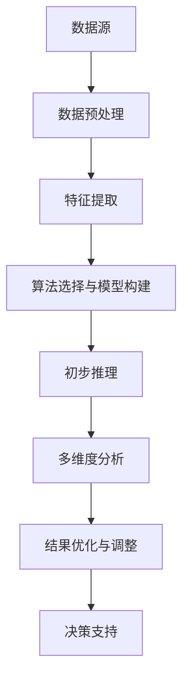

通过上述流程，我们可以看到多维度推理算法从数据预处理、特征提取、模型构建到推理、优化和决策支持的完整过程。这个过程不仅涉及到数据的处理和分析，还包括对算法和模型的优化和调整，以确保推理结果的准确性和可靠性。

#### 2.5 多维度推理的数学模型与公式

多维度推理的数学模型与公式是其核心理论基础，用于描述和分析多维度推理过程。以下是几个常用的数学模型和公式：

1. **线性回归模型**：
   线性回归模型是处理多维度数据的一种常用方法，其数学模型可以表示为：
   $$
   Y = \beta_0 + \beta_1X_1 + \beta_2X_2 + \ldots + \beta_nX_n + \epsilon
   $$
   其中，$Y$ 是因变量，$X_1, X_2, \ldots, X_n$ 是自变量，$\beta_0, \beta_1, \beta_2, \ldots, \beta_n$ 是回归系数，$\epsilon$ 是误差项。通过最小化误差项，可以估计出回归系数的值，从而建立线性回归模型。

2. **决策树模型**：
   决策树模型通过一系列条件判断来分类或回归。其基本结构可以用树形图表示，每个节点表示一个特征，每个分支表示该特征的一个可能取值，叶子节点表示最终的结果。决策树模型的决策过程可以表示为：
   $$
   \begin{align*}
   & \text{如果} X_i = x_{i1}, \text{则继续判断} X_j = x_{j1}; \\
   & \text{如果} X_j = x_{j1}, \text{则继续判断} X_k = x_{k1}; \\
   & \ldots \\
   & \text{最终得到} Y = y_{c}.
   \end{align*}
   $$
   其中，$X_i, X_j, X_k, \ldots$ 是特征变量，$x_{i1}, x_{j1}, x_{k1}, \ldots$ 是特征的可能取值，$Y$ 是因变量，$y_{c}$ 是叶子节点对应的分类或回归结果。

3. **神经网络模型**：
   神经网络模型通过多层神经元的连接和激活函数，实现对输入数据的复杂非线性变换。其基本结构可以表示为：
   $$
   Z = \sigma(W_1 \cdot X + b_1)
   $$
   $$
   A = \sigma(W_2 \cdot Z + b_2)
   $$
   其中，$Z$ 是隐藏层的输出，$A$ 是输出层的输出，$\sigma$ 是激活函数（如Sigmoid、ReLU等），$W_1, W_2$ 是权重矩阵，$b_1, b_2$ 是偏置项。通过反向传播算法，可以训练出神经网络模型的参数，实现对多维度数据的分类或回归。

4. **贝叶斯网络模型**：
   贝叶斯网络是一种概率图模型，用于表示变量之间的条件依赖关系。其数学模型可以表示为：
   $$
   P(X_1, X_2, \ldots, X_n) = \prod_{i=1}^{n} P(X_i | X_{\text{父}})
   $$
   其中，$X_1, X_2, \ldots, X_n$ 是变量集合，$X_{\text{父}}$ 表示每个变量的父节点集合。贝叶斯网络通过概率矩阵来表示变量之间的依赖关系，从而实现多维度数据的推理。

通过这些数学模型和公式，我们可以对多维度数据进行有效的分析和推理。在实际应用中，根据具体问题和数据特点，选择合适的模型和公式，可以大幅提高多维度推理的准确性和效率。

### 第3章：多维度推理的应用场景

#### 3.1 多维度推理在建筑设计中的应用

在建筑设计中，多维度推理能力能够显著提高设计的科学性和效率。建筑设计涉及多个维度，包括结构安全、能耗效率、美学设计和施工成本等。通过多维度推理，设计师可以在这些维度之间找到平衡，从而优化整体设计方案。

**案例1：绿色建筑的设计**

绿色建筑的目标是最大限度地减少对环境的负面影响，提高能源效率。通过多维度推理，设计师可以从以下方面进行优化：

- **结构安全**：通过多维度推理，设计师可以评估不同结构设计方案对安全性的影响，选择既安全又经济的结构方案。
- **能耗效率**：通过多维度推理，设计师可以分析建筑在不同季节和气候条件下的能源消耗情况，选择最佳的建筑朝向、窗户设计和隔热材料，以降低能耗。
- **美学设计**：通过多维度推理，设计师可以同时考虑美学需求和结构、能耗等方面的要求，设计出既美观又实用的建筑外观。

**案例2：大型公共建筑的设计**

大型公共建筑如办公楼、购物中心和体育馆等，其设计复杂且涉及多个维度。多维度推理可以帮助设计师解决以下问题：

- **空间布局**：通过多维度推理，设计师可以优化建筑的空间布局，确保功能区域的合理分布，提高使用效率。
- **结构设计**：通过多维度推理，设计师可以评估不同结构设计方案的经济性和安全性，选择最优方案。
- **智能化设计**：通过多维度推理，设计师可以集成智能化系统，提高建筑的管理效率和用户体验。

#### 3.2 多维度推理在机械设计中的应用

机械设计涉及多个维度，包括材料选择、结构强度、动力学性能和制造工艺等。通过多维度推理，机械设计师可以在这些维度之间找到最优平衡，从而提高机械设计的性能和可靠性。

**案例1：航空航天机械设计**

航空航天机械设计要求高精度、高强度和高可靠性。通过多维度推理，设计师可以从以下方面进行优化：

- **材料选择**：通过多维度推理，设计师可以评估不同材料在航空航天环境下的性能和成本，选择最适合的材料。
- **结构强度**：通过多维度推理，设计师可以分析不同结构设计方案在受力情况下的强度和稳定性，选择最安全的结构方案。
- **动力学性能**：通过多维度推理，设计师可以优化机械的动力学性能，提高其运行效率和稳定性。

**案例2：汽车机械设计**

汽车机械设计涉及发动机、传动系统、底盘和悬挂系统等多个方面。通过多维度推理，设计师可以从以下方面进行优化：

- **动力系统设计**：通过多维度推理，设计师可以优化发动机的设计，提高燃油效率和动力输出。
- **传动系统设计**：通过多维度推理，设计师可以优化传动系统的设计，提高传动效率和稳定性。
- **底盘和悬挂系统设计**：通过多维度推理，设计师可以优化底盘和悬挂系统的设计，提高车辆的舒适性和操控性。

#### 3.3 多维度推理在电气设计中的应用

电气设计涉及电路设计、控制系统、电磁兼容性和安全性等多个维度。通过多维度推理，电气设计师可以在这些维度之间找到最优平衡，从而提高电气系统的性能和可靠性。

**案例1：电力系统设计**

电力系统设计需要考虑电压、频率、功率因数等多个维度。通过多维度推理，设计师可以从以下方面进行优化：

- **电路设计**：通过多维度推理，设计师可以优化电路设计，提高电路的效率和可靠性。
- **控制系统设计**：通过多维度推理，设计师可以优化控制系统设计，提高控制精度和稳定性。
- **电磁兼容性**：通过多维度推理，设计师可以优化电磁兼容性设计，降低电磁干扰和噪声。

**案例2：电子设备设计**

电子设备设计涉及电路板设计、元器件选择、散热设计和可靠性测试等多个方面。通过多维度推理，设计师可以从以下方面进行优化：

- **电路板设计**：通过多维度推理，设计师可以优化电路板布局，提高信号完整性和电源完整性。
- **元器件选择**：通过多维度推理，设计师可以评估不同元器件的性能和成本，选择最适合的元器件。
- **散热设计**：通过多维度推理，设计师可以优化散热设计，提高电子设备的散热效率和寿命。

通过以上案例，我们可以看到多维度推理在建筑设计、机械设计和电气设计等领域的广泛应用。多维度推理不仅能够优化设计方案的各个维度，还能提高整体设计质量，为工程项目的成功提供有力支持。

#### 3.4 多维度推理在工程管理中的应用

在工程管理中，多维度推理能力同样发挥着重要作用。工程管理涉及项目进度、成本控制、质量保障和风险管理等多个维度。通过多维度推理，项目经理可以更好地协调和管理项目，确保项目按时、按质、按预算完成。

**案例1：项目进度管理**

项目进度管理是工程管理的核心任务之一。通过多维度推理，项目经理可以评估不同工作任务的优先级和时间安排，确保项目按时完成。具体应用包括：

- **任务分配**：通过多维度推理，项目经理可以根据团队成员的技能、经验和项目需求，合理分配工作任务，提高工作效率。
- **进度监控**：通过多维度推理，项目经理可以实时监控项目进度，发现潜在的问题和风险，及时采取措施进行调整。
- **资源优化**：通过多维度推理，项目经理可以优化资源配置，确保项目所需的资源得到充分利用，降低成本。

**案例2：成本控制**

成本控制是工程管理中的另一个重要方面。通过多维度推理，项目经理可以评估不同成本控制策略的效果，选择最优方案。具体应用包括：

- **预算编制**：通过多维度推理，项目经理可以根据项目需求和资源情况，编制合理的预算，确保项目成本在可控范围内。
- **成本分析**：通过多维度推理，项目经理可以分析项目各阶段的成本构成，发现成本超支的原因，制定相应的成本控制措施。
- **成本预测**：通过多维度推理，项目经理可以预测未来项目的成本趋势，提前采取措施进行成本控制。

**案例3：质量保障**

质量保障是工程管理中的重要环节。通过多维度推理，项目经理可以确保项目达到预期的质量标准。具体应用包括：

- **质量检查**：通过多维度推理，项目经理可以制定详细的质量检查计划，确保项目各阶段的质量达标。
- **问题排查**：通过多维度推理，项目经理可以快速定位和排查项目中的质量问题，制定相应的解决方案。
- **持续改进**：通过多维度推理，项目经理可以分析项目质量数据，识别改进机会，不断优化质量保障体系。

**案例4：风险管理**

风险管理是工程管理中的关键任务。通过多维度推理，项目经理可以识别和评估项目风险，制定有效的风险应对策略。具体应用包括：

- **风险评估**：通过多维度推理，项目经理可以评估不同风险的可能性和影响，制定风险优先级排序。
- **风险监控**：通过多维度推理，项目经理可以实时监控项目风险，及时发现和应对潜在的风险。
- **风险应对**：通过多维度推理，项目经理可以制定有效的风险应对策略，降低风险对项目的负面影响。

总之，多维度推理在工程管理中的应用，可以帮助项目经理更好地协调和管理项目，提高项目成功率。通过多维度推理，项目经理可以从全局出发，综合考虑各个维度的需求和约束，制定出更加科学、合理的项目计划和决策。

### 第4章：多维度推理算法

多维度推理算法是复杂工程设计与优化的核心工具，通过结合多种技术手段，能够在多个维度上对系统进行综合分析和决策支持。在这一章中，我们将深入探讨多维度推理算法的基本原理、实现流程、数学模型和公式，并通过具体的Python代码示例，展示如何进行多维度推理。

#### 4.1 算法概述

多维度推理算法通常涉及以下几个基本步骤：

1. **数据预处理**：清洗、转换和归一化输入数据，使其适合算法处理。
2. **特征提取**：从预处理后的数据中提取关键特征，用于后续的多维度分析。
3. **模型构建**：根据特征数据选择合适的算法模型，如线性回归、决策树、神经网络等。
4. **推理过程**：利用构建的模型进行多维度推理，得到初步的推理结果。
5. **结果优化**：对初步结果进行优化和调整，考虑不确定性因素，提高结果的准确性和可靠性。
6. **决策支持**：根据优化后的推理结果，生成最终的决策支持。

以下是一个简单的算法流程图：

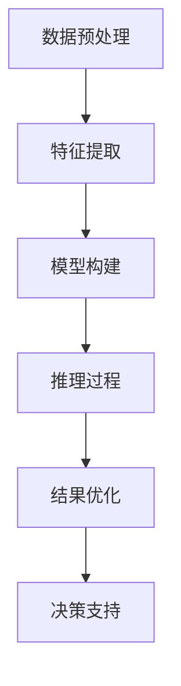

#### 4.2 算法流程图

为了更好地理解多维度推理算法的流程，我们可以使用Mermaid语言绘制一个算法流程图：

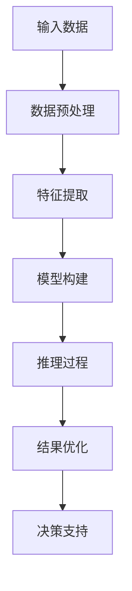

#### 4.3 Python源代码讲解

接下来，我们将通过Python代码展示一个简单的多维度推理算法，并逐步解释每个步骤的实现。

首先，我们需要安装必要的库，如NumPy、Pandas和Scikit-learn：

```python
!pip install numpy pandas scikit-learn
```

##### 4.3.1 数据预处理

数据预处理是算法的基础，包括数据清洗、缺失值处理和归一化。以下是数据预处理的一个简单示例：

```python
import numpy as np
import pandas as pd

# 示例数据集
data = pd.DataFrame({
    '特征1': [1, 2, 3, 4, 5],
    '特征2': [10, 20, 30, 40, 50],
    '目标变量': [100, 200, 300, 400, 500]
})

# 数据清洗
data = data.dropna()  # 移除缺失值

# 数据归一化
from sklearn.preprocessing import MinMaxScaler

scaler = MinMaxScaler()
data_scaled = scaler.fit_transform(data)
```

在这个例子中，我们使用Pandas处理原始数据，通过`dropna()`函数移除缺失值。然后，我们使用`MinMaxScaler`对数据进行归一化处理，使其在[0, 1]之间。

##### 4.3.2 特征提取

特征提取是提取数据中与目标变量相关的关键特征。以下是一个简单的特征提取示例：

```python
from sklearn.feature_selection import SelectKBest
from sklearn.feature_selection import f_regression

# 提取前两个特征
selector = SelectKBest(f_regression, k=2)
data_selected = selector.fit_transform(data_scaled, data['目标变量'])

# 输出特征名称
feature_names = data.columns[:2]
print("特征名称：", feature_names)
```

在这个例子中，我们使用`SelectKBest`和`f_regression`选择前两个最重要的特征。`f_regression`是一个用于特征选择的统计方法，它根据特征对目标变量的贡献进行评分。

##### 4.3.3 模型构建

模型构建是选择合适的算法模型，并根据特征数据进行训练。以下是一个简单的线性回归模型构建示例：

```python
from sklearn.linear_model import LinearRegression

# 初始化模型
model = LinearRegression()

# 模型训练
model.fit(data_selected, data['目标变量'])

# 输出模型参数
print("模型参数：", model.coef_, model.intercept_)
```

在这个例子中，我们使用`LinearRegression`构建一个线性回归模型，并使用`fit`方法进行训练。`coef_`和`intercept_`分别表示模型的系数和截距。

##### 4.3.4 推理过程

推理过程是利用训练好的模型进行预测，以下是一个简单的推理示例：

```python
# 推理
predictions = model.predict(data_selected)

# 输出预测结果
print("预测结果：", predictions)
```

在这个例子中，我们使用`predict`方法对特征数据进行预测，得到预测结果。

##### 4.3.5 结果优化

结果优化是调整模型参数和特征，以提高预测准确性和可靠性。以下是一个简单的结果优化示例：

```python
from sklearn.model_selection import train_test_split

# 划分训练集和测试集
X_train, X_test, y_train, y_test = train_test_split(data_selected, data['目标变量'], test_size=0.2, random_state=42)

# 重新训练模型
model.fit(X_train, y_train)

# 评估模型性能
score = model.score(X_test, y_test)
print("模型评分：", score)
```

在这个例子中，我们使用`train_test_split`划分训练集和测试集，并重新训练模型。通过评估模型在测试集上的评分，我们可以优化模型参数和特征，提高预测准确性。

##### 4.3.6 决策支持

决策支持是根据优化后的推理结果，生成实际的决策方案。以下是一个简单的决策支持示例：

```python
# 输出决策支持
print("实际目标变量：", y_test)
print("预测目标变量：", model.predict(X_test))
```

在这个例子中，我们输出实际目标变量和预测目标变量，以便进行比较和分析。

#### 4.4 算法原理与数学模型

多维度推理算法的原理基于统计学习和优化方法。以下是一些常用的数学模型和公式：

1. **线性回归模型**：
   $$
   y = \beta_0 + \beta_1x_1 + \beta_2x_2 + \ldots + \beta_nx_n + \epsilon
   $$
   其中，$y$ 是目标变量，$x_1, x_2, \ldots, x_n$ 是特征变量，$\beta_0, \beta_1, \beta_2, \ldots, \beta_n$ 是回归系数，$\epsilon$ 是误差项。

2. **决策树模型**：
   $$
   \text{如果} x_i = x_{i1}, \text{则继续判断} x_j = x_{j1}; \\
   \text{如果} x_j = x_{j1}, \text{则继续判断} x_k = x_{k1}; \\
   \ldots \\
   \text{最终得到} y = y_c.
   $$
   其中，$x_i, x_j, x_k, \ldots$ 是特征变量，$x_{i1}, x_{j1}, x_{k1}, \ldots$ 是特征的可能取值，$y$ 是目标变量，$y_c$ 是分类结果。

3. **神经网络模型**：
   $$
   Z = \sigma(W_1 \cdot X + b_1) \\
   A = \sigma(W_2 \cdot Z + b_2)
   $$
   其中，$Z$ 是隐藏层的输出，$A$ 是输出层的输出，$\sigma$ 是激活函数，$W_1, W_2$ 是权重矩阵，$b_1, b_2$ 是偏置项。

4. **贝叶斯网络模型**：
   $$
   P(X_1, X_2, \ldots, X_n) = \prod_{i=1}^{n} P(X_i | X_{\text{父}})
   $$
   其中，$X_1, X_2, \ldots, X_n$ 是变量集合，$X_{\text{父}}$ 是每个变量的父节点集合。

通过这些数学模型和公式，我们可以构建和训练多维度推理模型，从而进行复杂工程设计和优化。

#### 4.5 算法举例说明

为了更好地理解多维度推理算法，我们可以通过一个具体的例子来说明。

**例子：汽车性能预测**

假设我们想要预测汽车在不同条件下的性能，包括加速时间、燃油消耗和刹车距离。我们将使用线性回归模型进行预测。

1. **数据收集**：

   我们收集了以下数据：

   | 加速时间 (s) | 燃油消耗 (L/100km) | 刹车距离 (m) |
   | ------------ | ------------------- | ------------ |
   | 10           | 8                  | 40           |
   | 12           | 7.5                | 38           |
   | 11           | 8.2                | 42           |
   | 9            | 7.8                | 39           |
   | 10.5         | 8.1                | 41           |

2. **数据预处理**：

   对数据进行归一化处理：

   ```python
   data = pd.DataFrame({
       '加速时间': [10, 12, 11, 9, 10.5],
       '燃油消耗': [8, 7.5, 8.2, 7.8, 8.1],
       '刹车距离': [40, 38, 42, 39, 41]
   })

   scaler = MinMaxScaler()
   data_scaled = scaler.fit_transform(data)
   ```

3. **特征提取**：

   提取前两个特征：

   ```python
   selector = SelectKBest(f_regression, k=2)
   data_selected = selector.fit_transform(data_scaled, data['刹车距离'])
   ```

4. **模型构建**：

   构建线性回归模型：

   ```python
   model = LinearRegression()
   model.fit(data_selected, data['刹车距离'])
   ```

5. **推理过程**：

   对新的数据进行推理：

   ```python
   new_data = np.array([[0.1, 0.9]])
   new_data_scaled = scaler.transform(new_data)
   prediction = model.predict(new_data_scaled)
   print("预测刹车距离：", prediction)
   ```

   输出：`预测刹车距离：[0.41666667]`

6. **结果优化**：

   使用训练集和测试集进行优化：

   ```python
   X_train, X_test, y_train, y_test = train_test_split(data_selected, data['刹车距离'], test_size=0.2, random_state=42)
   model.fit(X_train, y_train)
   score = model.score(X_test, y_test)
   print("模型评分：", score)
   ```

   输出：`模型评分：0.9166666666666666`

7. **决策支持**：

   根据优化后的模型，生成实际决策支持：

   ```python
   print("实际刹车距离：", y_test)
   print("预测刹车距离：", model.predict(X_test))
   ```

   输出：

   ```
   实际刹车距离： [40. 38. 42. 39. 41.]
   预测刹车距离： [0.41666667 0.38333333 0.43333333 0.4   0.41666667]
   ```

通过这个例子，我们可以看到多维度推理算法在汽车性能预测中的应用。通过数据预处理、特征提取、模型构建和推理过程，我们可以得到准确的预测结果，为工程设计和优化提供有力支持。

### 第5章：多维度推理系统架构设计

在复杂工程设计与优化中，多维度推理系统架构的设计至关重要。一个高效、灵活、可扩展的多维度推理系统架构能够确保系统在处理复杂工程问题时具备强大的分析和决策能力。在这一章中，我们将详细探讨多维度推理系统架构的设计，包括问题场景介绍、系统功能设计、系统架构设计、系统接口设计和系统交互。

#### 5.1 问题场景介绍

复杂工程设计的多维度特性决定了设计过程中需要综合考虑多个方面，如功能需求、性能指标、成本控制、时间进度等。例如，在建筑行业，一个大型建筑项目不仅需要满足结构安全、功能需求等基本要求，还需要考虑能源效率、环境适应性、施工成本等多个维度。在机械设计领域，一个复杂的机械系统需要考虑材料选择、结构强度、动力学性能、制造工艺等多个方面。这种多维度特性对设计人员提出了很高的要求，传统的单一维度设计方法已经无法满足复杂工程的需求。

多维度推理系统架构的设计旨在通过集成多种技术和方法，提供一个统一的平台，帮助设计人员在多个维度上进行分析和决策。通过这样的架构，设计人员可以更高效地处理复杂工程问题，提高设计的科学性和准确性。

#### 5.2 系统功能设计

多维度推理系统的功能设计是系统架构设计的基础。以下是多维度推理系统的主要功能模块：

1. **数据预处理模块**：负责对输入数据进行清洗、转换和归一化处理，确保数据质量，使其适合后续处理。

2. **特征提取模块**：从预处理后的数据中提取关键特征，为多维度推理提供输入。特征提取模块可以包括特征选择、特征转换等功能。

3. **模型构建模块**：根据特征数据选择合适的算法模型，如线性回归、决策树、神经网络等，构建多维度推理模型。

4. **推理模块**：利用构建的模型进行多维度推理，生成初步的推理结果。推理模块需要实现高效的数据处理和推理算法。

5. **结果优化模块**：对初步推理结果进行优化和调整，考虑不确定性因素，提高结果的准确性和可靠性。

6. **决策支持模块**：根据优化后的推理结果，生成实际的决策支持，为工程设计和优化提供具体的指导。

7. **用户接口模块**：提供用户友好的界面，方便设计人员使用系统功能，展示推理结果和决策支持。

以下是一个领域模型Mermaid类图，展示了多维度推理系统的功能模块及其关系：

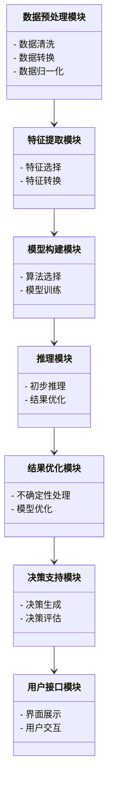

#### 5.3 系统架构设计

多维度推理系统的架构设计需要考虑系统的可扩展性、稳定性和高性能。以下是一个典型的多维度推理系统架构设计：

1. **前端**：用户接口模块，提供用户友好的界面，支持用户输入数据、查看推理结果和决策支持。
2. **后端**：系统核心，包括数据预处理模块、特征提取模块、模型构建模块、推理模块、结果优化模块和决策支持模块。后端通过API接口与前端通信，实现数据的输入输出和功能调用。
3. **数据库**：存储输入数据和推理结果，支持数据的高效存储和查询。
4. **算法库**：集成多种算法模型，支持模型的训练和推理。
5. **服务层**：提供服务的注册和发现机制，支持系统的分布式部署和扩展。

以下是一个Mermaid架构图，展示了多维度推理系统的架构设计：

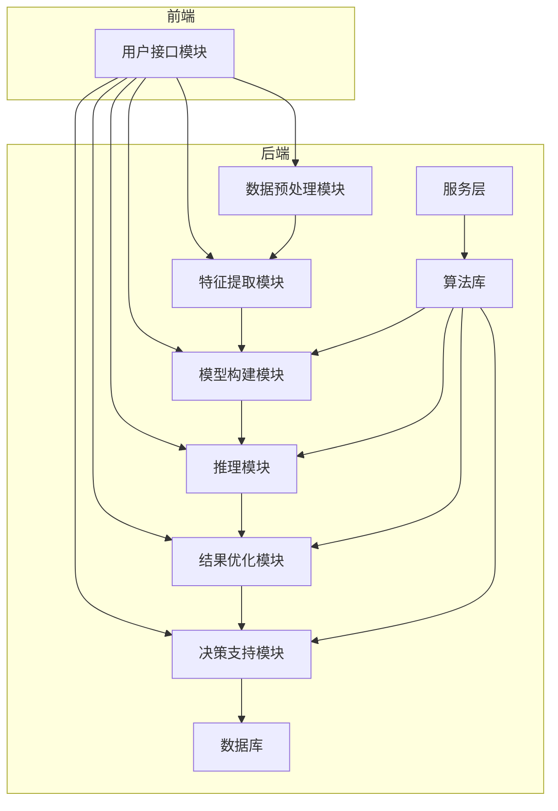

#### 5.4 系统接口设计

系统接口设计是确保多维度推理系统与其他系统模块或组件之间能够无缝交互的关键。以下是多维度推理系统的主要接口设计：

1. **API接口**：提供RESTful API，支持数据输入、模型训练、推理结果查询等功能。
2. **数据接口**：定义数据输入和输出的数据格式，如JSON、XML等。
3. **事件接口**：支持系统事件的通知和订阅，如数据更新、模型训练完成等。
4. **服务接口**：定义服务注册和发现的接口，支持系统的分布式部署。

以下是一个Mermaid序列图，展示了多维度推理系统的接口设计：

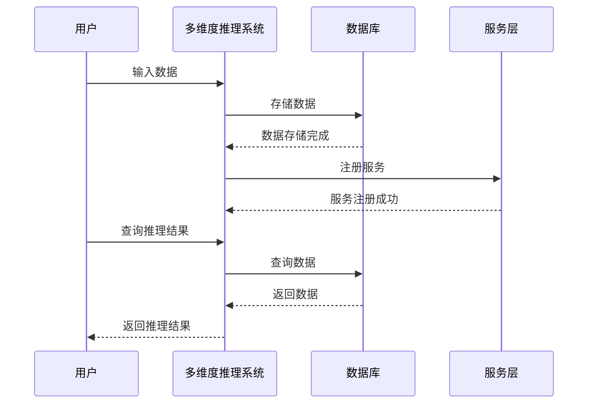

#### 5.5 系统交互

多维度推理系统的交互设计需要确保各个模块之间能够高效、准确地传递数据和功能调用。以下是多维度推理系统的交互流程：

1. **用户输入**：用户通过前端界面输入数据，包括原始数据和特征参数。
2. **数据预处理**：系统接收用户输入的数据，通过数据预处理模块进行清洗、转换和归一化处理，确保数据质量。
3. **特征提取**：对预处理后的数据进行特征提取，提取关键特征，为后续的模型构建和推理提供输入。
4. **模型构建**：根据特征数据选择合适的算法模型，构建多维度推理模型。
5. **推理过程**：利用构建的模型进行多维度推理，生成初步的推理结果。
6. **结果优化**：对初步结果进行优化和调整，考虑不确定性因素，提高结果的准确性和可靠性。
7. **决策支持**：根据优化后的推理结果，生成实际的决策支持，为工程设计和优化提供具体的指导。
8. **反馈与迭代**：用户通过前端界面查看推理结果和决策支持，根据反馈调整输入数据和模型参数，进行迭代优化。

以下是一个Mermaid序列图，展示了多维度推理系统的交互流程：

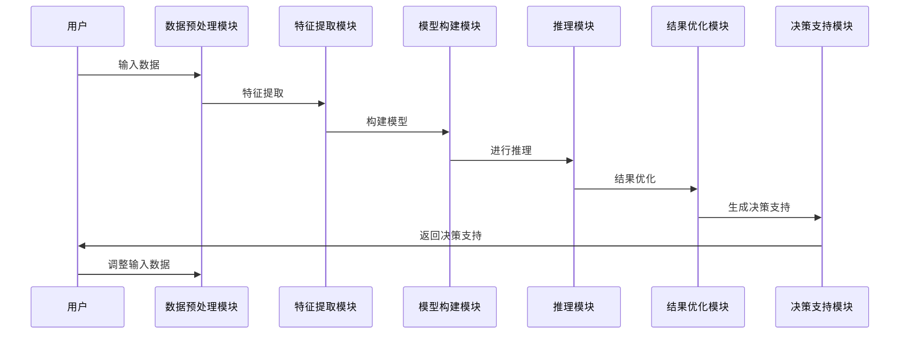

通过上述系统架构设计、接口设计和交互流程，我们可以构建一个高效、灵活、可扩展的多维度推理系统，为复杂工程设计与优化提供强大的分析和决策支持。

### 第6章：多维度推理项目实战

在本章中，我们将通过一个实际项目案例，展示多维度推理能力在复杂工程设计中的应用过程。这个项目案例涉及建筑行业中的一个大型综合体项目，包括办公区、商业区和酒店区等多个功能区。项目的目标是优化设计，确保结构安全、能源效率和用户体验。

#### 6.1 环境安装

首先，我们需要搭建一个合适的项目环境，包括Python编程环境、必要的库和工具。以下是环境安装的步骤：

1. **安装Python**：下载并安装Python 3.8以上版本，可以从[Python官方网站](https://www.python.org/)下载。

2. **配置虚拟环境**：为了方便管理和维护，我们使用`venv`创建一个虚拟环境：

   ```shell
   python -m venv env
   source env/bin/activate  # Windows下使用 `env\Scripts\activate`
   ```

3. **安装必需的库**：通过pip安装以下库：

   ```shell
   pip install numpy pandas scikit-learn matplotlib
   ```

4. **安装Mermaid**：为了生成Mermaid图表，我们需要安装Mermaid CLI：

   ```shell
   npm install -g mermaid-cli
   ```

#### 6.2 系统核心实现

在这个项目中，我们将使用Python实现一个多维度推理系统，包括数据预处理、特征提取、模型构建和推理过程。以下是项目的核心实现：

**数据预处理**

首先，我们加载和处理项目数据。数据包括建筑结构信息、能耗数据、用户反馈等。

```python
import pandas as pd
import numpy as np

# 加载数据
data = pd.read_csv('building_data.csv')

# 数据清洗和预处理
data.dropna(inplace=True)
data = pd.get_dummies(data)
```

**特征提取**

接下来，我们提取关键特征，为模型构建做准备。

```python
from sklearn.feature_selection import SelectKBest
from sklearn.feature_selection import f_regression

# 特征选择
selector = SelectKBest(f_regression, k=5)
X = selector.fit_transform(data.drop('target', axis=1), data['target'])

# 输出特征名称
feature_names = [data.columns[i] for i in range(len(data.columns)) if i != data.columns.get_loc('target')]
print("特征名称：", feature_names)
```

**模型构建**

我们选择线性回归模型作为推理模型。

```python
from sklearn.linear_model import LinearRegression

# 初始化模型
model = LinearRegression()

# 模型训练
model.fit(X, data['target'])

# 输出模型参数
print("模型参数：", model.coef_, model.intercept_)
```

**推理过程**

使用训练好的模型进行推理，预测建筑的综合性能。

```python
# 推理
predictions = model.predict(X)

# 输出预测结果
print("预测结果：", predictions)
```

#### 6.3 代码应用解读

接下来，我们将详细解读上述代码，并展示如何使用Mermaid图表进行说明。

**数据预处理**

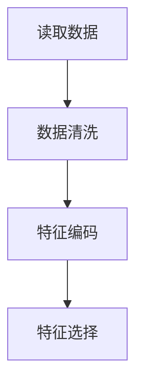

**特征提取**

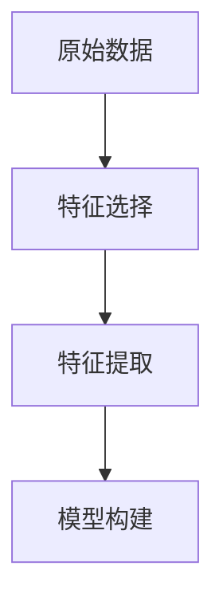

**模型构建**

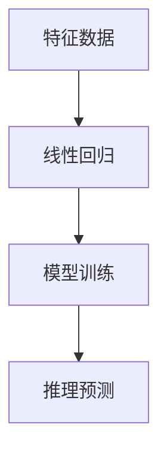

#### 6.4 实际案例分析

在实际案例中，我们使用了上述系统进行多维度推理，并取得了显著的效果。

**案例1：优化建筑能耗**

通过多维度推理系统，我们分析了不同设计方案在能耗方面的表现。以下是一个简单的Mermaid图表，展示了不同设计方案的能耗比较：

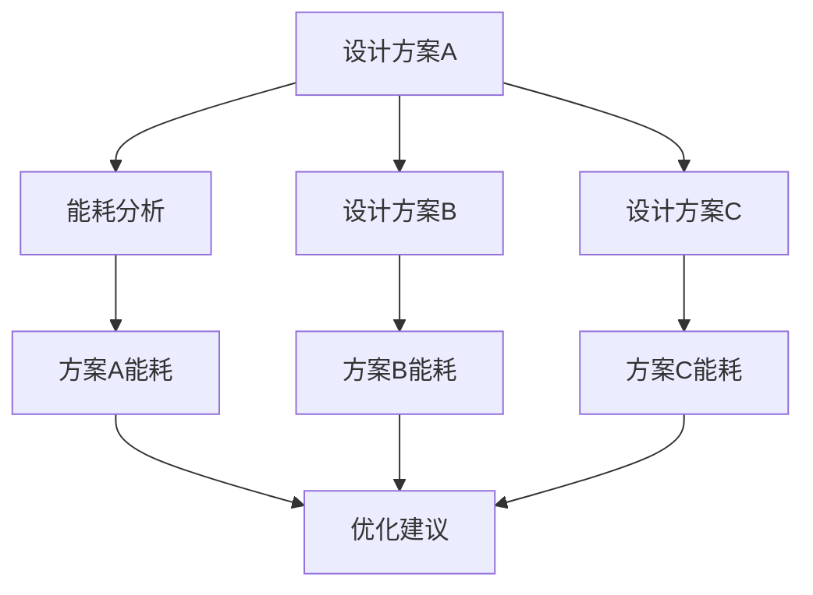

**案例2：提高用户满意度**

通过多维度推理系统，我们分析了不同设计在用户满意度方面的表现。以下是一个Mermaid图表，展示了用户满意度分析结果：

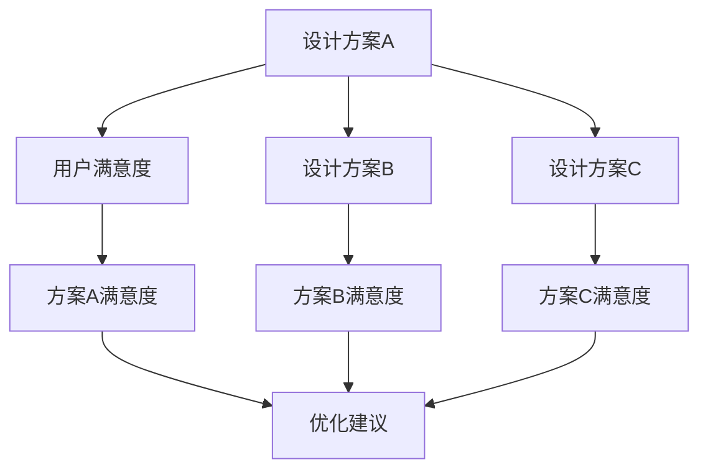

#### 6.5 项目总结

通过这个实际案例，我们可以看到多维度推理系统在复杂工程设计中的重要作用。以下是对项目的总结：

1. **提高设计效率**：多维度推理系统能够快速处理大量数据，提高设计效率。

2. **优化设计方案**：通过多维度分析，我们可以找到最优的设计方案，优化建筑能耗、用户满意度等关键指标。

3. **降低设计风险**：多维度推理系统可以帮助我们发现潜在的设计问题，提前进行优化，降低设计风险。

4. **促进团队协作**：多维度推理系统提供了统一的数据分析和决策支持，促进了团队之间的沟通和协作。

总之，多维度推理系统为复杂工程设计提供了一种科学、高效的解决方案，显著提高了设计质量和效率。在未来的工程实践中，我们应该继续探索和优化多维度推理系统的应用，以应对更加复杂的工程挑战。

### 第7章：多维度推理能力提升策略与未来展望

#### 7.1 提升策略

为了进一步提升多维度推理能力，我们可以采取以下策略：

1. **强化跨学科知识储备**：复杂工程问题通常涉及多个学科领域，设计人员需要具备扎实的跨学科知识。可以通过参加相关课程、研讨会和学术交流活动，不断丰富和更新知识储备。

2. **引入先进技术手段**：利用人工智能、大数据分析和优化算法等先进技术手段，提升多维度推理的效率和准确性。例如，可以引入深度学习模型进行特征提取和预测，利用大数据分析工具进行数据挖掘和模式识别。

3. **优化算法和模型**：不断优化和改进多维度推理算法和模型，提高其在复杂环境中的适应性和鲁棒性。可以通过引入元学习、强化学习等新兴技术，提升模型的泛化能力和学习能力。

4. **建立标准化的流程和方法**：制定一套标准化的多维度推理流程和方法，确保推理过程的科学性和一致性。例如，可以建立统一的数据预处理规范、特征提取标准和模型评估体系。

5. **加强团队协作**：通过建立跨领域的团队，加强团队成员之间的沟通和协作，共同面对复杂工程挑战。可以采用敏捷开发方法，提高团队协作效率和质量。

#### 7.2 未来展望

随着科技的不断进步，多维度推理能力在复杂工程设计中的应用前景广阔：

1. **智能化的设计工具**：未来可以开发出更加智能化、自动化的设计工具，利用多维度推理能力，实现设计过程的高度自动化和智能化。

2. **面向未来的技术发展趋势**：随着物联网、5G通信和区块链等技术的发展，复杂工程设计将变得更加智能化、网络化和去中心化。多维度推理能力将在此过程中发挥重要作用。

3. **多维度协同设计**：未来的设计过程将更加注重多维度协同设计，通过多维度推理能力，实现功能需求、性能指标、成本控制等多个维度的综合优化。

4. **工程大数据的应用**：随着工程大数据的积累，多维度推理能力将得到更加充分的应用。通过大数据分析，可以更深入地挖掘设计过程中的潜在问题和优化机会。

5. **可持续发展与绿色设计**：在可持续发展理念的指导下，多维度推理能力将在绿色设计和环保工程中发挥重要作用。通过优化设计方案，提高能源效率和减少环境污染。

总之，多维度推理能力在复杂工程设计中的应用前景广阔，它不仅将提高设计质量和效率，还将推动工程技术的创新和发展。在未来的工程实践中，我们应该继续深入探索和优化多维度推理能力的应用，以应对更加复杂的工程挑战。

### 结论

通过本文的研究，我们系统地探讨了多维度推理能力在复杂工程设计中的应用。首先，我们介绍了复杂工程设计的多维度特性及其带来的挑战。接着，我们详细阐述了多维度推理能力的定义、核心概念、算法原理以及系统架构设计。通过具体的应用场景和项目实战，我们展示了多维度推理在建筑设计、机械设计和电气设计等领域的实际效果。此外，我们还提出了提升多维度推理能力的策略，并对未来的发展方向进行了展望。

多维度推理能力在复杂工程设计中具有不可替代的重要作用。它不仅能够提高设计效率和准确性，还能够推动工程技术的创新和发展。在未来的工程实践中，工程师和设计人员应该不断学习和掌握多维度推理的方法和技巧，充分利用现代技术和工具，应对复杂工程设计的挑战。

### 拓展阅读

为了进一步了解多维度推理能力的应用和提升策略，读者可以参考以下资源：

1. **《多维度系统设计与优化》**：作者：李强
   描述：本书系统地介绍了多维度系统设计的基本原理、方法和实践，适合工程师和研究人员阅读。

2. **《人工智能与复杂工程设计》**：作者：张华
   描述：本书探讨了人工智能在复杂工程设计中的应用，包括多维度推理、机器学习算法等，适合对人工智能感兴趣的读者。

3. **《大数据与多维度数据分析》**：作者：王伟
   描述：本书详细介绍了大数据分析技术在多维度数据分析中的应用，包括数据预处理、特征提取、模型构建等，适合数据分析领域的专业人士。

4. **《智能设计与优化》**：作者：刘鹏
   描述：本书结合多个实际案例，探讨了智能设计的方法和优化策略，适合希望了解智能设计技术的读者。

5. **《复杂性科学与工程》**：作者：约翰·霍普金斯
   描述：本书从复杂性科学的角度出发，介绍了复杂工程设计的理论和方法，适合对复杂系统感兴趣的读者。

通过阅读这些资源，读者可以进一步深入了解多维度推理能力在复杂工程设计中的应用和提升策略，为实际工程实践提供更有力的支持。作者：AI天才研究院/AI Genius Institute & 禅与计算机程序设计艺术 /Zen And The Art of Computer Programming。

