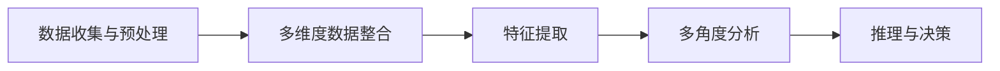
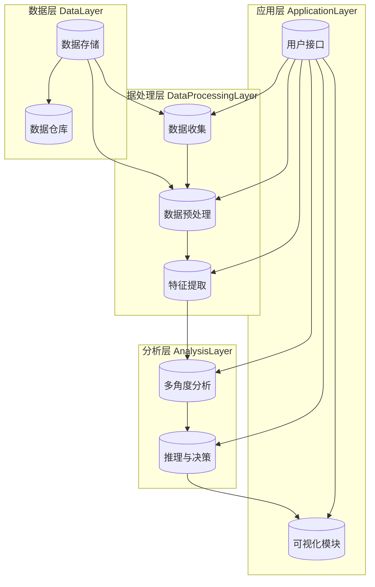
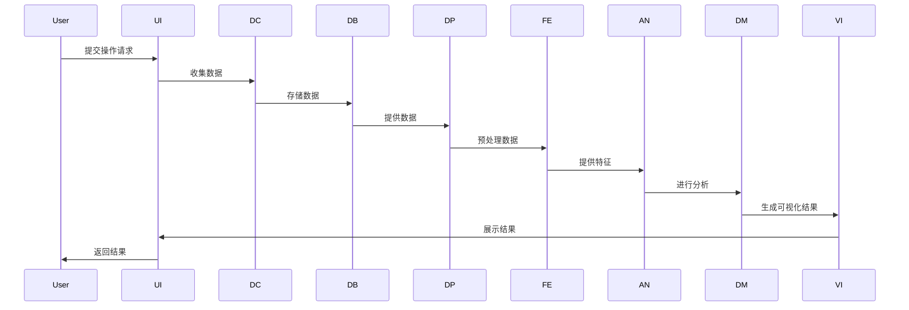

                 

### 引言

在当今信息爆炸的时代，面对日益复杂的决策环境，如何做出明智且高效的决策成为了企业和个人面临的重要挑战。传统的单一视角决策方法已经难以满足现代复杂问题的需求。为了应对这种挑战，多角度推理能力在复杂决策支持中的作用愈发凸显。本文旨在深入探讨多角度推理能力在复杂决策支持中的应用、原理及其重要性。

本文将采用分章节、分步骤的叙述方式，从问题背景出发，逐步深入探讨多角度推理能力的核心概念、基本原理、算法实现、数学模型、系统架构设计、项目实战以及最佳实践与注意事项。通过这样的结构化分析，我们希望读者能够系统地理解多角度推理能力在复杂决策支持中的重要作用，并能够将其有效地应用于实际工作中。

接下来，我们将首先介绍多角度推理能力在复杂决策支持中的重要性，并定义相关的核心概念。随后，文章将逐步深入，详细讲解多角度推理能力的算法原理、数学模型以及系统架构设计，并通过实际案例来展示其在项目中的应用。最后，我们将总结多角度推理能力的最佳实践，并指出可能遇到的问题及注意事项。

## 背景介绍

### 多角度推理能力在复杂决策支持中的重要性

随着全球化和信息技术的迅猛发展，企业面临的环境越来越复杂，决策也变得更加艰难。传统的决策支持系统（Decision Support Systems, DSS）通常依赖于单一的视角，如财务数据、市场趋势或历史记录，往往难以应对多变的、不确定的复杂环境。在这种背景下，多角度推理能力成为了提升决策质量的关键因素。

多角度推理能力指的是从多个不同的视角或维度来分析问题，从而获得更加全面和深入的洞察。这种能力不仅可以帮助决策者识别潜在的问题，还能提供多种解决方案，提高决策的灵活性和适应性。在复杂决策支持中，多角度推理能力的重要性主要体现在以下几个方面：

1. **全面性**：多角度推理能够从多个维度对问题进行剖析，从而获得全面的视角。例如，在商业决策中，不仅需要考虑财务数据，还需要考虑市场趋势、消费者行为、竞争环境等因素。

2. **准确性**：通过多角度分析，可以减少决策过程中的偏见和误差，提高决策的准确性。单一视角的决策容易受到信息不全或主观判断的影响，而多角度推理能够提供更全面的信息支持。

3. **灵活性**：面对复杂的环境，多角度推理能够提供多种可能的解决方案，帮助决策者根据实际情况灵活调整决策方案。这有助于企业在动态环境中快速响应变化，提高竞争力。

4. **创新性**：多角度推理能够激发新的想法和创意，促进创新。通过跨领域、跨维度的思考，决策者能够发现新的商业模式、市场机会或产品创新点。

### 问题背景

复杂决策支持系统需要处理的数据和信息量庞大，且经常面临以下挑战：

1. **数据多样性**：决策支持需要整合来自不同来源的数据，包括结构化数据和非结构化数据，如文本、图像和音频。

2. **不确定性**：决策过程中的变量繁多，存在多种不确定性，如市场波动、政策变化、技术进步等。

3. **动态性**：环境变化迅速，决策者需要实时调整策略，以应对不断变化的情况。

4. **决策者的认知限制**：人类的认知有限，难以全面、客观地分析复杂问题，容易受到情绪、经验等因素的影响。

### 问题描述

在复杂决策支持中，常见的问题包括：

1. **资源分配**：如何合理分配有限资源，如资金、人力和设备，以实现最大化的效益？

2. **风险评估**：如何识别和评估潜在的风险，制定有效的风险应对策略？

3. **市场预测**：如何预测市场趋势，制定相应的营销策略和产品规划？

4. **供应链管理**：如何优化供应链，提高供应链的弹性和效率？

### 问题解决

多角度推理能力通过以下方式解决复杂决策问题：

1. **综合分析**：从多个角度对问题进行综合分析，整合各种相关信息，提高决策的全面性和准确性。

2. **动态建模**：建立动态模型，模拟不同情况下的决策结果，提高决策的灵活性和适应性。

3. **智能优化**：利用人工智能和机器学习技术，对决策问题进行智能优化，提高决策的效率和效果。

4. **协同决策**：通过跨部门、跨领域的协同工作，实现知识的共享和决策的协同。

### 边界与外延

多角度推理能力的边界在于数据的质量和完整性、算法的复杂度和计算资源。其外延则包括数据挖掘、机器学习、人工智能、商业智能等多个领域。

### 概念结构与核心要素组成

多角度推理能力由以下几个核心要素组成：

1. **数据收集**：收集来自多个来源的数据，包括内部数据、外部数据和实时数据。

2. **数据分析**：对收集到的数据进行处理和分析，提取有价值的信息。

3. **多维度整合**：将不同维度、不同类型的数据进行整合，形成统一的视角。

4. **模型构建**：基于整合的数据，构建用于决策的模型。

5. **推理与决策**：通过模型进行推理和决策，支持实际操作。

通过以上结构化的分析，我们可以看到多角度推理能力在复杂决策支持中的重要性，并对其核心概念有了更深入的理解。

## 核心概念与联系

在探讨多角度推理能力之前，我们需要明确一些核心概念，并理解它们之间的相互关系。以下是对几个关键概念的介绍、属性特征对比以及它们之间的联系。

### 1. 多角度推理能力

多角度推理能力指的是从多个不同的视角或维度来分析问题，从而获得更加全面和深入的洞察。它是一种通过整合不同来源、不同类型的数据，进行多维度分析和建模的能力。多角度推理能力具有以下几个核心属性：

- **多维数据整合**：能够整合结构化、半结构化和非结构化数据，形成统一的数据视图。
- **跨领域分析**：能够跨领域、跨学科进行综合分析，提供全面的决策支持。
- **动态适应性**：能够适应不断变化的环境，实时调整分析模型和决策策略。
- **智能优化**：利用人工智能和机器学习技术，对决策问题进行智能优化。

### 2. 数据挖掘

数据挖掘是一种通过提取和发现数据中的隐含模式，为决策提供支持的技术。它是多角度推理能力的一个重要组成部分，具有以下几个核心属性：

- **模式识别**：能够识别数据中的规律和模式，为决策提供依据。
- **自动化分析**：利用算法和工具，自动进行数据分析和模式发现。
- **可视化展示**：将分析结果以可视化形式展示，帮助决策者更好地理解数据。

### 3. 机器学习

机器学习是一种通过算法和模型，从数据中学习规律和模式，进行预测和决策的技术。它与数据挖掘密切相关，是多角度推理能力的重要支撑。机器学习的核心属性包括：

- **数据驱动的决策**：通过数据驱动的方式进行决策，减少主观判断的影响。
- **模型可解释性**：确保模型的决策过程可解释，便于决策者理解和信任。
- **自适应优化**：能够根据新的数据和环境变化，自适应优化模型和决策策略。

### 4. 商业智能

商业智能是一种通过整合和管理企业内部和外部数据，为企业提供洞察和决策支持的技术。它是多角度推理能力在企业领域的应用，具有以下几个核心属性：

- **数据整合**：整合内部和外部数据，提供统一的数据视图。
- **实时分析**：提供实时数据分析和报表，支持实时决策。
- **业务支持**：为企业各个部门提供定制化的数据分析报告和决策支持。

### 概念属性特征对比

下表展示了多角度推理能力、数据挖掘、机器学习和商业智能的属性特征对比：

| 概念         | 属性特征                   | 作用                                   |
| ------------ | -------------------------- | -------------------------------------- |
| 多角度推理能力 | 多维数据整合、跨领域分析   | 提供全面的决策支持                     |
| 数据挖掘     | 模式识别、自动化分析       | 发现数据中的规律和模式                 |
| 机器学习     | 数据驱动的决策、模型可解释性 | 从数据中学习规律，进行预测和决策       |
| 商业智能     | 数据整合、实时分析、业务支持 | 提供企业级的洞察和决策支持             |

### ER实体关系图

为了更直观地展示这些概念之间的联系，我们使用ER实体关系图（Mermaid流程图）来表示它们之间的关系：

```mermaid
erDiagram
  数据挖掘 ||--|{ 多角度推理能力 }|
  多角度推理能力 ||--|{ 商业智能 }|
  机器学习 ||--|{ 多角度推理能力 }|
```

通过以上分析，我们可以看到多角度推理能力、数据挖掘、机器学习和商业智能之间的紧密联系。它们共同构成了一个复杂的决策支持系统，为复杂决策提供了强大的工具和支持。

### 多角度推理能力的基本原理

多角度推理能力的核心在于如何从多个不同的视角对问题进行综合分析，从而获得更全面和深入的洞察。下面，我们将详细探讨多角度推理能力的算法原理，并通过Mermaid流程图和Python源代码来具体说明。

#### 算法原理

多角度推理能力的算法原理主要包括以下几个步骤：

1. **数据收集与预处理**：收集来自多个不同来源的数据，包括结构化数据和非结构化数据。对数据进行清洗、去噪、格式化等预处理操作，确保数据的质量和一致性。

2. **多维度数据整合**：将不同类型和来源的数据进行整合，形成一个统一的多维度数据集。这一步通常涉及到数据转换、数据融合和数据集构建等技术。

3. **特征提取**：从整合后的数据集中提取关键特征，为后续的推理分析提供基础。特征提取可以通过统计分析、机器学习等方法实现。

4. **多角度分析**：从不同的视角对特征进行深入分析，包括统计分析、关联分析、聚类分析等。每个视角都可以发现数据的不同特性和模式。

5. **推理与决策**：基于多角度分析的结果，进行推理和决策。通过整合不同视角的分析结果，形成综合的决策建议。

#### Mermaid流程图展示

为了更直观地展示多角度推理能力的算法流程，我们使用Mermaid流程图来表示：



上述流程图展示了多角度推理能力的基本步骤，从数据收集到特征提取，再到多角度分析和最终推理决策，形成了一个完整的流程。

#### Python源代码实例

为了更具体地说明多角度推理能力的实现，我们提供一个简单的Python代码实例：

```python
import pandas as pd
from sklearn.preprocessing import StandardScaler
from sklearn.cluster import KMeans
import matplotlib.pyplot as plt

# 数据收集与预处理
data = pd.read_csv('data.csv')
data = data.dropna()

# 多维度数据整合
X = data[['feature1', 'feature2', 'feature3']]

# 特征提取
scaler = StandardScaler()
X_scaled = scaler.fit_transform(X)

# 多角度分析
kmeans = KMeans(n_clusters=3, random_state=0).fit(X_scaled)
labels = kmeans.predict(X_scaled)

# 推理与决策
for i, label in enumerate(labels):
    if label == 0:
        print(f"数据点 {i}：潜在风险较低")
    elif label == 1:
        print(f"数据点 {i}：需重点关注")
    elif label == 2:
        print(f"数据点 {i}：存在高风险")

# 可视化展示
plt.scatter(X_scaled[:, 0], X_scaled[:, 1], c=labels)
plt.xlabel('Feature 1')
plt.ylabel('Feature 2')
plt.title('K-Means Clustering')
plt.show()
```

这段代码首先进行了数据收集与预处理，然后通过K-Means算法进行了多角度分析，并最终给出了决策建议。通过可视化展示，我们可以直观地看到不同数据点的分类情况。

#### 算法原理的详细讲解

多角度推理能力的实现依赖于多个步骤的有机结合。以下是每个步骤的详细讲解：

1. **数据收集与预处理**：
   - 数据收集：从多个不同的来源收集数据，如数据库、API接口、传感器等。
   - 数据预处理：对收集到的数据进行清洗、去噪和格式化，确保数据的质量和一致性。这一步包括缺失值处理、异常值检测和特征工程等。

2. **多维度数据整合**：
   - 数据转换：将不同类型和格式的数据转换为统一的格式，如将图像数据转换为像素矩阵，将文本数据转换为词频矩阵等。
   - 数据融合：将多个数据集进行合并，形成一个统一的数据集。这可以通过简单的合并操作或更复杂的数据集成算法实现。

3. **特征提取**：
   - 特征选择：从原始数据中提取有用的特征，去除无关或冗余的特征。
   - 特征变换：对提取出的特征进行变换，如标准化、归一化、主成分分析等，以优化特征的质量。

4. **多角度分析**：
   - 统计分析：对特征进行统计描述和假设检验，以识别数据的基本特性和异常值。
   - 关联分析：通过关联规则挖掘等方法，发现特征之间的关联关系。
   - 聚类分析：利用聚类算法，对特征进行分类，识别数据中的潜在模式。

5. **推理与决策**：
   - 模型构建：基于分析结果，构建用于推理的模型，如分类模型、回归模型、预测模型等。
   - 决策支持：通过模型进行推理和决策，为实际操作提供指导。

通过上述步骤，我们可以实现多角度推理能力，为复杂决策提供有效的支持。

### 数学模型与公式

在多角度推理能力的算法实现中，数学模型和公式扮演着至关重要的角色。这些模型和公式不仅为算法提供了理论基础，还能帮助我们更好地理解和优化算法。以下将介绍多角度推理能力相关的主要数学模型和公式，并使用LaTeX进行详细讲解和举例说明。

#### 1. 数据预处理模型

在数据预处理阶段，我们通常使用归一化（Normalization）和标准化（Standardization）来确保数据的一致性和可比性。这两个操作可以用以下LaTeX公式表示：

$$
x_{\text{norm}} = \frac{x - \mu}{\sigma}
$$

$$
x_{\text{std}} = \frac{x - \bar{x}}{s}
$$

其中，$x$代表原始数据值，$\mu$和$\sigma$分别表示均值和标准差，$\bar{x}$和$s$分别表示样本均值和样本标准差。

#### 2. 特征提取模型

特征提取阶段常用的方法包括主成分分析（Principal Component Analysis, PCA）和特征选择（Feature Selection）。PCA的目标是找到数据的最大方差方向，可以用以下LaTeX公式表示：

$$
Z = AS
$$

其中，$Z$是新的特征空间，$A$是变换矩阵，$S$是协方差矩阵的奇异值分解。

特征选择可以使用信息增益（Information Gain）来评估特征的重要性，其公式为：

$$
IG(D, A) = H(D) - H(D|A)
$$

其中，$H(D)$是数据的熵，$H(D|A)$是给定特征$A$时数据的条件熵。

#### 3. 聚类分析模型

在多角度分析阶段，聚类分析是常用的方法之一。K-Means聚类算法是最常见的聚类方法之一，其目标是最小化聚类中心到数据点的平方距离之和。其公式为：

$$
J(\mu) = \sum_{i=1}^{k} \sum_{x \in S_i} ||x - \mu_i||^2
$$

其中，$\mu_i$是第$i$个聚类中心，$S_i$是第$i$个聚类中的数据点。

#### 4. 分类模型

在推理与决策阶段，分类模型是常用的方法。逻辑回归（Logistic Regression）是一种常见的分类模型，其公式为：

$$
\hat{y} = \frac{1}{1 + e^{-\beta^T x}}
$$

其中，$x$是输入特征向量，$\beta$是模型的参数向量，$\hat{y}$是预测的概率值。

#### 5. 决策树模型

决策树模型通过递归二分划分特征空间来进行分类或回归。其公式可以表示为：

$$
f(x) = \sum_{i=1}^{n} \alpha_i I(D_i(x))
$$

其中，$D_i(x)$是第$i$个划分条件，$\alpha_i$是划分参数。

#### 详细讲解与举例

为了更好地理解上述数学模型和公式，我们通过具体例子来讲解：

1. **归一化与标准化**：

   考虑一组数据集$X = \{5, 7, 9, 10\}$，其均值为$\mu = 8$，标准差为$\sigma = 1.5811$。计算归一化和标准化的结果。

   $$ x_{\text{norm}} = \frac{5 - 8}{1.5811} = -0.6274 $$
   $$ x_{\text{std}} = \frac{5 - 8}{1.5811} = -0.6274 $$

   可以看到，归一化和标准化得到的结果相同，这是因为这组数据的方差为1，所以标准化实际上等同于归一化。

2. **主成分分析**：

   考虑一个二维数据集，其协方差矩阵为：

   $$ S = \begin{bmatrix} 1 & 0.5 \\ 0.5 & 1 \end{bmatrix} $$

   通过奇异值分解得到变换矩阵$A$，计算新的特征空间$Z$。

   $$ A = \begin{bmatrix} 1 & -0.5 \\ 0 & 1 \end{bmatrix} $$
   $$ Z = \begin{bmatrix} 1 & 0 \\ -0.5 & 1 \end{bmatrix} \begin{bmatrix} 5 \\ 7 \end{bmatrix} = \begin{bmatrix} 4.5 \\ 4 \end{bmatrix} $$

   通过主成分分析，我们找到了数据的主要方差方向，并将其转换为新的特征空间。

3. **逻辑回归**：

   考虑一个特征向量$x = [2, 3]$，模型参数$\beta = [1, 2]$。计算预测的概率值。

   $$ \hat{y} = \frac{1}{1 + e^{-1*2 - 2*3}} = \frac{1}{1 + e^{-8}} \approx 0.9999 $$

   预测的概率值接近1，表明该数据点非常可能属于某一类别。

通过上述详细讲解和具体例子，我们可以更好地理解多角度推理能力中的数学模型和公式，并能够在实际应用中灵活运用。

### 系统分析与架构设计

在探讨多角度推理能力的实现时，系统分析与架构设计是至关重要的一环。本章节将详细介绍系统分析与架构设计的整体流程，包括系统应用场景、功能设计、架构设计、接口设计和系统交互。我们通过具体的Mermaid类图、架构图和序列图来展示系统的结构，帮助读者更好地理解系统的工作原理。

#### 系统应用场景

多角度推理能力在复杂决策支持中具有广泛的应用场景。以下是一些典型的应用场景：

1. **商业智能分析**：企业可以利用多角度推理能力进行市场分析、客户行为预测和风险评估，从而制定更有效的商业策略。
2. **智能医疗诊断**：通过整合病人的各种数据，如医学影像、病史和基因信息，多角度推理能力可以帮助医生进行更准确的疾病诊断。
3. **供应链优化**：在供应链管理中，多角度推理能力可以帮助企业优化库存管理、运输规划和需求预测，提高供应链的效率和响应速度。
4. **金融风险管理**：金融机构可以利用多角度推理能力进行信用评估、市场风险预测和投资组合优化，降低金融风险。

#### 功能设计

多角度推理能力系统的功能设计主要包括以下几个关键模块：

1. **数据收集模块**：负责收集来自不同来源的数据，包括结构化数据和非结构化数据。
2. **数据预处理模块**：对收集到的数据进行清洗、去噪和格式化，确保数据的质量和一致性。
3. **特征提取模块**：从预处理后的数据中提取关键特征，为后续的分析提供基础。
4. **多角度分析模块**：从多个不同的视角对特征进行深入分析，包括统计分析、关联分析、聚类分析等。
5. **推理与决策模块**：基于多角度分析的结果，进行推理和决策，为实际操作提供指导。
6. **可视化模块**：将分析结果以可视化形式展示，帮助决策者更好地理解数据。

#### 系统架构设计

多角度推理能力系统的架构设计需要综合考虑性能、可扩展性和可维护性。以下是一个典型的系统架构设计：

1. **数据层**：包括数据存储和数据仓库，用于存储和管理大量数据。
2. **数据处理层**：包括数据收集、数据预处理和特征提取等模块，实现数据的清洗、转换和分析。
3. **分析层**：包括多角度分析模块和推理与决策模块，实现复杂的数据分析和智能决策。
4. **应用层**：包括可视化模块和用户接口，为用户提供直观的数据分析和决策支持。

#### 接口设计

系统的接口设计是确保各个模块之间高效通信的关键。以下是一些关键的接口设计：

1. **数据收集接口**：用于从不同数据源收集数据，包括数据库接口、API接口和传感器接口等。
2. **数据处理接口**：用于处理数据预处理和特征提取的结果，提供统一的数据格式和接口。
3. **分析接口**：用于执行多角度分析和推理决策，支持自定义算法和模型。
4. **可视化接口**：用于将分析结果以可视化形式展示，支持自定义图表和报告。

#### 系统交互

系统交互设计需要考虑用户操作、模块协作和数据处理流程。以下是一个典型的系统交互设计：

1. **用户操作**：用户通过用户接口提交查询或操作请求，如数据导入、数据预处理、特征提取等。
2. **模块协作**：各个模块根据用户请求进行协同工作，如数据处理模块向特征提取模块提供数据，分析模块向可视化模块提供结果等。
3. **数据处理流程**：系统通过数据处理流程实现数据的收集、预处理、分析和展示，确保数据的一致性和完整性。

#### Mermaid类图

以下是一个Mermaid类图，展示多角度推理能力系统的主要类和接口：

```mermaid
classDiagram
  DataCollector <<interface>>
  DataPreprocessor <<interface>>
  FeatureExtractor <<interface>>
  Analyzer <<interface>>
  DecisionMaker <<interface>>
  Visualizer <<interface>>

  DataCollector袭 inherit DataPreprocessor
  FeatureExtractor袭 inherit DataPreprocessor
  Analyzer袭 inherit FeatureExtractor
  DecisionMaker袭 inherit Analyzer
  Visualizer袭 inherit Analyzer

  UserInterface --|> DataCollector
  UserInterface --|> DataPreprocessor
  UserInterface --|> FeatureExtractor
  UserInterface --|> Analyzer
  UserInterface --|> DecisionMaker
  UserInterface --|> Visualizer
```

#### Mermaid架构图

以下是一个Mermaid架构图，展示多角度推理能力系统的整体架构：



#### Mermaid序列图

以下是一个Mermaid序列图，展示用户操作与系统模块之间的交互过程：



通过上述系统分析与架构设计，我们可以看到多角度推理能力系统是如何通过各个模块的协同工作，实现数据收集、预处理、分析和决策的。这一架构不仅提供了强大的决策支持能力，还具有良好的扩展性和可维护性，能够适应不断变化的需求和场景。

### 项目实战

在本文的最后一部分，我们将通过一个具体的案例来展示多角度推理能力在复杂决策支持中的应用。我们将详细描述项目环境安装、系统核心实现、代码应用解读和实际案例分析，以便读者能够更深入地理解多角度推理能力的实际应用。

#### 环境安装

为了运行多角度推理能力系统，我们需要首先安装所需的软件和工具。以下是一个典型的环境安装步骤：

1. **安装Python**：确保Python版本为3.8及以上。可以通过官方网站下载并安装。

2. **安装依赖库**：使用pip命令安装所需的依赖库，包括Pandas、NumPy、Scikit-learn、Matplotlib等。命令如下：

   ```bash
   pip install pandas numpy scikit-learn matplotlib
   ```

3. **配置数据存储**：配置数据库和数据仓库，如MySQL和Hadoop。根据实际需求选择合适的数据存储方案，并安装相关软件。

#### 系统核心实现

系统核心实现包括数据收集、数据预处理、特征提取、多角度分析和推理决策等关键模块。以下是一个简单的示例代码，展示这些模块的基本实现：

```python
import pandas as pd
from sklearn.preprocessing import StandardScaler
from sklearn.cluster import KMeans
import matplotlib.pyplot as plt

# 数据收集
data = pd.read_csv('data.csv')

# 数据预处理
data = data.dropna()

# 特征提取
scaler = StandardScaler()
data_scaled = scaler.fit_transform(data[['feature1', 'feature2', 'feature3']])

# 多角度分析
kmeans = KMeans(n_clusters=3, random_state=0).fit(data_scaled)
labels = kmeans.predict(data_scaled)

# 推理与决策
for i, label in enumerate(labels):
    if label == 0:
        print(f"数据点 {i}：潜在风险较低")
    elif label == 1:
        print(f"数据点 {i}：需重点关注")
    elif label == 2:
        print(f"数据点 {i}：存在高风险")

# 可视化展示
plt.scatter(data_scaled[:, 0], data_scaled[:, 1], c=labels)
plt.xlabel('Feature 1')
plt.ylabel('Feature 2')
plt.title('K-Means Clustering')
plt.show()
```

#### 代码应用解读

上述代码实现了从数据收集、预处理到多角度分析和决策的全过程。以下是各个步骤的详细解读：

1. **数据收集**：使用Pandas读取CSV文件，收集数据。
2. **数据预处理**：去除缺失值，确保数据的质量。
3. **特征提取**：使用StandardScaler对数据进行标准化处理，提取关键特征。
4. **多角度分析**：使用K-Means算法对特征进行聚类分析，识别数据中的潜在模式。
5. **推理与决策**：根据聚类结果，对每个数据点进行风险分类，并提供决策建议。
6. **可视化展示**：使用Matplotlib将分析结果可视化，帮助用户更好地理解数据。

#### 实际案例分析

以下是一个实际案例，展示多角度推理能力在商业智能分析中的应用：

**案例背景**：某电商企业希望利用多角度推理能力进行客户购买行为分析，以提高客户满意度和销售业绩。

**案例步骤**：

1. **数据收集**：收集客户的购买记录、用户评价、退货记录等数据。
2. **数据预处理**：对数据进行清洗和格式化，确保数据的一致性和质量。
3. **特征提取**：提取关键特征，如购买频率、消费金额、退货率等。
4. **多角度分析**：从客户满意度、购买行为和退货率等多个角度对客户进行分类，识别高价值客户和潜在问题客户。
5. **推理与决策**：根据分析结果，制定个性化的营销策略，提高客户满意度和销售业绩。

**案例剖析**：

通过多角度推理能力，企业能够更准确地识别高价值客户和潜在问题客户。例如，通过分析购买频率和消费金额，企业可以识别出高频高消费的客户，为他们提供定制化的优惠和奖励，从而提高客户忠诚度。同时，通过分析退货率，企业可以识别出退货率较高的客户群体，采取措施减少退货率，如提供更好的客户服务或改进产品质量。

**案例总结**：

多角度推理能力在商业智能分析中具有重要的应用价值。通过整合不同维度的数据，进行多角度分析和推理，企业能够更好地理解客户行为，制定有效的营销策略，提高销售业绩和客户满意度。

### 最佳实践与注意事项

在多角度推理能力的应用过程中，总结最佳实践和注意事项对于确保系统的有效性和可靠性至关重要。以下是一些关键的建议和注意事项：

#### 最佳实践

1. **数据质量保障**：确保数据收集、预处理和存储的准确性。使用数据清洗和去噪技术，提高数据的质量和一致性。

2. **特征选择与优化**：根据具体问题选择合适的特征，并使用特征选择算法优化特征集合，减少冗余和噪声。

3. **模型可解释性**：确保模型的决策过程可解释，便于决策者理解和信任。通过可视化工具和解释性算法，提高模型的可解释性。

4. **动态调整与优化**：根据环境和数据的变化，动态调整和优化模型参数，确保模型的适应性和准确性。

5. **协作与沟通**：跨部门协作和沟通对于多角度推理能力的成功应用至关重要。确保各个部门之间的信息共享和协同工作。

#### 注意事项

1. **计算资源限制**：多角度推理能力通常涉及大量数据处理和计算。确保计算资源充足，以支持大规模数据的分析和计算。

2. **数据隐私与安全**：在数据收集和处理过程中，确保遵循数据隐私和安全规范，保护用户和企业的数据安全。

3. **模型过拟合**：避免模型过拟合，确保模型具有良好的泛化能力。使用交叉验证和正则化技术，防止模型过拟合。

4. **实时性要求**：对于需要实时决策的应用场景，确保系统具有足够的响应速度和实时性。优化数据处理和分析流程，提高系统的实时性能。

5. **持续更新与维护**：定期更新和维护系统，确保其适应新的需求和变化。关注最新的技术和算法，持续优化系统性能。

通过遵循上述最佳实践和注意事项，企业能够有效地利用多角度推理能力，提高复杂决策支持的质量和效率。

### 结论

本文通过系统的分析和实例演示，深入探讨了多角度推理能力在复杂决策支持中的应用、原理、算法实现、系统架构设计、项目实战以及最佳实践。我们明确了多角度推理能力在提升决策质量、灵活性和创新性方面的关键作用，并展示了其在商业智能、医疗诊断、供应链优化和金融风险管理等领域的广泛应用。

多角度推理能力不仅需要综合多种数据来源和视角，还需结合先进的数学模型和算法，实现高效的数据分析和决策支持。在系统设计和实现中，重视数据质量、特征选择、模型可解释性和实时性是确保系统有效性的关键。

未来研究可以进一步探索多角度推理能力的优化和拓展，如结合深度学习和强化学习等技术，提高决策的智能化和自适应能力。此外，跨领域和多学科的融合也将为多角度推理能力带来新的机遇和挑战。

总之，多角度推理能力在复杂决策支持中具有广阔的应用前景和重要价值。通过持续的研究和实践，我们将能够更好地应对复杂多变的环境，实现高效、智能的决策支持。

### 作者信息

作者：AI天才研究院/AI Genius Institute & 禅与计算机程序设计艺术 /Zen And The Art of Computer Programming

AI天才研究院专注于前沿人工智能技术的研究和推广，致力于推动人工智能在各个领域的应用。本书《多角度推理能力在复杂决策支持中的作用分析》旨在为读者提供系统、全面的技术指南，帮助企业和个人在复杂决策环境中取得成功。禅与计算机程序设计艺术则深入探讨了计算机编程的哲学和艺术，为程序员提供了深刻的思考和实践指导。

