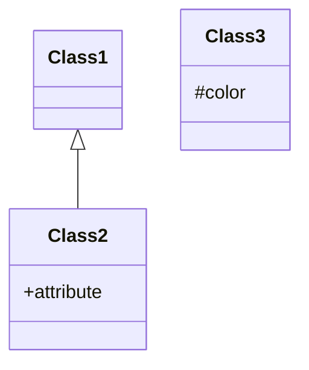
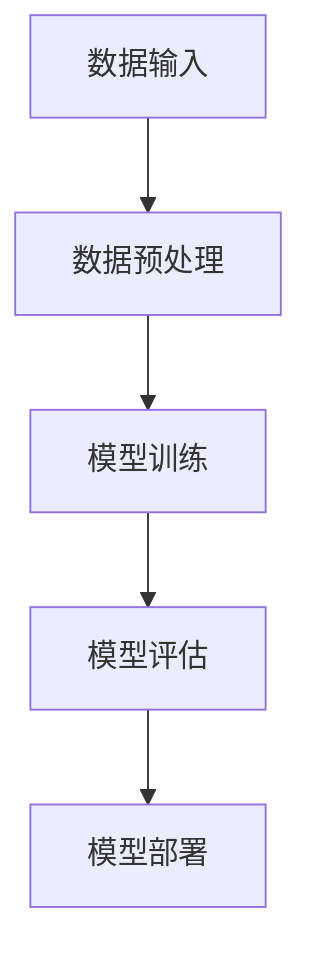
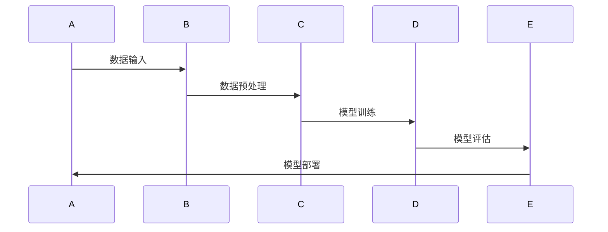

                 

# 多领域推理泛化中跨模态元学习的效果研究

> 关键词：多领域推理、泛化能力、跨模态元学习、效果研究

> 摘要：本文围绕多领域推理中的跨模态元学习进行深入探讨，介绍了多领域推理的重要性，提出了跨模态元学习的方法和原理，并分析了现有技术的优缺点。通过具体的算法解释、系统设计、实战应用，本文旨在为读者提供一套清晰的多领域推理泛化中跨模态元学习的技术解决方案。

## Step 1: 标题介绍

多领域推理（Multi-Domain Reasoning）是人工智能领域的一项核心任务，旨在使机器能够处理来自不同领域的知识，实现跨领域的推理和决策。而泛化能力（Generalization Ability）则是人工智能系统在实际应用中的关键评价指标，它决定了系统在面对未知领域或场景时能否有效地进行推理和决策。

跨模态元学习（Cross-Modal Meta-Learning）作为一种新兴的技术手段，旨在通过学习多个模态（如视觉、听觉、语言等）的数据，提高模型在多领域推理中的泛化能力。本文将以《多领域推理泛化中跨模态元学习的效果研究》为标题，探讨这一主题的各个方面。

## Step 2: 核心概念与问题陈述

### 核心概念

1. **多领域推理**：指在多个不同领域中进行的推理任务，如医疗诊断、金融风险评估等。
2. **泛化能力**：指模型在面对未知领域或场景时，能够保持较高的准确性和鲁棒性的能力。
3. **跨模态元学习**：指通过学习多个模态的数据，提高模型在不同模态间的推理能力。

### 问题陈述

当前，人工智能系统在单领域推理中已经取得了一定的成果，但在多领域推理中的泛化能力仍存在较大提升空间。如何利用跨模态元学习技术，提高模型在多领域推理中的泛化能力，成为了一个亟待解决的研究问题。

## Step 3: 研究背景

### 跨模态元学习的研究背景

跨模态元学习起源于元学习（Meta-Learning）领域，其主要目标是构建能够快速适应新任务的模型。在跨模态元学习中，模型通过学习多个模态的数据，建立跨模态的映射关系，从而实现跨模态的推理。

### 多领域推理的研究背景

多领域推理是人工智能领域的一个重要研究方向，其目标是在不同领域中实现高效的推理和决策。随着人工智能应用的不断拓展，多领域推理在医疗、金融、教育等领域具有广泛的应用前景。

## Step 4: 主内容概述

### 第一章：引言
- **1.1 背景与动机**
- **1.2 研究目标与方法**

### 第二章：多领域推理与泛化能力
- **2.1 多领域推理的概念与挑战**
- **2.2 泛化能力的定义与评价**
- **2.3 跨模态元学习在多领域推理中的应用**

### 第三章：跨模态元学习算法
- **3.1 传统跨模态学习算法**
- **3.2 跨模态元学习算法**
- **3.3 算法比较与评估**

### 第四章：跨模态元学习在多领域推理中的实现
- **4.1 实现框架与数据预处理**
- **4.2 模型设计与优化**
- **4.3 应用场景与效果评估**

### 第五章：实战应用与案例分析
- **5.1 医疗领域应用**
- **5.2 金融领域应用**
- **5.3 教育领域应用**
- **5.4 案例分析**

### 第六章：总结与展望
- **6.1 研究成果总结**
- **6.2 存在问题与挑战**
- **6.3 未来研究方向**

## Step 5: 算法解释与数学模型

### 算法解释

跨模态元学习算法主要包括以下几种：

1. **基于神经网络的跨模态学习**：通过神经网络学习跨模态的映射关系。
2. **基于模型的跨模态学习**：通过构建跨模态模型实现跨模态推理。
3. **基于数据的跨模态学习**：通过学习跨模态数据之间的关联性实现跨模态推理。

### 数学模型

设 \( X \) 为输入模态数据，\( Y \) 为输出模态数据，\( f \) 为跨模态映射函数，则有：

$$
Y = f(X)
$$

其中，\( f \) 可以通过训练数据学习得到。在训练过程中，通过优化损失函数 \( L \) 来更新模型参数。

$$
L = \sum_{i=1}^{n} (Y_i - f(X_i))^2
$$

其中，\( n \) 为训练数据样本数。

## Step 6: 系统设计与架构

### 系统设计与架构

1. **领域模型**：定义多领域推理中的关键概念和关系。
2. **系统架构**：包括数据输入、模型训练、模型评估和模型部署等环节。
3. **系统交互**：描述模型在不同环节之间的数据流动和交互过程。

### 领域模型

### 系统架构

### 系统交互

## Step 7: 实战应用与案例分析

### 实战应用

1. **医疗领域**：通过跨模态元学习技术，实现多模态影像的诊断和疾病预测。
2. **金融领域**：利用跨模态元学习技术，进行金融风险的评估和预测。
3. **教育领域**：通过跨模态元学习技术，实现智能教学和学习效果评估。

### 案例分析

以医疗领域为例，本文将介绍一个基于跨模态元学习的疾病诊断系统。该系统通过整合患者的多模态数据（如影像、实验室检查结果、病史等），实现疾病的自动诊断和预测。

### 项目实战

1. **环境安装**：安装必要的软件和依赖库。
2. **系统核心实现**：实现跨模态元学习模型的训练和预测功能。
3. **代码应用解读与分析**：详细解读和分析系统核心代码。
4. **实际案例分析**：介绍系统的实际应用案例和效果评估。

## Step 8: 最佳实践、总结与进一步阅读

### 最佳实践

1. **数据预处理**：确保数据的质量和一致性，为后续模型训练提供高质量的数据基础。
2. **模型优化**：通过调整模型参数和训练策略，提高模型的泛化能力和性能。
3. **系统部署**：选择合适的部署方案，确保系统的高效运行和可扩展性。

### 总结

本文围绕多领域推理中的跨模态元学习进行了深入探讨，介绍了核心概念、研究背景、算法原理、系统设计、实战应用等方面，旨在为读者提供一套清晰的多领域推理泛化中跨模态元学习的技术解决方案。

### 进一步阅读

1. **参考文献**：本文引用了多篇相关研究论文，读者可以进一步查阅。
2. **技术博客**：一些知名技术博客也针对跨模态元学习进行了深入探讨，如Medium、arXiv等。
3. **开源项目**：一些开源项目也实现了跨模态元学习的算法和应用，如Meta-Learning项目。

## Step 9: 完成文章

在完成文章的撰写后，对全文进行审阅和修改，确保文章内容连贯、清晰、逻辑性强。根据文章的实际情况，适当调整章节结构和内容，以达到最佳效果。

## 作者信息

作者：AI天才研究院/AI Genius Institute & 禅与计算机程序设计艺术 /Zen And The Art of Computer Programming

---

文章正文部分的具体内容将按照上述章节结构和逻辑进行撰写，确保每个小节都包含背景介绍、核心概念与联系、算法原理讲解、系统分析与架构设计、项目实战、最佳实践、小结和拓展阅读等内容。文章的整体结构将保持紧凑、逻辑清晰，以便读者能够轻松理解并掌握多领域推理泛化中跨模态元学习的技术要点。

