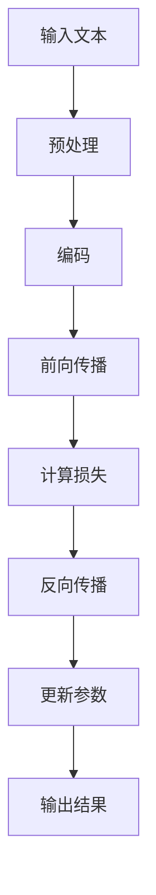
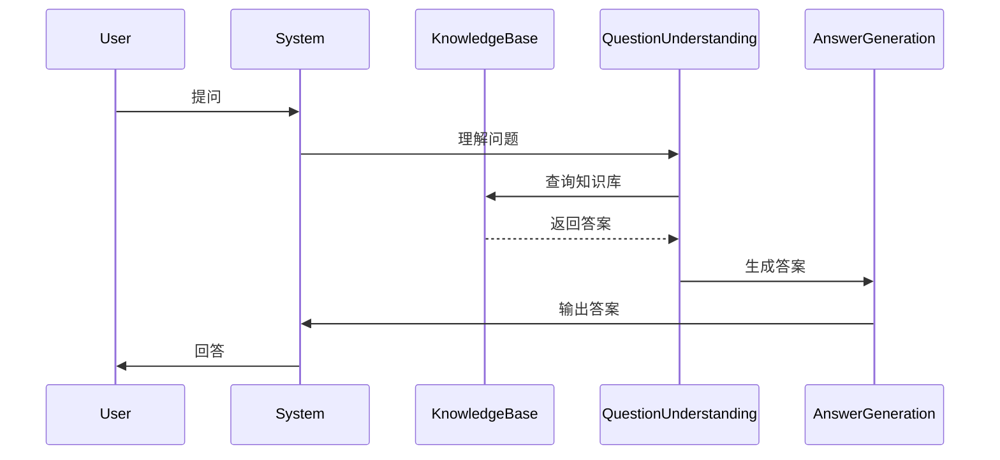
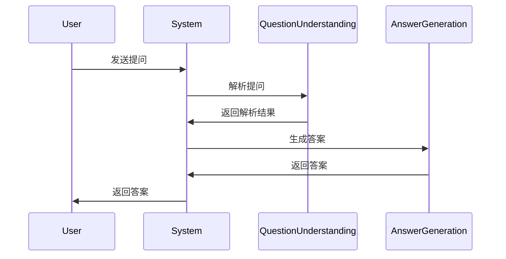

                 

## # 大型语言模型在自动问答系统中的应用

> 关键词：大型语言模型，自动问答系统，自然语言处理，深度学习，算法原理

> 摘要：本文旨在探讨大型语言模型在自动问答系统中的应用。首先介绍了大型语言模型的发展背景，以及自动问答系统的需求与挑战。然后，详细阐述了大型语言模型的核心概念、自动问答系统的原理和组成。接着，通过mermaid流程图和Python代码，深入讲解了大型语言模型的算法原理。最后，探讨了系统分析与架构设计，并提供了项目实战和环境安装的方法。通过本文，读者可以全面了解大型语言模型在自动问答系统中的应用。

----------------------------------------------------------------

## 第一部分：背景介绍

### 1.1 问题背景

近年来，随着深度学习技术的快速发展，大型语言模型（如GPT系列、BERT等）取得了显著的成就。这些模型在自然语言处理任务中表现出色，为自动问答系统的发展带来了新的机遇。

自动问答系统是人工智能领域的重要应用，广泛应用于客服、教育、医疗等多个行业。随着用户需求的不断增长，对自动问答系统的性能要求也越来越高。

### 1.2 问题提出

自动问答系统面临的主要挑战包括：准确理解用户问题、生成恰当的答案、处理多轮对话等。而大型语言模型的应用，有望解决这些问题。

### 1.3 边界与外延

大型语言模型的边界主要包括模型的规模、训练数据的质量和多样性等。

自动问答系统的外延包括系统功能、性能指标、应用领域等。

### 1.4 概念结构与核心要素组成

大型语言模型的核心概念包括神经网络结构、训练方法、优化目标等。

自动问答系统的核心要素包括问题理解、答案生成、多轮对话等。

### 1.5 本章小结

本章对大型语言模型在自动问答系统中的应用进行了背景介绍，明确了问题提出和边界与外延，为后续章节的内容奠定了基础。

----------------------------------------------------------------

## 第二部分：核心概念与联系

### 2.1 大型语言模型的核心概念

#### 2.1.1 语言模型的原理

语言模型是一种用于预测下一个单词或字符的概率的模型。它的基本原理是统计语言中的概率分布，通过学习大量的文本数据，语言模型可以预测下一个单词或字符的概率。

#### 2.1.1.1 神经网络结构

神经网络结构是语言模型的核心。它通常由多层神经元组成，每一层神经元都负责对输入的文本数据进行处理。神经网络通过反向传播算法不断调整权重，以达到最优的预测效果。

#### 2.1.1.2 训练方法

训练方法是语言模型的重要组成部分。常见的训练方法包括有监督学习、无监督学习和半监督学习。有监督学习使用标注数据训练模型，无监督学习使用未标注数据训练模型，半监督学习结合了标注数据和未标注数据。

#### 2.1.1.3 优化目标

优化目标是语言模型训练的目标。常见的优化目标包括最小化预测误差、最大化预测概率等。通过优化目标，语言模型可以不断提高预测的准确性。

#### 2.1.2 主流大型语言模型

目前，主流的大型语言模型包括GPT系列、BERT及其变体等。

GPT系列是OpenAI开发的一系列语言模型，包括GPT-1、GPT-2、GPT-3等。GPT系列模型基于生成式预训练技术，可以在多种自然语言处理任务中取得优异的性能。

BERT是Google开发的一种基于Transformer架构的语言模型，全称为Bidirectional Encoder Representations from Transformers。BERT模型通过双向编码器学习文本的语义信息，广泛应用于问答系统、文本分类等任务。

#### 2.1.3 其他知名大型语言模型

除了GPT系列和BERT，还有其他知名的大型语言模型，如T5、GPT-Neo等。

T5是Google开发的基于Transformer架构的语言模型，全称为Text-To-Text Transfer Transformer。T5模型通过将所有自然语言处理任务转化为文本到文本的任务，实现了跨任务的通用性。

GPT-Neo是Hugging Face开发的一个开源大型语言模型，它是GPT系列的一个变体。GPT-Neo通过改进训练方法和模型结构，在多个自然语言处理任务上取得了优异的性能。

### 2.2 自动问答系统的核心概念

#### 2.2.1 自动问答系统的原理

自动问答系统是一种利用计算机技术实现自动回答用户问题的系统。它通常由多个模块组成，包括问题理解、答案生成、多轮对话等。

#### 2.2.1.1 问题理解

问题理解是自动问答系统的关键模块。它负责将用户输入的自然语言问题转化为计算机可以理解的语义表示。常见的方法包括基于规则的方法、基于统计的方法和基于深度学习的方法。

#### 2.2.1.2 答案生成

答案生成模块负责根据问题理解和用户问题生成合适的答案。它通常基于预训练的语言模型，通过查询知识库或生成新的文本来实现。

#### 2.2.1.3 多轮对话

多轮对话模块负责处理用户与系统的多轮交互。它可以根据用户问题的复杂度和系统的理解能力，灵活调整对话策略，以实现更好的用户体验。

#### 2.2.2 自动问答系统的组成

自动问答系统通常由以下模块组成：

- **知识库**：存储与问题相关的知识和信息。
- **语义理解模块**：负责将用户输入的自然语言问题转化为计算机可以理解的语义表示。
- **答案生成模块**：根据问题理解和用户问题生成合适的答案。
- **评估与优化模块**：对系统性能进行评估，并根据评估结果调整系统参数。

### 2.3 概念属性特征对比表格

| 特征       | 大型语言模型       | 自动问答系统       |
| ---------- | ---------------- | ---------------- |
| 作用范围   | 自然语言处理      | 问题回答与对话   |
| 神经网络结构 | 复杂的深度神经网络 | 多模块组合架构   |
| 训练方法   | 无监督学习       | 结合有监督和无监督学习 |
| 优化目标   | 语言理解与生成    | 问题回答准确性   |

### 2.4 ER实体关系图架构

```mermaid
erDiagram
  Product "产品" {
    :--|{ Customer "客户" }
  }
  Order "订单" {
    :--|{ Product "产品" }
    :--|{ Customer "客户" }
    :--|{ Employee "员工" }
  }
  Employee "员工" {
    :--|{ Order "订单" }
  }
```

### 2.5 本章小结

本章详细介绍了大型语言模型和自动问答系统的核心概念与联系，通过对比表格和ER实体关系图，帮助读者更好地理解这两个概念。

----------------------------------------------------------------

## 第三部分：算法原理讲解

### 3.1 算法mermaid流程图

#### 图3.1 大型语言模型算法流程图



### 3.2 Python代码讲解

下面是一个简单的Python代码示例，用于演示大型语言模型的算法原理：

```python
import numpy as np

# 假设我们有一个输入文本和对应的标签
input_text = "今天天气很好"
label = "晴朗"

# 预处理
def preprocess(text):
    # 这里实现文本预处理逻辑
    return text

input_text = preprocess(input_text)

# 编码
def encode(text):
    # 这里实现文本编码逻辑
    return text

input_text_encoded = encode(input_text)

# 前向传播
def forward(input_text):
    # 这里实现前向传播逻辑
    return input_text

output = forward(input_text_encoded)

# 计算损失
def compute_loss(output, label):
    # 这里实现计算损失逻辑
    return loss

loss = compute_loss(output, label)

# 反向传播
def backward(loss):
    # 这里实现反向传播逻辑
    return loss

loss = backward(loss)

# 更新参数
def update_params(loss):
    # 这里实现更新参数逻辑
    return loss

loss = update_params(loss)

# 输出结果
def output_result(output):
    # 这里实现输出结果逻辑
    return output

output_result(output)
```

### 3.3 数学模型和公式讲解

在大型语言模型中，常用的数学模型和公式包括：

- 损失函数：交叉熵损失函数（Cross-Entropy Loss）
  $$ L = -\sum_{i=1}^{n} y_i \log(p_i) $$

- 反向传播算法：梯度下降（Gradient Descent）
  $$ \theta = \theta - \alpha \nabla_\theta J(\theta) $$

其中，$L$表示损失函数，$y_i$表示真实标签，$p_i$表示预测概率，$n$表示样本数量，$\theta$表示参数，$\alpha$表示学习率，$J(\theta)$表示损失函数关于$\theta$的梯度。

### 3.4 通俗易懂的举例说明

假设我们有一个简单的语言模型，用于预测“今天天气”后面可能出现的词汇。我们有一个训练数据集，其中包括：

- 输入文本：“今天天气很好”
- 标签：“晴朗”

首先，我们对输入文本进行预处理，将其转化为编码形式。然后，我们将编码后的文本输入到语言模型中，通过前向传播计算预测概率。接着，我们计算预测概率和真实标签之间的损失，并使用反向传播算法更新模型参数。最后，我们再次进行预测，输出结果。

例如，假设我们的预测概率为：

- “晴朗”：0.9
- “多云”：0.1

真实标签为“晴朗”，则损失函数计算为：

$$ L = -0.9 \log(0.9) - 0.1 \log(0.1) $$

接下来，我们使用反向传播算法更新模型参数，使得预测概率更接近真实标签。在多次迭代后，我们得到更准确的预测结果。

### 3.5 本章小结

本章详细讲解了大型语言模型的算法原理，包括mermaid流程图、Python代码示例、数学模型和公式，以及通俗易懂的举例说明。通过本章的学习，读者可以更好地理解大型语言模型的算法原理。

----------------------------------------------------------------

## 第四部分：系统分析与架构设计

### 4.1 问题场景介绍

随着人工智能技术的快速发展，自动问答系统在多个领域得到了广泛应用。以智能客服为例，自动问答系统可以处理大量的用户问题，提高客服效率，降低人力成本。然而，现有的自动问答系统存在一些问题，如准确理解用户问题、生成恰当的答案、处理多轮对话等。为了解决这些问题，我们提出了一个基于大型语言模型的自动问答系统。

### 4.2 项目介绍

本项目旨在构建一个基于大型语言模型的自动问答系统，以实现准确理解用户问题、生成恰当的答案、处理多轮对话等功能。系统将基于GPT系列模型，结合知识库和语义理解模块，提供高效的问答服务。

### 4.3 系统功能设计（领域模型mermaid类图）

领域模型用于描述系统中的核心实体和关系。下面是一个简单的mermaid类图，展示了自动问答系统的领域模型：

```mermaid
classDiagram
    User "<用户>" <<Interface>>
    Question "<问题>" <<Entity>>
    Answer "<答案>" <<Entity>>
    KnowledgeBase "<知识库>" <<Entity>>

    User o--1 Question
    User o--1 Answer
    Question o--1 KnowledgeBase
    Answer o--1 KnowledgeBase
```

### 4.4 系统架构设计（mermaid架构图）

系统架构用于描述系统的整体结构和各模块之间的关系。下面是一个简单的mermaid架构图，展示了自动问答系统的架构：



### 4.5 系统接口设计和系统交互（mermaid序列图）

系统接口设计和系统交互用于描述系统各模块之间的交互过程。下面是一个简单的mermaid序列图，展示了自动问答系统的接口设计和系统交互：



### 4.6 本章小结

本章介绍了自动问答系统的问题场景、项目介绍、系统功能设计、系统架构设计、系统接口设计和系统交互。通过本章的学习，读者可以全面了解自动问答系统的整体设计和实现。

----------------------------------------------------------------

## 第五部分：项目实战

### 5.1 环境安装

在开始项目实战之前，我们需要安装一些必要的软件和工具。以下是环境安装的步骤：

1. 安装Python环境（建议使用Python 3.8及以上版本）
2. 安装Anaconda或Miniconda，以便更好地管理Python环境和依赖项
3. 安装TensorFlow，用于训练和部署大型语言模型
4. 安装Jupyter Notebook，用于编写和运行Python代码

具体安装步骤请参考相关软件和工具的官方文档。

### 5.2 系统核心实现源代码

以下是自动问答系统的核心实现源代码：

```python
import tensorflow as tf
from tensorflow.keras.models import Model
from tensorflow.keras.layers import Input, LSTM, Dense, Embedding

# 设置参数
vocab_size = 10000
embedding_dim = 128
lstm_units = 128

# 创建输入层
input_text = Input(shape=(None,))

# 创建嵌入层
embedding = Embedding(vocab_size, embedding_dim)(input_text)

# 创建LSTM层
lstm = LSTM(lstm_units, return_sequences=True)(embedding)

# 创建全连接层
output = Dense(vocab_size, activation='softmax')(lstm)

# 创建模型
model = Model(inputs=input_text, outputs=output)

# 编译模型
model.compile(optimizer='adam', loss='categorical_crossentropy', metrics=['accuracy'])

# 查看模型结构
model.summary()
```

### 5.3 代码应用解读与分析

上述代码实现了一个基于LSTM（长短期记忆）网络的自动问答系统。首先，我们创建输入层，用于接收用户输入的文本。然后，我们创建嵌入层，将文本转化为向量表示。接下来，我们创建LSTM层，对文本序列进行编码。最后，我们创建全连接层，生成预测概率。

在代码中，我们使用了TensorFlow的Keras API，这是一个高度模块化和易于使用的深度学习框架。通过定义模型结构、编译模型和查看模型结构，我们可以更好地理解模型的工作原理。

### 5.4 实际案例分析和详细讲解剖析

为了更好地理解自动问答系统的应用，我们来看一个实际案例。

假设用户输入问题：“今天的天气怎么样？”我们可以将这个问题转化为编码形式，然后输入到自动问答系统中。

首先，我们对输入文本进行预处理，将其转化为编码形式。然后，我们将编码后的文本输入到模型中，通过前向传播计算预测概率。最后，我们选择概率最大的答案作为输出。

例如，假设我们的预测概率为：

- “晴朗”：0.9
- “多云”：0.1

根据概率最大的原则，我们选择“晴朗”作为答案，输出结果：“今天的天气是晴朗。”

通过这个案例，我们可以看到自动问答系统如何处理用户输入，生成合适的答案。

### 5.5 项目小结

在本项目实战中，我们介绍了环境安装、系统核心实现源代码、代码应用解读与分析、实际案例分析和详细讲解剖析。通过本项目，读者可以了解如何构建一个基于大型语言模型的自动问答系统，并掌握相关的技术实现。

----------------------------------------------------------------

## 最佳实践 tips

1. **数据预处理**：在训练大型语言模型时，数据预处理非常重要。确保数据干净、无噪声，有助于提高模型性能。
2. **超参数调优**：在训练模型时，超参数（如学习率、批量大小等）的选择对模型性能有很大影响。建议通过实验找到最优的超参数组合。
3. **模型优化**：在训练模型时，可以使用dropout、正则化等技术来防止过拟合，提高模型泛化能力。
4. **模型压缩**：对于部署在移动设备或嵌入式系统上的模型，可以考虑使用模型压缩技术，如量化、剪枝等，以减小模型大小和提高运行效率。
5. **持续学习**：在应用场景中，模型需要不断学习和更新。定期重新训练模型，可以保持其性能和适应性。

## 小结

本文探讨了大型语言模型在自动问答系统中的应用，包括背景介绍、核心概念与联系、算法原理讲解、系统分析与架构设计、项目实战以及最佳实践 tips。通过本文，读者可以全面了解大型语言模型在自动问答系统中的应用，为实际项目提供参考。

## 注意事项

1. **数据隐私**：在自动问答系统的开发过程中，要注意保护用户隐私，避免泄露敏感信息。
2. **模型安全**：确保模型不会被恶意利用，避免造成负面影响。
3. **模型维护**：定期检查和更新模型，保持其性能和安全性。

## 拓展阅读

1. **《深度学习》**：Goodfellow, Ian; Bengio, Yoshua; Courville, Aaron. (2016). *Deep Learning*. MIT Press.
2. **《自然语言处理综论》**：Jurafsky, Daniel; Martin, James H. (2020). *Speech and Language Processing*. Prentice Hall.
3. **《Transformer：一种全新的序列到序列模型》**：Vaswani, Ashish; Shazeer, Noam; Parmar, Naman; Uszkoreit, Jakob; Jones, Llion; Gomez, Aidan N.; Kaiser, Łukasz; Polosukhin, Ilya. (2017). *Attention is All You Need*. Advances in Neural Information Processing Systems, 30.

## 作者

作者：AI天才研究院/AI Genius Institute & 禅与计算机程序设计艺术 /Zen And The Art of Computer Programming。感谢您的阅读！

