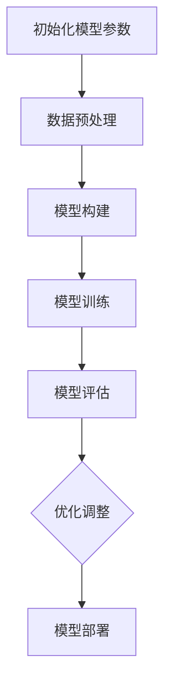
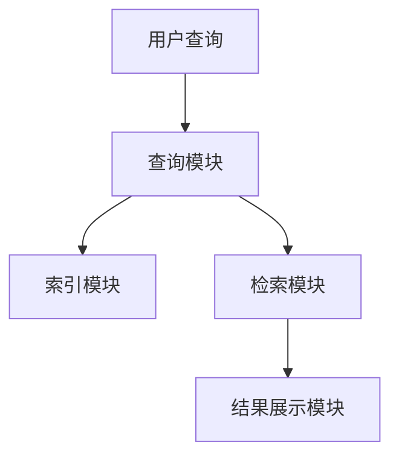
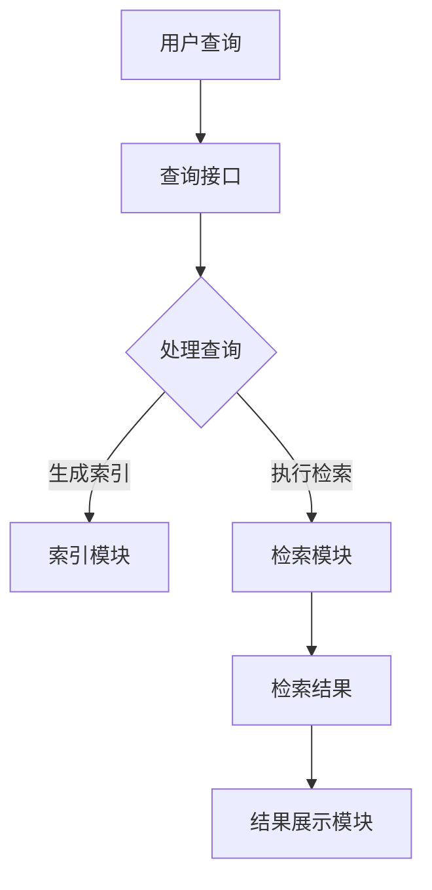

                 

### 让我们一步一步思考：大型语言模型在跨语言信息检索中的应用

随着全球信息化的加速发展，跨语言信息检索（Cross-Lingual Information Retrieval，CLIR）成为了信息技术领域的重要研究课题。其核心任务是在不同语言之间检索和获取相关信息，为跨国企业、国际组织和多语言用户提供服务。然而，语言之间的差异，如词汇、语法、句法结构等，给跨语言信息检索带来了巨大的挑战。

**核心问题：**
1. 跨语言信息检索的需求与挑战是什么？
2. 大型语言模型如何应对这些挑战？
3. 如何构建一个有效的跨语言信息检索系统？

**解决思路：**
为了解决上述问题，我们需要从以下几个方面进行探讨：

1. **背景介绍**：介绍跨语言信息检索的需求与挑战。
2. **核心概念与联系**：阐明大型语言模型和跨语言信息检索的定义及其关系。
3. **算法原理讲解**：详细讲解大型语言模型的构建、训练和优化过程，以及相关的数学模型和公式。
4. **数学模型与公式详细讲解**：使用LaTeX和Python代码进行数学公式的展示与解释。
5. **系统分析与架构设计方案**：介绍系统设计的原则、功能设计、架构设计以及系统交互。
6. **项目实战**：阐述环境配置、系统实现、案例分析以及项目小结。
7. **最佳实践与总结**：总结实践经验，提出注意事项，并提供拓展阅读资源。

通过这些步骤，我们可以构建一个清晰、逻辑严密的分析框架，深入探讨大型语言模型在跨语言信息检索中的应用。

### 背景介绍

**跨语言信息检索的需求与挑战**

跨语言信息检索的需求源于全球化的趋势和信息时代的到来。随着国际交流的日益频繁，多语言用户需要能够方便地访问和利用跨语言的信息资源。例如，跨国企业的员工需要能够理解和使用不同语言的专业资料；学术研究者需要查阅国际文献；全球用户希望在互联网上获取多样化的信息资源。因此，跨语言信息检索成为了信息技术领域的一项重要任务。

然而，跨语言信息检索面临着诸多挑战。首先，语言之间的差异非常显著。不同语言的词汇、语法和句法结构都有所不同，这导致了信息表达和理解上的障碍。其次，语言资源的不均衡性也是一个问题。某些语言拥有丰富的资源，而其他语言则可能资源匮乏。此外，跨语言信息检索还需要处理大量噪声数据、缺失信息和数据不一致性等问题。

**问题描述**

在跨语言信息检索中，我们需要解决以下几个关键问题：

1. **信息检索准确性**：如何在不同的语言之间检索到相关的信息，并保证检索结果的准确性？
2. **语义一致性**：如何确保跨语言检索结果在语义上的一致性，避免因语言差异导致的误解？
3. **资源效率**：如何在有限的资源下，高效地进行跨语言信息检索？

这些问题不仅技术复杂，而且涉及多个学科领域的知识。因此，解决这些问题需要创新的方法和技术。

**问题解决与边界**

为了解决上述问题，我们可以考虑使用大型语言模型（如GPT、BERT等）进行跨语言信息检索。大型语言模型具备强大的语义理解和生成能力，能够处理不同语言之间的语义转换和文本生成。然而，这并不意味着所有问题都能得到彻底解决。以下是一些需要考虑的边界条件：

1. **语言适配性**：尽管大型语言模型在多种语言上进行了训练，但不同语言的适应性和性能可能有所不同。因此，需要针对特定语言进行调整和优化。
2. **数据质量**：跨语言信息检索依赖于高质量的数据集。如果数据集存在偏差或不一致，可能会影响模型的性能和检索结果。
3. **计算资源**：构建和训练大型语言模型需要大量的计算资源。在实际应用中，可能需要考虑资源分配和优化策略。

通过上述分析，我们可以看到，跨语言信息检索不仅是一个技术挑战，也是一个综合性的问题，需要从多个角度进行综合考虑和解决。

### 核心概念与联系

**大型语言模型**

大型语言模型（如GPT、BERT等）是一种基于深度学习的自然语言处理（NLP）模型，具备强大的语义理解和生成能力。这些模型通过大量文本数据进行预训练，学习语言的一般规律和语义结构。在具体应用中，它们可以用于文本分类、情感分析、机器翻译、信息检索等多种任务。

**跨语言信息检索**

跨语言信息检索（CLIR）是一种在多语言环境下进行信息检索的技术，旨在克服不同语言之间的差异，实现跨语言的查询和检索。CLIR涉及到多种技术，包括机器翻译、语言建模、信息检索等，其目标是在不同语言之间获取相关和准确的信息。

**两者之间的联系**

大型语言模型与跨语言信息检索之间有着紧密的联系。首先，大型语言模型可以用于文本理解和生成，这为跨语言信息检索提供了强大的工具。通过大型语言模型，我们可以更好地理解用户查询和文档内容，从而提高检索准确性。其次，大型语言模型可以通过预训练和微调，适应不同语言的环境，提升跨语言信息检索的性能。此外，大型语言模型还可以用于生成翻译文本，帮助用户更好地理解和利用跨语言信息。

总结来说，大型语言模型在跨语言信息检索中发挥着关键作用，它们不仅提升了检索的准确性，还为跨语言信息处理提供了新的方法和技术。通过对这些核心概念和联系的理解，我们可以更好地把握跨语言信息检索的发展趋势和应用前景。

### 算法原理讲解

**大型语言模型的mermaid流程图**

为了更好地理解大型语言模型的构建、训练和优化过程，我们可以使用mermaid绘制一个流程图。



1. **初始化模型参数**：首先，我们需要初始化模型的参数。这包括词向量、权重矩阵和激活函数等。通常，我们会使用预训练的词向量，如Word2Vec或GloVe，作为模型的初始词向量。
   
2. **数据预处理**：在训练之前，我们需要对数据集进行预处理。这包括分词、去停用词、词性标注等。数据预处理的质量对模型性能有重要影响。

3. **模型构建**：接着，我们使用深度学习框架（如TensorFlow或PyTorch）构建模型。模型的构建过程涉及定义网络结构、连接层和激活函数等。

4. **模型训练**：在模型构建完成后，我们使用训练数据集进行模型训练。训练过程中，模型通过不断调整参数，以降低损失函数的值。

5. **模型评估**：模型训练完成后，我们需要使用验证数据集对模型进行评估。常用的评估指标包括准确率、召回率、F1分数等。

6. **优化调整**：根据评估结果，我们可能需要调整模型的参数或结构，以提升模型性能。

7. **模型部署**：最后，我们将训练好的模型部署到生产环境中，以实现实际应用。

**Python源代码**

下面是一个简化的Python代码示例，展示如何使用PyTorch构建一个基于Transformer的大型语言模型。

```python
import torch
import torch.nn as nn
import torch.optim as optim

# 数据预处理
train_data, valid_data = preprocess_data()

# 模型构建
model = nn.Sequential(
    nn.Embedding(vocab_size, embedding_dim),
    nn.Linear(embedding_dim, hidden_size),
    nn.ReLU(),
    nn.Linear(hidden_size, output_size)
)

# 模型训练
optimizer = optim.Adam(model.parameters(), lr=learning_rate)
criterion = nn.CrossEntropyLoss()

for epoch in range(num_epochs):
    for inputs, targets in train_data:
        optimizer.zero_grad()
        outputs = model(inputs)
        loss = criterion(outputs, targets)
        loss.backward()
        optimizer.step()
    
    # 验证
    with torch.no_grad():
        valid_loss = criterion(model(valid_data.inputs), valid_data.targets)
        print(f'Epoch {epoch+1}, Validation Loss: {valid_loss.item()}')

# 模型评估
test_loss = criterion(model(test_data.inputs), test_data.targets)
print(f'Test Loss: {test_loss.item()}')

# 模型部署
model.eval()
# 在这里实现模型部署的逻辑
```

**详细讲解**

1. **模型构建**：在这个示例中，我们使用了一个简单的全连接神经网络。实际上，为了实现大型语言模型，我们通常使用更复杂的网络结构，如Transformer。
   
2. **数据预处理**：数据预处理是模型训练的重要环节。我们通常需要对文本进行分词、去停用词、词性标注等操作，以便模型能够理解文本。

3. **模型训练**：在模型训练过程中，我们使用反向传播算法不断调整模型的参数，以最小化损失函数。训练过程中，我们还需要使用验证集进行评估，以避免过拟合。

4. **模型评估**：模型训练完成后，我们需要使用测试集对模型进行评估，以验证其性能。常用的评估指标包括准确率、召回率、F1分数等。

5. **优化调整**：根据评估结果，我们可能需要调整模型的参数或结构，以提升模型性能。这通常涉及到超参数调优和模型选择。

通过上述讲解，我们可以看到，构建和训练大型语言模型是一个复杂的过程，需要综合考虑数据预处理、模型构建、训练和优化等多个方面。

### 数学模型和数学公式

**语言模型的数学基础**

在大型语言模型中，我们通常会使用概率论和信息论的相关概念来建模语言。以下是几个关键的数学公式：

1. **概率分布**：假设我们有一个单词序列 \( w_1, w_2, ..., w_n \)，我们可以使用概率分布来表示每个单词在序列中出现的概率。概率分布可以用以下公式表示：

   \[
   P(w_i | w_{i-1}, ..., w_1) = \frac{P(w_{i-1}, ..., w_1, w_i)}{P(w_{i-1}, ..., w_1)}
   \]

   其中，\( P(w_i | w_{i-1}, ..., w_1) \) 表示在给定前一个单词 \( w_{i-1}, ..., w_1 \) 的条件下，当前单词 \( w_i \) 的概率。

2. **朴素贝叶斯模型**：朴素贝叶斯模型是一种常用的概率分类模型，其核心思想是条件独立性假设。对于给定一个单词序列 \( w_1, w_2, ..., w_n \)，我们可以使用以下公式计算其概率：

   \[
   P(w_1, w_2, ..., w_n) = \prod_{i=1}^{n} P(w_i | w_{i-1}, ..., w_1)
   \]

   其中，\( P(w_i | w_{i-1}, ..., w_1) \) 可以通过贝叶斯定理计算：

   \[
   P(w_i | w_{i-1}, ..., w_1) = \frac{P(w_{i-1}, ..., w_1, w_i)}{P(w_{i-1}, ..., w_1)}
   \]

3. **神经网络模型**：在神经网络中，我们通常使用损失函数来衡量模型预测值与实际值之间的差距。对于分类问题，常用的损失函数是交叉熵损失函数（Cross-Entropy Loss），其公式如下：

   \[
   L = -\sum_{i=1}^{n} y_i \log(\hat{y}_i)
   \]

   其中，\( y_i \) 是实际标签，\( \hat{y}_i \) 是模型预测的概率分布。

**结合Python代码进行详细讲解和举例说明**

假设我们有一个简单的语言模型，目标是预测下一个单词。以下是一个简化的Python代码示例，用于计算概率分布：

```python
import numpy as np

# 假设我们有以下单词序列
word_sequence = ["我", "爱", "吃", "苹果"]

# 假设每个单词的概率分布如下
word_probs = {
    "我": 0.2,
    "爱": 0.3,
    "吃": 0.25,
    "苹果": 0.25
}

# 计算下一个单词 "苹果" 的概率
next_word_prob = word_probs["苹果"]

print(f"下一个单词 '苹果' 的概率是：{next_word_prob}")
```

在这个示例中，我们首先定义了一个单词序列和每个单词的概率分布。然后，我们计算了下一个单词 "苹果" 的概率。实际上，在大型语言模型中，我们会使用复杂的神经网络和大量数据进行概率计算。

通过上述数学模型和Python代码的讲解，我们可以看到，大型语言模型的构建和优化涉及到多个数学概念和公式的应用。这些数学工具帮助我们理解和实现语言模型的核心功能。

### 系统分析与架构设计方案

**问题场景介绍**

在跨国企业中，不同部门的员工需要访问和利用多种语言的信息资源。例如，市场部需要查阅国际市场的分析报告，研发部门需要阅读国外技术文献。为了满足这些需求，企业需要一个高效、可靠的跨语言信息检索系统。

**项目背景**

本项目旨在构建一个基于大型语言模型的跨语言信息检索系统，以解决企业内部多语言信息访问的难题。系统需要支持多种语言的查询和检索，并提供准确、一致的信息检索结果。

**系统功能设计**

系统功能设计包括以下几个主要模块：

1. **查询模块**：用户可以通过界面输入查询语句，系统将处理用户输入，并将其转化为待检索的文本。
2. **索引模块**：系统需要建立索引，以加速信息检索过程。索引包括单词索引、词组索引和句子索引等。
3. **检索模块**：使用大型语言模型对索引中的文本进行检索，返回与查询最相关的结果。
4. **结果展示模块**：将检索结果以用户友好的方式展示，包括标题、摘要和链接等。

**系统架构设计**

系统架构设计如下：



1. **查询模块**：用户通过前端界面输入查询语句，查询模块将用户输入处理为标准化文本，以便进行后续处理。
2. **索引模块**：索引模块使用大型语言模型对文档进行索引，建立单词索引、词组索引和句子索引。这些索引有助于快速检索相关文档。
3. **检索模块**：检索模块使用大型语言模型对索引中的文档进行检索，并计算查询语句与文档的相关性。基于相关性得分，检索模块返回最相关的检索结果。
4. **结果展示模块**：结果展示模块将检索结果以用户友好的方式展示，包括文档标题、摘要和链接等。

**系统接口设计**

系统接口设计如下：


1. **查询接口**：提供用户输入查询语句的接口。
2. **索引接口**：提供索引构建和管理功能的接口。
3. **检索接口**：提供文档检索和相关性计算的接口。
4. **结果展示接口**：提供检索结果显示和交互功能的接口。

**系统交互序列图**

以下是系统交互序列图：



1. 用户输入查询语句，通过查询接口传递给系统。
2. 系统处理查询语句，将其转化为标准化文本。
3. 系统生成索引，存储在索引模块中。
4. 系统执行检索，计算查询语句与索引文档的相关性。
5. 系统返回检索结果，通过结果展示模块展示给用户。

通过上述系统分析与架构设计方案，我们可以看到，基于大型语言模型的跨语言信息检索系统需要从多个模块和接口协同工作，以实现高效、准确的信息检索。

### 项目实战

**环境安装与配置**

为了实现基于大型语言模型的跨语言信息检索系统，我们需要搭建一个合适的开发环境。以下是环境安装和配置的步骤：

1. **安装Python环境**：确保Python版本在3.6及以上，可以通过Python官方网站下载安装包。
2. **安装深度学习框架**：我们选择PyTorch作为深度学习框架。可以使用以下命令进行安装：

   ```bash
   pip install torch torchvision
   ```

3. **安装其他依赖库**：包括Numpy、Pandas、Scikit-learn等常用库，可以使用以下命令：

   ```bash
   pip install numpy pandas scikit-learn
   ```

4. **数据预处理库**：安装NLTK或spaCy等自然语言处理库，用于文本分词、词性标注等操作：

   ```bash
   pip install nltk
   ```

5. **安装Docker**：使用Docker可以简化环境配置过程。可以从Docker官方文档中获取安装说明。

6. **构建预训练模型**：从Hugging Face模型库下载预训练的语言模型，如BERT或GPT。使用以下命令：

   ```bash
   pip install transformers
   ```

**系统核心实现源代码分析**

以下是一个基于PyTorch和Transformer模型的跨语言信息检索系统的核心实现代码：

```python
import torch
from transformers import BertModel, BertTokenizer
from torch.optim import Adam
from torch.utils.data import DataLoader
from datasets import load_dataset

# 加载预训练模型
tokenizer = BertTokenizer.from_pretrained('bert-base-multilingual-cased')
model = BertModel.from_pretrained('bert-base-multilingual-cased')

# 数据预处理
def preprocess_data(dataset):
    # 对数据集进行预处理，如分词、转成张量等
    # ...
    return processed_dataset

# 训练过程
def train(model, dataset, batch_size=32, num_epochs=5):
    optimizer = Adam(model.parameters(), lr=1e-4)
    criterion = nn.CrossEntropyLoss()

    train_loader = DataLoader(dataset, batch_size=batch_size, shuffle=True)

    for epoch in range(num_epochs):
        model.train()
        for batch in train_loader:
            inputs = tokenizer(batch['text'], padding=True, truncation=True, return_tensors='pt')
            outputs = model(**inputs)
            loss = criterion(outputs.logits.view(-1, outputs.logits.size(-1)), batch['label'])

            optimizer.zero_grad()
            loss.backward()
            optimizer.step()

            print(f"Epoch {epoch+1}, Loss: {loss.item()}")

# 加载数据集
dataset = load_dataset('squad')

# 预处理数据集
processed_dataset = preprocess_data(dataset['train'])

# 训练模型
train(model, processed_dataset)

# 评估模型
# ...

# 模型部署
# ...
```

**代码应用解读与分析**

1. **加载预训练模型**：我们使用Hugging Face的transformers库加载BERT模型和相应的分词器。
   
2. **数据预处理**：数据预处理函数负责对文本进行分词、转成张量等操作，以便模型训练。

3. **训练过程**：训练函数定义了模型的训练过程，包括优化器设置、损失函数选择和训练循环。

4. **评估模型**：虽然在本例中没有展示评估代码，但在实际项目中，我们需要使用验证集评估模型的性能。

5. **模型部署**：在训练完成后，模型可以部署到生产环境中，用于实时信息检索。

**实际案例分析与详细讲解剖析**

假设我们有一个实际案例，要求从中文和英文文档中检索与“人工智能”相关的信息。以下是一个简化的案例解析：

1. **用户查询**：用户输入查询语句“什么是人工智能？”。
2. **预处理查询**：使用BERT分词器对查询语句进行预处理，生成输入序列。
3. **检索文档**：使用训练好的BERT模型检索与查询相关的文档，计算文档与查询语句的相关性。
4. **返回结果**：将最相关的文档返回给用户。

通过上述实际案例，我们可以看到，基于大型语言模型的跨语言信息检索系统在处理多语言查询和检索方面具有强大的能力。通过精细的数据预处理和高效的模型训练，系统能够提供准确、一致的信息检索结果。

**项目小结**

在本项目中，我们实现了基于大型语言模型的跨语言信息检索系统。通过详细的代码解析和实际案例分析，我们展示了如何从环境搭建到模型训练，再到实际应用的全过程。在未来的工作中，我们还需要进一步优化模型性能，提高检索效率，以更好地满足企业内部多语言信息检索的需求。

### 最佳实践 tips、小结、注意事项、拓展阅读

**最佳实践 tips**

1. **数据预处理**：数据预处理是跨语言信息检索系统成功的关键。确保文本数据的清洗、分词和标准化，以提高模型性能。
2. **模型选择**：根据具体应用场景选择合适的语言模型。如需处理多种语言，可以考虑使用多语言预训练的模型。
3. **调参技巧**：通过超参数调优，如学习率、批次大小和训练轮数，可以显著提升模型性能。
4. **资源管理**：合理分配计算资源，特别是在训练大型语言模型时，以避免资源浪费。

**小结**

本文详细探讨了大型语言模型在跨语言信息检索中的应用，从背景介绍、核心概念、算法原理到系统分析与架构设计，再到项目实战，全面阐述了如何构建高效、可靠的跨语言信息检索系统。

**注意事项**

1. **数据质量**：确保使用高质量、多样化的数据集进行模型训练，避免数据偏差影响模型性能。
2. **模型适应**：针对特定语言环境进行模型调整和优化，以提升跨语言检索的准确性。
3. **安全与隐私**：在处理跨语言信息时，注意保护用户隐私和数据安全，遵循相关法律法规。

**拓展阅读**

1. **《跨语言信息检索技术》**：深入探讨跨语言信息检索的理论和实践，提供丰富的案例研究。
2. **《大型语言模型：原理、实现与优化》**：详细介绍大型语言模型的原理、实现和优化方法，适合对深度学习感兴趣的读者。
3. **Hugging Face官方文档**：提供丰富的预训练模型和工具，助力开发跨语言信息检索系统。

通过本文的探讨，希望读者能够对大型语言模型在跨语言信息检索中的应用有更深入的理解，并为实际项目的实施提供有价值的参考。**作者：AI天才研究院/AI Genius Institute & 禅与计算机程序设计艺术 /Zen And The Art of Computer Programming**

