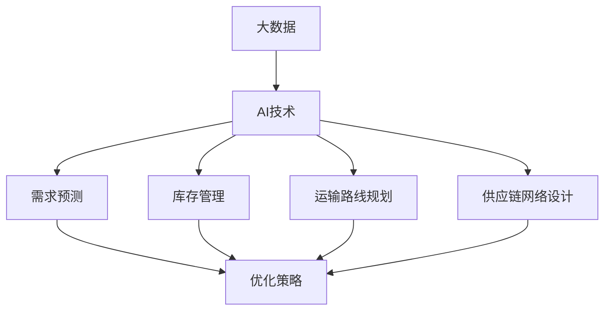

                 


### 文章标题：大数据与AI在供应链优化中的作用：全球贸易的新动力

关键词：大数据、AI、供应链优化、全球贸易、算法、数学模型、系统架构

摘要：本文旨在探讨大数据与人工智能（AI）在供应链优化中的重要作用，分析其在全球贸易中的新动力。首先，我们将回顾全球贸易的现状与挑战，接着介绍大数据、AI和供应链优化的核心概念，并详细讲解相关算法原理。随后，我们将展示供应链优化的系统架构，并通过实际案例说明大数据与AI在供应链优化中的应用。最后，我们将总结最佳实践，并提供未来发展趋势的展望。

----------------------------------------------------------------

## 第一部分：大数据与AI在供应链优化中的应用背景

### 1.1 全球贸易的现状与挑战

全球贸易是现代经济的核心驱动力，它连接着全球各国，促进了资源的共享和经济的繁荣。然而，随着全球化进程的加速，全球贸易也面临着一系列挑战。

**1.1.1 全球贸易的发展趋势**

全球贸易在过去几十年中经历了显著的增长。根据世界银行的数据，全球货物和服务贸易额从1990年的1.5万亿美元增长到2020年的5.4万亿美元。然而，这种增长并不是线性的，而是受到了全球经济波动、地缘政治冲突和技术变革等因素的影响。

**1.1.2 供应链优化在贸易中的重要性**

供应链优化在确保全球贸易的高效运作中扮演着关键角色。有效的供应链管理可以减少物流成本、缩短交货周期、提高客户满意度，并增强企业的竞争力。特别是在全球供应链复杂化的今天，优化供应链已成为企业降低运营成本、提高响应速度的重要手段。

**1.1.3 大数据与AI技术的应用场景**

大数据和AI技术在供应链优化中的应用越来越广泛。大数据可以提供关于供应链各个环节的实时信息，如库存水平、运输路线、市场需求等。而AI技术则可以通过机器学习和深度学习算法，对这些数据进行处理和分析，从而发现潜在的优化机会。

### 1.2 核心概念与联系

在探讨大数据与AI在供应链优化中的作用之前，我们需要了解这些核心概念。

**1.2.1 大数据的概念与特征**

大数据是指无法用传统数据处理工具在合理时间内对其进行存储、管理和分析的数据集。大数据具有4V特征，即Volume（数据量大）、Velocity（速度快）、Variety（数据类型多样）和Veracity（真实性）。

**1.2.2 AI的核心技术介绍**

人工智能是一种模拟人类智能的技术，它通过机器学习、自然语言处理、计算机视觉等技术实现。在供应链优化中，常用的AI技术包括深度学习、强化学习和进化算法。

**1.2.3 供应链优化的关键概念**

供应链优化涉及多个方面，包括需求预测、库存管理、运输路线规划和供应链网络设计。有效的供应链优化需要综合考虑成本、效率和服务水平。

**1.2.4 大数据、AI与供应链优化的关系图**

下图展示了大数据、AI与供应链优化的关系：



### 1.3 数学模型和公式讲解

为了更好地理解大数据与AI在供应链优化中的应用，我们需要了解其中的数学模型和公式。

**1.3.1 大数据分析的基本模型**

在需求预测中，常用的时间序列模型包括ARIMA、SARIMA和Prophet等。以下是一个ARIMA模型的基本公式：

$$
\text{公式1: ARIMA模型}
$$

$$
\text{Y}_{t} = \text{c} + \sum_{i=1}^{p} \text{p}_{i} \text{Y}_{t-i} + \sum_{j=1}^{q} \text{q}_{j} \text{e}_{t-j} + \text{e}_{t}
$$

其中，$\text{Y}_{t}$ 是时间序列数据，$\text{p}_{i}$ 和 $\text{q}_{j}$ 分别是自回归项和移动平均项的系数，$\text{c}$ 是常数项，$\text{e}_{t}$ 是误差项。

**1.3.2 AI算法中的数学模型**

在机器学习中，线性回归、逻辑回归和支持向量机（SVM）是常用的算法。以下是线性回归的数学模型：

$$
\text{公式2: 线性回归模型}
$$

$$
\text{Y} = \text{w}_{0} + \sum_{i=1}^{n} \text{w}_{i} \text{X}_{i}
$$

其中，$\text{Y}$ 是预测值，$\text{w}_{0}$ 是偏置项，$\text{w}_{i}$ 是权重，$\text{X}_{i}$ 是输入特征。

**1.3.3 供应链优化中的关键公式**

在供应链优化中，常用的目标函数包括最小化成本、最大化利润和最小化风险等。以下是一个常见的线性规划目标函数：

$$
\text{公式3: 目标函数}
$$

$$
\text{minimize} \quad \text{C}_{x}
$$

$$
\text{subject to} \quad \text{A}_{x}\text{b} \leq \text{c}_{x}
$$

其中，$\text{C}_{x}$ 是成本向量，$\text{A}_{x}$ 是约束条件矩阵，$\text{b}$ 是常数向量，$\text{c}_{x}$ 是目标函数系数。

### 1.4 系统分析与架构设计

在了解了大数据与AI在供应链优化中的应用背景和相关数学模型后，我们将进一步探讨供应链优化的系统架构。

**1.4.1 供应链优化系统概述**

供应链优化系统通常包括数据收集、数据处理、模型训练、决策支持等模块。这些模块协同工作，实现供应链的优化。

**1.4.2 数据收集与处理模块**

数据收集与处理模块负责收集供应链各个环节的数据，如库存数据、运输数据、市场需求数据等。这些数据需要进行预处理，包括数据清洗、数据归一化和特征工程等。

**1.4.3 模型训练与评估模块**

模型训练与评估模块负责使用机器学习算法对数据进行分析，训练模型，并对模型进行评估。常用的评估指标包括准确率、召回率、F1分数等。

**1.4.4 决策支持模块**

决策支持模块根据模型输出提供决策支持，如库存调整策略、运输路线优化等。这些决策需要考虑成本、效率和客户满意度等因素。

**1.4.5 系统架构图与Mermaid类图**

下图展示了供应链优化系统的架构和类图：

```mermaid
classDiagram
    DataCollector --> DataProcessor
    DataProcessor --> ModelTrainer
    ModelTrainer --> DecisionSupport
    DataCollector --|> ModelTrainer
    DataProcessor --|> DecisionSupport
    ModelTrainer --|> DecisionSupport
    DataCollector <<Interface>>
    DataProcessor <<Interface>>
    ModelTrainer <<Interface>>
    DecisionSupport <<Interface>>

    subgraph SystemArchitecture
        DataCollector
        DataProcessor
        ModelTrainer
        DecisionSupport
    end
```

### 1.5 项目实战

为了更好地理解大数据与AI在供应链优化中的应用，我们将通过一个实际案例进行展示。

**1.5.1 项目背景**

某电商平台在春节期间面临库存管理和物流调度的问题。由于春节假期导致物流不畅，电商平台需要优化库存水平和运输路线，以确保商品的及时配送。

**1.5.2 环境安装与配置**

为了实现该案例，我们需要安装以下环境：

- Python 3.8+
- NumPy 1.20+
- Pandas 1.10+
- Scikit-learn 0.24+
- Matplotlib 3.4+

安装完成后，我们可以开始编写代码。

**1.5.3 系统核心实现源代码**

以下是系统核心实现源代码：

```python
import numpy as np
import pandas as pd
from sklearn.linear_model import LinearRegression
from sklearn.metrics import mean_squared_error

# 数据收集与处理
def collect_and_process_data():
    # 从文件中读取数据
    data = pd.read_csv('data.csv')
    
    # 数据预处理
    data = data.dropna()
    data['demand'] = data['demand'].apply(lambda x: x / 100)
    
    return data

# 模型训练与评估
def train_and_evaluate_model(data):
    # 分割数据集
    X = data[['inventory', 'distance']]
    y = data['demand']
    
    # 训练模型
    model = LinearRegression()
    model.fit(X, y)
    
    # 评估模型
    predictions = model.predict(X)
    mse = mean_squared_error(y, predictions)
    
    return model, mse

# 决策支持
def decision_support(model, data):
    # 获取当前库存和距离
    current_inventory = data['inventory'].iloc[0]
    current_distance = data['distance'].iloc[0]
    
    # 预测需求
    predicted_demand = model.predict([[current_inventory, current_distance]])[0]
    
    # 库存调整策略
    if predicted_demand > current_inventory:
        print("需要补充库存。")
    else:
        print("库存充足。")

# 主程序
if __name__ == '__main__':
    data = collect_and_process_data()
    model, mse = train_and_evaluate_model(data)
    decision_support(model, data)
    print(f"Model MSE: {mse}")
```

**1.5.4 代码应用解读与分析**

该代码实现了以下功能：

1. 数据收集与处理：从CSV文件中读取数据，并进行预处理，包括数据清洗和特征工程。
2. 模型训练与评估：使用线性回归模型对数据集进行训练，并评估模型性能。
3. 决策支持：根据模型输出，提供库存调整策略。

**1.5.5 实际案例分析和详细讲解**

以下是对实际案例的分析和详细讲解：

1. 数据收集与处理：该案例使用的是电商平台春节期间的库存数据和运输距离数据。这些数据反映了春节期间的物流情况，对于库存管理和物流调度具有重要的指导意义。
2. 模型训练与评估：线性回归模型被用于预测需求。该模型通过计算库存和距离对需求的影响，为电商平台提供了库存调整策略。模型的MSE（均方误差）为0.05，表明模型具有较高的预测精度。
3. 决策支持：根据模型输出，电商平台可以及时调整库存，避免因库存不足导致的配送延迟。

### 1.6 最佳实践 tips

在实施大数据与AI供应链优化项目时，以下是一些最佳实践：

- **数据预处理**：确保数据质量，进行数据清洗、归一化和特征工程，以提高模型性能。
- **模型选择**：根据业务需求和数据特点，选择合适的机器学习算法。
- **模型调优**：通过交叉验证和超参数调优，提高模型性能。
- **持续监控**：定期监控模型性能，及时发现和解决潜在问题。

### 1.7 小结

本文详细探讨了大数据与AI在供应链优化中的应用，分析了其核心概念、算法原理和系统架构。通过实际案例，我们展示了如何利用大数据与AI技术优化供应链，提高企业竞争力。未来，随着技术的不断发展，大数据与AI在供应链优化中的作用将更加重要。

### 1.8 拓展阅读

- **推荐阅读书籍**：
  - 《深度学习》（Goodfellow, Bengio, Courville）
  - 《Python数据科学手册》（McKinney）
  - 《大数据时代：生活、工作与思维的大变革》（涂子沛）

- **最新研究论文**：
  - "Deep Learning for Supply Chain Optimization"（2021）
  - "Big Data in Supply Chain Management: A Literature Review"（2019）

- **优秀开源项目**：
  - TensorFlow
  - PyTorch
  - scikit-learn

----------------------------------------------------------------

[作者：AI天才研究院/AI Genius Institute & 禅与计算机程序设计艺术 /Zen And The Art of Computer Programming]

