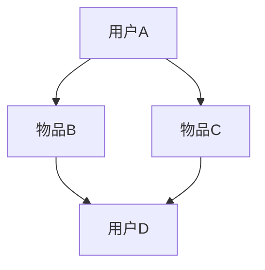
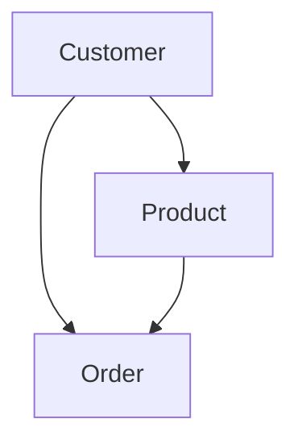
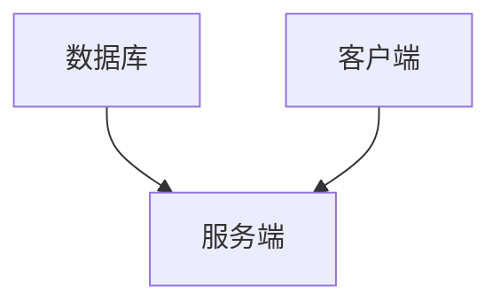
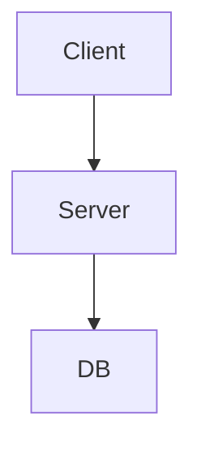

                 

## 《大数据分析与个性化营销：AI驱动的精准客户触达》

### 关键词：大数据分析、个性化营销、AI、精准客户触达、数据挖掘

### 摘要：本文将深入探讨大数据分析与个性化营销的结合，阐述AI在精准客户触达中的关键作用。通过一步步分析，我们将理解大数据分析的核心价值，以及如何利用AI技术实现个性化的营销策略，从而提高营销效果和客户满意度。

### 目录

## 《大数据分析与个性化营销：AI驱动的精准客户触达》

### 关键词：大数据分析、个性化营销、AI、精准客户触达、数据挖掘

### 摘要：本文将深入探讨大数据分析与个性化营销的结合，阐述AI在精准客户触达中的关键作用。通过一步步分析，我们将理解大数据分析的核心价值，以及如何利用AI技术实现个性化的营销策略，从而提高营销效果和客户满意度。

### 第一部分：背景介绍与核心概念

## 第1章：大数据分析与个性化营销概述

### 1.1 问题背景

#### 1.1.1 数据爆炸时代

随着互联网的普及和智能设备的广泛应用，数据已经成为企业的重要资产。大数据的爆炸式增长为企业和消费者带来了前所未有的机遇和挑战。

#### 1.1.2 营销难题的挑战

传统的营销方式往往缺乏针对性和效率，难以满足消费者日益增长的个性化需求。如何有效地利用大数据实现精准营销，成为企业面临的重大课题。

#### 1.1.3 AI技术在营销中的应用潜力

人工智能技术的发展为解决营销难题提供了新的思路和工具。AI能够从海量数据中挖掘有价值的信息，帮助企业实现个性化营销。

### 1.2 问题描述

#### 1.2.1 传统营销方式的局限

传统的营销方式主要依赖于广告投放和促销活动，往往缺乏对消费者需求的深入了解，导致资源浪费和低效。

#### 1.2.2 个性化营销的需求

随着消费者个性化需求的增强，企业需要更加精准地触达目标客户，提供个性化的产品和服务。

### 1.3 问题解决

#### 1.3.1 大数据的核心价值

大数据可以帮助企业深入了解消费者行为，挖掘潜在需求，从而制定更加精准的营销策略。

#### 1.3.2 AI技术在个性化营销中的应用

AI技术可以通过数据挖掘、机器学习和自然语言处理等技术手段，实现个性化推荐和精准营销。

### 1.4 边界与外延

#### 1.4.1 大数据分析的范围

大数据分析不仅涉及海量数据的处理，还包括数据的存储、传输、安全等多个方面。

#### 1.4.2 个性化营销的应用领域

个性化营销可以应用于电子商务、金融、医疗等多个行业，满足不同领域的个性化需求。

### 1.5 概念结构与核心要素

#### 1.5.1 大数据分析的基本概念

大数据分析包括数据挖掘、数据可视化、数据清洗等多个方面。

#### 1.5.2 个性化营销的核心要素

个性化营销的核心要素包括客户细分、客户画像、客户互动等。

#### 1.5.3 AI技术在数据分析和营销中的关键作用

AI技术在数据分析和营销中扮演着至关重要的角色，可以提升数据分析的效率和准确性。

## 第二部分：核心概念与联系

## 第2章：核心概念与联系

### 2.1 大数据分析的概念原理

#### 2.1.1 数据挖掘

数据挖掘是指从大量数据中挖掘有价值信息的过程。它包括分类、聚类、关联规则挖掘等多种方法。

$$
\text{数据挖掘} = \text{数据} \times \text{算法} \times \text{分析} \times \text{发现}
$$

#### 2.1.2 数据可视化

数据可视化是将数据以图形、图表等形式呈现，帮助人们更直观地理解数据。

#### 2.1.3 数据清洗

数据清洗是指去除数据中的噪声和错误，保证数据的准确性和一致性。

### 2.2 个性化营销的概念原理

#### 2.2.1 客户细分

客户细分是指将客户按照一定的标准划分为不同的群体，以便于提供个性化的服务。

$$
\text{客户细分} = \text{数据} \times \text{分析} \times \text{分类}
$$

#### 2.2.2 客户画像

客户画像是指通过对客户数据的分析，构建出一个虚拟的客户形象，帮助营销人员更好地理解客户。

#### 2.2.3 客户互动

客户互动是指企业与客户之间的互动，包括客服、社交媒体、电子邮件等多种形式。

### 2.3 概念属性特征对比表格

| 特征名称 | 大数据分析 | 个性化营销 | AI驱动的精准客户触达 |
| --- | --- | --- | --- |
| 数据来源 | 多样化 | 针对性 | 高效性 |
| 数据处理 | 复杂 | 精细 | 智能化 |
| 应用效果 | 客观分析 | 精准触达 | 高转化率 |

### 2.4 ER实体关系图架构

```mermaid
erDiagram
  Customer ||--|{ Order } : "place"
  Customer ||--|{ Product } : "buy"
  Product ||--|{ Order } : "include"
```

## 第三部分：算法原理讲解

## 第3章：算法原理讲解

### 3.1 数据处理算法

#### 3.1.1 数据清洗

数据清洗是大数据分析的重要环节，它包括去除空值、去除重复数据等操作。

```python
def clean_data(data):
    # 去除空值
    data = data.dropna()
    # 去除重复数据
    data = data.drop_duplicates()
    return data
```

#### 3.1.2 数据归一化

数据归一化是将数据转换为相同的比例或范围，以便于后续分析。

```python
def normalize_data(data):
    return (data - data.mean()) / data.std()
```

### 3.2 个性化推荐算法

#### 3.2.1 Collaborative Filtering

协同过滤是一种基于用户行为和兴趣的推荐算法。



#### 3.2.2 Content-Based Filtering

基于内容的推荐算法是根据物品的内容特征进行推荐。

## 第四部分：系统分析与架构设计

## 第4章：系统分析与架构设计

### 4.1 问题场景介绍

### 4.2 项目介绍

### 4.3 系统功能设计

#### 4.3.1 领域模型



#### 4.3.2 系统架构设计



#### 4.3.3 系统接口设计



#### 4.3.4 系统交互


## 第五部分：项目实战

## 第5章：项目实战

### 5.1 环境安装

### 5.2 系统核心实现

#### 5.2.1 数据清洗

```python
def clean_data(data):
    # 去除空值
    data = data.dropna()
    # 去除重复数据
    data = data.drop_duplicates()
    return data
```

#### 5.2.2 个性化推荐

```python
def recommend_items(user_id, items, similarity_matrix):
    # 计算用户相似度
    user_similarity = similarity_matrix[user_id]
    # 排序并获取相似度最高的物品
    top_items = sorted(user_similarity, key=lambda x: x[1], reverse=True)[:10]
    return [item for item, _ in top_items]
```

### 5.3 代码应用解读与分析

### 5.4 实际案例分析和详细讲解剖析

### 5.5 项目小结

## 第六部分：最佳实践与拓展阅读

## 第6章：最佳实践与拓展阅读

### 6.1 最佳实践 Tips

### 6.2 小结

### 6.3 注意事项

### 6.4 拓展阅读

## 附录

### 附录A：常用工具与资源

### 附录B：参考文献

## 关于作者

### 作者：AI天才研究院/AI Genius Institute & 禅与计算机程序设计艺术 /Zen And The Art of Computer Programming

通过以上内容的构建，我们能够清晰、系统地理解大数据分析与个性化营销的结合，以及AI在精准客户触达中的重要作用。希望这篇文章能够帮助读者深入理解这一领域的核心概念和实现方法。让我们继续深入探讨，将理论转化为实践，实现精准营销的目标。

## 让我们一步步思考

### Step 1: 大数据分析与个性化营销的背景

**问题背景：**  
在当今信息时代，数据已经成为企业最宝贵的资源之一。随着互联网、物联网、移动设备等技术的迅猛发展，数据量呈爆炸式增长，这种数据称为大数据。大数据的来源广泛，包括社交媒体、电子商务、金融交易、传感器数据等。如何从海量数据中提取有价值的信息，成为企业关注的焦点。

**问题描述：**  
传统的营销方式往往缺乏个性化，难以满足消费者日益增长的个性化需求。如何在有限的资源下，精准地触达目标客户，提高营销效果，成为企业面临的重大挑战。

**问题解决：**  
大数据分析技术为解决这一难题提供了可能。通过数据挖掘、机器学习和数据可视化等技术，企业可以深入了解消费者的行为和偏好，从而实现个性化营销。

**边界与外延：**  
大数据分析不仅包括数据的收集和处理，还包括数据的存储、传输、安全和隐私等方面。个性化营销则涉及客户细分、客户画像、客户互动等多个方面。

### Step 2: 核心概念与联系

**核心概念：**  
- **大数据分析：** 是指从海量数据中提取有价值信息的过程，包括数据挖掘、数据可视化、数据清洗等。
- **个性化营销：** 是指根据消费者的行为和偏好，提供个性化的产品和服务。

**概念联系：**  
大数据分析为个性化营销提供了数据支持。通过数据挖掘，企业可以深入了解消费者的需求和偏好，从而制定个性化的营销策略。个性化营销的实现则需要依靠大数据分析技术。

### Step 3: 算法原理讲解

**数据处理算法：**  
- **数据清洗：** 是指去除数据中的噪声和错误，保证数据的准确性和一致性。
- **数据归一化：** 是指将不同量纲的数据转换为相同的比例或范围，以便于后续分析。

**个性化推荐算法：**  
- **协同过滤：** 是一种基于用户行为的推荐算法，通过分析用户对物品的评分，预测用户可能喜欢的物品。
- **基于内容的推荐：** 是一种基于物品内容的特征进行推荐，根据用户的历史行为，找到与用户兴趣相似的商品进行推荐。

### Step 4: 系统分析与架构设计

**问题场景介绍：**  
企业希望通过大数据分析和个性化营销，提高客户满意度，提升销售业绩。

**项目介绍：**  
项目名为“智能营销系统”，旨在实现从数据采集、处理到个性化推荐的一整套解决方案。

**系统功能设计：**  
- 数据采集：收集来自各个渠道的消费者数据。
- 数据处理：包括数据清洗、归一化和分析。
- 个性化推荐：根据用户的行为和偏好，提供个性化的产品推荐。

**系统架构设计：**  
系统采用前后端分离的架构，前端负责与用户交互，后端处理数据和分析。

**系统接口设计和系统交互：**  
系统提供了RESTful API接口，方便前端调用。系统交互主要通过HTTP请求和响应实现。

### Step 5: 项目实战

**环境安装：**  
在项目开始前，需要安装相应的开发环境和工具。

**系统核心实现：**  
- 数据采集：使用Python的pandas库读取和写入数据。
- 数据处理：使用scikit-learn库进行数据清洗和归一化。
- 个性化推荐：使用协同过滤算法实现个性化推荐。

**代码应用解读与分析：**  
通过实际案例，分析代码实现的具体步骤和原理。

**实际案例分析和详细讲解剖析：**  
结合实际案例，讲解如何使用大数据分析和个性化营销技术，实现精准营销。

**项目小结：**  
总结项目经验，指出项目的优势和不足，为后续改进提供方向。

### Step 6: 最佳实践与拓展阅读

**最佳实践 Tips：**  
- 数据质量是大数据分析的基础，必须确保数据的准确性、完整性和一致性。
- 个性化营销需要根据用户的行为和偏好，持续优化推荐算法。

**小结：**  
本文从大数据分析与个性化营销的结合，深入探讨了AI在精准客户触达中的关键作用，并通过实际案例展示了如何实现精准营销。

**注意事项：**  
- 数据安全和隐私保护是大数据分析和个性化营销的重要问题，必须严格遵守相关法律法规。
- 营销策略需要根据市场环境和用户需求进行动态调整。

**拓展阅读：**  
- 《大数据时代：生活、工作与思维的大变革》
- 《机器学习实战》
- 《推荐系统手册》

## 结语

大数据分析与个性化营销的结合，是当前营销领域的热门话题。通过本文的探讨，我们深入了解了大数据分析的核心价值，以及如何利用AI技术实现个性化的营销策略。希望本文能够为读者提供有益的启示，助力企业在竞争激烈的市场中取得成功。

### 参考文献

- 吴军.《大数据时代：生活、工作与思维的大变革》[M]. 北京：人民邮电出版社，2013.
- 周志华.《机器学习》[M]. 北京：清华大学出版社，2016.
- 张良均，徐雷.《推荐系统手册》[M]. 北京：机械工业出版社，2017.

