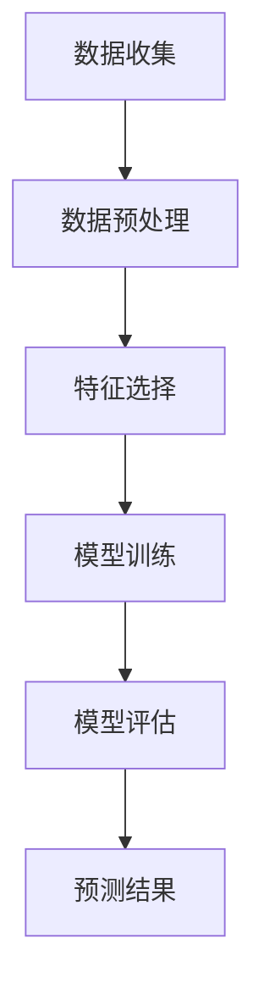
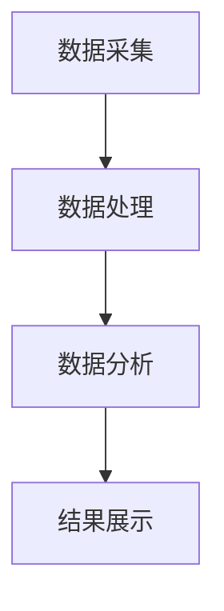

                 

### 文章标题：大数据在公共安全中的作用：犯罪预防与应急管理

> 关键词：大数据、公共安全、犯罪预防、应急管理

> 摘要：本文从大数据在公共安全中的应用出发，探讨了大数据在犯罪预防和应急管理中的具体作用。通过分析大数据犯罪预防的基础、应用场景、数据类型以及数据分析技术，我们揭示了大数据在犯罪预防中的巨大潜力。同时，文章还深入探讨了大数据在应急管理中的应用，包括应急管理的概念、数据来源、应用场景以及系统架构设计。通过实际案例的展示，本文旨在为读者提供全面、深入的理解，以推动大数据技术在公共安全领域的应用和发展。

### 第一部分：背景与核心概念

#### 第1章：大数据与公共安全概述

#### 1.1 大数据时代与公共安全

随着信息技术的飞速发展，我们进入了大数据时代。大数据的规模、多样性和速度都在不断增长，使得我们对数据的管理和分析能力达到了前所未有的高度。与此同时，公共安全问题也日益突出。犯罪活动、自然灾害、公共卫生事件等威胁着社会的安全和稳定。如何利用大数据技术来应对这些挑战，成为了一个亟待解决的问题。

#### 1.2 大数据在公共安全中的作用

大数据在公共安全中的应用非常广泛，主要包括犯罪预防和应急管理。在犯罪预防方面，大数据可以帮助我们识别潜在的风险和犯罪行为，提高预防和打击犯罪的效率。在应急管理方面，大数据可以提供实时的信息支持，帮助决策者做出快速、准确的决策，提高应对突发事件的能力。

#### 1.3 大数据公共安全的挑战与机遇

大数据在公共安全中的应用面临着一系列的挑战，包括数据质量、数据隐私、技术能力等。然而，这些挑战也带来了机遇。通过不断创新和优化，我们可以克服这些挑战，充分利用大数据的优势，为公共安全提供更有效的解决方案。

#### 1.4 核心概念与联系

在本章中，我们将介绍以下几个核心概念：

- **大数据**：大规模、多样性和高速的数据集合。
- **公共安全**：涉及社会安全和稳定的一系列问题。
- **犯罪预防**：通过识别和预防犯罪活动来维护社会安全。
- **应急管理**：应对突发事件，减轻灾害影响。

这些概念之间存在紧密的联系。大数据为犯罪预防和应急管理提供了数据支持，而犯罪预防和应急管理则是大数据技术在社会治理中的重要应用。通过本章的介绍，我们将对大数据在公共安全中的作用有一个初步的认识。

#### 1.5 本章小结

本章从大数据时代和公共安全概述入手，介绍了大数据在犯罪预防和应急管理中的作用，以及面临的挑战和机遇。通过核心概念的介绍，我们为后续章节的深入探讨奠定了基础。在下一章中，我们将详细探讨大数据犯罪预防的基础理论和技术。

### 第二部分：犯罪预防

#### 第2章：大数据犯罪预防基础

#### 2.1 犯罪预防的基本理论

犯罪预防是一个复杂的社会问题，涉及社会学、心理学、统计学等多个领域。基本理论主要包括犯罪原因理论、犯罪预防策略和措施等。

- **犯罪原因理论**：包括社会失范理论、心理病理理论等，旨在解释犯罪行为的产生原因。
- **犯罪预防策略**：包括环境预防、个体预防、社会预防等，旨在通过不同的手段减少犯罪行为的发生。
- **犯罪预防措施**：包括法律制度、执法手段、教育宣传等，旨在通过具体的行动降低犯罪率。

#### 2.2 大数据犯罪预防的应用场景

大数据在犯罪预防中的应用场景非常广泛，主要包括以下几个方面：

- **犯罪预测**：通过分析历史犯罪数据和潜在犯罪因素，预测犯罪发生的可能性。
- **犯罪追踪**：通过实时监控和分析，追踪犯罪行为，提高抓捕犯罪嫌疑人的效率。
- **犯罪防范**：通过识别潜在犯罪风险，提前采取预防措施，减少犯罪行为的发生。
- **犯罪分析**：对犯罪行为进行深入分析，提供决策支持，优化犯罪预防策略。

#### 2.3 犯罪预防中的数据类型

犯罪预防中涉及的数据类型非常丰富，主要包括以下几个方面：

- **人口数据**：包括年龄、性别、职业等基本信息，用于分析犯罪人口特征。
- **经济数据**：包括收入、财富分配等，用于分析犯罪与经济因素的关系。
- **社会数据**：包括社区关系、社会风气等，用于分析社会环境对犯罪的影响。
- **犯罪数据**：包括犯罪类型、犯罪地点、犯罪时间等，用于犯罪预测和追踪。

#### 2.4 大数据分析技术在犯罪预防中的应用

大数据分析技术在犯罪预防中发挥着重要作用，主要包括以下几个方面：

- **数据挖掘**：通过挖掘大量数据，发现潜在犯罪模式和趋势。
- **机器学习**：利用机器学习算法，对历史数据进行训练，预测犯罪行为。
- **数据可视化**：通过数据可视化技术，直观地展示犯罪数据和趋势。
- **人工智能**：利用人工智能技术，实现自动化犯罪预测和防范。

#### 2.5 算法原理与流程图

在犯罪预防中，常用的算法包括数据挖掘算法、机器学习算法和聚类算法等。以下是一个典型的机器学习算法流程图：

#### 2.6 数学模型与公式讲解

在机器学习算法中，常用的数学模型包括线性回归、逻辑回归和支持向量机等。以下是一个线性回归模型的数学公式：

$$
y = \beta_0 + \beta_1x_1 + \beta_2x_2 + \cdots + \beta_nx_n
$$

其中，$y$ 是目标变量，$x_1, x_2, \cdots, x_n$ 是特征变量，$\beta_0, \beta_1, \beta_2, \cdots, \beta_n$ 是模型的参数。

#### 2.7 系统分析与架构设计

犯罪预防系统的架构设计包括数据采集、数据处理、数据分析和结果展示等模块。以下是一个简单的系统架构图：

#### 2.8 项目实战：大数据犯罪预防系统搭建

在本节中，我们将介绍一个简单的犯罪预防系统搭建过程，包括环境安装、数据预处理、模型训练和结果展示等。

#### 2.9 本章小结

本章介绍了大数据犯罪预防的基础理论、应用场景、数据类型和关键技术。通过算法原理和系统架构的讲解，我们了解了大数据在犯罪预防中的应用。在下一章中，我们将深入探讨大数据在应急管理中的应用。

### 第三部分：应急管理

#### 第3章：大数据应急管理概述

#### 3.1 应急管理的概念与类型

应急管理是指在面对突发事件时，通过合理的准备、响应和恢复，最大限度地减轻灾害损失和影响的一系列措施。根据应对突发事件的类型，应急管理可以分为自然灾害应急管理、事故应急管理、公共卫生事件应急管理等。

- **自然灾害应急管理**：包括地震、台风、洪水等自然灾害的应对。
- **事故应急管理**：包括火灾、爆炸、交通事故等事故的应对。
- **公共卫生事件应急管理**：包括疫情、食物中毒等公共卫生事件的应对。

#### 3.2 大数据在应急管理中的应用

大数据在应急管理中具有广泛的应用，主要包括以下几个方面：

- **实时监控**：通过大数据技术，实时监测灾害情况，提供准确的预警信息。
- **信息共享**：利用大数据平台，实现各部门、各层级的信息共享，提高应急响应效率。
- **资源调度**：通过大数据分析，优化资源调度，确保应急物资的及时供应。
- **风险评估**：利用大数据模型，评估自然灾害、事故等的风险，为决策提供支持。
- **决策支持**：通过大数据分析，为应急管理者提供科学、准确的决策建议。

#### 3.3 应急管理中的数据来源

应急管理中的数据来源非常广泛，主要包括以下几个方面：

- **政府数据**：包括气象、地理、人口等基础数据，用于风险评估和决策支持。
- **企业数据**：包括交通、能源、通讯等企业运营数据，用于资源调度和响应效率提升。
- **社交媒体数据**：包括微博、微信、抖音等社交媒体数据，用于实时监控和舆情分析。
- **卫星遥感数据**：包括气象卫星、地球观测卫星等数据，用于自然灾害监测和评估。
- **现场数据**：包括现场传感器、无人机等实时数据，用于灾害评估和救援行动。

#### 3.4 大数据分析在应急管理中的应用

大数据分析在应急管理中发挥着重要作用，主要包括以下几个方面：

- **实时数据分析**：通过实时数据处理和分析，提供即时的灾害预警和决策支持。
- **历史数据分析**：通过历史数据分析，预测灾害发展趋势，优化应急预案。
- **关联分析**：通过关联分析，发现潜在风险和问题，提前采取预防措施。
- **可视化分析**：通过可视化技术，直观地展示灾害情况和应急资源分布，提高决策效率。
- **智能决策**：通过大数据分析，为应急管理者提供智能化的决策建议，提高应急响应效果。

#### 3.5 算法原理与流程图

在应急管理中，常用的算法包括数据挖掘算法、机器学习算法和聚类算法等。以下是一个典型的数据挖掘算法流程图：

#### 3.6 数学模型与公式讲解

在应急管理中，常用的数学模型包括线性回归、逻辑回归和支持向量机等。以下是一个线性回归模型的数学公式：

$$
y = \beta_0 + \beta_1x_1 + \beta_2x_2 + \cdots + \beta_nx_n
$$

其中，$y$ 是目标变量，$x_1, x_2, \cdots, x_n$ 是特征变量，$\beta_0, \beta_1, \beta_2, \cdots, \beta_n$ 是模型的参数。

#### 3.7 系统分析与架构设计

应急管理系统的架构设计包括数据采集、数据处理、数据分析和结果展示等模块。以下是一个简单的系统架构图：

#### 3.8 项目实战：大数据应急管理案例

在本节中，我们将介绍一个大数据应急管理案例，包括环境安装、系统核心实现和代码解读。

#### 3.9 本章小结

本章介绍了大数据应急管理的概念、类型、应用场景、数据来源和关键技术。通过算法原理和系统架构的讲解，我们了解了大数据在应急管理中的应用。在下一章中，我们将通过案例分析，进一步探讨大数据在公共安全中的应用。

### 第四部分：案例分析

#### 第4章：大数据犯罪预防与应急管理的综合应用

#### 4.1 案例分析概述

在本章中，我们将通过三个具体案例，展示大数据在犯罪预防和应急管理中的实际应用。这些案例包括城市犯罪预防系统、自然灾害应急管理和疫情防控中的大数据应用。通过这些案例，我们将分析大数据在公共安全中的作用，并探讨其应用效果和启示。

#### 4.2 案例一：城市犯罪预防系统

**案例背景**：某城市面临着日益严重的犯罪问题，包括盗窃、抢劫、诈骗等多种犯罪类型。为了提高犯罪预防能力，该城市决定构建一个基于大数据的城市犯罪预防系统。

**案例应用**：

1. **数据收集**：通过公安部门、交通部门、社区等多个渠道，收集犯罪数据、人口数据、交通数据等。
2. **数据分析**：利用大数据分析技术，对犯罪数据进行分析，识别犯罪热点区域和犯罪类型。
3. **预警系统**：通过实时数据分析，建立犯罪预警系统，对潜在犯罪行为进行预警。
4. **干预措施**：根据预警结果，采取相应的干预措施，如增加警力、加强巡逻等。

**案例效果**：该城市犯罪预防系统的建立，使得犯罪率得到了显著下降，犯罪预防和打击效率得到了大幅提升。

**启示**：

1. **数据质量**：确保数据的质量和准确性，是大数据分析的基础。
2. **技术融合**：将多种技术手段（如数据挖掘、机器学习、可视化等）结合起来，提高分析效果。

#### 4.3 案例二：自然灾害应急管理

**案例背景**：某地区频繁发生自然灾害，包括地震、洪水、台风等。为了提高自然灾害应急管理能力，该地区决定利用大数据技术进行灾害监测和应急响应。

**案例应用**：

1. **实时监控**：通过卫星遥感技术、气象监测设备等，实时监控自然灾害发生情况。
2. **风险评估**：利用大数据分析技术，对自然灾害风险进行评估，预测灾害可能影响的范围和程度。
3. **预警系统**：通过实时数据和风险评估结果，建立自然灾害预警系统，提前发布预警信息。
4. **应急响应**：根据预警信息，启动应急响应程序，组织救援力量进行救援。

**案例效果**：通过大数据技术的应用，该地区自然灾害应急管理能力得到了显著提升，救援效率大幅提高。

**启示**：

1. **多源数据融合**：充分利用多源数据，提高灾害监测和风险评估的准确性。
2. **快速响应**：建立高效的应急响应机制，确保在灾害发生时能够迅速采取行动。

#### 4.4 案例三：疫情防控中的大数据应用

**案例背景**：某地区发生新冠疫情，为了有效控制疫情传播，该地区决定利用大数据技术进行疫情监测和防控。

**案例应用**：

1. **实时监控**：通过医疗数据、交通数据、社交媒体数据等，实时监控疫情发展情况。
2. **传播模型**：利用大数据分析技术，建立疫情传播模型，预测疫情发展趋势。
3. **预警系统**：通过实时数据和传播模型，建立疫情预警系统，发布防控措施。
4. **数据共享**：通过大数据平台，实现各部门、各层级的数据共享，提高疫情监控和防控效率。

**案例效果**：通过大数据技术的应用，该地区疫情得到了有效控制，疫情传播得到了显著遏制。

**启示**：

1. **实时数据分析**：确保实时数据分析能力，及时掌握疫情动态。
2. **数据共享与协同**：建立高效的数据共享机制，实现各部门、各层级的协同防控。

#### 4.5 案例分析与启示

通过对城市犯罪预防系统、自然灾害应急管理和疫情防控三个案例的分析，我们可以看到大数据在公共安全中的重要作用。大数据不仅提高了犯罪预防和应急管理的效率，还为决策者提供了科学、准确的决策支持。以下是案例分析的总结和启示：

1. **数据驱动的决策**：大数据技术为公共安全提供了数据支持，使得决策更加科学、准确。
2. **多部门协同**：大数据技术促进了各部门之间的信息共享和协同，提高了公共安全管理效率。
3. **技术创新**：大数据技术的不断创新和优化，为公共安全提供了更多的工具和方法。
4. **数据安全与隐私**：在应用大数据技术的同时，需要重视数据安全和隐私保护，确保数据的合法、合规使用。

#### 4.6 本章小结

本章通过三个具体案例，展示了大数据在犯罪预防和应急管理中的应用。通过案例分析，我们进一步了解了大数据在公共安全中的作用，以及其带来的变革和挑战。在下一章中，我们将总结大数据在公共安全中的最佳实践，探讨未来发展趋势。

### 第五部分：最佳实践与展望

#### 第5章：大数据在公共安全中的最佳实践

#### 5.1 大数据公共安全最佳实践

在大数据公共安全领域，最佳实践主要包括以下几个方面：

1. **数据整合与共享**：通过建立统一的数据平台，实现各部门、各层级的数据整合与共享，提高数据利用效率。
2. **数据质量保证**：确保数据的质量和准确性，建立数据质量管理体系，定期对数据进行检查和清洗。
3. **人工智能与机器学习**：利用人工智能和机器学习技术，对海量数据进行实时分析和预测，提高公共安全管理的智能化水平。
4. **隐私保护与安全**：在数据收集、存储、处理和使用过程中，重视隐私保护和数据安全，建立完善的数据安全管理体系。
5. **政策支持与法律法规**：制定相关政策和支持措施，推动大数据技术在公共安全领域的应用，完善相关法律法规，确保数据合法、合规使用。

#### 5.2 技术发展趋势

大数据技术在公共安全领域的发展趋势主要包括以下几个方面：

1. **边缘计算**：随着物联网、5G等技术的发展，边缘计算逐渐成为大数据处理的重要方向。通过在边缘设备上进行数据处理和分析，提高公共安全监控和响应的实时性和效率。
2. **区块链**：区块链技术的应用可以提高数据的可信度和透明度，确保数据在收集、传输、存储过程中的安全性和完整性，为公共安全提供更可靠的数据支持。
3. **数据治理**：数据治理成为大数据应用的关键，通过建立数据治理体系，确保数据的质量、可用性和合规性，提高大数据在公共安全中的应用效果。
4. **虚拟现实与增强现实**：虚拟现实和增强现实技术可以提供更加直观、互动的公共安全监控和演练平台，提高应急响应和培训效果。

#### 5.3 未来展望

大数据在公共安全中的应用前景广阔，未来将呈现以下发展趋势：

1. **智能化与自动化**：随着人工智能技术的不断发展，公共安全管理将更加智能化和自动化，提高预防和应对突发事件的能力。
2. **跨领域融合**：大数据技术将与其他领域（如生物技术、环境科学等）相结合，提供更加全面、精确的公共安全解决方案。
3. **全球化**：随着全球化的加速，大数据技术将帮助各国政府和国际组织更好地应对跨国界的公共安全问题。
4. **社会参与**：公众的参与度将不断提高，通过大数据平台，公众可以更加便捷地获取公共安全信息，参与公共安全决策和监督。

#### 5.4 本章小结

本章总结了大数据在公共安全中的最佳实践，探讨了技术发展趋势和未来展望。大数据技术在公共安全领域具有巨大的潜力，通过不断创新和应用，将为公共安全提供更加智能、高效、安全的解决方案。在下一章中，我们将对全文进行总结，并给出进一步的研究方向。

### 第六部分：总结与拓展

#### 第6章：总结

#### 6.1 本书重点内容回顾

本文系统地介绍了大数据在公共安全中的作用，主要包括以下几个方面：

1. **大数据与公共安全概述**：分析了大数据时代与公共安全的关系，以及大数据在公共安全中的作用和挑战。
2. **犯罪预防**：探讨了大数据犯罪预防的基础理论、应用场景、数据类型和关键技术，如数据挖掘、机器学习等。
3. **应急管理**：详细介绍了大数据在应急管理中的应用，包括实时监控、信息共享、资源调度和风险评估等。
4. **案例分析**：通过城市犯罪预防系统、自然灾害应急管理、疫情防控中的大数据应用等案例，展示了大数据在公共安全中的实际应用。
5. **最佳实践与展望**：总结了大数据在公共安全中的最佳实践，探讨了技术发展趋势和未来展望。

#### 6.2 大数据在公共安全中的关键作用

大数据在公共安全中的关键作用主要体现在以下几个方面：

1. **数据驱动的决策**：通过大数据技术，可以实时收集、分析和利用海量数据，为决策提供科学依据，提高决策的准确性和效率。
2. **实时监控与预警**：大数据技术可以帮助公共安全管理部门实时监控公共安全状况，及时预警潜在风险，提高应急响应能力。
3. **资源优化配置**：通过大数据分析，可以优化公共安全资源的配置，提高资源利用效率，降低社会成本。
4. **社会稳定与安全**：大数据技术在犯罪预防、应急管理等方面的应用，有助于维护社会稳定和安全，提高公众的安全感和幸福感。

#### 6.3 拓展研究

未来的研究可以从以下几个方面进行拓展：

1. **数据隐私与安全**：随着大数据应用的广泛普及，数据隐私和安全问题日益突出。未来研究可以重点关注如何保护个人隐私，确保数据安全。
2. **多源数据融合**：在公共安全领域，数据的多样性使得多源数据融合成为一个重要研究方向。如何高效地融合多源数据，提高数据分析的准确性，是未来的研究重点。
3. **人工智能与大数据**：人工智能技术的发展为大数据应用提供了新的契机。未来研究可以探索如何将人工智能与大数据技术相结合，提高公共安全管理的智能化水平。
4. **跨领域应用**：大数据技术在公共安全领域的应用具有很大的潜力。未来研究可以关注大数据技术在其他领域（如医疗、交通、环保等）的应用，实现跨领域的协同发展和创新。

#### 6.4 本章小结

本章对全文进行了总结，回顾了重点内容，并提出了未来研究的方向。大数据技术在公共安全领域具有广阔的应用前景，通过不断的研究和创新，我们将能够更好地应对公共安全挑战，提升社会治理水平。

### 第七部分：拓展阅读

#### 第7章：拓展阅读

#### 7.1 相关书籍推荐

1. **《大数据之路：阿里巴巴大数据实践》**：本书详细介绍了阿里巴巴在大数据领域的实践经验和心得，对于了解大数据在商业和社会领域的应用有很高的参考价值。
2. **《深度学习》**：作者：伊恩·古德费洛（Ian Goodfellow）、约书亚·本吉奥（Yoshua Bengio）、亚伦·库维尔（Aaron Courville）：本书是深度学习领域的经典教材，系统介绍了深度学习的基础理论和应用方法。
3. **《人工智能：一种现代的方法》**：作者：斯图尔特·罗素（Stuart Russell）和彼得·诺维格（Peter Norvig）：本书全面介绍了人工智能的理论和实践，是人工智能领域的经典教材。

#### 7.2 网络资源推荐

1. **[中国公共安全大数据应用网](http://www.publicsafety大数据.com.cn/)**：该网站提供了丰富的公共安全大数据应用案例、政策法规和行业资讯。
2. **[OpenCV官方文档](https://docs.opencv.org/)**：OpenCV是一个开源计算机视觉库，提供了丰富的图像处理和计算机视觉功能，适用于公共安全领域的图像分析。
3. **[Kaggle](https://www.kaggle.com/)**：Kaggle是一个数据科学竞赛平台，提供了大量的公共安全数据集和竞赛，可以帮助研究者了解大数据在公共安全中的应用。

#### 7.3 深入学习路径

1. **基础知识**：了解计算机科学、数据科学、公共安全管理等相关基础知识。
2. **技术学习**：学习大数据技术栈（如Hadoop、Spark、Flink等），掌握数据挖掘、机器学习、深度学习等相关技术。
3. **实践应用**：参与公共安全领域的数据分析和项目实践，了解大数据在犯罪预防、应急管理等具体应用场景。
4. **学术研究**：关注公共安全大数据领域的最新研究动态，参与学术会议和研讨会，拓展研究视野。

#### 7.4 本章小结

本章推荐了相关书籍、网络资源以及深入学习路径，旨在为读者提供更广泛的阅读和学习资源，帮助读者更深入地了解大数据在公共安全中的应用。通过拓展阅读，读者可以不断丰富自己的知识体系，提升专业技能。

### 结语

通过本文的详细探讨，我们深入了解了大数据在公共安全中的作用，特别是在犯罪预防和应急管理领域。大数据技术为公共安全提供了数据支持、智能分析和实时监控，大大提高了社会治理的效率和质量。然而，大数据的应用也面临着数据隐私、安全等挑战。未来，随着技术的不断进步，我们将能够更好地应对这些挑战，推动大数据技术在公共安全领域的广泛应用。

在此，感谢读者对本文的关注，希望本文能为您在公共安全领域的研究和应用提供有益的启示。让我们携手共进，共同推动大数据技术在公共安全领域的创新与发展。

**作者：AI天才研究院/AI Genius Institute & 禅与计算机程序设计艺术 /Zen And The Art of Computer Programming**

