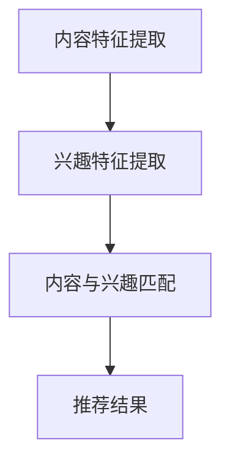
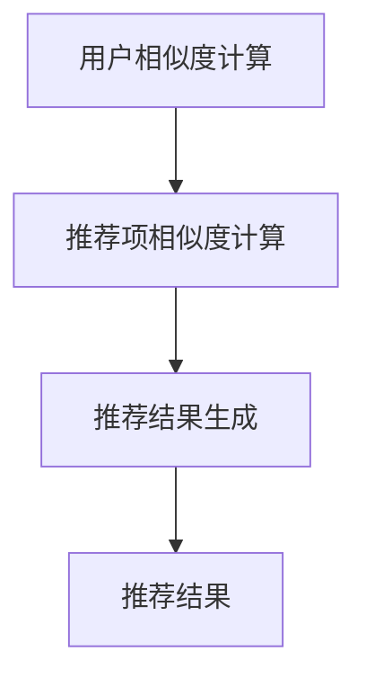
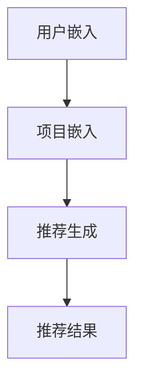

                 

### 文章标题：大数据在旅游业中的应用：个性化推荐与目的地管理

#### 关键词：大数据、个性化推荐、目的地管理、旅游业变革、数据挖掘、算法分析

#### 摘要：
随着旅游业的快速发展，大数据技术在提升服务质量、优化资源配置、增加客户满意度等方面发挥着重要作用。本文将深入探讨大数据在旅游业中的应用，特别是个性化推荐与目的地管理两大领域。通过系统的分析和实例讲解，本文旨在为业界提供关于如何利用大数据技术实现旅游业智能化转型的参考。

### 引言

旅游业作为全球经济的支柱产业之一，正面临着前所未有的变革。大数据技术的崛起，为旅游业带来了新的发展契机。通过大数据分析，旅游企业可以更好地理解客户需求，实现精准营销，优化服务流程，从而提升整体运营效率。本文将聚焦于两大关键应用领域：个性化推荐和目的地管理。

个性化推荐系统旨在根据用户的历史行为和偏好，为其推荐符合兴趣的旅游产品和服务。目的地管理则关注如何利用大数据分析目的地信息，优化旅游资源配置，提升游客体验。以下章节将依次探讨这两个领域，从概念理解到实际应用，逐步展示大数据在旅游业中的巨大潜力。

### 第一部分：大数据与旅游业概述

#### 第1章：大数据时代下的旅游业变革

随着互联网和移动设备的普及，旅游业的数据来源日益丰富。从在线预订、社交媒体互动到移动应用使用，游客的每一个行为都被记录下来，形成了宝贵的大数据资源。这些数据不仅包含游客的基本信息，还包括他们的旅游偏好、行为习惯、消费模式等，为旅游业提供了深入洞察。

1.1 旅游业发展中的大数据需求

旅游业的数字化转型离不开大数据的支持。大数据的需求体现在以下几个方面：

- **客户需求分析**：通过分析用户行为数据，旅游企业可以更好地理解客户需求，提供个性化服务。
- **市场趋势预测**：大数据分析有助于预测旅游市场的趋势，指导企业的战略决策。
- **运营优化**：大数据可以帮助企业优化运营流程，降低成本，提高效率。
- **风险管理**：通过分析历史数据，企业可以提前预测并应对潜在的旅游风险。

1.2 大数据在旅游业中的角色与作用

大数据在旅游业中扮演着多重角色：

- **客户洞察**：通过大数据分析，旅游企业可以更深入地了解客户需求和行为，提供更精准的服务。
- **个性化推荐**：大数据技术为个性化推荐提供了基础，通过分析用户历史数据，为企业提供定制化的旅游产品推荐。
- **目的地管理**：大数据分析帮助目的地管理者优化资源配置，提升游客体验，促进可持续发展。
- **营销策略优化**：大数据可以帮助旅游企业制定更有效的营销策略，提高市场竞争力。

1.3 大数据应用的挑战与机遇

虽然大数据在旅游业中具有巨大潜力，但其应用也面临着一定的挑战：

- **数据质量问题**：大数据质量直接影响分析结果的准确性。数据清洗和预处理是大数据应用的关键步骤。
- **隐私保护**：游客数据的隐私保护是大数据应用中的一个重要议题。企业需要确保数据安全，遵守相关法律法规。
- **技术挑战**：大数据处理和分析需要强大的计算能力和技术支持，对于一些小型旅游企业来说，这是一个挑战。

然而，这些挑战也带来了机遇：

- **创新能力**：大数据为旅游企业提供了创新的工具和方法，助力企业实现智能化转型。
- **市场竞争力**：通过大数据分析，旅游企业可以更好地满足客户需求，提高市场竞争力。
- **可持续发展**：大数据分析可以帮助企业优化资源利用，推动旅游业的可持续发展。

通过以上分析，我们可以看到大数据在旅游业中具有广泛的应用前景。接下来，本文将深入探讨大数据在个性化推荐和目的地管理领域的具体应用。

### 第二部分：个性化推荐系统

个性化推荐系统是大数据在旅游业中的重要应用之一。通过分析用户的历史行为和偏好，个性化推荐系统能够为用户提供定制化的旅游产品和服务，从而提升用户体验和满意度。

#### 第3章：个性化推荐系统概述

3.1 个性化推荐的基本概念

个性化推荐是一种通过分析用户历史行为和偏好，为其推荐相关产品或内容的技术。在旅游业中，个性化推荐可以帮助用户发现符合自己兴趣的旅游目的地、酒店、餐厅等。

- **用户**：个性化推荐系统的核心，系统的所有分析和服务都是围绕用户展开的。
- **推荐项**：旅游产品、目的地、酒店、餐厅等，是用户可能感兴趣的对象。
- **偏好**：用户对特定推荐项的喜好程度，可以是评分、点击、浏览等行为数据。

3.2 个性化推荐系统的架构

个性化推荐系统的基本架构包括数据层、模型层和接口层。

- **数据层**：存储用户行为数据、产品信息等，是系统的数据基础。
- **模型层**：构建推荐模型，包括基于内容的推荐、协同过滤推荐等。
- **接口层**：提供推荐服务，与用户界面进行交互。

3.3 个性化推荐的主要算法

个性化推荐系统的主要算法包括基于内容的推荐、协同过滤推荐和深度学习推荐。

- **基于内容的推荐**：根据推荐项的内容特征和用户兴趣特征进行匹配，推荐相似的内容。
- **协同过滤推荐**：基于用户之间的相似性进行推荐，分为用户基于的协同过滤和项目基于的协同过滤。
- **深度学习推荐**：利用深度学习模型，如神经网络、卷积神经网络等，进行推荐。

#### 第4章：用户行为分析与建模

用户行为数据是构建个性化推荐系统的基础。通过对用户行为数据进行深入分析，可以揭示用户的兴趣偏好，为推荐系统提供支持。

4.1 用户行为数据收集

用户行为数据包括用户浏览、点击、评分、评论等。这些数据可以通过以下方式收集：

- **在线行为数据**：通过网站、移动应用等收集用户在线行为数据。
- **社交媒体数据**：通过社交媒体平台收集用户分享、评论等数据。
- **调查问卷**：通过问卷调查收集用户基本信息和偏好。

4.2 用户行为分析

用户行为分析包括以下方面：

- **用户活跃度分析**：分析用户的活跃度，识别活跃用户和沉默用户。
- **用户兴趣分析**：通过用户行为数据，分析用户对不同旅游目的地的兴趣程度。
- **用户偏好分析**：分析用户的消费习惯和偏好，为推荐系统提供依据。

4.3 用户兴趣模型构建

用户兴趣模型是推荐系统的重要组成部分。通过以下方法可以构建用户兴趣模型：

- **基于内容的兴趣模型**：通过分析用户对特定内容的需求，构建兴趣模型。
- **基于行为的兴趣模型**：通过分析用户的历史行为数据，构建兴趣模型。
- **基于社交的兴趣模型**：通过分析用户的社交网络行为，构建兴趣模型。

#### 第5章：推荐算法详解

推荐算法是实现个性化推荐的核心。以下将详细介绍几种主要的推荐算法。

5.1 基于内容的推荐

基于内容的推荐是一种基于推荐项内容特征和用户兴趣特征进行匹配的算法。其基本流程如下：

1. **内容特征提取**：对推荐项进行内容特征提取，如关键词提取、词频统计等。
2. **兴趣特征提取**：对用户兴趣特征进行提取，如用户标签、历史行为等。
3. **内容与兴趣匹配**：计算内容特征与兴趣特征的相似度，推荐相似的内容。

算法流程图如下：

示例：假设用户A对旅游目的地A有较高的兴趣，系统会推荐与目的地A内容相似的旅游目的地B。

$$
\text{similarity(A, B)} = \text{cosine\_similarity(\text{特征向量}_A, \text{特征向量}_B)}
$$

5.2 协同过滤推荐

协同过滤推荐是一种基于用户之间的相似性进行推荐的算法。其基本流程如下：

1. **用户相似度计算**：计算用户之间的相似度，如基于用户评分的相似度。
2. **推荐项相似度计算**：计算用户未评分的推荐项与用户已评分的推荐项的相似度。
3. **推荐结果生成**：根据相似度计算结果，推荐相似度较高的推荐项。

算法流程图如下：

示例：用户A和用户B在多个旅游目的地的评分相似，系统会推荐用户B评分较高的旅游目的地给用户A。

$$
\text{similarity(A, B)} = \frac{\sum_{i \in \text{共同评分}} \text{score}_i}{\sqrt{\sum_{i \in \text{评分}} \text{score}_i^2} \sqrt{\sum_{i \in \text{评分}} \text{score}_i^2}}
$$

5.3 深度学习在推荐系统中的应用

深度学习在推荐系统中的应用越来越广泛。通过神经网络等深度学习模型，可以自动学习用户行为和偏好，实现高效准确的推荐。

1. **用户嵌入**：将用户行为数据映射到低维空间，形成用户嵌入向量。
2. **项目嵌入**：将推荐项特征映射到低维空间，形成项目嵌入向量。
3. **推荐生成**：利用用户嵌入向量和项目嵌入向量，通过深度学习模型生成推荐结果。

算法流程图如下：

示例：通过用户嵌入向量和项目嵌入向量，利用深度学习模型计算推荐概率，推荐用户可能感兴趣的项目。

$$
\text{prediction}(u, i) = \text{sigmoid}(\text{dot\_product}(u, i))
$$

通过以上对个性化推荐系统的深入分析，我们可以看到，大数据在旅游业中的应用不仅有助于提升用户体验，还可以为旅游企业提供新的商业机会。接下来，本文将探讨大数据在目的地管理方面的应用。

### 第三部分：目的地管理

目的地管理是指通过大数据分析和管理，优化旅游目的地的资源配置、服务质量和游客体验。在大数据技术的支持下，目的地管理者可以更好地了解游客需求，提升目的地竞争力，实现可持续发展。

#### 第6章：目的地信息挖掘与分析

目的地信息挖掘与分析是目的地管理的基础。通过挖掘和分析目的地信息，可以揭示游客需求、市场趋势和潜在问题，为管理者提供决策依据。

6.1 目的地信息数据收集

目的地信息数据包括旅游设施、景点、交通、住宿、餐饮等。数据来源主要包括以下几种：

- **官方数据**：如旅游局、交通部门等官方机构发布的数据。
- **在线数据**：如旅游网站、酒店预订平台等收集的数据。
- **社交媒体数据**：如游客在社交媒体上的分享和评论。
- **调查问卷**：通过问卷调查收集游客的反馈和建议。

6.2 目的地信息分析

目的地信息分析主要包括以下方面：

- **游客需求分析**：通过分析游客的行为数据和评论，了解游客对目的地的需求。
- **市场趋势分析**：通过分析历史数据和当前市场状况，预测旅游市场的趋势。
- **服务质量分析**：通过分析游客反馈和投诉，评估旅游服务的质量。
- **风险分析**：通过分析历史数据和当前状况，预测和应对潜在的风险。

6.3 目的地需求预测

目的地需求预测是目的地管理的重要任务。通过预测游客需求，管理者可以更好地安排资源，提升服务质量。需求预测的方法主要包括以下几种：

- **时间序列预测**：通过分析历史数据，预测未来的游客数量和需求。
- **回归分析**：通过建立回归模型，预测游客数量和需求。
- **机器学习预测**：利用机器学习模型，如决策树、支持向量机等，进行需求预测。

#### 第7章：目的地管理策略

目的地管理策略是指通过优化资源配置、提升服务质量和增强可持续发展，提升目的地的竞争力和吸引力。以下是一些关键策略：

7.1 目的地营销策略

目的地营销策略旨在通过广告、促销、活动等手段，提高目的地的知名度和吸引力。以下是一些常见策略：

- **在线营销**：利用搜索引擎优化、社交媒体广告等在线营销手段。
- **合作营销**：与其他旅游企业、航空公司等合作，共同推广目的地。
- **体验营销**：提供独特的旅游体验，如美食之旅、文化之旅等。

7.2 目的地服务优化

目的地服务优化旨在提升游客体验，满足游客需求。以下是一些关键措施：

- **基础设施提升**：改善交通、住宿、餐饮等基础设施。
- **服务水平提升**：提高导游、服务员等员工的服务水平。
- **个性化服务**：根据游客需求提供定制化的服务，如个性化旅游路线、特色餐饮等。

7.3 目的地可持续发展管理

目的地可持续发展管理旨在保护环境、提升生态效益，确保目的地的长期发展。以下是一些关键措施：

- **环境保护**：减少污染、保护自然景观等。
- **社区参与**：鼓励当地居民参与旅游发展，提高旅游收益的公平分配。
- **资源管理**：优化资源利用，减少浪费。

#### 第8章：案例分析

为了更好地展示大数据在目的地管理中的应用，以下将通过具体案例进行分析。

8.1 某旅游城市的个性化推荐与目的地管理实践

某旅游城市通过大数据技术，实现了个性化推荐与目的地管理的成功实践。

- **个性化推荐**：通过分析游客行为数据和社交媒体评论，为游客提供定制化的旅游路线推荐。系统根据游客的兴趣和偏好，推荐符合其需求的景点、餐厅等。

- **目的地管理**：通过分析游客需求和反馈，优化旅游资源的配置。如根据游客反馈，增加热门景点的开放时间，改善交通设施等。此外，城市还通过社交媒体平台与游客互动，收集游客的反馈和建议，不断改进服务质量。

8.2 案例分析与评估

通过该案例分析，我们可以看到大数据技术在目的地管理中的应用效果显著。以下是对案例的评估：

- **提升游客满意度**：个性化推荐和目的地管理措施有效提升了游客的满意度，增强了游客的体验。
- **优化资源配置**：通过大数据分析，旅游城市能够更好地分配资源，提高运营效率。
- **促进可持续发展**：通过环境保护和社区参与等措施，实现了目的地的可持续发展。

通过以上案例分析，我们可以看到大数据在目的地管理中的巨大潜力。接下来，本文将探讨大数据在旅游业中的未来发展趋势和挑战。

### 第四部分：总结与展望

#### 第9章：大数据在旅游业中的应用前景

大数据在旅游业中的应用前景广阔。随着技术的不断进步和数据的不断积累，大数据将更好地服务于旅游企业，提升其竞争力和服务质量。以下是大数据在旅游业中应用的一些潜在前景：

- **智能化服务**：通过大数据分析，旅游企业可以实现更精准的客户洞察，提供个性化的旅游服务。
- **智慧旅游城市**：大数据将助力智慧旅游城市的建设，提升城市的服务水平和游客体验。
- **智能旅游产品**：大数据分析可以帮助旅游企业开发智能化的旅游产品，如智能导游、智能预订等。
- **数据驱动决策**：大数据分析将为旅游企业提供更科学的决策依据，优化业务流程和资源配置。

#### 第10章：未来发展趋势与挑战

大数据在旅游业中的应用虽然充满前景，但也面临一定的挑战。以下是一些未来发展趋势和挑战：

- **技术进步**：大数据技术的不断进步，如人工智能、物联网等，将推动旅游业实现更高效的智能化转型。
- **数据安全与隐私保护**：随着大数据应用的普及，数据安全和隐私保护问题日益突出，企业需要加强数据安全管理。
- **跨行业合作**：旅游业与其他行业的跨行业合作，如交通、住宿、餐饮等，将推动大数据在旅游业中的更广泛应用。
- **数据整合与标准化**：不同来源和格式的大数据整合和数据标准化问题是大数据应用的一大挑战，需要业界共同努力。

#### 第11章：总结与反思

大数据在旅游业中的应用为旅游业带来了诸多机遇和挑战。通过个性化推荐和目的地管理，大数据技术助力旅游企业实现智能化转型，提升服务质量和游客满意度。然而，大数据应用也面临数据质量、隐私保护等技术挑战。未来，旅游企业应继续关注大数据技术的发展，加强数据整合与标准化，推动旅游业向更高效、智能、可持续的方向发展。

### 作者信息

作者：AI天才研究院/AI Genius Institute & 禅与计算机程序设计艺术 /Zen And The Art of Computer Programming

### 总结

通过本文的深入探讨，我们全面了解了大数据在旅游业中的应用，特别是个性化推荐和目的地管理。大数据技术为旅游业带来了智能化转型的新机遇，同时也带来了新的挑战。未来，随着技术的不断进步和数据的不断积累，大数据将在旅游业中发挥更加重要的作用，推动旅游业向更高效、智能、可持续的方向发展。让我们期待大数据为旅游业带来的美好未来。

