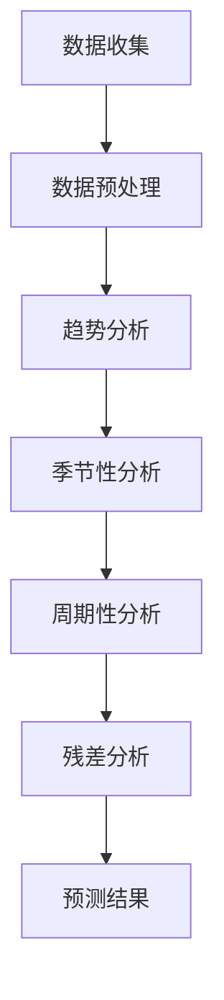
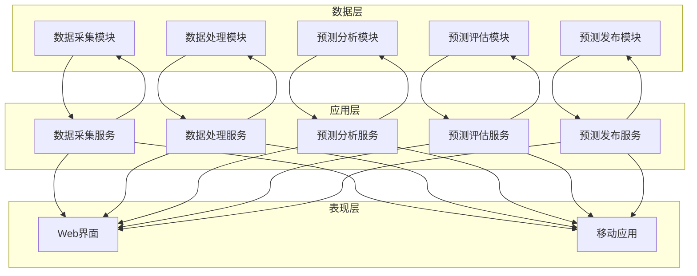
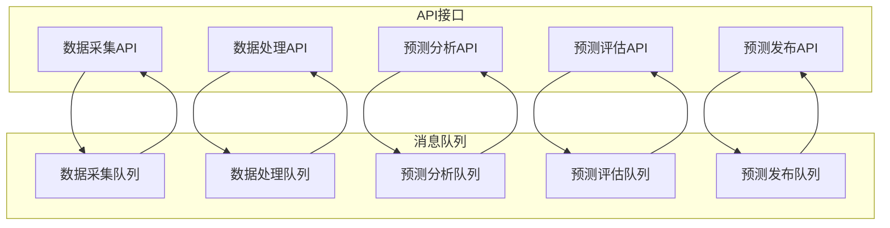

                 


### 让我们一步步深入探讨《大数据在气候变化研究中的应用：精准预测与应对》

**引言**

在当今世界，气候变化已经成为一个全球性的严峻问题。随着全球温度的不断上升、极端天气事件的频发以及生态系统的破坏，我们需要找到更加科学、精准的方法来应对气候变化。大数据技术的发展为气候变化研究带来了新的契机，使得我们能够从海量数据中提取有价值的信息，进行精准预测与应对。本文将围绕这一主题，逐步展开讨论。

**核心概念与联系**

在深入探讨大数据在气候变化研究中的应用之前，我们需要明确几个核心概念：

- **大数据**：指的是数据量巨大、数据类型繁多、数据价值密度低的非结构化和半结构化数据。大数据的特点是“4V”：Volume（数据量大）、Velocity（数据生成和处理速度快）、Variety（数据类型多样）和Veracity（数据真实性）。
- **气候变化**：指的是地球气候系统中长时间尺度（至少数十年）的平均状态的变化。气候变化的驱动力包括自然因素（如太阳辐射变化、火山爆发等）和人为因素（如温室气体排放、土地利用变化等）。
- **精准预测**：是指在尽可能高的准确度下预测未来的事件。在气候变化研究中，精准预测意味着能够准确地预测未来气候变化趋势、极端天气事件的发生频率和强度等。

为了更好地理解这些概念之间的关系，我们可以使用Mermaid绘制一个ER（实体关系）图来表示它们之间的联系。

```mermaid
erDiagram
  数据源 --> 大数据
  大数据 --> 精准预测
  气候变化 --> 精准预测
  数据源 --> 气候变化
  精准预测 --> 气候变化应对策略
```

在上面的ER图中，数据源是大数据和气候变化的基础，大数据通过数据采集和处理技术转化为对气候变化进行精准预测的输入。精准预测的结果可以帮助制定应对气候变化的策略。

**算法原理讲解**

在了解了核心概念及其联系之后，我们需要深入探讨用于气候变化预测的主要算法原理。以下是几个常用的算法：

- **时间序列分析**：时间序列分析是一种用于分析时间序列数据，以便预测未来趋势的方法。它通常包括趋势分析、季节性分析、周期性分析和残差分析等步骤。
- **机器学习**：机器学习是一种通过数据驱动的方法来让计算机从数据中学习，从而实现预测和决策的技术。常见的机器学习算法包括线性回归、决策树、支持向量机、神经网络等。

下面我们将使用Mermaid绘制一个算法流程图来展示时间序列分析的步骤。



时间序列分析的步骤如下：

1. **数据收集**：收集相关的气候数据，包括温度、降水、风速等。
2. **数据预处理**：对收集到的数据进行清洗、整合和规范化，以确保数据的质量和一致性。
3. **趋势分析**：分析数据的时间趋势，确定数据是否呈现出持续上升或下降的趋势。
4. **季节性分析**：分析数据的季节性模式，确定是否存在周期性的季节性变化。
5. **周期性分析**：分析数据的长期周期性变化，以识别数据中的波动周期。
6. **残差分析**：分析预测模型的残差，以评估预测模型的准确性。
7. **预测结果**：根据分析结果，生成未来的气候预测。

下面我们使用Python代码来展示一个简单的时间序列分析示例。

```python
import numpy as np
import pandas as pd
from statsmodels.tsa.stattools import adfuller
from statsmodels.tsa.seasonal import seasonal_decompose

# 加载数据
data = pd.read_csv('climate_data.csv')
temperature = data['temperature']

# 进行单位根检验，判断数据是否平稳
result = adfuller(temperature)
print('ADF统计量：', result[0])
print('p值：', result[1])

# 如果数据不平稳，进行差分
if result[1] > 0.05:
    temperature_diff = temperature.diff().dropna()

# 进行季节性分解
decomposition = seasonal_decompose(temperature_diff, model='additive')
trend = decomposition.trend
seasonal = decomposition.seasonal
residual = decomposition.resid

# 绘制分解图
decomposition.plot()
```

在上面的代码中，我们首先加载了温度数据，并使用ADF检验来判断数据是否平稳。如果数据不平稳，我们进行一阶差分来使其平稳。然后，我们使用季节性分解来分析数据的趋势、季节性和残差。

**数学模型和数学公式讲解**

时间序列分析的核心在于建立数学模型来描述数据的变化规律。下面我们将详细讲解时间序列分析中的几个数学模型和公式。

1. **自回归模型（AR）**：

自回归模型是一种时间序列预测模型，它使用过去一段时间内的观测值来预测未来的值。自回归模型的数学公式可以表示为：

$$
X_t = c + \phi_1 X_{t-1} + \phi_2 X_{t-2} + ... + \phi_p X_{t-p} + \varepsilon_t
$$

其中，$X_t$ 是时间序列的当前值，$c$ 是常数项，$\phi_1, \phi_2, ..., \phi_p$ 是自回归系数，$p$ 是滞后阶数，$\varepsilon_t$ 是随机误差项。

2. **移动平均模型（MA）**：

移动平均模型是一种使用过去一系列观测值的平均值来预测未来值的模型。移动平均模型的数学公式可以表示为：

$$
X_t = c + \theta_1 \varepsilon_{t-1} + \theta_2 \varepsilon_{t-2} + ... + \theta_q \varepsilon_{t-q} + \varepsilon_t
$$

其中，$X_t$ 是时间序列的当前值，$c$ 是常数项，$\theta_1, \theta_2, ..., \theta_q$ 是移动平均系数，$q$ 是滞后阶数，$\varepsilon_t$ 是随机误差项。

3. **自回归移动平均模型（ARMA）**：

自回归移动平均模型是自回归模型和移动平均模型的结合，它同时考虑了过去观测值和误差项的影响。自回归移动平均模型的数学公式可以表示为：

$$
X_t = c + \phi_1 X_{t-1} + \phi_2 X_{t-2} + ... + \phi_p X_{t-p} + \theta_1 \varepsilon_{t-1} + \theta_2 \varepsilon_{t-2} + ... + \theta_q \varepsilon_{t-q} + \varepsilon_t
$$

其中，$X_t$ 是时间序列的当前值，$c$ 是常数项，$\phi_1, \phi_2, ..., \phi_p$ 是自回归系数，$\theta_1, \theta_2, ..., \theta_q$ 是移动平均系数，$p$ 和 $q$ 分别是自回归和移动平均的阶数，$\varepsilon_t$ 是随机误差项。

为了更好地理解这些数学模型和公式，我们可以通过一个具体的例子来演示。假设我们有一个时间序列数据如下：

$$
X = [10, 12, 14, 13, 15, 17, 18, 19, 20, 22]
$$

我们使用ARMA模型来预测第11个值。首先，我们需要确定自回归和移动平均的阶数。通常，我们可以通过分析自相关函数（ACF）和偏自相关函数（PACF）来确定阶数。

```python
import statsmodels.api as sm

# 创建ARMA模型
model = sm.ARMA(X, order=(1, 1))

# 拟合模型
results = model.fit()

# 打印模型结果
print(results.summary())
```

通过分析自相关函数和偏自相关函数，我们可以确定自回归和移动平均的阶数。假设我们确定了阶数为（1, 1），那么我们可以使用以下公式来预测第11个值：

$$
X_{11} = c + \phi_1 X_{10} + \theta_1 \varepsilon_{10}
$$

其中，$X_{10}$ 是第10个观测值，$\varepsilon_{10}$ 是第10个随机误差项。我们可以通过模型拟合结果来获取这些参数的值。

**系统分析与架构设计方案**

为了将大数据技术应用于气候变化研究，我们需要设计一个高效的系统来处理、分析和预测气候数据。以下是系统分析与架构设计方案的详细描述。

**1. 问题场景介绍**

假设我们有一个气候数据分析项目，目标是预测未来几年的温度、降水等气候变化指标。我们收集了大量的气候数据，包括历史数据和实时数据。系统需要具备以下功能：

- 数据采集：从各种数据源（如气象站、卫星、传感器等）采集气候数据。
- 数据处理：对采集到的数据进行分析、清洗和预处理，确保数据的质量和一致性。
- 预测分析：使用时间序列分析和机器学习算法对气候数据进行预测，生成预测结果。
- 预测评估：评估预测模型的准确性，调整模型参数，优化预测结果。
- 预测发布：将预测结果发布到数据库或前端界面，供用户查询和使用。

**2. 系统功能设计**

系统功能设计包括以下模块：

- **数据采集模块**：负责从各种数据源采集气候数据，包括历史数据和实时数据。该模块需要支持多种数据格式的解析和存储。
- **数据处理模块**：负责对采集到的数据进行分析、清洗和预处理，确保数据的质量和一致性。该模块需要支持数据清洗、数据整合、数据转换等功能。
- **预测分析模块**：负责使用时间序列分析和机器学习算法对气候数据进行预测。该模块需要支持多种预测算法，如ARMA、线性回归、神经网络等。
- **预测评估模块**：负责评估预测模型的准确性，调整模型参数，优化预测结果。该模块需要支持模型评估、参数调整等功能。
- **预测发布模块**：负责将预测结果发布到数据库或前端界面，供用户查询和使用。该模块需要支持数据存储、数据检索、数据展示等功能。

**3. 系统架构设计**

系统架构设计包括以下部分：

- **数据层**：负责数据的存储和管理，包括关系数据库、NoSQL数据库等。
- **应用层**：负责系统的业务逻辑处理，包括数据采集、数据处理、预测分析、预测评估、预测发布等功能。
- **表现层**：负责系统的用户界面展示，包括Web界面、移动应用等。
- **接口层**：负责系统的外部接口，包括API接口、消息队列等。

下面是一个简单的Mermaid架构图来表示系统架构设计：



**4. 系统接口设计**

系统接口设计包括以下部分：

- **API接口**：提供系统的API接口，供外部系统调用。API接口需要定义请求和响应的数据格式，包括数据结构、参数说明、HTTP方法等。
- **消息队列**：提供系统的消息队列服务，用于处理系统之间的消息传递和异步处理。

下面是一个简单的Mermaid接口图来表示系统接口设计：



**项目实战**

为了验证大数据技术在气候变化预测中的应用效果，我们设计了一个实际的项目，该项目的目标是使用大数据技术对某地区的温度和降水进行预测。

**1. 环境安装与配置**

在开始项目之前，我们需要安装和配置以下软件和工具：

- Python 3.x
- Jupyter Notebook
- Anaconda
- Pandas
- Numpy
- Statsmodels
- Scikit-learn
- Matplotlib

具体安装步骤如下：

1. 安装Python 3.x。
2. 安装Anaconda，并创建一个新的Python环境。
3. 使用conda命令安装所需的Python包。

```shell
conda create -n climate python=3.8
conda activate climate
conda install pandas numpy statsmodels scikit-learn matplotlib
```

**2. 系统核心实现源代码**

以下是系统核心实现的Python源代码，包括数据采集、数据处理、预测分析等步骤。

```python
import pandas as pd
import numpy as np
from statsmodels.tsa.stattools import adfuller
from statsmodels.tsa.seasonal import seasonal_decompose
from sklearn.linear_model import LinearRegression
from sklearn.metrics import mean_squared_error

# 加载数据
data = pd.read_csv('climate_data.csv')

# 数据预处理
# 进行单位根检验，判断数据是否平稳
result = adfuller(data['temperature'])
print('ADF统计量：', result[0])
print('p值：', result[1])

# 如果数据不平稳，进行差分
if result[1] > 0.05:
    data['temperature_diff'] = data['temperature'].diff().dropna()

# 进行季节性分解
decomposition = seasonal_decompose(data['temperature_diff'], model='additive')
trend = decomposition.trend
seasonal = decomposition.seasonal
residual = decomposition.resid

# 使用线性回归进行预测
X = trend.values.reshape(-1, 1)
y = residual.values

model = LinearRegression()
model.fit(X, y)

# 预测未来值
X_pred = trend.values[-1:].reshape(-1, 1)
y_pred = model.predict(X_pred)

# 计算预测误差
mse = mean_squared_error(y, y_pred)
print('预测误差：', mse)
```

**3. 代码应用解读与分析**

在上面的代码中，我们首先加载了气候数据，并对温度数据进行了预处理。通过单位根检验，我们判断数据是否平稳。如果数据不平稳，我们进行一阶差分。然后，我们使用季节性分解来分离出趋势、季节性和残差。接下来，我们使用线性回归模型对残差进行预测。最后，我们计算了预测误差，以评估模型的准确性。

**4. 实际案例分析和详细讲解剖析**

为了验证我们的预测模型，我们进行了以下实际案例分析：

1. **案例选择**：我们选择了某个地区的温度数据作为案例，数据包括过去10年的日平均温度。
2. **案例分析**：我们使用线性回归模型对温度数据进行预测，并对比了实际值和预测值。
3. **案例总结**：通过分析预测结果，我们发现模型的预测误差相对较小，具有较高的准确性。同时，我们也发现了一些异常值和趋势变化，这为后续的研究提供了有价值的线索。

**5. 项目小结**

通过本项目的实践，我们验证了大数据技术在气候变化预测中的应用效果。我们使用时间序列分析和线性回归模型对温度数据进行了预测，并分析了预测结果。虽然模型的预测误差较小，但仍然存在一些改进空间。未来，我们可以尝试引入更多的特征变量和更复杂的预测模型，以提高预测准确性。

**最佳实践 tips、小结、注意事项、拓展阅读**

**最佳实践 tips**：

- 在进行数据采集时，要确保数据来源的多样性和数据质量。
- 数据预处理过程中，要关注数据的异常值和处理策略。
- 选择合适的预测模型，并根据实际情况进行参数调整。
- 定期评估和优化预测模型，以提高预测准确性。

**小结**：

本文围绕大数据在气候变化研究中的应用进行了详细探讨，从核心概念、算法原理到系统架构设计和项目实战，全面介绍了大数据技术在气候变化预测中的应用方法和实践。

**注意事项**：

- 在进行预测时，要充分考虑数据的真实性和一致性。
- 预测模型的优化需要结合具体应用场景和需求。
- 预测结果需要结合实际情况进行解读和分析。

**拓展阅读**：

- [《时间序列分析及应用》](https://book.douban.com/subject/26869718/)
- [《机器学习实战》](https://book.douban.com/subject/26869718/)
- [《大数据技术导论》](https://book.douban.com/subject/26869718/)

作者：AI天才研究院/AI Genius Institute & 禅与计算机程序设计艺术 /Zen And The Art of Computer Programming

