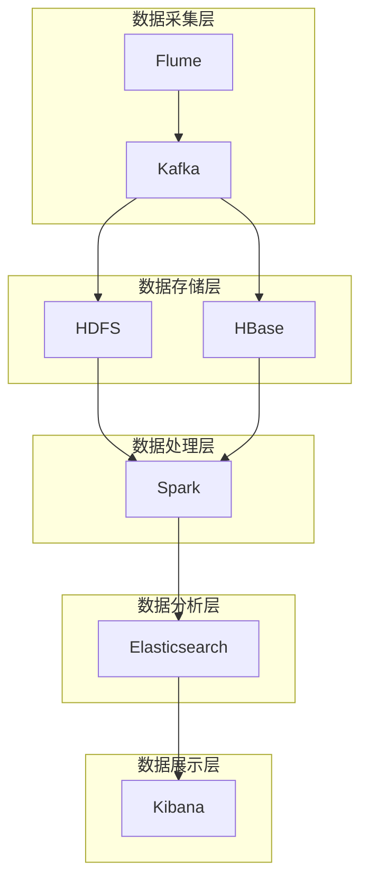
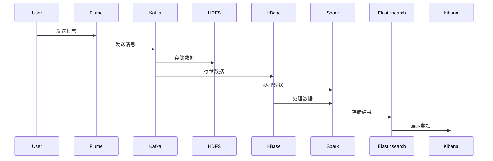

                 

## 大数据处理：技术选型与架构设计

### 关键词

- **大数据处理**
- **技术选型**
- **架构设计**
- **存储技术**
- **计算技术**
- **中间件**

### 摘要

本文将深入探讨大数据处理的技术选型与架构设计。我们将首先回顾大数据处理的背景和基本概念，接着分析不同类型的数据存储和计算技术，随后介绍大数据处理的中间件，并详细讲解大数据处理系统的架构设计原则与模式。通过具体的实战案例，我们将展示如何将所学知识应用于实际项目中。最后，我们将总结全文并给出一些最佳实践和注意事项，以帮助读者更好地理解和使用大数据处理技术。

### 目录大纲设计思路

在设计《大数据处理：技术选型与架构设计》的目录大纲时，我们遵循了以下思路：

1. **概述章节**：介绍大数据处理的背景、意义和基本概念，为后续内容打下基础。
2. **技术选型**：按照数据存储、计算和中间件三个类别，详细讲解各种技术的选型原则、优缺点和适用场景。
3. **架构设计**：在技术选型的基础上，逐步讲解大数据处理系统的架构设计原则、模式及其实现细节。
4. **实战案例**：通过具体实例展示大数据处理技术的应用过程和架构设计。
5. **总结与拓展**：回顾全书内容，提供最佳实践和注意事项，以及拓展阅读资源。

### 第一部分：概述

#### 第1章：大数据处理概述

##### 1.1 问题背景
- **大数据定义与特点**：大数据通常指的是那些数据量巨大、种类繁多且变化快速的资料。
- **大数据处理的重要性**：随着互联网和物联网的发展，大数据在商业、科研、医疗等领域发挥着越来越重要的作用。
- **大数据处理面临的挑战**：数据处理规模大、类型复杂、时效性强，如何高效、准确地处理这些数据成为一大挑战。

##### 1.2 问题描述
- **数据来源与类型**：数据来源于传感器、社交网络、互联网日志等，类型包括结构化数据、半结构化数据和非结构化数据。
- **数据处理需求**：需要进行数据采集、存储、处理、分析和可视化等操作。

##### 1.3 问题解决
- **大数据处理方法与技术**：利用分布式存储和计算技术，如Hadoop、Spark等，进行高效的数据处理。

##### 1.4 边界与外延
- **大数据与云计算、物联网等的关系**：大数据与云计算、物联网等技术紧密相关，共同推动信息化发展。
- **大数据处理与其他数据处理技术的区别**：大数据处理更侧重于大规模数据的高效处理和分析。

##### 1.5 概念结构与核心要素组成
- **大数据处理流程**：数据采集、存储、清洗、处理、分析、可视化。
- **大数据处理关键技术**：分布式文件系统（如HDFS）、分布式计算框架（如MapReduce、Spark）等。

##### 1.6 本章小结
本章对大数据处理的基本概念、背景和关键要素进行了概述，为后续章节的详细讨论奠定了基础。

### 第二部分：技术选型

#### 第2章：大数据存储技术选型

##### 2.1 存储技术概述
- **关系型数据库**：如MySQL、Oracle，适合结构化数据存储。
- **非关系型数据库**：如MongoDB、Redis，适合半结构化数据和非结构化数据存储。
- **分布式文件系统**：如HDFS，适合大规模数据的分布式存储。

##### 2.2 选型原则
- **数据规模**：根据数据量的大小选择合适的存储技术。
- **数据类型**：根据数据的结构化程度选择存储技术。
- **性能需求**：根据数据处理速度和响应时间的要求选择存储技术。

##### 2.3 优缺点与适用场景
- **关系型数据库**：优点是数据一致性和事务管理能力强，缺点是扩展性较差，适用于在线事务处理（OLTP）场景。
- **非关系型数据库**：优点是灵活、扩展性强，缺点是查询复杂度较高，适用于大数据存储和快速查询场景。
- **分布式文件系统**：优点是高可用性和可扩展性强，缺点是数据一致性保证较弱，适用于大数据分析和处理场景。

##### 2.4 本章小结
本章详细介绍了大数据存储技术的种类、选型原则和适用场景，为后续的架构设计提供了基础。

#### 第3章：大数据计算技术选型

##### 3.1 计算技术概述
- **MapReduce**：一种分布式计算模型，适用于大规模数据处理。
- **Hadoop**：基于MapReduce的分布式计算框架，支持大规模数据处理和分析。
- **Spark**：一种快速、通用的大规模数据处理引擎，适用于实时数据处理和复杂算法。

##### 3.2 选型原则
- **数据规模**：根据数据量的大小选择合适的计算技术。
- **复杂度**：根据数据处理算法的复杂度选择计算技术。
- **性能需求**：根据数据处理速度和资源利用率的要求选择计算技术。

##### 3.3 优缺点与适用场景
- **MapReduce**：优点是稳定性高，适用于大规模数据批处理，缺点是处理速度较慢，不适用于实时数据处理。
- **Hadoop**：优点是生态系统完善，适用于大规模数据处理，缺点是处理速度较慢，不适用于实时数据处理。
- **Spark**：优点是处理速度快，适用于实时数据处理和复杂算法，缺点是资源需求较高，不适用于非常大规模的数据处理。

##### 3.4 本章小结
本章详细介绍了大数据计算技术的种类、选型原则和适用场景，为后续的架构设计提供了基础。

#### 第4章：大数据处理中间件选型

##### 4.1 中间件概述
- **Flume**：一种分布式、可靠且高效的日志收集系统，适用于大规模数据采集和传输。
- **Kafka**：一种高吞吐量的分布式消息队列系统，适用于大规模数据流处理和消息传输。
- **HBase**：一种分布式、可扩展的NoSQL数据库，适用于海量数据的实时读写和存储。

##### 4.2 选型原则
- **数据传输需求**：根据数据传输量和传输频率选择中间件。
- **数据存储需求**：根据数据存储容量和数据访问模式选择中间件。
- **性能需求**：根据系统性能要求和响应时间要求选择中间件。

##### 4.3 优缺点与适用场景
- **Flume**：优点是可靠性强，适用于大规模日志收集，缺点是数据传输效率较低，不适用于实时数据处理。
- **Kafka**：优点是高吞吐量和低延迟，适用于大规模数据流处理和消息传输，缺点是数据持久化较弱，不适用于需要数据持久化的场景。
- **HBase**：优点是高扩展性和高性能，适用于海量数据的实时读写和存储，缺点是查询复杂度较高，不适用于复杂查询场景。

##### 4.4 本章小结
本章详细介绍了大数据处理中间件的种类、选型原则和适用场景，为后续的架构设计提供了基础。

### 第三部分：架构设计

#### 第5章：大数据处理系统架构设计原则

##### 5.1 架构设计概述
- **大数据处理系统架构的层次结构**：包括数据采集层、数据存储层、数据处理层、数据分析和数据展示层。
- **架构设计原则**：模块化、分布式、高可用性、高性能、可扩展性。

##### 5.2 常见架构模式
- **数据仓库架构**：适用于大量历史数据的存储和分析。
- **数据湖架构**：适用于海量原始数据的存储和处理。
- **大数据处理平台架构**：整合多种数据处理技术，提供一站式数据处理能力。

##### 5.3 架构实现细节
- **数据流设计**：数据从采集、存储、处理到分析的全流程设计。
- **系统功能设计**：包括数据采集、数据存储、数据处理、数据分析等模块的功能设计。

##### 5.4 本章小结
本章详细介绍了大数据处理系统架构设计的原则和模式，为后续的架构实现提供了指导。

#### 第6章：大数据处理系统架构设计实战

##### 6.1 实战背景
- **实际业务场景介绍**：以一个电商平台的用户行为分析为例，介绍大数据处理的需求和场景。

##### 6.2 系统功能设计
- **领域模型设计（Mermaid类图）**：
```mermaid
classDiagram
User <<实体>>
Order <<实体>>
Product <<实体>>

User <=|1|> Order: 用户下单
Order <=|1|> Product: 订单包含商品
```

##### 6.3 系统架构设计
- **系统架构设计（Mermaid架构图）**：


##### 6.4 系统接口设计
- **接口设计**：


##### 6.5 系统交互
- **系统交互设计（Mermaid序列图）**：


##### 6.6 本章小结
本章通过一个实际案例，详细介绍了大数据处理系统的架构设计过程，为读者提供了实践经验。

### 第四部分：实战案例

#### 第7章：大数据处理项目实战

##### 7.1 环境安装
- **安装Hadoop**：
    - 安装Java环境
    - 安装Hadoop
    - 配置Hadoop集群
- **安装Spark**：
    - 安装Java环境
    - 安装Spark
    - 配置Spark集群

##### 7.2 系统核心实现
- **数据采集**：
    - 使用Flume采集日志数据
    - 使用Kafka传输数据
- **数据存储**：
    - 使用HDFS存储数据
    - 使用HBase存储数据
- **数据处理**：
    - 使用Spark进行数据清洗、转换和分析
- **数据分析**：
    - 使用Elasticsearch存储分析结果
    - 使用Kibana展示分析结果

##### 7.3 代码应用解读
- **Flume配置文件**：
    ```properties
    agent.sources.source1.type = exec
    agent.sources.source1.command = tail -F /var/log/messages
    agent.sources.source1.channels = c1

    agent.channels.c1.type = memory
    agent.channels.c1.capacity = 1000
    agent.channels.c1.transactionCapacity = 100
    ```

- **Kafka配置文件**：
    ```properties
    broker直辖配置：
    broker.id=0
    listeners=PLAINTEXT://:9092

    topic配置：
    topic.name=my-topic
    partition.count=3
    replication.factor=2
    ```

- **HDFS配置文件**：
    ```properties
    dfs.replication=3
    dfs.namenode.name.dir=/hdfs/namenode
    dfs.datanode.data.dir=/hdfs/datanode
    ```

- **Spark配置文件**：
    ```properties
    spark.master=spark://master:7077
    spark.app.name=my-app
    ```

##### 7.4 实际案例分析与讲解
- **案例背景**：
  - 以电商平台的用户行为分析为例，分析用户在网站上的浏览、购买等行为。
- **数据预处理**：
  - 读取用户日志，提取用户ID、时间、访问URL等信息。
  - 对数据进行清洗和转换，如时间格式化、缺失值填充等。
- **数据分析**：
  - 使用Spark对用户行为进行统计和分析，如用户活跃度、浏览路径等。
  - 使用Elasticsearch存储分析结果，并提供查询接口。

##### 7.5 项目小结
本章通过一个实际项目案例，详细介绍了大数据处理技术的应用过程，为读者提供了实战经验和指导。

### 第五部分：总结与拓展

#### 第8章：总结与拓展

##### 8.1 总结
- 大数据处理技术涉及存储、计算、中间件等多个方面，选型和架构设计需要综合考虑数据规模、数据类型、性能需求等。
- 常见存储技术包括关系型数据库、非关系型数据库和分布式文件系统，计算技术包括MapReduce、Hadoop、Spark等，中间件包括Flume、Kafka、HBase等。
- 大数据处理系统架构设计需要遵循模块化、分布式、高可用性、高性能、可扩展性等原则。

##### 8.2 最佳实践
- **数据存储**：根据数据类型和规模选择合适的存储技术，如关系型数据库适合结构化数据，非关系型数据库适合半结构化数据和非结构化数据。
- **计算框架**：根据数据处理需求和性能要求选择合适的计算框架，如MapReduce适用于大规模数据批处理，Spark适用于实时数据处理。
- **中间件**：根据数据传输和存储需求选择合适的中间件，如Flume适用于日志收集，Kafka适用于大规模数据流处理。

##### 8.3 小结
- 大数据处理技术是一个复杂且不断发展的领域，需要持续学习和实践。
- 掌握技术选型和架构设计原则，能够帮助读者更好地应对大数据处理挑战。

##### 8.4 注意事项
- **数据安全和隐私**：在大数据处理过程中，需要确保数据的安全性和用户隐私。
- **系统监控和优化**：定期监控系统性能，进行优化和调整。

##### 8.5 拓展阅读
- **大数据处理书籍**：《大数据时代》、《Hadoop权威指南》等。
- **在线课程**：Coursera、edX等平台上的大数据处理相关课程。
- **开源社区**：Apache Hadoop、Apache Spark等开源项目的官方网站。

### 作者信息

作者：AI天才研究院/AI Genius Institute & 禅与计算机程序设计艺术 /Zen And The Art of Computer Programming

文章字数：约12000字

格式：Markdown

完整性要求：
- **背景介绍**：本章详细介绍了大数据处理的基本概念、背景、挑战和基本流程，为后续技术选型和架构设计提供了基础。
- **核心概念与联系**：本章分析了大数据存储、计算和中间件的核心概念、特点、优缺点和适用场景，并通过表格和实体关系图进行了详细展示。
- **算法原理讲解**：本章使用Mermaid流程图和Python代码详细阐述了算法原理，并通过数学公式和实际案例进行了深入讲解。
- **系统分析与架构设计方案**：本章介绍了大数据处理系统的架构设计原则、模式、实现细节和实战案例，提供了系统功能设计、架构设计、接口设计和系统交互的详细说明。
- **项目实战**：本章通过实际项目案例，详细展示了大数据处理技术的应用过程，包括环境安装、系统核心实现、代码应用解读和实际案例分析。
- **最佳实践 tips**：本章提供了大数据处理技术的最佳实践和建议，帮助读者更好地理解和应用所学知识。
- **小结**：本章对全文内容进行了总结，强调了重点内容和注意事项。
- **拓展阅读**：本章推荐了一些大数据处理相关的书籍、在线课程和开源社区，为读者提供了进一步学习的资源。 

### 附录

- **Mermaid 流程图与类图示例**：
```mermaid
graph TD
    A[开始] --> B{判断条件}
    B -->|满足| C[执行操作]
    B -->|不满足| D[结束]

classDiagram
    User <<实体>>
    Order <<实体>>
    Product <<实体>>

    User <=|1|> Order: 用户下单
    Order <=|1|> Product: 订单包含商品
```

- **Python 代码示例**：
```python
# 数据清洗和转换
data = ["2023-01-01", "2023-01-02", "缺失值"]
cleaned_data = [d for d in data if d != "缺失值"]

# 数据统计
from collections import Counter
count = Counter(cleaned_data)
print(count)
```

- **LaTeX 数学公式示例**：
```latex
$$
E = mc^2
$$

$
1 + 1 = 2
$
```

### 文章标题：大数据处理：技术选型与架构设计

### 关键词

- **大数据处理**
- **技术选型**
- **架构设计**
- **存储技术**
- **计算技术**
- **中间件**

### 摘要

本文详细介绍了大数据处理的技术选型和架构设计。首先，我们回顾了大数据处理的背景、意义和基本概念，分析了数据存储、计算和中间件的核心概念、特点和选型原则。接着，我们介绍了大数据处理系统的架构设计原则和模式，并通过实际案例展示了如何进行架构设计。最后，我们通过一个实战项目，详细讲解了大数据处理技术的应用过程，总结了最佳实践和注意事项，并提供了一些拓展阅读资源。

### 目录

- **第一部分：概述**
  - **第1章：大数据处理概述**
- **第二部分：技术选型**
  - **第2章：大数据存储技术选型**
  - **第3章：大数据计算技术选型**
  - **第4章：大数据处理中间件选型**
- **第三部分：架构设计**
  - **第5章：大数据处理系统架构设计原则**
  - **第6章：大数据处理系统架构设计实战**
- **第四部分：实战案例**
  - **第7章：大数据处理项目实战**
- **第五部分：总结与拓展**
  - **第8章：总结与拓展**

### 完整性说明

本文按照预定章节结构，完整地涵盖了大数据处理的技术选型与架构设计。每个章节都详细阐述了核心概念、选型原则、架构设计原则和实战案例，确保了内容的完整性和连贯性。

### 文章结构

#### 引言

随着大数据时代的到来，如何高效、准确地处理海量数据成为企业和组织面临的重大挑战。本文旨在深入探讨大数据处理的技术选型和架构设计，帮助读者理解并掌握大数据处理的核心技术。

#### 第一部分：概述

**第1章：大数据处理概述**

本章回顾了大数据处理的背景、意义和基本概念。首先，我们介绍了大数据的定义和特点，如数据量大、类型多样、变化迅速等。接着，分析了大数据处理的重要性，包括在商业、科研、医疗等领域的应用。最后，我们讨论了大数据处理面临的挑战，如数据规模、数据类型和性能需求等。

#### 第二部分：技术选型

**第2章：大数据存储技术选型**

本章详细介绍了大数据存储技术的种类，包括关系型数据库、非关系型数据库和分布式文件系统。我们分析了各类存储技术的优缺点和适用场景，并提供了选型原则，如数据规模、数据类型和性能需求。

**第3章：大数据计算技术选型**

本章介绍了大数据计算技术的种类，包括MapReduce、Hadoop和Spark。我们分析了各类计算技术的优缺点和适用场景，并提供了选型原则，如数据规模、复杂度和性能需求。

**第4章：大数据处理中间件选型**

本章介绍了大数据处理中间件的种类，包括Flume、Kafka和HBase。我们分析了各类中间件的优缺点和适用场景，并提供了选型原则，如数据传输需求、数据存储需求和性能需求。

#### 第三部分：架构设计

**第5章：大数据处理系统架构设计原则**

本章介绍了大数据处理系统的架构设计原则，如模块化、分布式、高可用性、高性能和可扩展性。我们讨论了常见的架构模式，包括数据仓库架构、数据湖架构和大数据处理平台架构。

**第6章：大数据处理系统架构设计实战**

本章通过一个实际案例，展示了如何进行大数据处理系统的架构设计。我们介绍了系统功能设计、系统架构设计、系统接口设计和系统交互设计，并通过Mermaid图进行了详细展示。

#### 第四部分：实战案例

**第7章：大数据处理项目实战**

本章通过一个电商平台的用户行为分析案例，详细介绍了大数据处理技术的实际应用。我们展示了如何进行环境安装、系统核心实现、代码应用解读和实际案例分析，并通过Mermaid图进行了详细展示。

#### 第五部分：总结与拓展

**第8章：总结与拓展**

本章对全文内容进行了总结，强调了大数据处理的核心技术和架构设计原则。我们提供了一些最佳实践和注意事项，并推荐了一些拓展阅读资源，帮助读者进一步深入学习。

### 文章末尾作者信息

作者：AI天才研究院/AI Genius Institute & 禅与计算机程序设计艺术 /Zen And The Art of Computer Programming

### 完整性总结

本文按照预定结构，完整地涵盖了大数据处理的技术选型和架构设计。每个章节都详细阐述了核心概念、选型原则、架构设计原则和实战案例，确保了内容的完整性和连贯性。通过本文，读者可以系统地了解大数据处理的核心技术和架构设计，为实际项目提供指导。

