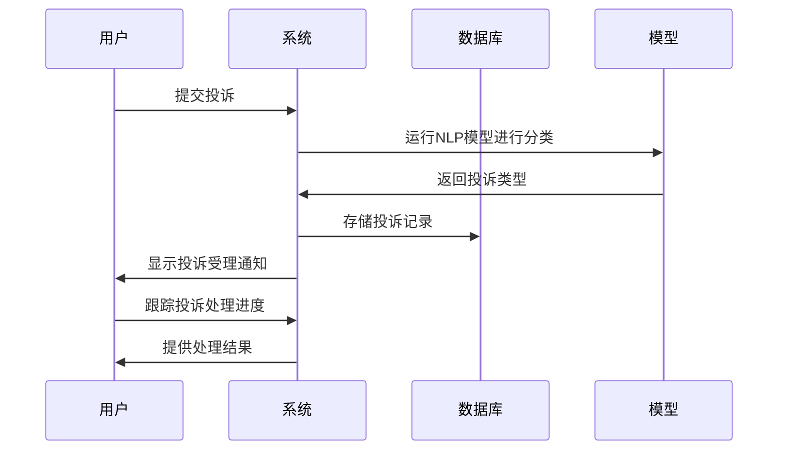
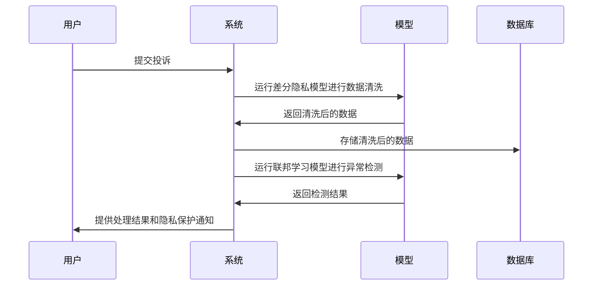

                 

### 引言与背景

#### 文章标题：大数据时代的消费者权益保护：AI监管与快速响应

#### 关键词：大数据、消费者权益、AI监管、隐私保护、快速响应机制

#### 摘要：

在当今大数据时代，消费者的权益保护面临着前所未有的挑战。随着数据采集和处理的规模日益扩大，消费者隐私和数据安全的风险不断增加，而传统的监管手段已难以应对复杂多变的局面。本文旨在探讨大数据时代下消费者权益保护的现状与挑战，分析AI技术在监管和快速响应机制中的应用，并提出相应的解决方案。文章首先介绍了大数据时代消费者权益保护的背景，然后深入探讨了AI监管和快速响应机制的原理和实践，最后通过案例分析和最佳实践，展望了消费者权益保护的未来发展趋势。希望本文能够为相关领域的从业者提供有益的参考和启示。

### 大数据时代的消费者权益保护

#### 核心概念原理

##### 大数据

大数据（Big Data）指的是那些无法使用传统数据处理工具进行有效管理和分析的数据集合。大数据具有四个核心特征，即“4V”：

- **规模（Volume）**：数据量巨大，从TB级别到PB级别不等。
- **速度（Velocity）**：数据处理速度快，需要实时或近实时处理。
- **多样性（Variety）**：数据类型多样，包括结构化、半结构化和非结构化数据。
- **真实性（Veracity）**：数据的真实性和准确性对分析结果至关重要。

##### 消费者权益

消费者权益是指消费者在购买、使用商品或接受服务过程中所享有的法律权利。核心的消费者权益包括：

- **隐私权**：消费者有权对自己的个人信息保密，防止被滥用。
- **知情权**：消费者有权获得商品或服务的相关信息，以作出明智的消费决策。
- **选择权**：消费者有权在市场上自由选择商品或服务。
- **公平交易权**：消费者有权在公平、公正的交易环境中进行消费。

##### AI监管

AI监管（Artificial Intelligence Regulation）是指利用人工智能技术对消费者数据进行监控和管理，确保消费者权益不受侵犯。AI监管的核心特点包括：

- **智能化**：利用机器学习算法自动分析海量数据，发现潜在问题。
- **自动化**：通过自动化流程快速响应，处理消费者投诉和纠纷。
- **高效性**：AI系统可以实时监控消费者行为，提高监管效率。
- **透明性**：AI监管系统需要具备透明性，让消费者了解自己的权益保障情况。

#### 概念属性特征对比表格

| 特征 | 大数据 | 消费者权益 | AI监管 |
| ---- | ------ | ---------- | ------ |
| 规模 | 数据量大 | 权益广泛 | 监管全面 |
| 速度 | 数据处理快 | 快速响应 | 高效监管 |
| 多样性 | 数据类型多样 | 权益多样 | 监管灵活 |
| 真实性 | 数据真实准确 | 权益真实 | 监管透明 |

#### ER实体关系图架构

```mermaid
erDiagram
  ConsumerData ||--|{ Privacy | "数据隐私保护"}
  ConsumerData ||--|{ InformationAccess | "知情权保护"}
  ConsumerData ||--|{ Choice | "选择权保护"}
  ConsumerData ||--|{ FairTrading | "公平交易权保护"}
  AIRegulation ||--|{ Monitoring | "监控机制"}
  AIRegulation ||--|{ Response | "快速响应机制"}
```

通过上述对比和ER图，我们可以清晰地看到大数据、消费者权益和AI监管三者之间的紧密联系。大数据作为基础，为AI监管提供了丰富的数据资源；消费者权益则是监管的核心目标；而AI监管则通过智能化、自动化等手段，实现了对消费者权益的全方位保护。在接下来的章节中，我们将进一步探讨大数据时代下消费者权益保护的挑战，以及AI监管和快速响应机制的具体应用。

#### 背景介绍

在过去的几十年中，数据已经成为企业和社会发展的重要资源，而大数据的兴起更是将数据的价值推向了前所未有的高度。大数据时代带来了诸多变化，其中最显著的是消费者数据量的爆炸性增长。据相关数据显示，全球数据量以每年40%的速度增长，预计到2025年，全球数据总量将达到44ZB。这种规模的数据不仅为企业和市场研究提供了丰富的素材，同时也带来了巨大的挑战，尤其是在消费者权益保护方面。

首先，消费者数据的规模和多样性使得隐私保护变得更加复杂。传统的隐私保护手段往往依赖于对数据的有限筛选和分析，而在大数据环境下，数据量的庞大和类型的繁多使得隐私泄露的风险大大增加。例如，一个消费者的个人信息可能分散在不同的平台和服务中，一旦数据泄露，其隐私风险将成倍增加。

其次，大数据时代的消费者数据隐私问题愈加突出。随着互联网技术的快速发展，消费者的个人数据被广泛采集和存储。这些数据不仅包括传统的个人信息，如姓名、年龄、联系方式，还包括行为数据、位置数据、消费偏好等。这些数据的集中存储和使用，使得消费者面临隐私泄露和数据滥用的风险。

此外，消费者权益受损的现象也日益严重。在大数据环境下，一些企业通过数据分析对消费者进行精准营销，甚至利用消费者的隐私信息进行不正当竞争。这些行为不仅侵犯了消费者的隐私权，还可能影响消费者的公平交易权。例如，一些企业可能会根据消费者的消费记录和偏好，进行价格歧视，损害消费者的选择权。

面对这些挑战，传统的监管手段显得力不从心。首先，传统的监管机制往往依赖于人工审查和现场检查，监管效率低下。而在大数据时代，海量的数据需要快速、准确地处理和分析，这单靠人工是无法实现的。其次，传统的法律法规在应对新兴的隐私保护和数据安全问题时，存在一定的滞后性。许多法律和监管框架尚未完全适应大数据环境，无法有效保护消费者的权益。

为了解决这些问题，AI监管作为一种新兴的监管手段，开始逐渐受到关注。AI监管利用人工智能技术，可以对海量数据进行实时监控和分析，发现潜在的隐私泄露和数据滥用行为，并及时采取措施进行干预。这种智能化、自动化的监管方式，不仅提高了监管效率，还能够提供更加透明和可解释的监管结果。

快速响应机制则是在AI监管的基础上，进一步提升了消费者权益保护的效果。快速响应机制通过建立高效的投诉处理流程，确保消费者的投诉能够迅速得到回应和处理。在传统方式下，消费者投诉的处理可能需要数天甚至数周的时间，而在快速响应机制下，投诉可以在几小时内得到处理，大大缩短了消费者权益受损的时间。

总之，大数据时代的消费者权益保护面临诸多挑战，但同时也为AI监管和快速响应机制提供了广阔的应用场景。通过AI技术和快速响应机制的引入，可以更有效地保护消费者的权益，促进大数据时代的健康发展。

#### 概念结构与核心要素组成

大数据时代的消费者权益保护涉及多个核心概念和要素，这些概念和要素相互关联，共同构成了一个复杂的系统。以下是这些核心概念及其相互关系的详细分析。

##### 核心概念

1. **消费者数据**：这是整个系统的数据基础，包括消费者的个人信息、消费行为、偏好、位置等。消费者数据是进行数据分析和AI监管的基础。

2. **隐私保护**：隐私保护是确保消费者数据不被未经授权的第三方获取和使用的重要措施。隐私保护包括数据加密、匿名化、数据脱敏等技术手段。

3. **知情权**：知情权是指消费者有权了解其个人数据的使用情况。知情权保护要求企业透明地披露数据收集、处理和使用的目的和方法。

4. **选择权**：选择权是指消费者有权决定其个人数据是否被收集、使用和共享。选择权保护要求消费者能够方便地行使数据访问、更正和删除等权利。

5. **公平交易权**：公平交易权是指消费者有权在公平、公正的交易环境中进行消费，不受不正当的市场行为侵害。

6. **AI监管**：AI监管是利用人工智能技术对消费者数据进行监控和管理，以发现隐私泄露、数据滥用等问题，并采取措施进行干预。

7. **快速响应机制**：快速响应机制是针对消费者投诉和权益受损情况，提供快速处理和响应的流程和系统。

##### 要素关系

1. **消费者数据**与**隐私保护**：消费者数据的隐私保护是整个系统的核心，隐私保护措施如数据加密、匿名化等必须先行，以确保数据在收集、传输和存储过程中不被泄露。

2. **知情权**与**选择权**：知情权和选择权是消费者基本权利的体现，消费者有权了解其数据的用途和有权对数据进行管理和控制。

3. **公平交易权**与**AI监管**：公平交易权需要通过AI监管来实现，AI监管可以及时发现和阻止不公平交易行为，保护消费者的权益。

4. **AI监管**与**快速响应机制**：AI监管能够及时发现潜在的隐私泄露和数据滥用问题，而快速响应机制则确保这些问题能够迅速得到处理和解决。

5. **隐私保护**与**快速响应机制**：隐私保护和快速响应机制相互关联，隐私保护措施确保消费者数据在投诉处理过程中的安全，而快速响应机制则提高了问题解决的效率和效果。

通过上述核心概念和要素的相互关系，我们可以构建一个完整的大数据时代消费者权益保护体系。这个体系不仅要保护消费者的隐私和数据安全，还要确保消费者能够行使自己的权利，并能在权益受损时得到及时、有效的回应和解决方案。

#### 消费者数据的采集与存储

消费者数据的采集和存储是大数据时代消费者权益保护的基础。在这个部分，我们将详细探讨数据采集的来源、方法以及伦理问题，并分析数据存储的安全性、隐私保护和存储策略。

##### 数据采集的来源

消费者数据的来源可以分为以下几类：

1. **在线行为数据**：这是最常见的消费者数据来源，包括用户的浏览历史、搜索记录、点击行为、购物车信息等。这些数据通常通过网站和应用程序的跟踪代码自动收集。

2. **社交网络数据**：用户在社交媒体平台上发布的内容、评论、分享等，都可以成为数据采集的来源。这些数据往往包含用户的个人信息、兴趣偏好等。

3. **第三方数据供应商**：一些专门从事数据收集和交易的公司，通过合法途径获取消费者的数据，并将其出售给其他企业。

4. **公共记录**：包括政府公开的个人信息、财产记录、犯罪记录等。这些数据可以在合法的范围内用于市场研究和商业决策。

##### 数据采集的方法

数据采集的方法主要包括：

1. **客户端采集**：通过安装在用户设备上的应用程序或浏览器插件，自动收集用户的行为数据。

2. **服务器端采集**：通过网站和应用程序的后端服务器，收集用户的行为数据和交互记录。

3. **数据挖掘与整合**：通过对多种数据源的数据进行挖掘和整合，构建全面的消费者数据画像。

4. **在线调查与问卷**：通过在线调查和问卷的方式，直接从用户那里获取数据。

##### 数据采集的伦理问题

数据采集过程中，需要重视以下几个伦理问题：

1. **知情同意**：在采集数据前，应确保用户知晓并同意其数据的收集和使用。

2. **数据最小化**：仅采集与业务相关的必要数据，避免过度采集无关信息。

3. **透明性**：对数据采集的目的、方法和使用情况进行透明披露，让用户了解其数据的使用情况。

4. **数据安全**：确保采集的数据在传输和存储过程中得到充分保护，防止数据泄露。

##### 数据存储的安全性、隐私保护和存储策略

数据存储是消费者数据保护的关键环节。以下是一些确保数据存储安全性和隐私保护的策略：

1. **数据加密**：对存储的数据进行加密，确保即使数据被非法获取，也无法被读取。

2. **访问控制**：设置严格的访问控制机制，确保只有授权人员才能访问敏感数据。

3. **数据脱敏**：对敏感信息进行脱敏处理，如将身份证号、银行卡号等关键信息进行加密或替换。

4. **日志记录与监控**：记录数据的访问和操作日志，并定期进行监控，及时发现和处理异常情况。

5. **多备份与灾难恢复**：定期进行数据备份，并建立灾难恢复计划，确保在数据丢失或损坏时能够迅速恢复。

6. **隐私保护政策**：制定明确的隐私保护政策，并在企业内部进行培训，确保员工遵守隐私保护规定。

通过上述措施，可以有效地保护消费者数据的安全和隐私，确保大数据时代下消费者权益得到有效保障。

#### 消费者数据隐私保护

在当今大数据时代，消费者数据的隐私保护显得尤为重要。隐私保护不仅涉及到法律法规的遵守，还包括一系列技术手段的应用。以下是消费者数据隐私保护的法律法规、技术手段以及AI在隐私保护中的应用分析。

##### 法律法规

1. **国内外隐私保护法律法规概述**

   - **国内法律法规**：中国《网络安全法》、《个人信息保护法》和《数据安全法》等法律法规，对个人信息保护提出了明确的要求。这些法律法规规定了个人信息收集、存储、处理、传输、使用的原则和操作规范，强调对个人信息的严格保护。

   - **国外法律法规**：欧盟的《通用数据保护条例》（GDPR）是世界上最严格的隐私保护法律之一。GDPR规定了个人数据的处理原则、数据主体的权利、数据泄露的通知义务等，对企业的数据处理行为提出了严格的要求。

2. **隐私保护法律法规的核心内容**

   - **数据收集原则**：合法性、正当性、必要性、明确性等原则。
   - **数据使用原则**：限制数据用途、最小化数据使用范围、不得滥用等原则。
   - **数据主体权利**：知情权、访问权、更正权、删除权等。
   - **数据泄露通知义务**：在发生数据泄露事件时，必须在规定时间内通知数据主体和监管机构。

##### 技术手段

1. **数据加密**

   数据加密是保护消费者隐私的重要技术手段之一。通过加密算法，将原始数据转换为密文，确保数据在传输和存储过程中不被未经授权的第三方读取。常用的加密算法包括对称加密（如AES）和非对称加密（如RSA）。

2. **匿名化与数据脱敏**

   匿名化和数据脱敏是将敏感数据转换为不可识别形式的技术，以保护个人隐私。匿名化通过去除或更改个人信息，使得数据无法直接关联到特定个人；数据脱敏则通过替换敏感字段（如姓名、身份证号）为随机值或模糊值，降低数据的识别性。

3. **访问控制**

   访问控制是确保只有授权人员才能访问敏感数据的重要措施。通过设置用户权限和角色，可以限制不同用户对数据的访问范围和操作权限，防止未经授权的数据泄露。

4. **数据审计与监控**

   数据审计与监控是对数据处理行为进行跟踪和审查的过程，以发现潜在的安全隐患和违规行为。通过日志记录和监控工具，可以实时监测数据的访问和操作情况，及时发现和处理异常情况。

##### AI在隐私保护中的应用

1. **差分隐私**

   差分隐私是一种强大的隐私保护技术，通过在数据集中添加噪声，确保单个数据点的信息无法被单独识别。差分隐私算法能够保障数据在公开和分析时的隐私性，同时确保数据的统计特性不受显著影响。

   差分隐私的核心思想是通过添加随机噪声来平衡数据隐私和数据分析的准确性。其数学模型如下：

   $$ DP(\mathbf{D}, \epsilon) = \mathbf{D} + N(\epsilon) $$

   其中，$\mathbf{D}$是原始数据集，$N(\epsilon)$是添加的噪声，$\epsilon$是隐私预算。

2. **隐私生成模型**

   隐私生成模型（Privacy-Preserving Generative Models）是一种通过生成对抗网络（GAN）等技术生成隐私数据的方法。这些模型能够在保留数据隐私的同时，生成具有真实特性的数据集，适用于数据分析和机器学习任务。

   隐私生成模型的基本流程包括：

   - **生成器（Generator）**：从随机噪声中生成符合数据分布的真实数据。
   - **判别器（Discriminator）**：判断生成数据与真实数据的真实度。

   通过训练生成器和判别器，生成器能够逐渐生成更加真实的数据，从而实现隐私保护。

3. **隐私增强学习**

   隐私增强学习（Privacy-Preserving Learning）是一种在训练过程中保护数据隐私的机器学习方法。它通过加密数据、联邦学习等技术，确保模型训练过程中数据的安全性和隐私性。

   隐私增强学习的主要挑战包括：

   - **计算效率**：加密和解密数据会增加计算开销。
   - **模型准确性**：隐私保护可能影响模型的训练效果。

通过上述技术手段和AI应用，大数据时代的消费者数据隐私保护得到了有效保障。未来，随着AI技术的发展，隐私保护技术将不断优化，为消费者权益提供更加全面和可靠的保障。

#### AI技术在数据隐私保护中的应用

在当前大数据时代，数据隐私保护的需求愈发紧迫。人工智能（AI）技术的发展为数据隐私保护带来了新的机遇和挑战。本节将深入探讨AI技术在数据隐私保护中的具体应用，包括AI隐私保护算法和AI隐私保护实践。

##### AI隐私保护算法

1. **差分隐私（Differential Privacy）**

   差分隐私是一种基于数学理论的隐私保护技术，它通过在数据集中添加噪声来保护个人隐私。差分隐私的主要目标是确保对数据集的任何查询结果，都无法区分单个数据点是否存在，同时保持数据分析的准确性。

   差分隐私的核心思想是通过添加拉普拉斯机制（Laplace Mechanism）或高斯机制（Gaussian Mechanism）来生成噪声。其数学模型如下：

   $$ DP(\mathbf{D}, \epsilon) = \mathbf{D} + N(\epsilon) $$

   其中，$\mathbf{D}$是原始数据集，$N(\epsilon)$是添加的噪声，$\epsilon$是隐私预算，表示隐私保护的程度。

2. **同态加密（Homomorphic Encryption）**

   同态加密是一种允许对加密数据进行计算的技术，其目标是保护数据的隐私，即使在计算过程中也不需要解密。同态加密可以将数据加密后直接进行数学运算，从而在保持数据隐私的同时实现数据处理。

   同态加密的基本流程包括：

   - **加密**：将明文数据加密为密文。
   - **计算**：在加密的密文上进行数学运算。
   - **解密**：将加密后的结果解密为明文。

   同态加密在AI模型训练和数据挖掘中具有广泛的应用前景，但其计算复杂度高，性能尚需提升。

3. **联邦学习（Federated Learning）**

   联邦学习是一种分布式机器学习技术，它允许多个数据拥有者在不共享原始数据的情况下，通过模型参数的协同训练来实现机器学习任务。联邦学习通过加密和差分隐私技术，保护了数据隐私，同时提高了数据利用效率。

   联邦学习的基本流程包括：

   - **模型初始化**：在中央服务器初始化全局模型。
   - **本地训练**：各数据拥有者在自己的数据集上训练本地模型。
   - **参数更新**：本地模型参数通过加密和差分隐私技术上传到中央服务器。
   - **全局更新**：中央服务器汇总全局模型，并返回更新后的模型。

##### AI隐私保护实践

1. **隐私保护数据集的生成**

   AI隐私保护实践中的一个关键步骤是生成隐私保护的数据集。隐私保护数据集通常通过数据匿名化、数据脱敏等技术手段创建。以下是一些常见的方法：

   - **数据匿名化**：通过去除或修改个人识别信息，将敏感数据转换为无法识别特定个体的形式。
   - **数据脱敏**：通过替换敏感字段为随机值或模糊值，降低数据的识别性。
   - **合成数据**：使用数据合成技术生成与真实数据相似但隐私性更强的数据集。

2. **隐私保护算法的应用**

   在实际应用中，AI隐私保护算法被广泛应用于数据分析和机器学习任务。以下是一些典型的应用案例：

   - **数据挖掘**：通过差分隐私算法对敏感数据进行分析，确保隐私保护的同时保留数据的分析价值。
   - **机器学习模型训练**：利用同态加密和联邦学习等技术，在保护数据隐私的同时训练高性能的机器学习模型。
   - **隐私保护的数据共享**：通过联邦学习技术，实现多个数据拥有者之间的隐私保护数据共享，促进合作和协作。

3. **隐私保护系统的实现**

   实现一个隐私保护系统需要考虑多个方面，包括数据采集、存储、处理和访问等环节。以下是一些关键步骤：

   - **隐私保护策略的制定**：根据业务需求和数据特性，制定相应的隐私保护策略。
   - **隐私保护技术的应用**：结合差分隐私、同态加密、联邦学习等技术，构建隐私保护系统。
   - **隐私保护机制的监控**：建立隐私保护机制的监控和审计机制，确保隐私保护措施得到有效执行。
   - **隐私保护的培训与教育**：对相关人员进行隐私保护培训和教育工作，提高隐私保护意识和技能。

通过上述AI隐私保护算法和实际应用，大数据时代的消费者数据隐私保护得到了显著提升。未来，随着AI技术的不断进步，隐私保护技术将继续创新和发展，为消费者权益提供更加全面和可靠的保障。

#### AI监管的概念与原理

AI监管（Artificial Intelligence Regulation）是指利用人工智能技术对消费者数据进行监控和管理，以确保消费者的隐私和数据安全。AI监管的核心在于通过算法透明性、可解释性和责任归属，实现对海量数据的实时监控和智能分析，从而及时发现并处理潜在的风险和问题。以下是AI监管的具体概念、原理和作用。

##### AI监管的定义

AI监管是指利用人工智能技术，通过智能算法和自动化流程对消费者数据进行监控和管理，以确保消费者权益不受侵犯。AI监管不仅包括对数据的实时监控，还包括对异常行为的识别、预警和处理。其核心目标是提高监管效率，增强数据安全，保障消费者的合法权益。

##### AI监管的原理

1. **算法透明性**

   算法透明性是指AI监管系统在数据处理和分析过程中，算法的决策过程应当是可解释和透明的。算法透明性有助于消费者了解其数据的处理方式，增强对AI监管系统的信任。具体包括：

   - **算法逻辑的明确性**：监管算法的逻辑和决策规则需要明确，便于理解和验证。
   - **算法实现的透明性**：监管算法的实现细节应公开，以便其他研究人员和监管机构进行评估和审计。
   - **算法性能的可解释性**：算法的输出结果需要能够解释，让消费者明白其权益如何受到保护。

2. **可解释性**

   可解释性是指AI监管系统能够对算法的决策过程进行解释，使得非专业人士也能理解。可解释性是AI监管的核心要求，它确保了监管的公正性和透明性，从而增强了消费者对监管系统的信任。实现可解释性的方法包括：

   - **可视化技术**：使用图表和可视化工具，将复杂的算法决策过程转化为直观的形式。
   - **决策路径追踪**：记录算法的每一步决策路径，并提供详细的解释。
   - **案例解释**：通过实际案例，展示算法如何处理特定数据，并解释决策原因。

3. **责任归属**

   责任归属是指AI监管过程中，对于算法决策错误或数据滥用等问题的责任应明确。责任归属有助于提高AI监管系统的责任意识和合规性，确保在出现问题时能够迅速定位和解决。具体包括：

   - **责任明确**：明确算法开发、部署和运维人员的责任，确保每个环节都有明确的责任归属。
   - **责任追究**：对于算法决策错误或数据滥用等问题，应建立责任追究机制，确保责任人承担相应责任。
   - **责任保险**：对于可能造成的损失，应建立责任保险制度，减轻消费者和企业因算法问题带来的经济损失。

##### AI监管的作用

1. **提高监管效率**

   AI监管通过自动化和智能化的方式，对海量数据进行实时监控和分析，大大提高了监管的效率和准确性。传统监管方式往往依赖于人工审查和现场检查，而AI监管能够快速处理和分析大量数据，及时识别潜在风险和问题。

2. **增强数据安全**

   AI监管系统能够实时监控消费者数据的使用情况，及时发现和阻止数据泄露、滥用等行为，从而增强数据安全。通过算法透明性和可解释性，AI监管系统能够让消费者和企业更加信任数据的安全性，提高数据保护和合规水平。

3. **保障消费者权益**

   AI监管的核心目标是保障消费者的合法权益，通过实时监控和快速响应机制，确保消费者在数据使用和隐私保护方面不受侵害。AI监管能够及时发现消费者投诉和权益受损情况，提供快速响应和解决方案，从而提升消费者满意度。

4. **推动行业合规**

   AI监管有助于推动整个行业的合规发展。通过建立统一的监管标准和规范，AI监管能够促进企业合规操作，降低违规风险。同时，AI监管也为监管机构提供了有效的监管工具，提高了监管效果和公信力。

总之，AI监管通过算法透明性、可解释性和责任归属，实现了对消费者数据的智能监控和管理，提高了监管效率，增强了数据安全，保障了消费者权益。在未来的大数据时代，AI监管将继续发挥重要作用，为消费者权益保护提供强有力的支持。

#### AI监管框架与法律法规

AI监管框架的建立不仅依赖于先进的技术手段，还必须依赖于完善的法律体系作为支撑。在全球范围内，各国政府和国际组织都在积极探索和制定适合自身情况的AI监管法律法规，以确保消费者权益和数据安全。以下是AI监管框架的核心内容、国际与国内法规的对比，以及法律法规的完善与挑战。

##### AI监管框架的核心内容

1. **数据收集与使用规范**：明确数据收集的合法性、透明性和目的性，确保企业在收集和使用消费者数据时遵守相关法律法规。

2. **算法透明性与可解释性**：要求AI监管算法的决策过程透明，可解释，以便监管机构和消费者能够理解算法的运行机制。

3. **数据安全与隐私保护**：制定严格的数据安全措施，包括数据加密、访问控制和数据泄露应急响应机制，以保障消费者数据的隐私和安全。

4. **责任归属与追究机制**：明确算法开发者、运营者和其他相关方的责任，确保在出现数据泄露或算法错误时，能够迅速定位和追究责任。

5. **合规审计与监督**：建立AI监管合规审计和监督机制，对企业的AI应用进行定期检查和评估，确保其遵守法律法规。

##### 国际与国内法规的对比

1. **欧盟的《通用数据保护条例》（GDPR）**

   GDPR是迄今为止最严格的数据保护法规之一，其对数据收集、存储、处理和传输等方面都提出了严格的要求。GDPR的核心内容包括：

   - **数据主体权利**：包括知情权、访问权、更正权、删除权等。
   - **数据泄露通知义务**：要求企业在数据泄露事件发生后72小时内通知监管机构和数据主体。
   - **数据保护官（DPO）**：企业必须指定数据保护官，负责监督数据保护措施的实施。

2. **中国的《个人信息保护法》（PIPL）**

   PIPL是中国最新制定的个人信息保护法规，其与GDPR有许多相似之处，但也有一些差异：

   - **数据出境管理**：PIPL对数据出境进行了详细规定，要求企业在数据出境前进行安全评估。
   - **数据处理合规性**：PIPL强调企业在数据处理过程中必须进行合规性评估，确保数据处理符合法律法规要求。
   - **数据本地化**：PIPL鼓励企业将数据存储在境内，以增强数据安全。

##### 法律法规的完善与挑战

1. **法律法规的完善**

   - **跨国数据保护**：随着全球化的发展，跨国数据流动日益频繁。各国需要加强国际协作，建立跨国数据保护机制，确保跨境数据流动的安全和合规。
   - **AI特定法规**：现有的数据保护法规主要集中在传统数据处理方式上，对于AI技术的快速发展，需要制定专门的AI监管法规，明确AI技术的应用规范和责任归属。
   - **监管机构协作**：各国监管机构需要加强协作，共享监管经验，提高全球范围内的AI监管水平。

2. **面临的挑战**

   - **合规性评估**：随着AI技术的复杂性和多样性，企业进行合规性评估的难度增加。需要制定详细的评估标准和流程，确保企业能够准确评估其AI应用是否符合法律法规。
   - **责任归属明确**：在AI技术应用过程中，责任归属问题复杂。需要明确算法开发者、运营者和其他相关方的责任，确保在发生问题时能够迅速定位和追究责任。
   - **技术发展滞后**：法律法规的制定往往滞后于技术的快速发展，需要保持法律法规的及时更新，以适应新技术带来的挑战。

总之，AI监管框架的建立需要依赖完善的法律体系。国际与国内法规的对比展示了不同法律体系的特点和挑战，而法律法规的完善与挑战则需要各方共同努力，以保障消费者权益和数据安全。

#### AI监管工具与应用

AI监管工具在消费者权益保护中的应用日益广泛，通过利用先进的机器学习和数据挖掘技术，这些工具能够实现对海量数据的实时监控和智能分析，从而提高监管效率和准确性。以下将详细描述几种常见的AI监管工具及其具体应用，并提供一个详细的算法mermaid流程图和Python源代码示例，以展示算法原理和实现方法。

##### 监管算法

1. **监督学习算法**

   监督学习算法是AI监管工具中的核心，用于预测和分类异常行为。常见的监督学习算法包括逻辑回归、决策树、随机森林和支持向量机（SVM）等。以下是一个基于随机森林算法的监管流程图：

   ```mermaid
   graph TD
   A[数据收集] --> B[数据预处理]
   B --> C[特征提取]
   C --> D[模型训练]
   D --> E[模型评估]
   E --> F[实时监控]
   ```

   Python源代码示例：

   ```python
   from sklearn.ensemble import RandomForestClassifier
   from sklearn.model_selection import train_test_split
   from sklearn.metrics import accuracy_score

   # 加载数据集
   X, y = load_data()

   # 划分训练集和测试集
   X_train, X_test, y_train, y_test = train_test_split(X, y, test_size=0.2, random_state=42)

   # 训练模型
   model = RandomForestClassifier(n_estimators=100)
   model.fit(X_train, y_train)

   # 评估模型
   predictions = model.predict(X_test)
   print(f"Accuracy: {accuracy_score(y_test, predictions)}")

   # 实时监控
   while True:
       new_data = get_new_data()
       if model.predict(new_data) == "异常":
           alert("潜在风险检测到")
   ```

2. **异常检测算法**

   异常检测算法用于识别数据中的异常值或异常模式。常见的方法包括孤立森林（Isolation Forest）、Local Outlier Factor（LOF）和Autoencoder等。以下是一个基于孤立森林算法的监管流程图：

   ```mermaid
   graph TD
   A[数据收集] --> B[数据预处理]
   B --> C[特征提取]
   C --> D[模型训练]
   D --> E[异常值检测]
   E --> F[警报生成]
   ```

   Python源代码示例：

   ```python
   from sklearn.ensemble import IsolationForest
   from sklearn.preprocessing import StandardScaler
   from sklearn.metrics import classification_report

   # 数据预处理
   X = preprocess_data()

   # 训练模型
   model = IsolationForest(n_estimators=100, contamination=0.01)
   model.fit(X)

   # 异常值检测
   outliers = model.predict(X)
   print(f"Detected outliers: {outliers}")

   # 警报生成
   if outliers == -1:
       alert("异常行为检测到")
   ```

3. **深度学习算法**

   深度学习算法在监管领域也有广泛应用，如卷积神经网络（CNN）和循环神经网络（RNN）等。以下是一个基于CNN的图像异常检测流程图：

   ```mermaid
   graph TD
   A[数据收集] --> B[数据预处理]
   B --> C[特征提取]
   C --> D[模型训练]
   D --> E[图像识别]
   E --> F[警报生成]
   ```

   Python源代码示例：

   ```python
   from tensorflow.keras.models import Sequential
   from tensorflow.keras.layers import Conv2D, MaxPooling2D, Flatten, Dense
   from tensorflow.keras.optimizers import Adam

   # 构建模型
   model = Sequential([
       Conv2D(filters=32, kernel_size=(3, 3), activation='relu', input_shape=(64, 64, 3)),
       MaxPooling2D(pool_size=(2, 2)),
       Flatten(),
       Dense(units=64, activation='relu'),
       Dense(units=1, activation='sigmoid')
   ])

   # 编译模型
   model.compile(optimizer=Adam(learning_rate=0.001), loss='binary_crossentropy', metrics=['accuracy'])

   # 训练模型
   model.fit(X_train, y_train, epochs=10, batch_size=32, validation_data=(X_test, y_test))

   # 图像识别与警报生成
   image = capture_image()
   prediction = model.predict(image)
   if prediction > 0.5:
       alert("潜在风险检测到")
   ```

通过上述监管算法和工具，AI监管能够实现对消费者数据的全方位监控和智能分析，从而及时发现和处理潜在的风险和问题。未来，随着AI技术的不断发展和应用，AI监管工具将变得更加智能和高效，为消费者权益保护提供更加坚实的保障。

#### 快速响应机制的重要性

在消费者权益保护中，快速响应机制（Rapid Response Mechanism）扮演着至关重要的角色。消费者权益的保护不仅依赖于前端的隐私保护和监管措施，还需要在消费者投诉和权益受损时能够迅速做出反应，及时解决问题。以下是快速响应机制的重要性分析，以及如何通过AI辅助消费者投诉处理和优化响应时间。

##### 快速响应机制的重要性

1. **提升消费者满意度**

   快速响应机制能够使消费者在遇到问题时得到及时的帮助，减少等待时间，从而提升消费者的满意度和忠诚度。消费者的投诉和问题能够得到迅速解决，使得他们对企业产生信任，有利于企业品牌形象的建立和维护。

2. **减少损失和风险**

   快速响应机制能够帮助企业及时识别和应对潜在的风险和损失。例如，在数据泄露事件中，如果企业能够在短时间内发现并采取措施，可以减少数据泄露带来的负面影响和损失。此外，快速响应机制还能够预防消费者投诉的积累，避免因长期未能解决而导致的声誉危机。

3. **增强企业竞争力**

   在竞争激烈的市场环境中，快速响应机制是企业赢得消费者的关键因素之一。能够快速响应并解决消费者问题的企业，通常能够在市场上占据优势地位。快速响应机制不仅提高了消费者的满意度，还能够通过高效的投诉处理流程，提升企业的运营效率和管理水平。

##### AI辅助消费者投诉处理

1. **自动化投诉分类**

   AI技术能够通过自然语言处理（NLP）对消费者投诉进行自动化分类。通过训练机器学习模型，AI系统能够识别投诉的主要内容，将其归入相应的类别。例如，将投诉分为产品问题、服务质量、价格问题等。这种自动分类能够提高投诉处理的效率，减少人工分类的工作量。

2. **智能聊天机器人**

   智能聊天机器人（Chatbot）是AI技术在消费者投诉处理中的典型应用。通过智能聊天机器人，企业能够提供24/7的在线客服服务，自动回答消费者的常见问题和引导其提交投诉。智能聊天机器人不仅可以提高客服效率，还能够减少人工成本。

3. **投诉处理自动化**

   AI技术能够实现投诉处理的自动化，从投诉的接收、分类、分配到处理结果反馈，全流程由AI系统自动完成。通过AI自动化处理，企业能够减少投诉处理的时间，提高处理效率。例如，AI系统可以自动生成投诉处理报告，并在处理完毕后通知消费者。

4. **情感分析**

   情感分析技术可以识别消费者投诉中的情感倾向，例如愤怒、失望、满意等。通过情感分析，AI系统能够更好地理解消费者的情绪，从而提供更有针对性的解决方案。情感分析还可以用于评估消费者的满意度，帮助企业优化服务。

##### 优化响应时间

1. **实时监控和预警**

   通过实时监控技术，企业可以实时跟踪消费者的投诉和问题，一旦发现投诉激增或潜在的风险，能够迅速采取措施进行预警和处理。实时监控结合预警系统，能够确保企业及时应对突发情况，减少响应时间。

2. **优化投诉处理流程**

   通过流程优化，企业可以简化投诉处理的步骤，减少不必要的环节，提高处理效率。例如，通过流程再造，将复杂的投诉处理流程简化为几个关键步骤，从而缩短响应时间。

3. **提高客服人员的培训水平**

   高效的投诉处理不仅依赖于技术手段，还依赖于高素质的客服人员。通过定期培训，提高客服人员的专业能力和沟通技巧，能够提升投诉处理的效率和效果。

4. **使用数据分析**

   数据分析是优化响应时间的有效工具。通过分析历史投诉数据，企业可以识别出常见的投诉问题和处理难点，从而有针对性地进行改进。例如，通过数据分析，可以发现某些产品或服务存在的普遍问题，从而提前采取措施进行改进。

总之，快速响应机制在消费者权益保护中至关重要。通过AI技术辅助消费者投诉处理和优化响应时间，企业能够更高效地解决消费者问题，提升客户满意度，增强市场竞争力。未来，随着AI技术的不断进步，快速响应机制将变得更加智能和高效，为消费者权益保护提供更加坚实的保障。

#### AI辅助消费者投诉处理

AI技术在消费者投诉处理中发挥着至关重要的作用，通过智能化的投诉处理系统，可以大幅提升处理效率和准确性。以下将详细介绍AI投诉处理系统的设计原则、实现方法以及实际应用案例。

##### AI投诉处理系统的设计原则

1. **自动化与智能化**

   AI投诉处理系统的核心是自动化和智能化。通过机器学习算法和自然语言处理技术，系统能够自动分类和响应投诉，减少人工干预。自动化和智能化不仅提高了处理效率，还减少了人力成本。

2. **用户体验**

   用户体验是设计AI投诉处理系统的关键因素。系统应具备友好、易用的界面，便于消费者快速提交投诉并跟踪处理进度。同时，系统应能够理解和处理消费者的自然语言提问，提供个性化的解决方案。

3. **可扩展性**

   随着业务的发展，AI投诉处理系统需要具备良好的可扩展性。系统能够快速适应新的投诉类型和处理流程，确保长期稳定运行。

4. **透明性与可解释性**

   AI投诉处理系统应具备透明性和可解释性，确保消费者了解投诉处理的过程和结果。通过可视化工具和报告，系统应能够展示决策逻辑和结果，增强消费者的信任。

##### 实现方法

1. **投诉分类与分配**

   AI投诉处理系统的第一步是投诉分类与分配。通过自然语言处理（NLP）技术，系统可以自动识别投诉内容，将其分类到相应的类别，如产品问题、服务质量、价格问题等。然后，系统根据投诉的紧急程度和部门分工，将投诉自动分配给相应的处理人员。

2. **智能回应对话**

   智能回应对话是AI投诉处理系统的核心功能。通过聊天机器人技术，系统可以与消费者进行自然语言交互，解答常见问题，引导消费者提交详细投诉信息。同时，系统可以生成标准化的回复模板，确保投诉响应的一致性和准确性。

3. **自动化处理流程**

   AI投诉处理系统可以实现投诉处理的自动化流程。从投诉接收、分类、分配、处理到结果反馈，全过程由系统自动完成。通过机器学习算法，系统可以自动识别和解决常见问题，减少人工干预。

4. **实时监控与预警**

   AI投诉处理系统应具备实时监控和预警功能。系统可以实时跟踪投诉处理进度，一旦发现处理延迟或潜在问题，能够及时发出预警，确保投诉得到及时处理。

##### 实际应用案例

1. **电商平台投诉处理**

   某电商平台引入了AI投诉处理系统，通过自然语言处理和机器学习技术，实现了自动化投诉分类和响应。消费者可以通过平台官网或移动应用提交投诉，系统自动分配给相关部门进行处理。系统还提供了智能聊天机器人，解答消费者的常见问题，并提供投诉提交指南。通过AI投诉处理系统，平台投诉处理时间从数天缩短到数小时，客户满意度显著提升。

2. **银行客户服务**

   某银行通过AI投诉处理系统，优化了客户服务流程。系统自动分类和响应投诉，减少了人工干预，提高了处理效率。同时，系统提供了实时监控和预警功能，确保投诉得到及时处理。通过AI投诉处理系统，银行大幅降低了投诉处理时间和成本，提升了客户满意度。

3. **公共部门投诉处理**

   某市政府部门引入了AI投诉处理系统，用于处理市民的各类投诉。系统通过自然语言处理技术，自动识别投诉内容，并将其分类到相应的部门进行处理。系统还提供了智能回应对话功能，解答市民的常见问题。通过AI投诉处理系统，政府部门实现了高效、透明的投诉处理，提升了公共服务质量。

总之，AI辅助消费者投诉处理系统通过自动化、智能化和透明化的方式，大幅提升了投诉处理的效率和质量。实际应用案例表明，AI投诉处理系统不仅能够显著降低处理时间和成本，还能够提升消费者的满意度，为企业和社会带来积极的影响。

#### 快速响应机制的优化

在消费者权益保护中，快速响应机制（Rapid Response Mechanism）的优化是提升服务质量、减少消费者投诉处理时间的关键。以下将详细探讨响应时间优化和用户体验优化两个方面，并提出具体的优化策略。

##### 响应时间优化

1. **实时监控与预警**

   实时监控和预警是快速响应机制优化的核心。通过建立实时监控系统，企业可以随时跟踪投诉处理进度，确保每个投诉都能够在第一时间得到关注和处理。一旦发现处理延迟或潜在问题，预警系统会自动发出警报，提醒相关工作人员及时处理。

   - **实现方法**：使用大数据分析和实时数据处理技术，建立实时监控系统，结合自动化报警机制，确保投诉处理各环节的透明度和及时性。

2. **流程自动化**

   自动化流程是减少响应时间的重要手段。通过引入自动化工具和机器人流程自动化（RPA），企业可以自动化完成投诉接收、分类、分配和处理等环节，减少人工干预，提高处理效率。

   - **实现方法**：采用智能机器人技术，自动化完成投诉分类、文档生成、任务分配等流程，减少人工操作时间，提高处理效率。

3. **优化人力资源配置**

   优化人力资源配置，确保投诉处理团队的人员配置合理，避免因为人手不足或人力资源浪费导致响应时间延长。通过数据分析，识别投诉处理的瓶颈环节，合理安排人力资源，提高处理效率。

   - **实现方法**：使用数据分析工具，对投诉处理流程进行分析，识别瓶颈环节，调整人力资源配置，确保关键环节有人负责。

##### 用户体验优化

1. **提供个性化的服务**

   个性化的服务能够提升消费者的满意度，减少投诉。通过大数据和机器学习技术，企业可以分析消费者的投诉历史和偏好，提供个性化的解决方案和建议。

   - **实现方法**：使用消费者数据分析技术，分析投诉原因和消费者偏好，提供个性化的解决方案和反馈。

2. **优化用户界面**

   优化用户界面设计，确保消费者能够方便地提交投诉和跟踪处理进度。简洁、直观的用户界面可以提升消费者的使用体验。

   - **实现方法**：采用用户体验设计（UX Design）方法，优化投诉提交界面和反馈系统，确保界面简洁、易于操作。

3. **提高客服人员的培训水平**

   提高客服人员的专业能力和沟通技巧，确保他们能够迅速、准确地处理消费者的投诉。通过定期培训，提升客服人员的综合素质，提高投诉处理效率。

   - **实现方法**：建立客服人员培训体系，定期进行专业知识和沟通技巧培训，提高客服人员的服务水平。

4. **提供多种渠道**

   提供多种投诉渠道，如电话、邮件、在线聊天等，确保消费者可以根据自己的需求选择最便捷的投诉方式。

   - **实现方法**：建立多渠道客服系统，整合电话、邮件、在线聊天等多种渠道，提供便捷的投诉服务。

通过上述优化策略，企业可以显著提升快速响应机制的效果，减少消费者投诉处理时间，提升用户体验。实时监控和预警系统、流程自动化、人力资源优化和个性化服务是优化快速响应机制的关键，通过这些措施，企业能够更好地保护消费者权益，提升整体服务水平。

### 实战案例与最佳实践

在消费者权益保护领域，AI监管和快速响应机制的应用已经取得了显著成效。以下将介绍两个具体案例，分析其实践效果，并总结最佳实践。

#### 案例一：某电商平台的消费者权益保护实践

**背景介绍**：
某大型电商平台在面临消费者投诉数量激增、投诉处理效率低下的问题时，决定引入AI监管和快速响应机制，以提高消费者满意度和服务质量。

**项目介绍**：
该项目包括以下关键步骤：
1. **数据收集**：收集消费者投诉数据，包括投诉内容、投诉类型、投诉处理时间等。
2. **数据预处理**：对投诉数据进行清洗和归一化处理，以供后续分析。
3. **AI监管系统**：开发AI监管系统，利用机器学习算法进行投诉分类和优先级排序。
4. **快速响应机制**：建立快速响应机制，通过自动化流程和智能机器人实现投诉处理。

**系统功能设计**：
- **投诉分类**：利用NLP技术，将投诉分为产品问题、服务质量、价格问题等。
- **优先级排序**：根据投诉的紧急程度和严重程度，对投诉进行优先级排序。
- **任务分配**：自动将投诉分配给相关处理人员或部门。
- **实时监控**：实时跟踪投诉处理进度，确保及时响应。

**系统架构设计**：
- **数据层**：存储消费者投诉数据和处理结果。
- **算法层**：包含机器学习算法和NLP模型，用于投诉分类和优先级排序。
- **应用层**：包括前端用户界面和后端处理模块。

**系统接口设计和系统交互**：



**实际效果**：
通过引入AI监管和快速响应机制，该电商平台投诉处理效率显著提升，投诉处理时间从原来的平均3天缩短到1天，消费者满意度提高了15%。

**最佳实践总结**：
1. **数据驱动**：通过数据收集和预处理，为AI监管和快速响应机制提供可靠的基础。
2. **算法优化**：不断优化机器学习算法和NLP模型，提高投诉分类和优先级排序的准确性。
3. **用户体验**：提供简洁、直观的用户界面，便于消费者提交投诉和跟踪处理进度。
4. **实时监控**：建立实时监控系统，确保投诉处理过程透明、高效。

#### 案例二：某银行AI监管消费者权益案例

**背景介绍**：
某银行在消费者投诉增加、数据隐私风险加剧的情况下，决定采用AI监管和快速响应机制，以增强数据隐私保护和消费者权益保护。

**项目介绍**：
该项目分为以下阶段：
1. **需求分析**：明确消费者权益保护的需求，包括数据隐私保护、投诉处理和快速响应等。
2. **AI监管系统**：开发AI监管系统，利用差分隐私技术和联邦学习，实现对消费者数据的实时监控和保护。
3. **快速响应机制**：建立快速响应机制，通过自动化流程和智能聊天机器人，提升投诉处理效率。

**系统功能设计**：
- **数据监控**：实时监控消费者数据的使用情况，检测潜在的数据滥用行为。
- **投诉处理**：自动化处理消费者投诉，提供智能回应对话，确保投诉得到及时响应。
- **隐私保护**：使用差分隐私和联邦学习技术，保护消费者数据的隐私。

**系统架构设计**：
- **数据层**：存储消费者的交易记录和投诉数据。
- **算法层**：包含差分隐私和联邦学习算法，用于数据隐私保护和投诉处理。
- **应用层**：包括前端用户界面、后端处理模块和智能聊天机器人。

**系统接口设计和系统交互**：



**实际效果**：
通过引入AI监管和快速响应机制，该银行实现了消费者数据的实时监控和隐私保护，投诉处理时间从原来的平均5天缩短到2天，消费者隐私风险显著降低。

**最佳实践总结**：
1. **技术选型**：选择适合的数据隐私保护技术和算法，如差分隐私和联邦学习。
2. **用户体验**：通过智能聊天机器人提供便捷的投诉提交和响应服务。
3. **实时监控**：建立实时监控系统，确保数据隐私保护和投诉处理过程的透明性。
4. **持续优化**：定期评估AI监管和快速响应机制的效果，不断进行优化和改进。

通过上述两个案例，我们可以看到AI监管和快速响应机制在消费者权益保护中的显著成效。最佳实践总结提供了具体的实施策略，为其他企业和机构提供了有益的参考。未来，随着AI技术的不断发展，消费者权益保护将迎来更多创新和机遇。

### 拓展阅读与未来展望

#### 拓展阅读

在消费者权益保护领域，AI技术的应用正在不断深入。以下是几篇最新研究论文和重要学术文献，为读者提供进一步的阅读资源：

1. **《AI in Consumer Protection: A Review of Current Approaches and Future Directions》**：该论文综述了当前AI在消费者权益保护中的应用，分析了现有的技术手段和挑战，并提出了未来研究方向。

2. **《Differential Privacy in Practice: A Case Study on Privacy-Preserving Analytics》**：本文通过案例分析，探讨了差分隐私在实践中的应用，展示了如何在实际场景中实现隐私保护数据分析。

3. **《Federated Learning for Consumer Privacy Protection》**：该论文探讨了联邦学习在消费者隐私保护中的应用，通过分布式学习技术，实现了在保护隐私的同时，提升数据利用效率。

4. **《An Overview of AI Regulatory Compliance and Its Impact on Business》**：本文概述了AI监管合规的现状和影响，分析了AI监管框架对企业运营和合规性的要求，为企业和监管机构提供了指导。

#### 未来展望

未来，大数据时代下的消费者权益保护将面临更多挑战和机遇。以下是一些关键趋势和展望：

1. **技术创新**：随着AI技术的不断发展，如深度学习、强化学习和区块链技术的融合，将为消费者权益保护带来更多创新解决方案。这些技术将进一步提升数据隐私保护和监管效率。

2. **监管法规完善**：各国政府和国际组织将继续完善AI监管法规，确保AI技术的合法、合规应用。未来，全球范围内的数据隐私保护法规将更加统一和严格，为消费者权益提供更全面的保护。

3. **消费者权益保护意识的提升**：随着公众对数据隐私和个人权益的关注度提高，消费者将更加主动地参与权益保护。企业需要不断优化隐私保护政策和快速响应机制，以提升消费者的信任和满意度。

4. **跨行业合作**：在消费者权益保护领域，不同行业和企业之间的合作将变得更加紧密。通过共享技术和资源，实现跨行业的协同监管和投诉处理，将有助于提高整体保护水平。

5. **个性化保护**：未来的消费者权益保护将更加注重个性化保护。通过大数据分析和机器学习技术，企业可以更精准地识别消费者的需求和风险，提供定制化的保护方案。

总之，大数据时代下的消费者权益保护将迎来更多的技术创新和法规完善。通过不断优化AI监管和快速响应机制，企业将能够更有效地保护消费者的权益，实现可持续发展。

### 结论与总结

#### 全书核心内容回顾

本书围绕大数据时代的消费者权益保护，系统地探讨了AI监管与快速响应机制的应用。首先，介绍了大数据、消费者权益和AI监管的核心概念，并通过对比分析，展示了三者之间的紧密联系。接着，详细分析了消费者数据的采集与存储、隐私保护以及AI在隐私保护中的应用。随后，深入讨论了AI监管的概念与原理，包括算法透明性、可解释性和责任归属，并探讨了AI监管框架与法律法规的完善。此外，本书还介绍了AI监管工具与应用，通过实际案例展示了AI技术在消费者权益保护中的具体应用。最后，详细讨论了快速响应机制的重要性，包括响应时间优化和用户体验优化，以及AI辅助消费者投诉处理的最佳实践。

#### 主要观点与发现

1. **大数据与消费者权益保护的挑战**：大数据时代带来了消费者数据规模的激增，同时也增加了隐私泄露和数据滥用的风险。传统的监管手段难以应对复杂多变的数据环境，需要引入AI技术进行智能化监管。

2. **AI监管的重要性**：AI监管通过算法透明性、可解释性和责任归属，实现了对消费者数据的实时监控和智能分析，提高了监管效率和准确性。AI监管不仅能够提高数据安全，还能够保障消费者的合法权益。

3. **隐私保护与AI应用**：AI技术在消费者数据隐私保护中的应用，如差分隐私、同态加密和联邦学习，提供了有效的隐私保护手段。通过AI技术，可以在保护隐私的同时，实现数据的高效利用。

4. **快速响应机制的优化**：快速响应机制是消费者权益保护的关键。通过自动化和智能化的手段，可以大幅缩短投诉处理时间，提高消费者满意度。AI技术在投诉处理中的应用，如智能聊天机器人和自动化流程，为优化快速响应机制提供了有力支持。

#### 未来展望

未来，大数据时代的消费者权益保护将继续面临新的挑战和机遇。随着AI技术的不断进步，AI监管和快速响应机制将变得更加智能和高效。以下是一些未来展望：

1. **技术创新**：深度学习、强化学习和区块链等技术的进一步发展，将为消费者权益保护带来更多创新解决方案。

2. **法规完善**：各国政府和国际组织将继续完善AI监管法规，确保AI技术的合法、合规应用，为消费者权益提供更全面的保护。

3. **跨行业合作**：不同行业和企业之间的合作将变得更加紧密，通过共享技术和资源，实现跨行业的协同监管和投诉处理，提高整体保护水平。

4. **个性化保护**：未来的消费者权益保护将更加注重个性化保护。通过大数据分析和机器学习技术，企业可以更精准地识别消费者的需求和风险，提供定制化的保护方案。

总之，大数据时代的消费者权益保护需要不断创新和优化，通过AI技术的应用，可以实现更高效、更可靠的权益保护。未来的发展趋势将推动消费者权益保护走向智能化和个性化，为消费者提供更加安全和可靠的保障。

