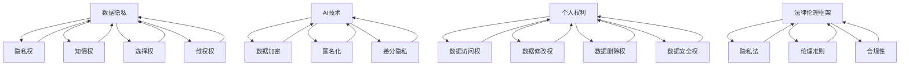

                 

### 文章标题

# 大数据时代的隐私保护：AI技术与个人权利的平衡

### 关键词

- 大数据
- 隐私保护
- 人工智能
- 个人权利
- AI伦理

### 摘要

随着大数据时代的到来，个人隐私的保护变得日益重要。然而，数据收集和利用的便利性，常常与隐私泄露的风险并存。本文将探讨在这样一个背景下，如何通过AI技术实现隐私保护，同时保障个人权利。文章首先介绍了大数据隐私保护的重要性和挑战，然后详细阐述了AI技术在隐私保护中的应用，包括隐私保护算法、法律和伦理框架，以及隐私保护数据分析方法。最后，文章提供了一些最佳实践和注意事项，为在AI时代实现隐私保护提供了全面的指导。本文旨在帮助读者理解大数据隐私保护的关键概念，以及如何在技术、法律和伦理层面找到平衡点。

### 引言

#### 问题背景

在大数据时代，数据已经成为现代社会的重要组成部分。从电子商务到医疗健康，从社交媒体到智能家居，数据无处不在，极大地推动了各行各业的创新和发展。然而，随着数据收集和利用的普及，个人隐私问题也逐渐暴露出来。传统的隐私保护方法往往难以应对大数据环境中的复杂性和多样性，使得个人隐私面临前所未有的威胁。

首先，大数据的规模和速度使得数据泄露的风险大幅增加。一个简单的例子是，在社交媒体平台上，用户发布的每一条状态、点赞、评论等都可能被收集和存储，形成庞大的用户行为数据集。一旦这些数据被未经授权的第三方获取，用户的隐私将面临严重泄露的风险。

其次，大数据分析技术的进步，使得对个人隐私的侵害变得更加隐蔽。例如，通过数据挖掘技术，企业可以识别出用户的个人偏好、行为习惯，甚至是健康状况。这种对个人隐私的深度挖掘，往往超出了用户的预期和承受范围。

最后，法律和伦理框架在应对大数据隐私保护挑战时也面临诸多困境。一方面，现有的法律法规难以跟上技术的快速发展，导致法律盲区频现；另一方面，不同国家和地区之间的隐私保护标准和执法力度存在差异，使得隐私保护工作更加复杂。

#### 问题描述

在大数据时代，隐私保护面临的主要问题包括：

1. **数据泄露风险增加**：大数据环境中的海量数据，为黑客提供了更多的攻击目标。一旦数据泄露，将导致严重的个人隐私泄露和经济损失。

2. **隐私侵害隐蔽性强**：通过大数据分析技术，企业可以实现对用户隐私的深度挖掘，甚至无需直接访问个人信息。这种隐蔽的侵害方式，使得用户难以察觉和防范。

3. **法律和伦理困境**：现有的法律和伦理框架难以应对大数据隐私保护的新挑战，导致隐私保护工作难以开展。

#### 问题解决

为应对大数据隐私保护面临的挑战，需要从技术、法律和伦理三个层面综合施策。

1. **技术层面**：利用AI技术，开发出高效的隐私保护算法，如数据加密、匿名化等。通过技术手段，降低数据泄露和隐私侵害的风险。

2. **法律层面**：完善隐私保护法律法规，确保其能够适应大数据时代的需要。同时，加强国际间的合作，建立统一的隐私保护标准。

3. **伦理层面**：在数据收集和使用过程中，遵循伦理原则，确保个人权利得到尊重和保护。

#### 边界与外延

本文主要关注以下边界与外延：

1. **大数据范围**：本文讨论的大数据隐私保护问题，主要涉及结构化数据（如数据库）、半结构化数据（如XML、JSON）和非结构化数据（如文本、图片、音频、视频）。

2. **隐私保护技术**：本文将主要探讨AI技术在数据加密、匿名化和差分隐私等隐私保护中的应用。

3. **法律和伦理框架**：本文将简要介绍国际上的主要隐私保护法律和伦理原则，并探讨其在大数据隐私保护中的应用。

#### 概念结构与核心要素组成

本文的核心概念包括大数据、隐私保护、AI技术、个人权利和法律伦理。这些概念之间的联系如下：

- **大数据**：指规模巨大、类型多样的数据集合，是隐私保护的主要对象。
- **隐私保护**：旨在保护个人数据不被未经授权的第三方获取、使用和泄露。
- **AI技术**：包括数据加密、匿名化、差分隐私等技术，是实施隐私保护的关键手段。
- **个人权利**：包括隐私权、知情权、选择权和维权权，是隐私保护的核心价值。
- **法律伦理**：为隐私保护提供法律和伦理依据，是确保隐私保护工作顺利开展的重要保障。

### 核心概念与联系

#### 数据隐私

数据隐私是指个人或组织对其数据的控制权，包括对数据访问、使用和分享的权限。数据隐私涉及以下几个核心概念：

1. **隐私权**：个人对其数据的控制权，包括数据的收集、存储、处理和使用。
2. **知情权**：个人有权了解其数据将被如何使用和分享。
3. **选择权**：个人有权选择是否分享其数据以及如何分享。
4. **维权权**：个人有权对其数据隐私受到侵犯时采取法律行动。

#### AI技术

AI技术是指利用机器学习、深度学习、自然语言处理等技术，实现智能化数据处理和分析的技术。在数据隐私保护中，AI技术主要涉及以下几个方向：

1. **数据加密**：通过加密算法对数据进行加密，确保数据在传输和存储过程中的安全性。
2. **匿名化**：通过技术手段对数据进行匿名化处理，使数据无法直接识别个人身份。
3. **差分隐私**：通过在数据集中引入噪声，保护个体隐私的同时，确保数据分析结果的准确性。

#### 个人权利

个人权利是指个人在数据隐私保护中享有的各项权利。这些权利包括：

1. **数据访问权**：个人有权查询、访问和控制其个人数据。
2. **数据修改权**：个人有权修改其个人数据中的错误或不完整信息。
3. **数据删除权**：个人有权要求删除其个人数据，特别是在数据不再需要或数据隐私受到侵害时。
4. **数据安全权**：个人有权要求对其个人数据采取安全措施，防止数据泄露、丢失或滥用。

#### 法律和伦理框架

法律和伦理框架为数据隐私保护提供了法律和道德指导。核心概念包括：

1. **隐私法**：规定个人数据的收集、处理、存储和分享的法律规定。
2. **伦理准则**：指导个人和组织在数据隐私保护中应遵循的道德原则和规范。
3. **合规性**：组织在处理个人数据时，需遵循相关法律和伦理准则，确保合规。

#### 核心概念属性特征对比表格

| 核心概念   | 概念定义                                                                 | 关键属性特征                                      |
| ---------- | -------------------------------------------------------------------------- | ------------------------------------------------- |
| 数据隐私   | 个人或组织对其数据的控制权                                               | 隐私权、知情权、选择权和维权权                   |
| AI技术     | 利用机器学习、深度学习等技术进行数据处理和分析                             | 数据加密、匿名化和差分隐私                       |
| 个人权利   | 个人在数据隐私保护中享有的各项权利                                       | 数据访问权、数据修改权、数据删除权、数据安全权   |
| 法律伦理框架 | 为数据隐私保护提供法律和道德指导                                         | 隐私法、伦理准则、合规性                         |

#### Mermaid实体关系图

通过以上对比表格和Mermaid实体关系图，我们可以清晰地看到各个核心概念之间的关系和属性特征，为进一步深入探讨大数据时代的隐私保护奠定了基础。

### 文章目录

#### 引言

- 问题背景
- 问题描述
- 问题解决
- 边界与外延
- 概念结构与核心要素组成

#### 核心概念与联系

- 数据隐私
- AI技术
- 个人权利
- 法律和伦理框架
- 核心概念属性特征对比表格
- Mermaid实体关系图

#### 第1章：大数据隐私保护背景与挑战

- **第1章简介**
- **1.1 问题背景**
- **1.2 概念定义**
- **1.3 主要挑战**
- **1.4 小结**

#### 第2章：AI技术在大数据隐私保护中的应用

- **2.1 AI技术简介**
- **2.2 数据加密算法**
- **2.3 数据匿名化技术**
- **2.4 差分隐私方法**
- **2.5 实际案例**
- **2.6 小结**

#### 第3章：法律和伦理框架下的隐私保护

- **3.1 法律体系概述**
- **3.2 伦理原则探讨**
- **3.3 合规策略与挑战**
- **3.4 国际比较**
- **3.5 小结**

#### 第4章：隐私保护数据分析方法

- **4.1 数据匿名化方法**
- **4.2 差分隐私算法**
- **4.3 数据扰动技术**
- **4.4 加密数据库技术**
- **4.5 实际应用案例**
- **4.6 小结**

#### 第5章：最佳实践与未来展望

- **5.1 最佳实践策略**
- **5.2 技术发展趋势**
- **5.3 法律法规完善**
- **5.4 伦理挑战与对策**
- **5.5 未来展望**

### 第1章：大数据隐私保护背景与挑战

#### 1.1 问题背景

大数据时代的到来，使得数据成为现代社会的重要资源。从政府决策到商业运营，从个人生活到社会管理，大数据的应用无处不在。然而，随着数据收集和处理的规模不断扩大，个人隐私问题也逐渐凸显出来。传统的隐私保护方法在大数据环境中显得力不从心，隐私泄露的风险大幅增加。

首先，大数据的规模和速度使得数据泄露的风险显著增加。在传统的小数据环境中，隐私保护措施相对容易实施，因为数据量和处理速度相对有限。然而，在大数据时代，数据量呈指数级增长，处理速度也大幅提升，这使得隐私保护工作面临巨大挑战。例如，一次大规模的数据泄露事件可能涉及数百万甚至数亿条个人信息，一旦发生，后果将极为严重。

其次，大数据分析技术的进步使得对个人隐私的侵害变得更加隐蔽和复杂。传统的数据泄露主要是通过直接访问数据库或网络传输过程实现的，而大数据分析技术则可以通过数据挖掘、机器学习等方式，在不直接访问个人数据的情况下，对用户行为和偏好进行深度分析。这种隐蔽的侵害方式，往往使得用户难以察觉和防范。

此外，大数据隐私保护还面临法律和伦理方面的挑战。现有的法律法规难以跟上技术的快速发展，导致法律盲区频现。例如，一些新兴的数据处理技术和应用尚未被纳入法律监管范围，这使得隐私保护工作难以开展。同时，不同国家和地区之间的隐私保护标准和执法力度存在差异，进一步增加了隐私保护的复杂性。

#### 1.2 概念定义

在大数据隐私保护中，有几个关键概念需要明确：

1. **大数据**：大数据是指无法通过常规数据处理工具在合理时间内进行捕获、管理和处理的数据集。这些数据集通常具有高维度、高速度、高容量和多样化等特点。

2. **隐私保护**：隐私保护是指采取措施确保个人数据不被未经授权的第三方访问、使用和泄露的过程。隐私保护的目标是平衡数据利用和数据隐私之间的矛盾，保障个人权利。

3. **隐私权**：隐私权是指个人对其个人信息的控制权，包括数据的收集、存储、处理和分享。隐私权是个人基本权利之一，关系到个人的尊严、自由和安全。

4. **数据泄露**：数据泄露是指未经授权的第三方获取、使用或分享个人数据的行为。数据泄露可能导致个人隐私泄露、经济损失、信誉损害等严重后果。

5. **法律伦理**：法律伦理是指与隐私保护相关的法律和伦理原则。法律伦理为隐私保护提供了法律依据和道德指导，确保数据收集和使用过程符合法律和伦理要求。

#### 1.3 主要挑战

大数据隐私保护面临的主要挑战可以归纳为以下几个方面：

1. **技术挑战**：大数据隐私保护依赖于先进的技术手段，如数据加密、匿名化和差分隐私等。然而，这些技术在大规模数据处理中的应用仍存在许多难题，如效率、可扩展性和安全性等。

2. **法律挑战**：现有的法律法规难以完全覆盖大数据隐私保护的需求，导致法律盲区频现。此外，不同国家和地区之间的隐私保护标准和执法力度存在差异，使得隐私保护工作更加复杂。

3. **伦理挑战**：大数据隐私保护涉及到个人权利、数据利用和公共利益之间的平衡。如何在保护个人隐私的同时，确保数据的有效利用，是一个复杂的伦理问题。

4. **实施挑战**：大数据隐私保护需要各方协作，包括政府、企业和个人。然而，各方利益冲突和责任划分不清，导致隐私保护工作难以有效实施。

5. **安全挑战**：大数据隐私保护过程中，数据的安全性和完整性至关重要。然而，在实际操作中，数据泄露、数据篡改和数据丢失等安全风险始终存在。

#### 1.4 小结

大数据隐私保护在大数据时代具有重要意义。通过有效的隐私保护措施，可以降低数据泄露和隐私侵害的风险，保障个人权利，促进数据资源的合理利用。本文接下来将详细探讨AI技术在大数据隐私保护中的应用，分析其在数据加密、匿名化和差分隐私等领域的具体实现，为大数据隐私保护提供技术支持和解决方案。

### 第2章：AI技术在大数据隐私保护中的应用

#### 2.1 AI技术简介

人工智能（AI）技术是一种模拟人类智能的计算机技术，通过算法和模型实现对数据的学习、推理和决策。在大数据隐私保护中，AI技术发挥着至关重要的作用。具体而言，AI技术可以应用于数据加密、匿名化、差分隐私等多个方面，有效提升隐私保护水平。

首先，数据加密是AI技术在隐私保护中的重要应用之一。数据加密通过将原始数据转换为难以理解的密文，确保数据在传输和存储过程中的安全性。AI技术可以开发出更高效、更安全的加密算法，如基于机器学习的加密算法，能够在保证数据安全的同时，降低加密和解密过程中的计算复杂度。

其次，匿名化技术也是AI在大数据隐私保护中的重要应用。匿名化技术通过去除或模糊化个人标识信息，使数据无法直接识别个人身份。AI技术可以应用于数据去标识化过程，通过机器学习算法自动识别和去除个人标识信息，如姓名、地址、电话号码等。此外，AI技术还可以开发出更高级的匿名化算法，如k-匿名、l-diversity和t-closeness等，以进一步降低隐私泄露的风险。

第三，差分隐私是AI技术在隐私保护中的另一重要应用。差分隐私通过在数据集中引入随机噪声，保护个体隐私的同时，确保数据分析结果的准确性。AI技术可以开发出更有效的差分隐私算法，如基于机器学习的差分隐私算法，能够在保证隐私保护效果的同时，提高数据分析的效率和准确性。

此外，AI技术还可以应用于隐私保护的自动化和智能化。通过深度学习和自然语言处理等技术，AI系统可以自动检测和识别隐私泄露风险，实现实时隐私保护。例如，AI系统可以监控数据访问和传输过程，一旦检测到异常行为，立即触发警报并采取相应的防护措施。

#### 2.2 数据加密算法

数据加密是保障数据隐私和安全的基础技术。在AI技术的支持下，数据加密算法得到了显著发展。以下介绍几种常见的AI加密算法：

1. **基于密钥加密的算法**：传统的数据加密方法通常依赖于密钥，如AES（高级加密标准）和RSA（RSA加密算法）。AI技术可以优化密钥生成和加密过程，提高加密算法的安全性和效率。例如，通过神经网络模型，可以自动生成具有高安全性的密钥，同时降低加密和解密过程中的计算复杂度。

2. **基于量子计算的加密算法**：量子计算在数据处理和加密领域具有巨大潜力。AI技术可以开发出基于量子计算的加密算法，如量子密钥分配（QKD）和量子加密算法，这些算法能够在理论上提供更安全的加密保障。

3. **基于机器学习的加密算法**：机器学习算法可以用于加密算法的设计和优化。例如，深度学习模型可以用于加密算法的自动生成和优化，提高加密算法的复杂性和安全性。此外，机器学习算法还可以用于加密算法的攻击和防御，通过对抗性训练提高加密算法的鲁棒性。

#### 2.3 数据匿名化技术

数据匿名化技术旨在通过去除或模糊化个人标识信息，保护个人隐私。以下介绍几种常见的AI匿名化技术：

1. **基于k-匿名的数据匿名化**：k-匿名是一种常用的匿名化技术，通过将数据集中的记录进行泛化，使其无法被用于识别个体。AI技术可以优化k-匿名算法，提高其匿名化效果和效率。例如，通过神经网络模型，可以自动识别和去除个人标识信息，实现更精细的匿名化处理。

2. **基于l-diversity的数据匿名化**：l-diversity是一种增强k-匿名技术的匿名化方法，通过引入额外的泛化规则，提高数据集的多样性。AI技术可以开发出更有效的l-diversity算法，提高匿名化效果和隐私保护水平。

3. **基于t-closeness的数据匿名化**：t-closeness是一种基于密度的匿名化方法，通过保持数据集的密度分布不变，实现匿名化处理。AI技术可以优化t-closeness算法，提高其匿名化效果和计算效率。

#### 2.4 差分隐私方法

差分隐私是一种用于保护个人隐私的数据分析方法，通过在数据集中引入随机噪声，确保个体隐私的同时，保持数据分析结果的准确性。以下介绍几种常见的差分隐私方法：

1. **拉格朗日差分隐私**：拉格朗日差分隐私是一种基于拉格朗日乘数法的差分隐私方法，通过在目标函数中引入拉格朗日乘子，实现隐私保护。AI技术可以优化拉格朗日差分隐私方法，提高其计算效率和精度。

2. **基于生成对抗网络的差分隐私**：生成对抗网络（GAN）是一种深度学习模型，可以用于生成与真实数据相似的数据集。通过在GAN中引入隐私保护机制，可以实现差分隐私数据生成。AI技术可以开发出基于GAN的差分隐私方法，提高隐私保护效果和数据分析精度。

3. **基于变分自编码器的差分隐私**：变分自编码器（VAE）是一种深度学习模型，可以用于生成数据。通过在VAE中引入隐私保护机制，可以实现差分隐私数据生成。AI技术可以优化VAE差分隐私方法，提高其隐私保护和数据分析效果。

#### 2.5 实际案例

以下列举一些AI技术在大数据隐私保护中的实际应用案例：

1. **社交媒体隐私保护**：在社交媒体平台上，用户数据包括个人资料、照片、评论等，这些数据如果未经保护，可能被用于商业目的或恶意攻击。通过AI技术，可以实现对用户数据的加密、匿名化和差分隐私处理，确保用户隐私得到有效保护。

2. **医疗数据隐私保护**：医疗数据包含个人健康信息，是隐私保护的重点领域。通过AI技术，可以实现对医疗数据的加密和匿名化处理，确保数据在传输和存储过程中的安全性。此外，差分隐私技术可以用于保护患者隐私，同时保证数据分析结果的准确性。

3. **金融数据隐私保护**：金融数据包括账户信息、交易记录等，涉及个人财产和隐私。通过AI技术，可以实现对金融数据的加密和匿名化处理，防止数据泄露和滥用。同时，差分隐私技术可以用于保护客户隐私，确保数据分析结果的可靠性。

#### 2.6 小结

AI技术在大数据隐私保护中具有广泛应用前景，通过数据加密、匿名化和差分隐私等方法，可以有效提升隐私保护水平。在实际应用中，AI技术不仅可以提高隐私保护效率，还可以发现和防范潜在的隐私风险。然而，AI技术本身也存在一定风险，如算法偏见和数据滥用等，需要在实践中不断优化和改进。总之，AI技术在大数据隐私保护中的应用，为个人权利的保障和数据资源的合理利用提供了有力支持。

### 第3章：法律和伦理框架下的隐私保护

#### 3.1 法律体系概述

在全球范围内，隐私保护的法律框架逐渐完善，各国纷纷制定了相应的隐私保护法律法规，以应对大数据时代带来的隐私挑战。以下简要概述国际上的主要隐私保护法律体系：

1. **欧盟通用数据保护条例（GDPR）**：GDPR是欧盟最具影响力的隐私保护法律，于2018年5月25日正式生效。GDPR旨在加强个人数据保护，确保个人数据被合法、公平和透明地处理。其主要特点包括：

   - **数据控制者和处理者的责任**：GDPR明确了数据控制者和处理者的责任，要求他们在数据处理过程中采取必要的措施，确保个人数据的隐私和安全。
   - **个人权利**：GDPR规定了个人对其数据的访问、修改、删除和撤回同意等权利，提高了个人对数据处理的控制权。
   - **数据泄露通知**：GDPR要求组织在发生数据泄露事件时，必须在72小时内通知监管机构和受影响的个人。
   - **合规性**：GDPR对违反规定的组织施加了严厉的罚款，最高可达全球营业额的4%或2000万欧元。

2. **美国隐私保护法律**：美国没有统一的隐私保护法律，而是由各州和联邦政府分别制定。以下是一些重要的隐私保护法律：

   - **加州消费者隐私法案（CCPA）**：CCPA于2020年1月1日生效，旨在保护加州居民的隐私权。其主要内容包括：
     - **知情权**：组织必须在收集和使用个人数据前，告知消费者数据的使用目的和范围。
     - **访问权和删除权**：消费者有权访问其个人数据，并要求组织删除其个人数据。
     - **禁止出售个人信息**：组织不得出售消费者的个人信息，除非消费者明确同意。

   - **健康保险可携性和责任法案（HIPAA）**：HIPAA旨在保护医疗信息隐私和安全，适用于医疗保健提供者、保险机构和医疗机构。

3. **中国网络安全法**：2017年6月1日，中国网络安全法正式生效。该法律旨在加强网络安全管理，保护个人信息和重要数据的安全。其主要内容包括：

   - **个人信息保护**：网络运营者必须采取技术和管理措施，确保个人信息安全。
   - **数据本地化**：涉及国家安全、公共利益的敏感数据应当在中华人民共和国境内存储。
   - **网络安全审查**：网络产品和服务提供者在境内销售、提供产品和服务前，应当经网络安全审查。

4. **其他国家隐私保护法律**：其他国家如加拿大、澳大利亚、印度等也制定了相应的隐私保护法律。例如，加拿大的《个人信息保护与电子文档法案》和澳大利亚的《隐私法》等。

#### 3.2 伦理原则探讨

隐私保护不仅需要法律保障，还必须遵循伦理原则。伦理原则为隐私保护提供了道德指导，确保个人数据在收集和使用过程中受到尊重和保护。以下是一些关键的伦理原则：

1. **尊重个人隐私**：尊重个人隐私是隐私保护的核心原则。个人对其数据享有隐私权，任何组织和个人在收集、处理和使用个人数据时，必须尊重和保护其隐私。

2. **知情同意**：知情同意是指个人在数据收集和使用前，明确了解并同意其数据被收集、处理和分享的过程。知情同意是确保个人隐私保护的重要手段，任何数据收集和使用行为都必须基于个人的明确同意。

3. **最小化原则**：最小化原则要求在收集和使用个人数据时，仅收集和处理与特定目的直接相关的数据。任何不必要的个人数据收集和处理行为都应被禁止，以减少隐私泄露的风险。

4. **透明性**：透明性原则要求组织在数据处理过程中，向个人提供充分的信息，包括数据收集、处理和使用的目的、方式、范围和存储地点等。透明性有助于增强个人对数据处理过程的信任。

5. **责任和问责**：责任和问责原则要求组织在数据处理过程中，承担相应的责任，确保数据处理行为符合法律和伦理要求。一旦发生数据泄露或其他隐私侵害事件，组织必须立即采取补救措施，并对相关责任人进行问责。

#### 3.3 合规策略与挑战

隐私保护合规策略是指在组织内部实施隐私保护措施的系统性方法。以下介绍几种常见的合规策略与挑战：

1. **数据保护官（DPO）**：数据保护官是负责监督和组织内部隐私保护工作的专门职位。DPO的职责包括制定隐私保护政策、培训员工、评估隐私风险和确保合规等。然而，DPO的招聘和管理也存在一些挑战，如职位设置、权限和资源等。

2. **隐私影响评估（PIA）**：隐私影响评估是一种在数据处理项目开始前，评估隐私风险和影响的方法。PIA有助于组织提前识别和解决潜在的隐私问题，确保数据处理过程符合法律和伦理要求。然而，PIA的实施也需要投入大量时间和资源，有时难以与项目进度相协调。

3. **隐私保护培训**：员工隐私保护培训是确保组织内部人员了解隐私保护法律和伦理原则的重要手段。通过培训，员工可以更好地理解隐私保护的重要性，提高隐私保护意识和技能。然而，培训内容的设计和实施也存在一定挑战，如如何确保培训效果和持续改进等。

4. **隐私保护技术**：隐私保护技术是实现隐私保护目标的重要手段，如数据加密、匿名化和差分隐私等。然而，技术的选择和实施也需要考虑成本、效率和安全性等因素。同时，技术的不断更新和迭代，也对隐私保护技术提出了更高的要求。

#### 3.4 国际比较

不同国家和地区在隐私保护法律和伦理方面存在显著差异，以下进行比较：

1. **法律体系**：欧盟的GDPR被认为是最严格的隐私保护法律，具有较高的合规要求。美国则采取较为分散的法律体系，各州和联邦政府分别制定隐私保护法律。中国的网络安全法在数据本地化和网络安全审查方面具有较强的政策导向。

2. **伦理原则**：不同国家和地区的伦理原则有所不同。欧盟强调知情同意、透明性和责任原则，美国则重视个人权利和自由，中国则注重数据安全和公共利益。

3. **合规难度**：GDPR的合规难度较高，要求组织在数据处理过程中采取严格的隐私保护措施。美国的CCPA虽然也有较高合规要求，但由于各州法律不同，实施难度相对较低。中国的网络安全法在数据本地化和网络安全审查方面具有较高的政策门槛。

#### 3.5 小结

法律和伦理框架在隐私保护中起着至关重要的作用。通过完善的法律体系和伦理原则，可以确保个人隐私得到有效保护。同时，隐私保护合规策略和技术手段的运用，有助于提高隐私保护水平。然而，不同国家和地区的隐私保护法律和伦理存在差异，需要在全球范围内加强合作，建立统一的隐私保护标准和框架，以应对大数据时代带来的隐私挑战。

### 第4章：隐私保护数据分析方法

#### 4.1 数据匿名化方法

数据匿名化是隐私保护中的一项关键技术，旨在通过技术手段去除或模糊化个人标识信息，从而降低个人隐私泄露的风险。以下介绍几种常见的数据匿名化方法：

1. **K-匿名性**：K-匿名性是一种广泛使用的数据匿名化方法，其核心思想是将数据集中的记录进行泛化，使得任意K个记录都不可区分。具体来说，K-匿名性通过将数据集中的敏感属性（如姓名、地址等）进行泛化处理，使得攻击者无法通过这些属性识别出特定个体。例如，将地址信息泛化为某个城市或地区，从而降低隐私泄露的风险。K-匿名性的优点是实现简单、易于理解，但缺点是可能引入大量的泛化误差，影响数据分析的准确性。

2. **l-多样性**：l-多样性是一种增强K-匿名性的方法，其核心思想是在保持K-匿名性的基础上，增加数据集中的多样性。具体来说，l-多样性通过在数据集中引入额外的泛化规则，使得攻击者无法通过单一属性或属性组合识别出特定个体。例如，除了对地址进行泛化处理外，还可以对年龄、性别等属性进行泛化，从而提高匿名化效果。l-多样性的优点是能够提高匿名化效果，但缺点是可能引入更多的泛化误差，影响数据分析的准确性。

3. **t-近邻性**：t-近邻性是一种基于距离度的匿名化方法，其核心思想是保持数据集中每个记录与其实际位置之间的距离在可接受范围内。具体来说，t-近邻性通过计算数据集中记录之间的距离，并根据距离度进行泛化处理，使得攻击者无法通过距离度识别出特定个体。例如，将年龄在20岁到30岁之间的记录统一泛化为25岁。t-近邻性的优点是能够有效降低泛化误差，提高数据分析的准确性，但缺点是实现复杂度较高。

#### 4.2 差分隐私方法

差分隐私是一种用于保障个体隐私的数据分析方法，通过在数据集中引入随机噪声，使得攻击者无法通过数据分析识别出特定个体。以下介绍几种常见的差分隐私方法：

1. **拉格朗日差分隐私**：拉格朗日差分隐私是一种基于拉格朗日乘数法的差分隐私方法，其核心思想是通过在目标函数中引入拉格朗日乘子，实现隐私保护。具体来说，拉格朗日差分隐私通过在数据分析过程中引入拉格朗日乘子，使得攻击者无法通过数据分析结果识别出特定个体。例如，在统计某个群体的平均年龄时，可以引入随机噪声，使得实际结果与真实值存在一定的偏差，从而保护个体隐私。拉格朗日差分隐私的优点是计算简单、易于实现，但缺点是可能引入大量的噪声，影响数据分析的准确性。

2. **生成对抗网络（GAN）**：生成对抗网络是一种基于深度学习的差分隐私方法，其核心思想是通过生成对抗过程，生成与真实数据相似的数据集，从而实现隐私保护。具体来说，生成对抗网络由生成器和判别器组成，生成器负责生成与真实数据相似的数据，判别器负责判断生成数据与真实数据的相似度。通过训练生成器和判别器，生成对抗网络可以生成高质量的数据集，从而实现隐私保护。生成对抗网络的优点是能够生成高质量的数据集，提高数据分析的准确性，但缺点是实现复杂度较高。

3. **变分自编码器（VAE）**：变分自编码器是一种基于深度学习的差分隐私方法，其核心思想是通过编码和解码过程，生成与真实数据相似的数据集，从而实现隐私保护。具体来说，变分自编码器由编码器和解码器组成，编码器负责将输入数据编码为潜在空间中的向量，解码器负责将潜在空间中的向量解码为输出数据。通过训练编码器和解码器，变分自编码器可以生成高质量的数据集，从而实现隐私保护。变分自编码器的优点是能够生成高质量的数据集，提高数据分析的准确性，但缺点是实现复杂度较高。

#### 4.3 数据扰动技术

数据扰动技术是一种通过在数据集中引入随机噪声，保护个体隐私的方法。以下介绍几种常见的数据扰动技术：

1. **随机投影**：随机投影是一种基于线性变换的数据扰动技术，其核心思想是通过线性变换，将高维数据投影到低维空间中，从而引入随机噪声。具体来说，随机投影通过生成一个随机矩阵，对数据进行线性变换，使得数据在低维空间中分散，从而保护个体隐私。随机投影的优点是计算简单、易于实现，但缺点是可能引入大量的噪声，影响数据分析的准确性。

2. **噪声注入**：噪声注入是一种基于噪声添加的数据扰动技术，其核心思想是在数据集中引入随机噪声，从而保护个体隐私。具体来说，噪声注入通过生成随机噪声，对数据进行扰动，使得数据集在保持整体分布不变的情况下，降低隐私泄露的风险。噪声注入的优点是能够有效保护个体隐私，但缺点是可能引入大量的噪声，影响数据分析的准确性。

3. **数据混淆**：数据混淆是一种基于混淆策略的数据扰动技术，其核心思想是通过混淆数据集中的属性，保护个体隐私。具体来说，数据混淆通过将数据集中的属性进行随机置换或修改，使得攻击者无法通过属性识别出特定个体。数据混淆的优点是能够有效保护个体隐私，但缺点是可能引入大量的混淆误差，影响数据分析的准确性。

#### 4.4 加密数据库技术

加密数据库技术是一种通过数据加密，保护数据库中个人隐私的方法。以下介绍几种常见的加密数据库技术：

1. **同态加密**：同态加密是一种能够在加密数据上直接进行计算的技术，其核心思想是通过加密算法，将明文数据加密为密文数据，然后对密文数据进行计算，最终得到的结果仍然是加密的。具体来说，同态加密通过实现加法和乘法运算的同态性，允许在加密数据上进行各种计算操作，从而保护个人隐私。同态加密的优点是能够实现加密数据的计算，提高数据处理效率，但缺点是实现复杂度较高。

2. **基于属性的加密（ABE）**：基于属性的加密是一种通过属性设置访问控制策略的数据加密方法，其核心思想是根据用户的属性，生成对应的密钥，从而实现对数据的访问控制。具体来说，基于属性的加密通过将数据加密为与用户属性相关的密文，只有具有相应属性的合法用户才能解密和访问数据。基于属性的加密的优点是能够实现细粒度的访问控制，提高数据安全性，但缺点是实现复杂度较高。

3. **全同态加密**：全同态加密是一种能够实现任意计算操作的加密技术，其核心思想是通过多轮加密和计算，实现任意计算操作。具体来说，全同态加密通过实现加法和乘法运算的同态性，允许在加密数据上进行各种计算操作，从而保护个人隐私。全同态加密的优点是能够实现加密数据的计算，提高数据处理效率，但缺点是实现复杂度极高。

#### 4.5 实际应用案例

以下介绍一些隐私保护数据分析方法在实际应用中的案例：

1. **社交媒体隐私保护**：在社交媒体平台上，用户数据包括个人资料、照片、评论等，这些数据如果未经保护，可能被用于商业目的或恶意攻击。通过数据匿名化技术，可以实现对用户数据的加密、匿名化和差分隐私处理，确保用户隐私得到有效保护。

2. **医疗数据隐私保护**：医疗数据包含个人健康信息，是隐私保护的重点领域。通过差分隐私技术，可以在保护患者隐私的同时，保证数据分析结果的准确性。例如，在医疗数据分析过程中，可以引入随机噪声，使得数据分析结果无法直接识别出特定患者。

3. **金融数据隐私保护**：金融数据包括账户信息、交易记录等，涉及个人财产和隐私。通过加密数据库技术，可以实现对金融数据的加密和访问控制，确保数据在传输和存储过程中的安全性。

#### 4.6 小结

隐私保护数据分析方法在大数据隐私保护中具有重要意义，通过数据匿名化、差分隐私、数据扰动和加密数据库等技术，可以有效降低个人隐私泄露的风险。在实际应用中，不同隐私保护数据分析方法各有优缺点，需要根据具体场景和需求选择合适的方法。同时，隐私保护数据分析方法也在不断发展和优化，以应对日益复杂的隐私挑战。

### 第5章：最佳实践与未来展望

#### 5.1 最佳实践策略

在AI技术广泛应用的今天，如何平衡AI技术发展和个人隐私保护成为一个重要课题。以下是一些最佳实践策略，以实现隐私保护和数据利用之间的平衡：

1. **数据最小化原则**：在数据收集过程中，遵循数据最小化原则，仅收集与业务需求直接相关的数据。减少不必要的个人信息收集，降低隐私泄露风险。

2. **数据匿名化和加密**：在数据处理和存储过程中，采用数据匿名化和加密技术，确保个人数据在传输和存储过程中的安全性。例如，使用加密算法保护敏感数据，采用匿名化技术去除个人标识信息。

3. **透明度和知情同意**：确保数据收集和使用过程的透明性，向用户明确告知其数据将如何被收集、使用和分享。同时，获得用户的知情同意，确保数据使用行为合法合规。

4. **隐私影响评估（PIA）**：在数据处理项目开始前，进行隐私影响评估，识别和缓解潜在的隐私风险。PIA可以帮助组织提前发现隐私问题，制定相应的保护措施。

5. **责任和问责**：建立清晰的隐私保护责任体系，明确数据控制者和处理者的责任。一旦发生隐私泄露事件，应立即采取补救措施，并对责任人进行问责。

6. **数据保护官（DPO）**：设立数据保护官，负责监督和组织内部隐私保护工作。DPO可以提供专业的隐私保护建议，确保组织在数据处理过程中符合法律和伦理要求。

7. **持续监测和改进**：建立持续的隐私保护监测机制，定期评估隐私保护措施的有效性，并根据评估结果进行改进。技术、法律和伦理环境的变化，要求隐私保护策略持续更新。

#### 5.2 技术发展趋势

AI技术在隐私保护方面的发展，呈现出以下几个趋势：

1. **隐私增强技术（PETs）**：隐私增强技术是一类旨在提高数据隐私保护水平的AI技术，包括数据匿名化、差分隐私、数据扰动等。随着技术的不断进步，PETs将更加高效、精确，适用于更广泛的应用场景。

2. **联邦学习**：联邦学习是一种分布式机器学习技术，通过在多个数据持有者之间共享模型参数，而不需要直接交换原始数据，从而实现隐私保护。联邦学习在医疗、金融等领域具有广泛的应用前景。

3. **区块链技术**：区块链技术具有去中心化、不可篡改等特点，可以用于保护个人数据的隐私。结合AI技术，区块链可以提供更安全、透明的数据共享和交易环境。

4. **量子计算加密**：量子计算在加密领域具有巨大潜力，可以开发出更安全的加密算法。量子计算加密技术将有望在保障数据隐私的同时，提高加密和解密的效率。

5. **人工智能伦理**：随着AI技术的快速发展，人工智能伦理问题日益突出。未来，AI技术在隐私保护中的应用，将更加注重伦理考量，确保技术发展符合道德和社会价值观。

#### 5.3 法律法规完善

隐私保护法律法规的完善，是保障个人隐私权益的重要保障。以下是一些建议：

1. **统一全球隐私保护标准**：推动全球范围内的隐私保护标准统一，减少法律和伦理差异，提高数据跨境流动的透明度和安全性。

2. **加强数据监管力度**：加强对数据控制者和处理者的监管，确保其在数据处理过程中符合法律和伦理要求。对违反规定的组织和个人，应加大处罚力度，提高违法成本。

3. **立法与执行并重**：在制定隐私保护法律法规的同时，加强法律法规的执行力度。建立专门的隐私保护机构，负责监督和执行隐私保护法律，确保法律的有效实施。

4. **公众参与和权益保障**：鼓励公众参与隐私保护事务，提高公众的隐私保护意识和能力。建立完善的隐私投诉和申诉机制，保障公众的隐私权益。

#### 5.4 伦理挑战与对策

在AI技术应用于隐私保护的过程中，伦理挑战是不可避免的问题。以下是一些伦理挑战及对策：

1. **算法偏见**：AI算法可能引入偏见，导致数据歧视和不公平。对策包括：在算法设计过程中，引入多样性考虑，避免偏见；加强对算法的透明度和可解释性，提高公众对算法的信任。

2. **隐私与公共利益的冲突**：隐私保护与公共利益的冲突时常出现，如公共安全、健康监测等。对策包括：在制定隐私保护政策时，充分考虑公共利益，确保隐私保护与公共利益之间的平衡。

3. **隐私泄露风险**：AI技术在隐私保护中的应用，可能引入新的隐私泄露风险。对策包括：加强AI技术的安全性，防止数据泄露；建立隐私保护评估机制，确保AI技术符合隐私保护要求。

#### 5.5 未来展望

未来，AI技术将在隐私保护中发挥越来越重要的作用。随着技术的不断进步，隐私保护手段将更加多样化、高效化。同时，隐私保护法律法规和伦理框架也将不断完善，确保个人隐私权益得到充分保障。

1. **技术创新**：AI技术将持续创新，推动隐私保护技术的发展。例如，基于联邦学习和区块链的隐私保护技术，有望在未来的隐私保护领域取得重大突破。

2. **法律法规完善**：全球范围内的隐私保护法律法规将不断完善，为个人隐私保护提供更坚实的法律保障。

3. **伦理考量**：AI技术的应用将更加注重伦理考量，确保技术发展符合道德和社会价值观。通过公众参与和透明度提升，增加公众对AI技术的信任。

总之，在大数据时代，AI技术在隐私保护中的应用，将有助于实现隐私保护和数据利用之间的平衡。通过技术创新、法律法规完善和伦理考量，未来的隐私保护将更加智能化、高效化和透明化。

