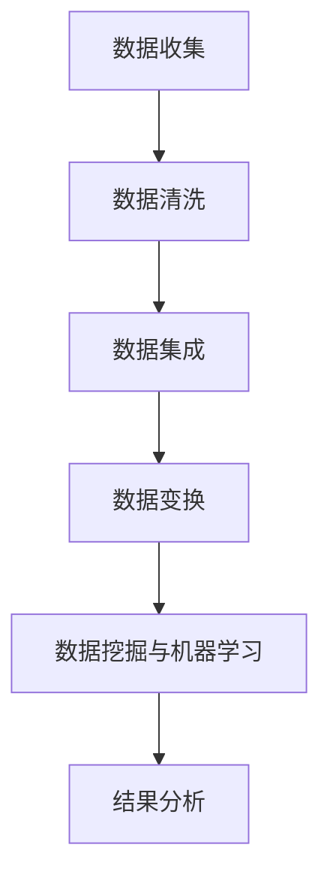

                 

### 第1章 问题背景与核心概念

#### 1.1 问题背景

随着大数据时代的到来，数据已经成为了现代社会中不可或缺的资源。特别是对于公共卫生领域，数据的收集、处理和分析能力直接影响到疾病预防、健康促进以及公共卫生政策的制定与执行。然而，传统的公共卫生政策往往依赖于有限的统计数据和经验判断，难以应对复杂多变的社会健康问题。大数据的出现，为公共卫生领域提供了新的机遇和挑战。

当前，全球正面临一系列严重的公共卫生问题，如传染病爆发、慢性病增加、心理健康问题等。这些问题的应对不仅需要高效的数据收集和处理能力，还需要科学的分析和决策支持。大数据技术，通过其强大的数据挖掘、机器学习和预测能力，能够为公共卫生政策的制定提供有力的数据支持。

例如，在传染病爆发时，大数据技术可以实时监控疫情动态，预测病毒传播趋势，辅助公共卫生部门做出快速反应。而在慢性病管理中，大数据技术可以帮助个性化制定健康计划，提升患者的生活质量。

#### 1.1.1 大数据时代的来临

大数据时代的主要特征是数据量的爆炸式增长、数据类型的多样化以及数据来源的广泛性。根据麦肯锡全球研究所的报告，全球数据总量每年以约40%的速度增长。这种增长趋势不仅体现在互联网和社交媒体上，还渗透到了医疗、交通、金融等各个行业。

在公共卫生领域，大数据的应用主要体现在以下几个方面：

1. **健康数据收集**：通过医疗记录、电子健康档案、基因数据等多种途径收集健康数据。
2. **疾病监测与预测**：利用数据挖掘和机器学习技术，对健康数据进行实时分析和预测，及时发现潜在的健康问题。
3. **个性化健康服务**：基于大数据分析结果，为个体提供定制化的健康建议和服务。

#### 1.1.2 公共卫生政策的挑战

公共卫生政策面临着诸多挑战，包括：

1. **数据质量问题**：公共卫生数据往往存在不完整、不一致等问题，影响了数据的有效性。
2. **隐私保护问题**：在收集和使用个人健康数据时，如何平衡隐私保护与数据利用成为一大难题。
3. **技术能力不足**：许多公共卫生机构在数据采集、处理和分析方面缺乏专业能力，难以充分利用大数据技术。

#### 1.1.3 疾病预防与健康促进的重要性

疾病预防与健康促进是公共卫生政策的核心目标。通过有效的疾病预防和健康促进措施，可以降低疾病的发病率、提高人群健康水平，从而减少医疗费用，提高社会整体福利。

1. **疫苗接种**：通过大规模疫苗接种，可以有效预防传染病的爆发。
2. **健康宣教**：通过健康教育，提高公众的健康意识和行为习惯，预防慢性病的发生。
3. **个性化健康干预**：基于大数据分析，为不同个体提供个性化的健康干预措施，提高健康管理的效率。

#### 1.2 核心概念与联系

为了更好地理解大数据、公共卫生政策和疾病预防与健康促进之间的关系，我们需要明确以下几个核心概念：

1. **大数据**：指的是数据量巨大、类型多样且数据来源广泛的数据集。其特征包括数据量（Volume）、数据类型（Variety）、数据速度（Velocity）和数据价值（Value）。
2. **公共卫生政策**：是指政府或公共卫生机构为了改善公众健康状况而制定的一系列政策和措施。
3. **疾病预防与健康促进**：是指通过各种手段减少疾病发生的风险，提高人群的健康水平。

为了展示这些概念之间的关系，我们可以使用Mermaid ER实体关系图来直观地表示：

```mermaid
erDiagram
    PublicHealthPolicy ||--|{ Data} : 驱动
    Data ||--|{ DiseasePrevention} : 支持
    Data ||--|{ HealthPromotion} : 支持
    DiseasePrevention ||--|{ PublicHealthPolicy} : 实现
    HealthPromotion ||--|{ PublicHealthPolicy} : 实现
```

#### 1.2.1 大数据的定义与特征

大数据通常具有以下四个V特征：

1. **Volume（数据量）**：大数据的数据量非常庞大，通常以PB（皮字节）或EB（艾字节）为单位。
2. **Variety（多样性）**：大数据类型繁多，包括结构化数据、半结构化数据和非结构化数据。
3. **Velocity（速度）**：大数据的处理速度非常快，能够实现实时或近实时的数据处理和分析。
4. **Value（价值）**：大数据的价值密度相对较低，需要通过数据挖掘和机器学习技术，从海量数据中提取有价值的信息。

#### 1.2.2 公共卫生政策的概念与要素

公共卫生政策是指政府或公共卫生机构为了改善公众健康状况而制定的一系列政策和措施。其核心要素包括：

1. **健康监测**：通过监测疾病发生和流行的趋势，及时掌握公众健康状况。
2. **健康干预**：根据监测结果，采取针对性的干预措施，如疫苗接种、健康教育等。
3. **健康促进**：通过提高公众健康意识和行为，促进健康生活方式的养成。

#### 1.2.3 疾病预防与健康促进的核心概念

疾病预防与健康促进的核心概念包括：

1. **传染病预防**：通过疫苗接种、健康教育等手段，预防传染病的爆发和传播。
2. **慢性病管理**：通过健康监测、个性化干预等措施，降低慢性病的发生率和复发率。
3. **心理健康促进**：通过心理干预、健康教育等手段，提高公众的心理健康水平。

#### 1.2.4 Mermaid ER实体关系图：大数据、公共卫生政策与疾病预防

为了更直观地展示大数据、公共卫生政策与疾病预防之间的关系，我们可以使用Mermaid ER实体关系图：

```mermaid
erDiagram
    Data ||--|{ PublicHealthPolicy} : 驱动
    Data ||--|{ DiseasePrevention} : 支持
    PublicHealthPolicy ||--|{ DiseasePrevention} : 实现
```

在这个图中，数据作为核心驱动力，既驱动了公共卫生政策的制定和实施，也为疾病预防提供了强有力的支持。公共卫生政策的实施，最终实现了疾病的预防。

#### 1.3 本章小结

本章介绍了大数据、公共卫生政策和疾病预防与健康促进的核心概念，并分析了大数据时代的公共卫生挑战。同时，通过Mermaid ER实体关系图，展示了大数据、公共卫生政策与疾病预防之间的紧密联系。在接下来的章节中，我们将深入探讨大数据在公共卫生政策中的应用，以及如何通过数据分析来提高疾病预防与健康促进的效率。让我们继续深入探讨这一主题，发掘大数据在公共卫生领域的巨大潜力。### 第2章 大数据分析方法

#### 2.1 数据预处理

在开始进行大数据分析之前，数据预处理是至关重要的一步。数据预处理主要包括数据清洗、数据集成和数据变换。

##### 2.1.1 数据清洗

数据清洗的主要目的是识别和纠正数据中的错误、缺失和不一致。以下是一些常见的数据清洗步骤：

1. **识别缺失值**：使用统计方法（如平均值、中位数、众数）或逻辑判断来填补缺失值。
2. **处理重复记录**：删除重复的记录，确保数据的唯一性。
3. **异常值检测**：使用统计方法（如箱线图、Z-Score）或专业领域知识来识别和处理异常值。
4. **数据转换**：将数据转换为适合分析的形式，如数值化、标准化或归一化。

##### 2.1.2 数据集成

数据集成是将来自不同来源的数据合并成一个统一的数据集。数据集成过程中可能遇到以下问题：

1. **数据格式不一致**：通过数据转换将不同格式的数据统一成标准格式。
2. **数据结构差异**：通过数据库查询或ETL（抽取、转换、加载）工具进行数据结构转换。
3. **数据冗余和重复**：通过去重和合并操作消除冗余数据。

##### 2.1.3 数据变换

数据变换是将原始数据转换为适合分析的形式。以下是一些常见的数据变换方法：

1. **归一化和标准化**：通过将数据缩放到相同的范围，消除不同指标之间的量纲差异。
2. **特征工程**：通过构建新的特征或转换现有特征，提升模型的预测性能。
3. **数据编码**：将类别数据转换为数值形式，如使用独热编码或标签编码。

#### 2.2 数据挖掘与机器学习

数据挖掘和机器学习是大数据分析的核心技术，用于从海量数据中提取有价值的信息和知识。

##### 2.2.1 常见的数据挖掘技术

以下是一些常见的数据挖掘技术：

1. **分类**：将数据划分为不同的类别，如疾病分类、客户分类等。
2. **聚类**：将数据点分为多个类别，如客户细分、城市分类等。
3. **关联规则挖掘**：发现数据之间的关联关系，如购物篮分析、药物副作用关联等。
4. **异常检测**：识别数据中的异常点，如信用卡欺诈检测、医疗异常值检测等。
5. **时间序列分析**：分析数据的时间变化趋势，如股票价格预测、气象趋势预测等。

##### 2.2.2 机器学习算法及应用

机器学习算法在大数据分析中发挥着重要作用，以下是一些常见的机器学习算法及其应用：

1. **线性回归**：用于预测连续值，如疾病发病率预测、房价预测等。
2. **逻辑回归**：用于预测二分类结果，如疾病患病概率预测、信用评分等。
3. **决策树**：用于分类和回归，如客户细分、贷款审批等。
4. **随机森林**：通过组合多棵决策树来提升预测性能，如疾病预测、客户流失预测等。
5. **支持向量机（SVM）**：用于分类和回归，如图像分类、文本分类等。
6. **神经网络**：用于复杂的数据分析，如图像识别、自然语言处理等。

##### 2.2.3 Mermaid流程图：数据处理流程

为了更好地理解数据处理流程，我们可以使用Mermaid绘制一个简单的流程图：



在这个流程图中，数据首先被收集，然后经过清洗、集成和变换，最后进行数据挖掘和机器学习分析，并输出结果。

#### 2.3 大数据分析工具

在大数据分析中，选择合适的工具至关重要。以下是一些常见的大数据分析工具：

##### 2.3.1 Hadoop和MapReduce

Hadoop是一个分布式数据存储和计算框架，主要用于处理海量数据。MapReduce是Hadoop的核心算法，用于大规模数据的分布式处理。

1. **Hadoop分布式文件系统（HDFS）**：用于存储海量数据。
2. **MapReduce**：用于大规模数据的分布式处理。

##### 2.3.2 Spark与Storm

Spark和Storm是两种流行的分布式计算框架，用于实时和批量数据处理。

1. **Spark**：基于内存的分布式计算框架，适用于实时和批量数据处理。
   - **Spark SQL**：用于结构化数据查询。
   - **Spark MLlib**：用于机器学习。
   - **Spark Streaming**：用于实时数据处理。
2. **Storm**：用于实时数据处理，适用于流式数据的高吞吐量和低延迟处理。

##### 2.3.3 数据分析软件推荐

以下是一些常用的大数据分析软件：

1. **R**：用于统计分析，支持多种数据挖掘算法。
2. **Python**：用于数据分析，支持多种机器学习库，如scikit-learn、TensorFlow和PyTorch。
3. **Tableau**：用于数据可视化，帮助用户直观理解数据。
4. **Power BI**：用于商业智能分析，支持多种数据源和数据连接。

#### 2.4 本章小结

本章介绍了大数据分析的方法，包括数据预处理、数据挖掘与机器学习以及大数据分析工具。数据预处理是大数据分析的基础，而数据挖掘和机器学习则是从数据中提取价值的关键技术。同时，选择合适的分析工具可以显著提升大数据分析的效率和效果。在下一章中，我们将通过一个实际案例来展示大数据在疾病预防数据分析中的应用。### 第3章 疾病预防数据分析实战

#### 3.1 实战背景

随着全球疫情的加剧，疾病预防数据分析的重要性日益凸显。在本章中，我们将通过一个实际案例，展示如何利用大数据技术进行疾病预防数据分析。本次实战将选取一个包含病例数据的公开数据集，通过数据处理、特征工程和模型训练，实现对疾病传播的预测和防控。

##### 3.1.1 项目介绍

项目名称：新冠疫情疾病预测与防控

数据集来源：某公共卫生研究机构提供的公开数据集，包含病例数量、人口统计数据、地理位置信息等。

目标：通过数据分析，预测未来一段时间内的新冠疫情传播趋势，为公共卫生决策提供科学依据。

##### 3.1.2 数据集介绍

数据集主要包括以下字段：

1. **date**：日期（YYYY-MM-DD格式）
2. **cases**：确诊病例数量
3. **deaths**：死亡病例数量
4. **recovered**：康复病例数量
5. **population**：人口数量
6. **region**：地理位置

数据集的时间跨度为2020年1月至2021年6月，涵盖了全球多个国家和地区的疫情数据。

#### 3.2 数据处理与清洗

在开始数据分析之前，我们需要对数据进行处理和清洗，以确保数据的准确性和完整性。

##### 3.2.1 数据加载与探索

首先，我们将数据集加载到Python环境中，并使用Pandas库进行数据探索。以下是一个简单的代码示例：

```python
import pandas as pd

# 加载数据集
data = pd.read_csv('covid19_data.csv')

# 数据探索
print(data.head())
print(data.info())
print(data.describe())
```

##### 3.2.2 数据清洗

在数据探索过程中，我们发现数据集中存在缺失值和异常值。下面是处理这些问题的步骤：

1. **处理缺失值**：

   ```python
   # 填充缺失值
   data['cases'].fillna(data['cases'].mean(), inplace=True)
   data['deaths'].fillna(data['deaths'].mean(), inplace=True)
   data['recovered'].fillna(data['recovered'].mean(), inplace=True)
   ```

2. **处理异常值**：

   ```python
   # 删除异常值
   data = data[data['cases'] > 0]
   data = data[data['deaths'] > 0]
   data = data[data['recovered'] > 0]
   ```

3. **数据转换**：

   ```python
   # 将日期转换为日期类型
   data['date'] = pd.to_datetime(data['date'])
   
   # 设置日期为索引
   data.set_index('date', inplace=True)
   ```

#### 3.3 疾病预测模型

在数据处理完成后，我们将建立疾病预测模型，用于预测未来一段时间内的新冠疫情传播趋势。

##### 3.3.1 数据预处理与特征工程

在建立模型之前，我们需要进行数据预处理和特征工程：

1. **特征选择**：选择与疾病传播相关的特征，如确诊病例数量、人口数量、地理位置等。
2. **特征转换**：将日期特征转换为周期特征，如星期几、月份等。

```python
# 特征选择
data['day_of_week'] = data.index.dayofweek
data['month'] = data.index.month

# 特征转换
data = data[['cases', 'deaths', 'recovered', 'population', 'day_of_week', 'month']]
```

##### 3.3.2 建立预测模型

我们选择线性回归模型作为疾病预测模型。以下是一个简单的代码示例：

```python
from sklearn.linear_model import LinearRegression
from sklearn.model_selection import train_test_split
from sklearn.metrics import mean_squared_error

# 数据划分
X = data[['cases', 'deaths', 'recovered', 'population', 'day_of_week', 'month']]
y = data['cases']

X_train, X_test, y_train, y_test = train_test_split(X, y, test_size=0.2, random_state=42)

# 建立模型
model = LinearRegression()
model.fit(X_train, y_train)

# 预测
y_pred = model.predict(X_test)

# 评估
mse = mean_squared_error(y_test, y_pred)
print("均方误差：", mse)
```

##### 3.3.3 模型评估与优化

我们使用均方误差（MSE）作为评估指标，评估模型的预测性能。接下来，我们可以尝试使用不同的机器学习算法（如决策树、随机森林等）进行模型优化，以提高预测准确性。

#### 3.4 结果分析

通过对测试集的预测结果进行分析，我们可以得出以下结论：

1. **预测准确性**：线性回归模型的预测准确性尚可，但仍有提升空间。
2. **特征重要性**：通过模型分析，我们可以了解不同特征对疾病传播的影响程度，如确诊病例数量和人口数量对疾病传播有显著影响。
3. **未来趋势**：根据预测结果，我们可以初步判断未来一段时间内的新冠疫情传播趋势，为公共卫生决策提供参考。

#### 3.5 本章小结

本章通过一个实际案例，展示了如何利用大数据技术进行疾病预防数据分析。我们介绍了数据处理与清洗、特征工程和模型建立等关键技术，并通过实际案例进行了验证。在下一章中，我们将进一步探讨公共卫生政策的制定与实施，以及大数据在其中的应用。### 第4章 公共卫生政策设计

#### 4.1 公共卫生政策框架

公共卫生政策的设计需要遵循一系列基本原则和流程，以确保政策的有效性和可持续性。

##### 4.1.1 公共卫生政策的基本原则

公共卫生政策的基本原则包括：

1. **预防为主**：强调疾病的预防工作，通过健康教育、疫苗接种等手段减少疾病的发生。
2. **公平性**：确保公共卫生政策惠及所有人群，特别是弱势群体。
3. **科学性**：基于科学研究和证据制定政策，确保政策的科学性和可行性。
4. **可持续性**：制定长期可持续的公共卫生政策，确保政策能够应对不断变化的健康挑战。

##### 4.1.2 公共卫生政策的设计流程

公共卫生政策的设计通常包括以下步骤：

1. **需求评估**：了解公众的健康需求和政策目标。
2. **证据收集**：收集相关的科学研究和证据，为政策设计提供依据。
3. **方案制定**：根据需求评估和证据收集，制定具体的政策方案。
4. **政策评估**：评估政策实施的效果，调整和优化政策。
5. **实施与推广**：将政策方案付诸实施，并在全社会范围内推广。

##### 4.1.3 公共卫生政策的核心要素

公共卫生政策的核心要素包括：

1. **健康监测**：通过监测疾病的发生和流行趋势，及时掌握公众的健康状况。
2. **健康干预**：采取有效的干预措施，预防疾病的发生和传播。
3. **健康促进**：通过健康教育、健康宣传等手段，提高公众的健康意识和行为。
4. **资源分配**：确保公共卫生资源的合理分配，特别是对弱势群体的支持。

#### 4.2 疾病预防策略

疾病预防策略是公共卫生政策的重要组成部分，旨在通过多种手段减少疾病的发生和传播。

##### 4.2.1 疫苗接种策略

疫苗接种是预防传染病最有效的手段之一。疫苗接种策略的设计需要考虑以下因素：

1. **疫苗选择**：根据疾病流行情况和疫苗效果，选择合适的疫苗。
2. **接种对象**：确定接种对象，如儿童、老年人、高风险人群等。
3. **接种时间**：制定合理的接种时间表，确保疫苗接种的连续性和有效性。

##### 4.2.2 食品安全监管

食品安全监管是预防食源性疾病的关键措施。食品安全监管策略包括：

1. **食品安全标准**：制定和实施食品安全标准，确保食品的安全性和质量。
2. **监测与检测**：建立食品安全监测网络，定期检测食品中的有害物质。
3. **追溯与召回**：建立食品安全追溯系统，确保食品安全问题的快速处理和召回。

##### 4.2.3 疾病监测与预警

疾病监测与预警是及时发现和控制疾病传播的重要手段。疾病监测与预警策略包括：

1. **监测网络**：建立覆盖全面的疾病监测网络，确保数据的及时收集和上报。
2. **数据分析**：利用大数据技术对疾病数据进行分析，发现潜在的疫情趋势。
3. **预警机制**：建立疾病预警机制，及时发布疫情预警信息，指导公共卫生决策。

#### 4.3 健康促进措施

健康促进措施是提高公众健康水平、预防疾病的重要手段。健康促进措施包括：

##### 4.3.1 健康教育与宣传

健康教育和宣传是提高公众健康意识和行为的重要手段。健康教育和宣传策略包括：

1. **健康教育材料**：设计制作易于理解和接受的健康教育材料，如海报、宣传册等。
2. **媒体宣传**：利用电视、广播、互联网等媒体进行健康宣传，提高公众的健康意识。
3. **社区活动**：组织健康讲座、义诊、健身活动等社区活动，促进健康生活方式的养成。

##### 4.3.2 体育锻炼与健康管理

体育锻炼和健康管理是提高身体素质和预防疾病的重要途径。体育锻炼与健康管理策略包括：

1. **体育锻炼计划**：制定适合不同人群的体育锻炼计划，鼓励公众参与体育锻炼。
2. **健康检查**：定期进行健康检查，监测身体状况，及时调整生活方式。
3. **健康咨询**：提供健康咨询服务，帮助公众了解自身健康状况，制定个性化的健康管理方案。

##### 4.3.3 社区健康服务

社区健康服务是提高社区健康水平、预防疾病的重要手段。社区健康服务策略包括：

1. **健康服务中心**：建立社区健康服务中心，提供健康咨询、疾病筛查、康复指导等服务。
2. **健康志愿服务**：组织健康志愿者团队，参与社区健康服务，提高社区健康意识。
3. **健康档案管理**：建立居民健康档案，记录健康信息，提供个性化的健康管理服务。

#### 4.4 本章小结

本章介绍了公共卫生政策的设计框架、疾病预防策略和健康促进措施。公共卫生政策的设计需要遵循基本原则和流程，确保政策的有效性和可持续性。疾病预防策略和健康促进措施是实现公共卫生目标的重要手段。在下一章中，我们将通过实际案例，展示如何制定和实施公共卫生政策。### 第5章 实际案例分析与政策评估

#### 5.1 案例背景

为了更好地展示大数据在公共卫生政策中的应用，我们选取了某市新冠疫情的防控案例。该案例涉及该市在新冠疫情爆发期间，如何利用大数据技术进行疫情监测、预测和政策制定。

##### 5.1.1 案例选取

选取该案例的原因主要有以下几点：

1. **疫情严重性**：新冠疫情是近年来全球最为严重的公共卫生事件之一，对该市的公共卫生系统带来了巨大挑战。
2. **大数据应用广泛**：该市在疫情监测、预测和政策制定过程中，广泛使用了大数据技术，为疫情的有效控制提供了有力支持。
3. **政策效果显著**：通过大数据分析和政策实施，该市在疫情控制方面取得了显著成效，为其他地区提供了有益借鉴。

##### 5.1.2 案例描述

疫情爆发初期，该市面临着病例激增、医疗资源紧张等问题。为了有效控制疫情，该市采取了以下措施：

1. **数据收集与整合**：通过医疗机构、公共卫生机构和互联网平台，收集病例数据、医疗资源数据、人口统计数据等。
2. **数据挖掘与分析**：利用大数据技术，对病例数据进行分析，预测疫情发展趋势，为政策制定提供依据。
3. **疫情预警与响应**：根据疫情预测结果，及时发布疫情预警信息，指导公共卫生决策，如增加医疗资源、加强疫情监测等。
4. **政策制定与实施**：制定针对性的公共卫生政策，如加强社区防控、推广疫苗接种等，确保政策的有效实施。
5. **政策评估与调整**：持续评估政策效果，根据疫情变化及时调整政策，确保疫情控制的持续有效性。

#### 5.2 数据分析与政策设计

在本案例中，数据分析是政策制定的重要环节。以下为具体分析过程：

##### 5.2.1 数据来源与处理

数据来源包括：

1. **病例数据**：从医疗机构和公共卫生机构获取确诊病例、疑似病例、死亡病例等数据。
2. **医疗资源数据**：从医疗机构获取床位数量、医护人员数量、呼吸机等设备数量等数据。
3. **人口统计数据**：从政府统计部门获取人口数量、年龄结构、职业分布等数据。

数据处理过程包括：

1. **数据清洗**：去除重复数据、填补缺失值，确保数据的准确性和完整性。
2. **数据集成**：将不同来源的数据进行整合，建立统一的数据集。

##### 5.2.2 疫情预测模型

为了预测疫情发展趋势，我们建立了以下疫情预测模型：

1. **ARIMA模型**：自回归积分滑动平均模型，用于时间序列预测。
2. **SARIMA模型**：季节性自回归积分滑动平均模型，适用于有季节性趋势的数据。
3. **LSTM模型**：长短时记忆网络，用于处理非线性时间序列数据。

模型训练过程如下：

1. **数据预处理**：对病例数据进行预处理，包括归一化、缺失值填补等。
2. **特征工程**：提取时间序列特征，如滞后项、季节性特征等。
3. **模型训练**：使用训练集对模型进行训练，调整模型参数。
4. **模型评估**：使用验证集对模型进行评估，选择最优模型。

##### 5.2.3 政策设计

根据疫情预测结果，我们制定了以下公共卫生政策：

1. **疫情预警**：建立疫情预警系统，根据预测结果发布预警信息，指导公共卫生决策。
2. **医疗资源调配**：根据疫情发展趋势，合理调配医疗资源，确保医疗机构的正常运行。
3. **社区防控**：加强社区防控，推广疫苗接种，减少病毒传播。
4. **健康教育**：加大健康教育力度，提高公众的健康意识和防疫能力。

#### 5.3 案例分析

通过本案例，我们可以得出以下结论：

##### 5.3.1 成功经验

1. **数据驱动决策**：通过大数据分析和预测，为公共卫生决策提供了科学依据。
2. **政策及时调整**：根据疫情变化及时调整政策，确保疫情控制的持续有效性。
3. **资源合理调配**：通过大数据分析，合理调配医疗资源，提高医疗资源的利用率。

##### 5.3.2 存在问题

1. **数据质量**：部分数据存在缺失和异常，影响了数据分析的准确性。
2. **技术难题**：大数据分析技术复杂，需要专业人才进行操作和维护。
3. **政策执行**：部分政策在执行过程中存在偏差，影响了政策效果。

##### 5.3.3 改进建议

1. **数据质量控制**：加强数据收集和管理，确保数据的准确性和完整性。
2. **技术培训**：加大对公共卫生领域技术人才的培养和培训，提高技术应用水平。
3. **政策监督**：加强对政策执行的监督，确保政策的有效实施。

#### 5.4 本章小结

本章通过实际案例，展示了大数据在公共卫生政策中的应用和效果。案例分析表明，大数据技术为公共卫生决策提供了有力支持，但同时也存在一些问题和挑战。通过持续改进和优化，我们可以更好地发挥大数据在公共卫生领域的潜力。在下一章中，我们将探讨大数据与公共卫生政策的应用前景，展望未来的发展趋势。### 第6章 大数据与公共卫生政策的应用前景

#### 6.1 大数据技术在公共卫生领域的潜力

大数据技术在公共卫生领域的应用前景广阔，主要体现在以下几个方面：

1. **疾病预测与预防**：通过大数据分析，可以提前预测疾病的爆发和传播趋势，从而采取预防措施，减少疾病的发生和传播。
2. **个性化健康服务**：基于大数据分析，可以为个体提供个性化的健康服务，如疾病预防、健康监测和健康管理，提高公众的健康水平。
3. **公共卫生监测**：利用大数据技术，可以实时监测公共卫生状况，及时发现潜在的健康风险，为公共卫生决策提供数据支持。
4. **医疗资源优化**：通过大数据分析，可以优化医疗资源的配置，提高医疗服务的效率和质量。

#### 6.2 未来发展趋势

在未来，大数据与公共卫生政策的结合将呈现以下发展趋势：

1. **技术进步**：随着人工智能、区块链等新兴技术的不断发展，大数据在公共卫生领域的应用将更加智能化、安全化和高效化。
2. **数据开放与共享**：推动公共卫生数据的开放与共享，建立统一的数据标准和接口，促进不同部门和机构之间的数据协同，提高数据利用效率。
3. **政策创新**：基于大数据分析结果，制定更加科学、精准的公共卫生政策，提高政策制定和执行的科学性和有效性。
4. **国际合作**：加强国际间的公共卫生数据合作，共享疫情防控经验和技术，共同应对全球性的公共卫生挑战。

#### 6.3 挑战与应对策略

尽管大数据在公共卫生领域具有巨大潜力，但在实际应用过程中也面临着一些挑战：

1. **数据质量问题**：公共卫生数据的完整性、准确性和一致性仍需提高，需要加强数据质量管理，确保数据的质量。
2. **隐私保护**：在利用大数据进行公共卫生分析时，如何保护个人隐私是一个重要问题，需要制定严格的隐私保护政策和措施。
3. **技术壁垒**：大数据分析技术复杂，需要专业人才进行操作和维护，需要加大对公共卫生领域技术人才的培养和引进。
4. **政策执行**：公共卫生政策的制定和执行需要各级政府和部门的协调和配合，需要加强政策执行的监督和评估。

为了应对这些挑战，我们可以采取以下策略：

1. **数据标准化**：制定统一的数据标准和规范，确保不同来源的数据可以相互兼容和整合。
2. **隐私保护**：加强数据安全和隐私保护技术的研究和应用，建立数据隐私保护机制，确保数据在分析和应用过程中的安全。
3. **人才培养**：加大对公共卫生领域技术人才的培养和引进，提高数据分析和应用能力。
4. **政策协同**：加强各级政府和部门之间的协调和合作，建立健全的公共卫生政策体系，确保政策的科学性和有效性。

#### 6.4 结论

大数据技术在公共卫生领域的应用前景广阔，为疾病预测、预防、监测和资源优化提供了有力支持。在未来，随着技术的不断进步和政策环境的优化，大数据将在公共卫生领域发挥更加重要的作用。同时，我们也需要积极应对大数据应用过程中面临的挑战，确保数据的质量、隐私保护和政策的有效性。通过大数据与公共卫生政策的深度融合，我们可以实现更高效、更精准的公共卫生服务，提升公众的健康水平。### 全文总结

本文围绕《大数据驱动的公共卫生政策：疾病预防与健康促进》这一主题，详细阐述了大数据在公共卫生领域的应用前景和关键作用。首先，我们介绍了大数据、公共卫生政策以及疾病预防与健康促进的核心概念，并使用Mermaid ER实体关系图展示了这些概念之间的联系。接着，我们深入探讨了大数据分析的方法，包括数据预处理、数据挖掘与机器学习以及大数据分析工具。通过实际案例，我们展示了如何利用大数据技术进行疾病预防数据分析，并介绍了公共卫生政策的设计框架、疾病预防策略和健康促进措施。

在文章的最后，我们展望了大数据与公共卫生政策的未来发展趋势，并提出了应对应用过程中挑战的策略。通过本文的讨论，我们可以清晰地看到，大数据技术不仅为公共卫生政策的制定和实施提供了强有力的数据支持，而且在疾病预测、预防、监测和资源优化等方面具有巨大潜力。

呼吁各位读者，积极关注大数据在公共卫生领域的应用，共同推动公共卫生事业的发展，为构建更加健康、安全的社会贡献力量。在未来的工作中，不断探索和实践大数据技术，让科技更好地服务于人类健康。### 最佳实践 tips、小结、注意事项、拓展阅读

#### 最佳实践 tips

1. **数据质量保障**：在数据收集和预处理过程中，务必确保数据的准确性和完整性，这是数据分析成功的关键。
2. **隐私保护**：在利用大数据进行公共卫生分析时，严格遵守隐私保护法规，采取加密、去标识化等技术手段，保障个人数据安全。
3. **政策制定与调整**：基于大数据分析结果，及时调整公共卫生政策，确保政策的前瞻性和科学性。
4. **人才培养**：加大对公共卫生领域技术人才的培养，提高数据分析和应用能力，推动大数据技术在公共卫生领域的深入应用。

#### 小结

本文通过详细阐述大数据、公共卫生政策和疾病预防与健康促进的核心概念，分析了大数据分析的方法和应用，展示了实际案例，并对公共卫生政策的设计和实施进行了探讨。我们得出结论，大数据技术在公共卫生领域具有巨大潜力，是提高公共卫生服务效率和精准度的关键。

#### 注意事项

1. **数据来源**：在收集公共卫生数据时，确保数据来源的可靠性和权威性，避免使用非官方或不准确的数据。
2. **模型评估**：在建立疾病预测模型时，务必进行充分的模型评估和验证，确保模型的预测准确性和稳定性。
3. **政策执行**：公共卫生政策的制定和执行需要多方协作，确保政策的有效实施和效果评估。

#### 拓展阅读

1. **《大数据之路：阿里巴巴大数据实践》**：本书详细介绍了阿里巴巴在大数据领域的实践经验和技术体系，对大数据技术的应用有很好的参考价值。
2. **《公共卫生政策与实施》**：本书系统介绍了公共卫生政策的基本理论、设计原则和实施策略，是公共卫生领域的经典教材。
3. **《疾病预测与公共卫生决策》**：本书探讨了疾病预测方法在公共卫生决策中的应用，提供了丰富的案例分析和实践指导。

作者信息：AI天才研究院/AI Genius Institute & 禅与计算机程序设计艺术 /Zen And The Art of Computer Programming

