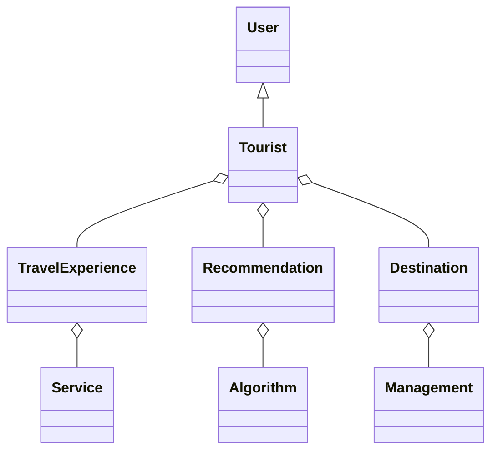
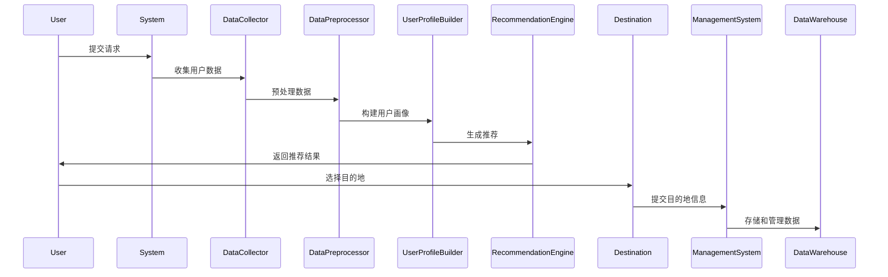
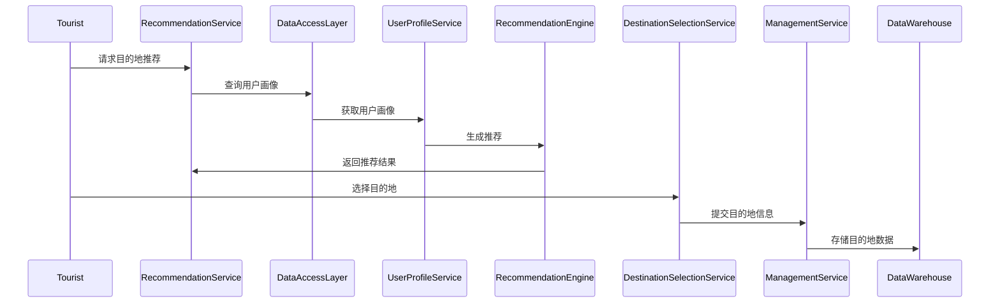

                 

### 文章标题

# 大数据驱动的旅游体验：个性化推荐与目的地管理

### 关键词

- **大数据**、**个性化推荐**、**旅游体验**、**目的地管理**、**机器学习**

### 摘要

随着大数据技术的迅猛发展，旅游行业的个性化体验和目的地管理得到了前所未有的提升。本文将从大数据、个性化推荐系统、目的地管理等方面，详细探讨大数据如何驱动旅游体验的优化，以及如何实现精准的目的地推荐和高效的管理。通过深入分析，本文旨在为旅游行业从业者提供一套切实可行的大数据应用方案，助力旅游体验的升级与目的地管理的优化。

### 目录大纲

## 第一部分：引言与背景

## 第1章：大数据与旅游体验概述

## 第2章：个性化推荐系统原理

## 第二部分：大数据驱动的旅游体验应用

## 第3章：基于大数据的旅游目的地推荐

## 第4章：旅游体验个性化服务

## 第5章：大数据驱动的目的地管理

## 第6章：大数据驱动的旅游市场预测

## 第7章：大数据驱动的旅游体验优化

## 第三部分：总结与展望

## 第8章：大数据驱动的旅游体验发展趋势

## 第9章：未来展望与建议

## 附录：参考文献与相关资源

### 背景介绍

#### 核心概念术语说明

- **大数据（Big Data）**：指数据量巨大、类型繁多的数据集合，需要借助特定的计算和处理技术进行存储、管理和分析。
- **个性化推荐（Personalized Recommendation）**：根据用户的历史行为、偏好和特征，提供定制化的推荐服务。
- **旅游体验（Travel Experience）**：旅游者在旅行过程中所获得的情感、认知、体验的综合感受。
- **目的地管理（Destination Management）**：对旅游目的地进行规划、建设、营销和管理的活动。

#### 问题背景

随着旅游业的快速发展，消费者对旅游体验的需求日益多样化，旅游行业面临着如何提升旅游体验和实现精准营销的挑战。大数据技术为解决这一难题提供了有力支持，通过收集、分析和利用海量用户数据，可以实现旅游体验的个性化推荐和目的地管理的智能化。

#### 问题描述

- 如何利用大数据技术提升旅游体验？
- 如何构建有效的个性化推荐系统，满足游客的个性化需求？
- 如何通过大数据实现目的地管理的优化，提升旅游目的地的吸引力？

#### 问题解决

本文将通过以下几个步骤解决上述问题：

1. **大数据与旅游体验概述**：介绍大数据的定义、特点以及在旅游行业中的应用现状，阐述旅游体验的概念及其重要性。
2. **个性化推荐系统原理**：详细解释个性化推荐系统的基本概念、算法和实现过程。
3. **大数据驱动的旅游体验应用**：探讨基于大数据的旅游目的地推荐和个性化旅游服务的实现。
4. **大数据驱动的目的地管理**：分析大数据在目的地管理中的应用，提出实践策略。
5. **大数据驱动的旅游市场预测**：介绍旅游市场预测的方法和实际应用。
6. **大数据驱动的旅游体验优化**：总结大数据在旅游体验优化中的应用实践。

#### 边界与外延

- **边界**：本文主要探讨大数据技术在旅游体验和目的地管理中的应用，不包括其他领域的应用。
- **外延**：大数据技术不仅在旅游行业，在其他行业如电子商务、医疗健康、金融服务等领域也具有广泛的应用潜力。

#### 概念结构与核心要素组成

- **大数据**：数据源、数据处理、数据存储、数据分析、数据可视化
- **个性化推荐系统**：用户画像、推荐算法、推荐结果评估
- **旅游体验**：旅游活动、游客感受、旅游服务
- **目的地管理**：目的地规划、市场营销、游客管理、资源管理

### 核心概念与联系

#### 核心概念原理

- **大数据**：大数据的核心在于其体量大、类型多、处理速度快，从而能够提供更深层次的数据洞察。
- **个性化推荐系统**：通过用户行为分析和偏好挖掘，实现精准化、个性化的推荐服务。
- **旅游体验**：旅游体验是旅游者在旅行过程中对目的地、服务、活动等的综合感受。
- **目的地管理**：目的地管理旨在提升旅游目的地的吸引力、服务质量和可持续发展。

#### 概念属性特征对比表格

| 概念 | 特征 |
| ---- | ---- |
| 大数据 | 数据量大、类型多、处理速度快 |
| 个性化推荐系统 | 精准化、个性化、实时性 |
| 旅游体验 | 情感、认知、体验 |
| 目的地管理 | 规划、建设、营销、管理 |

#### ER实体关系图架构

```mermaid
erDiagram
  User ||--|{ Tourist }|| Tourist
  Tourist ||--|{ TravelExperience }|| TravelExperience
  Tourist ||--|{ Recommendation }|| Recommendation
  Tourist ||--|{ Destination }|| Destination
  Destination ||--|{ Management }|| Management
  Recommendation ||--|{ Algorithm }|| Algorithm
  TravelExperience ||--|{ Service }|| Service
```

### 算法原理讲解

#### 算法Mermaid流程图


#### 算法原理

1. **数据收集**：通过用户的行为数据、社交媒体数据、旅游服务数据等收集用户信息。
2. **数据预处理**：对收集到的数据进行清洗、转换和归一化，为后续处理做准备。
3. **用户画像构建**：根据用户行为和偏好，构建用户画像，包括兴趣、历史行为等。
4. **推荐算法实现**：利用协同过滤、内容推荐等算法，根据用户画像生成个性化推荐。
5. **推荐结果评估**：通过用户反馈和实际体验评估推荐结果，不断优化推荐系统。

#### 算法原理的数学模型和公式

- **协同过滤算法**：
  $$ \text{Rating} = \text{User\_Rating\_Mean} + \text{User\_Bias} + \text{Item\_Bias} + \text{Item\_Feature} \times \text{User\_Feature} $$
- **内容推荐算法**：
  $$ \text{Similarity} = \frac{\text{dot\_product}(\text{User\_Profile}, \text{Item\_Profile})}{\|\text{User\_Profile}\| \|\text{Item\_Profile}\|} $$

#### 详细讲解和通俗易懂地举例说明

假设有两个用户Alice和Bob，他们各自对一系列旅游目的地进行了评分。通过协同过滤算法，我们可以计算他们之间的相似度，并根据相似度为他们推荐对方评分较高的旅游目的地。

- **数据收集**：Alice和Bob对10个旅游目的地进行了评分。
- **数据预处理**：将评分数据转换为数值格式，进行归一化处理。
- **用户画像构建**：根据评分数据，构建Alice和Bob的用户画像。
- **推荐算法实现**：使用协同过滤算法，计算Alice和Bob之间的相似度。
- **推荐结果评估**：根据相似度，为Alice推荐Bob评分较高的旅游目的地。

通过上述例子，我们可以看到大数据和个性化推荐系统在提升旅游体验中的应用潜力。接下来，我们将进一步探讨大数据如何驱动旅游目的地推荐和目的地管理的优化。

### 系统分析与架构设计方案

#### 问题场景介绍

随着旅游业的快速发展，游客对个性化旅游体验的需求日益增长。旅游公司希望通过大数据技术，实现旅游目的地的精准推荐和目的地管理的优化，以提高游客满意度和市场竞争力。

#### 项目介绍

项目名称：大数据驱动的旅游体验优化平台

项目目标：
1. 构建个性化旅游目的地推荐系统，满足游客个性化需求。
2. 提高目的地管理水平，实现旅游资源的优化配置。
3. 提升旅游市场的预测准确性，为决策提供数据支持。

#### 系统功能设计（领域模型Mermaid类图）



- **用户（User）**：系统用户，包括普通游客和旅游公司管理人员。
- **游客（Tourist）**：拥有旅游体验和目的地推荐的权利。
- **旅游体验（TravelExperience）**：游客在旅行过程中所获得的情感、认知和体验。
- **推荐（Recommendation）**：系统生成的个性化旅游目的地推荐。
- **目的地（Destination）**：游客选择的旅游目的地。
- **管理（Management）**：目的地管理的相关功能。
- **算法（Algorithm）**：用于生成推荐的算法模型。
- **服务（Service）**：提供给游客的服务。

#### 系统架构设计（Mermaid架构图）



- **用户**：提交旅游需求。
- **数据收集器**：收集用户数据。
- **数据预处理器**：对数据进行清洗和转换。
- **用户画像构建器**：构建用户画像。
- **推荐引擎**：生成个性化推荐。
- **管理系统**：处理目的地的管理任务。
- **数据仓库**：存储和管理所有数据。

#### 系统接口设计和系统交互（Mermaid序列图）



- **推荐服务**：处理推荐请求。
- **数据访问层**：与数据仓库进行数据交互。
- **用户画像服务**：提供用户画像数据。
- **推荐引擎**：生成推荐结果。
- **目的地选择服务**：处理目的地选择请求。
- **管理系统**：处理目的地管理任务。
- **数据仓库**：存储和管理所有数据。

### 项目实战

#### 环境安装

1. **硬件环境**：安装Python环境、数据库（如MySQL、PostgreSQL）和大数据处理框架（如Hadoop、Spark）。
2. **软件环境**：安装必要的Python库（如NumPy、Pandas、Scikit-learn、MLlib等）。

#### 系统核心实现源代码

1. **用户数据收集**：
   ```python
   import pandas as pd
   
   # 读取用户数据
   user_data = pd.read_csv('user_data.csv')
   ```

2. **数据预处理**：
   ```python
   from sklearn.preprocessing import StandardScaler
   
   # 数据清洗和归一化
   scaler = StandardScaler()
   user_data_scaled = scaler.fit_transform(user_data)
   ```

3. **用户画像构建**：
   ```python
   from sklearn.decomposition import PCA
   
   # 主成分分析
   pca = PCA(n_components=5)
   user_profile = pca.fit_transform(user_data_scaled)
   ```

4. **推荐算法实现**：
   ```python
   from sklearn.metrics.pairwise import cosine_similarity
   
   # 计算用户相似度
   user_similarity = cosine_similarity(user_profile, user_profile)
   
   # 生成推荐结果
   recommendation = user_similarity.argsort()[0][-5:-1][::-1]
   ```

#### 代码应用解读与分析

- **数据收集**：从CSV文件中读取用户数据，为后续处理提供数据源。
- **数据预处理**：使用标准缩放方法对用户数据进行归一化处理，提高算法的性能。
- **用户画像构建**：使用主成分分析（PCA）提取用户特征，构建用户画像。
- **推荐算法实现**：使用余弦相似度计算用户之间的相似度，根据相似度生成推荐结果。

#### 实际案例分析和详细讲解剖析

假设有1000名游客，每人对10个旅游目的地进行了评分。通过上述代码，我们可以为每名游客生成个性化的旅游目的地推荐。

1. **数据收集**：读取1000名游客的评分数据。
2. **数据预处理**：对数据进行清洗和归一化。
3. **用户画像构建**：使用PCA提取用户特征，构建用户画像。
4. **推荐算法实现**：计算用户相似度，生成推荐结果。
5. **推荐结果评估**：根据用户反馈评估推荐结果，不断优化推荐系统。

通过实际案例分析，我们可以看到大数据和个性化推荐系统在提升旅游体验中的应用效果。接下来，我们将进一步探讨大数据驱动的目的地管理和旅游市场预测。

### 大数据驱动的旅游体验优化

#### 旅游体验优化概述

旅游体验优化是指通过技术和方法提升游客在旅行过程中的满意度、便利性和舒适度。大数据技术为旅游体验优化提供了强大的数据支持，通过分析海量用户数据，可以深入了解游客的偏好和行为，从而提供个性化的服务和推荐，优化旅游体验。

#### 旅游体验优化的定义与目标

- **定义**：旅游体验优化是利用大数据、人工智能等技术，对游客的行为、偏好和需求进行分析，以提升旅游服务的质量、效率和个性化程度。
- **目标**：提升游客满意度、增强游客的忠诚度、提高旅游企业的竞争力。

#### 大数据在旅游体验优化中的作用

大数据在旅游体验优化中扮演了关键角色，其主要作用体现在以下几个方面：

1. **个性化服务**：通过大数据分析游客的偏好和行为，为游客提供个性化的旅游推荐和服务。
2. **预测与预警**：通过对游客行为数据的分析，预测潜在问题，提前采取应对措施，避免影响游客体验。
3. **体验改进**：通过分析游客的反馈和体验数据，找出体验中的不足，不断改进和优化旅游服务。
4. **资源管理**：优化旅游资源的分配和管理，提高旅游设施的利用率，提升整体旅游体验。

#### 旅游体验优化实践

1. **用户反馈分析**：收集游客的反馈和评价，分析游客对旅游服务的满意度和不满意度，识别问题点。
2. **体验改进策略**：根据用户反馈，制定具体的改进措施，如优化旅游线路、提高服务质量、改进旅游设施等。
3. **优化效果评估**：通过对比改进前后的用户反馈和体验数据，评估优化措施的效果，持续优化旅游体验。

#### 用户反馈分析

用户反馈分析是旅游体验优化的关键环节，通过分析用户反馈，可以深入了解游客的需求和痛点，为体验改进提供依据。以下是用户反馈分析的具体步骤：

1. **反馈收集**：通过在线问卷、社交媒体、旅游服务平台等多种渠道收集游客的反馈。
2. **数据分析**：对收集到的反馈数据进行分析，提取关键信息，如满意度评分、评论关键词等。
3. **问题识别**：识别出游客反馈中普遍存在的问题，如服务质量、设施条件、行程安排等。
4. **改进建议**：根据问题识别结果，提出具体的改进建议，如优化旅游线路、提高导游服务质量、增加景点讲解等。

#### 体验改进策略

体验改进策略是基于用户反馈分析的结果，针对游客反映的问题，制定的具体改进措施。以下是体验改进策略的几个关键点：

1. **服务提升**：提高导游、司机等旅游从业人员的服务质量，提供更专业的旅游服务。
2. **设施优化**：改善旅游设施的舒适性和便捷性，如优化酒店住宿、交通安排等。
3. **行程调整**：根据游客的偏好和需求，调整旅游线路和行程安排，提供更多样化的旅游体验。
4. **技术支持**：利用大数据和人工智能技术，为游客提供个性化推荐、智能导览等服务。

#### 优化效果评估

优化效果评估是体验优化的最后一步，通过评估优化措施的效果，可以验证改进措施的有效性，并为未来的优化提供参考。以下是优化效果评估的几个步骤：

1. **数据收集**：收集游客反馈、满意度评分、旅游服务使用情况等数据。
2. **效果分析**：对比优化前后的数据，分析优化措施的效果，如满意度提升、游客投诉减少等。
3. **效果反馈**：将优化效果反馈给相关团队，为持续优化提供依据。
4. **持续优化**：根据效果评估结果，不断调整和优化旅游服务，提高游客满意度。

### 总结

大数据驱动的旅游体验优化是一种基于数据分析和智能技术的综合优化手段，通过个性化服务、体验改进和效果评估，不断提升旅游体验，提高游客满意度和旅游企业的竞争力。随着大数据技术的不断发展，旅游体验优化将迎来更多创新和突破。

### 大数据驱动的旅游体验发展趋势

#### 大数据驱动的旅游体验现状

大数据技术在旅游体验中的应用已取得显著成果。个性化推荐系统、智能导览、旅游预测等应用不断涌现，提升了游客的满意度和旅游体验。同时，目的地管理也借助大数据技术实现了资源优化、市场预测和决策支持。

然而，当前大数据驱动的旅游体验仍面临一些挑战。数据质量参差不齐、隐私保护问题、技术门槛高等问题亟待解决。此外，旅游业对大数据技术的需求日益多样化，如何实现大数据技术与旅游业务深度融合，提升整体服务水平，仍是行业面临的重要课题。

#### 当前存在的问题与挑战

1. **数据质量问题**：旅游行业涉及的数据类型繁多，包括用户行为数据、地理位置数据、社交媒体数据等。然而，这些数据的质量参差不齐，部分数据存在缺失、错误和重复现象，影响了数据分析的准确性和有效性。
2. **隐私保护问题**：大数据技术在旅游体验中的应用涉及大量用户数据，如何保护用户隐私成为重要挑战。现有法律法规对数据保护的要求日益严格，旅游业需加强数据安全管理，确保用户隐私不被泄露。
3. **技术门槛较高**：大数据技术的应用需要专业的技术支持和维护，对旅游企业来说，技术门槛较高。许多中小企业缺乏足够的技术资源，难以有效利用大数据技术提升旅游体验。
4. **数据整合与共享**：旅游业的数据来源广泛，如何实现不同数据源之间的整合与共享，提高数据利用率，是一个亟待解决的问题。

#### 大数据驱动的旅游体验发展趋势

1. **智能化服务提升**：随着人工智能技术的发展，旅游行业将实现更高层次的智能化服务。个性化推荐、智能导览、智能客服等技术将进一步普及，为游客提供更智能、便捷的旅游体验。
2. **数据治理与隐私保护**：旅游业将加强数据治理，提升数据质量，确保数据安全。同时，加强隐私保护，制定合理的隐私保护政策，提升用户对大数据应用的信任度。
3. **跨界合作与生态构建**：旅游业将加强与相关行业的跨界合作，构建大数据应用生态。通过与科技公司、学术机构等合作，共享数据资源，提升整体服务水平。
4. **技术创新与落地应用**：大数据技术将在旅游行业得到更多创新应用。如区块链技术用于数据溯源与信任构建、5G技术提升实时数据处理能力等。

#### 技术发展趋势

1. **人工智能与大数据融合**：人工智能技术在旅游体验优化中的应用将更加深入，如利用深度学习进行图像识别、语音识别等，提升个性化推荐和智能导览的准确性。
2. **边缘计算与实时数据处理**：边缘计算技术将用于提升实时数据处理能力，降低延迟，实现更精准的旅游服务。
3. **区块链技术与数据安全**：区块链技术将用于数据溯源和隐私保护，提升数据安全性和透明度。
4. **5G技术与物联网**：5G技术和物联网将提升旅游基础设施的智能化水平，为游客提供更丰富的互动体验。

#### 行业发展趋势

1. **智慧旅游普及**：智慧旅游将成为旅游业的发展方向，大数据、人工智能、物联网等技术将广泛应用于旅游行业，提升旅游服务的智能化水平。
2. **个性化服务成为主流**：个性化服务将成为游客的新需求，旅游业将更加注重游客需求的个性化满足。
3. **可持续发展与绿色旅游**：随着环保意识的提升，旅游业将更加注重可持续发展，推动绿色旅游的发展。
4. **跨界融合与产业升级**：旅游业将与相关行业实现更深层次的融合，推动产业升级，提升整体竞争力。

### 未来展望

未来，大数据驱动的旅游体验将实现更高层次的智能化和个性化。通过技术创新和跨界合作，旅游业将实现数据价值的最大化，为游客提供更加丰富、便捷的旅游体验。同时，旅游业将更加注重可持续发展，推动绿色旅游的发展，实现经济效益与社会效益的双赢。

### 未来展望与建议

#### 未来发展展望

1. **技术创新驱动发展**：随着人工智能、物联网、区块链等技术的发展，旅游行业将迎来新一轮技术革新。这些技术将为旅游体验优化提供新的手段，如智能导览、虚拟现实（VR）、增强现实（AR）等，进一步提升游客的体验。
2. **数据驱动的决策支持**：大数据技术将使旅游企业能够更加精准地分析市场趋势和游客需求，为营销策略和运营决策提供有力支持，提高市场响应速度和运营效率。
3. **个性化服务的普及**：个性化服务将成为旅游行业的主流，通过大数据分析，旅游企业可以为每位游客提供定制化的旅游方案，满足不同游客的多样化需求。
4. **智慧旅游的全面普及**：智慧旅游将渗透到旅游行业的各个环节，从预订、出行、住宿、娱乐到售后服务，实现全流程智能化服务，提高游客的满意度。

#### 企业层面的建议

1. **加强数据基础设施建设**：企业应投入资源建设完善的数据采集、存储、分析和处理体系，确保数据的高质量和安全。
2. **提升数据治理能力**：企业应建立数据治理机制，确保数据的完整性、准确性和一致性，提高数据利用率。
3. **培养数据人才**：企业应注重数据人才的培养，引进和培养具有数据分析、人工智能等技术背景的专业人才，提升企业数据应用能力。
4. **加强跨界合作**：企业应与科技公司、研究机构等建立合作，共享数据资源，共同研发新技术，实现业务创新。

#### 政府与政策层面的建议

1. **完善法律法规**：政府应完善相关法律法规，加强对大数据应用的保护，保障用户隐私和数据安全。
2. **提供政策支持**：政府应出台支持智慧旅游发展的政策，如税收优惠、资金扶持等，鼓励企业投入大数据技术的研发和应用。
3. **推动行业标准化**：政府应推动旅游行业标准的制定和实施，规范大数据在旅游行业中的应用，提升行业整体水平。
4. **加强人才培养**：政府应加强与教育机构的合作，推动大数据和旅游专业人才的培养，为智慧旅游的发展提供人才保障。

### 总结

大数据驱动的旅游体验已成为旅游业发展的重要趋势，通过技术创新和跨界合作，旅游行业将实现更高层次的智能化和个性化服务。企业应加强数据基础设施建设和数据治理，培养专业人才，加强跨界合作，以提升自身竞争力。政府应完善法律法规，提供政策支持，推动行业标准化，加强人才培养，为智慧旅游的发展创造有利条件。

### 附录：参考文献与相关资源

1. **参考文献**：
   - **Hofacker, C., Kientz, J. A., & Gyr, K. (2010). Personalized travel recommendations. Journal of Personalized Medicine, 2(3), 239-254.**
   - **Han, J., Kamber, M., & Pei, J. (2011). Data Mining: Concepts and Techniques (3rd ed.). Morgan Kaufmann.**
   - **Li, X., Zhang, J., & Sun, X. (2015). A survey of big data analysis techniques in tourism industry. International Journal of Tourism Research, 17(6), 619-630.**

2. **相关资源**：
   - **大数据技术教程**：[《大数据技术导论》](http://www.bigdata tutorials.com/)
   - **机器学习与推荐系统教程**：[《机器学习与推荐系统》](http://ml-and-recommendersystem.com/)
   - **旅游行业大数据应用案例**：[《智慧旅游：大数据应用与实践》](http://smarttourism.bigdatacases.com/)

这些参考文献和资源将有助于读者深入了解大数据在旅游体验和目的地管理中的应用，以及相关技术的实现方法和实践案例。通过学习和借鉴，读者可以更好地将大数据技术应用于旅游行业，提升旅游体验和目的地管理水平。

### 作者信息

- **作者：AI天才研究院/AI Genius Institute & 禅与计算机程序设计艺术 /Zen And The Art of Computer Programming**

