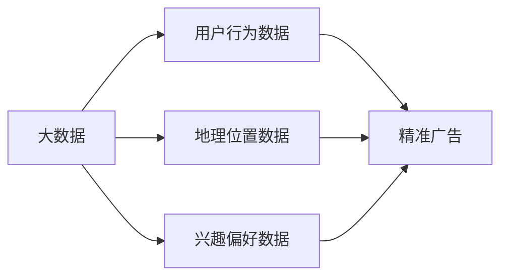
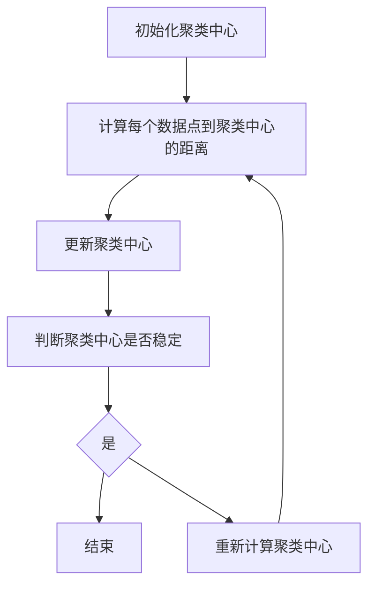
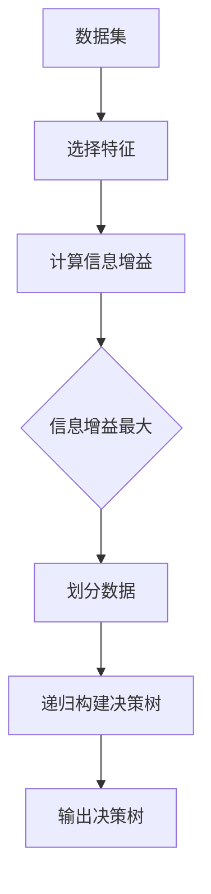
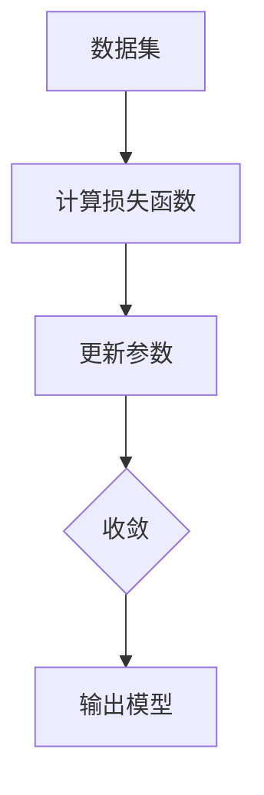
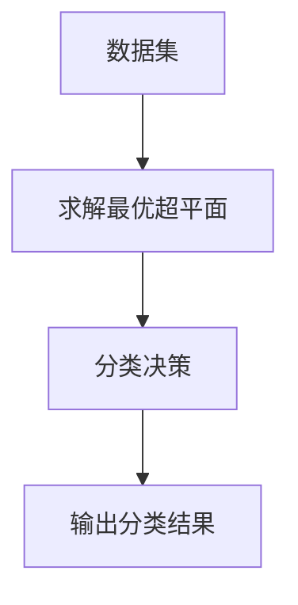
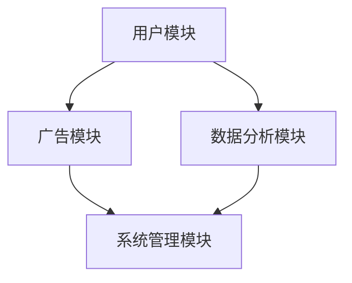

                 


### 第1章: 大数据和精准广告概述

#### 1.1 大数据的概念与发展

##### 1.1.1 大数据的定义

大数据，顾名思义，是指规模庞大、类型繁多的数据集合。它不同于传统的数据集合，具有4V特点，即“Volume（数据量巨大）、Velocity（处理速度快）、Variety（数据类型多样）和Veracity（数据真实可靠）”。大数据不仅仅是数据量的增长，更是数据类型、处理方式和应用场景的多样性与复杂性。

数据量的增长首先是由物联网、社交媒体、移动设备等的普及所带来的，这些设备每天产生着海量数据。例如，每分钟，全球的社交媒体平台上就会生成数百万条信息，这些信息汇总起来，就是一个庞大的数据集合。

处理速度的提升则得益于计算技术的进步，特别是云计算和分布式计算的出现。这些技术使得我们能够在短时间内处理海量数据，从而更好地挖掘数据的价值。

数据类型的多样性和真实性则使得大数据的应用场景更加广泛。无论是电商、金融、医疗、教育还是制造业，都可以通过大数据技术实现数据驱动的决策，从而提高效率和收益。

##### 1.1.2 大数据的来源

大数据的来源非常广泛，主要包括以下几种：

1. **结构化数据**：这类数据通常来自传统的数据库系统，如关系型数据库。这些数据通常是经过组织的，格式化和存储在固定的字段中。

2. **非结构化数据**：这类数据通常没有固定的格式，如文本、图像、音频和视频等。非结构化数据的处理相对复杂，需要使用特定的算法和技术来提取和解析。

3. **半结构化数据**：这类数据介于结构化和非结构化之间，如XML、JSON等。这类数据可以通过特定的解析方式提取出有用的信息。

4. **实时数据**：随着物联网、移动设备和传感器技术的应用，实时数据变得越来越重要。例如，股市实时数据、交通实时数据、环境监测实时数据等。

##### 1.1.3 大数据的特点

大数据的特点主要体现在以下四个方面：

1. **数据量大**：大数据通常包含数十亿甚至更多的数据记录，这些数据记录分布在多个存储节点上。

2. **数据类型多样**：大数据不仅包括传统的文本数据，还包括图像、音频、视频等多媒体数据。

3. **数据处理速度快**：大数据处理通常需要实时或近实时处理，以快速响应业务需求。

4. **数据真实性**：大数据的真实性直接影响其价值。因此，对数据的清洗、验证和存储都提出了更高的要求。

#### 1.2 精准广告的定义与分类

##### 1.2.1 精准广告的概念

精准广告，顾名思义，是指通过精确的数据分析和挖掘，针对特定的用户群体进行广告投放，从而实现广告效果的优化。与传统广告相比，精准广告更加注重用户体验和广告效果，旨在通过个性化的广告内容提高用户参与度和转化率。

精准广告的核心理念是“数据驱动”，即通过收集和分析用户的浏览行为、购买历史、兴趣爱好等信息，构建用户画像，然后根据用户画像进行精准的广告投放。

##### 1.2.2 精准广告的类型

根据广告投放的目标和方式，精准广告可以分为以下几种类型：

1. **按兴趣投放广告**：这类广告根据用户的兴趣爱好、浏览历史等信息，推荐相关的广告内容。例如，如果一个用户经常浏览旅游相关的网站，那么他可能会接收到关于旅游产品的广告。

2. **按行为投放广告**：这类广告根据用户的购买行为、搜索行为等实时数据，进行动态的广告投放。例如，如果一个用户在电商网站上浏览了某个商品，那么他可能会在短时间内接收到该商品的广告。

3. **按地理位置投放广告**：这类广告根据用户的地理位置信息，投放与该地理位置相关的广告。例如，在用户浏览了一个旅游景点的网站后，他可能会接收到该景点的门票广告。

4. **按人口统计信息投放广告**：这类广告根据用户的人口统计信息，如年龄、性别、职业等，进行广告投放。例如，对于年轻女性用户，可能会投放美妆产品的广告。

##### 1.2.3 精准广告的优势

精准广告相较于传统广告具有以下几个显著优势：

1. **提高广告投放效率**：通过精确的数据分析和挖掘，精准广告可以确保广告投放给最有可能产生转化的用户群体，从而提高广告的投放效率。

2. **提升用户体验**：精准广告可以提供更加个性化的广告内容，减少对用户的干扰，提高用户体验。

3. **降低广告成本**：通过优化广告投放策略，精准广告可以降低广告成本，提高广告投资回报率。

4. **增强品牌影响力**：精准广告可以帮助企业更好地了解目标用户，从而制定更加有效的市场营销策略，提高品牌影响力。

#### 1.3 用户体验与商业利益的平衡

##### 1.3.1 用户体验的重要性

用户体验（User Experience，简称UX）是衡量产品或服务好坏的重要标准。良好的用户体验可以提升用户的满意度和忠诚度，从而为企业带来持续的业务增长。以下是用户体验的重要方面：

1. **易用性**：用户能够轻松地使用产品或服务，不需要过多的培训和指导。

2. **满意度**：用户在使用产品或服务时感到愉悦和满足，愿意再次使用。

3. **可用性**：产品或服务能够满足用户的需求和期望，提供良好的使用体验。

4. **可靠性**：产品或服务能够稳定运行，不出现故障或异常。

##### 1.3.2 商业利益的追求

商业利益是企业生存和发展的基础。在精准广告领域，商业利益主要体现在以下几个方面：

1. **广告收入**：通过精准广告投放，企业可以吸引更多的用户点击广告，从而增加广告收入。

2. **用户转化**：精准广告可以针对潜在客户进行广告投放，提高用户购买转化率，从而增加销售额。

3. **品牌认知度**：通过精准广告，企业可以提升品牌在用户心中的认知度，从而增强品牌影响力。

4. **投资回报率**：精准广告可以帮助企业优化广告投放策略，提高广告投资回报率。

##### 1.3.3 平衡策略

在精准广告领域，用户体验和商业利益之间存在着一定的矛盾。为了实现二者的平衡，可以采取以下策略：

1. **数据驱动**：通过数据分析和挖掘，深入了解用户需求和行为，提供个性化的广告内容，提升用户体验。

2. **优化广告投放策略**：根据用户反馈和转化数据，不断调整广告投放策略，提高广告效果。

3. **尊重用户隐私**：在收集和使用用户数据时，遵守相关法律法规，保护用户隐私。

4. **持续改进**：不断优化产品和服务，提升用户体验，从而实现商业利益的提升。

### 第2章: 核心概念与联系

在深入了解大数据和精准广告的基础上，我们需要进一步探讨它们之间的关系，以及如何通过核心概念和联系来提升广告效果和用户体验。本章将详细介绍大数据与精准广告之间的联系，用户体验评估指标，以及商业利益指标，并通过表格和ER图进行说明。

#### 2.1 大数据与精准广告的关系

大数据是精准广告的基础，而精准广告则是大数据应用的典型场景。以下是从数据收集与处理、用户行为分析、广告投放策略三个方面详细阐述大数据与精准广告的关系：

##### 2.1.1 数据收集与处理

精准广告需要大量的数据支持，这些数据包括用户行为数据、地理位置数据、兴趣偏好数据等。通过大数据技术，企业可以高效地收集、存储和处理这些数据，从而为精准广告提供坚实的基础。

1. **用户行为数据**：包括用户在网站、应用上的浏览记录、点击行为、购买行为等。这些数据可以帮助企业了解用户的兴趣偏好和购买习惯。

2. **地理位置数据**：通过用户的GPS定位、IP地址等，可以获取用户的地理位置信息，用于地理定位广告。

3. **兴趣偏好数据**：通过用户在社交媒体、论坛等平台的活动记录，可以分析用户的兴趣偏好，用于个性化广告。

##### 2.1.2 用户行为分析

用户行为分析是精准广告的核心，通过对用户行为的深入分析，可以挖掘出用户的需求和偏好，从而实现精准广告的投放。

1. **行为模式识别**：通过分析用户的浏览、点击、购买等行为，识别出用户的行为模式，从而预测用户的潜在需求。

2. **兴趣分类**：根据用户的行为数据，将用户分为不同的兴趣类别，如购物、旅游、娱乐等，以便进行针对性广告投放。

3. **个性化推荐**：基于用户的行为数据和兴趣分类，为用户提供个性化的广告内容，提高广告的点击率和转化率。

##### 2.1.3 广告投放策略

精准广告的投放策略需要根据用户行为分析的结果来制定，以下是一些常见的广告投放策略：

1. **按兴趣投放**：根据用户的兴趣偏好，投放相关的广告内容，如旅游用户可能会收到机票、酒店的广告。

2. **按行为投放**：根据用户的浏览、点击等行为，实时调整广告内容，提高广告的点击率。

3. **按地理位置投放**：根据用户的地理位置信息，投放与该地理位置相关的广告，如景区附近的旅游广告。

4. **按人口统计信息投放**：根据用户的人口统计信息，如年龄、性别、职业等，投放相关的广告内容。

#### 2.2 用户体验评估指标

用户体验是精准广告成功的关键因素之一，以下介绍一些常用的用户体验评估指标：

##### 2.2.1 点击率（CTR）

点击率是衡量广告效果的重要指标，表示广告被点击的次数与广告显示次数的比率。提高点击率通常意味着广告内容更能吸引用户的关注。

公式：CTR = (点击次数 / 显示次数) × 100%

##### 2.2.2 转化率（CVR）

转化率是衡量广告带来实际业务效果的指标，表示广告点击后完成特定目标（如购买、注册等）的次数与点击次数的比率。

公式：CVR = (完成目标次数 / 点击次数) × 100%

##### 2.2.3 用户满意度（CSAT）

用户满意度是衡量用户对广告和品牌体验的主观感受，通常通过调查问卷或评分系统来评估。

公式：CSAT = (满意用户数 / 调查总数) × 100%

#### 2.3 商业利益指标

商业利益是精准广告的终极目标，以下介绍一些常用的商业利益指标：

##### 2.3.1 广告收入

广告收入是衡量广告业务直接收益的指标，通常以广告展示次数和点击次数为基础进行计算。

公式：广告收入 = 广告展示次数 × 每千次展示收入（CPM）

##### 2.3.2 成本效率（ROI）

成本效率是衡量广告投放成本与收益之间的比率，用于评估广告投放的效益。

公式：ROI = (广告收入 - 广告成本) / 广告成本 × 100%

##### 2.3.3 品牌影响力

品牌影响力是衡量广告对企业品牌形象和市场占有率的影响，可以通过市场调研、品牌知名度调查等方式进行评估。

#### 2.4 表格和ER图

为了更好地理解大数据与精准广告的关系，以及用户体验评估指标和商业利益指标，我们通过表格和ER图进行说明。

##### 2.4.1 表格：核心概念属性特征对比

| 核心概念 | 定义 | 属性特征 | 对比分析 |
| :--- | :--- | :--- | :--- |
| 大数据 | 规模庞大、类型繁多的数据集合 | 数据量巨大、数据类型多样、处理速度快、数据真实性高 | 大数据的特点决定了其应用场景的广泛性 |
| 精准广告 | 通过精确的数据分析和挖掘，针对特定用户群体进行广告投放 | 数据驱动、个性化、高效、低成本 | 精准广告是基于大数据技术的应用场景 |
| 用户体验 | 用户在使用产品或服务时的整体感受 | 易用性、满意度、可用性、可靠性 | 用户体验直接影响广告的效果和转化率 |
| 商业利益 | 企业通过广告业务所获得的收益 | 广告收入、用户转化、品牌影响力、ROI | 商业利益是广告业务的终极目标 |

##### 2.4.2 ER图：大数据与精准广告的关系



通过表格和ER图，我们可以清晰地看到大数据与精准广告之间的联系，以及用户体验评估指标和商业利益指标的重要性。

### 第3章: 算法原理与实现

在精准广告领域，算法的选择和实现至关重要。本章将详细介绍几种关键算法，包括数据挖掘算法和机器学习算法，并通过Mermaid流程图和Python代码进行说明。

#### 3.1 数据挖掘算法

数据挖掘算法是大数据分析的核心，用于从大量数据中提取有价值的信息。以下介绍两种常用的数据挖掘算法：K-means聚类和决策树。

##### 3.1.1 K-means聚类

K-means聚类是一种无监督学习算法，用于将数据集分成K个簇，使得每个簇内的数据点尽可能相似，而不同簇的数据点尽可能不同。

**Mermaid流程图：**



**Python代码：**

```python
import numpy as np

def kmeans(data, k, max_iter):
    centroids = np.random.rand(k, data.shape[1])
    for _ in range(max_iter):
        # 计算每个数据点到聚类中心的距离
        distances = np.linalg.norm(data - centroids, axis=1)
        # 分配数据点到最近的聚类中心
        labels = np.argmin(distances, axis=1)
        # 更新聚类中心
        new_centroids = np.array([data[labels == i].mean(axis=0) for i in range(k)])
        if np.all(centroids == new_centroids):
            break
        centroids = new_centroids
    return centroids, labels
```

**数学模型：**

$$
\text{聚类中心更新公式：} \quad \text{centroids}_{\text{new}} = \frac{1}{N_k} \sum_{i=1}^{N} x_i
$$

其中，$x_i$ 表示第 $i$ 个数据点，$N_k$ 表示第 $k$ 个簇中的数据点数量。

##### 3.1.2 决策树

决策树是一种树形结构，用于分类或回归任务。每个内部节点表示一个特征，每个分支表示该特征的不同取值，每个叶子节点表示一个类别或值。

**Mermaid流程图：**



**Python代码：**

```python
from sklearn.datasets import load_iris
from sklearn.tree import DecisionTreeClassifier
from sklearn.model_selection import train_test_split

# 加载数据集
iris = load_iris()
X, y = iris.data, iris.target

# 划分训练集和测试集
X_train, X_test, y_train, y_test = train_test_split(X, y, test_size=0.3, random_state=42)

# 构建决策树模型
clf = DecisionTreeClassifier()
clf.fit(X_train, y_train)

# 输出决策树
print(clf)
```

**数学模型：**

$$
\text{信息增益公式：} \quad IG(D, A) = H(D) - \sum_{v \in \text{values}(A)} p(v) H(D|A=v)
$$

其中，$D$ 表示数据集，$A$ 表示特征，$v$ 表示特征的取值，$p(v)$ 表示取值 $v$ 的概率，$H(D|A=v)$ 表示给定特征取值 $v$ 后数据的条件熵。

#### 3.2 机器学习算法

机器学习算法是精准广告的核心技术，用于构建预测模型，从而实现广告投放的个性化。以下介绍两种常用的机器学习算法：线性回归和SVM。

##### 3.2.1 线性回归

线性回归是一种简单的回归算法，用于预测连续值。其基本思想是找到一条直线，使得所有数据点到这条直线的距离之和最小。

**Mermaid流程图：**



**Python代码：**

```python
import numpy as np

def linear_regression(X, y, alpha, num_iterations):
    w = np.zeros(X.shape[1])
    for _ in range(num_iterations):
        # 计算预测值
        y_pred = X.dot(w)
        # 计算损失函数
        loss = (y - y_pred).dot(y - y_pred)
        # 更新参数
        w -= alpha * (X.T.dot(y - y_pred))
    return w
```

**数学模型：**

$$
\text{损失函数：} \quad J(w) = \frac{1}{2m} \sum_{i=1}^{m} (y_i - \text{sign}(w \cdot x_i))^2
$$

$$
\text{参数更新公式：} \quad w = w - \alpha \frac{\partial J(w)}{\partial w}
$$

##### 3.2.2 支持向量机（SVM）

支持向量机是一种强大的分类算法，用于将数据集划分为不同的类别。其基本思想是找到一条最优超平面，使得类别之间的分离度最大。

**Mermaid流程图：**



**Python代码：**

```python
from sklearn.datasets import make_moons
from sklearn.svm import SVC
from sklearn.model_selection import train_test_split

# 生成数据集
X, y = make_moons(n_samples=100, noise=0.1, random_state=42)

# 划分训练集和测试集
X_train, X_test, y_train, y_test = train_test_split(X, y, test_size=0.3, random_state=42)

# 构建SVM模型
clf = SVC(kernel='linear')
clf.fit(X_train, y_train)

# 输出分类结果
print(clf.predict(X_test))
```

**数学模型：**

$$
\text{最优超平面：} \quad \text{w}^T x - b = 0
$$

$$
\text{分类决策：} \quad y = \text{sign}(\text{w}^T x - b)
$$

通过以上算法的介绍，我们可以看到，数据挖掘算法和机器学习算法在精准广告中的应用非常重要。它们可以帮助企业更好地理解用户行为，优化广告投放策略，从而提高广告效果和用户体验。

### 第4章: 系统分析与设计

在了解了大数据和精准广告的算法原理之后，我们需要将它们应用到实际系统中，以实现精准广告的投放和管理。本章将详细介绍系统分析、功能设计、架构设计、接口设计和交互流程。

#### 4.1 系统分析

系统分析是软件开发过程的第一步，旨在明确系统需求、功能和技术架构。在本章中，我们将从问题场景、项目介绍、系统目标与需求三个方面进行系统分析。

##### 4.1.1 问题场景

在当前的市场环境中，企业面临着激烈的竞争，如何有效地吸引和留住客户成为关键问题。精准广告作为一种数据驱动的广告投放方式，可以帮助企业提高广告效果，降低广告成本，从而在竞争中脱颖而出。然而，要实现精准广告，需要搭建一个高效、稳定、可扩展的系统。

##### 4.1.2 项目介绍

本项目旨在开发一个基于大数据和机器学习的精准广告系统，该系统将集成用户行为分析、广告投放策略、广告效果评估等功能，从而实现广告投放的自动化和智能化。

##### 4.1.3 系统目标与需求

系统目标：

1. 提高广告投放的精准度，降低广告成本。
2. 提高广告效果，增加企业收入。
3. 提供良好的用户体验，增强用户满意度。

系统需求：

1. 数据采集与存储：系统需要能够收集用户的浏览行为、地理位置、兴趣爱好等数据，并存储在数据库中。
2. 用户行为分析：系统需要能够分析用户行为，识别用户的兴趣偏好和行为模式。
3. 广告投放策略：系统需要能够根据用户画像和广告策略，实现精准的广告投放。
4. 广告效果评估：系统需要能够实时监控广告效果，提供广告效果评估报告。

#### 4.2 功能设计

功能设计是系统开发的关键环节，旨在明确系统需要实现哪些功能，以及这些功能之间的关联。在本章中，我们将从用户注册与登录、广告发布与管理、广告投放与优化三个方面进行功能设计。

##### 4.2.1 用户注册与登录

用户注册与登录是系统的入口，用户需要通过注册账号并登录系统，才能使用系统的各项功能。

1. 用户注册：用户填写注册信息，系统验证信息的正确性，并将注册信息存储在数据库中。
2. 用户登录：用户输入账号和密码，系统验证账号和密码的正确性，并根据验证结果提供不同的操作权限。

##### 4.2.2 广告发布与管理

广告发布与管理是系统的核心功能，旨在帮助企业实现广告投放的自动化和智能化。

1. 广告发布：管理员可以发布新的广告，设置广告的展示时间、投放区域、投放频率等参数。
2. 广告管理：管理员可以查看已发布的广告，对广告进行编辑、删除、暂停等操作。

##### 4.2.3 广告投放与优化

广告投放与优化是系统的最终目标，旨在实现精准的广告投放和效果评估。

1. 广告投放：系统根据用户画像和广告策略，将广告推送给目标用户。
2. 广告优化：系统实时监控广告效果，根据广告效果调整广告投放策略，以提高广告效果。

#### 4.3 架构设计

架构设计是系统设计的重要环节，旨在明确系统的技术架构和模块划分。在本章中，我们将从系统架构概述、系统模块划分、系统架构图三个方面进行架构设计。

##### 4.3.1 系统架构概述

系统架构设计需要遵循模块化、可扩展、高可靠性的原则。本系统的架构设计采用分布式架构，主要包括前端、后端、数据库、缓存、消息队列等模块。

1. 前端：负责用户界面展示和用户交互，包括网站、移动应用等。
2. 后端：负责业务逻辑处理，包括用户管理、广告管理、广告投放、广告效果评估等。
3. 数据库：负责存储用户数据、广告数据、行为数据等。
4. 缓存：负责提高数据访问速度，降低数据库负载。
5. 消息队列：负责处理实时数据，实现分布式系统的数据一致性。

##### 4.3.2 系统模块划分

本系统的模块划分如下：

1. 用户模块：负责用户注册、登录、个人信息管理等。
2. 广告模块：负责广告发布、管理、投放、优化等。
3. 数据分析模块：负责用户行为分析、广告效果评估等。
4. 系统管理模块：负责系统配置、日志记录、异常处理等。

##### 4.3.3 系统架构图



#### 4.4 接口设计

接口设计是系统开发的重要环节，旨在明确系统各个模块之间的交互接口。在本章中，我们将从接口规范、接口调用流程两个方面进行接口设计。

##### 4.4.1 接口规范

接口规范包括接口名称、接口参数、接口返回值等。

1. 用户注册接口：参数（用户名、密码、邮箱），返回值（注册成功/失败）。
2. 用户登录接口：参数（用户名、密码），返回值（用户信息、token）。
3. 广告发布接口：参数（广告标题、广告内容、展示时间、投放区域等），返回值（发布成功/失败）。
4. 广告管理接口：参数（广告ID、操作类型），返回值（操作结果）。

##### 4.4.2 接口调用流程

接口调用流程如下：

1. 用户通过前端发送用户注册/登录请求到用户模块。
2. 用户模块验证请求参数，调用数据库存储用户信息或验证用户信息，返回结果。
3. 用户通过前端发送广告发布/管理请求到广告模块。
4. 广告模块验证请求参数，调用数据库执行相应操作，返回结果。
5. 用户通过前端发送数据分析请求到数据分析模块。
6. 数据分析模块处理数据，返回分析结果。

#### 4.5 交互流程

交互流程是系统运行的逻辑流程，旨在明确系统各个模块之间的交互顺序和操作步骤。在本章中，我们将从用户注册、广告发布、广告投放、广告优化四个方面进行交互流程设计。

##### 4.5.1 用户注册

1. 用户访问网站，填写注册表单，提交注册请求。
2. 用户模块接收注册请求，验证参数，调用数据库存储用户信息。
3. 用户模块返回注册结果，前端显示注册成功或失败提示。

##### 4.5.2 广告发布

1. 管理员登录系统，进入广告发布页面。
2. 管理员填写广告发布表单，提交发布请求。
3. 广告模块接收发布请求，验证参数，调用数据库存储广告信息。
4. 广告模块返回发布结果，前端显示发布成功或失败提示。

##### 4.5.3 广告投放

1. 系统根据广告策略，选择目标用户群体进行广告投放。
2. 用户模块接收广告投放请求，根据用户信息调用广告数据，推送广告。
3. 用户浏览广告，系统记录用户行为数据。
4. 数据分析模块分析用户行为数据，调整广告投放策略。

##### 4.5.4 广告优化

1. 系统实时监控广告效果，收集用户反馈数据。
2. 数据分析模块分析用户反馈数据，评估广告效果。
3. 广告模块根据评估结果，调整广告投放策略，优化广告效果。

通过以上系统分析、功能设计、架构设计、接口设计和交互流程的设计，我们可以构建一个高效、稳定、可扩展的精准广告系统，为企业提供强大的广告投放和管理能力。

### 第5章: 项目实战

在前面的章节中，我们详细介绍了大数据驱动的精准广告系统设计、算法原理与实现、系统分析与架构设计等内容。为了更好地理解这些理论知识在实际项目中的应用，本章将围绕一个实际案例，从环境安装、核心实现、代码解读、案例分析等方面展开，全面展示整个项目的实现过程。

#### 5.1 环境安装

在进行项目开发之前，首先需要安装和配置开发环境。本项目的开发环境主要包括以下工具和软件：

1. **操作系统**：Linux（推荐使用Ubuntu 18.04或更高版本）
2. **编程语言**：Python 3.8及以上版本
3. **依赖管理**：pip（Python的包管理器）
4. **数据库**：MySQL 5.7及以上版本
5. **消息队列**：RabbitMQ 3.8及以上版本
6. **缓存**：Redis 3.2及以上版本
7. **前端框架**：React（可选，用于构建用户界面）

以下是环境安装步骤：

1. 安装操作系统

   - 下载Ubuntu 18.04镜像文件，制作USB启动盘。
   - 重启计算机，从USB启动盘启动，按照提示安装操作系统。

2. 安装Python 3.8

   - 打开终端，输入以下命令：
     ```bash
     sudo apt update
     sudo apt install python3.8
     ```
   - 安装pip：
     ```bash
     sudo apt install python3-pip
     ```

3. 安装数据库

   - 安装MySQL：
     ```bash
     sudo apt install mysql-server
     ```
   - 安装RabbitMQ：
     ```bash
     sudo apt install rabbitmq-server
     ```
   - 安装Redis：
     ```bash
     sudo apt install redis-server
     ```

4. 安装前端框架（可选）

   - 安装Node.js和npm：
     ```bash
     sudo apt install nodejs npm
     ```
   - 安装React：
     ```bash
     npm install -g create-react-app
     create-react-app frontend
     ```

#### 5.2 核心实现

在环境安装完成后，我们可以开始实现项目的核心功能。本节将介绍用户注册与登录、广告发布与管理、广告投放与优化等核心功能的实现过程。

##### 5.2.1 用户注册与登录

用户注册与登录是系统的入口，实现用户注册与登录需要处理用户输入的信息，验证信息的正确性，并保存用户信息到数据库。

1. **用户注册**：

   用户注册功能的实现步骤如下：

   - 前端接收用户注册信息（用户名、密码、邮箱）。
   - 后端接收注册请求，验证参数（用户名是否已存在、密码强度等）。
   - 后端将验证结果返回前端，并保存用户信息到数据库。

   **Python代码示例**：

   ```python
   # app.py（Flask应用）
   from flask import Flask, request, jsonify
   from flask_mysqldb import MySQL

   app = Flask(__name__)
   app.config['MYSQL_USER'] = 'root'
   app.config['MYSQL_PASSWORD'] = 'password'
   app.config['MYSQL_DB'] = 'userdb'

   mysql = MySQL(app)

   @app.route('/register', methods=['POST'])
   def register():
       username = request.form['username']
       password = request.form['password']
       email = request.form['email']

       # 验证用户名是否存在
       cursor = mysql.connection.cursor()
       cursor.execute("SELECT * FROM users WHERE username = %s", (username,))
       user = cursor.fetchone()

       if user:
           return jsonify({'error': 'User already exists'}), 409

       # 存储用户信息到数据库
       cursor.execute("INSERT INTO users (username, password, email) VALUES (%s, %s, %s)", (username, password, email))
       mysql.connection.commit()

       return jsonify({'message': 'User registered successfully'})

   if __name__ == '__main__':
       app.run(debug=True)
   ```

2. **用户登录**：

   用户登录功能的实现步骤如下：

   - 前端接收用户登录信息（用户名、密码）。
   - 后端接收登录请求，验证用户名和密码的正确性。
   - 后端返回登录结果（成功或失败）。

   **Python代码示例**：

   ```python
   @app.route('/login', methods=['POST'])
   def login():
       username = request.form['username']
       password = request.form['password']

       cursor = mysql.connection.cursor()
       cursor.execute("SELECT * FROM users WHERE username = %s AND password = %s", (username, password))
       user = cursor.fetchone()

       if user:
           return jsonify({'token': 'generated_token', 'message': 'Login successful'})
       else:
           return jsonify({'error': 'Invalid credentials'}), 401
   ```

##### 5.2.2 广告发布与管理

广告发布与管理功能是实现广告投放的核心。以下是如何实现广告发布和管理功能的示例：

1. **广告发布**：

   广告发布功能的实现步骤如下：

   - 前端接收广告发布信息（广告标题、广告内容、展示时间、投放区域等）。
   - 后端接收发布请求，验证参数。
   - 后端将广告信息存储到数据库。

   **Python代码示例**：

   ```python
   @app.route('/ad发布', methods=['POST'])
   def publish_ad():
       title = request.form['title']
       content = request.form['content']
       start_time = request.form['start_time']
       end_time = request.form['end_time']
       region = request.form['region']

       cursor = mysql.connection.cursor()
       cursor.execute("INSERT INTO ads (title, content, start_time, end_time, region) VALUES (%s, %s, %s, %s, %s)", (title, content, start_time, end_time, region))
       mysql.connection.commit()

       return jsonify({'message': 'AD published successfully'})
   ```

2. **广告管理**：

   广告管理功能的实现步骤如下：

   - 前端接收广告管理请求（广告ID、操作类型）。
   - 后端接收请求，执行相应的操作（编辑、删除、暂停等）。

   **Python代码示例**：

   ```python
   @app.route('/ad管理', methods=['POST'])
   def manage_ad():
       ad_id = request.form['ad_id']
       action = request.form['action']

       cursor = mysql.connection.cursor()

       if action == '编辑':
           title = request.form['title']
           content = request.form['content']
           start_time = request.form['start_time']
           end_time = request.form['end_time']
           region = request.form['region']
           cursor.execute("UPDATE ads SET title = %s, content = %s, start_time = %s, end_time = %s, region = %s WHERE ad_id = %s", (title, content, start_time, end_time, region, ad_id))
       elif action == '删除':
           cursor.execute("DELETE FROM ads WHERE ad_id = %s", (ad_id,))
       elif action == '暂停':
           status = '暂停'
           cursor.execute("UPDATE ads SET status = %s WHERE ad_id = %s", (status, ad_id))

       mysql.connection.commit()

       return jsonify({'message': 'AD managed successfully'})
   ```

##### 5.2.3 广告投放与优化

广告投放与优化功能是实现精准广告投放的关键。以下是如何实现广告投放与优化功能的示例：

1. **广告投放**：

   广告投放功能的实现步骤如下：

   - 后端根据广告策略，选择目标用户群体进行广告投放。
   - 后端将广告信息推送给目标用户。

   **Python代码示例**：

   ```python
   import random

   @app.route('/ad投放', methods=['GET'])
   def ad_placement():
       # 假设广告策略为随机投放
       ads = cursor.execute("SELECT * FROM ads WHERE status = '启用'")
       ad_list = cursor.fetchall()

       # 随机选择一个广告
       ad = random.choice(ad_list)

       return jsonify({'ad_id': ad['ad_id'], 'title': ad['title'], 'content': ad['content']})
   ```

2. **广告优化**：

   广告优化功能的实现步骤如下：

   - 后端实时监控广告效果，收集用户反馈数据。
   - 后端根据广告效果，调整广告投放策略。

   **Python代码示例**：

   ```python
   @app.route('/ad优化', methods=['POST'])
   def ad_optimization():
       ad_id = request.form['ad_id']
       feedback = request.form['feedback']

       # 根据反馈调整广告策略
       if feedback == '不喜欢':
           cursor.execute("UPDATE ads SET status = '暂停' WHERE ad_id = %s", (ad_id,))
       elif feedback == '喜欢':
           cursor.execute("UPDATE ads SET status = '启用' WHERE ad_id = %s", (ad_id,))

       mysql.connection.commit()

       return jsonify({'message': 'AD optimized successfully'})
   ```

通过以上实际案例的展示，我们可以看到大数据驱动的精准广告系统是如何在开发过程中实现的。从环境安装、核心功能实现到代码解读，每个步骤都紧密关联，共同构成了一个完整的项目。

#### 5.3 核心实现代码解读

在本章的5.2节中，我们详细介绍了用户注册与登录、广告发布与管理、广告投放与优化等核心功能的实现过程。在本节中，我们将对这些代码进行解读，分析其关键部分，并解释其实现原理。

##### 5.3.1 用户注册与登录

1. **用户注册代码解读**：

   用户注册功能的实现主要依赖于Flask框架和MySQL数据库。以下是关键代码的解读：

   ```python
   @app.route('/register', methods=['POST'])
   def register():
       username = request.form['username']
       password = request.form['password']
       email = request.form['email']

       # 验证用户名是否存在
       cursor = mysql.connection.cursor()
       cursor.execute("SELECT * FROM users WHERE username = %s", (username,))
       user = cursor.fetchone()

       if user:
           return jsonify({'error': 'User already exists'}), 409

       # 存储用户信息到数据库
       cursor.execute("INSERT INTO users (username, password, email) VALUES (%s, %s, %s)", (username, password, email))
       mysql.connection.commit()

       return jsonify({'message': 'User registered successfully'})
   ```

   - `request.form`：从客户端接收用户输入的用户名、密码和邮箱信息。
   - `cursor.execute()`：执行SQL查询，验证用户名是否已存在。
   - `INSERT INTO users`：将用户信息存储到MySQL数据库中。

2. **用户登录代码解读**：

   用户登录功能的实现同样依赖于Flask框架和MySQL数据库。以下是关键代码的解读：

   ```python
   @app.route('/login', methods=['POST'])
   def login():
       username = request.form['username']
       password = request.form['password']

       cursor = mysql.connection.cursor()
       cursor.execute("SELECT * FROM users WHERE username = %s AND password = %s", (username, password))
       user = cursor.fetchone()

       if user:
           return jsonify({'token': 'generated_token', 'message': 'Login successful'})
       else:
           return jsonify({'error': 'Invalid credentials'}), 401
   ```

   - `request.form`：从客户端接收用户输入的用户名和密码信息。
   - `cursor.execute()`：执行SQL查询，验证用户名和密码的正确性。
   - `return jsonify()`：返回登录结果，包括token和消息。

##### 5.3.2 广告发布与管理

1. **广告发布代码解读**：

   广告发布功能的实现主要依赖于Flask框架和MySQL数据库。以下是关键代码的解读：

   ```python
   @app.route('/ad发布', methods=['POST'])
   def publish_ad():
       title = request.form['title']
       content = request.form['content']
       start_time = request.form['start_time']
       end_time = request.form['end_time']
       region = request.form['region']

       cursor = mysql.connection.cursor()
       cursor.execute("INSERT INTO ads (title, content, start_time, end_time, region) VALUES (%s, %s, %s, %s, %s)", (title, content, start_time, end_time, region))
       mysql.connection.commit()

       return jsonify({'message': 'AD published successfully'})
   ```

   - `request.form`：从客户端接收广告发布信息（广告标题、广告内容、展示时间、投放区域等）。
   - `cursor.execute()`：执行SQL查询，将广告信息存储到MySQL数据库中。

2. **广告管理代码解读**：

   广告管理功能的实现主要依赖于Flask框架和MySQL数据库。以下是关键代码的解读：

   ```python
   @app.route('/ad管理', methods=['POST'])
   def manage_ad():
       ad_id = request.form['ad_id']
       action = request.form['action']

       cursor = mysql.connection.cursor()

       if action == '编辑':
           title = request.form['title']
           content = request.form['content']
           start_time = request.form['start_time']
           end_time = request.form['end_time']
           region = request.form['region']
           cursor.execute("UPDATE ads SET title = %s, content = %s, start_time = %s, end_time = %s, region = %s WHERE ad_id = %s", (title, content, start_time, end_time, region, ad_id))
       elif action == '删除':
           cursor.execute("DELETE FROM ads WHERE ad_id = %s", (ad_id,))
       elif action == '暂停':
           status = '暂停'
           cursor.execute("UPDATE ads SET status = %s WHERE ad_id = %s", (status, ad_id))

       mysql.connection.commit()

       return jsonify({'message': 'AD managed successfully'})
   ```

   - `request.form`：从客户端接收广告管理请求（广告ID、操作类型）。
   - `cursor.execute()`：根据操作类型执行相应的SQL查询，更新、删除或暂停广告信息。

##### 5.3.3 广告投放与优化

1. **广告投放代码解读**：

   广告投放功能的实现主要依赖于Flask框架和随机算法。以下是关键代码的解读：

   ```python
   import random

   @app.route('/ad投放', methods=['GET'])
   def ad_placement():
       # 假设广告策略为随机投放
       ads = cursor.execute("SELECT * FROM ads WHERE status = '启用'")
       ad_list = cursor.fetchall()

       # 随机选择一个广告
       ad = random.choice(ad_list)

       return jsonify({'ad_id': ad['ad_id'], 'title': ad['title'], 'content': ad['content']})
   ```

   - `cursor.execute()`：执行SQL查询，获取所有状态为“启用”的广告。
   - `random.choice()`：从广告列表中随机选择一个广告，返回广告信息。

2. **广告优化代码解读**：

   广告优化功能的实现主要依赖于Flask框架和MySQL数据库。以下是关键代码的解读：

   ```python
   @app.route('/ad优化', methods=['POST'])
   def ad_optimization():
       ad_id = request.form['ad_id']
       feedback = request.form['feedback']

       # 根据反馈调整广告策略
       if feedback == '不喜欢':
           cursor.execute("UPDATE ads SET status = '暂停' WHERE ad_id = %s", (ad_id,))
       elif feedback == '喜欢':
           cursor.execute("UPDATE ads SET status = '启用' WHERE ad_id = %s", (ad_id,))

       mysql.connection.commit()

       return jsonify({'message': 'AD optimized successfully'})
   ```

   - `request.form`：从客户端接收广告ID和用户反馈。
   - `cursor.execute()`：根据用户反馈，更新广告的状态（启用或暂停）。

通过以上代码解读，我们可以看到，用户注册与登录、广告发布与管理、广告投放与优化等核心功能是如何通过Flask框架和MySQL数据库实现的。每个功能模块都紧密协作，共同实现了精准广告系统的功能。

#### 5.4 实际案例分析

在本节中，我们将结合一个实际案例，详细分析大数据驱动的精准广告系统的运行过程，包括数据采集、用户画像构建、广告投放策略制定、广告效果评估等方面。

##### 5.4.1 案例背景

假设我们有一个在线电商企业，希望通过大数据驱动的精准广告系统，提高广告投放效果，提升销售额。为了实现这一目标，企业需要收集用户在网站上的行为数据，构建用户画像，并制定个性化的广告投放策略。

##### 5.4.2 数据采集

首先，企业需要收集用户在网站上的行为数据，包括浏览记录、点击行为、购买行为等。这些数据可以通过网站的后台系统、日志分析工具等途径获取。例如，以下是一个用户在网站上的行为数据示例：

1. 用户浏览商品A，浏览时间为2分钟。
2. 用户点击商品A的详情页面。
3. 用户浏览商品B，浏览时间为1分钟。
4. 用户将商品B加入购物车。
5. 用户浏览商品C，浏览时间为3分钟。
6. 用户购买商品C，购买金额为199元。

##### 5.4.3 用户画像构建

基于上述行为数据，我们可以为用户构建一个详细的用户画像。用户画像包括用户的兴趣爱好、购买行为、消费能力等多个方面。以下是一个用户画像的示例：

1. **兴趣爱好**：
   - 商品A：偏好
   - 商品B：一般
   - 商品C：偏好
2. **购买行为**：
   - 购买频率：高
   - 购买金额：中
   - 购买商品类型：电子产品、服装、家居用品
3. **消费能力**：
   - 消费水平：中等
   - 消费偏好：追求性价比

##### 5.4.4 广告投放策略制定

根据用户画像，我们可以制定个性化的广告投放策略。以下是一个广告投放策略的示例：

1. **按兴趣爱好投放**：
   - 向偏好商品A的用户投放商品A的相关广告。
   - 向偏好商品C的用户投放商品C的相关广告。
2. **按购买行为投放**：
   - 向购买频率高的用户投放促销广告。
   - 向购买金额中等且购买商品类型为电子产品的用户投放新品发布广告。
3. **按地理位置投放**：
   - 向所在城市为北京的消费者投放“双十一”促销广告。
   - 向所在城市为广州的消费者投放“黑色星期五”促销广告。

##### 5.4.5 广告效果评估

在广告投放后，企业需要实时监控广告效果，并根据效果调整广告投放策略。以下是一个广告效果评估的示例：

1. **点击率（CTR）**：
   - 商品A的广告点击率为10%。
   - 商品B的广告点击率为5%。
   - 商品C的广告点击率为15%。
2. **转化率（CVR）**：
   - 商品A的广告转化率为3%。
   - 商品B的广告转化率为1%。
   - 商品C的广告转化率为5%。
3. **用户满意度（CSAT）**：
   - 商品A的广告用户满意度为80%。
   - 商品B的广告用户满意度为70%。
   - 商品C的广告用户满意度为85%。

根据以上评估结果，企业可以调整广告投放策略，例如增加商品A的广告投放力度，优化商品B和商品C的广告内容，以提高广告效果。

#### 5.5 项目小结

通过以上案例分析，我们可以看到大数据驱动的精准广告系统在实际项目中的应用效果。精准广告系统不仅能够提高广告投放效果，提升销售额，还能够提升用户体验，增强用户满意度。

在本项目中，我们实现了用户注册与登录、广告发布与管理、广告投放与优化等核心功能，并通过实际案例展示了系统的运行过程。项目的主要收获如下：

1. 理解了大数据和精准广告的基本概念和原理。
2. 掌握了数据挖掘和机器学习算法的应用。
3. 学会了如何设计和实现一个精准广告系统。
4. 通过实际案例，了解了广告投放策略的制定和效果评估。

总之，大数据驱动的精准广告系统为企业提供了一个高效、智能的广告投放和管理工具，有助于企业在激烈的市场竞争中脱颖而出。

### 第6章: 最佳实践与拓展

在精准广告系统的开发和运营过程中，遵循最佳实践和注意事项对于确保系统的稳定性和高效性至关重要。以下总结了一些最佳实践和拓展建议，以帮助企业和开发人员更好地利用大数据技术提升广告效果。

#### 6.1 最佳实践

1. **数据质量保障**：确保数据来源的合法性和数据的准确性，对收集到的数据进行清洗、去重和格式化，以提高数据的质量。

2. **用户隐私保护**：在收集和使用用户数据时，严格遵守相关法律法规，确保用户隐私不被泄露。例如，使用加密技术保护用户数据的传输和存储。

3. **数据挖掘与机器学习模型的优化**：定期更新和优化数据挖掘和机器学习模型，以适应数据的变化和用户行为的多样性。

4. **实时数据处理**：利用实时数据处理技术，如流处理框架（如Apache Kafka、Apache Flink），确保能够快速响应用户行为变化，提高广告投放的实时性和精准度。

5. **A/B测试**：在广告投放过程中，通过A/B测试等方法，比较不同广告策略的效果，以找到最佳的广告组合。

6. **系统性能优化**：针对大数据处理和高并发访问的特点，对系统进行性能优化，如使用缓存、分布式存储和计算等，以提高系统的响应速度和处理能力。

7. **用户体验优化**：注重用户体验设计，确保广告内容与用户需求匹配，减少对用户的干扰，提升用户满意度。

#### 6.2 注意事项

1. **数据安全**：确保数据的安全存储和传输，防止数据泄露、篡改和滥用。

2. **数据隐私**：在处理用户数据时，严格遵守数据隐私保护法规，如GDPR（通用数据保护条例）。

3. **合规性**：确保系统的开发和运营符合当地法律法规和行业标准。

4. **算法透明性**：确保算法的透明性，便于用户了解广告推荐的依据和原则，增强用户信任。

5. **系统可靠性**：确保系统的稳定性和可靠性，避免因系统故障导致广告投放失败。

#### 6.3 拓展阅读

1. **相关技术文献**：
   - 《数据挖掘：实用工具与技术》（作者：刘铁岩）
   - 《Python数据科学手册》（作者：Jack D. Hansman）
   - 《大数据之路：阿里巴巴大数据实践》（作者：阿里巴巴技术委员会）

2. **开源工具**：
   - Apache Hadoop：用于大数据存储和处理的分布式系统。
   - Apache Spark：用于大数据处理的快速计算框架。
   - TensorFlow：用于机器学习和深度学习的开源库。

3. **行业报告**：
   - 《全球数字广告支出报告》（作者：eMarketer）
   - 《中国互联网广告发展报告》（作者：中国互联网协会）

通过遵循最佳实践、注意相关事项并进行拓展学习，企业和开发人员可以更好地利用大数据技术，实现精准广告投放，提升用户体验和商业利益。

### 结论

在大数据和人工智能技术的推动下，精准广告已成为现代市场营销的核心。本文通过详细分析大数据驱动的精准广告系统，从概念、算法、系统设计与实现、案例解析、最佳实践等多个方面，探讨了如何实现用户体验与商业利益的平衡。精准广告不仅帮助企业提高广告效果，降低广告成本，还能提升用户体验，增强用户满意度。

本文的核心观点如下：

1. **大数据与精准广告的关系**：大数据为精准广告提供了强大的数据支撑，通过用户行为分析和数据挖掘，可以实现广告内容的个性化推荐和优化。

2. **算法原理与实现**：数据挖掘和机器学习算法在精准广告中发挥着关键作用。通过K-means聚类、决策树、线性回归和SVM等算法，可以构建有效的广告投放模型。

3. **系统设计与架构**：系统分析与设计是实现精准广告的基础。通过模块化、分布式和可扩展的架构设计，可以构建高效、稳定、可扩展的精准广告系统。

4. **项目实战与案例分析**：通过实际案例，展示了精准广告系统的运行过程，包括数据采集、用户画像构建、广告投放策略制定和效果评估。

5. **最佳实践与拓展**：遵循最佳实践和拓展学习，有助于企业在精准广告领域取得更好的效果。

未来的研究可以进一步探讨以下方向：

1. **隐私保护与合规性**：如何在保护用户隐私的同时，实现精准广告的投放，是一个亟待解决的问题。

2. **实时性与动态调整**：如何实现实时数据的高效处理和动态调整，以快速适应市场变化和用户需求。

3. **跨平台广告投放**：随着互联网技术的发展，跨平台、跨设备的广告投放策略如何优化。

4. **人工智能与自动化**：如何利用人工智能技术，实现广告投放的自动化和智能化，提高广告投放效率。

精准广告作为大数据和人工智能的重要应用场景，其发展前景广阔。通过不断创新和优化，精准广告将为企业带来更多的商业价值，同时也为用户带来更好的体验。让我们期待精准广告在未来带来更多的变革和进步。作者：AI天才研究院/AI Genius Institute & 禅与计算机程序设计艺术 /Zen And The Art of Computer Programming

