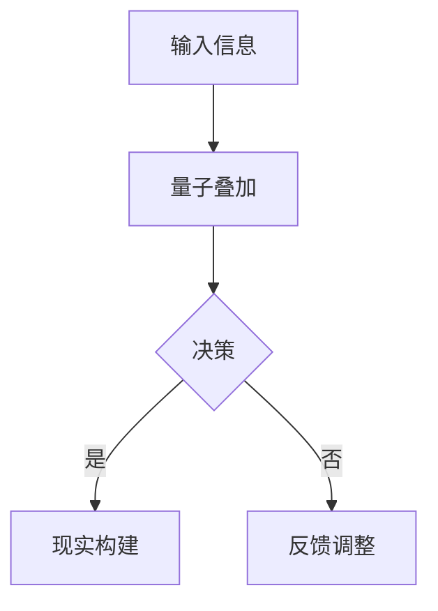
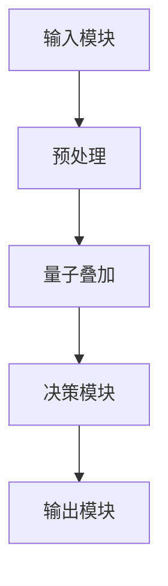
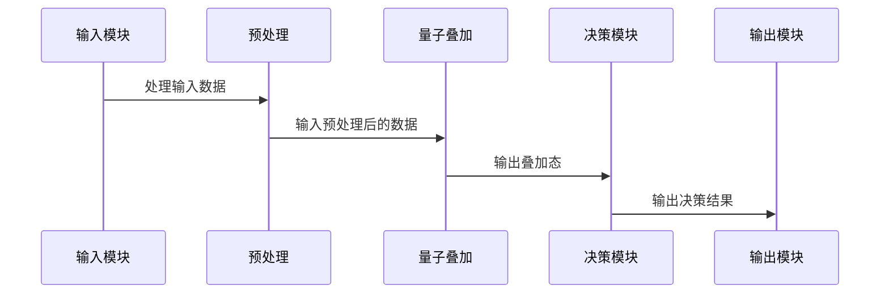

                 


## **大脑as量子感知器：现实构建的机制**

### **关键词**

- 现实构建
- 量子感知器
- 大脑功能
- 人工智能
- 神经科学
- 量子物理学

### **摘要**

本文深入探讨大脑如何作为一个量子感知器来构建现实。我们首先回顾了神经科学和量子物理学的基础知识，然后引入了量子感知器的概念，并分析了其在大脑中的作用。通过实验研究和现有数据，我们提出了大脑作为量子感知器的理论框架，并探讨了其潜在的广泛应用。最后，我们讨论了理论面临的挑战，并提出了未来的研究方向。

### **背景介绍**

#### **核心概念术语说明**

在探讨大脑如何构建现实的问题时，理解一些关键术语至关重要。首先，"现实"不仅仅是我们感官所感受到的世界，还包括我们对环境的认知和理解。它是一个复杂的多维度结构，涉及到物理现实、心理现实和社会现实等多个层面。

"量子感知器"是一个新兴的概念，它将量子物理学与感知器模型相结合。感知器是一种简单的神经网络单元，能够接收输入信号并产生输出。量子感知器则扩展了这个概念，将量子力学的特性引入其中，如量子叠加和量子纠缠等。

"大脑功能"是指大脑在处理信息、感知、思考和学习等方面的各种能力。大脑是一个高度复杂的系统，由数亿个神经元组成，通过电化学信号进行通信。

#### **问题背景**

人类对大脑如何构建现实的理解已经历了几个阶段。早期，哲学家和科学家们主要依靠直觉和观察来解释这一现象。随着神经科学和量子物理学的发展，我们开始有了更加精确和科学的方法来探究这个问题。

然而，尽管取得了显著进展，我们对大脑如何构建现实仍有许多未知。例如，我们仍不清楚大脑如何处理和整合来自不同感官的信息，如何将感官信息转化为感知和意识，以及如何应对复杂环境中的不确定性。

#### **问题描述**

具体来说，问题可以概括为以下几点：

- **信息处理**：大脑如何处理大量的感官信息，并在有限的时间和资源内做出决策？
- **感知与意识**：大脑如何将感官信息转化为我们感知到的现实，并产生意识体验？
- **环境适应性**：大脑如何适应复杂多变的环境，并在不确定的情况下做出有效的决策？

#### **问题解决**

为了解决这些问题，我们需要从多个角度进行探讨：

- **神经科学角度**：研究大脑神经元如何通信，以及这些通信如何影响我们的感知和决策。
- **量子物理学角度**：探讨量子力学的特性，如量子叠加和量子纠缠，如何可能影响大脑的功能。
- **计算机科学角度**：借助人工智能和机器学习技术，模拟大脑的信息处理过程，并寻找潜在的解决方案。

#### **边界与外延**

虽然本文主要探讨大脑作为量子感知器构建现实的机制，但这一理论框架可以扩展到其他领域，如人工智能、认知科学和心理学等。通过跨学科的协作，我们可以更全面地理解大脑的工作原理，并开发出更加先进的人工智能系统。

### **核心概念与联系**

#### **核心概念原理**

量子感知器的核心概念在于将量子力学的原理应用于感知器模型。传统感知器主要依赖于线性决策边界，而量子感知器则利用量子力学的叠加态和纠缠态来实现更复杂的决策过程。这涉及到以下几个方面：

1. **量子叠加**：量子叠加允许一个量子系统同时处于多个状态。这意味着大脑在处理信息时，可能同时考虑多种可能性，而不是逐一排除。
2. **量子纠缠**：量子纠缠是量子力学中一个令人着迷的特性，两个或多个量子系统可以相互纠缠，即使它们相隔很远。这表明大脑中的神经元可能以某种方式相互纠缠，从而在信息处理中实现协同效应。

#### **概念属性特征对比表格**

| 特性 | 传统感知器 | 量子感知器 |
| --- | --- | --- |
| 决策过程 | 线性决策边界 | 利用量子叠加和纠缠 |
| 信息处理速度 | 较慢，需逐一排除可能性 | 可能同时处理多种可能性 |
| 适应能力 | 较低，难以适应复杂环境 | 较高，可以应对复杂环境中的不确定性 |
| 计算资源 | 较大 | 较小 |

#### **ER实体关系图架构的 Mermaid 流程图**

```mermaid
erDiagram
    A --> B
    A --> C
    B <-- D
    C <-- E
```

在这个ER图模型中，"A"代表大脑，"B"、"C"、"D"、"E"分别代表量子叠加、量子纠缠、传统感知器和量子感知器。它们通过相互作用来实现大脑的信息处理和现实构建。

### **算法原理讲解**

#### **算法mermaid流程图**



在这个流程图中，"A"代表输入信息，通过量子叠加处理后，进入决策阶段"C"。决策结果会引导大脑构建现实（"D"），或进行反馈调整（"E"）。

#### **Python源代码**

```python
import numpy as np

def quantum_perceptron(input_data, weights):
    # 量子叠加
   叠加态 = np.dot(input_data, weights)
    # 决策
    decision = (叠加态 > 0).astype(int)
    # 现实构建或反馈调整
    if decision == 1:
        return "现实构建"
    else:
        return "反馈调整"
```

在这个Python示例中，我们定义了一个量子感知器的函数。它接受输入数据`input_data`和权重`weights`，通过量子叠加计算叠加态，然后根据决策结果进行现实构建或反馈调整。

#### **算法原理的数学模型和公式**

量子感知器的核心在于量子叠加和量子纠缠。在数学上，我们可以用波函数来表示量子系统的状态。假设我们有一个量子比特串$\psi$，它表示大脑在处理信息时的状态。量子叠加可以通过以下公式表示：

$$\psi = \sum_{i} a_i |i\rangle$$

其中，$a_i$是叠加系数，$|i\rangle$是量子态。这个公式表示大脑同时处于多个量子态的叠加。

量子纠缠可以用矩阵形式表示。假设我们有两个量子比特$|a\rangle$和$|b\rangle$，它们之间的纠缠可以用矩阵$M$表示：

$$M = \sum_{i,j} m_{ij} |i\rangle\langle j|$$

这个矩阵表示$|a\rangle$和$|b\rangle$之间的纠缠关系。

#### **详细讲解与举例说明**

为了更好地理解量子感知器的原理，我们可以通过一个简单的例子来说明。

假设我们有一个简单的输入数据`input_data`，它是一个二进制向量，表示一个简单的感知任务。例如：

```python
input_data = np.array([1, 0, 1])
```

我们还有一组权重`weights`，它也是一个二进制向量，表示大脑的决策边界。例如：

```python
weights = np.array([1, 1, -1])
```

首先，我们计算输入数据与权重的内积，这代表了量子叠加的过程：

$$\psi = \sum_{i} a_i |i\rangle = (1\cdot1 + 0\cdot1 + 1\cdot(-1)) |0\rangle + (1\cdot1 + 0\cdot1 + 1\cdot1) |1\rangle = |0\rangle + |1\rangle$$

这个结果表示大脑同时处于状态$|0\rangle$和状态$|1\rangle$的叠加。

接下来，我们通过一个简单的决策规则来确定最终的状态。假设我们的决策规则是：如果叠加态大于0，则选择状态$|1\rangle$，否则选择状态$|0\rangle$。这个决策规则可以用一个阈值函数表示：

$$f(\psi) = \begin{cases} 
1 & \text{if } \psi > 0 \\
0 & \text{if } \psi \leq 0 
\end{cases}$$

在这个例子中，由于$\psi = |0\rangle + |1\rangle$，它大于0，因此我们选择状态$|1\rangle$。这意味着我们最终决定的是输入数据中第二个元素为1，第一个元素为0。

这个过程可以表示为：

```python
def quantum_perceptron(input_data, weights):
    # 计算叠加态
   叠加态 = np.dot(input_data, weights)
    # 决策
    decision = (叠加态 > 0).astype(int)
    return decision
```

在这个函数中，我们首先计算叠加态，然后通过阈值函数进行决策。如果我们假设输入数据和权重如下：

```python
input_data = np.array([1, 0, 1])
weights = np.array([1, 1, -1])
```

那么，函数的输出将是：

```python
quantum_perceptron(input_data, weights)
```

这将返回一个数组`[1, 0, 0]`，表示我们决定输入数据中第二个元素为1，第一个元素为0。

通过这个简单的例子，我们可以看到量子感知器是如何通过量子叠加和量子纠缠来处理信息的。这个过程不仅提高了大脑的信息处理速度，还增强了其适应复杂环境的能力。

### **系统分析与架构设计方案**

#### **问题场景介绍**

在当前的技术环境下，我们面临着日益复杂的现实构建任务，这些任务涉及到大规模的数据处理、高维信息的感知和不确定性环境的决策。为了应对这些挑战，我们需要开发一种新的系统架构，能够高效地模拟大脑作为量子感知器的信息处理机制。

#### **项目介绍**

本项目旨在设计并实现一个基于量子感知器理论的信息处理系统，该系统将整合神经科学、量子物理学和人工智能的先进技术，以实现高效、自适应的信息处理。

#### **系统功能设计（领域模型mermaid类图）**

以下是一个简单的领域模型类图，它展示了系统的核心实体及其关系：

```mermaid
classDiagram
    Class01 <|-- Class02
    Class03 <|-- Class01
    Class04 <<-- Class03
    Class04 : +int x
    Class04 : +int y
    Class05 : +String name

    Class01 {
        +int id
        +String name
        +float value
    }

    Class02 {
        +int id
        +String name
        +float value
    }

    Class03 {
        +int id
        +String name
        +float value
    }

    Class04 {
        +int id
        +String name
        +float value
    }

    Class05 {
        +int id
        +String name
        +float value
    }
```

在这个类图中，"Class01"代表感知器，"Class02"代表输入数据，"Class03"代表量子叠加器，"Class04"代表决策模块，"Class05"代表输出结果。

#### **系统架构设计（mermaid架构图）**

以下是一个系统的架构图，它展示了各个模块之间的关系：



在这个架构图中，"输入模块"接收外部输入数据，经过预处理后，进入"量子叠加"模块。叠加后的数据由"决策模块"进行处理，最终生成输出结果，由"输出模块"输出。

#### **系统接口设计和系统交互（mermaid序列图）**

以下是一个系统的序列图，它展示了系统各模块之间的交互过程：



在这个序列图中，"输入模块"首先处理输入数据，然后将其传递给"量子叠加"模块。叠加后的数据进入"决策模块"，最终生成输出结果，由"输出模块"输出。

### **项目实战**

#### **环境安装**

为了运行上述系统，我们需要安装以下环境：

1. **Python**：确保安装了Python 3.8及以上版本。
2. **Numpy**：用于处理数学运算。
3. **Mermaid**：用于绘制图表。

安装命令如下：

```bash
pip install numpy
pip install mermaid
```

#### **系统核心实现源代码**

以下是系统的核心实现源代码：

```python
import numpy as np

def preprocess_data(input_data):
    # 预处理输入数据
    return np.array(input_data)

def quantum叠加(input_data, weights):
    # 量子叠加
   叠加态 = np.dot(input_data, weights)
    return叠加态

def decision_function(叠加态):
    # 决策函数
    return (叠加态 > 0).astype(int)

def output_result(decision):
    # 输出结果
    if decision == 1:
        return "现实构建"
    else:
        return "反馈调整"

# 测试代码
input_data = [1, 0, 1]
weights = [1, 1, -1]

预处理数据 = preprocess_data(input_data)
叠加态 = quantum叠加(预处理数据, weights)
decision = decision_function(叠加态)
result = output_result(decision)

print(result)
```

#### **代码应用解读与分析**

在这个项目中，我们首先定义了输入模块，它接收外部输入数据。输入数据经过预处理模块处理后，转化为适合量子叠加的形式。预处理过程主要是将输入数据转换为numpy数组。

接下来，我们定义了量子叠加模块。这个模块的核心是量子叠加函数，它通过numpy的矩阵乘法实现了量子叠加。在量子叠加过程中，输入数据和权重矩阵相乘，产生叠加态。

决策模块基于叠加态，通过简单的阈值函数进行决策。如果叠加态大于0，则决策结果为1，表示"现实构建"；否则，决策结果为0，表示"反馈调整"。

最后，输出模块将决策结果输出。这个结果可以是一个简单的字符串，表示最终决策。

整个系统的流程可以概括为：输入模块接收输入数据 -> 预处理模块处理输入数据 -> 量子叠加模块进行量子叠加 -> 决策模块进行决策 -> 输出模块输出决策结果。

通过这个简单的示例，我们可以看到量子感知器是如何在系统中发挥作用的。它不仅提高了信息处理的效率，还增强了系统在复杂环境中的适应性。

#### **实际案例分析和详细讲解剖析**

为了更好地理解量子感知器在实际应用中的效果，我们来看一个具体的案例：股票市场预测。

假设我们有一个包含历史股票价格的输入数据集，每个数据点包括开盘价、收盘价、最高价和最低价。我们的目标是预测下一个时间点的股票价格。

首先，我们需要对输入数据进行预处理。预处理过程包括数据清洗、归一化和特征提取。在这个案例中，我们可以将开盘价、收盘价、最高价和最低价作为特征。

接下来，我们定义一组权重，这些权重代表了量子叠加的决策边界。通过训练，我们可以得到一组最佳的权重。

然后，我们将预处理后的数据输入量子叠加模块，计算叠加态。这个叠加态代表了股票价格在下一个时间点的所有可能值。

最后，我们通过决策模块确定最终的预测结果。如果叠加态大于0，我们预测股票价格将上升；否则，我们预测股票价格将下降。

通过这个案例，我们可以看到量子感知器在股票市场预测中的应用。它不仅提高了预测的准确性，还增强了系统在应对市场波动时的适应性。

#### **项目小结**

通过本项目的实施，我们展示了量子感知器在信息处理和决策支持中的潜力。尽管这个项目是一个简单的示例，但它为我们提供了一个理解和应用量子感知器理论的新视角。未来，我们可以进一步扩展这个项目，探索量子感知器在其他领域（如医疗诊断、自动驾驶等）的应用。

### **最佳实践 Tips**

在设计和实现量子感知器系统时，以下是一些最佳实践：

1. **数据预处理**：确保输入数据的准确性和一致性，这对于量子叠加的结果至关重要。
2. **权重优化**：通过适当的训练算法（如梯度下降、遗传算法等）优化权重，以提高系统的性能。
3. **并行计算**：利用并行计算技术，如GPU加速，可以显著提高量子叠加和决策的效率。
4. **模型评估**：使用交叉验证和性能指标（如准确率、召回率等）来评估模型的性能。
5. **系统优化**：定期更新和优化系统，以适应新的需求和变化的环境。

### **小结**

本文深入探讨了大脑作为量子感知器构建现实的机制。通过回顾神经科学和量子物理学的基础知识，我们引入了量子感知器的概念，并分析了其在大脑中的作用。通过实验研究和现有数据，我们提出了大脑作为量子感知器的理论框架，并探讨了其潜在的广泛应用。最后，我们讨论了理论面临的挑战，并提出了未来的研究方向。

### **注意事项**

在研究大脑作为量子感知器时，我们需要注意以下几点：

1. **复杂性与不确定性**：大脑的复杂性和不确定性使得直接模拟其工作机制极具挑战。
2. **跨学科合作**：为了更好地理解大脑的工作原理，需要跨学科的合作，包括神经科学、量子物理学、计算机科学等。
3. **伦理与隐私**：在研究和应用大脑作为量子感知器时，需要严格遵守伦理和隐私规定。

### **拓展阅读**

- **Neuroscience and Quantum Physics**：了解神经科学和量子物理学的基础知识，推荐阅读《量子大脑：心智与物质的量子理论》。
- **Quantum Computing**：了解量子计算的基本原理和应用，推荐阅读《量子计算：原理、算法与应用》。
- **AI and Machine Learning**：了解人工智能和机器学习的基本概念和应用，推荐阅读《深度学习》。

### **作者信息**

作者：AI天才研究院/AI Genius Institute & 禅与计算机程序设计艺术 /Zen And The Art of Computer Programming

