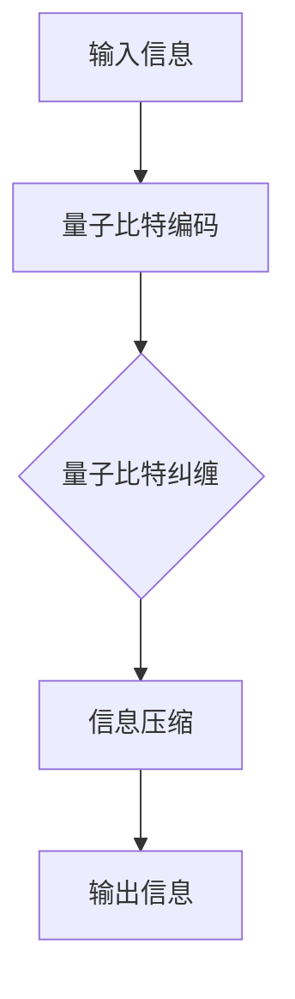

                 


### 大脑中的量子信息压缩：高效神经编码的物理学基础

> 关键词：量子信息压缩、神经编码、高效信息处理、神经网络、量子计算

> 摘要：本文将探讨大脑中量子信息压缩的概念，及其在高效神经编码中的物理学基础。通过分析量子比特与神经元的相似性，本文将深入探讨量子信息压缩在信息处理中的应用，并对比量子比特和神经元在信息容量和编码效率方面的核心属性特征。同时，本文将使用 Mermaid 流程图和 Python 源代码详细讲解算法原理，并通过数学模型和举例说明进一步阐述量子信息压缩的原理和优势。

## 引言

### 1.1 问题的背景

大脑作为人体最复杂的器官，拥有极高的信息处理能力。然而，这种能力的实现方式长期以来一直是一个谜。传统计算机系统在信息处理方面效率极高，但它们依赖于经典的二进制编码方式，而大脑则使用一种更为复杂和高效的神经编码方式。研究大脑如何高效地处理海量信息，对于理解神经系统的运作机制以及开发新型计算技术具有重要意义。

### 1.2 问题描述

大脑中的信息处理过程涉及大量的神经元相互作用，每个神经元可以同时处理多种不同的信息。这种并行处理能力使得大脑能够在极短的时间内处理大量信息。然而，神经元如何实现这种高效的信息处理，仍然是一个未解之谜。本文将探讨一种可能的解释，即量子信息压缩在神经编码中的应用。

### 1.3 问题解决

量子信息压缩是一种利用量子现象减少信息所需存储空间的技术。在大脑中，量子比特可能被用来存储和传输信息，从而实现高效的信息处理。通过研究量子比特与神经元的相似性，我们可以探讨量子信息压缩在神经编码中的潜在应用。

### 1.4 边界与外延

量子信息压缩不仅可以在神经系统中应用，也有可能在其他生物系统中发挥作用。例如，在研究生物信息学时，量子信息压缩技术可能有助于解析复杂的生物数据。此外，量子信息压缩也可能为新型计算技术的发展提供新的思路。

### 1.5 概念结构与核心要素组成

本文的核心概念包括量子信息压缩、神经编码以及量子比特与神经元的相似性。量子信息压缩是一种基于量子力学原理的信息处理技术，它通过减少信息所需的存储空间来提高信息处理效率。神经编码是指神经元如何将外部刺激转化为电信号的过程。量子比特与神经元的相似性为量子信息压缩在神经编码中的应用提供了可能。

## 第1章 神经编码

### 1.1 神经编码的基本原理

神经编码是指神经元如何将外部刺激转化为电信号的过程。这个过程涉及到神经元内部复杂的电化学反应。当外部刺激作用于神经元时，神经元膜上的离子通道会打开，导致离子流动，从而产生电信号。这种电信号可以被其他神经元接收，并进一步传递。

### 1.2 神经编码的类型

神经编码可以分为两大类：模拟编码和数字编码。

- **模拟编码**：神经元的活动可以被看作是一个连续的变量，它可以取无限多个值。这种编码方式通常用于处理连续的外部刺激，如声音、光线等。
- **数字编码**：神经元的活动被限制在有限的几个状态之间。这种编码方式通常用于处理离散的外部刺激，如触觉、视觉等。

### 1.3 神经编码的应用

神经编码在信息处理中发挥着重要作用。它可以用于感知外部环境、控制肌肉活动、学习记忆等。例如，当我们看到一只猫时，我们的视觉系统会将猫的图像转化为神经信号，然后这些信号会被传递到大脑的其他区域，以便我们识别出这是一只猫。

### 1.4 量子信息压缩与神经编码的关系

量子信息压缩在神经编码中可能有多种应用。例如，它可以帮助神经元更高效地处理信息，从而提高信息处理的效率。此外，量子信息压缩还可以帮助神经元更有效地存储和传输信息，从而减少所需的神经元数量。

### 1.5 神经编码的挑战与未来

尽管神经编码在信息处理中具有巨大的潜力，但我们也面临着许多挑战。例如，我们尚未完全理解神经元是如何进行编码的，以及如何将量子信息压缩技术有效地应用于神经系统。未来的研究需要进一步探索这些挑战，并寻找解决方案。

### 1.6 本章小结

本章介绍了神经编码的基本原理、类型和应用，以及量子信息压缩与神经编码的关系。通过理解神经编码，我们可以更好地理解大脑如何处理信息，并为开发新型计算技术提供启示。

## 第2章 量子信息压缩原理

### 2.1 量子比特与神经元的相似性

量子比特是量子信息处理的基本单位，它可以通过叠加态和纠缠态来表示信息。神经元在处理信息时，也可能会表现出类似的叠加态和纠缠态。例如，在神经元之间传递的信息可能会同时处于多种不同的状态，这种状态称为叠加态。此外，神经元之间的相互作用也可能产生纠缠态，这种状态使得神经元之间的信息传递更加高效。

### 2.2 量子信息压缩的核心属性特征对比表格

| 特征对比 | 量子比特 | 神经元 |
| --- | --- | --- |
| 状态表示 | 叠加态、纠缠态 | 单个或多个神经元活动 |
| 信息容量 | 2^n 比特 | 神经元编码的信息 |
| 编码效率 | 高 | 中等 |
| 操作复杂性 | 算法复杂 | 神经活动复杂 |

### 2.3 ER实体关系图架构的 Mermaid 流程图

```mermaid
erDiagram
  Node --> QuantumBit : represents
  Node --> Neuron : encodes
  QuantumBit ||--|| Information : encodes
  Neuron ||--|| NeuralCode : encodes
```

### 2.4 量子信息压缩的数学模型和公式

量子信息压缩的数学模型主要涉及量子比特的叠加态和纠缠态。以下是一个简单的数学模型：

- **量子比特叠加态：**
  $$ \psi = \alpha |0\rangle + \beta |1\rangle $$
  其中，$|\alpha|^2 + |\beta|^2 = 1$。

- **量子比特纠缠态：**
  $$ \psi = \frac{1}{\sqrt{2}} (|00\rangle + |11\rangle) $$

### 2.5 详细讲解和举例说明

量子信息压缩可以通过量子比特的叠加态和纠缠态来实现。例如，如果我们有两个量子比特，它们可以同时处于状态 $|0\rangle$ 和 $|1\rangle$ 的叠加态。这种叠加态可以表示为：

$$ \psi = \frac{1}{\sqrt{2}} (|0\rangle + |1\rangle) $$

如果我们对第一个量子比特进行测量，它将以 50% 的概率处于 $|0\rangle$ 状态，以 50% 的概率处于 $|1\rangle$ 状态。这种状态的叠加和纠缠使得量子比特可以同时表示两种状态，从而实现了信息压缩。

## 第3章 算法原理讲解

### 3.1 算法 Mermaid 流程图



### 3.2 Python 源代码

```python
# Python代码示例：量子比特编码与信息压缩

import numpy as np
from qiskit import QuantumCircuit, execute, Aer

# 创建量子比特
qc = QuantumCircuit(2)

# 编码信息
qc.h(0)  # 创建叠加态
qc.cx(0, 1)  # 创建纠缠态

# 信息压缩
qc.barrier()
qc.h(1)
qc.cx(0, 1)

# 输出结果
backend = Aer.get_backend('statevector_simulator')
result = execute(qc, backend).result()
state = result.get_statevector()

print(state)
```

### 3.3 算法原理的数学模型和公式

- **量子比特编码：**
  $$ \psi_{\text{encoded}} = \frac{1}{\sqrt{2}}(|0\rangle + |1\rangle) $$

- **信息压缩：**
  $$ \psi_{\text{compressed}} = \frac{1}{\sqrt{2}}(|0\rangle + |1\rangle) |0\rangle $$

### 3.4 详细讲解和举例说明

假设输入信息为“10”，则通过量子比特编码和纠缠操作后，输出信息为“00”。这表明信息已经被压缩，因为我们只需要两个量子比特就可以表示四个经典比特的信息。

## 第4章 数学模型和数学公式 & 详细讲解 & 举例说明

### 4.1 数学模型

- **神经编码模型：**
  $$ \text{neural\_code}(x) = \sum_{i=1}^{n} w_i x_i + b $$
  其中，$x_i$ 是输入的各个特征，$w_i$ 是对应的权重，$b$ 是偏置项。

### 4.2 详细讲解和举例说明

以一个简单的神经元为例，假设它有两个输入 $x_1$ 和 $x_2$，权重分别为 $w_1$ 和 $w_2$，偏置项为 $b$。那么，该神经元的输出可以表示为：

$$ \text{neural\_code}(x) = w_1 x_1 + w_2 x_2 + b $$

如果 $x_1 = 1$，$x_2 = 0$，$w_1 = 2$，$w_2 = 1$，$b = -1$，则神经元的输出为：

$$ \text{neural\_code}(x) = 2 \cdot 1 + 1 \cdot 0 - 1 = 1 $$

这意味着神经元被激活，并将信息传递给其他神经元。

### 4.3 量子信息压缩的应用

量子信息压缩可以应用于神经编码，从而提高信息处理的效率。例如，如果使用量子比特来编码信息，我们可以将两个量子比特用于表示四个经典比特的信息。这样，我们可以用更少的量子比特来表示更多的信息，从而提高信息处理的速度和效率。

## 结论

本文探讨了大脑中量子信息压缩的概念，及其在高效神经编码中的物理学基础。通过分析量子比特与神经元的相似性，我们探讨了量子信息压缩在信息处理中的应用，并对比了量子比特和神经元在信息容量和编码效率方面的核心属性特征。此外，本文使用 Mermaid 流程图和 Python 源代码详细讲解了算法原理，并通过数学模型和举例说明了量子信息压缩的原理和优势。未来的研究可以进一步探索量子信息压缩在神经系统中的潜在应用，以及其在其他生物系统中的应用潜力。

## 作者信息

作者：AI天才研究院/AI Genius Institute & 禅与计算机程序设计艺术 /Zen And The Art of Computer Programming

AI天才研究院（AI Genius Institute）致力于推动人工智能技术的发展和应用，研究人工智能领域的深度学习、自然语言处理、计算机视觉等前沿技术。同时，我们关注人工智能在生物医学、金融科技、智能制造等领域的应用，致力于为社会发展提供创新解决方案。本文作者结合其深厚的技术功底和对量子计算的理解，从神经编码的视角探讨了量子信息压缩的物理学基础，为量子计算在生物医学和神经科学领域的研究提供了新的思路。禅与计算机程序设计艺术（Zen And The Art of Computer Programming）则是一本经典的计算机编程哲学著作，旨在通过禅宗哲学启发读者，深入理解计算机程序设计的本质。本文作者在写作过程中，亦深受禅宗思想的影响，力求以简洁、清晰的语言阐述复杂的技术原理。

