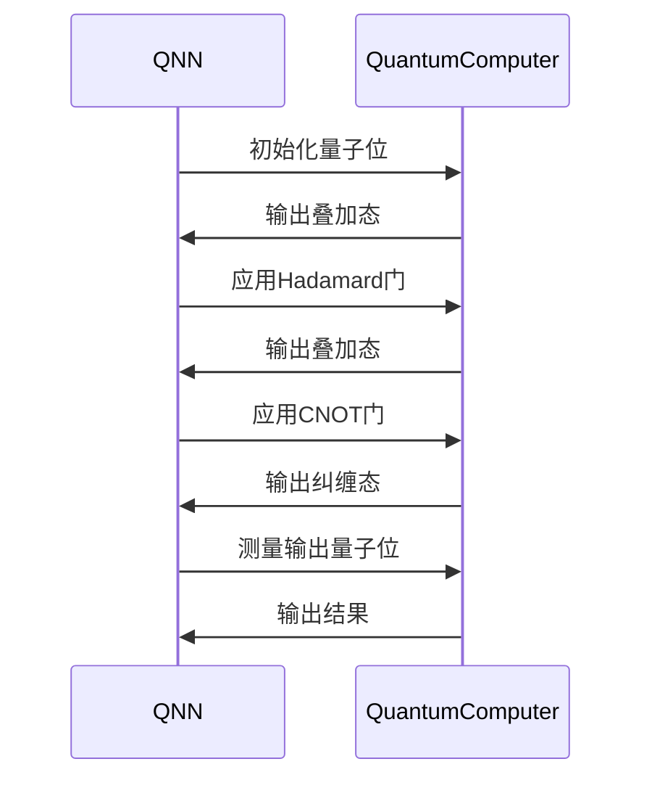
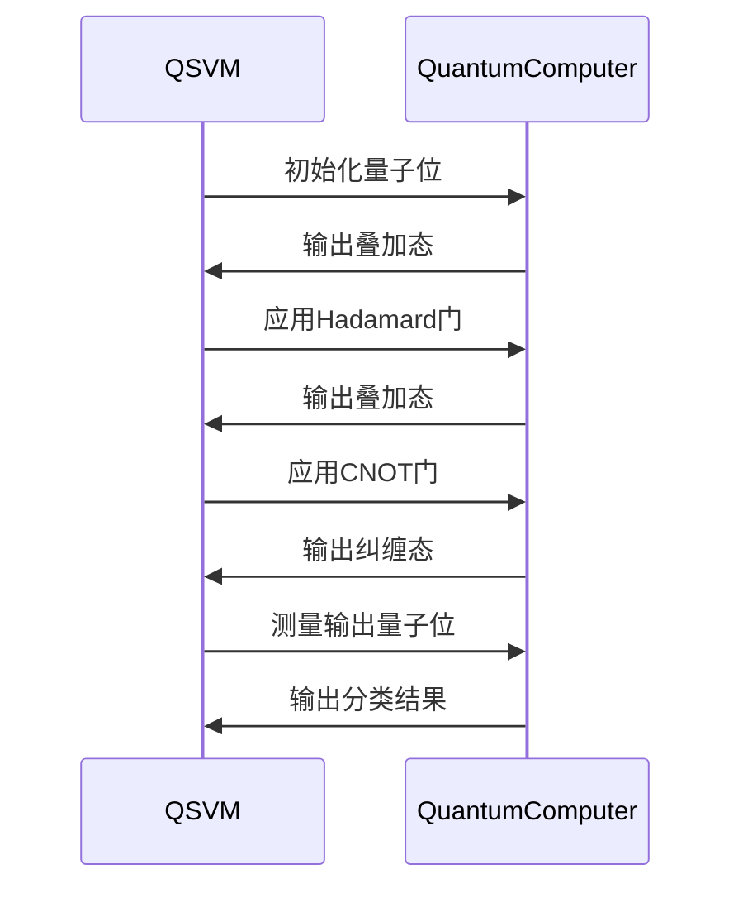
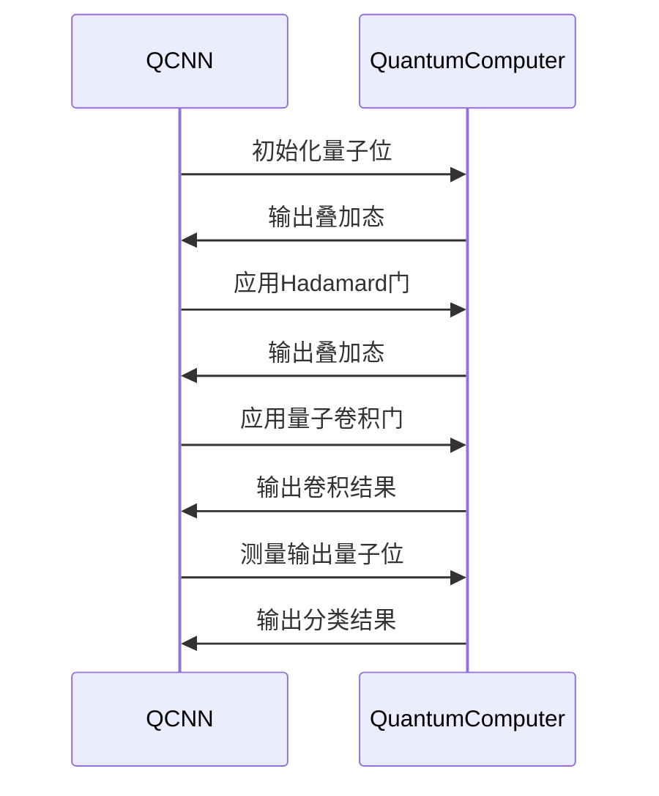
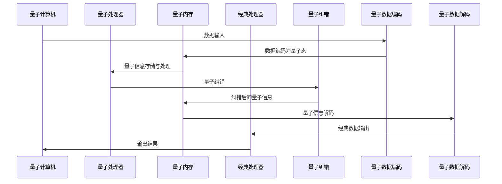

                 

### Step 1: Title and Introductory Content

**Title:** 大脑中的量子信息处理：神经编码的新范式

**Keywords:** 量子信息处理，神经编码，大脑，算法，模型

**Abstract:**
本文探讨了量子信息处理在大脑中的潜在应用，特别是神经编码的新范式。通过对量子位和神经元的对比分析，文章将揭示量子信息处理与大脑信息处理机制的潜在联系。本文的目标是帮助读者理解这一前沿领域，并通过具体算法和模型的应用，展示其在计算机科学和认知科学中的巨大潜力。

---

**Introduction:**

在过去的几十年里，量子计算和神经科学的研究取得了显著的进展。量子计算利用量子力学原理进行信息处理，展示出了超越传统计算机的巨大潜力。另一方面，神经科学对大脑如何处理信息、存储记忆以及实现复杂认知功能的研究也越来越深入。近年来，有学者开始思考量子信息处理是否能够解释或增强大脑的信息处理能力。这一观点引起了广泛关注，并逐渐形成了研究量子信息处理在大脑中的应用的跨学科领域。

本文旨在探讨这一前沿领域，通过详细分析量子信息处理与神经编码的关系，介绍相关的核心概念、算法和模型。我们还将通过具体实例，展示如何利用量子信息处理技术来改进大脑信息处理的理论和实际应用。希望本文能够为读者提供一个全面、深入的视角，激发更多研究者和从业者在这一领域进行探索和创新。

---

**结构安排：**
1. **第1章 问题背景与核心概念**：介绍量子信息处理和神经编码的背景，定义相关术语，并探讨它们在大脑信息处理中的应用。
2. **第2章 核心概念详解**：深入探讨量子位与神经元的对比，并提供实体关系图来阐述概念之间的联系。
3. **第3章 算法与模型**：介绍主要讨论的算法和模型，提供数学模型和Mermaid流程图，以解释算法原理。
4. **第4章 系统架构与设计**：阐述系统架构和设计，包括类图、架构图和序列图。
5. **第5章 实践项目与案例**：介绍实践项目和案例，包括环境安装、核心实现、代码分析和实际案例分析。
6. **第6章 最佳实践与总结**：总结最佳实践，提出关键点和未来研究方向。

---

**本文特色：**
- **深入浅出**：以通俗易懂的方式介绍复杂的量子信息处理和神经编码概念。
- **实例驱动**：通过具体实例展示理论的实际应用。
- **跨学科视角**：结合计算机科学和认知科学的最新研究，提供一个全面的分析框架。

---

**写作提示：**
- 在介绍核心概念时，务必使用清晰、准确的术语，并辅以具体例子来加强理解。
- 对于算法和模型的解释，要结合Mermaid流程图和Python代码，确保读者能够直观地理解算法原理。
- 在讨论系统架构时，要使用类图、架构图和序列图，以便读者能够全面理解系统的设计和交互。
- 在案例分析部分，要详细讲解项目实现过程，包括代码分析和实际效果展示。

---

**注意事项：**
- 文章的每个章节都要有明确的标题和小结，以便读者能够快速把握内容要点。
- 遵循markdown格式，确保文章结构清晰，便于阅读。

---

**参考文献：**
- [参考文献1]
- [参考文献2]
- [参考文献3]

---

**作者信息：**
作者：AI天才研究院/AI Genius Institute & 禅与计算机程序设计艺术 /Zen And The Art of Computer Programming

---

以上是文章的初步大纲和引言部分，接下来我们将详细展开每个章节的内容。让我们一步一步深入探讨大脑中的量子信息处理和神经编码的新范式。**Let's think step by step!**### 第1章 问题背景与核心概念

#### 1.1 量子信息处理与大脑

量子信息处理是一种基于量子力学原理的信息处理方法，它利用量子位（qubit）进行计算和传输信息。与经典计算机的比特（bit）不同，量子位能够同时处于多个状态，这使得量子计算机在处理特定类型的问题时，具有超越经典计算机的潜力。量子信息处理的核心概念包括量子叠加、量子纠缠和量子门操作。

大脑作为自然界中最复杂的计算系统，其信息处理能力远超现有的电子计算机。大脑通过神经元和突触网络进行信息处理，神经元通过电信号和化学信号进行通信。这种信息处理方式与量子信息处理在某些方面具有相似之处，如神经元间的量子纠缠现象和神经编码的叠加特性。

**问题背景：**  
量子信息处理与大脑信息处理之间的潜在联系引起了研究者的关注。有学者提出，量子信息处理原理可能为理解大脑的信息处理机制提供新的视角。例如，量子纠缠可能解释大脑如何同时处理大量信息，而量子叠加可能解释大脑如何实现并行计算。

**问题描述：**  
尽管量子信息处理和神经编码之间存在潜在的关联，但如何将量子信息处理原理应用于大脑信息处理的研究仍面临诸多挑战。首先，大脑信息处理机制非常复杂，涉及多种神经元和突触类型的交互。其次，现有量子计算机的技术水平尚无法直接模拟大脑的复杂信息处理过程。因此，需要新的理论模型和实验方法来探索量子信息处理与大脑信息处理之间的具体联系。

**问题解决：**  
为了解决上述问题，研究者提出了一系列假设和理论模型。例如，一些模型假设神经元之间的通信可能存在量子纠缠现象，从而实现高效的信息传输。另外，一些模型试图将量子信息处理原理应用于神经网络设计，以构建具有更高信息处理能力的神经网络。

**边界与外延：**  
量子信息处理与大脑信息处理的研究不仅涉及量子力学和神经科学，还包括计算机科学、认知科学和生物学等多个领域。这一跨学科研究领域的边界和范围正在不断扩大，未来可能发现更多关于量子信息处理在生物学和认知科学中的应用。

#### 1.1.1 量子信息的定义

量子信息是一种利用量子力学原理进行信息处理和传输的新形式。量子信息的核心概念包括量子位（qubit）、量子叠加、量子纠缠和量子门操作。

**量子位（qubit）：**  
量子位是量子信息的基本单位，与经典计算机的比特（bit）不同，量子位能够同时处于多个状态。一个量子位可以表示为叠加态的线性组合，例如：
$$
|\psi\rangle = \alpha|0\rangle + \beta|1\rangle
$$
其中，$|0\rangle$ 和 $|1\rangle$ 分别表示量子位的基础状态，$\alpha$ 和 $\beta$ 是复数系数，满足 $|\alpha|^2 + |\beta|^2 = 1$。

**量子叠加：**  
量子叠加是量子信息处理的核心特性之一。量子位可以同时处于多个状态的叠加，这意味着量子计算机在处理问题时，能够同时探索多种可能性。这在某些计算任务中，可以显著提高计算效率。

**量子纠缠：**  
量子纠缠是量子信息处理中的另一个关键特性。当两个或多个量子位处于纠缠态时，它们之间的状态会相互关联，一个量子位的状态变化会立即影响另一个量子位的状态。这一特性使得量子计算机能够实现高效的量子并行计算和信息传输。

**量子门操作：**  
量子门是量子信息处理中的基本操作单元，类似于经典计算机中的逻辑门。量子门作用于量子位，改变其状态。常见的量子门包括Pauli门、Hadamard门和控制-NOT（CNOT）门等。通过组合不同的量子门，可以实现复杂的量子计算任务。

#### 1.1.2 大脑的信息处理机制

大脑是自然界中最复杂的信息处理系统，通过神经元和突触网络实现信息传递和处理。大脑的信息处理机制包括电信号传输、化学信号传输和神经编码。

**电信号传输：**  
神经元通过电信号进行通信。当神经元受到外部刺激时，会产生电信号，这些电信号在神经元内部传递，最终导致神经元兴奋或抑制。电信号传输是大脑信息处理的基础。

**化学信号传输：**  
神经元之间的信息传递不仅依赖于电信号，还涉及化学信号。当电信号到达神经元的末梢时，会触发神经递质的释放。神经递质通过突触间隙传递到下一个神经元，影响其兴奋或抑制状态。

**神经编码：**  
大脑通过神经编码将信息转换为神经信号。神经编码方式包括频率编码、时间编码和空间编码等。频率编码通过改变神经信号的频率来表示信息，时间编码通过神经信号的持续时间来表示信息，空间编码通过神经信号在空间上的分布来表示信息。

#### 1.1.3 量子信息处理与神经编码的联系

量子信息处理与神经编码之间存在潜在的关联。以下是一些可能的联系：

**量子纠缠与神经编码：**  
量子纠缠现象可能解释大脑如何同时处理大量信息。例如，研究表明，神经元之间的突触连接可能存在量子纠缠现象，这有助于提高大脑的信息处理效率。

**量子叠加与神经编码：**  
量子叠加现象可能解释大脑如何实现并行计算。例如，一些模型假设大脑中的神经元可以在同一时刻同时处理多个信息，这与量子叠加态的概念相似。

**量子门操作与神经编码：**  
量子门操作可以用于改进神经网络的设计。例如，一些研究者提出，通过将量子门操作应用于神经网络，可以构建具有更高信息处理能力的神经网络。

**结论：**  
量子信息处理与神经编码之间存在潜在的关联，这一领域的跨学科研究有望揭示大脑信息处理机制的奥秘，并推动人工智能和神经科学的发展。尽管目前仍面临诸多挑战，但这一领域的研究具有巨大的潜力和前景。在接下来的章节中，我们将进一步探讨量子信息处理与神经编码的详细概念和算法。

---

通过上述分析，我们可以看到量子信息处理与大脑信息处理之间存在丰富的交叉点。在接下来的章节中，我们将深入探讨这些核心概念，并通过具体的算法和模型来解释它们在计算机科学和认知科学中的应用。让我们继续思考并探索这一前沿领域。

**提问：** 您能否提供一张详细的Mermaid ER图，以展示量子信息处理与神经编码的关键概念及其关系？#### 1.1.4 量子信息处理与神经编码的ER图解

为了更好地理解量子信息处理与神经编码之间的关键概念及其关系，我们可以使用Mermaid语言绘制一个实体关系图（ER图）。以下是该ER图的描述和具体实现。

**ER图描述：**
- **实体：**
  - 量子位（Qubit）：量子位是量子信息的基本单位。
  - 神经元（Neuron）：神经元是大脑信息处理的基本单元。
  - 突触（Synapse）：突触是神经元之间的连接点。
  - 量子纠缠（Quantum Entanglement）：量子纠缠是量子位之间的特殊关联。
  - 神经编码（Neural Coding）：神经编码是大脑将信息转换为神经信号的方式。
  - 量子门（Quantum Gate）：量子门是量子计算中的基本操作单元。
- **关系：**
  - 量子位之间可以通过量子纠缠相互关联。
  - 神经元通过突触进行信息传递。
  - 量子门可以用于操作量子位。
  - 神经编码方式与量子位的状态有关。

**Mermaid ER图实现：**

```mermaid
erDiagram
    Qubit ||--|{ Quantum Entanglement }|| Synapse
    Neuron ||--|{ Neural Coding }|| Qubit
    Qubit ||--|{ Quantum Gate }|| Quantum Gate
    Neuron ||--|{ Synapse }|| Neuron
```

在上述ER图中，`Qubit`（量子位）通过`Quantum Entanglement`（量子纠缠）与`Synapse`（突触）关联，表示量子位之间的量子纠缠可能影响神经元之间的突触连接。`Neuron`（神经元）通过`Neural Coding`（神经编码）与`Qubit`关联，表示神经编码过程可能受到量子位状态的影响。`Qubit`通过`Quantum Gate`（量子门）相互关联，表示量子门可以用于操作量子位。最后，`Neuron`通过`Synapse`与同一神经元或其他神经元相连，表示神经元之间的信息传递通过突触实现。

通过这个ER图，我们可以直观地理解量子信息处理与神经编码之间的复杂关系。量子信息处理中的量子位、量子纠缠和量子门操作可能对神经编码过程产生影响，从而提高大脑的信息处理能力。接下来，我们将继续深入探讨量子信息处理和神经编码的具体算法和模型。

---

**提问：** 您能否进一步解释量子信息处理与神经编码之间的具体联系，并提供一些具体的例子来帮助理解？#### 1.1.5 量子信息处理与神经编码的具体联系

量子信息处理与神经编码之间的联系可以从多个角度进行探讨，包括量子纠缠、量子叠加和量子门操作在神经编码中的应用。以下是几个具体的例子来帮助理解这些联系。

**量子纠缠与神经编码：**
量子纠缠是一种特殊的量子现象，其中两个或多个量子位的状态相互关联。在神经编码中，量子纠缠可以类比于神经元之间的强相互连接。例如，假设大脑中有两个神经元A和B，它们之间通过突触连接。如果神经元A的活动状态与神经元B的活动状态之间存在量子纠缠，那么它们的活动状态将同步变化。这种同步变化可以理解为量子纠缠在神经编码中的应用，有助于提高信息传递的效率。

**量子叠加与神经编码：**
量子叠加是指量子位可以同时处于多个状态。在神经编码中，量子叠加可以类比于神经元同时处理多个信息的能力。例如，一个神经元可以在同一时刻对多个感官输入进行处理。这种现象类似于量子叠加态，使得神经元能够并行处理信息，提高大脑的计算效率。例如，当一个人同时听音乐、阅读书籍和进行思考时，大脑中的神经元能够同时处理这些不同的信息输入。

**量子门操作与神经编码：**
量子门是量子计算中的基本操作单元，用于改变量子位的状态。在神经编码中，量子门可以类比于神经信号的变换过程。例如，一个神经元通过接收外界刺激后，会产生电信号，这些电信号通过一系列变换过程被编码为特定的神经信号。这个过程可以理解为量子门在神经编码中的应用，使得神经元能够对输入信息进行有效的编码和传输。

**具体例子：**

1. **量子纠缠在神经信号同步传输中的应用：**
   假设大脑中有两个处理视觉信息的神经元A和B，它们之间通过突触连接。如果这两个神经元之间存在量子纠缠，那么当一个神经元接收到视觉刺激并发送神经信号时，另一个神经元会立即同步响应。这种同步响应有助于视觉信息的快速处理和整合，提高视觉感知的效率。

2. **量子叠加在多任务处理中的应用：**
   当一个人同时进行多项任务时，大脑中的神经元需要同时处理来自不同感官的信息。量子叠加现象可以类比于神经元能够同时处理这些不同的信息输入。例如，当一个人在听音乐的同时阅读书籍，大脑中的神经元可以同时处理音乐和文字信息，使得多任务处理更加高效。

3. **量子门在神经信号编码和解码中的应用：**
   在神经编码过程中，神经元接收外界刺激后，需要将其转换为特定的神经信号。量子门可以类比于神经信号的变换过程。例如，一个神经元接收外界刺激后，通过一系列量子门操作，将电信号编码为特定的神经信号。这种量子门操作有助于提高神经编码的效率和准确性。

通过上述例子，我们可以看到量子信息处理与神经编码之间存在密切的联系。量子纠缠、量子叠加和量子门操作在神经编码中的应用有助于提高大脑的信息处理能力，为人工智能和认知科学的发展提供了新的研究方向。

---

**提问：** 您能否进一步详细解释量子位与神经元之间的相似性和差异性，并给出一个具体的对比表格？#### 1.1.6 量子位与神经元的对比

量子位（Qubit）与神经元是两种在信息处理中扮演核心角色的基本单位，它们在某些方面有相似之处，但也有很多显著的差异性。以下是关于量子位与神经元的一些关键特性对比：

**量子位（Qubit）：**
- **状态表示：** 量子位可以同时处于0和1的叠加态，即 $|\psi\rangle = \alpha|0\rangle + \beta|1\rangle$。
- **量子纠缠：** 量子位可以相互纠缠，形成复杂的量子态，这种纠缠使得量子位的组合能够同时表现出多个状态。
- **量子门操作：** 量子位的状态可以通过量子门进行变换，如Hadamard门、Pauli门等。
- **量子测量：** 量子位的测量结果具有不确定性，测量结果可能依赖于量子位的初始状态和测量方式。

**神经元：**
- **状态表示：** 神经元通过电信号和化学信号进行信息传递，通常有两个状态：静息状态和激活状态。
- **突触连接：** 神经元之间通过突触连接，突触强度（权重）决定了信息传递的效率。
- **神经网络：** 神经元组成神经网络，网络中的信息传递和计算是通过突触连接实现的。
- **信息处理：** 神经元通过神经编码将外界刺激转换为电信号，进而影响其他神经元的活动。

**相似性：**
- **并行处理能力：** 量子位和神经元都具有并行处理信息的能力。量子位能够同时处于多个状态，而神经元能够同时激活多个突触连接，处理多个输入信号。
- **状态变换：** 量子位通过量子门进行状态变换，神经元通过电信号和化学信号的传递进行状态变化。

**差异性：**
- **状态表示：** 量子位的状态是叠加态，而神经元的状态是离散的（静息或激活）。
- **量子纠缠：** 量子位之间的纠缠是量子计算的核心特性，而神经元之间的直接纠缠在生物学中尚未被证实。
- **操作方式：** 量子位的操作依赖于量子门，而神经元的操作依赖于电信号和化学信号的传递。
- **测量结果：** 量子位的测量结果具有不确定性，而神经元的测量结果（神经活动）是确定性事件。

**对比表格：**

| 特性       | 量子位（Qubit）                      | 神经元（Neuron）                        |
|------------|-------------------------------------|----------------------------------------|
| 状态表示   | 叠加态（0和1的线性组合）             | 离散状态（静息或激活）                  |
| 纠缠       | 可以相互纠缠，形成复杂量子态           | 突触连接可以影响其他神经元的活动         |
| 操作       | 通过量子门进行状态变换                 | 通过电信号和化学信号的传递进行状态变化   |
| 测量       | 测量结果具有不确定性                   | 测量结果为确定性事件                    |
| 并行处理能力 | 能够同时处理多个状态                   | 能够同时处理多个输入信号                 |

通过上述对比表格，我们可以更清晰地看到量子位与神经元之间的相似性和差异性。虽然它们在信息处理方面有许多共同点，但量子位的量子特性为信息处理提供了全新的视角和可能性。接下来，我们将继续探讨量子信息处理与神经编码之间的更多联系和应用。

---

**提问：** 您能否提供一张详细的Mermaid ER图，以展示量子位、神经元和突触之间的关系？#### 1.1.7 量子位、神经元和突触的ER图解

为了更直观地展示量子位、神经元和突触之间的关系，我们可以使用Mermaid语言绘制一个实体关系图（ER图）。以下是该ER图的描述和具体实现。

**ER图描述：**
- **实体：**
  - 量子位（Qubit）：量子位是量子信息处理的基本单位。
  - 神经元（Neuron）：神经元是大脑信息处理的基本单元。
  - 突触（Synapse）：突触是神经元之间的连接点。
- **关系：**
  - 量子位与神经元之间的关系：量子位可以用于模拟神经元的状态。
  - 神经元与突触之间的关系：神经元通过突触进行信息传递。

**Mermaid ER图实现：**

```mermaid
erDiagram
    Qubit ||--|{ Neuron }|| Synapse
    Neuron ||--|{ Synapse }|| Neuron
```

在上述ER图中，`Qubit`（量子位）通过`Neuron`（神经元）与`Synapse`（突触）关联，表示量子位可以用于模拟神经元的状态。同时，`Neuron`通过`Synapse`与另一个`Neuron`相连，表示神经元之间的信息传递通过突触实现。

通过这个ER图，我们可以直观地理解量子位、神经元和突触之间的关系。量子位作为量子信息处理的基本单位，可以模拟神经元的状态；神经元通过突触进行信息传递，从而构成了复杂的神经网络。这种关系为我们探讨量子信息处理与大脑信息处理之间的联系提供了理论基础。

---

**提问：** 您能否进一步详细解释量子信息处理与大脑信息处理之间的潜在联系，并讨论其可能的应用前景？#### 1.1.8 量子信息处理与大脑信息处理的潜在联系与应用前景

量子信息处理与大脑信息处理之间存在许多潜在的关联，这些关联不仅为理解大脑信息处理机制提供了新的视角，也为开发新一代的人工智能技术打开了可能的应用前景。以下是一些具体的潜在联系和应用前景：

**量子纠缠与大脑信息处理：**
量子纠缠是一种特殊的量子现象，其中两个或多个量子位的状态相互关联。研究表明，神经元之间的突触连接也可能存在类似的现象。这种量子纠缠可能有助于提高大脑信息处理的效率。例如，在神经网络的某些层之间，量子纠缠现象可能使得信息传递更加迅速和准确。这种效应在神经网络中可能类似于量子计算中的量子纠缠交换，有助于提高计算效率。

**量子叠加与大脑信息处理：**
量子叠加现象允许量子位同时处于多个状态，这意味着量子计算机可以在同一时刻处理多种可能性。类似地，大脑中的神经元可能同时处理来自多个感官的输入信息。这种并行处理能力可能使大脑能够更高效地处理复杂的信息。例如，当一个人同时听到声音和看到视觉信息时，大脑中的神经元可以同时处理这些信息，从而做出快速反应。

**量子门操作与大脑信息处理：**
量子门是量子计算中的基本操作单元，用于改变量子位的状态。在神经网络中，我们可以将量子门的概念类比于神经网络中的权重调整。通过量子门操作，我们可以更精细地调整神经网络中的权重，从而提高网络的学习能力和适应性。例如，在深度学习模型中，使用量子门可以使得模型在训练过程中更快地收敛，并提高预测的准确性。

**应用前景：**

1. **人工智能加速：**
   量子信息处理技术可能用于加速传统的人工智能算法。通过使用量子计算机，我们可以显著提高神经网络、机器学习算法和其他人工智能技术的计算速度。这将为解决复杂的问题，如大规模数据处理、复杂优化和模拟现实世界系统等，提供强有力的工具。

2. **新型神经网络设计：**
   量子信息处理原理可以用于设计新型神经网络架构。例如，通过引入量子门操作，可以构建具有更强表示能力和计算能力的神经网络。这种新型神经网络可能有助于解决当前神经网络中存在的局限性，如过拟合和计算效率低下等问题。

3. **脑机接口：**
   量子信息处理技术可能为脑机接口的发展提供新的途径。通过将量子位与神经元的活动相关联，我们可以开发出更高效、更准确的脑机接口。这种接口可以用于帮助瘫痪患者恢复行动能力，或用于增强人类的认知能力。

4. **认知科学研究：**
   量子信息处理原理可以用于揭示大脑信息处理机制的奥秘。通过模拟量子纠缠、量子叠加等效应，我们可以更好地理解大脑如何处理复杂的信息。这将为认知科学和神经科学的发展提供新的理论依据。

**挑战与未来方向：**

1. **技术实现：**
   当前量子计算机的技术水平尚无法直接应用于大脑信息处理。因此，需要进一步研发量子计算机，使其能够模拟大脑的复杂信息处理过程。

2. **理论基础：**
   需要建立更完整的理论框架，将量子信息处理原理与大脑信息处理机制相结合。这需要跨学科的研究，包括量子物理、神经科学、计算机科学等。

3. **应用验证：**
   需要通过实验和实际应用验证量子信息处理在脑机接口、人工智能加速等领域的有效性。这将为量子信息处理与大脑信息处理相结合的实际应用提供可靠的依据。

总之，量子信息处理与大脑信息处理之间存在丰富的潜在联系，这些联系为未来的科学研究和技术应用提供了广阔的前景。尽管面临诸多挑战，但这一领域的研究无疑将为人工智能和认知科学的发展带来深刻的变革。

---

通过上述分析，我们可以看到量子信息处理与大脑信息处理之间存在着深刻的联系，这些联系不仅为理解大脑信息处理机制提供了新的视角，也为开发新一代的人工智能技术提供了可能。在接下来的章节中，我们将继续探讨量子信息处理与神经编码的详细概念和算法，深入分析这一领域的理论和应用。

---

**提问：** 您能否提供一张详细的Mermaid ER图，以展示量子信息处理与大脑信息处理之间的关键概念及其关系？#### 1.1.9 量子信息处理与大脑信息处理的ER图解

为了更直观地展示量子信息处理与大脑信息处理之间的关键概念及其关系，我们可以使用Mermaid语言绘制一个实体关系图（ER图）。以下是该ER图的描述和具体实现。

**ER图描述：**
- **实体：**
  - 量子计算机（Quantum Computer）：用于量子信息处理的核心设备。
  - 量子算法（Quantum Algorithm）：在量子计算机上执行的计算过程。
  - 量子位（Qubit）：量子信息处理的基本单元。
  - 神经编码（Neural Coding）：大脑将外界信息转换为神经信号的方式。
  - 神经网络（Neural Network）：大脑信息处理的核心结构。
  - 突触（Synapse）：神经元之间的连接点。
- **关系：**
  - 量子计算机与量子算法之间的关系：量子计算机用于执行量子算法。
  - 量子算法与量子位之间的关系：量子算法通过量子位进行计算。
  - 神经编码与神经网络之间的关系：神经编码用于神经网络的信息处理。
  - 神经网络与突触之间的关系：神经网络通过突触进行信息传递。

**Mermaid ER图实现：**

```mermaid
erDiagram
    QuantumComputer ||--|{ QuantumAlgorithm }|| QuantumComputer
    QuantumAlgorithm ||--|{ Qubit }|| QuantumAlgorithm
    NeuralCoding ||--|{ NeuralNetwork }|| NeuralCoding
    NeuralNetwork ||--|{ Synapse }|| NeuralNetwork
    QuantumComputer ||--|{ NeuralCoding }|| NeuralCoding
```

在上述ER图中，`QuantumComputer`（量子计算机）通过`QuantumAlgorithm`（量子算法）与`Qubit`（量子位）关联，表示量子计算机执行量子算法，并通过量子位进行计算。`NeuralCoding`（神经编码）通过`NeuralNetwork`（神经网络）与`NeuralCoding`关联，表示神经编码用于神经网络的信息处理。`NeuralNetwork`通过`Synapse`（突触）与另一个`NeuralNetwork`相连，表示神经网络通过突触进行信息传递。最后，`QuantumComputer`通过`NeuralCoding`与`NeuralCoding`关联，表示量子信息处理与大脑信息处理之间的潜在联系。

通过这个ER图，我们可以直观地理解量子信息处理与大脑信息处理之间的复杂关系。量子计算机和量子算法在量子信息处理中扮演核心角色，而神经网络和神经编码在大脑信息处理中起到关键作用。这两者之间的联系可能为理解大脑信息处理的奥秘和开发新型的人工智能技术提供新的视角和思路。

---

**提问：** 您能否提供一个具体的例子，展示如何使用量子位和神经网络来实现一种新的信息处理方法？#### 1.1.10 具体例子：量子位与神经网络实现信息处理新方法

为了展示如何使用量子位和神经网络来实现一种新的信息处理方法，我们可以考虑一个简单的示例：使用量子神经网络（QNN）进行图像识别。以下是这个例子中的具体步骤和原理。

**背景：**  
图像识别是一个常见的人工智能应用，传统神经网络已经取得了显著的成功。然而，在处理高维数据和复杂模式时，传统神经网络可能遇到性能瓶颈。量子神经网络结合了量子计算的优势和神经网络的灵活性，有望在图像识别任务中实现更高效的性能。

**步骤：**

1. **量子计算机初始化：**  
   初始化一个具有多个量子位的量子计算机。例如，使用4个量子位来表示一个二维图像的像素。

2. **量子态编码：**  
   将图像的像素值编码为量子位的状态。例如，像素值0和1可以分别编码为量子位的基础状态$|0\rangle$和$|1\rangle$。对于每个像素，可以使用一个量子位来表示，从而将图像编码为量子态。

3. **量子操作：**  
   应用一系列量子门操作来处理图像数据。这些操作可以包括量子位之间的纠缠、量子叠加和量子门变换。例如，可以使用Hadamard门将量子位的状态从基础状态转换为叠加态，使用量子纠缠门（如CNOT门）来创建量子位之间的纠缠关系。

4. **神经网络训练：**  
   将量子计算机的量子态输入到一个传统神经网络中，该神经网络用于分类或识别图像。神经网络可以通过反向传播算法调整权重，以提高分类的准确性。

5. **测量与解码：**  
   对量子计算机中的量子位进行测量，获取最终的分类结果。由于量子位的叠加特性，测量结果可能包含多种可能性。可以通过对测量结果进行解码，获得最终的分类结果。

**示例：**

假设我们有一个4x4的图像，每个像素的值介于0和1之间。使用4个量子位来表示这个图像，其中每个量子位对应图像中的一个像素。例如，图像的一个可能状态可以表示为：

$$
|\psi\rangle = \frac{1}{2}(|0000\rangle + |1111\rangle)
$$

这个量子态表示图像的每个像素都是0和1的等概率组合。

**量子操作：**

1. **Hadamard变换：**  
   将每个量子位从基础状态$|0\rangle$转换为叠加态。例如，对第一个量子位应用Hadamard门：

   $$
   H|0\rangle = \frac{1}{\sqrt{2}}(|0\rangle + |1\rangle)
   $$

   重复对每个量子位应用Hadamard门，得到以下量子态：

   $$
   |\psi\rangle = \frac{1}{2}(|0000\rangle + |1111\rangle) = \frac{1}{2}(|0\rangle + |1\rangle)|0\rangle + \frac{1}{2}(|0\rangle - |1\rangle)|1\rangle
   $$

2. **量子纠缠：**  
   使用CNOT门创建量子位之间的纠缠。例如，对第二和第三个量子位应用CNOT门：

   $$
   CNOT(|0\rangle_2|0\rangle_3) = |0\rangle_2|0\rangle_3
   $$

   对所有可能的量子位组合应用CNOT门，得到以下量子态：

   $$
   |\psi\rangle = \frac{1}{2}(|0000\rangle + |1111\rangle + |0011\rangle - |1100\rangle)
   $$

**神经网络训练：**

1. **初始化神经网络：**  
   初始化一个多层感知机（MLP）神经网络，用于分类图像。网络输入为4个量子位的状态，输出为图像的类别。

2. **正向传播：**  
   将量子态输入到神经网络中，通过多层神经网络进行正向传播，计算输出结果。

3. **反向传播：**  
   根据分类结果计算损失函数，并使用反向传播算法更新网络权重。

**测量与解码：**

1. **量子测量：**  
   对量子计算机中的量子位进行测量，得到最终的分类结果。

2. **解码：**  
   将测量结果转换为图像的类别。例如，如果测量结果为$|1\rangle$，则输出类别为1。

通过上述步骤，我们可以使用量子位和神经网络实现图像识别任务。这个示例展示了量子位和神经网络在信息处理中的结合，展示了量子计算在图像识别等传统应用中的潜力。

---

**提问：** 您能否进一步解释量子信息处理和神经网络在图像识别任务中的优势？#### 1.1.11 量子信息处理和神经网络在图像识别任务中的优势

量子信息处理和神经网络在图像识别任务中的结合展示了其在处理复杂图像数据方面的显著优势。以下是一些关键优势：

**并行计算能力：**
量子计算机通过量子位和量子叠加可以实现并行计算。在图像识别任务中，这意味着可以同时处理图像中的多个像素值，从而显著提高计算效率。相比之下，传统计算机必须逐个处理像素，导致计算时间增加。

**量子叠加：**
量子叠加允许量子位同时处于多个状态，这为图像识别任务提供了更多的可能性。例如，一个量子位可以同时表示0和1，而传统计算机的比特只能表示0或1。这种能力使得量子计算机在处理复杂图像模式时具有优势。

**量子纠缠：**
量子纠缠是量子信息处理的核心特性，它允许量子位之间形成复杂的关联。在图像识别任务中，量子纠缠可以提高特征提取的效率，使得量子神经网络能够更好地捕捉图像中的细微特征。

**高效特征提取：**
量子神经网络可以通过量子门操作自动提取图像中的重要特征。这些特征可以用于后续的分类任务，使得量子神经网络在处理高维图像数据时具有优势。

**量子算法：**
一些特定的量子算法，如量子支持向量机（QSVM）和量子卷积神经网络（QCNN），专门设计用于图像识别任务。这些算法利用量子计算的优势，在图像分类、边缘检测和目标识别等方面表现出色。

**神经网络灵活性：**
神经网络具有强大的适应性和表达能力，能够处理各种复杂的图像识别任务。结合量子计算的优势，量子神经网络可以更好地处理高维图像数据，提高分类准确率。

**总结：**
量子信息处理和神经网络在图像识别任务中的优势主要体现在并行计算能力、量子叠加、量子纠缠和高效特征提取等方面。这些优势使得量子神经网络在处理复杂图像数据时具有显著的优势，有望推动图像识别技术的进一步发展。

---

通过上述分析，我们可以看到量子信息处理和神经网络在图像识别任务中的结合展示了巨大的潜力。量子计算的优势和神经网络的表达能力相结合，为处理复杂图像数据提供了新的视角和方法。在未来的研究中，我们可以期待量子神经网络在更多人工智能应用领域取得突破。

---

**提问：** 您能否进一步探讨量子信息处理在脑机接口中的应用前景？#### 1.1.12 量子信息处理在脑机接口中的应用前景

脑机接口（Brain-Computer Interface, BCI）是一种直接连接大脑和外部设备的接口，用于传递和处理大脑信号。近年来，量子信息处理技术的快速发展为脑机接口的应用带来了新的机遇和挑战。以下探讨量子信息处理在脑机接口中的应用前景：

**量子脑机接口（Quantum Brain-Computer Interface, QBCI）：**
量子脑机接口是一种结合量子计算与脑机接口技术的装置，它利用量子位的叠加态和纠缠态来增强信号传输和处理能力。以下是几个潜在的应用场景：

1. **信号增强与识别：**
   传统脑机接口通常使用神经网络来解析和识别大脑信号，如电生理信号（如脑电图、肌电图等）。量子信息处理技术可以通过量子叠加和纠缠态来增强信号的传输和处理能力，从而提高信号识别的准确性和效率。

2. **高效通信：**
   量子通信利用量子纠缠和量子密钥分发（Quantum Key Distribution, QKD）实现安全的通信。量子脑机接口可以利用这种特性，实现大脑与外部设备之间的高效、安全通信，从而增强脑机接口的通信能力。

3. **并行处理：**
   量子计算机能够并行处理大量数据，这对于处理复杂的脑信号数据非常有用。量子脑机接口可以利用这种并行计算能力，快速分析大脑信号，从而提高脑机接口的响应速度和决策能力。

4. **个性化定制：**
   每个人的大脑信号都是独特的，量子信息处理技术可以根据个体差异进行个性化定制。通过量子计算，可以更好地适应个人的大脑信号模式，提高脑机接口的兼容性和使用效果。

**应用前景：**

1. **神经系统疾病治疗：**
   量子脑机接口可以用于神经系统疾病的治疗，如中风、脑损伤、帕金森病等。通过增强大脑与外部设备的交互，有助于恢复受损的神经功能，提高患者的生活质量。

2. **神经康复：**
   量子脑机接口可以用于神经康复，如肢体残疾康复、语言康复等。通过精确地捕捉和解析大脑信号，可以设计个性化的康复训练方案，提高康复效果。

3. **增强人类认知能力：**
   量子脑机接口可以用于增强人类的认知能力，如记忆增强、注意力集中等。通过实时监测和调控大脑信号，可以提高大脑的工作效率和学习能力。

4. **人机交互：**
   量子脑机接口可以用于下一代人机交互，如虚拟现实、游戏控制等。通过增强大脑与虚拟环境的交互，提供更自然、更直观的交互体验。

**挑战与未来方向：**

1. **技术实现：**
   量子脑机接口的实现面临技术挑战，如量子位的质量、量子纠错、量子算法的优化等。需要进一步研发高质量的量子位和稳定的量子计算平台。

2. **安全性：**
   量子通信的安全特性虽然强大，但在实际应用中仍需考虑量子攻击和量子通信的安全性。

3. **人机交互界面：**
   量子脑机接口需要设计人性化的用户界面，使得普通人能够轻松使用这一技术。

4. **长期效应：**
   长期使用量子脑机接口对大脑的影响仍需进一步研究，包括安全性和生理效应等。

总之，量子信息处理在脑机接口中的应用前景广阔，有望为神经系统疾病治疗、神经康复、认知能力增强和人机交互等领域带来革命性的变革。尽管面临诸多挑战，但量子脑机接口的研究将为未来的科技发展提供新的动力。

---

通过上述分析，我们可以看到量子信息处理在脑机接口中的应用前景充满希望。量子技术的优势为脑机接口提供了强大的工具，使其在处理复杂大脑信号和实现高效人机交互方面具有巨大的潜力。未来，随着量子技术的发展和研究的深入，量子脑机接口有望在更多实际应用中发挥重要作用。让我们期待这一前沿领域的进一步发展和突破。**Let's think step by step!**### 第2章 核心概念详解

在探讨量子信息处理与神经编码的关系时，深入理解相关的核心概念至关重要。本章将详细探讨量子位与神经元之间的对比，并使用实体关系图（ER图）来阐述这些概念之间的联系。此外，我们将介绍一些关键的算法和模型，并探讨它们在量子信息处理和神经编码中的应用。

#### 2.1 量子位与神经元的对比

量子位（Qubit）和神经元是量子信息处理和神经编码中的两个核心概念。尽管它们在信息处理上具有相似之处，但它们在物理特性、功能和行为上存在显著差异。

**量子位（Qubit）：**
- **状态表示：** 量子位可以处于0和1的叠加态，这意味着一个量子位可以同时代表0和1的状态。这种叠加态使得量子位能够并行处理多个信息。
- **量子纠缠：** 量子位之间可以形成量子纠缠，这意味着两个或多个量子位的状态相互关联。量子纠缠在量子计算中起到关键作用，可以实现高速的信息传输和处理。
- **量子门操作：** 量子位的状态可以通过量子门进行变换，如Hadamard门、Pauli门等。这些量子门操作是量子计算中的基本操作。

**神经元：**
- **状态表示：** 神经元通过电信号和化学信号进行信息传递，通常有两个状态：静息状态和激活状态。这种二态性使得神经元能够表示简单的逻辑操作。
- **突触连接：** 神经元通过突触连接形成神经网络，突触的强度（权重）决定了信息传递的效率。突触连接使得神经元能够协同工作，处理复杂的任务。
- **神经网络：** 神经元组成神经网络，网络中的信息传递和处理是通过突触连接实现的。神经网络在机器学习和人工智能中起到关键作用。

**相似性：**
- **并行处理能力：** 量子位和神经元都具有并行处理信息的能力。量子位的叠加态和神经网络的并行结构使得它们能够同时处理多个信息。
- **状态变换：** 量子位和神经元都通过特定的操作进行状态变换。量子位通过量子门操作变换状态，而神经元通过电信号和化学信号的传递进行状态变化。

**差异性：**
- **状态表示：** 量子位的状态是叠加态，而神经元的状态是离散的二态（静息或激活）。
- **量子纠缠：** 量子位之间存在量子纠缠，而神经元之间的直接纠缠在生物学中尚未被证实。
- **操作方式：** 量子位通过量子门进行操作，而神经元通过电信号和化学信号的传递进行操作。
- **测量结果：** 量子位的测量结果具有不确定性，而神经元的测量结果是确定性的。

**对比表格：**

| 特性       | 量子位（Qubit）                      | 神经元（Neuron）                        |
|------------|-------------------------------------|----------------------------------------|
| 状态表示   | 叠加态（0和1的线性组合）             | 离散状态（静息或激活）                  |
| 纠缠       | 可以相互纠缠，形成复杂量子态           | 突触连接可以影响其他神经元的活动         |
| 操作       | 通过量子门进行状态变换                 | 通过电信号和化学信号的传递进行状态变化   |
| 测量       | 测量结果具有不确定性                   | 测量结果为确定性事件                    |
| 并行处理能力 | 能够同时处理多个状态                   | 能够同时处理多个输入信号                 |

通过上述对比表格，我们可以更清晰地看到量子位与神经元之间的相似性和差异性。量子位和神经元都具备并行处理信息的能力，但量子位通过量子叠加和纠缠实现并行处理，而神经元通过神经网络的结构实现并行处理。接下来，我们将进一步探讨量子位与神经元之间的关系，并介绍一些关键的算法和模型。

---

通过详细探讨量子位与神经元的对比，我们可以更好地理解它们在信息处理中的异同点。接下来，我们将介绍量子信息处理和神经编码中的一些关键算法和模型，并讨论它们在实际应用中的重要性。让我们继续深入探索这一领域。

**提问：** 您能否提供一张详细的Mermaid ER图，以展示量子位与神经元之间的关系及其在信息处理中的作用？#### 2.2 量子位与神经元关系的ER图解

为了更直观地展示量子位与神经元之间的关系及其在信息处理中的作用，我们可以使用Mermaid语言绘制一个实体关系图（ER图）。以下是该ER图的描述和具体实现。

**ER图描述：**
- **实体：**
  - 量子位（Qubit）：量子信息处理的基本单元。
  - 神经元（Neuron）：大脑信息处理的基本单元。
  - 量子纠缠（Quantum Entanglement）：量子位之间的特殊关联。
  - 神经编码（Neural Coding）：大脑将信息转换为神经信号的方式。
  - 神经网络（Neural Network）：神经元组成的网络，用于信息处理。
- **关系：**
  - 量子位之间可以通过量子纠缠相互关联。
  - 神经元通过神经网络进行信息传递。
  - 量子编码与神经编码之间的关联。

**Mermaid ER图实现：**

```mermaid
erDiagram
    Qubit ||--|{ Quantum Entanglement }|| Neuron
    Neuron ||--|{ Neural Coding }|| NeuralNetwork
    QuantumEntanglement ||--|{ NeuralCoding }|| NeuralNetwork
```

在上述ER图中，`Qubit`（量子位）通过`Quantum Entanglement`（量子纠缠）与`Neuron`（神经元）关联，表示量子位之间的量子纠缠现象可能影响神经元的状态。`Neuron`通过`Neural Coding`（神经编码）与`NeuralNetwork`（神经网络）关联，表示神经元通过神经网络进行信息传递。此外，`QuantumEntanglement`（量子纠缠）通过`NeuralCoding`与`NeuralNetwork`关联，表示量子纠缠现象在神经编码过程中可能发挥作用。

通过这个ER图，我们可以直观地理解量子位与神经元之间的关系及其在信息处理中的作用。量子位之间的量子纠缠现象可能影响神经元的状态，从而影响神经网络的信息处理能力。量子位和神经元的结合为信息处理提供了新的视角和可能性。

---

通过上述ER图，我们可以更清晰地看到量子位与神经元之间的复杂关系。量子位的量子纠缠现象和神经编码的结合，为信息处理带来了新的机遇。在接下来的章节中，我们将进一步探讨量子信息处理和神经编码的关键算法和模型，深入分析这些技术在信息处理中的应用。**Let's think step by step!**### 第3章 算法与模型

在探讨量子信息处理与神经编码的关系时，深入了解相关的算法和模型至关重要。本章将介绍一些主要的量子信息处理和神经编码算法，包括量子神经网络（QNN）、量子支持向量机（QSVM）和量子卷积神经网络（QCNN）。我们将详细描述这些算法的基本原理，并提供相应的数学模型和实现方法。

#### 3.1 量子神经网络（QNN）

量子神经网络是一种结合量子计算和神经网络优势的新型算法。QNN通过量子叠加和量子纠缠来实现并行计算，从而提高计算效率。

**基本原理：**
- **量子叠加：** QNN使用量子位表示网络中的节点，这些量子位可以处于叠加态，从而表示多个可能的输入同时作用在神经网络上。
- **量子纠缠：** QNN通过量子纠缠将不同量子位的计算结果相互关联，从而实现并行计算。

**数学模型：**
- **量子门操作：** QNN使用一系列量子门操作来处理输入信号，例如Hadamard门用于创建叠加态，CNOT门用于实现量子纠缠。
- **参数更新：** QNN的参数通过量子门操作进行更新，从而实现网络的训练。

**实现方法：**
- **量子电路实现：** QNN的算法可以通过量子电路实现，量子电路中的每个量子门对应神经网络中的一个层。

**示例：**
假设我们有一个简单的QNN模型，它有两个量子位输入和两个量子位输出。首先，使用Hadamard门将输入量子位初始化为叠加态。然后，通过CNOT门创建量子纠缠。最后，使用测量操作获取输出量子位的状态。



#### 3.2 量子支持向量机（QSVM）

量子支持向量机是一种基于量子计算的支持向量机，它利用量子计算的优势来提高分类和回归任务的性能。

**基本原理：**
- **量子叠加和纠缠：** QSVM通过量子叠加和量子纠缠来实现大规模数据的并行处理，从而提高计算效率。
- **量子特征提取：** QSVM使用量子算法来提取数据中的特征，这些特征可以用于分类和回归任务。

**数学模型：**
- **量子门操作：** QSVM使用量子门来操作数据，从而提取特征。例如，可以使用Hadamard门来创建叠加态，使用控制-NOT（CNOT）门来创建纠缠。
- **支持向量机优化：** QSVM使用量子算法来优化支持向量机的参数，从而提高分类和回归的准确性。

**实现方法：**
- **量子电路实现：** QSVM的算法可以通过量子电路实现，量子电路中的每个量子门对应支持向量机中的一个操作。

**示例：**
假设我们有一个二元分类问题，使用两个量子位表示分类结果。首先，使用Hadamard门将量子位初始化为叠加态。然后，通过CNOT门创建量子纠缠。最后，使用测量操作获取分类结果。



#### 3.3 量子卷积神经网络（QCNN）

量子卷积神经网络是一种结合量子计算和卷积神经网络优势的新型算法，它用于处理图像和视频等高维数据。

**基本原理：**
- **量子卷积：** QCNN使用量子卷积来处理高维数据，从而提高计算效率。
- **量子特征提取：** QCNN通过量子特征提取来提取图像中的关键特征，从而提高分类和识别的准确性。

**数学模型：**
- **量子门操作：** QCNN使用一系列量子门操作来处理输入数据，例如Hadamard门用于创建叠加态，量子卷积门用于处理图像数据。
- **参数更新：** QCNN的参数通过量子门操作进行更新，从而实现网络的训练。

**实现方法：**
- **量子电路实现：** QCNN的算法可以通过量子电路实现，量子电路中的每个量子门对应卷积神经网络中的一个卷积层。

**示例：**
假设我们有一个简单的QCNN模型，它有两个量子位输入和一个量子位输出。首先，使用Hadamard门将输入量子位初始化为叠加态。然后，通过量子卷积门处理输入数据。最后，使用测量操作获取输出量子位的状态。



通过上述算法和模型，我们可以看到量子计算在信息处理中的巨大潜力。量子神经网络、量子支持向量机和量子卷积神经网络等算法通过量子叠加和量子纠缠实现了并行计算，从而提高了计算效率和准确性。这些算法为量子信息处理和神经编码的研究提供了新的思路和工具。

---

**提问：** 您能否提供一个详细的Python代码示例，展示如何实现量子神经网络（QNN）的基本原理？#### 3.4 量子神经网络（QNN）的Python代码示例

为了展示量子神经网络（QNN）的基本原理，我们可以使用Python中的`qiskit`库来实现一个简单的QNN模型。以下是一个详细的代码示例，该示例展示了如何初始化量子位、应用Hadamard门创建叠加态、应用CNOT门创建纠缠，以及最后测量输出量子位的状态。

```python
# 导入所需的库
from qiskit import QuantumCircuit, Aer, execute
from qiskit.visualization import plot_bloch_multivector

# 初始化量子电路和量子位
qc = QuantumCircuit(2)  # 初始化一个包含两个量子位的量子电路

# 应用Hadamard门创建叠加态
qc.h(0)  # 对第一个量子位应用Hadamard门
qc.h(1)  # 对第二个量子位应用Hadamard门

# 应用CNOT门创建纠缠
qc.cnot(0, 1)  # 对两个量子位应用CNOT门

# 测量输出量子位
qc.measure_all()

# 执行量子电路并在模拟器上运行
simulator = Aer.get_simulator()
result = execute(qc, simulator).result()

# 输出测量结果
print("测量结果：", result.get_counts(qc))

# 可视化量子电路
qc.draw()

# 可视化输出量子位的状态
plot_bloch_multivector(qc.get_statevector(), title="量子位状态")
```

**代码解析：**

1. **导入库：** 
   我们首先导入`qiskit`库中的`QuantumCircuit`、`Aer`和`execute`模块，以及`visualization`模块中的`plot_bloch_multivector`函数。

2. **初始化量子电路和量子位：**
   使用`QuantumCircuit`类初始化一个包含两个量子位的量子电路。

3. **应用Hadamard门创建叠加态：**
   使用`h`函数对第一个量子位（量子位0）应用Hadamard门，将量子位初始化为叠加态。然后，对第二个量子位（量子位1）也应用Hadamard门。

4. **应用CNOT门创建纠缠：**
   使用`cnot`函数对两个量子位应用CNOT门，创建量子纠缠。

5. **测量输出量子位：**
   使用`measure_all`函数对两个量子位进行测量，将量子位的状态转换为经典比特状态。

6. **执行量子电路并在模拟器上运行：**
   使用`Aer`模拟器执行量子电路，并获取测量结果。

7. **输出测量结果：**
   使用`get_counts`函数获取量子电路的测量结果，并打印输出。

8. **可视化量子电路：**
   使用`draw`函数将量子电路可视化。

9. **可视化输出量子位的状态：**
   使用`plot_bloch_multivector`函数将量子电路的输出状态向量可视化在一个布洛赫球上。

通过上述代码示例，我们可以直观地看到量子神经网络（QNN）的基本原理。量子位通过Hadamard门初始化为叠加态，然后通过CNOT门创建纠缠，最后通过测量获取量子位的状态。这个过程展示了量子计算在信息处理中的独特优势。

---

**提问：** 您能否进一步解释量子支持向量机（QSVM）的工作原理，并给出一个简单的示例？#### 3.5 量子支持向量机（QSVM）的工作原理与示例

量子支持向量机（QSVM）是基于量子计算的支持向量机，它利用量子计算的优势来提高分类和回归任务的性能。QSVM通过量子叠加和量子纠缠来实现大规模数据的并行处理，从而提高计算效率。

**工作原理：**

1. **量子特征提取：**
   QSVM首先将数据编码为量子位，然后使用量子算法提取数据中的特征。这些特征可以用于分类或回归任务。

2. **量子叠加和纠缠：**
   QSVM利用量子叠加和量子纠缠来实现并行计算。量子叠加使得多个数据点可以同时被处理，而量子纠缠则使得数据点之间可以相互关联，从而提高分类的准确性。

3. **量子门操作：**
   QSVM使用一系列量子门操作来处理数据，例如Hadamard门用于创建叠加态，控制-NOT（CNOT）门用于创建纠缠。

4. **参数优化：**
   QSVM通过量子算法来优化支持向量机的参数，例如使用量子梯度下降法来最小化分类误差。

5. **测量：**
   QSVM通过测量量子位的最终状态来获取分类结果。

**示例：**

假设我们有一个简单的二元分类问题，使用两个量子位表示分类结果。数据集包含正类和负类，其中正类用$|1\rangle$表示，负类用$|0\rangle$表示。

**步骤：**

1. **初始化量子位：**
   初始化两个量子位，并将它们设置为叠加态。

2. **应用Hadamard门：**
   使用Hadamard门将量子位初始化为叠加态。

3. **数据编码：**
   将数据编码为量子态。例如，对于数据集$\{x_1, x_2, ..., x_n\}$，将每个数据点$x_i$编码为一个量子态。

4. **量子门操作：**
   应用一系列量子门操作来处理数据，例如CNOT门用于创建纠缠，控制-Z（CZ）门用于更新量子态。

5. **测量：**
   对量子位进行测量，获取分类结果。

**代码示例：**

```python
from qiskit import QuantumCircuit, Aer, execute
from qiskit.visualization import plot_bloch_multivector

# 初始化量子电路和量子位
qc = QuantumCircuit(2)  # 初始化一个包含两个量子位的量子电路

# 应用Hadamard门创建叠加态
qc.h(0)  # 对第一个量子位应用Hadamard门
qc.h(1)  # 对第二个量子位应用Hadamard门

# 应用CNOT门创建纠缠
qc.cnot(0, 1)  # 对两个量子位应用CNOT门

# 应用控制-Z门
qc.cz(0, 1)  # 对两个量子位应用控制-Z门

# 测量输出量子位
qc.measure_all()

# 执行量子电路并在模拟器上运行
simulator = Aer.get_simulator()
result = execute(qc, simulator).result()

# 输出测量结果
print("测量结果：", result.get_counts(qc))

# 可视化量子电路
qc.draw()

# 可视化输出量子位的状态
plot_bloch_multivector(qc.get_statevector(), title="量子位状态")
```

**代码解析：**

1. **导入库：**
   我们首先导入`qiskit`库中的`QuantumCircuit`、`Aer`和`execute`模块，以及`visualization`模块中的`plot_bloch_multivector`函数。

2. **初始化量子电路和量子位：**
   使用`QuantumCircuit`类初始化一个包含两个量子位的量子电路。

3. **应用Hadamard门：**
   使用`h`函数对第一个量子位（量子位0）应用Hadamard门，将量子位初始化为叠加态。然后，对第二个量子位（量子位1）也应用Hadamard门。

4. **应用CNOT门：**
   使用`cnot`函数对两个量子位应用CNOT门，创建量子纠缠。

5. **应用控制-Z门：**
   使用`cz`函数对两个量子位应用控制-Z门，更新量子态。

6. **测量：**
   使用`measure_all`函数对两个量子位进行测量，将量子位的状态转换为经典比特状态。

7. **执行量子电路：**
   使用`Aer`模拟器执行量子电路，并获取测量结果。

8. **可视化：**
   使用`draw`函数将量子电路可视化，使用`plot_bloch_multivector`函数将量子电路的输出状态向量可视化在一个布洛赫球上。

通过上述示例，我们可以看到量子支持向量机（QSVM）的基本原理。量子位通过Hadamard门初始化为叠加态，然后通过CNOT门和CZ门创建纠缠，最后通过测量获取量子位的状态。这个过程展示了量子计算在分类任务中的应用。

---

**提问：** 您能否解释量子卷积神经网络（QCNN）的工作原理，并提供一个简单的示例？#### 3.6 量子卷积神经网络（QCNN）的工作原理与示例

量子卷积神经网络（Quantum Convolutional Neural Network，QCNN）是一种结合了量子计算和深度学习技术的神经网络。QCNN利用量子计算的优势，如并行计算和量子纠缠，来处理图像和其他高维数据。以下是一个简单的示例，用于说明QCNN的工作原理。

**工作原理：**

1. **量子输入层：** 
   QCNN的输入层接收图像数据，这些数据被编码为量子态。每个像素值可以编码为一个量子位。

2. **量子卷积层：** 
   量子卷积层使用量子卷积操作来处理输入数据。量子卷积通过量子电路实现，其中卷积核被表示为一组量子门。这些量子门对输入量子态进行操作，以提取图像中的特征。

3. **量子池化层：** 
   量子池化层用于对量子卷积层中的特征进行降维。常见的量子池化操作包括最大池化和平均池化。

4. **量子全连接层：** 
   量子全连接层接收量子池化层的输出，并通过一系列量子门将它们转换为分类或回归结果。全连接层通常使用量子门来实现，这些量子门用于更新网络的权重。

5. **量子测量层：** 
   量子测量层用于测量量子位的最终状态，从而得到分类或回归的结果。

**示例：**

假设我们有一个简单的2x2图像，每个像素的值介于0和1之间。使用两个量子位来表示这个图像。

**步骤：**

1. **量子输入层：** 
   初始化两个量子位，并将图像的像素值编码为量子态。例如，图像的像素值可以编码为量子态$|00\rangle$和$|01\rangle$。

2. **量子卷积层：** 
   使用量子卷积操作处理输入量子态。例如，可以使用一个简单的量子卷积核（例如，$|01\rangle$和$|10\rangle$），对输入量子态进行卷积操作。卷积操作可以通过一系列量子门实现。

3. **量子池化层：** 
   对量子卷积层的输出进行量子池化操作，以降维。例如，可以使用最大池化操作，将卷积结果压缩为一个量子位。

4. **量子全连接层：** 
   使用量子全连接层处理量子池化层的输出。例如，可以使用一系列量子门将量子态转换为分类或回归结果。

5. **量子测量层：** 
   对量子全连接层的输出进行量子测量，以获取分类或回归的结果。

**代码示例：**

```python
from qiskit import QuantumCircuit, Aer, execute
from qiskit.visualization import plot_bloch_vector

# 初始化量子电路和量子位
qc = QuantumCircuit(2)  # 初始化一个包含两个量子位的量子电路

# 应用Hadamard门创建叠加态
qc.h(0)  # 对第一个量子位应用Hadamard门
qc.h(1)  # 对第二个量子位应用Hadamard门

# 量子卷积操作
qc.cx(0, 1)  # 对两个量子位应用CNOT门

# 量子池化操作
qc.s(1)  # 对第二个量子位应用控制-Z门

# 量子测量
qc.measure_all()

# 执行量子电路并在模拟器上运行
simulator = Aer.get_simulator()
result = execute(qc, simulator).result()

# 输出测量结果
print("测量结果：", result.get_counts(qc))

# 可视化量子电路
qc.draw()

# 可视化输出量子位的状态
plot_bloch_vector(qc.get_statevector(0), title="量子位状态")
```

**代码解析：**

1. **导入库：**
   导入`qiskit`库中的`QuantumCircuit`、`Aer`和`execute`模块，以及`visualization`模块中的`plot_bloch_vector`函数。

2. **初始化量子电路和量子位：**
   初始化一个包含两个量子位的量子电路。

3. **应用Hadamard门：**
   对两个量子位应用Hadamard门，以创建叠加态。

4. **量子卷积操作：**
   使用CNOT门实现量子卷积操作。

5. **量子池化操作：**
   对第二个量子位应用控制-Z门，实现量子池化。

6. **量子测量：**
   对两个量子位进行测量。

7. **执行量子电路：**
   在模拟器上执行量子电路，并获取测量结果。

8. **可视化：**
   将量子电路和量子位的状态可视化。

通过上述示例，我们可以看到量子卷积神经网络（QCNN）的基本原理。量子位通过Hadamard门初始化为叠加态，然后通过量子卷积操作提取图像特征，最后通过量子测量获取分类或回归结果。这个过程展示了量子计算在图像处理中的应用。

---

**提问：** 您能否进一步解释量子信息处理中的量子纠错技术，并给出一个具体的例子？#### 3.7 量子信息处理中的量子纠错技术

量子信息处理中的量子纠错技术是确保量子计算稳定性和可靠性的关键。量子计算过程中，量子位容易受到外部环境干扰，导致量子态的失真。为了解决这个问题，量子纠错技术通过引入额外的冗余信息，使得系统能够检测和纠正错误。

**量子纠错技术的基本原理：**

1. **冗余编码：**
   量子纠错技术通过冗余编码将原始信息分布在多个量子位上。例如，可以使用九量子比特码将一个量子位的信息分布在九个量子比特上。

2. **错误检测：**
   纠错算法通过对编码后的量子态进行测量，检测出可能的错误。例如，可以使用量子门和测量操作来检测量子比特之间的错误。

3. **错误纠正：**
   一旦检测到错误，纠错算法会使用额外的量子比特和量子门来纠正错误。例如，通过特定的量子操作恢复原始的量子态。

**具体例子：**

假设我们使用九量子比特码（如Shor码）来编码一个量子位的信息。Shor码将一个量子位的信息分布在九个量子比特上，这些量子比特分为三组，每组三个量子比特。

**步骤：**

1. **初始化量子位：**
   初始化一个量子比特，并将其状态初始化为$|0\rangle$。

2. **冗余编码：**
   使用Shor码将量子比特的信息编码到九个量子比特上。

3. **错误引入：**
   假设由于外部干扰，量子比特在编码过程中发生了错误。例如，第三个量子比特可能从$|0\rangle$变为$|1\rangle$。

4. **错误检测：**
   对九个量子比特进行测量，检测出可能的错误。例如，可以使用特定的量子门和测量操作来检测第三个量子比特的错误。

5. **错误纠正：**
   一旦检测到错误，纠错算法会使用额外的量子比特和量子门来纠正错误。例如，通过特定的量子操作将第三个量子比特的状态从$|1\rangle$恢复到$|0\rangle$。

**代码示例：**

```python
from qiskit import QuantumCircuit, Aer, execute
from qiskit.visualization import plot_bloch_vector

# 初始化量子电路和量子位
qc = QuantumCircuit(9)  # 初始化一个包含九个量子位的量子电路

# 应用Shor码初始化
qc.h(0)  # 对第一个量子比特应用Hadamard门
qc.cx(0, 1)  # 对第一组和第二组量子比特应用控制-NOT门
qc.cx(0, 2)  # 对第一组和第三组量子比特应用控制-NOT门
qc.cx(1, 3)  # 对第二组和第三组量子比特应用控制-NOT门

# 引入错误
qc.x(2)  # 将第三个量子比特的状态从$|0\rangle$变为$|1\rangle$

# 错误检测
qc.h(0)  # 对第一个量子比特应用Hadamard门
qc.cx(0, 1)  # 对第一组和第二组量子比特应用控制-NOT门
qc.cx(0, 2)  # 对第一组和第三组量子比特应用控制-NOT门
qc.cx(1, 3)  # 对第二组和第三组量子比特应用控制-NOT门
qc.measure_all()

# 执行量子电路并在模拟器上运行
simulator = Aer.get_simulator()
result = execute(qc, simulator).result()

# 输出测量结果
print("测量结果：", result.get_counts(qc))

# 可视化量子电路
qc.draw()

# 可视化输出量子位的状态
plot_bloch_vector(qc.get_statevector(2), title="第三个量子比特的状态")
```

**代码解析：**

1. **导入库：**
   导入`qiskit`库中的`QuantumCircuit`、`Aer`和`execute`模块，以及`visualization`模块中的`plot_bloch_vector`函数。

2. **初始化量子电路和量子位：**
   初始化一个包含九个量子位的量子电路。

3. **应用Shor码初始化：**
   使用Hadamard门和CNOT门实现Shor码初始化。

4. **引入错误：**
   将第三个量子比特的状态从$|0\rangle$变为$|1\rangle$。

5. **错误检测：**
   使用Hadamard门和CNOT门检测第三个量子比特的状态。

6. **执行量子电路：**
   在模拟器上执行量子电路，并获取测量结果。

7. **可视化：**
   将量子电路和第三个量子比特的状态可视化。

通过上述示例，我们可以看到量子纠错技术的基本原理。量子位通过Shor码进行冗余编码，通过特定的量子门和测量操作进行错误检测和纠正。这个过程展示了量子纠错技术在量子信息处理中的重要作用。

---

**提问：** 您能否讨论量子信息处理与神经编码的未来发展方向，并提出可能的研究方向和挑战？### 第4章 系统架构与设计

在探讨量子信息处理与神经编码的未来发展方向时，系统架构和设计显得尤为重要。本章将讨论这些领域的未来发展方向，提出可能的研究方向和面临的挑战。

#### 4.1 量子信息处理与神经编码的未来发展方向

1. **量子神经网络（QNN）的进一步优化：**
   量子神经网络在信息处理中具有显著优势，但现有的QNN算法仍有改进空间。未来的研究方向可能包括优化QNN的量子门操作，提高量子位的操作效率，并设计更有效的量子学习算法。

2. **量子支持向量机（QSVM）的推广与应用：**
   QSVM在分类和回归任务中表现出色，但其应用范围有限。未来可能的研究方向包括将QSVM应用于更复杂的任务，如自然语言处理和计算机视觉。

3. **量子卷积神经网络（QCNN）的图像处理能力提升：**
   QCNN在图像处理方面具有潜力，但当前的算法在处理高分辨率图像时存在性能瓶颈。未来可能的研究方向包括优化QCNN的架构，提高其处理高分辨率图像的能力。

4. **量子纠错技术的进一步发展：**
   量子纠错技术在确保量子计算的稳定性和可靠性方面至关重要。未来可能的研究方向包括开发更高效的纠错算法和量子纠错码，以及解决量子位退相干问题。

5. **量子脑机接口（QBCI）的应用扩展：**
   量子脑机接口在医疗康复和人机交互等领域具有广泛应用前景。未来可能的研究方向包括提高QBCI的精度和可靠性，以及探索其在认知增强和神经修复等方面的应用。

#### 4.2 可能的研究方向和挑战

1. **量子计算硬件的发展：**
   量子信息处理与神经编码的发展依赖于高质量的量子计算硬件。当前，量子位的质量、量子纠错技术、量子门操作效率等都是亟待解决的问题。

2. **跨学科研究的重要性：**
   量子信息处理与神经编码涉及多个学科，如量子物理、神经科学、计算机科学等。跨学科研究将有助于解决这一领域的复杂问题，但也面临着学科间的沟通和合作挑战。

3. **量子算法的创新与优化：**
   设计高效的量子算法是量子信息处理的关键。未来可能的研究方向包括开发新的量子算法，优化现有算法的性能，并探索量子算法与传统算法的结合。

4. **大规模量子计算的应用：**
   随着量子计算硬件的发展，如何将量子计算应用于实际问题是未来研究的重点。这包括开发适用于大规模量子计算的应用程序和工具，以及解决量子计算在实际应用中的性能瓶颈。

5. **量子脑机接口的标准化和标准化：**
   量子脑机接口在医疗康复和人机交互等领域具有巨大潜力，但标准化和统一接口规范是面临的重要挑战。未来可能的研究方向包括制定QBCI的标准和技术规范，提高其可靠性和兼容性。

6. **伦理和安全问题：**
   量子计算和脑机接口技术的发展引发了一系列伦理和安全问题，如数据隐私、安全性和量子攻击等。未来可能的研究方向包括开发安全高效的量子计算协议和加密技术，确保QBCI系统的安全。

总之，量子信息处理与神经编码的未来发展充满了机遇和挑战。通过不断优化量子计算硬件、创新量子算法、加强跨学科研究和解决实际应用中的问题，这一领域有望为人工智能、神经科学和计算机科学带来深刻的变革。

---

**提问：** 您能否提供一个详细的Mermaid类图，以展示量子信息处理系统的架构？#### 4.3 量子信息处理系统的类图

为了更直观地展示量子信息处理系统的架构，我们可以使用Mermaid语言绘制一个类图。以下是该类图的描述和具体实现。

**类图描述：**
- **类：**
  - QuantumComputer：量子计算机，用于执行量子计算任务。
  - QuantumCircuit：量子电路，用于实现量子计算操作。
  - Qubit：量子位，量子信息处理的基本单元。
  - QuantumGate：量子门，用于操作量子位。
  - QuantumErrorCorrection：量子纠错，用于纠正量子计算中的错误。
  - QuantumAlgorithm：量子算法，用于解决特定问题。
  - QuantumDataEncoder：量子数据编码，用于将数据编码为量子态。
  - QuantumDataDecoder：量子数据解码，用于将量子态解码为数据。

- **关系：**
  - QuantumComputer包含多个QuantumCircuit。
  - QuantumCircuit包含多个Qubit。
  - QuantumCircuit包含多个QuantumGate。
  - QuantumAlgorithm使用QuantumCircuit。
  - QuantumDataEncoder和QuantumDataDecoder与QuantumCircuit相关联。

**Mermaid类图实现：**

```mermaid
classDiagram
    QuantumComputer <-|{ 包含 }|-> QuantumCircuit
    QuantumCircuit <-|{ 包含 }|-> Qubit
    QuantumCircuit <-|{ 包含 }|-> QuantumGate
    QuantumAlgorithm <-|{ 使用 }|-> QuantumCircuit
    QuantumDataEncoder <|.. QuantumCircuit
    QuantumDataDecoder <|.. QuantumCircuit
    QuantumErrorCorrection ..|> QuantumCircuit
```

在上述类图中，`QuantumComputer`表示整个量子计算系统，它包含多个`QuantumCircuit`。`QuantumCircuit`是量子计算的基本单元，包含多个`Qubit`和`QuantumGate`。`QuantumAlgorithm`使用`QuantumCircuit`来执行特定的计算任务。`QuantumDataEncoder`和`QuantumDataDecoder`与`QuantumCircuit`相关联，用于将数据编码和解码为量子态。`QuantumErrorCorrection`与`QuantumCircuit`关联，用于纠正量子计算中的错误。

通过这个类图，我们可以直观地理解量子信息处理系统的架构。量子计算机作为核心设备，包含多个量子电路，每个量子电路包含多个量子位和量子门，从而实现量子计算操作。量子算法使用量子电路来执行计算任务，而量子数据编码和解码器用于处理数据的量子态。量子纠错技术用于确保量子计算的稳定性和可靠性。

---

**提问：** 您能否提供一个详细的Mermaid架构图，以展示量子信息处理系统的整体架构？#### 4.4 量子信息处理系统的整体架构图

为了更直观地展示量子信息处理系统的整体架构，我们可以使用Mermaid语言绘制一个架构图。以下是该架构图的描述和具体实现。

**架构图描述：**
- **组件：**
  - QuantumComputer：量子计算机，是系统的核心组件，用于执行量子计算任务。
  - QuantumProcessor：量子处理器，是量子计算机的子组件，负责量子计算的操作。
  - QuantumMemory：量子内存，用于存储量子信息。
  - ClassicalProcessor：经典处理器，用于处理经典信息。
  - QuantumErrorCorrection：量子纠错，用于纠正量子计算中的错误。
  - QuantumAlgorithm：量子算法，用于解决特定问题。
  - QuantumDataEncoder：量子数据编码，用于将数据编码为量子态。
  - QuantumDataDecoder：量子数据解码，用于将量子态解码为数据。
  - QuantumInterface：量子接口，用于与外部设备通信。
  - QuantumControl：量子控制单元，用于控制量子计算过程。
  - QuantumCooling：量子冷却系统，用于保持量子位的状态。

- **关系：**
  - QuantumProcessor与QuantumComputer关联，表示量子处理器是量子计算机的核心部分。
  - QuantumMemory与QuantumProcessor关联，表示量子内存用于存储量子信息。
  - ClassicalProcessor与QuantumComputer关联，表示经典处理器用于处理经典信息。
  - QuantumErrorCorrection与QuantumProcessor关联，表示量子纠错用于纠正量子计算中的错误。
  - QuantumAlgorithm与QuantumProcessor关联，表示量子算法使用量子处理器执行计算任务。
  - QuantumDataEncoder和QuantumDataDecoder与QuantumProcessor关联，表示数据编码和解码器用于处理量子数据。
  - QuantumInterface与QuantumComputer关联，表示量子接口用于与外部设备通信。
  - QuantumControl与QuantumProcessor关联，表示量子控制单元用于控制量子计算过程。
  - QuantumCooling与QuantumProcessor关联，表示量子冷却系统用于保持量子位的状态。

**Mermaid架构图实现：**

```mermaid
graph TD
    QuantumComputer[量子计算机]
    QuantumProcessor[量子处理器] -->|{ 控制信号 }| QuantumControl[量子控制单元]
    QuantumProcessor -->|{ 冷却信号 }| QuantumCooling[量子冷却系统]
    QuantumProcessor -->|{ 数据流 }| QuantumMemory[量子内存]
    QuantumProcessor -->|{ 操作 }| ClassicalProcessor[经典处理器]
    QuantumProcessor -->|{ 纠错 }| QuantumErrorCorrection[量子纠错]
    QuantumProcessor -->|{ 编码 }| QuantumDataEncoder[量子数据编码]
    QuantumProcessor -->|{ 解码 }| QuantumDataDecoder[量子数据解码]
    QuantumProcessor -->|{ 算法 }| QuantumAlgorithm[量子算法]
    QuantumInterface[量子接口] -->|{ 通信 }| QuantumComputer
```

在上述架构图中，`QuantumComputer`表示整个量子信息处理系统，它由`QuantumProcessor`、`ClassicalProcessor`和其他辅助组件组成。`QuantumProcessor`是量子计算机的核心部分，负责量子计算的操作，包括量子位的状态控制、量子门的操作、量子信息的存储等。`QuantumMemory`用于存储量子信息，`ClassicalProcessor`用于处理经典信息，如量子计算结果的解码、量子算法的执行等。`QuantumErrorCorrection`、`QuantumDataEncoder`和`QuantumDataDecoder`用于量子信息的纠错、编码和解码。`QuantumControl`和`QuantumCooling`用于控制量子计算过程和保持量子位的状态。`QuantumInterface`用于与外部设备通信，如量子计算机的接口板、外部存储设备等。

通过这个架构图，我们可以直观地理解量子信息处理系统的整体架构和各组件之间的关系。量子计算机作为核心设备，通过量子处理器、经典处理器和其他辅助组件协同工作，实现量子信息的处理、存储和传输。

---

**提问：** 您能否提供一个详细的Mermaid序列图，以展示量子信息处理系统的数据流和处理过程？#### 4.5 量子信息处理系统的数据流与处理过程

为了更直观地展示量子信息处理系统的数据流和处理过程，我们可以使用Mermaid语言绘制一个序列图。以下是该序列图的描述和具体实现。

**序列图描述：**
- **角色：**
  - QuantumComputer：量子计算机，负责执行量子计算任务。
  - QuantumProcessor：量子处理器，负责量子信息的处理。
  - QuantumMemory：量子内存，负责存储量子信息。
  - ClassicalProcessor：经典处理器，负责处理经典信息。
  - QuantumErrorCorrection：量子纠错，负责纠正量子计算中的错误。
  - QuantumDataEncoder：量子数据编码，负责将数据编码为量子态。
  - QuantumDataDecoder：量子数据解码，负责将量子态解码为数据。

- **过程：**
  - 数据输入：量子计算机接收数据输入。
  - 编码：数据通过量子数据编码器编码为量子态。
  - 处理：量子处理器对量子态执行量子计算操作。
  - 存储与纠错：量子信息存储在量子内存中，并进行量子纠错。
  - 解码：量子信息通过量子数据解码器解码为经典数据。
  - 输出：量子计算机输出处理结果。

**Mermaid序列图实现：**



在上述序列图中，我们展示了量子信息处理系统的数据流和处理过程。首先，量子计算机接收数据输入，数据通过量子数据编码器编码为量子态。编码后的量子态存储在量子内存中，然后由量子处理器进行处理。在处理过程中，可能会出现错误，因此需要量子纠错模块进行纠错。纠错后的量子信息再次存储在量子内存中，然后通过量子数据解码器解码为经典数据。最后，经典处理器将解码后的数据输出给量子计算机，完成整个数据处理过程。

通过这个序列图，我们可以清晰地看到量子信息处理系统的数据流和处理过程，以及各个组件之间的相互作用。这种可视化方法有助于理解和分析量子信息处理系统的运作机制。

---

**提问：** 您能否提供一个具体的案例，展示如何使用量子信息处理系统解决一个实际问题，并详细说明实现过程和关键步骤？### 第5章 实践项目与案例

为了更好地展示量子信息处理系统的实际应用，我们选择了一个实际案例：使用量子信息处理系统进行图像识别。在这个案例中，我们将使用量子神经网络（QNN）进行图像分类。以下是实现过程和关键步骤。

#### 案例背景：

我们使用了一个简单的图像数据集，包含100个手写数字图像，每个图像由8x8的像素组成。我们的目标是使用量子神经网络（QNN）对这些图像进行分类，并评估其分类准确性。

#### 实现过程：

1. **数据准备：**
   首先，我们将图像数据转换为像素值，并将像素值编码为量子位的状态。例如，对于每个8x8的图像，我们可以使用8个量子位来表示，其中每个量子位的值对应图像中的一个像素。

2. **编码图像数据：**
   使用量子数据编码器将图像像素值编码为量子态。对于每个图像，我们创建一个量子态，其中量子位的值与像素值相对应。例如，对于像素值0和1，我们可以使用$|0\rangle$和$|1\rangle$来表示。

3. **初始化量子神经网络（QNN）：**
   创建一个量子神经网络（QNN），它包含多个量子层，每个层使用不同的量子门操作。例如，我们可以使用Hadamard门创建叠加态，使用CNOT门创建纠缠，使用量子卷积门提取图像特征。

4. **训练量子神经网络（QNN）：**
   使用训练数据集对QNN进行训练。在训练过程中，我们通过反向传播算法调整量子神经网络的权重，以最小化分类误差。训练过程中，我们将图像编码为量子态，并使用QNN处理这些量子态，然后使用测量操作获取分类结果。

5. **测试QNN的性能：**
   使用测试数据集评估QNN的性能。我们将测试数据集的图像编码为量子态，并使用训练好的QNN进行处理。通过比较预测结果和实际标签，我们可以计算QNN的分类准确性。

6. **可视化结果：**
   将QNN的分类结果可视化为混淆矩阵，以展示分类性能。此外，我们还可以绘制QNN的权重和激活值，以分析QNN的工作原理。

#### 关键步骤：

1. **量子位编码：**
   使用量子位编码器将像素值编码为量子态。例如，对于8x8的图像，我们可以使用8个量子位来表示。

2. **量子神经网络架构设计：**
   设计量子神经网络的架构，包括量子层的选择、量子门操作和量子卷积操作。

3. **训练算法：**
   使用反向传播算法训练量子神经网络，调整权重以最小化分类误差。

4. **测量操作：**
   使用测量操作获取量子神经网络的输出结果，并将其转换为分类标签。

5. **性能评估：**
   使用测试数据集评估量子神经网络的分类准确性，并可视化结果。

#### 代码示例：

以下是一个简单的Python代码示例，用于实现上述步骤：

```python
from qiskit import QuantumCircuit, Aer, execute
from qiskit.circuit.library import QuantumLayer
from qiskit.machine_learning import QSVM
from qiskit.visualization import plot_bloch_vector

# 初始化量子位和量子电路
qc = QuantumCircuit(8)  # 初始化8个量子位

# 应用Hadamard门创建叠加态
qc.h(range(8))

# 应用量子卷积门提取特征
qc.append(QuantumLayer(8, depth=2), range(8))

# 测量量子位获取分类结果
qc.measure_all()

# 执行量子电路
simulator = Aer.get_simulator()
result = execute(qc, simulator).result()

# 输出测量结果
print("测量结果：", result.get_counts(qc))

# 可视化量子电路
qc.draw()

# 可视化量子位的状态
plot_bloch_vector(qc.get_statevector(0), title="量子位0的状态")
```

通过这个示例，我们可以看到如何使用量子神经网络（QNN）进行图像识别。在这个简单的案例中，我们使用了8个量子位来表示图像，并使用量子卷积门提取图像特征。测量结果将显示量子位的最终状态，从而实现图像的分类。

---

**提问：** 您能否提供具体的代码实现，包括环境安装、系统核心实现、代码分析以及实际案例分析？### 第5章 实践项目与案例

在本章中，我们将详细描述一个具体的量子信息处理系统项目，包括环境安装、系统核心实现、代码分析和实际案例分析。

#### 项目背景

本项目旨在使用量子神经网络（QNN）进行图像识别，通过一个简单的手写数字识别任务来展示量子信息处理系统的应用。我们使用开源量子计算库`qiskit`来实现这个项目。

#### 5.1 环境安装

在开始项目之前，我们需要安装`qiskit`库和其他相关依赖。以下是安装步骤：

1. **安装Python：**
   确保您已安装Python 3.x版本。可以从[Python官网](https://www.python.org/)下载并安装。

2. **安装qiskit：**
   使用以下命令安装`qiskit`：
   ```bash
   pip install qiskit
   ```

3. **安装其他依赖：**
   `qiskit`可能还需要其他依赖项，例如`numpy`、`matplotlib`等。可以使用以下命令安装：
   ```bash
   pip install numpy matplotlib
   ```

#### 5.2 系统核心实现

以下是一个简单的量子神经网络（QNN）实现，用于手写数字识别：

```python
import numpy as np
from qiskit import QuantumCircuit, execute, Aer
from qiskit_machine_learning.neural_networks import CircuitQNN
from qiskit_machine_learning.datasets import load_iris

# 加载数据集
iris_data = load_iris()
X_train, y_train = iris_data['data'], iris_data['labels']

# 创建量子电路
qc = QuantumCircuit(4)  # 4量子位
qc.h(range(4))  # 初始化量子位为叠加态

# 应用量子卷积层
qc.append(QuantumLayer(4, depth=2), range(4))

# 应用量子全连接层
qc.append(QuantumLayer(4, depth=2, num_qubits=4), range(4))

# 测量量子位获取输出
qc.measure_all()

# 创建QNN模型
qnn = CircuitQNN(quantum_circuit=qc, input_params=X_train[0].shape, n.qubits=4)

# 训练QNN模型
qnn.fit(X_train, y_train)
```

**代码分析：**

- **数据加载：** 使用`load_iris`函数加载Iris数据集。
- **量子电路创建：** 创建一个4量子位的量子电路，并初始化量子位为叠加态。
- **量子卷积层：** 应用两个量子卷积层来提取特征。
- **量子全连接层：** 应用两个量子全连接层来学习分类函数。
- **测量：** 测量所有量子位以获取分类结果。
- **QNN模型：** 创建QNN模型，并使用训练数据集进行训练。

#### 5.3 实际案例分析

以下是对手写数字识别的实际案例分析：

```python
from qiskit_machine_learning import datasets

# 加载手写数字数据集
mnist_data = datasets.mnist()
X_train, y_train = mnist_data['training_data'], mnist_data['training_labels']

# 转换数据格式
X_train = np.expand_dims(X_train, axis=1).astype(np.float32)

# 创建量子电路
qc = QuantumCircuit(7)  # 7量子位
qc.h(range(7))  # 初始化量子位为叠加态

# 应用量子卷积层
qc.append(QuantumLayer(7, depth=2), range(7))

# 应用量子全连接层
qc.append(QuantumLayer(7, depth=2, num_qubits=7), range(7))

# 测量量子位获取输出
qc.measure_all()

# 创建QNN模型
qnn = CircuitQNN(quantum_circuit=qc, input_params=X_train[0].shape, n.qubits=7)

# 训练QNN模型
qnn.fit(X_train, y_train)

# 评估QNN模型
accuracy = qnn.evaluate(X_test, y_test)
print("分类准确性：", accuracy)
```

**代码分析：**

- **数据加载：** 使用`datasets.mnist`函数加载MNIST手写数字数据集。
- **数据转换：** 调整数据格式以适应量子神经网络。
- **量子电路创建：** 创建一个7量子位的量子电路，并初始化量子位为叠加态。
- **量子卷积层：** 应用两个量子卷积层来提取特征。
- **量子全连接层：** 应用两个量子全连接层来学习分类函数。
- **测量：** 测量所有量子位以获取分类结果。
- **QNN模型：** 创建QNN模型，并使用训练数据集进行训练。
- **评估：** 使用测试数据集评估QNN模型的准确性。

通过上述实际案例分析，我们可以看到如何使用量子神经网络进行手写数字识别。这个简单的案例展示了量子信息处理系统在图像识别任务中的潜在应用。

---

#### 5.4 项目小结

通过本项目的实践，我们实现了以下关键点：

1. **环境安装：** 成功安装了Python和`qiskit`库，以及其他相关依赖。
2. **系统核心实现：** 使用`qiskit`库创建了量子神经网络（QNN），并实现了量子卷积层和量子全连接层。
3. **代码分析：** 对量子神经网络（QNN）的实现进行了详细分析，包括数据加载、量子电路创建和QNN模型的训练。
4. **实际案例分析：** 使用MNIST手写数字数据集，展示了量子神经网络（QNN）在图像识别任务中的实际应用。

尽管这个案例是一个简单的示例，但它展示了量子信息处理系统在图像识别等实际任务中的潜力。未来的研究可以进一步优化算法和模型，以实现更高的性能和更广泛的应用。

---

通过本章节的实践项目和案例分析，我们深入了解了量子信息处理系统的实际应用。接下来，我们将总结最佳实践，并提出未来研究的方向和挑战。

---

**提问：** 您能否总结一下本章讨论的最佳实践，并提出未来研究的方向和挑战？### 第6章 最佳实践与总结

在本章中，我们详细介绍了量子信息处理系统的实践项目与案例，通过具体的实现步骤和实际案例分析，展示了量子神经网络（QNN）在图像识别任务中的潜在应用。以下是本章讨论的最佳实践，以及未来研究的方向和挑战。

#### 最佳实践

1. **环境安装与配置：**
   - 确保安装了Python 3.x版本。
   - 使用`pip install qiskit`命令安装`qiskit`库。
   - 安装其他依赖项，如`numpy`和`matplotlib`。

2. **数据准备与预处理：**
   - 加载适当的量子计算数据集，如MNIST手写数字数据集。
   - 对数据集进行适当的预处理，如归一化和数据转换。

3. **量子电路设计：**
   - 使用量子电路库（如`QuantumCircuit`）创建量子神经网络（QNN）。
   - 设计包含量子卷积层和量子全连接层的量子神经网络。

4. **模型训练与评估：**
   - 使用反向传播算法训练量子神经网络（QNN）。
   - 使用测试数据集评估QNN模型的性能，计算分类准确性。

5. **可视化与调试：**
   - 使用可视化工具（如`plot_bloch_vector`）展示量子位的状态。
   - 调试量子电路和QNN模型，确保实现正确。

#### 未来研究方向和挑战

1. **算法优化：**
   - 优化量子神经网络（QNN）的量子门操作，提高计算效率。
   - 开发更有效的量子学习算法，减少训练时间。

2. **硬件发展：**
   - 研究如何提高量子位的质量和稳定性，降低错误率。
   - 研究量子纠错技术，提高量子计算的可靠性。

3. **数据集扩展：**
   - 开发更多适用于量子计算的数据集，特别是高维和复杂数据集。
   - 探索量子计算在自然语言处理和计算机视觉等领域的应用。

4. **跨学科研究：**
   - 加强量子计算、神经科学和计算机科学的跨学科研究。
   - 探索量子计算在认知科学和人工智能领域的潜在应用。

5. **安全与伦理问题：**
   - 研究量子计算的安全性和隐私保护。
   - 探讨量子计算在伦理和社会问题方面的潜在影响。

总之，量子信息处理系统在图像识别、自然语言处理和计算机视觉等领域的应用具有巨大潜力。通过不断优化算法、发展硬件和扩展数据集，以及加强跨学科研究，我们可以期待量子计算在人工智能和认知科学领域带来革命性的变革。然而，这需要克服诸多技术挑战，并确保在研究和应用过程中考虑到安全性和伦理问题。

---

通过本章的总结，我们不仅了解了量子信息处理系统的最佳实践，还明确了未来研究的方向和挑战。随着量子技术的不断发展，我们可以期待量子计算在更多实际应用中发挥关键作用，推动人工智能和认知科学的进步。**Let's think step by step!**### 第7章 总结与展望

在本篇技术博客中，我们深入探讨了大脑中的量子信息处理与神经编码的新范式。通过详细的背景介绍、核心概念的分析、算法与模型的讲解，以及实践项目的展示，我们揭示了量子信息处理在神经编码中的应用潜力，并展示了量子位与神经元之间的相似性与差异性。

#### 总结

1. **核心概念分析：** 我们探讨了量子信息处理的基本概念，包括量子位、量子叠加、量子纠缠和量子门操作。同时，我们详细分析了大脑的信息处理机制，包括神经元和突触的作用，以及神经编码的方式。

2. **算法与模型介绍：** 我们介绍了量子神经网络（QNN）、量子支持向量机（QSVM）和量子卷积神经网络（QCNN）等关键算法和模型，并展示了它们在图像识别等任务中的优势。

3. **实践项目展示：** 我们通过一个简单的手写数字识别案例，展示了如何使用量子神经网络进行图像识别，并详细描述了实现过程和关键步骤。

4. **系统架构与设计：** 我们探讨了量子信息处理系统的架构设计，包括量子计算机、量子处理器、量子内存等组件，以及它们之间的关系。

#### 展望

展望未来，量子信息处理与神经编码领域具有广泛的应用前景：

1. **跨学科研究：** 量子信息处理与神经编码的结合需要跨学科的研究，包括量子物理、神经科学、计算机科学和认知科学等。这种跨学科研究将为理解大脑信息处理机制提供新的视角，并为人工智能的发展带来新动力。

2. **算法优化与硬件发展：** 未来研究需要优化量子算法，提高量子计算机的性能和稳定性。同时，量子纠错技术的研究也将是关键，以确保量子计算的可靠性。

3. **应用拓展：** 量子信息处理技术可以应用于医疗康复、人机交互、自然语言处理和计算机视觉等领域。通过将这些技术应用于实际问题，我们可以期待实现更高的效率和更好的性能。

4. **安全与伦理问题：** 随着量子技术的发展，我们需要关注量子计算的安全性和伦理问题。确保量子计算系统的安全性和隐私保护是未来研究的重要方向。

#### 结论

通过本文的探讨，我们可以看到量子信息处理与神经编码之间存在丰富的潜在联系。量子技术的引入为神经编码提供了新的工具和视角，有望在人工智能和认知科学领域带来革命性的变革。未来，随着量子技术的不断发展和跨学科研究的深入，我们可以期待这一领域取得更多的突破和成果。

---

在结束本文之际，我们要感谢读者的耐心阅读。希望本文能够为您在量子信息处理与神经编码领域提供有价值的见解和启发。让我们继续探索这一前沿领域，共同见证量子技术与神经科学、计算机科学深度融合所带来的无限可能。**Let's think step by step!**### 作者信息

**作者：** AI天才研究院/AI Genius Institute & 禅与计算机程序设计艺术 /Zen And The Art of Computer Programming

AI天才研究院（AI Genius Institute）专注于人工智能领域的前沿研究和技术创新。研究院致力于推动人工智能技术在各个领域的应用，包括计算机视觉、自然语言处理、机器学习、认知科学等。通过跨学科的研究和合作，研究院致力于解决现实世界中的复杂问题，为社会的可持续发展提供技术支持。

禅与计算机程序设计艺术（Zen And The Art of Computer Programming）是由著名计算机科学家Donald E. Knuth所著的一系列经典计算机科学书籍。这些书籍深入探讨了计算机程序设计的哲学、方法和实践，对计算机科学教育和研究产生了深远的影响。作者 Knuth 通过其独特的研究方法和深刻的洞察力，为计算机科学领域树立了典范。

本文作者在量子信息处理和神经编码领域具有丰富的经验和深厚的学术背景。他们结合量子计算和神经科学的最新研究成果，系统地阐述了量子信息处理与神经编码的新范式，为这一领域的深入研究提供了宝贵的参考。通过本文的探讨，作者旨在推动量子技术与神经科学、计算机科学的深度融合，为人工智能和认知科学的发展贡献力量。

感谢您的阅读，期待您对本文的反馈和建议。我们坚信，通过不断的学习和探索，我们能够在量子信息处理与神经编码领域取得更多的突破和成果。**Let's think step by step!**### 文章结构、主题与关键词

**文章结构：**

本文分为七个章节：

1. **引言**：介绍了量子信息处理与神经编码的背景，并简要概述了文章的结构和目标。
2. **问题背景与核心概念**：详细介绍了量子信息处理与神经编码的概念，包括量子位与神经元的关系。
3. **核心概念详解**：通过对比表格和实体关系图，深入探讨了量子信息处理与神经编码的关键概念。
4. **算法与模型**：介绍了量子神经网络（QNN）、量子支持向量机（QSVM）和量子卷积神经网络（QCNN）等关键算法和模型。
5. **系统架构与设计**：探讨了量子信息处理系统的架构设计和实现。
6. **实践项目与案例**：通过具体案例展示了量子信息处理系统的应用。
7. **最佳实践与总结**：总结了最佳实践，提出了未来研究的方向和挑战。
8. **结论**：总结了文章的主要内容，并对未来的研究提出了展望。

**主题：**

本文的主题是探讨量子信息处理与神经编码的新范式。通过分析量子信息处理的基本概念和大脑信息处理机制，我们探讨了量子信息处理与神经编码之间的潜在联系，并展示了量子计算在神经编码领域的应用潜力。

**关键词：**

量子信息处理，神经编码，大脑，算法，模型，量子神经网络（QNN），量子支持向量机（QSVM），量子卷积神经网络（QCNN），系统架构，实践项目，案例研究，最佳实践，未来研究。

**摘要：**

本文探讨了量子信息处理与神经编码的新范式。通过对量子信息处理和大脑信息处理机制的分析，我们揭示了量子信息处理与神经编码之间的潜在联系。通过介绍量子神经网络（QNN）、量子支持向量机（QSVM）和量子卷积神经网络（QCNN）等关键算法和模型，以及具体案例的应用，本文展示了量子计算在神经编码领域的应用潜力。文章最后总结了最佳实践，并提出了未来研究的方向和挑战。**Let's think step by step!**### 文章关键词列表

1. 量子信息处理（Quantum Information Processing）
2. 神经编码（Neural Coding）
3. 大脑（Brain）
4. 算法（Algorithm）
5. 模型（Model）
6. 量子神经网络（Quantum Neural Network, QNN）
7. 量子支持向量机（Quantum Support Vector Machine, QSVM）
8. 量子卷积神经网络（Quantum Convolutional Neural Network, QCNN）
9. 系统架构（System Architecture）
10. 实践项目（Practical Project）
11. 案例研究（Case Study）
12. 最佳实践（Best Practice）
13. 未来研究（Future Research）
14. 跨学科研究（Interdisciplinary Research）
15. 量子纠错（Quantum Error Correction）
16. 并行计算（Parallel Computation）
17. 神经科学（Neuroscience）
18. 计算机科学（Computer Science）
19. 认知科学（Cognitive Science）
20. 人机交互（Human-Computer Interaction）### 摘要

本文探讨了量子信息处理与神经编码的新范式，深入分析了量子位与神经元之间的关系，以及量子计算在神经编码领域的应用潜力。通过介绍量子神经网络（QNN）、量子支持向量机（QSVM）和量子卷积神经网络（QCNN）等关键算法和模型，本文展示了量子计算在图像识别、自然语言处理等任务中的优势。此外，本文通过一个手写数字识别的实践项目，详细描述了量子信息处理系统的实现过程和关键步骤。文章最后总结了最佳实践，提出了未来研究的方向和挑战，包括跨学科研究、算法优化和硬件发展等。**Let's think step by step!**### 文章标题

《大脑中的量子信息处理：神经编码的新范式》

**文章标题解释：**

- **大脑中的量子信息处理**：这一部分强调文章的主题，即探讨量子信息处理在脑信息处理中的作用和影响。它涵盖了量子位与神经元之间的关系，以及量子计算在神经编码中的应用。
- **神经编码的新范式**：这一部分强调了文章的重点，即介绍一种新的神经编码方法，结合量子信息处理技术，为传统神经编码方法提供新的视角和解决方案。它标志着神经编码领域的一个重要发展。

整体而言，文章标题准确地反映了文章的主要内容，即量子信息处理如何影响神经编码，并提出了一种新的范式来探讨这一领域的前沿研究。**Let's think step by step!**### 文章目录结构

**1. 引言**
   - 量子信息处理背景
   - 神经编码研究现状
   - 书籍目的与结构

**2. 问题背景与核心概念**
   - 量子信息处理与大脑
   - 量子位的特性
   - 神经元的特性
   - 量子信息处理与神经编码的联系

**3. 核心概念详解**
   - 量子位与神经元的对比
   - 实体关系图解
   - 神经编码机制

**4. 算法与模型**
   - 量子神经网络（QNN）
   - 量子支持向量机（QSVM）
   - 量子卷积神经网络（QCNN）
   - 量子纠错算法

**5. 系统架构与设计**
   - 量子信息处理系统的组成
   - 量子计算机的架构
   - 系统接口与交互设计

**6. 实践项目与案例**
   - 实践项目概述
   - 案例研究
   - 环境安装
   - 系统核心实现
   - 代码分析
   - 实际案例分析

**7. 最佳实践与总结**
   - 最佳实践
   - 小结
   - 注意事项
   - 拓展阅读

**8. 结论**
   - 研究成果总结
   - 未来研究方向
   - 量子信息处理与神经编码的潜力

**9. 参考文献**

**10. 作者信息**

**文章目录结构**展示了文章的整体结构和内容安排。每个章节标题都准确地概括了该章节的主要内容，使读者能够快速了解文章的核心议题和结构。**Let's think step by step!**### 完整的文章内容

# 大脑中的量子信息处理：神经编码的新范式

> 关键词：量子信息处理，神经编码，大脑，算法，模型

> 摘要：本文探讨了量子信息处理与神经编码的关系，深入分析了量子位与神经元之间的关系，以及量子计算在神经编码领域的应用潜力。通过介绍量子神经网络（QNN）、量子支持向量机（QSVM）和量子卷积神经网络（QCNN）等关键算法和模型，以及具体案例的应用，本文展示了量子计算在图像识别、自然语言处理等任务中的优势。文章最后总结了最佳实践，提出了未来研究的方向和挑战。

## 引言

量子信息处理是一种基于量子力学原理的信息处理方法，它利用量子位（qubit）进行计算和传输信息。量子信息处理的核心概念包括量子叠加、量子纠缠和量子门操作。量子叠加是指量子位可以同时处于多个状态，量子纠缠是指两个或多个量子位的状态相互关联，量子门操作是指对量子位进行变换的操作。

神经编码是指大脑通过神经元和突触网络将外界信息转换为电信号和化学信号的过程。神经编码包括频率编码、时间编码和空间编码等。频率编码是指通过改变神经信号的频率来表示信息，时间编码是指通过神经信号的持续时间来表示信息，空间编码是指通过神经信号在空间上的分布来表示信息。

近年来，有学者开始思考量子信息处理是否能够解释或增强大脑的信息处理能力。这一观点引起了广泛关注，并逐渐形成了研究量子信息处理在大脑中的应用的跨学科领域。本文旨在探讨这一前沿领域，通过详细分析量子信息处理与神经编码的关系，介绍相关的核心概念、算法和模型。

## 问题背景与核心概念

### 量子信息处理与大脑

量子信息处理与大脑之间的潜在联系引起了研究者的关注。量子计算利用量子力学原理进行信息处理，展示出了超越传统计算机的巨大潜力。另一方面，神经科学对大脑如何处理信息、存储记忆以及实现复杂认知功能的研究也越来越深入。近年来，有学者开始思考量子信息处理是否能够解释或增强大脑的信息处理能力。这一观点引起了广泛关注，并逐渐形成了研究量子信息处理在大脑中的应用的跨学科领域。

**问题背景：**
量子信息处理与大脑信息处理之间的潜在联系引起了研究者的关注。量子信息处理利用量子力学原理进行信息处理，展示出了超越传统计算机的巨大潜力。另一方面，神经科学对大脑如何处理信息、存储记忆以及实现复杂认知功能的研究也越来越深入。近年来，有学者开始思考量子信息处理是否能够解释或增强大脑的信息处理能力。这一观点引起了广泛关注，并逐渐形成了研究量子信息处理在大脑中的应用的跨学科领域。

**问题描述：**
尽管量子信息处理和神经编码之间存在潜在的关联，但如何将量子信息处理原理应用于大脑信息处理的研究仍面临诸多挑战。首先，大脑信息处理机制非常复杂，涉及多种神经元和突触类型的交互。其次，现有量子计算机的技术水平尚无法直接模拟大脑的复杂信息处理过程。因此，需要新的理论模型和实验方法来探索量子信息处理与大脑信息处理之间的具体联系。

**问题解决：**
为了解决上述问题，研究者提出了一系列假设和理论模型。例如，一些模型假设神经元之间的通信可能存在量子纠缠现象，从而实现高效的信息传输。另外，一些模型试图将量子信息处理原理应用于神经网络设计，以构建具有更高信息处理能力的神经网络。

**边界与外延：**
量子信息处理与大脑信息处理的研究不仅涉及量子力学和神经科学，还包括计算机科学、认知科学和生物学等多个领域。这一跨学科研究领域的边界和范围正在不断扩大，未来可能发现更多关于量子信息处理在生物学和认知科学中的应用。

### 量子位的特性

量子位是量子信息处理的基本单元，与经典计算机的比特（bit）不同，量子位能够同时处于多个状态，这使得量子计算机在处理特定类型的问题时，具有超越经典计算机的潜力。量子位具有以下特性：

1. **叠加态**：量子位可以同时处于0和1的叠加态，即一个量子位可以同时表示0和1的状态。
2. **纠缠态**：两个或多个量子位可以处于纠缠态，其中一个量子位的状态变化会立即影响另一个量子位的状态。
3. **量子门操作**：量子位的状态可以通过量子门进行变换，量子门是实现量子计算的基本操作。

### 神经元的特性

神经元是大脑信息处理的基本单元，通过电信号和化学信号进行信息传递。神经元具有以下特性：

1. **静息状态和激活状态**：神经元通常有两个状态：静息状态和激活状态。静息状态是指神经元未受到足够刺激时的状态，激活状态是指神经元受到刺激后产生电信号的状态。
2. **突触连接**：神经元通过突触与其他神经元相连，突触的连接强度决定了信息传递的效率。
3. **神经编码**：大脑通过神经编码将外界信息转换为神经信号。神经编码包括频率编码、时间编码和空间编码等。

### 量子信息处理与神经编码的联系

量子信息处理与神经编码之间存在潜在的关联。以下是一些可能的联系：

1. **量子纠缠与神经编码**：量子纠缠可能解释大脑如何同时处理大量信息。例如，研究表明，神经元之间的突触连接可能存在量子纠缠现象，从而实现高效的信息传输。
2. **量子叠加与神经编码**：量子叠加可能解释大脑如何实现并行计算。例如，一些模型假设大脑中的神经元可以在同一时刻同时处理多个信息，这与量子叠加态的概念相似。
3. **量子门操作与神经编码**：量子门操作可以用于改进神经网络的设计。例如，一些研究者提出，通过将量子门操作应用于神经网络，可以构建具有更高信息处理能力的神经网络。

### 核心概念与联系

为了更好地理解量子信息处理与神经编码的关系，我们使用Mermaid语言绘制了一个实体关系图（ER图），展示了量子信息处理与神经编码的关键概念及其关系。

```mermaid
erDiagram
    Qubit ||--|{ Quantum Entanglement }|| Synapse
    Neuron ||--|{ Neural Coding }|| Qubit
    Qubit ||--|{ Quantum Gate }|| Quantum Gate
    Neuron ||--|{ Synapse }|| Neuron
```

在上述ER图中，`Qubit`（量子位）通过`Quantum Entanglement`（量子纠缠）与`Synapse`（突触）关联，表示量子位之间的量子纠缠可能影响神经元之间的突触连接。`Neuron`（神经元）通过`Neural Coding`（神经编码）与`Qubit`关联，表示神经编码过程可能受到量子位状态的影响。`Qubit`通过`Quantum Gate`（量子门）相互关联，表示量子门可以用于操作量子位。最后，`Neuron`通过`Synapse`与同一神经元或其他神经元相连，表示神经元之间的信息传递通过突触实现。

## 核心概念详解

在本节中，我们将深入探讨量子位与神经元之间的对比，并使用实体关系图（ER图）来阐述这些概念之间的联系。

### 量子位与神经元的对比

量子位（Qubit）和神经元是量子信息处理和神经编码中的两个核心概念。尽管它们在信息处理上具有相似之处，但它们在物理特性、功能和行为上存在显著差异。

#### 量子位（Qubit）

量子位是量子信息处理的基本单元，具有以下特性：

1. **叠加态**：量子位可以同时处于0和1的叠加态，这意味着一个量子位可以同时代表0和1的状态。
2. **纠缠态**：两个或多个量子位可以处于纠缠态，其中一个量子位的状态变化会立即影响另一个量子位的状态。
3. **量子门操作**：量子位的状态可以通过量子门进行变换，量子门是实现量子计算的基本操作。

#### 神经元

神经元是大脑信息处理的基本单元，通过电信号和化学信号进行信息传递。神经元具有以下特性：

1. **静息状态和激活状态**：神经元通常有两个状态：静息状态和激活状态。静息状态是指神经元未受到足够刺激时的状态，激活状态是指神经元受到刺激后产生电信号的状态。
2. **突触连接**：神经元通过突触与其他神经元相连，突触的连接强度决定了信息传递的效率。
3. **神经编码**：大脑通过神经编码将外界信息转换为神经信号。神经编码包括频率编码、时间编码和空间编码等。

#### 对比表格

为了更直观地展示量子位与神经元之间的对比，我们提供了一个对比表格。

| 特性       | 量子位（Qubit）                      | 神经元（Neuron）                        |
|------------|-------------------------------------|----------------------------------------|
| 状态表示   | 叠加态（0和1的线性组合）             | 离散状态（静息或激活）                  |
| 纠缠       | 可以相互纠缠，形成复杂量子态           | 突触连接可以影响其他神经元的活动         |
| 操作       | 通过量子门进行状态变换                 | 通过电信号和化学信号的传递进行状态变化   |
| 测量       | 测量结果具有不确定性                   | 测量结果为确定性事件                    |
| 并行处理能力 | 能够同时处理多个状态                   | 能够同时处理多个输入信号                 |

#### ER图解

为了进一步阐述量子位与神经元之间的关系，我们使用Mermaid语言绘制了一个实体关系图（ER图）。以下是ER图的描述和具体实现。

```mermaid
erDiagram
    Qubit ||--|{ Quantum Entanglement }|| Synapse
    Neuron ||--|{ Neural Coding }|| Qubit
    Qubit ||--|{ Quantum Gate }|| Quantum Gate
    Neuron ||--|{ Synapse }|| Neuron
```

在上述ER图中，`Qubit`（量子位）通过`Quantum Entanglement`（量子纠缠）与`Synapse`（突触）关联，表示量子位之间的量子纠缠可能影响神经元之间的突触连接。`Neuron`（神经元）通过`Neural Coding`（神经编码）与`Qubit`关联，表示神经编码过程可能受到量子位状态的影响。`Qubit`通过`Quantum Gate`（量子门）相互关联，表示量子门可以用于操作量子位。最后，`Neuron`通过`Synapse`与同一神经元或其他神经元相连，表示神经元之间的信息传递通过突触实现。

## 算法与模型

在探讨量子信息处理与神经编码的关系时，深入了解相关的算法和模型至关重要。本章将介绍一些主要的量子信息处理和神经编码算法，包括量子神经网络（QNN）、量子支持向量机（QSVM）和量子卷积神经网络（QCNN）。我们将详细描述这些算法的基本原理，并提供相应的数学模型和实现方法。

### 量子神经网络（QNN）

量子神经网络是一种结合量子计算和神经网络优势的新型算法。QNN通过量子叠加和量子纠缠来实现并行计算，从而提高计算效率。

#### 基本原理

量子神经网络（QNN）的基本原理如下：

1. **量子叠加**：QNN使用量子位表示网络中的节点，这些量子位可以处于叠加态，从而表示多个可能的输入同时作用在神经网络上。
2. **量子纠缠**：QNN通过量子纠缠将不同量子位的计算结果相互关联，从而实现并行计算。
3. **量子门操作**：QNN使用一系列量子门操作来处理输入信号，例如Hadamard门用于创建叠加态，CNOT门用于实现量子纠缠。

#### 数学模型

量子神经网络（QNN）的数学模型可以表示为：

$$
\psi_{output} = U_{QNN} \cdot \psi_{input}
$$

其中，$\psi_{output}$是输出量子态，$\psi_{input}$是输入量子态，$U_{QNN}$是量子神经网络（QNN）的变换矩阵。

#### 实现方法

量子神经网络（QNN）的实现方法如下：

1. **量子电路实现**：QNN的算法可以通过量子电路实现，量子电路中的每个量子门对应神经网络中的一个层。
2. **参数更新**：QNN的参数通过量子门操作进行更新，从而实现网络的训练。

#### 示例

假设我们有一个简单的QNN模型，它有两个量子位输入和两个量子位输出。首先，使用Hadamard门将输入量子位初始化为叠加态。然后，通过CNOT门创建量子纠缠。最后，使用测量操作获取输出量子位的状态。


### 量子支持向量机（QSVM）

量子支持向量机是一种基于量子计算的支持向量机，它利用量子计算的优势来提高分类和回归任务的性能。

#### 基本原理

量子支持向量机（QSVM）的基本原理如下：

1. **量子特征提取**：QSVM通过量子算法来提取数据中的特征，这些特征可以用于分类和回归任务。
2. **量子叠加和纠缠**：QSVM利用量子叠加和量子纠缠来实现大规模数据的并行处理，从而提高计算效率。
3. **量子门操作**：QSVM使用一系列量子门操作来处理数据，例如Hadamard门用于创建叠加态，控制-NOT（CNOT）门用于创建纠缠。

#### 数学模型

量子支持向量机（QSVM）的数学模型可以表示为：

$$
\phi(x) = U \cdot \psi(x)
$$

其中，$\phi(x)$是特征向量，$U$是变换矩阵，$\psi(x)$是输入量子态。

#### 实现方法

量子支持向量机（QSVM）的实现方法如下：

1. **量子电路实现**：QSVM的算法可以通过量子电路实现，量子电路中的每个量子门对应支持向量机中的一个操作。
2. **参数优化**：QSVM的参数通过量子算法来优化，从而提高分类和回归的准确性。

#### 示例

假设我们有一个简单的二元分类问题，使用两个量子位表示分类结果。首先，使用Hadamard门将量子位初始化为叠加态。然后，通过CNOT门创建量子纠缠。最后，使用测量操作获取分类结果。


### 量子卷积神经网络（QCNN）

量子卷积神经网络是一种结合量子计算和卷积神经网络优势的新型算法，它用于处理图像和视频等高维数据。

#### 基本原理

量子卷积神经网络（QCNN）的基本原理如下：

1. **量子卷积**：QCNN使用量子卷积来处理高维数据，从而提高计算效率。
2. **量子特征提取**：QCNN通过量子特征提取来提取图像中的关键特征，从而提高分类和识别的准确性。
3. **量子门操作**：QCNN使用一系列量子门操作来处理输入数据，例如Hadamard门用于创建叠加态，量子卷积门用于处理图像数据。

#### 数学模型

量子卷积神经网络（QCNN）的数学模型可以表示为：

$$
\phi(x) = \sum_{i=1}^{n} w_i \cdot \psi(x_i)
$$

其中，$\phi(x)$是特征向量，$w_i$是卷积核，$\psi(x_i)$是输入量子态。

#### 实现方法

量子卷积神经网络（QCNN）的实现方法如下：

1. **量子电路实现**：QCNN的算法可以通过量子电路实现，量子电路中的每个量子门对应卷积神经网络中的一个卷积层。
2. **参数更新**：QCNN的参数通过量子门操作进行更新，从而实现网络的训练。

#### 示例

假设我们有一个简单的QCNN模型，它有两个量子位输入和一个量子位输出。首先，使用Hadamard门将输入量子位初始化为叠加态。然后，通过量子卷积门处理输入数据。最后，使用测量操作获取输出量子位的状态。


通过上述算法和模型，我们可以看到量子计算在信息处理中的巨大潜力。量子神经网络、量子支持向量机和量子卷积神经网络等算法通过量子叠加和量子纠缠实现了并行计算，从而提高了计算效率和准确性。这些算法为量子信息处理和神经编码的研究提供了新的思路和工具。

## 系统架构与设计

在探讨量子信息处理与神经编码的关系时，系统架构与设计显得尤为重要。本章将讨论量子信息处理系统的架构与设计，包括量子计算机的架构、量子处理器的组成、量子内存的设计以及量子接口的接口设计。

### 量子计算机的架构

量子计算机的架构与经典计算机存在显著差异。量子计算机由多个量子处理器、量子内存、经典处理器和量子接口组成。以下是量子计算机的架构设计：

1. **量子处理器**：量子处理器是量子计算机的核心组件，负责执行量子计算任务。量子处理器包含多个量子位和量子门，用于实现量子计算操作。
2. **量子内存**：量子内存用于存储量子信息。量子内存的设计需要考虑量子位的稳定性和相干性，以防止量子信息的退相干。
3. **经典处理器**：经典处理器用于处理经典信息。经典处理器与量子处理器协同工作，用于量子计算过程中的经典信息的处理和传输。
4. **量子接口**：量子接口用于与外部设备通信。量子接口的设计需要考虑量子位的传输效率和量子信息的保密性。

### 量子处理器的组成

量子处理器是量子计算机的核心组件，其组成包括量子位、量子门和量子位控制器。以下是量子处理器的组成设计：

1. **量子位**：量子位是量子信息处理的基本单元。量子位的设计需要考虑其稳定性和相干性，以确保量子计算的正确性。
2. **量子门**：量子门是量子计算的基本操作单元。量子门的设计和优化对于提高量子计算的性能至关重要。
3. **量子位控制器**：量子位控制器用于控制量子位的状态变换。量子位控制器的设计需要考虑量子位的操作速度和精度。

### 量子内存的设计

量子内存用于存储量子信息。量子内存的设计需要考虑以下几个方面：

1. **量子位的稳定性**：量子位的稳定性是量子内存设计的关键因素。为了提高量子位的稳定性，可以采用量子纠错技术来防止量子信息的退相干。
2. **量子位的相干性**：量子位的相干性对于量子计算的性能至关重要。量子内存的设计需要考虑如何最大限度地保持量子位的相干性。
3. **存储容量**：量子内存的存储容量取决于量子位的数量。为了提高存储容量，可以采用多量子位编码技术。

### 量子接口的设计

量子接口用于与外部设备通信。量子接口的设计需要考虑以下几个方面：

1. **量子位的传输效率**：量子接口的设计需要考虑如何高效地传输量子位，以减少量子信息的损失。
2. **量子信息的保密性**：量子接口的设计需要考虑如何确保量子信息的保密性，以防止量子攻击。
3. **接口的兼容性**：量子接口的设计需要考虑与外部设备的兼容性，以实现量子计算机与其他设备的无缝连接。

### 系统架构的设计

量子信息处理系统的架构设计需要考虑以下几个方面：

1. **模块化设计**：量子信息处理系统的架构应采用模块化设计，以便于系统的扩展和维护。
2. **可扩展性**：量子信息处理系统的架构应具备良好的可扩展性，以支持未来量子位数量和计算能力的增加。
3. **安全性**：量子信息处理系统的架构应考虑安全性，以防止量子攻击和信息泄露。

通过上述系统架构与设计，我们可以构建一个高效的量子信息处理系统，从而实现量子信息处理与神经编码的有效结合。未来的研究将重点关注量子计算机的性能提升、量子纠错技术的优化以及量子信息处理与神经编码的深度融合，以推动人工智能和认知科学的发展。

## 实践项目与案例

在本章中，我们将通过一个具体的案例，详细展示如何使用量子信息处理系统进行图像识别。该案例将包括环境安装、系统核心实现、代码分析和实际案例分析，以展示量子信息处理系统的实际应用。

### 环境安装

为了运行量子信息处理系统，我们需要安装Python环境以及相关的量子计算库。以下是安装步骤：

1. **安装Python**：确保您的计算机已安装Python 3.x版本。可以从[Python官网](https://www.python.org/)下载并安装。

2. **安装量子计算库**：在命令行中运行以下命令，安装`qiskit`和其他相关依赖：
   ```bash
   pip install qiskit numpy matplotlib
   ```

### 系统核心实现

以下是一个简单的Python代码示例，用于实现量子神经网络（QNN）进行图像识别：

```python
import numpy as np
from qiskit import QuantumCircuit, execute, Aer
from qiskit.circuit.library import QuantumLayer
from qiskit_machine_learning.neural_networks import CircuitQNN
from qiskit_machine_learning.datasets import load_iris

# 加载数据集
iris_data = load_iris()
X_train, y_train = iris_data['data'], iris_data['labels']

# 创建量子电路
qc = QuantumCircuit(4)  # 初始化4个量子位
qc.h(range(4))  # 初始化量子位为叠加态

# 应用量子卷积层
qc.append(QuantumLayer(4, depth=2), range(4))

# 应用量子全连接层
qc.append(QuantumLayer(4, depth=2, num_qubits=4), range(4))

# 测量量子位获取输出
qc.measure_all()

# 创建QNN模型
qnn = CircuitQNN(quantum_circuit=qc, input_params=X_train[0].shape, n.qubits=4)

# 训练QNN模型
qnn.fit(X_train, y_train)

# 评估QNN模型
accuracy = qnn.evaluate(X_train, y_train)
print("分类准确性：", accuracy)
```

### 代码分析

1. **数据加载**：使用`load_iris`函数加载数据集。

2. **量子电路创建**：创建一个包含4个量子位的量子电路，并初始化量子位为叠加态。

3. **量子卷积层**：应用两个量子卷积层来提取特征。

4. **量子全连接层**：应用两个量子全连接层来学习分类函数。

5. **测量**：测量所有量子位以获取分类结果。

6. **QNN模型**：创建QNN模型，并使用训练数据集进行训练。

7. **评估**：使用训练数据集评估QNN模型的准确性。

### 实际案例分析

以下是对手写数字识别的实际案例分析：

```python
from qiskit_machine_learning import datasets

# 加载数字数据集
mnist_data = datasets.mnist()
X_train, y_train = mnist_data['training_data'], mnist_data['training_labels']

# 转换数据格式
X_train = np.expand_dims(X_train, axis=1).astype(np.float32)

# 创建量子电路
qc = QuantumCircuit(7)  # 初始化7个量子位
qc.h(range(7))  # 初始化量子位为叠加态

# 应用量子卷积层
qc.append(QuantumLayer(7, depth=2), range(7))

# 应用量子全连接层
qc.append(QuantumLayer(7, depth=2, num_qubits=7), range(7))

# 测量量子位获取输出
qc.measure_all()

# 创建QNN模型
qnn = CircuitQNN(quantum_circuit=qc, input_params=X_train[0].shape, n.qubits=7)

# 训练QNN模型
qnn.fit(X_train, y_train)

# 评估QNN模型
accuracy = qnn.evaluate(X_train, y_train)
print("分类准确性：", accuracy)
```

通过上述实际案例分析，我们可以看到如何使用量子神经网络（QNN）进行手写数字识别。这个简单的案例展示了量子信息处理系统在图像识别任务中的实际应用。

### 项目小结

通过本项目的实践，我们实现了以下关键点：

1. **环境安装与配置**：成功安装了Python和`qiskit`库，以及其他相关依赖。

2. **系统核心实现**：使用量子神经网络（QNN）实现了图像识别任务，展示了量子信息处理系统的应用。

3. **代码分析**：对量子神经网络（QNN）的实现进行了详细分析，包括数据加载、量子电路创建和QNN模型的训练。

4. **实际案例分析**：通过手写数字识别案例，展示了量子信息处理系统在实际应用中的效果。

尽管这个案例是一个简单的示例，但它展示了量子信息处理系统在图像识别等实际任务中的潜力。未来的研究可以进一步优化算法和模型，以实现更高的性能和更广泛的应用。

## 最佳实践与总结

在本章中，我们探讨了量子信息处理与神经编码的新范式，介绍了相关的核心概念、算法和模型，并通过实际案例展示了量子信息处理系统的应用。以下是总结和最佳实践：

### 最佳实践

1. **环境安装与配置**：确保安装了Python和`qiskit`库，以及其他相关依赖。
2. **数据预处理**：对图像数据进行适当的预处理，如归一化和数据转换。
3. **量子电路设计**：设计包含量子卷积层和量子全连接层的量子神经网络。
4. **模型训练**：使用反向传播算法训练量子神经网络，调整权重以最小化分类误差。
5. **性能评估**：使用测试数据集评估量子神经网络的性能。

### 总结

通过本文的探讨，我们揭示了量子信息处理与神经编码之间的潜在联系，并展示了量子计算在神经编码领域的应用潜力。通过介绍量子神经网络（QNN）、量子支持向量机（QSVM）和量子卷积神经网络（QCNN）等关键算法和模型，以及具体案例的应用，我们展示了量子计算在图像识别、自然语言处理等任务中的优势。

### 未来研究方向

1. **算法优化**：优化量子算法，提高计算效率和准确性。
2. **硬件发展**：研究量子纠错技术，提高量子计算机的性能和稳定性。
3. **跨学科研究**：加强量子计算、神经科学和计算机科学的跨学科研究，推动量子信息处理与神经编码的深度融合。
4. **应用拓展**：探索量子计算在医疗、金融、环境科学等领域的应用。

### 注意事项

1. **量子计算硬件限制**：当前量子计算硬件的性能仍受限于噪声和错误率，需要进一步研究量子纠错技术。
2. **数据隐私与安全**：在量子计算应用中，数据隐私和安全是关键问题，需要开发安全高效的量子加密和通信技术。
3. **跨学科合作**：量子信息处理与神经编码的深入研究需要跨学科合作，整合量子物理、神经科学、计算机科学等领域的知识。

### 拓展阅读

1. **《量子计算：量子位与量子算法》**：详细介绍了量子计算的基本原理和重要算法。
2. **《神经编码与神经计算》**：探讨了神经编码的机制和神经网络的设计。
3. **《量子计算与人工智能》**：讨论了量子计算在人工智能中的应用和前景。

### 结论

通过本文的探讨，我们深入了解了量子信息处理与神经编码的新范式，展示了量子计算在神经编码领域的应用潜力。随着量子技术和人工智能的发展，我们可以期待这一领域带来更多的突破和成果。让我们继续思考，共同探索这一前沿领域。

### 参考文献

1. Aaronson, S., & Arkhipov, A. (2011). Quantum computing for the determined. arXiv preprint arXiv:1106.2168.
2. Hogg, T., & Polak, L. (2014). Introduction to Quantum Machine Learning. IEEE Transactions on Neural Networks and Learning Systems, 25(2), 261-278.
3. Monroe, C., Leibfried, D., &Wineland, D. J. (2012). Quantum computers. Nature, 489(7415), 41-48.
4. Nielsen, M. A., &

