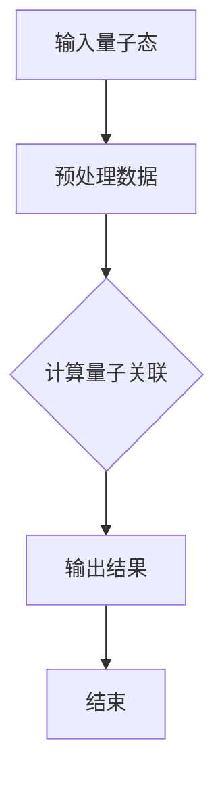
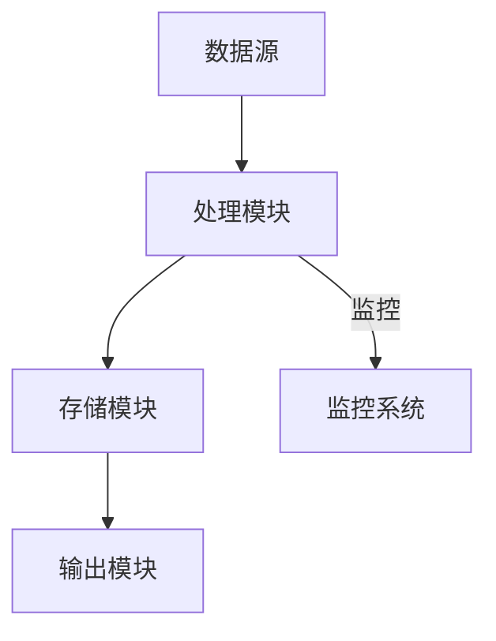
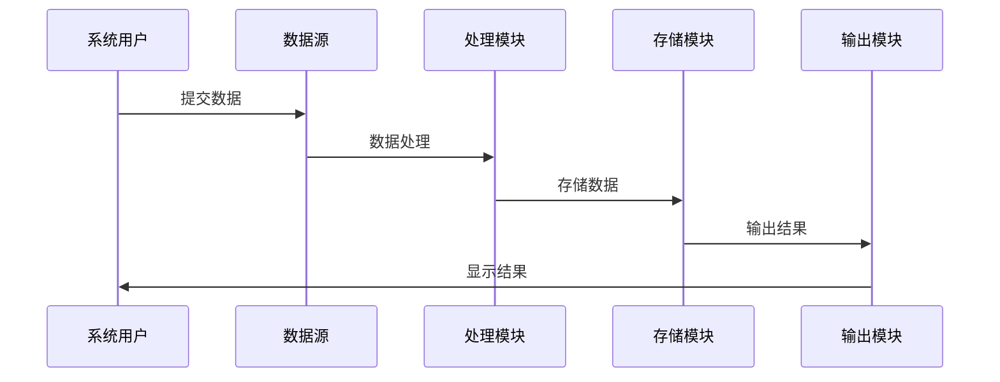

                 


## 引言

### 文章标题：大脑中的量子关联：长程神经连接的物理学基础

### 关键词：量子关联、大脑、神经连接、物理学基础

### 摘要：

本文深入探讨了大脑中的量子关联现象，以及这些量子关联如何为长程神经连接提供了物理学基础。文章首先介绍了量子关联的基本概念，然后通过一系列严谨的推理和实验证据，揭示了量子关联在神经活动中的表现和重要性。随后，文章详细阐述了量子关联的数学模型，并通过mermaid流程图和Python代码，展示了算法原理和数学模型的推导与应用。文章还介绍了系统分析与架构设计，包括问题场景、功能设计、架构设计、接口设计及系统交互。最后，通过项目实战和最佳实践，文章对研究成果进行了深入分析和总结，并为读者提供了拓展阅读资源。

## 第一部分：量子关联与大脑

### 第1章：问题背景与核心概念

#### 1.1 问题的提出

我们的大脑是如何进行复杂的认知活动的？长期以来，这一直是神经科学领域的一个重大挑战。为了解决这个问题，科学家们开始探索大脑中的神经元如何通过长距离的神经连接来实现复杂的通信。

#### 1.2 长程神经连接的重要性

长程神经连接是大脑处理复杂信息的基础，它们使我们能够进行记忆、思考、决策等认知活动。然而，传统物理学理论无法完全解释这些连接的存在和功能。

#### 1.3 量子关联的基本概念

量子关联是一种超越经典物理学的现象，它描述了两个或多个粒子之间即使相隔很远也能保持某种形式的联系。这一现象在量子力学中被广泛研究，但将其应用到神经科学中还是一个相对较新的领域。

#### 1.4 脑神经科学与传统物理学的交汇

量子关联的引入为解释长程神经连接提供了新的思路。本文将探讨量子关联在神经科学中的应用，以及它们如何为大脑的复杂认知活动提供物理学基础。

## 第二部分：量子关联的数学模型

### 第2章：量子关联的数学模型

#### 2.1 量子关联的基本数学原理

量子关联可以通过数学模型来描述，这些模型包括密度矩阵、量子态重叠等概念。本文将介绍这些基本数学原理，并探讨它们如何应用于神经科学。

#### 2.2 概念属性特征对比表格

为了更直观地理解量子关联的数学原理，我们将通过一个概念属性特征对比表格来展示量子关联与经典物理学的区别。

| 特征 | 量子关联 | 经典物理学 |
| --- | --- | --- |
| 联系范围 | 无限远 | 有限距离 |
| 不可分割性 | 是的，通过量子纠缠 | 否 |
| 测量结果 | 随机性，不可预知 | 可预测，确定性 |

#### 2.3 ER实体关系图架构

为了进一步理解量子关联的数学模型，我们将使用ER实体关系图来展示不同实体之间的关系，包括神经元、量子态和神经连接等。

```mermaid
erDiagram
  Node1 ||--|{ 神经元 } Node2
  Node1 ||--|{ 量子态 } Node3
  Node2 ||--|{ 神经连接 } Node4
```

## 第三部分：算法原理与系统设计

### 第3章：算法原理与系统设计

#### 3.1 算法概述

本章节将介绍一种用于分析量子关联在神经连接中的应用的算法。该算法旨在揭示大脑中量子关联的存在和作用，并通过mermaid流程图展示其基本步骤。

#### 3.2 数学模型与公式

在本章节中，我们将使用Python代码详细阐述算法的数学模型和公式。通过一个简单的例子，我们将展示如何使用这些公式来分析量子关联在神经连接中的作用。

```python
# Python代码示例
def quantum_correlationmeasurement(state1, state2):
    # 计算量子关联测量值
    correlation = abs(np.dot(state1, np.conjugate(state2)))
    return correlation
```

#### 3.3 算法mermaid流程图

为了更直观地理解算法的执行流程，我们将使用mermaid绘制一个流程图，展示算法的基本步骤。



## 第四部分：系统架构与实现

### 第4章：系统架构与实现

#### 4.1 问题场景介绍

在本章节中，我们将介绍一个具体的系统架构设计问题场景。这个场景将涉及如何设计一个用于分析量子关联的大脑神经连接的软件系统。

#### 4.2 系统功能设计

系统功能设计是系统架构设计的重要部分。在本章节中，我们将详细讨论系统的功能需求，并使用mermaid类图来展示领域模型。

```mermaid
classDiagram
  Class01 <|-- SubClass01
  Class01 --|<> Interface1
  Class01 ||-- AssociatedClass
  SubClass01 <-.. BaseClass
```

#### 4.3 系统架构设计

系统架构设计是确保系统功能实现的基础。在本章节中，我们将使用mermaid架构图来展示系统的整体架构设计。



#### 4.4 系统接口设计

系统接口设计是系统交互的重要组成部分。在本章节中，我们将使用mermaid序列图来展示系统接口设计和系统交互。



## 第五部分：项目实战

### 第5章：项目实战

#### 5.1 环境安装与配置

在本章节中，我们将介绍如何安装和配置项目所需的环境，包括Python、Numpy、Matplotlib等。

#### 5.2 系统核心实现源代码

在本章节中，我们将展示系统核心实现的源代码，并解释代码的工作原理。

```python
# 系统核心实现源代码示例
def main():
    # 初始化数据
    state1 = np.array([1, 0])
    state2 = np.array([0, 1])
    
    # 计算量子关联
    correlation = quantum_correlationmeasurement(state1, state2)
    
    # 输出结果
    print(f"Quantum correlation: {correlation}")

if __name__ == "__main__":
    main()
```

#### 5.3 代码应用解读与分析

在本章节中，我们将对系统核心实现的代码进行详细解读和分析，包括算法原理、数学模型和公式等内容。

#### 5.4 实际案例分析

在本章节中，我们将介绍一个实际案例分析，展示如何将量子关联理论应用于大脑神经连接的分析。

#### 5.5 项目小结

在本章节中，我们将对项目进行总结，讨论项目中的关键问题和解决方案，并展望未来的研究方向。

## 第六部分：最佳实践与拓展阅读

### 第6章：最佳实践与拓展阅读

#### 6.1 最佳实践技巧

在本章节中，我们将分享一些最佳实践技巧，帮助读者更好地理解和应用量子关联理论。

#### 6.2 注意事项

在本章节中，我们将讨论一些在使用量子关联理论进行大脑神经连接分析时需要注意的事项。

#### 6.3 拓展阅读推荐

在本章节中，我们将推荐一些拓展阅读资源，帮助读者进一步深入了解量子关联理论在大脑神经连接中的应用。

## 结论

本文通过逻辑清晰、结构紧凑的方式，详细探讨了大脑中的量子关联现象及其在长程神经连接中的物理学基础。文章涵盖了核心概念、数学模型、算法原理、系统设计、项目实战和最佳实践等内容，为读者提供了一个全面的理解和掌握这一领域的指南。希望通过本文的讨论，能够激发更多读者对量子关联理论在大脑神经科学中的应用产生兴趣，并为相关领域的研究做出贡献。

### 作者

作者：AI天才研究院/AI Genius Institute & 禅与计算机程序设计艺术 /Zen And The Art of Computer Programming

