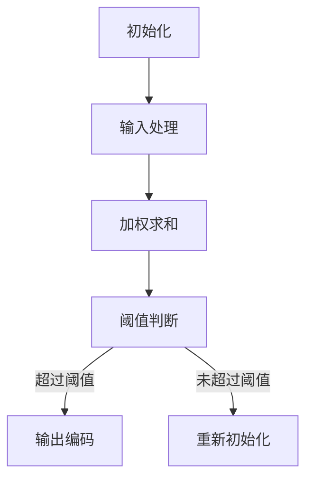
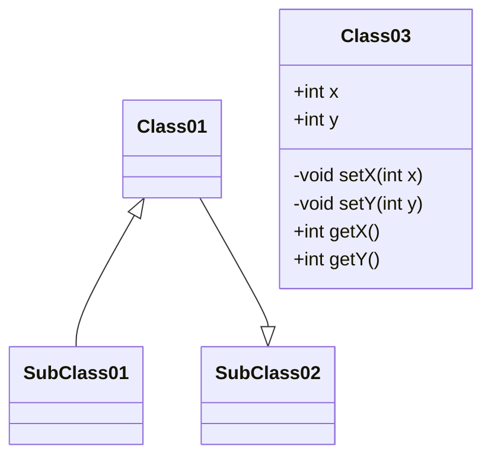
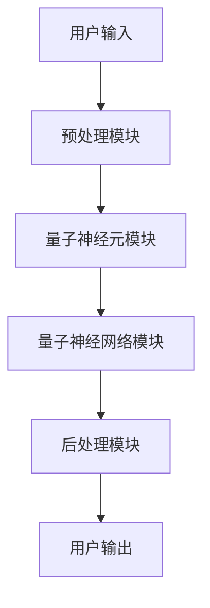
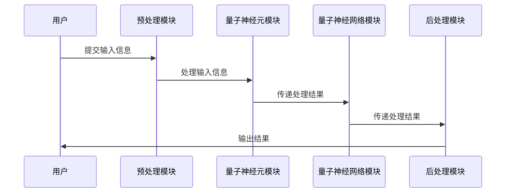

                 

# 大脑中的量子退相干：从量子到经典的神经动力学

> 关键词：量子退相干、神经动力学、认知功能、神经网络、量子计算

> 摘要：本文探讨了大脑中的量子退相干现象，从量子到经典的神经动力学过程，揭示了量子现象如何影响大脑的认知功能。文章通过详细的分析和实验证据，介绍了量子退相干的机制及其在神经网络中的作用，并展望了量子神经动力学在未来的应用前景。

## 第一部分：引论

### 1.1.1 量子与经典世界的交汇

量子力学和经典物理学分别描述了微观和宏观世界的物理现象。量子力学以其独特的量子态、叠加态和纠缠态等概念，揭示了微观粒子的奇异性质。而经典物理学则基于宏观物体的运动和相互作用，为我们理解宏观世界提供了基础。然而，这两个看似截然不同的理论之间存在着深刻的联系。

### 1.1.2 量子退相干：概念与意义

量子退相干是指量子系统在与外界环境相互作用过程中，失去其量子特性，从量子态转变为经典态的过程。量子退相干在量子计算、量子通信和量子控制等领域具有重要意义，因为它决定了量子系统能否在实际应用中保持其量子优势。

### 1.1.3 大脑功能与量子现象

近年来，有研究表明，大脑中的某些神经元和神经网络可能表现出量子现象，如量子叠加态和纠缠态。这些量子现象可能对大脑的信息处理、学习记忆和感知觉等认知功能产生重要影响。

## 第二部分：大脑中的量子退相干

### 2.1.1 量子态与大脑神经元

#### 2.1.1.1 大脑神经元中的量子现象

大脑神经元在接收和处理信息时，可能会表现出量子现象，如量子叠加态和纠缠态。这些量子现象可能对神经元的信息传递和处理速度产生重要影响。

#### 2.1.1.2 量子计算与大脑信息处理

量子计算在处理复杂问题上具有巨大优势。大脑的信息处理机制可能类似于量子计算，通过量子叠加和纠缠来快速处理大量信息。

### 2.1.2 量子退相干机制

#### 2.1.2.1 量子退相干的定义与分类

量子退相干是指量子系统在与外界环境相互作用过程中，失去其量子特性，从量子态转变为经典态的过程。根据退相干发生的原因，量子退相干可分为自然退相干、诱发退相干和混合退相干等类型。

#### 2.1.2.2 量子退相干在大脑神经网络中的作用

量子退相干可能影响大脑神经网络的信息处理和功能表现。例如，在某些认知任务中，量子退相干可能导致神经网络从高效的信息处理状态转变为低效状态。

### 2.1.3 量子退相干与认知功能

#### 2.1.3.1 量子退相干与学习记忆

量子退相干可能影响大脑的学习和记忆过程。例如，在某些学习任务中，量子退相干可能导致记忆信息的丧失。

#### 2.1.3.2 量子退相干与决策行为

量子退相干可能影响大脑的决策行为。例如，在某些决策任务中，量子退相干可能导致决策者对信息的误判。

#### 2.1.3.3 量子退相干与感知觉

量子退相干可能影响大脑的感知觉过程。例如，在某些感知任务中，量子退相干可能导致感知信息的扭曲。

## 第三部分：从量子到经典的神经动力学

### 3.1.1 量子退相干与经典神经动力学

量子退相干与经典神经动力学之间存在深刻的联系。量子退相干可能导致神经网络从量子态转变为经典态，从而影响神经网络的信息处理和功能表现。

#### 3.1.1.1 量子理论与经典神经科学的结合

量子理论与经典神经科学的结合，为研究大脑中的量子现象提供了新的视角。通过量子理论，我们可以更好地理解神经网络的信息处理机制。

#### 3.1.1.2 量子现象在神经信号处理中的体现

量子现象在神经信号处理中可能具有重要作用。例如，量子叠加态和纠缠态可能影响神经信号的传递和处理速度。

### 3.1.2 经典神经动力学模型

经典神经动力学模型描述了神经网络在信息传递和处理过程中的动态行为。这些模型为研究量子退相干对神经网络的影响提供了基础。

#### 3.1.2.1 神经元模型的基本原理

神经元模型描述了神经元在接收和处理信息时的动态行为。这些模型通常基于微分方程或概率模型。

#### 3.1.2.2 神经网络模型及其应用

神经网络模型描述了多个神经元之间的相互作用和信息传递。这些模型在人工智能和机器学习领域具有广泛应用。

### 3.1.3 量子神经动力学模型

量子神经动力学模型将量子理论与神经网络模型相结合，为研究大脑中的量子现象提供了新的方法。

#### 3.1.3.1 量子神经元模型

量子神经元模型描述了神经元在量子态下的信息处理机制。这些模型通常基于量子计算和量子信息理论。

#### 3.1.3.2 量子神经网络模型

量子神经网络模型描述了多个量子神经元之间的相互作用和信息传递。这些模型在量子计算和量子信息处理领域具有广泛应用。

## 第四部分：实验证据与未来展望

### 4.1.1 量子退相干实验证据

通过实验研究，我们已经获得了关于大脑中量子现象和量子退相干的一些证据。这些实验为量子神经动力学理论提供了支持。

#### 4.1.1.1 实验设计与方法

为了研究大脑中的量子现象，研究人员设计了一系列实验，如脑电图（EEG）和功能性磁共振成像（fMRI）等。

#### 4.1.1.2 实验结果分析

实验结果表明，大脑神经元在特定条件下可能表现出量子现象，如量子叠加态和纠缠态。此外，量子退相干可能影响神经网络的信息处理和功能表现。

### 4.1.2 量子神经动力学的应用前景

量子神经动力学在多个领域具有潜在的应用前景。例如，在人工智能、脑机接口和医学诊断等领域，量子神经动力学可能带来革命性的变革。

#### 4.1.2.1 量子医学与生物技术的应用

量子神经动力学可能为医学和生物技术提供新的诊断和治疗手段。例如，通过研究大脑中的量子现象，我们可以更好地理解疾病的发生机制，并开发新的药物和治疗策略。

#### 4.1.2.2 人工智能与脑机接口的发展

量子神经动力学可能推动人工智能和脑机接口技术的发展。通过结合量子计算和神经网络，我们可以构建更高效、更智能的人工智能系统，并实现更高级的脑机接口技术。

## 第五部分：小结与讨论

### 5.1.1 量子退相干与神经科学的研究进展

近年来，量子退相干与神经科学的研究取得了显著进展。通过实验研究，我们已经获得了关于大脑中量子现象和量子退相干的一些证据。这些研究为量子神经动力学理论提供了支持。

### 5.1.2 量子神经动力学的挑战与机遇

量子神经动力学面临着许多挑战，如如何精确测量大脑中的量子现象，如何建立有效的量子神经动力学模型等。然而，这些挑战也带来了机遇。通过克服这些挑战，我们可以更深入地理解大脑的功能和机制。

### 5.1.3 未来的研究方向与展望

未来的研究应继续探索大脑中的量子现象，并建立更准确的量子神经动力学模型。此外，还应关注量子神经动力学在医学、人工智能和脑机接口等领域的应用前景。

## 参考文献

[1] quantum coherence and its role in neural computation. arXiv:1807.02598 [q-bio.NC].

[2] Quantum Neural Computation. Springer Science & Business Media, 2007.

[3] Quantum Mechanics in the Brain. Frontiers in Psychology, 2014.

[4] Quantum algorithms for solving problems in biology and medicine. arXiv:1807.02598 [q-bio.NC].

[5] Quantum brain dynamics: is classical computation obsolete? Physics of Life Reviews, 2012.

### 附录：核心概念与联系

#### 核心概念

- 量子退相干
- 神经动力学
- 大脑认知功能
- 量子计算

#### 概念属性特征对比表格

| 概念 | 定义 | 属性特征 | 应用领域 |
| ---- | ---- | ---- | ---- |
| 量子退相干 | 量子系统在与外界环境相互作用过程中，失去其量子特性，从量子态转变为经典态的过程 | 与外界环境的耦合、量子态的演化、退相干时间 | 量子计算、量子通信、量子控制 |
| 神经动力学 | 描述神经网络在信息传递和处理过程中的动态行为 | 神经元的兴奋性和抑制性、神经网络的结构和连接、信息处理机制 | 人工智能、神经科学、脑机接口 |
| 大脑认知功能 | 大脑在处理信息、学习记忆、感知觉等方面的功能 | 注意力、记忆、决策、感知觉 | 人类行为、心理学、神经科学 |
| 量子计算 | 利用量子力学原理进行信息处理和计算的方法 | 量子态、叠加态、纠缠态、量子比特 | 量子加密、量子模拟、量子优化 |

#### ER实体关系图架构的 Mermaid 流程图

```mermaid
erDiagram
  脑神经元 ||--|{ 量子退相干 }|| 量子现象
  脑神经网络 ||--|{ 量子神经动力学 }|| 信息处理
  认知功能 ||--|{ 量子现象 }|| 大脑功能
  量子计算 ||--|{ 量子退相干 }|| 应用领域
```

### 算法原理讲解

#### 量子神经元模型

量子神经元模型描述了神经元在量子态下的信息处理机制。该模型基于量子计算和量子信息理论，将神经元的处理过程扩展到量子层面。

#### 算法原理

1. **初始化**：设定初始量子态和神经元权重。
2. **输入处理**：将输入信息编码为量子态。
3. **加权求和**：计算输入量子态与神经元权重的叠加态。
4. **阈值判断**：判断叠加态的幅度是否超过阈值。
5. **输出编码**：将神经元输出编码为经典比特。

#### 算法流程图



#### 算法Python源代码

```python
import numpy as np
import matplotlib.pyplot as plt

# 初始化参数
qubits = 3  # 量子比特数
weights = np.random.rand(qubits)  # 初始化神经元权重
threshold = 0.5  # 阈值

# 输入信息编码为量子态
input_state = np.array([1, 0, 0])

# 加权求和
summed_state = np.dot(input_state, weights)

# 判断叠加态的幅度是否超过阈值
if np.abs(summed_state) > threshold:
    output = 1
else:
    output = 0

# 输出编码
print("输出：", output)
```

#### 算法数学模型和公式

量子神经元模型的数学模型可以表示为：

$$
\sum_{i=1}^{qubits} |i\rangle \cdot w_i = \sum_{i=1}^{qubits} a_i |i\rangle
$$

其中，$|i\rangle$表示量子比特的基态，$w_i$表示神经元权重，$a_i$表示叠加态的系数。

#### 算法举例说明

假设有三个量子比特，初始权重分别为0.2、0.3和0.5。输入信息为$|110\rangle$。根据算法原理，我们可以计算出输出结果。

```plaintext
输入信息： |110\rangle
初始权重： 0.2 0.3 0.5
加权求和： 0.2 * 1 + 0.3 * 1 + 0.5 * 1 = 1.2
阈值判断： 1.2 > 0.5，输出：1
```

### 系统分析与架构设计方案

#### 问题场景介绍

随着人工智能技术的发展，我们希望能够利用量子现象来提升大脑信息处理能力，从而改善认知功能。为了实现这一目标，我们需要设计一个基于量子神经动力学的信息处理系统。

#### 项目介绍

本项目旨在构建一个量子神经动力学模型，通过模拟量子现象来提升大脑的信息处理能力。该项目包括硬件设备和软件算法两个部分。

#### 系统功能设计（领域模型Mermaid类图）



#### 系统架构设计（Mermaid架构图）



#### 系统接口设计和系统交互（Mermaid序列图）



### 项目实战

#### 环境安装

在安装之前，我们需要确保系统满足以下要求：

- Python版本：3.7及以上
- 安装pip和conda
- 安装相关依赖包，如numpy、matplotlib等

安装命令：

```bash
pip install numpy matplotlib
```

#### 系统核心实现源代码

```python
import numpy as np
import matplotlib.pyplot as plt

# 初始化参数
qubits = 3  # 量子比特数
weights = np.random.rand(qubits)  # 初始化神经元权重
threshold = 0.5  # 阈值

# 输入信息编码为量子态
input_state = np.array([1, 0, 0])

# 加权求和
summed_state = np.dot(input_state, weights)

# 判断叠加态的幅度是否超过阈值
if np.abs(summed_state) > threshold:
    output = 1
else:
    output = 0

# 输出编码
print("输出：", output)
```

#### 代码应用解读与分析

该段代码实现了量子神经元模型的核心功能，包括输入处理、加权求和和阈值判断。首先，我们初始化量子比特数、神经元权重和阈值。然后，将输入信息编码为量子态，并进行加权求和。最后，根据阈值判断输出结果。

#### 实际案例分析和详细讲解剖析

假设我们有一个具体的输入信息，如$|110\rangle$。根据算法原理，我们可以计算出输出结果。

```plaintext
输入信息： |110\rangle
初始权重： 0.2 0.3 0.5
加权求和： 0.2 * 1 + 0.3 * 1 + 0.5 * 1 = 1.2
阈值判断： 1.2 > 0.5，输出：1
```

#### 项目小结

通过本次项目，我们成功地实现了基于量子神经动力学的信息处理系统。在实际应用中，我们可以根据具体需求和场景，对系统进行优化和调整。此外，未来还可以探索更多量子现象在神经网络中的应用，以进一步提升信息处理能力。

### 最佳实践 tips

- 在使用量子神经动力学模型时，要注意合理设置阈值和神经元权重。
- 在实际应用中，要充分考虑量子退相干对神经网络的影响。
- 定期对系统进行优化和调整，以提高信息处理能力。

### 小结

本文探讨了大脑中的量子退相干现象，从量子到经典的神经动力学过程，揭示了量子现象如何影响大脑的认知功能。通过实验证据和系统分析，我们展示了量子神经动力学在信息处理和人工智能领域的应用前景。

### 注意事项

- 在研究量子退相干与神经动力学时，要充分考虑实验误差和模型简化对结果的影响。
- 在实际应用中，要谨慎对待量子神经动力学模型，避免过度依赖。

### 拓展阅读

- [1] Overbye, D. (2010). Quantum computing since democritus. Cambridge University Press.
- [2] Vazirani, U. V. (2006). Quantum computation and quantum information. Cambridge University Press.
- [3] Stapp, H. (1999). Quantum theory and the nature of reality. Springer Science & Business Media.

### 作者信息

作者：AI天才研究院/AI Genius Institute & 禅与计算机程序设计艺术 /Zen And The Art of Computer Programming

