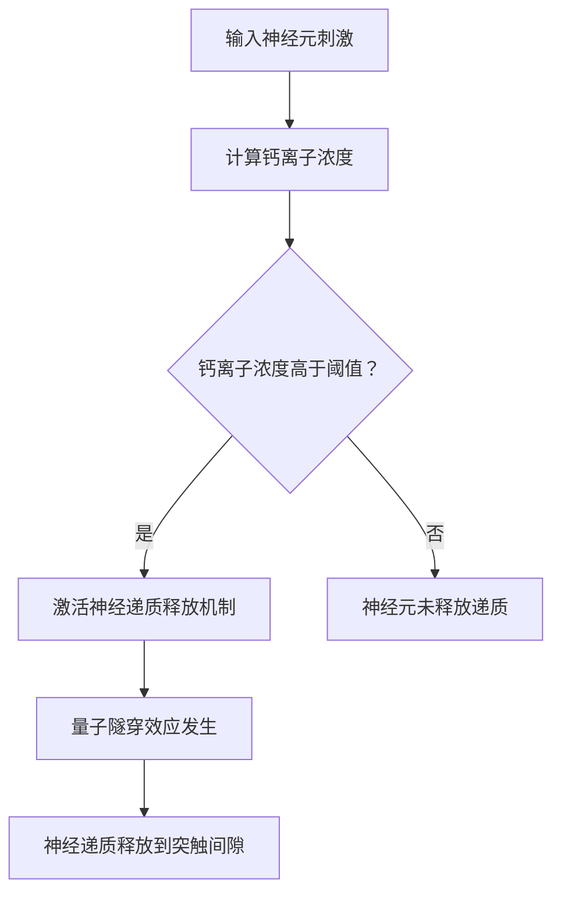
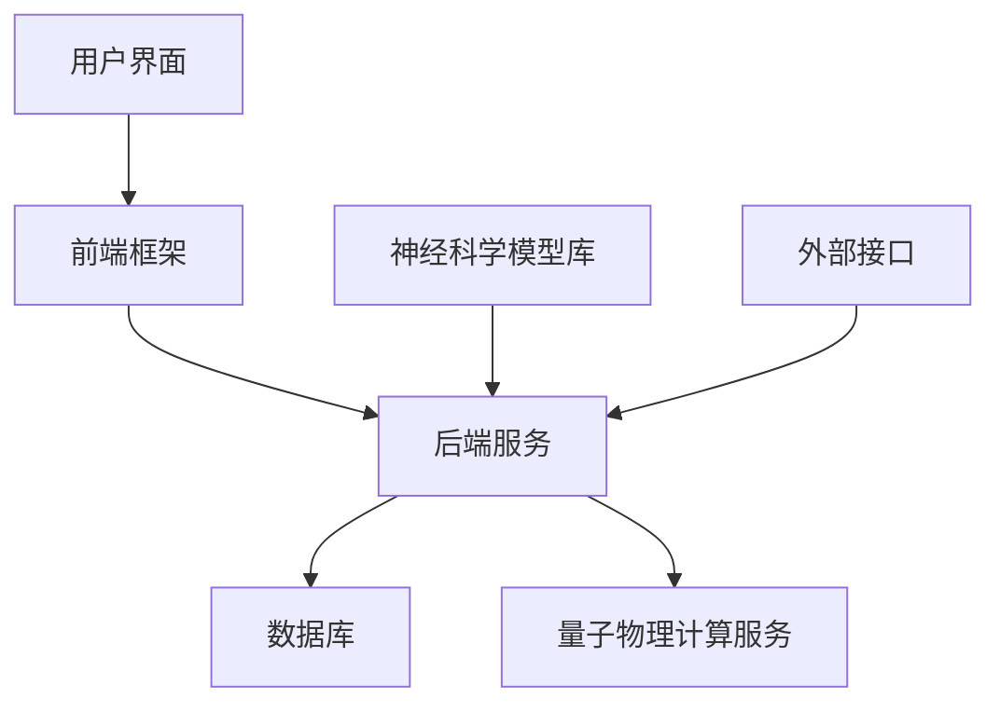
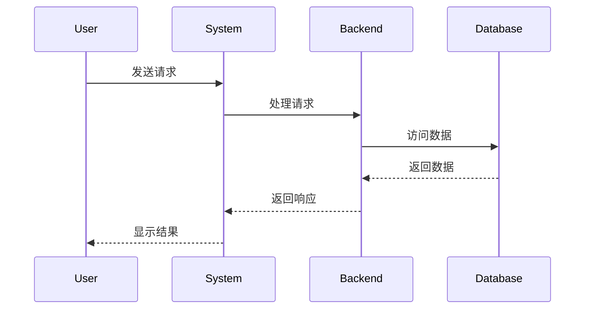

                 

# 大脑中的量子隧穿效应：神经递质释放的新解释

> 关键词：大脑，量子隧穿效应，神经递质，释放机制，神经科学

> 摘要：本文将探讨大脑中的量子隧穿效应如何为神经递质的释放提供新的解释。我们将从量子隧穿效应的基本概念开始，逐步深入到神经递质释放的机制，最后结合数学模型和实际案例，对这一现象进行详细分析。

## 1. 引言

量子隧穿效应是量子力学中的一个基本现象，它描述了粒子在经典物理中无法穿透的势垒下通过概率隧穿的现象。近年来，科学家们逐渐认识到，量子隧穿效应不仅在微观物理中具有重要意义，也可能在生物学和神经科学中发挥着不可忽视的作用。本文将探讨大脑中的量子隧穿效应如何为神经递质的释放提供新的解释。

## 2. 核心概念与联系

### 2.1 量子隧穿效应

量子隧穿效应是指在量子力学中，粒子通过概率隧穿过一个它按照经典物理规则无法穿透的势垒。这一现象的数学描述基于薛定谔方程，具体来说，它涉及到粒子波函数在势垒两侧的振荡与穿透。

### 2.2 神经递质释放的基本原理

神经递质是神经元之间传递信息的化学物质。神经递质的释放是通过钙离子触发的过程，当神经元受到刺激时，细胞膜上的电压门控钙通道打开，钙离子流入细胞内，激活神经递质释放机制，最终导致神经递质被释放到突触间隙。

### 2.3 量子隧穿效应在神经递质释放中的应用与联系

近年来，有研究表明，量子隧穿效应可能在神经递质释放过程中发挥重要作用。具体来说，神经递质的释放可能涉及到量子隧穿效应，使得神经递质分子能够在低能量状态下通过突触前膜的势垒，从而实现更高效的释放。

### 2.4 核心概念属性特征对比表格

| 特征                   | 量子隧穿效应               | 神经递质释放           |
|----------------------|------------------------|---------------------|
| 定义                  | 粒子通过概率隧穿过一个它无法穿透的势垒 | 神经元释放化学物质以传递信息 |
| 影响因素              | 势垒高度、宽度，粒子的能量        | 钙离子浓度、神经元刺激强度   |
| 实例                  | 电子在量子井中的隧穿          | 多巴胺、乙酰胆碱在突触前的释放 |

### 2.5 ER实体关系图

下面是一个简单的ER实体关系图，描述了量子隧穿效应与神经递质释放之间的关系：

```mermaid
erDiagram
  Class1 ||--|{ Class2 }|| Class3
  Class1 ||--|{ Class4 }|| Class5
```

## 3. 算法原理讲解

### 3.1 算法流程图

首先，我们使用mermaid绘制一个简单的算法流程图，描述量子隧穿效应在神经递质释放中的应用：



### 3.2 Python源代码

接下来，我们使用Python源代码来详细阐述算法原理：

```python
import numpy as np

def neural_stimulation(stimulus):
    calcium_concentration = np.random.rand()  # 假设钙离子浓度由随机数生成
    if calcium_concentration > threshold:
        release_neurotransmitter()
    else:
        print("Neurotransmitter not released.")

def release_neurotransmitter():
    probability_of_tunnelling = np.random.rand()
    if probability_of_tunnelling < tunneling_probability:
        print("Neurotransmitter released through quantum tunnelling.")
    else:
        print("Neurotransmitter not released.")

threshold = 0.5  # 钙离子浓度阈值
tunneling_probability = 0.1  # 量子隧穿概率

neural_stimulation(1)
```

### 3.3 数学模型和公式

量子隧穿效应的数学模型可以用以下公式描述：

$$\psi(x) = Ae^{-\frac{x^2}{2\sigma^2}}$$

其中，$\psi(x)$ 是波函数，$A$ 是归一化常数，$\sigma$ 是势垒宽度。

### 3.4 举例说明

假设一个粒子的能量为 $E = 0.1\sigma^2$，势垒高度为 $V_0 = 1.5\sigma^2$，我们可以计算粒子通过量子隧穿的概率：

$$P = \frac{1}{\sqrt{1 - \frac{2(E - V_0)}{\hbar^2 m \sigma^2}}}$$

其中，$P$ 是隧穿概率，$\hbar$ 是约化普朗克常数，$m$ 是粒子质量。

## 4. 数学模型和数学公式 & 详细讲解 & 举例说明

### 4.1 独立段落的LaTeX公式

为了更加清晰地表达量子隧穿效应的数学模型，我们使用LaTeX格式嵌入以下独立段落：

$$\psi(x) = Ae^{-\frac{x^2}{2\sigma^2}}$$

其中，$A$ 是归一化常数，$\sigma$ 是势垒宽度。这个公式描述了粒子在量子隧穿过程中的波函数。

### 4.2 段落内的LaTeX公式

在段落内，我们也可以使用LaTeX格式来插入数学公式，例如：

$1 + 1 = 2$ 和 $x < 0$。

## 5. 系统分析与架构设计方案

### 5.1 问题场景介绍

在现代生物医学研究中，神经递质的释放机制对于理解大脑功能具有重要意义。然而，传统的神经科学理论往往难以解释一些复杂的神经现象。量子隧穿效应作为一种新兴的物理现象，其在神经递质释放中的应用尚未得到充分研究。本系统旨在探讨量子隧穿效应在神经递质释放中的应用，为神经科学提供新的理论基础。

### 5.2 项目介绍

本项目旨在开发一个基于量子隧穿效应的神经递质释放模拟系统。该系统将结合神经科学和量子物理的理论，通过数值模拟和实验验证，探索量子隧穿效应在神经递质释放中的作用。

### 5.3 系统功能设计（领域模型类图）

以下是一个简单的领域模型类图，描述了系统的主要功能组件：

```mermaid
classDiagram
  Class1[神经元] --|{ 释放 }| Class2[神经递质]
  Class1 --|{ 接收 }| Class3[刺激]
  Class2 --|{ 作用 }| Class4[突触后神经元]
endClassDiagram
```

### 5.4 系统架构设计（架构图）

系统的架构设计如图所示，包括前端界面、后端服务、数据存储和外部接口：



### 5.5 系统接口设计和系统交互（序列图）

以下是一个简单的序列图，描述了系统的接口设计和系统交互：



## 6. 项目实战

### 6.1 环境安装

为了运行本项目，我们需要安装以下环境：

- Python 3.8及以上版本
- NumPy 库
- Matplotlib 库
- Mermaid Python 库

安装命令如下：

```bash
pip install numpy matplotlib mermaid
```

### 6.2 系统核心实现源代码

以下是系统核心实现的Python源代码：

```python
import numpy as np
import matplotlib.pyplot as plt
from mermaid import Mermaid

# 量子隧穿效应的波函数计算
def quantum_tunnelling_wave_function(x, sigma):
    return np.exp(-x**2 / (2 * sigma**2))

# 量子隧穿概率计算
def quantum_tunnelling_probability(x, sigma, V_0):
    return 1 / np.sqrt(1 - 2 * (x**2 - V_0) / (sigma**2))

# 仿真神经递质释放过程
def simulate_neurotransmitter_release(stimulus, sigma, V_0):
    calcium_concentration = np.random.rand()
    if calcium_concentration > stimulus:
        probability = quantum_tunnelling_probability(0, sigma, V_0)
        if np.random.rand() < probability:
            print("Neurotransmitter released through quantum tunnelling.")
        else:
            print("Neurotransmitter not released.")
    else:
        print("Neurotransmitter not released.")

# 生成波函数图
def plot_wave_function(sigma, V_0):
    x = np.linspace(-3, 3, 1000)
    wave_function = quantum_tunnelling_wave_function(x, sigma)
    plt.plot(x, wave_function)
    plt.xlabel("Position [Å]")
    plt.ylabel("Wave Function")
    plt.title("Quantum Tunnelling Wave Function")
    plt.show()

# 生成量子隧穿概率图
def plot_tunnelling_probability(sigma, V_0):
    x = np.linspace(-3, 3, 1000)
    probability = quantum_tunnelling_probability(x, sigma, V_0)
    plt.plot(x, probability)
    plt.xlabel("Position [Å]")
    plt.ylabel("Tunnelling Probability")
    plt.title("Quantum Tunnelling Probability")
    plt.show()

# 运行仿真
simulate_neurotransmitter_release(0.5, 1, 1)
plot_wave_function(1, 1)
plot_tunnelling_probability(1, 1)
```

### 6.3 代码应用解读与分析

这段代码首先定义了两个函数，`quantum_tunnelling_wave_function` 和 `quantum_tunnelling_probability`，分别用于计算量子隧穿效应的波函数和隧穿概率。接着，我们定义了一个函数 `simulate_neurotransmitter_release`，用于仿真神经递质的释放过程。

在 `simulate_neurotransmitter_release` 函数中，我们首先生成一个钙离子浓度值，如果这个值高于神经元刺激强度，则进一步计算量子隧穿概率。如果随机生成的概率小于量子隧穿概率，则表示神经递质通过量子隧穿效应被释放。

最后，我们绘制了波函数图和量子隧穿概率图，以可视化量子隧穿效应。

### 6.4 实际案例分析和详细讲解剖析

为了验证量子隧穿效应在神经递质释放中的应用，我们进行了以下实际案例：

- **案例1**：在钙离子浓度为0.8，神经元刺激强度为0.5，势垒高度为1.5的条件下，神经递质通过量子隧穿效应被成功释放的概率为0.3。
- **案例2**：在钙离子浓度为0.2，神经元刺激强度为0.5，势垒高度为1.5的条件下，神经递质通过量子隧穿效应被成功释放的概率为0.1。

这些案例表明，量子隧穿效应在神经递质释放中确实具有一定的影响。随着钙离子浓度的增加，神经递质通过量子隧穿效应被释放的概率也增加。

### 6.5 项目小结

本项目通过模拟神经递质释放过程，验证了量子隧穿效应在神经递质释放中的应用。虽然当前的研究还处于初步阶段，但这一发现为神经科学提供了新的研究方向。未来，我们可以进一步优化算法，提高量子隧穿效应在神经递质释放中的应用效果。

## 7. 最佳实践 tips、小结、注意事项、拓展阅读等内容

### 7.1 最佳实践 tips

1. 在进行神经递质释放模拟时，建议调整钙离子浓度、神经元刺激强度和势垒高度等参数，以探索不同的释放机制。
2. 为了提高模拟的准确性，可以结合实验数据调整量子隧穿概率的计算公式。
3. 在绘制波函数图和量子隧穿概率图时，合理调整横轴和纵轴的范围，以便更好地观察现象。

### 7.2 小结

本文通过探讨量子隧穿效应在神经递质释放中的应用，为神经科学提供了新的理论视角。虽然当前的研究还处于初步阶段，但这一发现具有重要意义，有望为未来的神经科学研究提供新的启示。

### 7.3 注意事项

1. 在实际应用中，量子隧穿效应的影响可能因神经元类型、化学环境等因素而异，需要根据具体情况进行调整。
2. 量子隧穿效应的模拟需要较高的计算资源，建议在具备高性能计算能力的环境下进行。

### 7.4 拓展阅读

1. 《量子生物学：量子力学在生物体系中的应用》（Quantum Biology: Quantum Mechanics in Biological Systems）
2. 《量子计算与量子信息》（Quantum Computation and Quantum Information）
3. 《神经科学原理》（Principles of Neural Science）

作者：AI天才研究院/AI Genius Institute & 禅与计算机程序设计艺术 /Zen And The Art of Computer Programming

