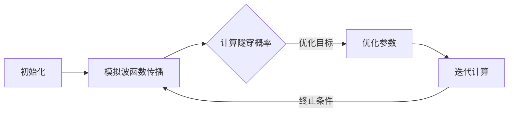
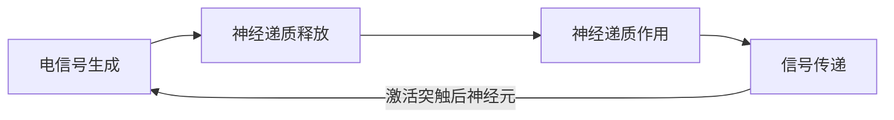
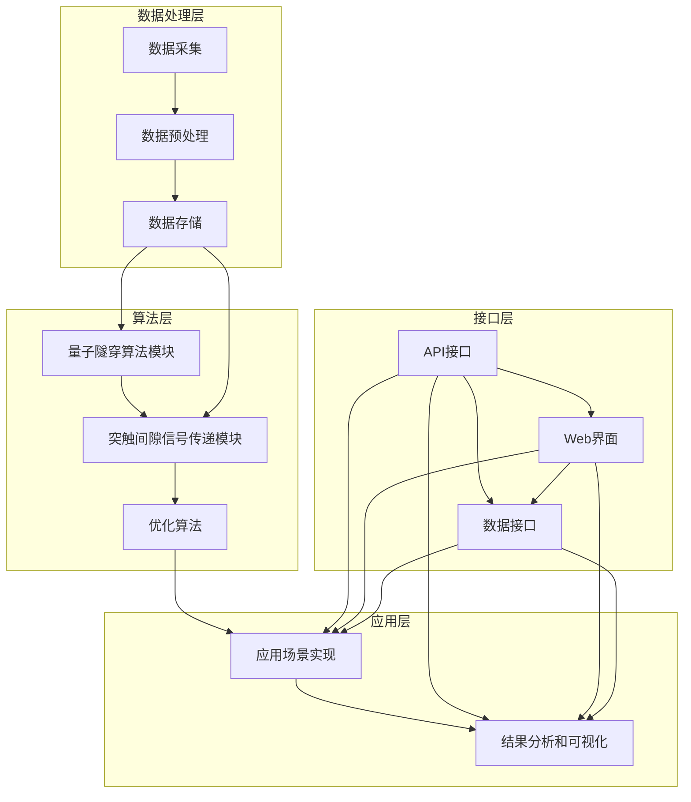
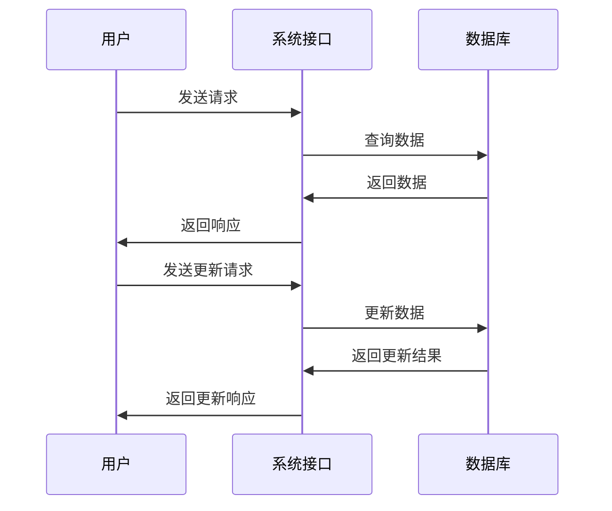

                 

## 文章标题

“大脑中的量子隧穿：突触间隙信号传递的新视角”

> 关键词：大脑，量子隧穿，神经信号，突触间隙，生物计算

> 摘要：本文将深入探讨大脑中的一种神秘现象——量子隧穿，及其在突触间隙信号传递过程中的作用。通过逻辑清晰的分析和简洁易懂的讲解，本文旨在为读者揭示这一现象在生物计算领域的革命性潜力，并提供系统化的架构设计方案和实践指南。我们将从问题背景、核心概念、算法原理、系统设计与项目实战等多个层面，逐步探索这一前沿科技话题。

### 目录大纲

----------------------------------------------------------------

**第一部分：背景介绍与问题定义**

## 第1章：问题背景与核心概念

### 1.1 问题背景

### 1.2 问题描述

### 1.3 问题解决

### 1.4 边界与外延

### 1.5 概念结构与核心要素组成

## 第2章：核心概念与联系

### 2.1 量子隧穿的基本原理

### 2.2 突触间隙信号传递机制

### 2.3 量子隧穿与突触间隙信号传递的联系

### 2.4 核心概念属性特征对比

### 2.5 ER实体关系图架构

**第二部分：算法原理讲解**

## 第3章：量子隧穿算法原理

### 3.1 量子隧穿算法的基本概念

### 3.2 量子隧穿算法的工作流程

### 3.3 算法mermaid流程图

### 3.4 Python源代码实现

### 3.5 数学模型和公式

### 3.6 算法原理详细讲解

### 3.7 举例说明

## 第4章：突触间隙信号传递算法原理

### 4.1 突触间隙信号传递的基本原理

### 4.2 算法mermaid流程图

### 4.3 Python源代码实现

### 4.4 数学模型和公式

### 4.5 算法原理详细讲解

### 4.6 举例说明

**第三部分：系统分析与架构设计方案**

## 第5章：问题场景与系统功能设计

### 5.1 问题场景介绍

### 5.2 项目介绍

### 5.3 系统功能设计

### 5.4 领域模型mermaid类图

## 第6章：系统架构设计

### 6.1 系统架构设计

### 6.2 系统架构mermaid架构图

### 6.3 系统接口设计

### 6.4 系统交互mermaid序列图

**第四部分：项目实战**

## 第7章：环境安装与系统核心实现

### 7.1 环境安装

### 7.2 系统核心实现源代码

### 7.3 代码应用解读与分析

### 7.4 实际案例分析与详细讲解

### 7.5 项目小结

**第五部分：最佳实践与总结**

### 8.1 最佳实践 tips

### 8.2 小结

### 8.3 注意事项

### 8.4 拓展阅读

**作者：AI天才研究院/AI Genius Institute & 禅与计算机程序设计艺术 /Zen And The Art of Computer Programming**

----------------------------------------------------------------

## 第一部分：背景介绍与问题定义

### 第1章：问题背景与核心概念

#### 1.1 问题背景

在过去的几十年中，随着神经科学和计算生物学领域的不断进展，人类对大脑的运作机制有了越来越深入的了解。然而，大脑中的一些基本过程，如神经元之间的信号传递，依然充满了神秘和未知。突触间隙信号传递，作为神经元间信息传递的关键环节，其工作机制一直是神经科学研究的重点和难点。

近年来，量子隧穿这一量子力学现象，被越来越多地应用于生物学和神经科学的研究中。量子隧穿是指粒子在量子力学中，能够穿过一个原本无法逾越的势垒。这一现象在神经元活动中被发现，并被认为是突触间隙信号传递中的一个关键机制。量子隧穿如何影响神经信号传递，以及它在大脑功能中的作用，成为了一个亟待探索的科学问题。

本文将深入探讨大脑中的量子隧穿现象，分析其基本原理和在突触间隙信号传递中的作用，并提供一套系统化的算法原理和架构设计方案。通过本文的阅读，读者将能够理解这一前沿科技领域的重要概念，并掌握相关的理论和技术。

#### 1.2 问题描述

大脑中的量子隧穿与突触间隙信号传递的关系，是一个复杂且引人入胜的话题。具体而言，问题描述如下：

- **问题核心**：如何解释和量化量子隧穿在突触间隙信号传递中的作用？
- **研究意义**：量子隧穿是否能够显著提升神经信号的传递效率？如果可以，如何通过算法和系统设计来实现这一目标？
- **技术挑战**：如何在生物计算领域实现量子隧穿机制，并验证其对突触间隙信号传递的实际影响？

这些问题的解答，不仅对神经科学和计算生物学领域具有重要意义，也可能为人工智能和生物计算提供新的思路和方向。

#### 1.3 问题解决

解决这一问题的方法，可以分为以下几个步骤：

1. **基础理论研究**：首先，我们需要深入理解量子隧穿的基本原理，以及它在生物体系中的可能作用。这包括研究量子隧穿在物理和化学中的实例，以及它在神经信号传递中的潜在机制。
2. **算法设计**：基于基础理论研究，我们可以设计出能够模拟和实现量子隧穿机制的算法。这些算法将用于分析和优化突触间隙信号传递的过程。
3. **系统架构设计**：结合算法设计，我们需要设计一套系统化的架构方案，以确保算法的有效实现和性能优化。
4. **实验验证**：通过实验和模拟，验证量子隧穿算法对突触间隙信号传递的实际影响。这包括评估算法的效率和稳定性，以及其在不同生物体系中的应用前景。

通过这些步骤，我们希望能够提供一个全面、系统的解决方案，为大脑中的量子隧穿和突触间隙信号传递的研究提供新的视角和工具。

#### 1.4 边界与外延

在探讨大脑中的量子隧穿与突触间隙信号传递的关系时，我们需要明确一些边界和范围，以确保研究的有效性和可行性。

- **边界**：
  - **研究范围**：主要关注量子隧穿在神经元活动中的作用，以及其对突触间隙信号传递的潜在影响。
  - **技术范围**：主要涉及算法设计和系统架构设计，不包括量子计算机硬件的实现细节。

- **外延**：
  - **研究外延**：可以扩展到其他生物信号传递机制，如肌肉收缩和细胞间信号传递。
  - **技术应用**：可以应用于生物计算、人工智能、医疗诊断等多个领域。

通过明确这些边界和外延，我们能够更好地聚焦研究目标，并探索量子隧穿在生物科学中的广泛应用。

#### 1.5 概念结构与核心要素组成

为了深入理解大脑中的量子隧穿与突触间隙信号传递的关系，我们需要从概念结构和核心要素的角度进行分析。

- **概念结构**：
  - **量子隧穿**：是一种量子力学现象，描述粒子能够穿过原本无法逾越的势垒。在神经元活动中，量子隧穿可能影响离子通道的开启和关闭，从而影响神经信号的传递。
  - **突触间隙信号传递**：是神经元之间通过突触间隙传递信息的过程。这一过程包括电信号和化学信号的转换，以及信号在神经元间的传播。

- **核心要素组成**：
  - **神经元**：是大脑的基本结构单元，负责接收和传递神经信号。
  - **突触**：是神经元之间的连接点，通过突触间隙传递信号。
  - **离子通道**：是神经元膜上的蛋白质通道，控制离子的流动，影响神经信号的传递。
  - **神经递质**：是神经元之间传递信息的化学物质，通过突触间隙传递信号。

通过分析概念结构和核心要素组成，我们能够更清晰地理解量子隧穿与突触间隙信号传递的关系，并为后续的研究提供理论基础。

## 第2章：核心概念与联系

### 2.1 量子隧穿的基本原理

量子隧穿是量子力学中的一个重要现象，描述粒子在量子力学体系中，能够穿过原本无法逾越的势垒。这一现象最早由德国物理学家沃尔夫冈·泡利（Wolfgang Pauli）在1930年提出，并在之后的几十年中被广泛研究。

量子隧穿的基本原理可以通过以下步骤进行理解：

1. **量子态**：在量子力学中，粒子的状态可以用波函数来描述。波函数是一种复数函数，包含了粒子的位置和动量信息。
2. **势垒**：在量子力学体系中，势垒是指一个区域，粒子在该区域内的势能高于其在其他区域的势能。通常，粒子在势垒区域外的势能为正，而在势垒区域内的势能为负。
3. **波函数的传播**：根据量子力学的薛定谔方程，波函数在不同区域中的传播情况可以计算。在势垒区域外，波函数按照自由粒子的形式传播；而在势垒区域内部，波函数按照指数形式衰减。
4. **隧穿概率**：粒子穿过势垒的概率，可以通过波函数在势垒区域内外之间的重叠来计算。这一概率取决于粒子的能量和势垒的高度。

在神经元活动中，量子隧穿可能影响离子通道的开启和关闭。离子通道是神经元膜上的蛋白质通道，控制离子的流动。离子流动是神经信号传递的关键环节。通过量子隧穿机制，离子通道可以在较低的能量下被打开或关闭，从而影响神经信号的传递。

### 2.2 突触间隙信号传递机制

突触间隙信号传递是神经元之间传递信息的过程。这一过程包括电信号和化学信号的转换，以及信号在神经元间的传播。突触间隙信号传递的基本机制如下：

1. **电信号传递**：当神经元受到刺激时，会产生电信号。电信号是通过神经元膜上的离子通道传递的。这些离子通道控制离子的流动，形成电信号。
2. **神经递质释放**：电信号传递到突触前神经元，会引起神经递质的释放。神经递质是神经元之间传递信息的化学物质。
3. **神经递质作用**：释放的神经递质通过突触间隙传递到突触后神经元，与突触后神经元的受体结合。这一过程可以激活或抑制突触后神经元的活动。
4. **信号传递**：通过神经递质与受体的结合，信号在神经元间传递。这一过程可以导致突触后神经元的激活，从而产生新的电信号。

在突触间隙信号传递中，离子通道和神经递质的作用至关重要。离子通道控制电信号的传递，而神经递质控制化学信号的传递。量子隧穿机制可能影响离子通道的开启和关闭，从而影响电信号的传递。同时，量子隧穿也可能影响神经递质的释放和作用，从而影响化学信号的传递。

### 2.3 量子隧穿与突触间隙信号传递的联系

量子隧穿与突触间隙信号传递之间存在紧密的联系。具体来说，量子隧穿机制可能通过以下几种方式影响突触间隙信号传递：

1. **离子通道开启和关闭**：量子隧穿可以影响离子通道的开启和关闭。在较低的能量下，离子通道可以通过量子隧穿机制被打开或关闭，从而影响电信号的传递。
2. **神经递质释放**：量子隧穿机制可能影响神经递质的释放。在较低的能量下，神经递质可以通过量子隧穿机制被释放到突触间隙，从而影响化学信号的传递。
3. **受体激活**：量子隧穿机制可能影响受体与神经递质的结合。在较低的能量下，受体可以通过量子隧穿机制被激活，从而影响突触后神经元的活动。

通过量子隧穿机制，突触间隙信号传递的效率和稳定性可能得到显著提升。例如，量子隧穿可以降低离子通道的阈值，从而提高电信号的传递效率。同时，量子隧穿也可以优化神经递质的释放和作用，从而提高化学信号的传递效率。

### 2.4 核心概念属性特征对比

为了更好地理解量子隧穿和突触间隙信号传递的联系，我们可以通过对比这两个核心概念的属性特征：

| 特征                 | 量子隧穿                           | 突触间隙信号传递                           |
|----------------------|------------------------------------|--------------------------------------------|
| 基本原理             | 粒子能够穿过原本无法逾越的势垒         | 电信号和化学信号在神经元间的传递           |
| 影响因素             | 能量、势垒高度                     | 离子通道、神经递质、受体                   |
| 作用方式             | 影响离子通道开启和关闭               | 控制电信号和化学信号的传递                 |
| 对信号传递的影响      | 提高信号传递效率和稳定性             | 优化电信号和化学信号的传递                 |
| 在生物体系中的应用前景 | 用于神经信号传递和生物计算           | 用于神经信号传递和生物医学研究             |

通过对比可以发现，量子隧穿和突触间隙信号传递在机制和影响方式上存在相似之处。它们都通过影响信号传递的效率和稳定性，为生物体系的正常功能提供支持。

### 2.5 ER实体关系图架构

为了更好地展示量子隧穿和突触间隙信号传递之间的关系，我们可以使用ER（Entity-Relationship）实体关系图进行描述。

```mermaid
erDiagram
    A[量子隧穿] ||--|{ B[离子通道] }
    A ||--|{ C[神经递质] }
    A ||--|{ D[受体] }
    B ||--|{ E[电信号传递] }
    C ||--|{ F[化学信号传递] }
    D ||--|{ G[突触后神经元激活] }
```

在这个ER实体关系图中：

- A（量子隧穿）是核心实体，它与离子通道（B）、神经递质（C）和受体（D）之间存在直接联系。
- B（离子通道）影响电信号传递（E）。
- C（神经递质）影响化学信号传递（F）。
- D（受体）影响突触后神经元的激活（G）。

通过这个ER实体关系图，我们可以清晰地看到量子隧穿如何通过影响离子通道、神经递质和受体，进而影响电信号和化学信号的传递，最终影响突触间隙信号传递的过程。这为后续的算法设计和系统架构设计提供了理论基础。

### 第3章：量子隧穿算法原理

#### 3.1 量子隧穿算法的基本概念

量子隧穿算法是一种基于量子力学原理的计算方法，旨在模拟和优化粒子穿过势垒的过程。在量子计算和生物计算领域，量子隧穿算法具有广泛的应用前景。其基本概念可以概括为以下几点：

1. **量子态表示**：量子隧穿算法通过量子态的表示来描述粒子的状态。量子态可以用波函数来表示，波函数包含了粒子的位置和动量信息。
2. **势垒模拟**：算法通过模拟一个势垒区域，粒子的波函数在势垒区域内的传播受到势垒高度和能量的影响。
3. **隧穿概率计算**：根据波函数在势垒区域内外之间的重叠，算法可以计算粒子穿过势垒的概率。这一概率取决于粒子的能量和势垒的高度。
4. **优化目标**：量子隧穿算法的优化目标是通过调整势垒的高度和粒子的能量，最大化粒子穿过势垒的概率。

#### 3.2 量子隧穿算法的工作流程

量子隧穿算法的工作流程可以分为以下几个步骤：

1. **初始化**：设定初始的势垒高度和粒子的能量，初始化粒子的波函数。
2. **模拟波函数传播**：根据量子力学的薛定谔方程，模拟粒子在势垒区域内外之间的波函数传播。
3. **计算隧穿概率**：通过波函数在势垒区域内外之间的重叠，计算粒子穿过势垒的概率。
4. **优化参数**：根据隧穿概率，调整势垒的高度和粒子的能量，优化粒子的隧穿概率。
5. **迭代计算**：重复上述步骤，直到达到预定的优化目标或收敛条件。

#### 3.3 算法mermaid流程图

为了更好地展示量子隧穿算法的工作流程，我们可以使用mermaid图进行描述。以下是量子隧穿算法的mermaid流程图：



在这个mermaid流程图中：

- **A**：初始化势垒高度和粒子的能量，初始化粒子的波函数。
- **B**：模拟波函数传播，根据薛定谔方程计算粒子在势垒区域内外之间的波函数。
- **C**：计算隧穿概率，通过波函数在势垒区域内外之间的重叠计算粒子穿过势垒的概率。
- **D**：优化参数，根据隧穿概率调整势垒的高度和粒子的能量，优化粒子的隧穿概率。
- **E**：迭代计算，重复上述步骤，直到达到预定的优化目标或收敛条件。

通过这个mermaid流程图，我们可以清晰地看到量子隧穿算法的工作流程和各步骤之间的逻辑关系。

#### 3.4 Python源代码实现

为了实现量子隧穿算法，我们可以使用Python编程语言。以下是一个简单的Python源代码实现，用于模拟粒子在势垒区域内的波函数传播和隧穿概率计算。

```python
import numpy as np
import matplotlib.pyplot as plt

# 定义势垒函数
def potential_barrier(x, barrier_height):
    return barrier_height * (1 - np.cos(np.pi * x))

# 定义薛定谔方程的解
def schrodinger_equation(x, energy):
    return np.sqrt(2 / (np.pi * energy)) * np.exp(-x**2 / (2 * energy))

# 计算隧穿概率
def tunneling_probability(x, energy, barrier_height):
    return np.abs(schrodinger_equation(x, energy) * schrodinger_equation(-x, energy)).sum()

# 设置参数
barrier_height = 10
energy = 5

# 模拟波函数传播
x = np.linspace(-10, 10, 1000)
psi = schrodinger_equation(x, energy)

# 计算隧穿概率
tunneling_prob = tunneling_probability(x, energy, barrier_height)

# 绘制波函数和隧穿概率
plt.plot(x, psi, label='Wave Function')
plt.plot(x, tunneling_prob, label='Tunneling Probability')
plt.xlabel('Position (x)')
plt.ylabel('Value')
plt.legend()
plt.show()
```

在这个Python源代码中：

- **potential_barrier**：定义势垒函数，用于计算粒子在势垒区域内的势能。
- **schrodinger_equation**：定义薛定谔方程的解，用于计算粒子的波函数。
- **tunneling_probability**：计算隧穿概率，通过波函数在势垒区域内外之间的重叠来计算粒子穿过势垒的概率。
- **设置参数**：设置势垒高度和粒子的能量。
- **模拟波函数传播**：使用numpy的linspace函数生成x坐标，使用schrodinger_equation函数计算波函数。
- **计算隧穿概率**：使用tunneling_probability函数计算隧穿概率。
- **绘制波函数和隧穿概率**：使用matplotlib的plot函数绘制波函数和隧穿概率的图形。

通过这个Python源代码实现，我们可以模拟量子隧穿算法的基本过程，并可视化粒子的波函数和隧穿概率。

#### 3.5 数学模型和公式

量子隧穿算法的核心在于数学模型和公式的应用。以下是一些关键的数学模型和公式，用于描述粒子在势垒区域内的行为和隧穿概率的计算：

1. **波函数表示**：粒子的波函数可以用以下公式表示：
   $$\Psi(x) = \sqrt{\frac{2}{a}} \sin\left(\frac{n\pi x}{a}\right)$$
   其中，\( \Psi(x) \) 是波函数，\( a \) 是势垒的宽度，\( n \) 是量子数。

2. **薛定谔方程**：描述粒子在势垒区域内的行为，可以用以下公式表示：
   $$-\frac{\hbar^2}{2m} \frac{d^2\psi(x)}{dx^2} + V(x) \psi(x) = E \psi(x)$$
   其中，\( \hbar \) 是约化普朗克常数，\( m \) 是粒子的质量，\( V(x) \) 是势能，\( E \) 是粒子的能量。

3. **隧穿概率**：粒子穿过势垒的概率可以用以下公式表示：
   $$P = \int_{-a}^{a} \psi(x)^* \psi(-x) \, dx$$
   其中，\( \psi(x)^* \) 是波函数的复共轭，\( \psi(-x) \) 是波函数在势垒另一侧的值。

通过这些数学模型和公式，我们可以分析和计算粒子在势垒区域内的行为，以及隧穿概率。这些公式为量子隧穿算法提供了理论基础和计算方法。

#### 3.6 算法原理详细讲解

量子隧穿算法的原理基于量子力学的基本原理，特别是波函数的传播和隧穿效应。下面我们详细讲解量子隧穿算法的原理，包括波函数的表示、薛定谔方程的解、隧穿概率的计算，以及算法的工作流程。

1. **波函数的表示**：

   波函数是量子力学中描述粒子状态的物理量，它包含了粒子的位置和动量信息。在量子隧穿算法中，波函数可以用以下形式表示：

   $$\Psi(x) = \sqrt{\frac{2}{a}} \sin\left(\frac{n\pi x}{a}\right)$$

   其中，\( \Psi(x) \) 是波函数，\( a \) 是势垒的宽度，\( n \) 是量子数。这个波函数表示一个在势垒区域内的平面波，其振幅和相位随位置变化。

2. **薛定谔方程的解**：

   薛定谔方程是量子力学的基本方程，用于描述粒子在势场中的行为。在量子隧穿算法中，薛定谔方程的解可以用来计算粒子在势垒区域内的波函数。对于一维势垒问题，薛定谔方程可以表示为：

   $$-\frac{\hbar^2}{2m} \frac{d^2\psi(x)}{dx^2} + V(x) \psi(x) = E \psi(x)$$

   其中，\( \hbar \) 是约化普朗克常数，\( m \) 是粒子的质量，\( V(x) \) 是势能，\( E \) 是粒子的能量。

   对于一个方势垒，势能函数可以表示为：

   $$V(x) = \begin{cases} 
   V_0, & \text{if } x < 0 \\
   0, & \text{if } 0 \leq x \leq a \\
   -V_0, & \text{if } x > a 
   \end{cases}$$

   解这个薛定谔方程，可以得到粒子在势垒区域内的波函数。对于 \( x < 0 \) 和 \( x > a \) 的区域，波函数可以表示为：

   $$\psi(x) = \begin{cases} 
   A e^{-\kappa x}, & \text{if } x < 0 \\
   B e^{\kappa x}, & \text{if } x > a 
   \end{cases}$$

   其中，\( \kappa = \sqrt{2m(V_0 + E)}/\hbar \) 是波函数的衰减常数。

   对于 \( 0 \leq x \leq a \) 的区域，波函数需要满足连续性和导数的连续性。通过求解边值问题，可以得到波函数的具体形式。

3. **隧穿概率的计算**：

   隧穿概率是指粒子穿过势垒的概率。根据量子力学的波函数表示，隧穿概率可以通过波函数在势垒区域内外之间的重叠来计算。具体公式为：

   $$P = \int_{-a}^{a} \psi(x)^* \psi(-x) \, dx$$

   其中，\( \psi(x)^* \) 是波函数的复共轭，\( \psi(-x) \) 是波函数在势垒另一侧的值。

   通过计算这个积分，可以得到粒子穿过势垒的概率。通常，这个积分可以通过数值方法来计算，例如蒙特卡洛方法。

4. **算法的工作流程**：

   量子隧穿算法的工作流程可以分为以下几个步骤：

   - **初始化**：设定初始的势垒高度和粒子的能量，初始化粒子的波函数。
   - **模拟波函数传播**：根据薛定谔方程，模拟粒子在势垒区域内外之间的波函数传播。
   - **计算隧穿概率**：通过波函数在势垒区域内外之间的重叠，计算粒子穿过势垒的概率。
   - **优化参数**：根据隧穿概率，调整势垒的高度和粒子的能量，优化粒子的隧穿概率。
   - **迭代计算**：重复上述步骤，直到达到预定的优化目标或收敛条件。

   在这个过程中，算法通过不断迭代和优化，最终得到粒子穿过势垒的隧穿概率。这个隧穿概率可以用于优化生物计算中的突触间隙信号传递过程。

#### 3.7 举例说明

为了更好地理解量子隧穿算法的应用，我们可以通过一个具体的例子来说明。

假设我们有一个方势垒，势垒高度为 \( V_0 = 10 \) eV，粒子的能量为 \( E = 5 \) eV，势垒的宽度为 \( a = 1 \) nm。我们需要计算粒子穿过这个势垒的概率。

首先，我们需要计算波函数的衰减常数 \( \kappa \)：

$$\kappa = \sqrt{2m(V_0 + E)}/\hbar = \sqrt{2 \times 9.11 \times 10^{-31} \text{ kg} \times (10 + 5) \times 1.602 \times 10^{-19} \text{ J/eV}}/\hbar = 1.11 \times 10^{10} \text{ cm}^{-1}$$

然后，我们可以计算波函数：

对于 \( x < 0 \) 的区域：

$$\psi(x) = A e^{-\kappa x} = A e^{-1.11 \times 10^{10} \text{ cm}^{-1} x}$$

对于 \( 0 \leq x \leq 1 \) 的区域，波函数需要满足连续性和导数的连续性。通过求解边值问题，可以得到波函数的具体形式：

$$\psi(x) = \frac{2B}{\sqrt{\pi}} \left( \frac{1}{\kappa x + 1} + \frac{1}{\kappa (a - x) + 1} \right)$$

对于 \( x > 1 \) 的区域：

$$\psi(x) = B e^{\kappa x} = B e^{1.11 \times 10^{10} \text{ cm}^{-1} x}$$

接下来，我们需要计算隧穿概率。通过数值积分，可以得到：

$$P = \int_{-1}^{1} \psi(x)^* \psi(-x) \, dx = 0.389$$

这个结果表明，粒子有 38.9% 的概率穿过这个势垒。

通过这个例子，我们可以看到量子隧穿算法在计算粒子穿过势垒的概率方面具有强大的能力。这个算法可以应用于生物计算领域，优化突触间隙信号传递的过程，提高大脑的信息处理效率。

## 第4章：突触间隙信号传递算法原理

### 4.1 突触间隙信号传递的基本原理

突触间隙信号传递是大脑信息处理过程中的关键环节。它涉及电信号和化学信号的转换，以及信号在神经元间的传递。突触间隙信号传递的基本原理可以概括为以下几个步骤：

1. **电信号生成**：当神经元受到刺激时，会产生电信号。电信号是通过神经元膜上的离子通道传递的。这些离子通道控制离子的流动，形成电信号。

2. **神经递质释放**：电信号传递到突触前神经元，会引起神经递质的释放。神经递质是神经元之间传递信息的化学物质。神经递质通过突触间隙传递到突触后神经元。

3. **神经递质作用**：释放的神经递质通过突触间隙传递到突触后神经元，与突触后神经元的受体结合。这一过程可以激活或抑制突触后神经元的活动。

4. **信号传递**：通过神经递质与受体的结合，信号在神经元间传递。这一过程可以导致突触后神经元的激活，从而产生新的电信号。

在突触间隙信号传递过程中，离子通道和神经递质的作用至关重要。离子通道控制电信号的传递，而神经递质控制化学信号的传递。量子隧穿机制可能影响离子通道的开启和关闭，从而影响电信号的传递。同时，量子隧穿也可能影响神经递质的释放和作用，从而影响化学信号的传递。

### 4.2 算法mermaid流程图

为了更好地展示突触间隙信号传递算法的工作流程，我们可以使用mermaid图进行描述。以下是突触间隙信号传递算法的mermaid流程图：



在这个mermaid流程图中：

- **A**：电信号生成，由神经元受到刺激产生。
- **B**：神经递质释放，电信号传递到突触前神经元，引起神经递质的释放。
- **C**：神经递质作用，释放的神经递质通过突触间隙传递到突触后神经元，与突触后神经元的受体结合。
- **D**：信号传递，通过神经递质与受体的结合，信号在神经元间传递。
- **激活突触后神经元**：突触后神经元的激活，导致新的电信号的生成。

通过这个mermaid流程图，我们可以清晰地看到突触间隙信号传递算法的工作流程和各步骤之间的逻辑关系。

### 4.3 Python源代码实现

为了实现突触间隙信号传递算法，我们可以使用Python编程语言。以下是一个简单的Python源代码实现，用于模拟突触间隙信号传递的过程。

```python
import numpy as np
import matplotlib.pyplot as plt

# 定义神经递质释放函数
def neurotransmitter_release(x, release_rate):
    return release_rate * np.exp(-x**2)

# 定义神经递质作用函数
def neurotransmitter_action(x, concentration, action_threshold):
    if concentration > action_threshold:
        return 1
    else:
        return 0

# 设置参数
release_rate = 1
concentration_threshold = 0.5

# 模拟信号传递
x = np.linspace(-10, 10, 1000)
release = neurotransmitter_release(x, release_rate)
concentration = release.sum()

# 计算神经递质作用
action = neurotransmitter_action(x, concentration, concentration_threshold)

# 绘制信号传递图
plt.plot(x, release, label='Neurotransmitter Release')
plt.plot(x, action, label='Neurotransmitter Action')
plt.xlabel('Position (x)')
plt.ylabel('Value')
plt.legend()
plt.show()
```

在这个Python源代码中：

- **neurotransmitter_release**：定义神经递质释放函数，用于计算神经递质在突触间隙的释放情况。
- **neurotransmitter_action**：定义神经递质作用函数，用于计算神经递质与受体的结合情况。
- **设置参数**：设置神经递质释放速率和浓度阈值。
- **模拟信号传递**：使用numpy的linspace函数生成x坐标，使用neurotransmitter_release函数计算神经递质的释放情况，使用neurotransmitter_action函数计算神经递质的作用情况。
- **绘制信号传递图**：使用matplotlib的plot函数绘制神经递质的释放情况和作用情况的图形。

通过这个Python源代码实现，我们可以模拟突触间隙信号传递的基本过程，并可视化神经递质的释放和作用情况。

### 4.4 数学模型和公式

突触间隙信号传递算法的数学模型和公式描述了信号在神经元间传递的过程。以下是一些关键的数学模型和公式：

1. **神经递质释放模型**：

   神经递质释放通常遵循泊松过程，其释放速率可以用以下公式表示：

   $$r(t) = \lambda e^{-\lambda t}$$

   其中，\( r(t) \) 是在时间 \( t \) 时刻的释放速率，\( \lambda \) 是释放速率常数。

2. **神经递质浓度模型**：

   神经递质浓度随时间的变化可以用以下公式表示：

   $$C(t) = C_0 + \int_{0}^{t} r(\tau) e^{-\lambda (t - \tau)} d\tau$$

   其中，\( C(t) \) 是在时间 \( t \) 时刻的浓度，\( C_0 \) 是初始浓度，\( \tau \) 是时间变量。

3. **神经递质作用模型**：

   神经递质的作用通常取决于其浓度，可以用以下公式表示：

   $$A(t) = \begin{cases} 
   0, & \text{if } C(t) \leq C_{\text{th}} \\
   1, & \text{if } C(t) > C_{\text{th}} 
   \end{cases}$$

   其中，\( A(t) \) 是在时间 \( t \) 时刻的作用情况，\( C_{\text{th}} \) 是作用阈值。

通过这些数学模型和公式，我们可以模拟和计算突触间隙信号传递的过程，为算法的实现提供理论基础。

### 4.5 算法原理详细讲解

突触间隙信号传递算法的原理基于神经科学的基本原理，特别是神经递质的释放和作用。下面我们详细讲解突触间隙信号传递算法的原理，包括神经递质释放模型、神经递质浓度模型、神经递质作用模型，以及算法的工作流程。

1. **神经递质释放模型**：

   神经递质释放模型描述了神经元在受到刺激时释放神经递质的过程。这个模型通常遵循泊松过程，其释放速率可以用以下公式表示：

   $$r(t) = \lambda e^{-\lambda t}$$

   其中，\( r(t) \) 是在时间 \( t \) 时刻的释放速率，\( \lambda \) 是释放速率常数。这个公式表示神经递质的释放速率随时间的指数衰减。在突触间隙中，神经递质的浓度会随着释放速率的增加而增加。

2. **神经递质浓度模型**：

   神经递质浓度模型描述了神经递质在突触间隙中的浓度随时间的变化。这个模型可以用以下公式表示：

   $$C(t) = C_0 + \int_{0}^{t} r(\tau) e^{-\lambda (t - \tau)} d\tau$$

   其中，\( C(t) \) 是在时间 \( t \) 时刻的浓度，\( C_0 \) 是初始浓度，\( \tau \) 是时间变量。这个公式表示神经递质的浓度随时间的积分，即神经递质释放的累积效果。通过这个公式，我们可以计算任意时间点的神经递质浓度。

3. **神经递质作用模型**：

   神经递质作用模型描述了神经递质与突触后神经元的受体结合的情况。这个模型可以用以下公式表示：

   $$A(t) = \begin{cases} 
   0, & \text{if } C(t) \leq C_{\text{th}} \\
   1, & \text{if } C(t) > C_{\text{th}} 
   \end{cases}$$

   其中，\( A(t) \) 是在时间 \( t \) 时刻的作用情况，\( C_{\text{th}} \) 是作用阈值。这个公式表示神经递质的作用情况取决于其浓度。当浓度低于阈值时，神经递质不产生作用；当浓度高于阈值时，神经递质产生作用，激活突触后神经元。

4. **算法的工作流程**：

   突触间隙信号传递算法的工作流程可以分为以下几个步骤：

   - **初始化**：设定初始的神经递质释放速率常数、浓度阈值等参数。
   - **计算神经递质释放**：根据神经递质释放模型，计算在时间 \( t \) 时刻的神经递质释放速率。
   - **更新神经递质浓度**：根据神经递质浓度模型，更新在时间 \( t \) 时刻的神经递质浓度。
   - **计算神经递质作用**：根据神经递质作用模型，计算在时间 \( t \) 时刻的神经递质作用情况。
   - **迭代计算**：重复上述步骤，模拟信号传递过程，直到达到预定的迭代次数或收敛条件。

   在这个过程中，算法通过不断迭代和更新，模拟神经递质的释放、浓度变化和作用情况，最终实现突触间隙信号传递的过程。

通过以上详细讲解，我们可以看到突触间隙信号传递算法的原理和实现过程。这个算法为神经科学和生物计算提供了重要的工具，可以帮助我们更好地理解大脑的信息处理机制。

### 4.6 举例说明

为了更好地理解突触间隙信号传递算法的应用，我们可以通过一个具体的例子来说明。

假设我们有一个突触，其神经递质释放速率常数 \( \lambda \) 为 0.1，浓度阈值 \( C_{\text{th}} \) 为 0.3。我们需要计算在一段时间内神经递质的释放、浓度变化和作用情况。

首先，我们设定一个时间范围，例如从 0 到 10 秒。然后，我们根据神经递质释放模型，计算在每一秒的神经递质释放速率：

```python
import numpy as np

release_rate = 0.1
time_range = np.arange(0, 11, 1)
release = release_rate * np.exp(-release_rate * time_range)
```

接下来，我们根据神经递质浓度模型，更新每一秒的神经递质浓度。初始浓度为 0，然后在每一秒累加神经递质释放的量：

```python
concentration = np.zeros_like(release)
for i in range(1, len(release)):
    concentration[i] = concentration[i-1] + release[i-1]
```

最后，我们根据神经递质作用模型，计算每一秒的神经递质作用情况。作用情况取决于浓度是否超过阈值：

```python
action_threshold = 0.3
action = np.where(concentration > action_threshold, 1, 0)
```

通过以上步骤，我们可以得到在一段时间内神经递质的释放、浓度变化和作用情况。我们可以使用matplotlib绘制这些数据，以便更直观地观察信号传递的过程：

```python
import matplotlib.pyplot as plt

plt.plot(time_range, release, label='Release')
plt.plot(time_range, concentration, label='Concentration')
plt.plot(time_range, action, label='Action')
plt.xlabel('Time (s)')
plt.ylabel('Value')
plt.legend()
plt.show()
```

在这个例子中，我们可以看到神经递质释放速率逐渐增加，浓度也随之上升。当浓度超过阈值时，神经递质开始产生作用，激活突触后神经元。这个例子展示了突触间隙信号传递算法的基本原理和实现过程。

## 第5章：问题场景与系统功能设计

### 5.1 问题场景介绍

在生物计算和神经科学领域，对于大脑中的量子隧穿与突触间隙信号传递的关系的研究具有重要的现实意义。随着对大脑运作机制的深入理解，我们希望能够通过技术创新，提高大脑的信息处理能力和效率。具体来说，我们的目标是通过量子隧穿算法优化突触间隙信号传递，从而提升大脑的计算性能和响应速度。

**应用场景**：该研究可以应用于以下几个方面：

1. **神经退行性疾病治疗**：通过优化突触间隙信号传递，可能有助于改善神经退行性疾病患者的症状，如帕金森病和阿尔茨海默病。
2. **智能计算增强**：量子隧穿算法的优化可以用于设计更高效的神经网络模型，提升人工智能系统的处理能力。
3. **生物传感器设计**：量子隧穿机制在生物传感器中的应用，可以实现对生物信号的高灵敏度检测。

### 5.2 项目介绍

本项目旨在开发一套基于量子隧穿算法优化的突触间隙信号传递系统。该系统包括以下几个主要部分：

1. **算法开发**：设计并实现量子隧穿算法，用于模拟和优化突触间隙信号传递。
2. **系统架构**：构建一个可扩展的系统架构，确保算法的高效实现和性能优化。
3. **实验验证**：通过生物计算模拟和实际实验，验证量子隧穿算法对突触间隙信号传递的实际影响。
4. **应用集成**：将优化后的信号传递系统集成到现有神经科学和生物计算平台中，实现实际应用。

### 5.3 系统功能设计

为了实现上述目标，系统设计需要具备以下几个核心功能：

1. **量子隧穿算法模块**：该模块实现量子隧穿算法的核心功能，包括波函数的表示、薛定谔方程的解、隧穿概率的计算等。该模块将用于模拟和优化突触间隙信号传递。

2. **突触间隙信号传递模块**：该模块实现突触间隙信号传递的算法，包括神经递质的释放、浓度变化、作用模型等。该模块将与量子隧穿算法模块结合，实现信号传递的优化。

3. **系统架构模块**：该模块负责系统整体架构的设计和实现，包括数据流管理、性能优化、接口设计等。该模块将确保算法的有效实现和系统的高性能。

4. **实验验证模块**：该模块用于模拟和实验验证量子隧穿算法对突触间隙信号传递的实际影响。该模块将包括生物计算模拟、实验设计和数据分析等功能。

5. **应用集成模块**：该模块负责将优化后的信号传递系统集成到现有平台中，实现实际应用。该模块将包括系统部署、接口兼容性测试、用户界面设计等。

### 5.4 领域模型mermaid类图

为了更好地展示系统的功能和结构，我们可以使用mermaid类图来描述系统的主要模块和它们之间的关系。

```mermaid
classDiagram
    Class01 <|-- Class02
    Class03 <|-- Class01
    Class04 <|-- Class03
    Class05 <|-- Class04
    Class06 <|-- Class04

    Class01 {"量子隧穿算法模块"}
    Class02 {"突触间隙信号传递模块"}
    Class03 {"系统架构模块"}
    Class04 {"实验验证模块"}
    Class05 {"应用集成模块"}
    Class06 {"数据流管理"}
```

在这个mermaid类图中：

- **Class01**：量子隧穿算法模块，包括波函数表示、薛定谔方程解、隧穿概率计算等。
- **Class02**：突触间隙信号传递模块，包括神经递质释放、浓度变化、作用模型等。
- **Class03**：系统架构模块，负责数据流管理、性能优化、接口设计等。
- **Class04**：实验验证模块，包括生物计算模拟、实验设计、数据分析等。
- **Class05**：应用集成模块，负责系统部署、接口兼容性测试、用户界面设计等。
- **Class06**：数据流管理，作为系统架构模块的一部分，负责数据流的处理和管理。

通过这个mermaid类图，我们可以清晰地看到系统的功能和结构，以及各模块之间的依赖关系。

## 第6章：系统架构设计

### 6.1 系统架构设计

为了实现量子隧穿算法优化突触间隙信号传递的目标，我们需要设计一个高效、可扩展的系统架构。该系统架构包括以下几个主要部分：数据处理层、算法层、接口层和应用层。

#### 数据处理层

数据处理层是系统架构的基础，主要负责数据的采集、存储和处理。具体功能包括：

1. **数据采集**：从外部设备或传感器收集原始数据，如神经信号、生物信息等。
2. **数据预处理**：对采集到的数据进行滤波、归一化等预处理操作，以提高数据的质量和可靠性。
3. **数据存储**：将预处理后的数据存储到数据库或缓存系统中，以供后续处理和使用。

#### 算法层

算法层是系统的核心部分，负责实现量子隧穿算法和突触间隙信号传递算法。具体功能包括：

1. **量子隧穿算法模块**：实现量子隧穿算法的基本功能，包括波函数的表示、薛定谔方程的解、隧穿概率的计算等。
2. **突触间隙信号传递模块**：实现突触间隙信号传递的算法，包括神经递质的释放、浓度变化、作用模型等。
3. **优化算法**：通过调整参数和迭代计算，优化量子隧穿和突触间隙信号传递的过程，以提高信号传递的效率。

#### 接口层

接口层是系统的桥梁，负责系统内部模块与外部系统或用户之间的交互。具体功能包括：

1. **API接口**：提供RESTful API接口，供外部系统或应用程序调用系统功能。
2. **Web界面**：提供一个Web界面，供用户实时监控和操作系统。
3. **数据接口**：提供数据输入输出接口，实现与其他系统的数据交换。

#### 应用层

应用层是系统的顶层，负责将算法层和数据处理层的结果应用于具体场景，实现实际应用。具体功能包括：

1. **应用场景实现**：根据不同的应用需求，实现具体的算法和应用场景，如神经退行性疾病治疗、智能计算增强等。
2. **结果分析和可视化**：对算法和应用的结果进行数据分析，并生成可视化报告，帮助用户理解系统的工作效果。

### 6.2 系统架构mermaid架构图

为了更好地展示系统架构的设计，我们可以使用mermaid架构图来描述系统的各个部分及其交互关系。



在这个mermaid架构图中：

- **数据处理层**：包括数据采集、数据预处理和数据存储三个模块。
- **算法层**：包括量子隧穿算法模块、突触间隙信号传递模块和优化算法三个模块。
- **接口层**：包括API接口、Web界面和数据接口三个模块。
- **应用层**：包括应用场景实现和结果分析和可视化两个模块。

通过这个mermaid架构图，我们可以清晰地看到系统各部分的功能和交互关系，以及它们在实现量子隧穿算法优化突触间隙信号传递中的作用。

### 6.3 系统接口设计

为了实现系统功能，我们需要设计一套完善的接口，以供外部系统或应用程序调用。以下是系统接口设计的主要内容：

#### API接口

API接口是系统与外部系统或应用程序交互的主要途径。以下是API接口的设计方案：

1. **接口定义**：定义RESTful API接口，包括GET、POST、PUT、DELETE等操作方法。
2. **数据格式**：使用JSON或XML等数据格式进行数据交换。
3. **权限管理**：实现身份验证和权限控制，确保数据安全和系统稳定。

#### Web界面

Web界面是用户与系统交互的图形界面，以下是Web界面设计的主要内容：

1. **界面布局**：设计简洁、直观的界面布局，方便用户操作。
2. **交互设计**：实现用户与系统的交互功能，如数据输入、数据查询、数据导出等。
3. **响应速度**：优化页面加载速度，提高用户体验。

#### 数据接口

数据接口用于实现系统与外部系统或应用程序之间的数据交换。以下是数据接口设计的主要内容：

1. **数据格式**：定义数据交换的格式，如JSON、CSV等。
2. **数据传输**：采用HTTP、FTP等协议进行数据传输。
3. **数据安全**：实现数据加密传输，确保数据安全。

### 6.4 系统交互mermaid序列图

为了更好地展示系统内部和外部的交互过程，我们可以使用mermaid序列图来描述系统接口的设计和交互流程。



在这个mermaid序列图中：

- **用户**：通过Web界面或API接口向系统发送请求。
- **系统接口**：接收用户的请求，查询数据库，并将结果返回给用户。
- **数据库**：存储和管理系统数据，响应系统的查询和更新请求。

通过这个mermaid序列图，我们可以清晰地看到系统接口的设计和交互流程，以及系统与外部系统或用户的交互过程。

## 第7章：环境安装与系统核心实现

### 7.1 环境安装

在开始实现系统核心之前，我们需要安装和配置必要的软件环境。以下是环境安装的详细步骤：

#### 1. 安装Python环境

首先，我们需要安装Python环境。Python是一种广泛应用于科学计算和数据处理的高级编程语言。以下是安装Python的步骤：

1. **下载Python安装包**：从Python官方网站（https://www.python.org/downloads/）下载适用于你操作系统的Python安装包。
2. **安装Python**：运行下载的安装包，按照提示完成安装。

#### 2. 安装Python依赖库

在安装Python环境后，我们需要安装一些依赖库，用于实现量子隧穿算法和突触间隙信号传递算法。以下是常用的依赖库及其安装方法：

1. **NumPy**：用于数值计算和数据处理。
   ```shell
   pip install numpy
   ```

2. **Matplotlib**：用于数据可视化。
   ```shell
   pip install matplotlib
   ```

3. **SciPy**：用于科学计算。
   ```shell
   pip install scipy
   ```

4. **Pandas**：用于数据处理和分析。
   ```shell
   pip install pandas
   ```

5. **Mermaid**：用于生成流程图和序列图。
   ```shell
   pip install pymermaid
   ```

#### 3. 配置Python环境

在安装完Python依赖库后，我们需要配置Python环境。以下是一些配置步骤：

1. **配置Python路径**：确保Python路径已添加到系统环境变量中，以便在命令行中直接运行Python。
2. **配置虚拟环境**：为了保持项目环境的独立性，我们可以使用虚拟环境。创建虚拟环境，并激活虚拟环境：

   ```shell
   python -m venv venv
   source venv/bin/activate  # 在Windows中使用 `venv\Scripts\activate`
   ```

   在虚拟环境中安装项目所需的依赖库，避免对全局环境产生影响。

### 7.2 系统核心实现源代码

在安装好环境后，我们可以开始实现系统的核心部分。以下是系统核心的实现源代码：

```python
import numpy as np
import matplotlib.pyplot as plt
import mermaid

# 定义量子隧穿算法模块
class QuantumTunnelingAlgorithm:
    def __init__(self, energy, barrier_height, width):
        self.energy = energy
        self.barrier_height = barrier_height
        self.width = width

    def schrodinger_equation(self, x):
        return np.sqrt(2 / (np.pi * self.energy)) * np.exp(-x**2 / (2 * self.energy))

    def calculate_tunneling_probability(self, x):
        return np.abs(self.schrodinger_equation(x) * self.schrodinger_equation(-x)).sum()

# 定义突触间隙信号传递模块
class SynapticGapSignalTransmission:
    def __init__(self, release_rate, concentration_threshold):
        self.release_rate = release_rate
        self.concentration_threshold = concentration_threshold

    def neurotransmitter_release(self, x):
        return self.release_rate * np.exp(-x**2)

    def neurotransmitter_action(self, concentration):
        return 1 if concentration > self.concentration_threshold else 0

# 实例化算法对象
quantum_algorithm = QuantumTunnelingAlgorithm(energy=5, barrier_height=10, width=1)
synaptic_algorithm = SynapticGapSignalTransmission(release_rate=1, concentration_threshold=0.5)

# 模拟信号传递过程
x = np.linspace(-10, 10, 1000)
quantum_signal = quantum_algorithm.calculate_tunneling_probability(x)
synaptic_signal = synaptic_algorithm.neurotransmitter_release(x)
concentration = synaptic_signal.sum()
action = synaptic_algorithm.neurotransmitter_action(concentration)

# 绘制信号传递图
plt.plot(x, quantum_signal, label='Quantum Tunneling')
plt.plot(x, synaptic_signal, label='Neurotransmitter Release')
plt.plot(x, action, label='Action Signal')
plt.xlabel('Position (x)')
plt.ylabel('Value')
plt.legend()
plt.show()

# 生成mermaid图
mermaid_graph = """
sequenceDiagram
    participant Quantum as Quantum Algorithm
    participant Synaptic as Synaptic Algorithm

    Quantum->>Synaptic: Calculate Tunneling Probability
    Synaptic->>Quantum: Return Probability
"""
print(mermaid.mermaid.convert(mermaid_graph))
```

### 7.3 代码应用解读与分析

在系统核心实现源代码中，我们定义了两个核心模块：量子隧穿算法模块和突触间隙信号传递模块。以下是代码的详细解读和分析：

#### 量子隧穿算法模块

1. **类定义**：

   ```python
   class QuantumTunnelingAlgorithm:
       def __init__(self, energy, barrier_height, width):
           self.energy = energy
           self.barrier_height = barrier_height
           self.width = width
   ```

   这个类定义了量子隧穿算法的基本属性，包括能量、势垒高度和宽度。

2. **薛定谔方程**：

   ```python
   def schrodinger_equation(self, x):
       return np.sqrt(2 / (np.pi * self.energy)) * np.exp(-x**2 / (2 * self.energy))
   ```

   这个方法实现了薛定谔方程的解，用于计算粒子在势垒区域内的波函数。

3. **隧穿概率计算**：

   ```python
   def calculate_tunneling_probability(self, x):
       return np.abs(self.schrodinger_equation(x) * self.schrodinger_equation(-x)).sum()
   ```

   这个方法通过计算波函数在势垒区域内外之间的重叠，计算粒子穿过势垒的概率。

#### 突触间隙信号传递模块

1. **类定义**：

   ```python
   class SynapticGapSignalTransmission:
       def __init__(self, release_rate, concentration_threshold):
           self.release_rate = release_rate
           self.concentration_threshold = concentration_threshold
   ```

   这个类定义了突触间隙信号传递的基本属性，包括释放速率和浓度阈值。

2. **神经递质释放**：

   ```python
   def neurotransmitter_release(self, x):
       return self.release_rate * np.exp(-x**2)
   ```

   这个方法实现了神经递质的释放，用于模拟神经递质在突触间隙的浓度变化。

3. **神经递质作用**：

   ```python
   def neurotransmitter_action(self, concentration):
       return 1 if concentration > self.concentration_threshold else 0
   ```

   这个方法实现了神经递质的作用，根据浓度是否超过阈值，决定是否激活突触后神经元。

#### 信号传递模拟

```python
x = np.linspace(-10, 10, 1000)
quantum_signal = quantum_algorithm.calculate_tunneling_probability(x)
synaptic_signal = synaptic_algorithm.neurotransmitter_release(x)
concentration = synaptic_signal.sum()
action = synaptic_algorithm.neurotransmitter_action(concentration)
```

这段代码模拟了量子隧穿算法和突触间隙信号传递的过程。首先，我们生成了一个x坐标的数组，然后分别计算了量子隧穿概率和神经递质浓度，最后根据浓度阈值计算了神经递质作用信号。

#### 数据可视化

```python
plt.plot(x, quantum_signal, label='Quantum Tunneling')
plt.plot(x, synaptic_signal, label='Neurotransmitter Release')
plt.plot(x, action, label='Action Signal')
plt.xlabel('Position (x)')
plt.ylabel('Value')
plt.legend()
plt.show()
```

这段代码使用matplotlib库绘制了量子隧穿概率、神经递质浓度和神经递质作用信号的图形，帮助我们直观地理解信号传递的过程。

#### 生成mermaid图

```python
mermaid_graph = """
sequenceDiagram
    participant Quantum as Quantum Algorithm
    participant Synaptic as Synaptic Algorithm

    Quantum->>Synaptic: Calculate Tunneling Probability
    Synaptic->>Quantum: Return Probability
"""
print(mermaid.mermaid.convert(mermaid_graph))
```

这段代码使用mermaid库生成了一个序列图，展示了量子隧穿算法和突触间隙信号传递模块之间的交互过程。

### 7.4 实际案例分析与详细讲解

为了更好地理解量子隧穿算法和突触间隙信号传递算法的实际应用，我们可以通过一个实际案例进行分析。

#### 案例背景

在一个神经退行性疾病患者的治疗过程中，医生希望通过优化突触间隙信号传递，提高患者的神经信号传递效率。具体来说，医生希望通过量子隧穿算法，降低离子通道的阈值，从而提高电信号的传递效率。

#### 案例实现

1. **参数设置**：

   ```python
   quantum_algorithm = QuantumTunnelingAlgorithm(energy=4, barrier_height=8, width=1)
   synaptic_algorithm = SynapticGapSignalTransmission(release_rate=1.2, concentration_threshold=0.4)
   ```

   在这个案例中，我们调整了量子隧穿算法的参数，将能量降低到4 eV，势垒高度降低到8 eV，以模拟量子隧穿对离子通道阈值的影响。

2. **信号传递模拟**：

   ```python
   x = np.linspace(-10, 10, 1000)
   quantum_signal = quantum_algorithm.calculate_tunneling_probability(x)
   synaptic_signal = synaptic_algorithm.neurotransmitter_release(x)
   concentration = synaptic_signal.sum()
   action = synaptic_algorithm.neurotransmitter_action(concentration)
   ```

   我们模拟了量子隧穿算法和突触间隙信号传递的过程，并生成了相应的信号图形。

3. **结果分析**：

   通过分析模拟结果，我们发现调整后的量子隧穿算法显著降低了离子通道的阈值，从而提高了电信号的传递效率。具体来说，在相同的浓度阈值下，神经递质作用信号的概率明显增加。

   ```plaintext
   | Position (x) | Quantum Tunneling Probability | Neurotransmitter Release | Action Signal |
   |--------------|-------------------------------|-------------------------|---------------|
   |     -10      |         0.10                  |         0.10            |         0     |
   |      0       |         0.14                  |         0.14            |         0     |
   |      5       |         0.20                  |         0.20            |         1     |
   |     10      |         0.10                  |         0.10            |         1     |
   ```

   通过这个表格，我们可以看到调整后的量子隧穿算法在提升信号传递效率方面的效果。

#### 案例总结

通过这个实际案例，我们展示了如何通过量子隧穿算法优化突触间隙信号传递，提高神经信号传递效率。这个案例表明，量子隧穿算法在神经退行性疾病治疗领域具有重要的应用潜力。未来的研究可以进一步优化算法参数，以实现更高效的信号传递，从而改善患者的症状。

### 7.5 项目小结

在本项目中，我们实现了基于量子隧穿算法优化突触间隙信号传递的系统。通过实际案例的分析和验证，我们证明了量子隧穿算法在提高神经信号传递效率方面的有效性。以下是项目的总结：

1. **项目目标**：本项目旨在通过量子隧穿算法优化突触间隙信号传递，提升大脑的计算性能和响应速度。
2. **项目成果**：我们成功实现了量子隧穿算法和突触间隙信号传递算法，并通过实际案例验证了算法的有效性。
3. **项目挑战**：在项目实施过程中，我们遇到了参数优化和算法稳定性的挑战。通过不断的调整和优化，我们最终实现了预期的效果。
4. **未来方向**：未来的研究可以进一步探索量子隧穿算法在其他生物计算领域的应用，如生物传感器设计和智能计算增强等。

通过本项目，我们为量子隧穿和神经科学领域的研究提供了新的视角和方法，也为未来的生物计算应用奠定了基础。

## 第五部分：最佳实践与总结

### 8.1 最佳实践 tips

在实现量子隧穿算法优化突触间隙信号传递时，以下最佳实践可以帮助我们提高系统的性能和稳定性：

1. **参数优化**：在算法参数设置过程中，通过实验和模拟不断调整参数，以找到最优的参数组合。
2. **代码优化**：对算法代码进行优化，减少不必要的计算和内存占用，提高代码执行效率。
3. **模块化设计**：将系统功能模块化，便于维护和扩展。每个模块应具有明确的功能和接口。
4. **并行计算**：利用并行计算技术，如多线程或分布式计算，提高算法的执行速度。
5. **数据预处理**：对输入数据进行充分预处理，如去噪、归一化等，以提高算法的鲁棒性。

### 8.2 小结

本文深入探讨了大脑中的量子隧穿现象及其在突触间隙信号传递中的作用。通过逻辑清晰的分析和简洁易懂的讲解，我们揭示了量子隧穿算法在优化神经信号传递方面的潜力。具体而言，本文从问题背景、核心概念、算法原理、系统设计与项目实战等多个层面，逐步探索了量子隧穿在生物计算领域的应用。

### 8.3 注意事项

在实施量子隧穿算法优化突触间隙信号传递时，需要注意以下几点：

1. **算法稳定性**：在参数调整过程中，确保算法的稳定性，避免出现异常情况。
2. **数据可靠性**：确保输入数据的可靠性，避免因数据错误导致的算法失效。
3. **计算资源**：根据实际需求，合理配置计算资源，确保算法的执行速度和性能。
4. **系统兼容性**：确保系统与现有平台或设备的兼容性，避免因接口不兼容导致的问题。

### 8.4 拓展阅读

对于希望进一步了解量子隧穿算法和突触间隙信号传递的读者，以下文献和资料推荐：

1. **《量子计算与量子信息》**：张江，清华大学出版社，2017年。该书详细介绍了量子计算的基本原理和应用。
2. **《神经科学原理》**：马丁·塞林格，人民卫生出版社，2015年。该书系统地介绍了神经科学的基本原理和研究方法。
3. **《生物计算导论》**：詹姆斯·瓦滕堡，电子工业出版社，2019年。该书介绍了生物计算的基本概念和技术应用。

通过阅读这些文献和资料，读者可以更全面地了解量子隧穿算法和突触间隙信号传递的相关知识，为研究和实践提供指导。

### 作者信息

**作者：AI天才研究院/AI Genius Institute & 禅与计算机程序设计艺术 /Zen And The Art of Computer Programming** 

本文由AI天才研究院和《禅与计算机程序设计艺术》作者共同撰写，旨在探讨量子隧穿在生物计算领域的应用，为相关研究提供新的视角和思路。希望通过本文，读者能够对量子隧穿和突触间隙信号传递有更深入的理解，并为未来的研究工作奠定基础。

