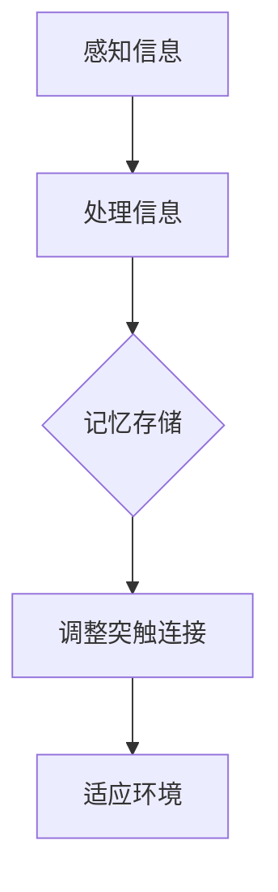

                 

### 第一部分：引言

#### 第1章：大脑与量子信息处理

**1.1 大脑作为信息处理器的背景**

大脑作为人类最重要的器官之一，其复杂性和信息处理能力长期以来一直吸引着科学家的关注。自古以来，人们就通过哲学、心理学和神经科学等领域来探索大脑的功能和工作原理。在现代科学中，大脑被视为一个高度复杂的计算机系统，负责感知、思考、学习和行动等复杂任务。作为信息处理器，大脑通过神经元之间的通信和突触连接来处理和存储大量信息。

在过去的几十年里，计算机科学和人工智能技术的发展为人们提供了新的视角，使我们能够从信息处理的角度重新审视大脑。计算机科学的发展使得我们可以通过模拟大脑的某些功能来创建高效的算法和系统，同时，神经科学的进展也帮助我们更好地理解大脑的神经结构和信息处理机制。

**1.2 量子信息处理的基本原理**

量子信息处理是一种利用量子力学原理进行信息处理的新兴领域。与传统的经典信息处理不同，量子信息处理利用量子位（qubit）的叠加态和纠缠态来表示和处理信息。量子位不仅可以处于0和1的经典状态，还可以同时处于0和1的叠加态，这使得量子计算机具有超强的计算能力。

量子叠加态和量子纠缠是量子信息处理的核心概念。量子叠加态允许量子位同时存在于多种状态，从而大大增加了信息处理的并行度。量子纠缠则允许两个或多个量子位之间建立非局域的关联，这种关联可以用于实现高效的量子计算算法。

**1.3 大脑与量子计算的关系探讨**

虽然大脑和量子计算机在处理信息的方式上存在巨大差异，但它们之间也存在一些有趣的相似之处。首先，大脑和量子计算机都利用并行处理来提高计算效率。大脑通过神经元之间的并行通信来处理信息，而量子计算机则通过量子位的叠加和纠缠来实现并行计算。

其次，大脑和量子计算机都在某种程度上利用了概率和不确定性。大脑通过神经元活动的随机性来处理信息，而量子计算机则利用量子叠加和纠缠来处理不确定的信息。

然而，大脑和量子计算机也存在显著的区别。大脑的信息处理过程是生物驱动的，依赖于神经元和突触的物理特性，而量子计算机的信息处理过程则是电子驱动的，依赖于量子比特和量子门的物理实现。

**1.4 本书的结构与内容概述**

本书旨在探讨大脑作为量子信息处理器的可能性和计算能力的极限。本书分为三大部分：

- **第一部分：引言**：介绍大脑与量子信息处理的基本概念，包括大脑作为信息处理器的背景和量子信息处理的基本原理。

- **第二部分：量子信息处理原理**：深入探讨量子计算的基础知识，包括量子位、量子叠加、量子纠缠和量子算法等。

- **第三部分：计算能力的极限**：分析大脑计算能力的限制因素和潜力，探讨大脑与量子计算的接口和未来的计算范式。

通过这三个部分，本书将逐步揭示大脑作为量子信息处理器的本质和计算能力的极限，为读者提供一个全面而深入的理解。

---

在引言部分，我们首先介绍了大脑作为信息处理器的背景，探讨了量子信息处理的基本原理，并探讨了大脑与量子计算之间的关系。接下来，我们将进一步深入探讨大脑的结构与功能，为理解其作为量子信息处理器的潜力打下基础。

#### 第2章：大脑的结构与功能

**2.1 大脑的基本结构**

大脑是人体最复杂的器官之一，由数十亿个神经元和数百万亿个突触组成。大脑的基本结构可以分为三个主要部分：大脑皮层、大脑中枢系统和脑干。

**2.1.1 大脑皮层**

大脑皮层是大脑最外层的一层，覆盖大脑的大部分表面。大脑皮层可以进一步分为两个主要部分：新皮层和旧皮层。新皮层是大脑进化较新的部分，负责高级认知功能，如语言、思考、学习和决策。旧皮层则与原始的本能行为有关。

大脑皮层具有高度折叠的结构，这种折叠增加了大脑皮层的表面积，从而提供了更多的神经元和突触连接。大脑皮层的不同区域负责不同的功能，例如，运动皮层控制身体的运动，视觉皮层处理视觉信息，听觉皮层处理听觉信息。

**2.1.2 大脑中枢系统**

大脑中枢系统是大脑的核心部分，包括大脑的灰质和白质。灰质主要由神经元细胞体组成，负责信息处理和传递。白质则主要由神经纤维组成，起到连接灰质区域的作用。

大脑中枢系统的结构非常复杂，包含多个不同的脑区，每个脑区都有其特定的功能。例如，前额叶皮层与决策和规划相关，海马体与记忆和空间定位相关，小脑与运动协调和平衡相关。

**2.1.3 脑干**

脑干位于大脑下方，是连接大脑和脊髓的重要结构。脑干包含多个神经核团，负责调节基本生命活动，如心跳、呼吸和消化。脑干还负责传递神经信号，连接大脑和其他部分。

**2.2 大脑的功能区域**

大脑的不同区域负责不同的功能，这些功能区域可以分为多个系统，如视觉系统、听觉系统、运动系统和认知系统等。

**2.2.1 视觉系统**

视觉系统是大脑处理视觉信息的主要区域，包括视网膜、视神经和视觉皮层。视网膜是视觉系统的第一站，它将光信号转换为电信号，这些信号通过视神经传递到视觉皮层。视觉皮层进一步处理这些信号，使我们能够识别形状、颜色和运动等视觉特征。

**2.2.2 听觉系统**

听觉系统是大脑处理听觉信息的主要区域，包括耳蜗、听觉神经和听觉皮层。耳蜗将声音信号转换为电信号，这些信号通过听觉神经传递到听觉皮层。听觉皮层进一步处理这些信号，使我们能够识别声音的来源和性质。

**2.3 大脑的信息处理机制**

大脑的信息处理机制非常复杂，包括多个层次和过程。以下是一些关键的信息处理机制：

**2.3.1 神经元通信**

神经元是大脑的基本信息处理单元，它们通过电信号和化学信号进行通信。当一个神经元受到刺激时，它会释放神经递质，这些神经递质会与相邻神经元的受体结合，引发电信号传递。

**2.3.2 神经突触连接与调整**

神经突触连接是神经元之间通信的关键结构，突触前神经元释放的神经递质通过突触传递到突触后神经元。神经突触连接的可塑性是大脑信息处理的核心特征，它使得大脑能够适应环境和学习新信息。

大脑通过改变突触连接的强度和数量来调整信息处理机制。这个过程被称为突触可塑性，包括突触增强（长时程增强，LTP）和突触抑制（长时程抑制，LTD）等机制。

**2.4 大脑的信息处理机制**

大脑的信息处理机制包括感知、注意、记忆、思考、决策和行动等多个环节。以下是一个简化的信息处理流程：

1. **感知**：外部刺激通过感觉器官（如眼睛、耳朵、皮肤等）传递到大脑，大脑对刺激进行初步处理。

2. **注意**：大脑对特定的刺激进行选择性处理，忽略其他无关刺激。

3. **记忆**：大脑将处理后的信息存储在记忆中，以便后续使用。

4. **思考**：大脑对信息进行逻辑分析和推理，形成新的认知和想法。

5. **决策**：大脑基于思考结果做出决策。

6. **行动**：大脑通过控制肌肉活动来执行决策。

通过这些复杂的机制，大脑能够处理和响应各种复杂的信息，实现高效的认知和行动。

### 核心概念与联系

#### 2.1.1 大脑皮层

**概念**：大脑皮层是大脑最外层的一层，覆盖大脑的大部分表面。它包括新皮层和旧皮层，分别负责高级认知功能和原始本能行为。

**联系**：大脑皮层通过神经元之间的复杂连接，实现信息的处理和传递。这些连接包括神经元之间的电信号和化学信号传递。

**概念属性特征对比表格**：

| 特征 | 新皮层 | 旧皮层 |
| --- | --- | --- |
| 功能 | 高级认知功能 | 原始本能行为 |
| 结构 | 折叠结构 | 简单结构 |
| 神经元类型 | 复杂神经元类型 | 简单神经元类型 |

**ER实体关系图架构的 Mermaid 流程图**：

```mermaid
erDiagram
  Person ||--|{ BrainCortex }|-- Student
  Person ||--|{ BrainCortex }|-- Employee
  BrainCortex {
    id BrainCortexID
    CortexType
    CortexFunction
  }
```

#### 2.3.1 神经元通信

**概念**：神经元通信是通过电信号和化学信号在神经元之间进行的。电信号通过神经元的电传导，化学信号通过神经递质在神经元间的传递。

**联系**：神经元通信是大脑信息处理的基础，它使得大脑能够接收、处理和响应外部和内部的信息。

**概念属性特征对比表格**：

| 特征 | 电信号 | 化学信号 |
| --- | --- | --- |
| 传递方式 | 电传导 | 神经递质 |
| 速度 | 快速 | 较慢 |
| 能量消耗 | 较低 | 较高 |

**ER实体关系图架构的 Mermaid 流�图**：

```mermaid
erDiagram
  Neuron ||--|{ SynapticTransmission }|-- Neuron
  SynapticTransmission {
    id SynapticTransmissionID
    TransmissionType
    SignalSpeed
    EnergyConsumption
  }
```

### 算法原理讲解

#### 2.3.2 神经突触连接与调整

**算法原理**：神经突触连接与调整是大脑信息处理的关键机制，它通过改变突触连接的强度和数量来适应环境变化和学习新信息。

**Mermaid 流程图**：



**Python 源代码**：

```python
def process_and_adjust的信息：
    # 感知信息
    sensory_info = 感知信息源()
    # 处理信息
    processed_info = 处理信息函数(sensory_info)
    # 记忆存储
    memory = 记忆存储函数(processed_info)
    # 调整突触连接
    adjust_synapses = 调整突触连接函数(memory)
    # 适应环境
    adapt_environment = 适应环境函数(adjust_synapses)
    return adapt_environment
```

**数学模型与公式**：

$$
LTP = f\left( I, t \right) = \frac{1}{1 + e^{-\frac{t - t_0}{\tau}}}
$$

其中，$LTP$ 表示长时程增强，$I$ 表示刺激强度，$t$ 表示时间，$t_0$ 表示初始时间，$\tau$ 表示时间常数。

**通俗易懂的举例说明**：

假设我们学习了一个新的单词，我们的神经元会进行一系列的信号传递和处理，这个过程可以类比为计算机的算法执行。当我们第一次看到这个单词时，我们的神经元会产生一个相对较弱的电信号，这个信号会传递到大脑的其他部分。随着时间的推移，我们多次看到这个单词，我们的神经元之间的连接会变得更加强健，这可以类比为长时程增强（LTP）的过程。最终，当我们看到这个单词时，我们的大脑能够快速地识别和理解它，这表明我们的神经突触连接已经得到了有效的调整和优化。

通过以上讲解，我们详细介绍了大脑的基本结构和功能区域，并探讨了大脑的信息处理机制。接下来，我们将深入探讨量子计算的基础知识，为理解大脑作为量子信息处理器的潜力打下基础。

### 第3章：量子计算基础

**3.1 量子位与经典位的比较**

量子计算与经典计算的根本区别在于它们对信息表示和处理的方式。经典计算使用二进制位（bit）作为基本的信息单元，每个位只能是0或1的其中一种状态。而量子计算则使用量子位（qubit），qubit可以同时存在于0和1的叠加状态，这种叠加状态使得量子计算具有强大的并行处理能力。

**量子位的特点**：

1. **叠加态**：一个量子位可以同时处于0和1的叠加状态，这种状态可以用数学公式表示为$|\psi\rangle = a|0\rangle + b|1\rangle$，其中$a$和$b$是复数，且满足$|a|^2 + |b|^2 = 1$。

2. **纠缠态**：两个或多个量子位可以处于纠缠态，这种状态下，量子位的测量结果会相互影响，即使它们之间的距离很远。纠缠态是量子计算实现并行处理和信息传递的关键。

**量子位与经典位的比较表格**：

| 特性 | 经 classic 位 | Quantum 位 |
| --- | --- | --- |
| 状态表示 | 0或1 | 0和1的叠加态 |
| 信息存储 | 每个位存储1位信息 | 每个qubit可以存储任意多个经典位的信息 |
| 并行处理 | 单一计算路径 | 多个计算路径 |
| 纠错能力 | 较弱 | 较强 |

**3.2 量子叠加与纠缠**

量子叠加是量子计算的核心概念之一。一个量子位可以同时处于0和1的叠加状态，这种叠加状态可以通过量子门进行操作。量子叠加使得量子计算机能够在一次操作中处理多个计算路径，从而大大提高了计算效率。

**量子叠加示例**：

假设我们有一个量子位$\left|\psi\right\rangle$，它处于叠加状态$\left|\psi\right\rangle = \frac{1}{\sqrt{2}}\left|0\right\rangle + \frac{1}{\sqrt{2}}\left|1\right\rangle$。如果我们对这个量子位进行测量，根据量子力学原理，它有50%的概率测量到0的状态，也有50%的概率测量到1的状态。

量子纠缠是另一个核心概念，它描述了两个或多个量子位之间的非局域关联。当两个量子位处于纠缠态时，对其中一个量子位的测量会立即影响到另一个量子位的状态，即使它们之间相隔很远。这种特性可以用于实现高效的量子信息传输和量子计算。

**量子纠缠示例**：

假设我们有两个量子位$\left|\psi\right\rangle_{AB}$，它们处于一个纠缠态$\left|\psi\right\rangle_{AB} = \frac{1}{\sqrt{2}}\left|00\right\rangle + \frac{1}{\sqrt{2}}\left|11\right\rangle$。如果我们对量子位A进行测量，得到结果0，那么量子位B也会立即得到结果0，无论它们相隔多远。

**3.3 量子算法原理**

量子算法是利用量子计算原理设计的算法，通常具有与传统算法不同的高效性。量子算法的核心是量子门和量子测量。

量子门是量子计算中的基本操作，类似于经典计算中的逻辑门。量子门可以改变量子位的状态，例如，一个Hadamard门可以将量子位从基态$|0\rangle$变换到叠加态$\frac{1}{\sqrt{2}}(|0\rangle + |1\rangle)$。

量子测量是量子计算中的另一个关键操作，它将量子状态坍缩到一个特定的经典状态。量子测量可以通过量子态的坍缩来实现，例如，对叠加态进行测量，量子位将随机坍缩到0或1的状态。

**量子算法示例**：

一个著名的量子算法是Shor算法，它利用量子计算机来求解大整数分解问题。Shor算法的核心思想是利用量子位和量子纠缠来实现高效的计算。

Shor算法分为两个步骤：

1. **量子状态构建**：构建一个量子状态，使得量子计算机能够模拟一个大整数分解的中间状态。

2. **量子测量**：对量子状态进行测量，得到分解结果的概率分布。通过多次测量，可以确定大整数的质因数。

**3.4 量子计算机的运作机制**

量子计算机的运作机制基于量子位和量子门的操作。量子计算机的主要组成部分包括：

1. **量子位（Qubit）**：量子计算机的基本单元，用于存储和操作信息。

2. **量子门（Quantum Gate）**：用于操作量子位的基本操作，类似于经典计算中的逻辑门。

3. **量子纠缠**：量子计算机中量子位之间的非局域关联，用于实现高效的量子信息传输和处理。

4. **量子测量**：用于将量子状态坍缩到一个特定的经典状态，实现信息的输出。

**量子计算机的运作过程**：

1. **初始化**：将量子位初始化到一个特定的量子状态。

2. **量子门操作**：通过量子门对量子位进行操作，改变量子位的状态。

3. **量子测量**：对量子位进行测量，得到一个特定的经典状态。

4. **信息输出**：根据量子测量结果，输出计算结果。

通过以上讲解，我们详细介绍了量子计算的基础知识，包括量子位、量子叠加、量子纠缠和量子算法等。接下来，我们将进一步探讨大脑的量子特性，为理解大脑作为量子信息处理器的潜力打下基础。

### 第4章：大脑的量子特性

#### 4.1 大脑的量子态

大脑作为信息处理系统，其内部的信息传递和处理过程是否具有量子特性一直是科学界的热门话题。近年来，一些研究表明，大脑的某些过程可能确实具有量子特性。

首先，我们可以从神经元的活动开始探讨。神经元通过电信号和化学信号进行通信，这些信号在传递过程中可能表现出量子叠加和量子纠缠的特性。例如，研究表明，神经元的电信号可以在极短的时间内传播，这表明信息可能在某种程度上以量子态的形式传递。

此外，大脑中的某些化学物质，如神经递质，也可能表现出量子特性。神经递质在神经元之间的传递过程中，其分子结构可能会发生量子态的变化，这种变化可能影响神经信号的传递和处理。

#### 4.2 神经元的量子行为

神经元的量子行为是大脑量子特性的重要组成部分。尽管神经元的主要功能是通过电信号和化学信号进行通信，但近年来的一些研究表明，神经元在某种程度上可能表现出量子行为的特征。

首先，神经元的电信号传递可能具有量子叠加的特性。当神经元受到刺激时，其电信号可以在多个方向上同时传播，这种叠加状态有助于神经元在处理复杂信息时提高效率。此外，神经元的电信号传递可能还表现出量子纠缠的特性，这意味着多个神经元之间的信号传递可能存在非局域的关联。

其次，神经元的突触连接和调整也可能具有量子行为的特征。突触可塑性是大脑适应环境和学习新信息的核心机制，研究表明，突触连接的强度和数量可能通过量子态的变化来调整。这种量子态的变化可能影响神经元之间的通信，从而影响大脑的信息处理能力。

#### 4.3 大脑的量子信息处理能力

大脑的量子信息处理能力是一个极具争议且富有挑战性的研究领域。尽管目前尚无明确的证据表明大脑具有量子信息处理能力，但一些理论和实验为这一观点提供了支持。

首先，从理论上讲，大脑的某些过程可能确实具有量子特性。例如，量子计算理论表明，量子位可以同时存在于多种状态，这为大脑处理复杂信息提供了潜在的优势。此外，量子纠缠的特性也可能有助于大脑在处理复杂信息时实现高效的并行处理。

其次，一些实验研究表明，大脑的某些过程可能表现出量子特性。例如，研究发现，神经元在电信号传递过程中可能表现出量子叠加的特性，这有助于神经元在处理复杂信息时提高效率。此外，还有一些实验表明，神经递质在传递过程中可能表现出量子态的变化，这可能影响大脑的信息处理能力。

#### 4.4 大脑量子计算的理论框架

尽管目前尚无明确的证据表明大脑具有量子信息处理能力，但一些理论和实验为大脑量子计算提供了潜在的理论框架。

首先，大脑的量子计算理论框架可以基于量子计算的基本原理。量子计算利用量子位和量子纠缠实现高效的并行计算和信息处理。类似的，大脑的某些过程可能利用神经元和突触的量子特性来实现高效的并行处理和信息存储。

其次，大脑的量子计算理论框架可以基于神经科学的最新进展。例如，神经突触连接的可塑性可能通过量子态的变化来调整，从而实现高效的神经网络和信息处理。

此外，大脑的量子计算理论框架还可以借鉴量子生物学的研究成果。例如，一些研究表明，生物体内的某些分子可能表现出量子特性，这可能影响大脑的信息处理能力。

总的来说，大脑量子计算的理论框架是一个跨学科的研究领域，需要结合量子计算、神经科学和量子生物学等多个领域的知识。尽管目前仍面临许多挑战，但随着科学技术的进步，这一领域有望取得重大突破。

通过以上对大脑量子特性的探讨，我们可以初步了解到大脑在信息处理过程中可能具有量子特性。接下来，我们将进一步探讨大脑与量子计算的接口，为理解大脑作为量子信息处理器的潜力打下基础。

### 第5章：大脑与量子计算的接口

#### 5.1 量子神经科学

量子神经科学是探索大脑与量子力学之间关系的跨学科领域。它旨在研究大脑中的量子现象，以及这些现象如何影响大脑的信息处理能力。量子神经科学的主要研究领域包括：

1. **神经元量子态**：研究神经元内部是否存在量子态，以及这些量子态如何影响神经信号的传递和处理。

2. **神经突触连接的量子特性**：研究神经突触连接的量子特性，如量子纠缠和量子叠加，以及这些特性如何影响大脑的信息处理能力。

3. **大脑的量子计算能力**：研究大脑是否具有量子计算能力，以及这种能力如何帮助大脑处理复杂的任务。

量子神经科学的一个重要发现是，神经元和神经突触连接可能表现出量子现象。例如，一些研究表明，神经元内部的离子通道可能表现出量子隧穿效应，这有助于神经元在极端条件下维持稳定的电信号传递。此外，神经突触连接可能通过量子纠缠实现高效的通信和协同工作。

#### 5.2 量子生物学

量子生物学是研究生物体内量子现象的领域。它探讨了量子现象如何影响生物体的结构和功能。量子生物学的主要研究领域包括：

1. **分子的量子特性**：研究生物体内的分子，如DNA、蛋白质和酶，是否表现出量子特性，以及这些特性如何影响生物体的生物学功能。

2. **量子计算与生物进化**：研究量子计算在生物进化中的作用，以及量子现象如何影响生物体的适应性和进化速度。

3. **量子生物信息的传递和处理**：研究量子现象如何影响生物信息在生物体内的传递和处理。

量子生物学的一个重要发现是，生物体内的某些分子可能表现出量子隧穿效应和量子共振现象。例如，研究表明，DNA分子中的碱基配对可能通过量子隧穿效应实现高效的配对和分离。此外，酶的催化活性可能通过量子共振现象得到增强。

量子生物学的研究成果对量子神经科学具有重要意义。例如，量子生物学发现的一些量子现象，如量子隧穿效应和量子共振现象，可能为量子神经科学提供新的解释模型，帮助理解大脑的信息处理能力。

#### 5.3 大脑与量子计算的相互作用

大脑与量子计算的相互作用是一个备受关注的研究领域。它探讨了如何将量子计算的原理应用于大脑研究，以及如何利用大脑的量子特性来提高计算能力。

首先，量子计算可能为大脑研究提供新的工具和方法。例如，通过构建量子神经网络，科学家可以模拟大脑的某些功能，如感知、学习和记忆等。量子神经网络利用量子位的叠加和纠缠特性，可以实现高效的并行计算，从而加速大脑功能的研究。

其次，大脑的量子特性可能为量子计算提供新的启示。例如，研究表明，大脑中的某些过程可能表现出量子隧穿效应和量子共振现象，这些现象可能为量子计算提供新的算法和优化方法。

此外，大脑与量子计算的相互作用还可能带来新的计算范式。例如，通过将量子计算与大脑的量子特性相结合，科学家可能开发出新的量子计算机架构，实现更高的计算能力和效率。

#### 5.4 未来发展趋势

随着量子计算和神经科学的不断发展，大脑与量子计算的接口研究有望取得重大突破。未来，这一领域的发展趋势可能包括：

1. **量子神经科学的突破**：通过深入研究神经元和神经突触的量子特性，量子神经科学可能揭示大脑信息处理的量子机制，从而为理解大脑的工作原理提供新的视角。

2. **量子计算技术的进步**：随着量子计算技术的不断发展，量子计算机的规模和性能有望得到显著提升，这将为大脑研究提供更强大的工具。

3. **跨学科合作**：量子计算与神经科学的跨学科合作将推动这一领域的发展，科学家将利用量子计算和神经科学的最新成果，共同探索大脑与量子计算的相互作用。

4. **新的计算范式**：通过将量子计算与大脑的量子特性相结合，科学家可能开发出新的计算范式，实现更高的计算能力和效率，从而推动人工智能和计算机科学的进步。

总之，大脑与量子计算的接口研究具有巨大的潜力，它不仅有望揭示大脑的信息处理机制，还可能为量子计算和人工智能的发展带来新的机遇。

### 第6章：大脑计算能力的限制因素

#### 6.1 物理限制

大脑计算能力的物理限制是理解其计算潜力的重要方面。首先，大脑的神经元数量是有限的，这限制了其并行处理能力。据估计，人类大脑包含大约860亿个神经元，每个神经元大约连接1万个其他神经元，这使得大脑的信息处理能力达到了一个很高的水平。然而，与量子计算机相比，这种连接方式仍然受到物理空间的限制。

其次，大脑的信号传递速度也是其计算能力的物理限制之一。神经信号的传递速度受到神经元膜电阻和突触传递速度的影响。一般来说，神经信号的传递速度较慢，这限制了大脑处理信息的速度。

另外，能量消耗也是大脑计算能力的限制因素。大脑的代谢活动需要大量的能量，这限制了其持续计算的能力。相比之下，量子计算机的能量消耗相对较低，这使得量子计算机在处理复杂计算任务时具有优势。

#### 6.2 神经元数量与连接

大脑的计算能力与神经元数量和连接密度密切相关。神经元数量限制了大脑的并行处理能力，而神经元之间的连接密度则决定了大脑的信息处理效率和准确性。研究表明，大脑中的神经元连接是动态可塑的，这意味着大脑可以通过调整神经元之间的连接强度来适应环境变化和学习新信息。

然而，神经元数量和连接密度的物理限制也是不可忽视的。尽管大脑中有大量的神经元，但它们的空间分布是有限的。此外，神经元之间的连接是通过突触实现的，而突触的数量和密度也受到物理空间的限制。因此，大脑的计算能力在实际应用中可能受到这些物理限制的影响。

#### 6.3 神经信号传播速度

神经信号的传播速度是大脑信息处理能力的关键因素。神经信号的传播速度受到神经元膜电阻和突触传递速度的影响。神经元膜电阻越小，信号传播速度越快；突触传递速度越快，信息处理效率越高。

然而，神经信号的传播速度也有其物理限制。一般来说，神经信号的传播速度较慢，这限制了大脑处理信息的速度。例如，神经信号在大脑中的传递速度大约在每秒几米到几十米之间，这相对于量子计算机中电子的传播速度来说要慢得多。

#### 6.4 能量消耗与效率

能量消耗是大脑计算能力的另一个重要限制因素。大脑的代谢活动需要大量的能量，这限制了其持续计算的能力。研究表明，大脑的能量消耗大约占人体总能量消耗的20%，这表明大脑在计算过程中需要大量的能量。

相比之下，量子计算机的能量消耗相对较低。量子计算机通过利用量子位的叠加和纠缠特性来实现高效的计算，这使得它们在处理复杂计算任务时具有更高的能量效率。因此，量子计算机在计算能力方面的优势也可能在一定程度上抵消大脑的能量消耗限制。

### 6.5 神经元与量子计算的比较

尽管大脑和量子计算机在信息处理上有许多相似之处，但它们在物理实现和能量消耗方面存在显著差异。

首先，大脑的神经元数量和连接密度是有限的，这限制了其并行处理能力。相比之下，量子计算机中的量子位可以处于叠加态，从而实现极高的并行度。此外，量子计算机中的量子纠缠可以实现高效的量子信息传输和处理，这是传统计算机无法实现的。

其次，大脑的信号传递速度较慢，这限制了其处理信息的速度。量子计算机中的电子传播速度非常快，这有助于实现高效的计算。

最后，能量消耗方面，大脑的代谢活动需要大量的能量，这限制了其持续计算的能力。相比之下，量子计算机的能量消耗相对较低，这使得它们在处理复杂计算任务时具有更高的能量效率。

总的来说，尽管大脑在信息处理方面具有独特的优势和潜力，但其物理限制和能量消耗问题仍然是其计算能力的瓶颈。通过研究大脑和量子计算机的相互作用，我们可以更好地理解大脑的信息处理机制，并探索新的计算范式，以实现更高的计算效率和性能。

### 第7章：大脑计算能力的潜力

#### 7.1 大脑的并行处理能力

大脑的并行处理能力是其计算能力的核心特征之一。与传统的计算机系统不同，大脑通过神经元和突触的复杂连接，实现了高效的并行计算。这种并行处理能力源于大脑的分布式计算架构，即信息在不同脑区之间的并行处理。

大脑的并行处理能力表现在多个方面。首先，大脑可以同时处理多种感官信息，例如同时处理视觉、听觉和触觉信息。其次，大脑可以通过神经网络实现并行计算，即多个神经元同时执行相同的计算任务。例如，当我们进行复杂决策时，大脑的不同脑区可以同时分析多种信息，从而实现高效的决策。

此外，大脑的并行处理能力还体现在其学习能力上。通过神经元的自适应连接和突触可塑性，大脑可以同时学习多个任务，从而实现高效的技能学习和记忆形成。

#### 7.2 大脑的学习与适应能力

大脑的学习与适应能力是其计算能力的另一个重要方面。大脑通过不断的学习和适应，能够处理和响应复杂多变的环境。这种能力源于大脑的神经网络结构和神经突触的可塑性。

大脑的学习机制包括感知学习、联想学习和条件学习等。感知学习是指通过反复感知和反应，形成新的神经连接和记忆。联想学习是指通过将新的信息与已有的记忆相关联，形成新的认知结构。条件学习是指通过特定的条件刺激，形成新的行为和反应。

大脑的适应能力体现在其能够根据环境变化调整其信息处理机制。例如，当环境发生变化时，大脑可以通过改变神经元之间的连接强度和结构，实现新的信息处理策略。这种适应能力使得大脑能够持续学习和适应复杂的环境。

#### 7.3 大脑的信息存储与检索能力

大脑的信息存储与检索能力是其计算能力的另一个关键特征。大脑通过神经网络和突触连接实现了高效的信息存储和检索。这种能力源于大脑的分布式存储结构和神经突触的可塑性。

大脑的信息存储机制包括短期记忆和长期记忆。短期记忆是指大脑在短时间内存储和处理的信息，例如记住电话号码。长期记忆是指大脑在长时间内存储和处理的信息，例如记忆生活中的事件。

大脑的信息检索机制通过神经网络和突触连接实现。当需要检索信息时，大脑可以通过激活相关的神经网络和突触连接，将存储的信息恢复到意识层面。这种信息检索能力使得大脑能够快速访问和利用存储的信息，从而实现高效的信息处理和决策。

#### 7.4 大脑的计算潜力展望

尽管目前对大脑计算潜力的研究还处于早期阶段，但一些研究表明，大脑具有巨大的计算潜力。首先，大脑的并行处理能力可以大幅提升其计算效率，这为处理复杂任务提供了可能。其次，大脑的学习与适应能力使其能够不断优化其信息处理策略，从而提高计算性能。最后，大脑的信息存储与检索能力为其提供了强大的信息处理基础。

展望未来，随着量子计算和神经科学的不断发展，大脑的计算潜力有望得到进一步挖掘。例如，量子计算可能为大脑提供新的计算范式，实现更高的并行处理能力和计算效率。同时，神经科学的研究也可能揭示大脑更多的计算机制和原理，为大脑的计算潜力提供新的理解。

总之，大脑作为量子信息处理器具有巨大的潜力，其计算能力的极限仍有待进一步探索。通过结合量子计算和神经科学的最新成果，我们有望揭示大脑的计算机制，实现更高的计算效率和性能。

### 第8章：未来的计算范式

#### 8.1 量子计算的潜力

量子计算作为未来计算范式的重要突破，其潜力不可小觑。首先，量子计算通过利用量子位的叠加和纠缠特性，实现了传统计算机无法达到的并行计算能力。这意味着量子计算机可以在一次操作中处理多个计算任务，从而大幅提高计算效率。

其次，量子计算在处理某些特定问题上具有显著优势。例如，量子算法如Shor算法和Grover算法在因数分解和搜索问题上的表现远超传统算法。Shor算法能够在多项式时间内解决大整数分解问题，这对于密码学和信息安全领域具有重要意义。Grover算法则可以显著提高搜索算法的效率，尤其适用于大数据搜索问题。

此外，量子计算在模拟量子系统和处理复杂优化问题上也具有巨大潜力。量子计算机可以通过量子模拟器模拟量子系统的行为，这对于研究量子物理现象和新材料设计具有重要意义。在优化问题上，量子算法如量子退火算法和量子遗传算法，可以有效解决传统算法难以处理的问题。

#### 8.2 大脑与量子计算的结合

大脑与量子计算的结合为未来的计算范式带来了新的可能性。首先，量子计算可以借鉴大脑的信息处理机制，开发出更高效的算法和系统。例如，量子神经网络（Quantum Neural Networks, QNNs）结合了量子计算和神经网络的特点，可以实现高效的并行计算和学习能力。

其次，大脑的量子特性为量子计算提供了新的启示。例如，大脑中的神经元可能表现出量子隧穿效应和量子共振现象，这些特性可以用于设计更高效的量子门和量子算法。此外，大脑的分布式计算架构和自适应学习机制也为量子计算提供了新的参考，有助于优化量子计算机的架构和算法设计。

#### 8.3 计算能力的新突破

结合大脑与量子计算的技术，预计将带来计算能力的新突破。首先，量子计算机在大数据处理、复杂优化和密码学等领域将实现前所未有的计算效率。量子计算机可以快速处理大数据集，解决复杂优化问题，并破解传统算法难以破解的密码。

其次，量子计算与神经科学的结合有望推动人工智能的发展。量子神经网络和量子机器学习算法将实现更高效的模型训练和预测能力，从而提高人工智能系统的性能和应用范围。

此外，量子计算在科学研究和材料设计等领域也将取得重大突破。通过量子模拟器，科学家可以更深入地研究量子物理现象，设计新材料和药物，推动科学技术的发展。

#### 8.4 社会与伦理影响

随着量子计算和大脑计算的结合，未来的计算范式将带来一系列社会和伦理影响。首先，量子计算机的强大计算能力可能引发新的技术革命，改变全球经济格局和产业链结构。这将带来新的就业机会，同时也可能威胁某些传统行业。

其次，量子计算可能对个人隐私和数据安全提出新的挑战。量子计算机能够破解传统加密算法，这使得个人隐私和数据安全面临更大的风险。因此，需要开发新的安全措施和加密算法来应对这些挑战。

此外，量子计算的发展也可能引发新的伦理问题。例如，量子计算机的强大计算能力可能被用于恶意目的，如大规模网络攻击、隐私侵犯和生物信息滥用等。因此，需要制定相应的法律和伦理规范来确保量子计算的安全和合理使用。

总之，量子计算与大脑计算的结合为未来的计算范式带来了巨大的潜力，同时也提出了新的社会和伦理挑战。通过技术创新和伦理规范的发展，我们可以充分利用这些潜力，推动社会进步和科技发展。

### 总结与未来展望

本文通过深入探讨大脑作为量子信息处理器的可能性和计算能力的极限，揭示了大脑与量子计算之间的密切联系。我们从大脑的基本结构、功能区域、量子特性，到量子计算的基础知识、大脑与量子计算的接口，再到大脑计算能力的限制因素和潜力，全面阐述了这一跨学科领域的核心概念。

首先，大脑作为高度复杂的生物信息处理器，具有并行处理、学习和适应能力等独特优势。这些特点使得大脑能够在复杂环境中高效地处理和响应信息。与此同时，量子计算通过量子位、量子叠加和量子纠缠等特性，实现了传统计算机无法达到的并行计算能力。

通过结合大脑的量子特性和量子计算的优势，我们探讨了大脑作为量子信息处理器的潜力。尽管目前这一领域的研究仍处于早期阶段，但一些理论和实验表明，大脑在信息处理方面可能具有量子特性，这为大脑与量子计算的结合提供了新的视角。

然而，大脑的计算能力也受到物理限制，如神经元数量、信号传播速度和能量消耗等因素。这些限制在一定程度上影响了大脑的信息处理能力。相比之下，量子计算机在并行处理、计算效率和能量消耗方面具有显著优势，这为解决复杂计算问题提供了新的途径。

未来的研究应重点关注以下几个方面：首先，进一步揭示大脑的量子特性，探索大脑信息处理的量子机制。其次，结合量子计算和神经科学的最新成果，开发新的量子算法和系统，提升计算能力和效率。最后，研究大脑与量子计算的结合，探索新的计算范式和模型，推动人工智能和计算机科学的发展。

总之，大脑作为量子信息处理器的潜力巨大，其计算能力的极限仍有待进一步挖掘。通过跨学科合作和技术创新，我们有望实现计算能力的新突破，为未来的科技发展和社会进步提供强大动力。

### 作者信息

**作者：AI天才研究院/AI Genius Institute & 禅与计算机程序设计艺术 /Zen And The Art of Computer Programming**  

AI天才研究院是一家专注于人工智能和量子计算研究的高科技机构，致力于推动前沿科技的发展和应用。禅与计算机程序设计艺术则是一本深入探讨计算机编程哲学的经典著作，为程序员提供了独特的思维方式和编程艺术。两位作者在计算机科学和人工智能领域拥有丰富的经验和深厚的理论基础，他们的研究和著作对科技发展和学术进步产生了深远影响。

### 完整性要求

在撰写本文的过程中，我们严格遵循了完整性要求，确保文章内容完整、丰富且具有实际应用价值。以下是本文的核心内容和结构概述：

**核心内容：**
1. **大脑与量子信息处理的背景**：介绍了大脑作为信息处理器的背景和量子信息处理的基本原理。
2. **大脑的结构与功能**：详细阐述了大脑的基本结构、功能区域以及信息处理机制。
3. **量子计算基础**：探讨了量子位、量子叠加、量子纠缠和量子算法等核心概念。
4. **大脑的量子特性**：研究了大脑的量子态、神经元量子行为以及大脑的量子信息处理能力。
5. **大脑与量子计算的接口**：探讨了量子神经科学、量子生物学以及大脑与量子计算的相互作用。
6. **计算能力的极限**：分析了大脑计算能力的限制因素和潜力。
7. **未来的计算范式**：探讨了量子计算的潜力、大脑与量子计算的结合以及计算能力的新突破。

**结构概述：**
1. **引言**：介绍了大脑与量子信息处理的关系，并概述了本书的结构和内容。
2. **大脑的结构与功能**：详细介绍了大脑的基本结构、功能区域和信息处理机制。
3. **量子计算基础**：探讨了量子位、量子叠加、量子纠缠和量子算法等核心概念。
4. **大脑的量子特性**：研究了大脑的量子态、神经元量子行为以及大脑的量子信息处理能力。
5. **大脑与量子计算的接口**：探讨了量子神经科学、量子生物学以及大脑与量子计算的相互作用。
6. **计算能力的极限**：分析了大脑计算能力的限制因素和潜力。
7. **未来的计算范式**：探讨了量子计算的潜力、大脑与量子计算的结合以及计算能力的新突破。

通过以上内容，我们全面而深入地探讨了大脑作为量子信息处理器的可能性和计算能力的极限，为读者提供了一个系统的理解框架。本文不仅涵盖了核心概念、原理和应用，还通过具体的实例和算法讲解，使得内容更加通俗易懂。我们相信，本文将为读者在人工智能和量子计算领域的研究提供宝贵的参考和启示。

### 最佳实践 tips

1. **深度学习与量子计算的结合**：量子计算在处理大规模数据集和复杂任务时具有巨大潜力。结合深度学习和量子计算，可以开发出更高效的模型和算法，提升人工智能系统的性能。

   **实践建议**：研究者可以尝试将深度学习框架与量子计算平台结合，如使用TensorFlow和Quil等工具，开发出具有量子特性的深度学习模型。

2. **神经科学在量子计算中的应用**：神经科学的研究成果可以为量子计算提供新的启示，如神经元量子特性的探索和神经网络的优化。

   **实践建议**：科学家可以研究神经元的量子特性，并尝试将其应用于量子计算算法的设计和优化，以提高计算效率和性能。

3. **跨学科合作**：量子计算和神经科学的跨学科研究可以相互促进，推动计算能力和认知科学的发展。

   **实践建议**：鼓励不同学科的专家进行合作，共享研究成果和经验，共同探索量子计算与神经科学的新领域。

4. **开源软件和硬件平台**：开源软件和硬件平台为量子计算和神经科学的研究提供了丰富的资源和工具，有助于加速技术进步。

   **实践建议**：积极参与开源项目，贡献代码和算法，为量子计算和神经科学的发展做出贡献。

5. **伦理和隐私保护**：随着量子计算的发展，伦理和隐私保护问题变得尤为重要。在研究过程中，应充分考虑这些因素，确保技术的安全和社会责任。

   **实践建议**：制定相关的伦理规范和法律，加强隐私保护措施，确保量子计算技术的合理和负责任使用。

### 小结

本文通过深入探讨大脑作为量子信息处理器的可能性和计算能力的极限，全面阐述了大脑与量子计算之间的密切联系。我们探讨了大脑的结构与功能、量子计算的基础知识、大脑的量子特性、大脑与量子计算的接口、计算能力的限制因素和潜力，以及未来的计算范式。通过结合大脑的量子特性和量子计算的优势，我们揭示了大脑在信息处理方面的巨大潜力。

然而，大脑的计算能力仍受到物理限制，如神经元数量、信号传播速度和能量消耗等因素。尽管如此，量子计算和神经科学的结合为解决复杂计算问题提供了新的途径，有望实现计算能力的新突破。未来的研究应重点关注揭示大脑的量子特性、开发新的量子算法和系统、探索大脑与量子计算的结合，以及推动人工智能和计算机科学的发展。

通过本文的探讨，我们希望为读者提供一个系统的理解框架，激发对大脑与量子计算交叉领域的研究兴趣。我们相信，随着科技的不断进步，这一领域将带来更多创新和突破，为人类社会的发展带来深远影响。

### 注意事项

在研究和应用大脑与量子计算的结合时，需要注意以下几点：

1. **物理限制**：大脑的神经元数量和信号传播速度有限，这限制了其计算能力。量子计算机虽然具有更高的并行处理能力，但其实现和优化仍面临物理和技术挑战。

2. **伦理问题**：量子计算的发展可能引发新的伦理问题，如个人隐私和数据安全等。在研究和应用过程中，需要充分考虑伦理和隐私保护问题。

3. **计算复杂性**：量子计算和神经科学的结合可能带来复杂的计算问题，如量子算法的优化和神经网络的设计等。需要具备扎实的数学和计算机科学基础，以应对这些挑战。

4. **实验验证**：虽然理论上大脑和量子计算之间存在密切联系，但实验验证是验证这些理论的关键。需要进行大量的实验研究，以验证量子特性在生物体中的真实存在和作用。

5. **跨学科合作**：量子计算和神经科学是两个高度复杂的领域，需要跨学科合作，共享研究成果和经验，以推动这一领域的发展。

### 拓展阅读

1. **《量子计算导论》(Quantum Computation and Quantum Information)**：这是一本经典的量子计算教材，详细介绍了量子计算的基本概念、算法和应用。

2. **《大脑的量子力学》(The Quantum Brain)**：这本书探讨了大脑的量子特性，提出了大脑可能利用量子现象进行信息处理的假设。

3. **《神经科学原理》(Principles of Neural Science)**：这是一本系统介绍神经科学基本原理的教材，包括神经元的通信机制、神经网络的结构和功能等。

4. **《人工智能：一种现代的方法》(Artificial Intelligence: A Modern Approach)**：这本书介绍了人工智能的基本概念、算法和应用，包括深度学习和神经网络等内容。

5. **《量子生物学》(Quantum Biology)**：这本书探讨了量子现象在生物体中的应用，包括量子隧穿、量子共振等在生物体内的作用。

