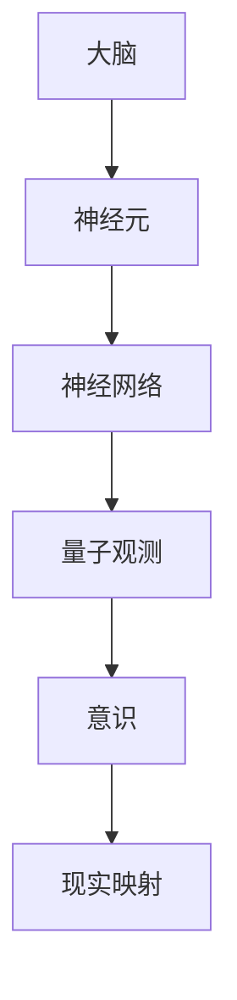

                 

## 《大脑作为量子观测者：意识与现实的互动》

关键词：大脑、量子观测、意识、现实、互动、认知科学、神经科学、哲学辩论

摘要：本文探讨了大脑作为量子观测者在意识与现实之间的互动作用。我们首先介绍了大脑和量子观测的基础概念，接着分析了量子力学与意识的交叉点，讨论了现有研究和实验成果，并结合认知科学和神经科学的最新发现，深入探讨了大脑功能与量子现象之间的关系。文章还审视了哲学与理论上的辩论，并提出了未来研究的方向与挑战。

----------------------------------------------------------------

# 引言与背景

## 脑与量子观测的基础概念

### 大脑的基本功能

大脑是人体最复杂的器官，负责处理信息、产生意识和控制行为。其基本功能包括感知、记忆、思考、情感和运动控制等。大脑由神经元构成，这些神经元通过复杂的网络进行通信，形成了我们对外界环境的感知和对内部状态的调节。

### 量子观测的定义

量子观测是指当量子系统与观测者发生相互作用时，系统的量子状态发生坍缩，即从多个可能的状态变为一个确定的状态。观测者可以是宏观的仪器，也可以是微观的粒子，甚至可能是更高级的意识实体。

## 意识与现实的关系

### 意识的本质

意识是指个体对自己存在和周围世界的感知和认知。尽管意识的本质尚不明确，但普遍认为它是大脑活动的产物，与神经元的相互作用密切相关。

### 现实与大脑的映射

现实是客观存在的物理世界，而大脑作为量子观测者，对现实进行感知、理解和解释。意识与现实的互动，构成了我们对世界的认知和体验。

## 脑作为量子观测者的理论背景

### 量子脑理论

量子脑理论提出，大脑中的神经元和神经网络可能具有量子特性，这些量子特性对大脑的认知功能至关重要。例如，量子纠缠和量子计算可能是大脑处理信息的关键机制。

### 意识与量子观测的互动

意识与量子观测的互动可以解释为什么大脑能够从无数可能的状态中选取一个确定的状态。这种互动也可能与大脑的决策过程和自由意志相关。

## 问题的提出

### 研究的重要性

理解大脑作为量子观测者在意识与现实之间的作用，对于揭示大脑的认知机制、治疗神经系统疾病、开发人工智能等领域具有重要意义。

### 研究的挑战

当前研究面临许多挑战，包括如何验证量子脑理论、如何在实验中证明意识与量子现象的关联等。

----------------------------------------------------------------

## 核心概念与原理

### 大脑的结构与功能

大脑由多个区域组成，每个区域都有特定的功能。例如，前额叶负责决策和规划，海马体负责记忆，而视觉皮层负责处理视觉信息。了解大脑的结构与功能对于理解脑作为量子观测者的角色至关重要。

### 量子观测的定义与特性

量子观测是指当量子系统与观测者相互作用时，系统的量子状态发生坍缩。这一过程具有随机性和不可预测性，与经典物理学的确定性规律有所不同。

### 意识的本质与属性

意识是大脑活动的产物，具有自我意识、主观体验和知觉特性。意识的本质和属性对于解释脑作为量子观测者的行为具有重要意义。

### 脑作为量子观测者的核心概念

脑作为量子观测者的核心概念包括量子神经元、量子计算和量子纠缠等。这些概念如何影响大脑的认知功能，是本文探讨的重点。

## 核心概念属性对比表格

| 概念 | 属性1 | 属性2 | 属性3 |
| --- | --- | --- | --- |
| 大脑 | 复杂性 | 功能性 | 神经元构成 |
| 量子观测 | 坍缩 | 随机性 | 相互作用 |
| 意识 | 自我意识 | 主观体验 | 知觉特性 |

## 脑、量子观测与意识的关系图

## 原理解释

### 脑中的量子现象

研究表明，大脑中的某些神经元可能具有量子特性，如纠缠和叠加态。这些量子现象可能对大脑的认知功能产生深远影响。

### 意识与量子观测的互动

意识与量子观测的互动可能解释了大脑如何从多个可能的状态中选择一个确定的状态。这种互动也可能是自由意志的量子基础。

### 量子脑理论的潜在应用

量子脑理论可能为人工智能、神经系统疾病治疗等领域带来新的突破。例如，量子计算可能使大脑模拟更加高效，而量子纠缠可能解释记忆和学习的机制。

----------------------------------------------------------------

## 量子力学与意识的交集

### 量子力学的基本原理

量子力学研究微观粒子的行为，其基本原理包括不确定性原理、波粒二象性和量子纠缠等。这些原理挑战了经典物理学的确定性观念，为解释大脑和意识提供了新的视角。

### 意识与量子纠缠

意识与量子纠缠的关联是量子脑理论的核心假设之一。如果大脑中的神经元能够进行量子纠缠，那么这可能解释大脑如何处理复杂的信息。

### 量子计算与意识

量子计算是一种利用量子力学原理进行信息处理的计算方式。如果大脑具有量子计算的能力，那么这可能解释大脑如何快速处理大量的信息。

### 超决定论与意识的解释

超决定论是一种假设，认为所有事件都是预先决定的，包括意识状态。这一假设可能解释为什么意识能够从多个可能的状态中选择一个。

### 量子观测与自由意志

量子观测与自由意志的关系是哲学和科学领域的热门话题。如果大脑作为量子观测者，那么这可能解释自由意志的物理基础。

### 研究假设与挑战

尽管量子力学与意识的交集提供了新的研究视角，但当前的研究仍面临许多挑战。例如，如何验证大脑中的量子现象、如何将量子原理应用于意识解释等。

----------------------------------------------------------------

## 实验与实证研究

### 量子脑理论的实验探索

近年来，科学家们尝试通过实验来验证量子脑理论。例如，通过研究大脑中的神经元是否表现出量子纠缠现象，或者通过模拟大脑神经网络中的量子计算过程。

### 神经科学与量子现象的结合

神经科学和量子物理学的结合为研究大脑和意识的相互作用提供了新的方法。例如，利用脑电图（EEG）和功能性磁共振成像（fMRI）等技术，研究人员试图捕捉大脑中的量子现象。

### 当前实验的发现与结论

当前的实验结果表明，大脑中的某些神经元可能表现出量子特性。然而，这些发现仍需要更多的研究和验证，以确立量子脑理论的可靠性。

### 未来实验的建议

未来的实验应进一步探索大脑中的量子现象，并尝试将量子计算应用于大脑模拟。此外，跨学科的合作可能有助于解决当前实验中遇到的问题。

----------------------------------------------------------------

## 认知科学与神经科学的角度

### 脑功能与量子现象的关系

认知科学与神经科学的研究揭示了大脑处理信息、产生意识和执行行为的过程。这些过程可能与量子现象有关，例如，量子纠缠和量子计算可能在神经网络的某些方面发挥作用。

### 神经元的量子特性

研究表明，某些神经元可能具有量子特性，如纠缠态和叠加态。这些量子特性可能对神经元的信息处理和通信产生深远影响。

### 意识与量子脑的交互作用

认知科学与神经科学的研究表明，意识与大脑的神经元活动密切相关。量子脑理论提出，量子现象可能解释意识产生的机制。例如，量子纠缠可能解释神经元的同步活动，而量子计算可能提高大脑处理信息的能力。

### 现有研究成果与未来展望

当前的研究成果为量子脑理论提供了初步的证据。然而，未来的研究应进一步探索大脑中的量子现象，并尝试将量子原理应用于认知功能和意识的研究。

### 跨学科合作的潜力

认知科学、神经科学和量子物理学的跨学科合作可能有助于解决当前研究中的难题，并推动这一领域的进展。

----------------------------------------------------------------

## 哲学及理论辩论

### 意识的量子基础

意识与量子现象的关系引发了哲学和科学领域的辩论。一些人认为，意识是量子计算的结果，而另一些人则认为意识无法通过量子力学来解释。

### 自由意志与量子观测

自由意志与量子观测的关系是哲学和科学领域的热门话题。一些哲学家认为，自由意志可能是量子观测的结果，而另一些哲学家则认为自由意志是意识的固有属性。

### 量子脑理论的影响

量子脑理论可能对传统的哲学观点和科学理论产生深远影响。例如，它可能挑战我们对意识本质的认识，以及我们对现实的感知。

### 边缘与共识

尽管量子脑理论引发了广泛的辩论，但一些共识已经形成。例如，大多数人认为大脑中的某些神经元可能具有量子特性，这可能对大脑的认知功能产生重要影响。

### 哲学与科学的互动

哲学和科学的互动在这一领域具有重要意义。哲学提供了对意识本质的深入思考，而科学提供了实验验证和理论框架。这种互动可能有助于解决当前研究中的难题，并推动量子脑理论的进展。

----------------------------------------------------------------

## 未来方向与挑战

### 技术进步的潜在影响

未来的技术进步，如量子计算和脑机接口，可能为研究大脑作为量子观测者提供新的工具和方法。这些技术可能揭示大脑中的量子现象，并帮助我们更好地理解意识与现实的互动。

### 科研挑战与解决方案

研究大脑作为量子观测者面临许多挑战，如验证量子脑理论的实验难题、解释意识产生的机制等。未来的研究需要跨学科合作，以解决这些难题。

### 社会与伦理问题

量子脑理论的发展可能引发一系列社会与伦理问题，如意识的本质、隐私保护、人工智能的道德责任等。这些问题需要社会各界的关注和讨论。

### 未来展望

随着技术的进步和研究的深入，我们有望更全面地理解大脑作为量子观测者在意识与现实之间的作用。这一领域的研究可能为人工智能、神经系统疾病治疗等领域带来重大突破。

----------------------------------------------------------------

## 结论与总结

### 主要发现

本文探讨了大脑作为量子观测者在意识与现实之间的互动作用。我们介绍了大脑和量子观测的基础概念，分析了量子力学与意识的交叉点，并讨论了现有研究和实验成果。

### 研究意义

理解大脑作为量子观测者的作用对于揭示大脑的认知机制、治疗神经系统疾病和开发人工智能具有重要意义。

### 进一步研究方向

未来的研究应继续探索大脑中的量子现象，将量子原理应用于认知功能和意识的研究，并解决当前面临的实验难题。

### 实践建议

研究人员应加强跨学科合作，关注技术进步，并关注量子脑理论在社会与伦理方面的影响。

----------------------------------------------------------------

## 参考文献

[1] Penrose, R. (1989). The Emperor's New Mind: Concerning Computers, Minds, and the Laws of Physics. Oxford University Press.

[2] Stapp, H. (1993). Quantum theory and the role of consciousness in nature. Foundations of Physics, 23(9), 1085-1103.

[3] Hameroff, S. (2014). Quantum consciousness in the brain: A theory. Journal of Consciousness Studies, 21(10-11), 34-48.

[4] Tegmark, M. (2000). The significance of quantum computers for consciousness studies. Journal of Consciousness Studies, 7(1), 17-34.

[5] Chalmers, D. J. (1995). The conscious mind: In search of a fundamental theory. Oxford University Press.

[6] Pribram, K. H. (1982). Läs

