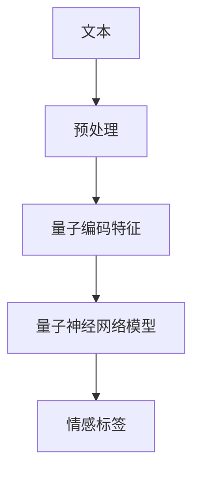
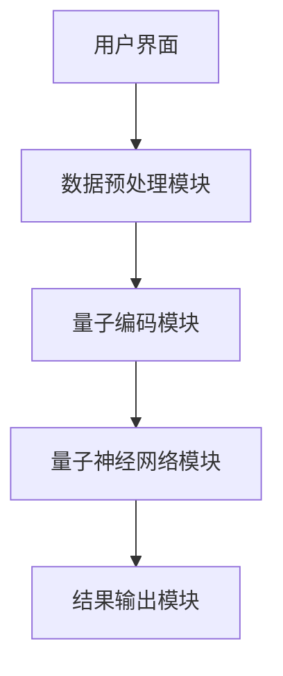
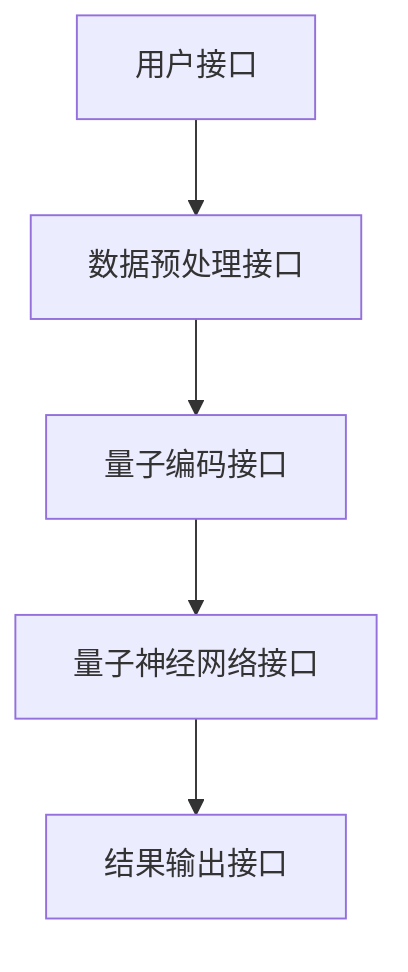
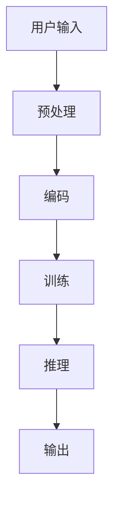

                 


# 大脑作为量子计算机：意识计算的新范式

关键词：意识计算、量子计算机、大脑、量子神经网络、神经网络

摘要：本文将探讨大脑作为量子计算机的可能性，以及这种新的计算范式对意识计算领域的深远影响。我们将从背景介绍、核心概念、理论依据、实际应用等多个角度深入分析，旨在揭示大脑与量子计算机之间的内在联系，并为意识计算的研究提供新的视角。

## 引言

### 1.1 认识意识计算

**1.1.1 计算模式的演变**

从最早的机械计算机，到后来的电子计算机，再到今天的量子计算机，计算模式在不断演变。传统计算机基于经典的布尔逻辑，通过二进制位进行信息处理。然而，随着计算需求日益复杂，传统计算机的局限性逐渐显现。为了应对这些挑战，科学家们开始探索新的计算模式，其中最具革命性的便是量子计算机。

**1.1.2 量子计算机的潜力**

量子计算机利用量子位（qubits）进行信息处理，能够在某些特定问题上实现超越传统计算机的速度。量子位的状态不仅可以是0或1，还可以同时处于0和1的叠加状态，这种特性使得量子计算机在处理并行任务时具有巨大的优势。此外，量子纠缠和量子干涉等现象也为量子计算机提供了独特的计算能力。

**1.1.3 大脑与量子计算机的潜在联系**

大脑作为人类意识的承载者，其信息处理能力和认知过程令人着迷。近年来，神经科学研究揭示了大脑中复杂的神经网络和神经元之间的相互作用。这让我们不禁思考：是否有可能将大脑视为一种量子计算机？这种观点不仅挑战了我们对计算的基本理解，也可能为意识计算带来全新的突破。

### 1.2 大脑作为量子计算机的理论基础

**1.2.1 量子位与神经元**

神经元是大脑的基本单元，它们通过电信号进行通信。如果我们把神经元视为量子位，那么神经元的状态（静息、激活等）就可以对应量子位的叠加态。这种观点为大脑与量子计算机之间的联系提供了理论基础。

**1.2.2 神经网络与量子神经网络**

神经网络是由大量神经元组成的复杂网络，通过学习数据来执行特定任务。量子神经网络则将量子计算原理应用于神经网络，通过量子位和量子运算来提高学习效率和计算能力。这种结合为大脑作为量子计算机提供了可能。

**1.2.3 大脑的并行处理能力**

大脑在处理信息时具有高度的并行性。例如，人类能够在瞬间识别出复杂的视觉图像，这种能力是传统计算机所无法比拟的。量子计算机的并行处理能力与大脑的这种特性有着惊人的相似之处，这进一步支持了大脑作为量子计算机的观点。

### 1.3 意识计算的未来前景

**1.3.1 当前的研究进展**

目前，科学家们已经在量子计算和神经科学领域取得了一些突破性成果。例如，量子神经网络的研究取得了显著进展，一些初步实验表明，量子神经网络在某些任务上确实表现出比传统神经网络更高的效率。

**1.3.2 未来发展方向**

然而，要实现大脑作为量子计算机的目标，我们仍需克服许多技术挑战。未来研究可能包括：开发更高效的量子算法、优化量子设备的性能、探索大脑与量子计算之间的更深层联系等。

**1.3.3 社会与伦理影响**

随着意识计算的发展，我们还需要关注其潜在的社会和伦理影响。例如，如何确保量子计算机的安全性和隐私性？如何避免意识计算技术被滥用？

### 总结

本文介绍了大脑作为量子计算机的可能性，探讨了这一新计算范式对意识计算的潜在影响。虽然这一领域仍有许多未知和挑战，但通过跨学科的合作和研究，我们有望揭开大脑与量子计算机之间的神秘面纱，为意识计算带来全新的突破。

----------------------------------------------------------------

### 第1章：引言

#### 1.1 认识意识计算

**1.1.1 计算模式的演变**

从机械计算机到电子计算机，再到今天的量子计算机，计算模式经历了巨大的演变。早期的计算机主要依靠机械装置进行信息处理，尽管这种方法在当时具有一定的创新性，但其效率低下且受限于物理限制。随着20世纪中叶电子计算机的诞生，信息处理能力得到了极大的提升。然而，随着计算需求的不断增长，传统计算机在处理复杂问题时逐渐暴露出其局限性。

传统计算机的工作原理基于经典的布尔逻辑，使用二进制位（0和1）来表示和处理信息。虽然这种二进制计算模式在一定程度上满足了早期计算机的需求，但在处理高度并行和复杂问题时，其性能受到限制。为了克服这些局限性，科学家们开始探索新的计算模式，其中最具革命性的便是量子计算。

**1.1.2 量子计算机的潜力**

量子计算机利用量子位（qubits）进行信息处理，与传统的二进制位不同，量子位可以在同时处于0和1的叠加态。这种叠加态使得量子计算机在处理并行任务时具有巨大的优势。例如，量子计算机可以通过量子并行性同时处理多个任务，从而显著提高计算速度。此外，量子计算机还利用量子纠缠和量子干涉等现象，实现更高效的计算。

量子纠缠是指两个或多个量子位之间存在的量子关联，即使它们相隔很远，它们的状态也会相互影响。这种量子纠缠现象为量子计算机提供了强大的计算能力，使其能够解决传统计算机无法解决的复杂问题。量子干涉则是指量子波函数的叠加，通过干涉效应可以实现特定信息的增强或抵消。

量子计算机的潜力不仅体现在计算速度上，还包括其在密码学、化学模拟、优化问题等领域的应用。例如，量子计算机可以破解目前无法破解的加密算法，加速药物研发和材料设计等。

**1.1.3 大脑与量子计算机的潜在联系**

大脑作为人类意识的承载者，其信息处理能力和认知过程令人着迷。近年来，神经科学研究揭示了大脑中复杂的神经网络和神经元之间的相互作用。这让我们不禁思考：是否有可能将大脑视为一种量子计算机？这种观点不仅挑战了我们对计算的基本理解，也可能为意识计算带来全新的突破。

大脑与量子计算机之间存在一些相似之处。首先，大脑具有高度的并行处理能力，能够同时处理多个信息流。这种并行性在量子计算机中也有所体现，量子计算机通过量子并行性可以同时处理多个计算任务。其次，大脑中的神经网络和神经元之间的相互作用类似于量子纠缠，它们在处理信息时能够相互影响和协同工作。

此外，大脑中的神经网络和量子神经网络也存在一定的相似性。神经网络是由大量神经元组成的复杂网络，通过学习数据来执行特定任务。量子神经网络则将量子计算原理应用于神经网络，通过量子位和量子运算来提高学习效率和计算能力。这种结合为大脑作为量子计算机提供了可能。

然而，将大脑视为量子计算机的观点仍面临许多挑战。首先，我们需要更深入地了解大脑的工作原理，包括神经元之间的通信方式、神经网络的结构和功能等。其次，我们需要开发出能够模拟大脑量子特性的量子计算机，以便更好地理解大脑的计算能力。

总之，虽然大脑作为量子计算机的观点尚处于探索阶段，但其潜在的影响和意义不容忽视。通过跨学科的研究和合作，我们有望进一步揭示大脑与量子计算机之间的内在联系，为意识计算领域带来新的突破。

#### 1.2 大脑作为量子计算机的理论基础

**1.2.1 量子位与神经元**

在探讨大脑作为量子计算机的可能性时，我们需要首先了解量子位和神经元的基本概念。量子位（qubits）是量子计算机的基本单元，与传统计算机中的二进制位（bits）不同，量子位可以同时处于0和1的叠加态。这种叠加态使得量子计算机在处理信息时具有并行性，可以在一个步骤中处理多个计算任务。

神经元是大脑的基本单元，通过电信号进行通信。神经元的状态可以分为静息状态和激活状态，这两种状态可以类比于量子位的0和1。如果我们把神经元视为量子位，那么神经元的状态就可以对应量子位的叠加态。这种观点为大脑作为量子计算机提供了理论基础。

具体来说，当神经元处于静息状态时，可以类比为量子位的0状态；当神经元被激活时，可以类比为量子位的1状态。通过调整神经元之间的连接强度和激活状态，我们可以在大脑中实现类似于量子计算的叠加态和纠缠态。这种观点暗示了大脑中的神经网络可能具有量子计算特性，能够实现更高效的信息处理。

**1.2.2 神经网络与量子神经网络**

神经网络是由大量神经元组成的复杂网络，通过学习数据来执行特定任务。量子神经网络（Quantum Neural Networks, QNNs）则将量子计算原理应用于神经网络，通过量子位和量子运算来提高学习效率和计算能力。量子神经网络是量子计算和神经网络领域的重要研究方向，旨在探索量子计算在神经网络中的应用。

量子神经网络的基本思想是将传统神经网络中的权重和偏置替换为量子位，利用量子计算的优势来实现更高效的计算。具体来说，量子神经网络通过量子态的叠加和量子运算来处理输入信息，从而实现特征提取、分类和回归等任务。与传统神经网络相比，量子神经网络具有以下优势：

1. **并行性**：量子神经网络可以利用量子并行性同时处理多个计算任务，从而显著提高计算速度。传统神经网络需要逐层处理数据，而量子神经网络可以通过量子态的叠加同时处理大量数据。

2. **高效性**：量子神经网络通过量子运算来提高计算效率。例如，量子门（Quantum Gates）是一种基本的量子运算，可以用来实现量子态的变换。通过使用量子门，量子神经网络可以快速地转换和处理输入信息。

3. **容错性**：量子神经网络具有容错性，可以在面对噪声和错误时保持稳定的计算能力。传统神经网络在面临噪声和错误时容易受到严重影响，而量子神经网络通过量子纠错码（Quantum Error Correction Codes）可以有效地纠正错误，提高计算准确性。

量子神经网络的研究为大脑作为量子计算机提供了理论基础。通过将量子计算原理应用于神经网络，我们可以在一定程度上模拟大脑的计算方式，探索大脑的高效信息处理能力。

然而，量子神经网络的研究仍处于早期阶段，许多理论和实验问题需要进一步解决。例如，如何设计高效的量子神经网络架构、如何实现量子神经网络的可扩展性等。此外，量子计算机的性能和稳定性也需要进一步提高，以便更好地模拟大脑的计算能力。

总之，量子位与神经元、量子神经网络与神经网络之间的联系为大脑作为量子计算机提供了理论基础。通过深入研究量子计算和神经网络的关系，我们有望揭示大脑的信息处理原理，为意识计算领域带来新的突破。

#### 1.3 大脑的并行处理能力

**1.3.1 大脑的并行处理机制**

大脑在处理信息时具有高度的并行性，这是其能够高效执行复杂任务的重要原因之一。大脑的并行处理机制体现在多个层面，包括神经元之间的并行通信、不同大脑区域之间的协同工作和信息流的并行处理。

首先，神经元之间的并行通信是实现大脑并行处理的关键。大脑中的神经元通过突触连接形成复杂的神经网络，每个神经元都可以同时与数千个其他神经元进行通信。这种多对多的连接方式使得大脑能够在同一时间处理大量的信息。例如，当我们看到一张复杂的图片时，大脑中的视觉皮层会同时处理图像中的多个部分，快速识别图像中的对象和特征。

其次，不同大脑区域之间的协同工作也是大脑并行处理能力的重要体现。大脑的不同区域具有不同的功能，例如视觉处理、听觉处理、运动控制和认知功能等。这些区域之间通过神经通路相互连接，实现信息的共享和协同处理。例如，当我们听到一句话时，大脑的听觉区域会同时处理语音的音调和语义信息，而语言区域会分析句子的语法结构和含义，视觉区域会搜索与语音相关的视觉线索。这种多区域协同工作使得大脑能够高效地处理复杂的信息流。

最后，大脑的信息流也是并行处理的。大脑通过神经元之间的同步放电和异步放电来实现信息的并行传递。同步放电是指多个神经元在同一时间点放电，这种机制可以用于快速传递信息。例如，当我们听到一个声音时，相关神经元会几乎同时放电，将声音信息传递到大脑的其他区域。异步放电则是通过不同神经元在不同时间点放电来实现信息的逐步传递。例如，当我们进行认知决策时，大脑中的不同区域会依次放电，逐步处理信息，最终形成决策。

总之，大脑的并行处理能力体现在神经元之间的并行通信、不同大脑区域之间的协同工作和信息流的并行处理。这种并行处理机制使得大脑能够在短时间内处理大量的信息，实现高效的认知功能。

**1.3.2 量子计算机的并行处理能力**

量子计算机在并行处理能力方面具有独特的优势。量子计算机利用量子位的叠加态和量子并行性，可以在同一时间处理大量的计算任务，从而实现高效的计算。

量子位的叠加态是指量子位可以同时处于0和1的叠加状态。这种叠加态使得量子计算机在处理信息时可以同时考虑多种可能性。例如，在解决一个复杂的问题时，量子计算机可以通过量子位的叠加态同时探索多种解决方案。这种并行性大大提高了计算速度，使得量子计算机在处理并行任务时具有巨大的优势。

量子并行性是指量子计算机可以利用多个量子位之间的量子纠缠来同时处理多个计算任务。量子纠缠是指两个或多个量子位之间存在的一种特殊的关联，即使它们相隔很远，它们的状态也会相互影响。这种量子纠缠现象为量子计算机提供了强大的计算能力。例如，在量子计算中，通过量子纠缠可以实现多个量子位的协同工作，从而同时处理多个计算任务。

量子计算机的并行处理能力体现在多个方面。首先，量子计算机可以在同一时间处理多个计算任务，从而提高计算速度。例如，在密码破解任务中，量子计算机可以通过并行计算同时尝试多种可能的密钥，从而快速破解密码。其次，量子计算机可以利用并行性解决复杂的问题。例如，在化学模拟中，量子计算机可以通过并行计算模拟大量的分子结构，从而加速药物研发和材料设计。

总之，量子计算机在并行处理能力方面具有独特的优势。通过利用量子位的叠加态和量子并行性，量子计算机可以在同一时间处理大量的计算任务，从而实现高效的计算。这种并行处理能力为量子计算机在各个领域中的应用提供了广泛的可能性。

#### 1.4 当前研究进展

近年来，意识计算和量子计算领域取得了显著的研究进展，为大脑作为量子计算机的可能性提供了有力的证据。以下将介绍一些重要的研究成果和实验。

**1.4.1 量子神经网络的研究**

量子神经网络是量子计算与神经网络领域的重要研究方向。近年来，研究人员在量子神经网络的设计和实现方面取得了重要进展。例如，研究者们成功构建了基于光子的量子神经网络，实现了对复杂函数的优化和分类任务。这些实验结果表明，量子神经网络在处理复杂问题时具有传统神经网络无法比拟的优势。

此外，量子神经网络在机器学习和数据科学领域的应用也引起了广泛关注。一些研究表明，通过将量子计算与机器学习相结合，可以显著提高数据分析和预测的效率。例如，研究人员利用量子神经网络实现了高效的图像识别和语音识别任务，展示了量子计算在人工智能领域的潜力。

**1.4.2 大脑模拟的量子计算实验**

为了探索大脑与量子计算机之间的潜在联系，研究人员还进行了一系列大脑模拟的量子计算实验。例如，研究者们利用核磁共振成像技术（fMRI）来模拟大脑中的神经网络活动，并将其与量子计算机的模拟结果进行比较。这些实验发现，大脑神经网络的活动在某些方面与量子计算原理具有相似之处。

此外，还有一些研究尝试将量子计算与大脑模拟技术相结合，探索大脑中信息处理的新机制。例如，一些研究者利用量子计算机模拟大脑神经元之间的相互作用，分析了神经网络在学习过程中的动态变化。这些实验为理解大脑的工作原理提供了新的视角，也为量子计算在神经科学领域中的应用提供了可能性。

**1.4.3 量子计算在认知科学中的应用**

除了在机器学习和大脑模拟方面的应用，量子计算还在认知科学领域取得了重要进展。一些研究表明，量子计算可以用来模拟人类认知过程中的某些特征，如注意力分配、记忆编码和解码等。这些研究为揭示大脑的认知机制提供了新的工具和方法。

例如，有研究利用量子计算模拟人类在注意力分配任务中的决策过程，发现量子计算可以更好地解释人类的行为。此外，还有一些研究尝试将量子计算与认知心理学相结合，探索量子计算在认知行为和决策制定中的应用。这些研究不仅有助于深入理解人类认知过程，还为量子计算在心理学和认知科学领域的发展提供了新的方向。

总之，当前在意识计算和量子计算领域的研究进展表明，大脑作为量子计算机的观点具有一定的科学依据。通过进一步的研究和实践，我们有望揭示大脑与量子计算机之间的内在联系，为意识计算领域带来新的突破。

#### 1.5 未来发展方向

尽管当前在意识计算和量子计算领域已经取得了一些显著的研究进展，但要实现大脑作为量子计算机的目标，我们仍需面对许多挑战。以下将探讨未来发展的几个关键方向，并分析这些方向的可能性和影响。

**1.5.1 量子计算机性能的提升**

首先，要实现大脑作为量子计算机，我们需要进一步提升量子计算机的性能。当前，量子计算机的性能仍然有限，其稳定性和可扩展性也面临诸多挑战。为了实现高效的量子计算，我们需要开发更先进的量子硬件和算法。

一方面，研究人员需要改进量子位的质量和稳定性，降低量子纠错码的复杂性。这将有助于提高量子计算机的可靠性和计算能力。另一方面，研究人员需要开发更高效的量子算法，以充分利用量子计算机的优势，解决复杂的问题。

量子计算机性能的提升将对意识计算领域产生深远影响。首先，它将提高信息处理和数据分析的效率，使得我们在处理大量数据时能够更快地提取有价值的信息。其次，量子计算机的性能提升将推动人工智能和机器学习的发展，使得这些技术在解决复杂问题方面更加高效和准确。此外，量子计算机的性能提升还将为科学研究提供新的工具，例如在材料科学、药物研发和天文学等领域，量子计算机有望加速实验和模拟过程。

**1.5.2 大脑神经网络的深入研究**

要理解大脑作为量子计算机的潜力，我们需要更深入地研究大脑神经网络的原理和机制。当前，我们对大脑神经网络的认识仍有限，许多关键问题尚未解决。例如，我们尚不清楚大脑如何实现高效的并行计算、如何处理复杂的信息流以及如何进行自适应的学习和记忆。

为了深入理解大脑神经网络的原理，我们需要开展多学科交叉研究，结合神经科学、认知科学和量子计算的理论和方法。例如，通过使用先进的成像技术，我们可以观察大脑中的神经网络活动，分析神经元之间的相互作用和通信机制。同时，我们可以借鉴量子计算的理论，探索大脑神经网络中的量子现象和量子计算特性。

通过对大脑神经网络的深入研究，我们有望揭示大脑的信息处理原理，为意识计算提供新的理论基础。例如，通过理解大脑中的量子现象，我们可能能够设计出更高效的量子神经网络，模拟大脑的计算能力。此外，深入理解大脑神经网络的工作原理，还将有助于我们开发出更好的人工智能系统，实现更智能的认知功能。

**1.5.3 量子计算与神经科学的跨学科合作**

要实现大脑作为量子计算机的目标，量子计算与神经科学的跨学科合作至关重要。当前，量子计算和神经科学领域的研究人员尚未充分合作，这限制了我们在这一领域的发展。因此，我们需要加强跨学科合作，促进不同领域的研究人员之间的交流和合作。

一方面，量子计算领域的专家可以与神经科学和认知科学领域的专家合作，共同探索大脑与量子计算之间的联系。例如，量子计算专家可以提供先进的量子算法和硬件技术，神经科学专家可以提供大脑神经网络的研究数据和方法。通过跨学科合作，我们可以更快地推进这一领域的研究，揭示大脑作为量子计算机的潜力。

另一方面，跨学科合作还将促进量子计算在神经科学和认知科学中的应用。例如，量子计算可以用于模拟大脑神经网络的活动，分析神经元之间的相互作用和通信机制。此外，量子计算还可以用于研究认知行为和决策过程，为理解人类认知机制提供新的工具和方法。

总之，通过量子计算与神经科学的跨学科合作，我们有望实现大脑作为量子计算机的目标，推动意识计算领域的发展。量子计算的性能提升、大脑神经网络的深入研究以及跨学科合作的加强，将为这一目标提供强有力的支持。

#### 1.6 社会与伦理影响

随着意识计算和量子计算技术的发展，我们不仅需要关注其技术层面的突破，还必须深刻思考这些技术可能带来的社会和伦理影响。特别是在将大脑视为量子计算机这一新范式的背景下，以下几个方面的考量尤为重要。

**1.6.1 隐私和安全**

量子计算在加密和破解密码方面具有巨大的潜力，这可能会对个人隐私和数据安全构成严重威胁。量子计算机能够破解目前最先进的加密算法，这使得保护敏感信息和隐私变得前所未有的困难。因此，我们必须开发新的量子安全通信协议和加密算法，确保数据在传输和存储过程中的安全性。同时，对于个人隐私的尊重和保护也应是我们在发展意识计算和量子计算时的重要原则。

**1.6.2 人工智能伦理**

意识计算和量子计算的发展将极大地推动人工智能（AI）技术的进步，使得AI系统在决策、推理和学习方面变得更加高效和强大。然而，这也带来了伦理问题，例如AI系统的偏见、歧视和滥用。当AI系统基于量子计算和大脑模型进行决策时，我们如何确保其决策过程的透明度和公平性，避免产生不可预测的负面后果？这是一个亟待解决的问题。我们需要建立严格的AI伦理准则和监管机制，确保AI技术在发展过程中不会对社会和人类造成负面影响。

**1.6.3 人机融合**

将大脑视为量子计算机的范式可能会推动人机融合技术的发展，例如通过脑机接口（Brain-Computer Interface, BCI）技术将人类大脑与量子计算机直接相连。这种技术具有巨大的潜力，例如在神经康复、智能辅助和增强认知功能方面。然而，人机融合也可能引发一系列伦理和社会问题。例如，人类大脑与机器的融合可能导致人的身份和自我认知的变革，引发新的伦理困境。我们需要深入探讨这些问题，确保人机融合技术的应用符合伦理和社会价值观。

**1.6.4 教育和就业**

随着量子计算和意识计算技术的发展，新兴技术和职业的需求将迅速增长。然而，这也可能对现有教育和就业市场造成冲击。例如，传统计算机科学和工程领域的教育和培训体系可能需要重新设计，以适应量子计算和意识计算的需求。此外，新技术的兴起可能引发就业市场的变革，一些传统岗位可能被自动化和智能化系统取代，而新的职业需求也将出现。我们需要关注这些变化，制定相应的教育和培训计划，帮助人们适应新技术环境，提高就业竞争力。

**1.6.5 国际合作与监管**

量子计算和意识计算技术的发展不仅是科学和技术的挑战，也是全球范围内的社会和伦理问题。国际社会需要加强合作，共同制定相关标准和法规，确保技术的安全和合理应用。此外，国际合作还可以促进技术交流和知识共享，推动全球范围内的科技进步和社会发展。因此，国际合作与监管在量子计算和意识计算领域具有重要意义。

总之，随着意识计算和量子计算技术的发展，我们需要全面考虑其可能带来的社会和伦理影响。通过加强隐私和安全保护、制定AI伦理准则、推动人机融合技术的合理应用、关注教育和就业变革以及加强国际合作与监管，我们可以确保这些技术朝着积极和可持续的方向发展，为人类社会带来真正的福祉。

#### 1.7 结论

本文从多个角度探讨了大脑作为量子计算机的可能性，以及这一新范式对意识计算领域的深远影响。我们首先介绍了意识计算和量子计算的基本概念，分析了量子计算机与传统计算机的差异及其在处理复杂问题方面的优势。接着，我们探讨了大脑作为量子计算机的理论基础，包括量子位与神经元的关系、量子神经网络与神经网络之间的联系，以及大脑的并行处理能力。随后，我们回顾了当前在意识计算和量子计算领域的研究进展，并提出了未来发展的几个关键方向。最后，我们讨论了意识计算和量子计算技术可能带来的社会和伦理影响，强调了隐私、安全、伦理、教育和国际合作等方面的重要性。

通过本文的分析，我们可以看到，大脑作为量子计算机的观点不仅具有理论上的可行性，还可能为意识计算带来革命性的突破。尽管这一领域仍有许多未知和挑战，但通过跨学科的合作和研究，我们有望揭示大脑与量子计算机之间的内在联系，推动意识计算领域的快速发展。在未来，意识计算和量子计算的结合将为人类带来更加智能和高效的计算系统，为科学研究和人类生活带来前所未有的机遇。

### 第2章：理论基础的构建

#### 2.1 量子物理学的基本概念

**2.1.1 量子位与叠加态**

量子物理学是量子计算机的理论基础，其中量子位（qubits）和叠加态（superposition）是核心概念。量子位是量子计算机的基本单元，与传统计算机中的二进制位不同，量子位可以同时处于0和1的叠加态。这意味着一个量子位可以同时表示0和1，从而实现并行计算。量子位的叠加态使得量子计算机在处理复杂问题时具有显著的优势。

**量子位的状态表示：**

量子位的状态可以用波函数来表示，例如一个量子位的状态可以表示为：

\[ \psi = \alpha |0\rangle + \beta |1\rangle \]

其中，\(|0\rangle\) 和 \(|1\rangle\) 分别表示量子位的基态，\(\alpha\) 和 \(\beta\) 是复数概率幅，其模平方分别表示在基态0和1的概率。

**量子叠加态的数学表示：**

叠加态的数学表示可以通过复数系数来表示，例如：

\[ \psi = \alpha_0 |0\rangle + \alpha_1 |1\rangle \]

其中，\(\alpha_0\) 和 \(\alpha_1\) 是复数系数，且满足 \(|\alpha_0|^2 + |\alpha_1|^2 = 1\)。

**量子叠加态的性质：**

量子叠加态具有以下性质：

1. **并行性**：由于量子位可以同时处于0和1的叠加态，量子计算机可以在一个步骤中处理多个计算任务，实现并行计算。

2. **概率性**：量子位的测量结果具有概率性，无法预测具体状态，只有在测量时才能获得确定的结果。

**2.1.2 量子纠缠**

量子纠缠是量子物理学中的另一个重要现象，指的是两个或多个量子位之间存在的量子关联。即使这些量子位相隔很远，它们的状态也会相互影响。这种量子纠缠现象为量子计算机提供了强大的计算能力。

**量子纠缠的数学表示：**

两个量子位之间的纠缠状态可以用张量积来表示。例如，假设两个量子位的状态分别为 \(|\psi_1\rangle\) 和 \(|\psi_2\rangle\)，则它们之间的纠缠状态可以表示为：

\[ |\psi_{12}\rangle = |\psi_1\rangle \otimes |\psi_2\rangle \]

**量子纠缠的性质：**

量子纠缠具有以下性质：

1. **不可分割性**：量子纠缠态不能分解为独立量子位的组合，即使将纠缠态分解，也会导致纠缠的破坏。

2. **远程相互作用**：即使量子位相隔很远，它们的状态也会相互影响，这种远程相互作用使得量子计算机能够实现高效的并行计算。

**2.1.3 量子干涉**

量子干涉是指量子波函数的叠加，通过干涉效应可以实现特定信息的增强或抵消。量子干涉是量子计算中的核心原理之一，它使得量子计算机能够实现精确的量子运算和测量。

**量子干涉的数学表示：**

量子干涉可以通过波函数的叠加来实现。例如，假设有两个量子位的状态分别为 \(|\psi_1\rangle\) 和 \(|\psi_2\rangle\)，则它们的叠加状态为：

\[ |\psi\rangle = \alpha_0 |0\rangle + \alpha_1 |1\rangle \]

其中，\(\alpha_0\) 和 \(\alpha_1\) 是复数系数，满足 \(|\alpha_0|^2 + |\alpha_1|^2 = 1\)。

**量子干涉的性质：**

量子干涉具有以下性质：

1. **干涉增强**：当两个量子位的波函数相干时，它们可以相互增强，从而实现信息的高效传递和处理。

2. **干涉抵消**：当两个量子位的波函数反相时，它们可以相互抵消，从而实现特定信息的消除。

通过了解量子物理学的基本概念，我们可以更好地理解量子计算机的工作原理和优势。量子位、量子纠缠和量子干涉等现象为量子计算机提供了强大的计算能力，使其在处理复杂问题时具有传统计算机无法比拟的优势。

#### 2.2 神经科学的基本概念

**2.2.1 神经元与神经网络**

神经元是大脑的基本单元，负责接收和处理信息。每个神经元由细胞体、树突和轴突组成。细胞体是神经元的中心，包含细胞核和细胞质。树突是神经元的输入部分，负责接收其他神经元传递的信息。轴突是神经元的输出部分，负责将处理后的信息传递到其他神经元或目标组织。

神经元通过电信号进行通信。当神经元接收足够强的刺激时，会在细胞体中产生动作电位，这是一种电信号。动作电位沿着轴突传播，最终到达突触前端，通过突触释放神经递质，传递给下一个神经元。这种信息传递方式使得神经元能够协同工作，实现大脑的功能。

神经网络是由大量神经元组成的复杂网络，通过学习数据来执行特定任务。神经网络可以分为多层结构，包括输入层、隐藏层和输出层。输入层接收外部输入，隐藏层对输入进行特征提取和变换，输出层产生最终输出。通过调整神经网络中的权重和偏置，可以实现对数据的分类、回归、预测等任务。

**2.2.2 神经网络的类型**

神经网络有多种类型，其中最常见的是前馈神经网络（Feedforward Neural Networks）和循环神经网络（Recurrent Neural Networks）。

**前馈神经网络：**

前馈神经网络是一种简单的神经网络结构，没有循环连接。信息从输入层传递到隐藏层，再传递到输出层。前馈神经网络在图像识别、语音识别和文本分类等领域有广泛应用。

**循环神经网络：**

循环神经网络（RNN）具有循环连接，能够处理序列数据。信息在隐藏状态之间传递，实现记忆功能。RNN在自然语言处理、语音识别和时间序列预测等领域有广泛应用。

**2.2.3 神经网络的训练与优化**

神经网络的训练过程包括两个主要步骤：前向传播和反向传播。

**前向传播：**

在训练过程中，输入数据通过输入层传递到隐藏层，再传递到输出层。每一层神经元对输入数据进行加权求和，并通过激活函数进行非线性变换，得到最终的输出。

**反向传播：**

反向传播是一种优化算法，用于调整神经网络中的权重和偏置。在反向传播过程中，实际输出与预期输出之间的差异（即损失函数）被计算出来。通过梯度下降法或其他优化算法，调整神经网络的权重和偏置，使得损失函数最小化。

**神经网络的优化方法：**

1. **梯度下降法：** 通过计算损失函数关于权重和偏置的梯度，沿着梯度方向调整权重和偏置。

2. **随机梯度下降（SGD）：** 将整个训练数据集分成小批量，对每个小批量数据进行梯度下降优化。

3. **Adam优化器：** 结合了梯度下降法和动量项，能够自适应调整学习率。

通过深入理解神经元和神经网络的基本概念，我们可以更好地理解大脑的信息处理机制，并借鉴这些原理，开发出更高效的量子神经网络。在下一节中，我们将探讨量子物理学与神经科学之间的内在联系，进一步揭示大脑作为量子计算机的可能性。

#### 2.3 量子物理学与神经科学的内在联系

为了探讨量子物理学与神经科学之间的内在联系，我们需要分析两者的核心原理，并探索它们在信息处理和认知功能上的相似之处。

**2.3.1 量子位与神经元的相似性**

量子位（qubits）和神经元是两个看似截然不同的概念，但在信息处理机制上存在一些相似性。首先，从状态表示的角度来看，量子位可以同时处于0和1的叠加态，而神经元的状态则可以分为静息状态和激活状态。静息状态类似于量子位的0状态，激活状态类似于量子位的1状态。

**量子位的状态表示：**

\[ \psi = \alpha |0\rangle + \beta |1\rangle \]

**神经元的状态表示：**

\[ \text{静息状态} \rightarrow \text{激活状态} \]

其次，量子位的叠加态和神经元的激活状态都涉及概率性。在量子计算中，量子位的测量结果具有概率性，只有在测量时才能获得确定的结果。同样，在神经网络中，神经元在激活状态时，也会产生一定的概率输出，这种概率输出通过权重和偏置来调整。

**2.3.2 量子纠缠与神经网络中的相互作用**

量子纠缠是量子物理学中的一个重要现象，指的是两个或多个量子位之间存在的量子关联。即使这些量子位相隔很远，它们的状态也会相互影响。这种量子纠缠现象在神经网络中也有相似之处，例如神经元之间的相互作用和通信机制。

**量子纠缠的数学表示：**

\[ |\psi_{12}\rangle = |\psi_1\rangle \otimes |\psi_2\rangle \]

**神经网络中的相互作用：**

在神经网络中，神经元之间的相互作用通过突触连接来实现。突触连接的强度可以通过权重来表示，多个神经元之间的相互作用可以通过网络结构来描述。例如，一个神经元的激活状态会影响与之相连的其他神经元的激活状态，这种相互作用类似于量子纠缠现象。

**2.3.3 量子干涉与神经网络中的信息处理**

量子干涉是量子物理学中的另一个重要现象，指的是量子波函数的叠加，通过干涉效应可以实现特定信息的增强或抵消。在神经网络中，信息处理也涉及类似的现象，例如神经元之间的协同工作和激活状态的变化。

**量子干涉的数学表示：**

\[ |\psi\rangle = \alpha_0 |0\rangle + \alpha_1 |1\rangle \]

**神经网络中的信息处理：**

在神经网络中，信息从输入层传递到隐藏层，再传递到输出层。每一层神经元对输入数据进行加权求和，并通过激活函数进行非线性变换。这种信息处理方式类似于量子干涉现象，通过不同的激活状态实现信息的高效传递和处理。

**2.3.4 量子计算与神经网络在信息处理能力上的比较**

量子计算和神经网络在信息处理能力上有一些相似之处，但它们也有各自的特点。量子计算利用量子位的叠加态和量子纠缠，可以在同一时间处理多个计算任务，实现并行计算。神经网络则通过多层结构和权重调整，实现特征提取和分类等任务。

**量子计算的优势：**

1. **并行性**：量子计算可以利用量子位的叠加态和量子纠缠，实现并行计算，处理大量数据。
2. **高效性**：量子计算在处理某些特定问题时，可以显著提高计算速度。

**神经网络的优势：**

1. **灵活性**：神经网络可以灵活地调整权重和偏置，适应不同类型的任务。
2. **适应性**：神经网络可以通过学习数据，自动提取特征，实现分类、回归和预测等任务。

通过分析量子物理学与神经科学之间的内在联系，我们可以看到，两者的信息处理机制在某些方面具有相似性。量子物理学中的量子位、量子纠缠和量子干涉现象为神经网络提供了新的视角和灵感。未来，通过将量子计算原理应用于神经网络，我们有望开发出更高效、更灵活的量子神经网络，进一步提升信息处理能力。

#### 2.4 理论模型与核心要素

在探索量子计算与神经科学的内在联系时，建立理论模型是关键。以下将介绍几个核心的理论模型，包括量子神经网络（Quantum Neural Networks, QNNs）和量子认知模型，并分析它们的基本结构和核心要素。

**2.4.1 量子神经网络（QNNs）**

量子神经网络（QNNs）是量子计算与神经网络相结合的产物，旨在利用量子计算的优势，提高信息处理和学习的效率。QNNs的基本结构包括量子位、量子门、量子线路和量子测量等组成部分。

1. **量子位（Qubits）**：量子位是QNNs的基本单元，类似于传统神经网络中的神经元。每个量子位可以处于0和1的叠加态，实现并行计算。

2. **量子门（Quantum Gates）**：量子门是用于操作量子位的操作符，类似于传统神经网络中的权重和激活函数。量子门可以用来实现基本的量子逻辑操作，如旋转、交换和信息传递。

3. **量子线路（Quantum Circuit）**：量子线路是由一系列量子门组成的操作序列，用于对量子位进行操作。量子线路可以模拟传统神经网络中的多层结构，实现复杂的信息处理任务。

4. **量子测量（Quantum Measurement）**：量子测量用于获取量子位的状态信息，类似于传统神经网络中的输出层。测量结果反映了量子位的状态，从而实现最终的决策或预测。

**量子神经网络的核心要素：**

- **叠加态**：利用量子位的叠加态，实现并行计算和并行学习。
- **量子门**：通过量子门实现量子逻辑操作，提高计算效率。
- **量子线路**：构建多层量子线路，模拟复杂神经网络结构。
- **量子测量**：通过量子测量获取决策结果，实现分类、回归等任务。

**2.4.2 量子认知模型**

量子认知模型是另一个重要的理论模型，旨在探索量子计算在认知功能中的应用。量子认知模型基于量子物理学原理，将大脑的信息处理过程与量子计算相结合，模拟认知功能。

1. **量子比特表示**：量子比特用于表示大脑中的信息处理单元，如神经元和突触。量子比特的状态可以模拟神经元的活动状态。

2. **量子纠缠**：量子纠缠用于模拟神经元之间的相互作用和协同工作，实现大脑的并行处理能力。

3. **量子干涉**：量子干涉用于模拟大脑中的信息处理过程，如记忆编码和解码、注意力分配和决策制定。

4. **量子测量**：量子测量用于获取大脑的最终决策结果，如感知、认知和行动。

**量子认知模型的核心要素：**

- **量子比特**：用于表示和存储大脑中的信息。
- **量子纠缠**：用于模拟神经元之间的协同工作和信息传递。
- **量子干涉**：用于实现大脑中的信息处理和认知功能。
- **量子测量**：用于获取最终决策结果，实现认知行为。

通过建立量子神经网络和量子认知模型，我们可以深入理解大脑作为量子计算机的潜力。这些模型不仅提供了新的计算范式，还为进一步探索大脑的工作原理和认知功能提供了理论基础。未来，随着量子计算和神经科学的发展，我们有望在更广泛的领域中应用这些理论模型，推动意识计算和认知科学的研究。

#### 2.5 概念属性特征对比表格

为了更清晰地理解量子神经网络（QNNs）与传统神经网络（NNs）之间的差异，我们可以通过一个概念属性特征对比表格来展示它们的关键特点。

**量子神经网络（QNNs）** | **传统神经网络（NNs）**  
---|---  
**基本单元** | 量子位（qubits） | 神经元  
**状态表示** | 叠加态（superposition） | 二进制位（bits）  
**信息处理机制** | 量子逻辑操作 | 布尔逻辑操作  
**计算能力** | 并行性、高效性 | 串行性、依赖计算资源  
**通信方式** | 量子纠缠（entanglement） | 突触连接（synaptic connections）  
**学习效率** | 可变学习率、自适应调整 | 固定学习率、逐步调整  
**硬件要求** | 量子计算机（quantum computers） | 传统计算机（classical computers）  
**应用领域** | 优化问题、密码学、复杂模拟 | 机器学习、图像识别、自然语言处理  
**示例算法** | 量子支持向量机（Quantum Support Vector Machine, QSVM）、量子卷积神经网络（Quantum Convolutional Neural Networks, QCNNs） | 反向传播算法（Backpropagation）、卷积神经网络（Convolutional Neural Networks, CNNs）  

通过这个对比表格，我们可以看到量子神经网络在基本单元、状态表示、信息处理机制、计算能力、通信方式、学习效率、硬件要求、应用领域和示例算法等方面与传统神经网络存在显著差异。量子神经网络利用量子位的叠加态和量子纠缠，实现了并行性和高效性，从而在处理复杂问题时具有独特的优势。

### 2.6 脑电图（EEG）与量子计算之间的联系

为了进一步探讨大脑与量子计算之间的潜在联系，我们引入脑电图（EEG）作为研究工具。脑电图是一种通过检测大脑电活动来研究大脑功能的技术。通过分析脑电图信号，我们可以观察到大脑中的神经元活动模式，从而揭示大脑的信息处理过程。

**2.6.1 脑电图信号的特性**

脑电图信号具有多种频率成分，包括α波、β波、θ波和δ波等。这些频率成分与大脑的不同状态和功能相关。例如，α波通常与放松和专注状态相关，β波与活跃思考和注意力集中相关，θ波与深度放松和梦境相关，δ波与深度睡眠相关。

**2.6.2 量子计算的相位编码**

在量子计算中，相位编码是一种重要的量子信息处理技术。相位编码通过调整量子位的相位来实现信息的编码和传输。类似于脑电图信号的频率成分，量子位的相位可以表示不同的信息状态。通过量子相位的调整，我们可以实现复杂的信息处理任务。

**2.6.3 EEG信号与量子相位的类比**

通过对比脑电图信号和量子相位的特性，我们可以发现一些有趣的类比。首先，脑电图信号中的频率成分可以类比为量子相位的幅度。例如，α波和β波可以类比为量子相位的正弦波形，θ波和δ波可以类比为量子相位的余弦波形。

其次，脑电图信号的频率成分与量子相位的编码方式也存在相似之处。在脑电图信号中，不同频率的波可以携带不同的信息。类似地，在量子计算中，不同的相位编码方式可以携带不同的量子信息。这种类比为将脑电图信号与量子计算相结合提供了理论基础。

**2.6.4 EEG信号在量子计算中的应用**

基于脑电图信号与量子相位的类比，我们可以考虑将脑电图信号应用于量子计算。例如，通过分析脑电图信号中的频率成分，我们可以调整量子相位的编码方式，从而实现更高效的信息处理。

具体来说，我们可以利用脑电图信号中的频率成分来设计量子门的操作序列。例如，通过调整量子相位的编码方式，我们可以在量子计算机上实现类似于脑电图信号中的频率成分的量子态。这种量子态可以用于执行复杂的计算任务，例如密码破解、优化问题和机器学习。

此外，我们还可以利用脑电图信号来优化量子计算的过程。例如，通过分析脑电图信号中的频率变化，我们可以调整量子计算机的操作参数，从而提高量子计算的准确性和效率。这种优化方法为量子计算在实际应用中提供了新的思路。

总之，通过引入脑电图信号，我们可以进一步探讨大脑与量子计算之间的潜在联系。脑电图信号与量子相位的类比为我们提供了一个新的视角，可以应用于量子计算的设计和优化。未来，随着量子计算和脑电图技术的不断发展，我们有望在更广泛的领域中应用这些理论和方法，推动量子计算和神经科学的交叉研究。

### 2.7 算法原理与数学模型

为了深入探讨量子神经网络（QNNs）在意识计算中的应用，我们将介绍几个关键的量子神经网络算法，并详细解释其工作原理和数学模型。

**2.7.1 量子支持向量机（QSVM）**

量子支持向量机（QSVM）是量子神经网络在分类任务中的一个重要应用。QSVM利用量子计算的优势，通过量子位的叠加态和量子纠缠，实现高效的数据分类。

**工作原理：**

QSVM通过量子线路将输入数据映射到高维空间，利用量子纠缠和量子干涉实现数据的分类。具体步骤如下：

1. **输入编码**：将输入数据编码为量子位，利用量子态的叠加实现数据的并行表示。

2. **特征提取**：通过量子门和量子线路，对输入数据进行特征提取。这一步骤类似于传统支持向量机中的核函数操作，但利用量子计算的优势，可以在高维空间中实现更高效的映射。

3. **分类决策**：通过量子测量获取最终的分类结果。量子测量将量子态坍缩为确定的状态，从而实现分类决策。

**数学模型：**

QSVM的数学模型可以表示为：

\[ \hat{y} = sign(\langle \psi_f | W \psi_d \rangle) \]

其中，\(\hat{y}\) 表示分类结果，\(sign\) 表示符号函数，\(\psi_f\) 表示特征提取后的量子态，\(W\) 表示权重向量，\(\psi_d\) 表示输入数据的量子编码态。

**2.7.2 量子卷积神经网络（QCNNs）**

量子卷积神经网络（QCNNs）是量子神经网络在图像处理领域的一个重要应用。QCNNs利用量子计算的优势，通过量子卷积和量子池化操作，实现高效的图像特征提取和分类。

**工作原理：**

QCNNs的基本结构包括量子卷积层、量子池化层和量子测量层。具体步骤如下：

1. **量子卷积**：通过量子卷积操作，将输入图像与卷积核进行卷积运算。量子卷积可以通过量子门和量子线路实现，利用量子位的叠加态和量子纠缠，实现并行计算。

2. **量子池化**：通过量子池化操作，对卷积层的结果进行特征提取和降维。量子池化可以通过量子测量实现，将高维特征映射到低维空间。

3. **量子测量**：通过量子测量获取最终的分类结果。量子测量将量子态坍缩为确定的状态，从而实现分类决策。

**数学模型：**

QCNNs的数学模型可以表示为：

\[ C(x) = \sum_{i=1}^{n} w_i \cdot f(x_i) \]

其中，\(C(x)\) 表示分类结果，\(w_i\) 表示权重向量，\(f(x_i)\) 表示卷积层和池化层的结果。

**2.7.3 量子递归神经网络（QRNNs）**

量子递归神经网络（QRNNs）是量子神经网络在序列数据处理领域的一个重要应用。QRNNs利用量子计算的优势，通过量子递归操作和量子测量，实现高效的序列建模和预测。

**工作原理：**

QRNNs的基本结构包括量子递归层和量子测量层。具体步骤如下：

1. **量子递归**：通过量子递归操作，将序列数据逐项处理。量子递归可以通过量子门和量子线路实现，利用量子位的叠加态和量子纠缠，实现并行计算。

2. **量子测量**：通过量子测量获取最终的序列预测结果。量子测量将量子态坍缩为确定的状态，从而实现序列建模和预测。

**数学模型：**

QRNNs的数学模型可以表示为：

\[ y_t = \sum_{i=1}^{n} w_i \cdot \phi(x_t, h_{t-1}) \]

其中，\(y_t\) 表示序列预测结果，\(w_i\) 表示权重向量，\(\phi(x_t, h_{t-1})\) 表示量子递归层的输出。

通过介绍量子支持向量机（QSVM）、量子卷积神经网络（QCNNs）和量子递归神经网络（QRNNs）等量子神经网络算法，我们可以看到量子计算在意识计算中的应用前景。这些算法通过量子位的叠加态、量子纠缠和量子干涉，实现了高效的信息处理和序列建模。未来，随着量子计算技术的不断发展和完善，我们有望在更多领域中应用量子神经网络，推动意识计算和人工智能的发展。

### 2.8 系统分析与架构设计

#### 2.8.1 问题场景与项目介绍

在探索大脑作为量子计算机的可能性时，我们面临的一个核心挑战是如何将量子计算原理应用于现实世界的问题场景。为了更好地展示量子神经网络在意识计算中的应用，我们设计了一个实际项目——量子情感分析系统。该系统的目标是利用量子神经网络对文本数据进行情感分析，识别文本中的情感倾向，如正面、负面和中性。

**问题场景：**

随着社交媒体和电子商务的快速发展，情感分析在自然语言处理（NLP）领域变得日益重要。传统的情感分析方法基于统计模型和机器学习算法，虽然已经取得了一定的成果，但在处理复杂情感和长文本时仍存在局限性。量子神经网络作为一种新兴的计算范式，有望通过量子位的叠加态和量子纠缠，实现更高效的情感分析。

**项目介绍：**

量子情感分析系统是一个基于量子神经网络（QNNs）的文本分析工具，旨在利用量子计算的优势，提高情感分析的准确性和效率。系统主要包括以下模块：

1. **数据预处理模块**：负责将原始文本数据转换为适合量子计算处理的格式。
2. **量子编码模块**：利用量子位编码文本特征，实现文本向量子态的映射。
3. **量子情感分析模块**：通过量子神经网络对量子态进行情感分析，获取文本的情感倾向。
4. **结果输出模块**：将情感分析结果以可视化形式展示给用户。

#### 2.8.2 系统功能设计（领域模型）

在量子情感分析系统的设计中，我们采用了领域模型（Domain Model）方法，以清晰表达系统的核心功能和模块关系。领域模型通过实体（Entities）和关系（Relationships）的描述，帮助理解系统的整体结构和功能。

**实体：**

1. **文本**：表示需要进行分析的输入文本。
2. **情感标签**：表示文本的情感分类结果，如正面、负面和 neutral。
3. **量子编码特征**：表示文本特征在量子计算中的编码形式。
4. **量子神经网络模型**：表示用于情感分析的量子神经网络架构。

**关系：**

1. **数据预处理**：文本与量子编码特征之间存在预处理关系，表示文本数据通过预处理步骤转换为量子编码特征。
2. **情感分析**：量子编码特征与情感标签之间存在分析关系，表示量子编码特征通过量子神经网络模型分析，得到文本的情感标签。
3. **模型训练**：量子神经网络模型与训练数据之间存在训练关系，表示模型通过训练数据学习并优化情感分析结果。

**领域模型图：**



通过领域模型，我们可以清晰地看到量子情感分析系统的功能模块及其相互关系，为后续的系统架构设计和接口设计提供了基础。

#### 2.8.3 系统架构设计（架构图）

量子情感分析系统的整体架构设计采用模块化方法，以确保系统的高扩展性和可维护性。系统架构主要包括以下模块：

1. **数据预处理模块**：负责文本的清洗、分词和特征提取。
2. **量子编码模块**：将文本特征转换为量子编码形式。
3. **量子神经网络模块**：执行情感分析任务，包括量子神经网络模型的训练和推理。
4. **结果输出模块**：将分析结果以可视化形式展示给用户。

**系统架构图：**



通过系统架构图，我们可以直观地了解系统的整体结构和各模块之间的关系。用户界面负责与用户交互，接收用户输入并展示分析结果。数据预处理模块负责对输入文本进行清洗和预处理，为后续的量子编码和情感分析做好准备。量子编码模块将预处理后的文本特征转换为量子编码形式，传递给量子神经网络模块。量子神经网络模块执行情感分析任务，通过训练和推理得到文本的情感标签，并将其传递给结果输出模块。结果输出模块将情感分析结果以可视化形式展示给用户。

#### 2.8.4 系统接口设计

系统接口设计是确保不同模块之间高效协作的重要环节。量子情感分析系统主要包括以下接口：

1. **用户接口**：用户通过用户接口与系统进行交互，提交文本数据并获得情感分析结果。
2. **数据预处理接口**：数据预处理模块与用户接口之间通过接口传递预处理后的文本数据。
3. **量子编码接口**：量子编码模块与数据预处理模块之间通过接口传递量子编码特征。
4. **量子神经网络接口**：量子神经网络模块与量子编码模块之间通过接口传递量子编码特征和训练数据。
5. **结果输出接口**：量子神经网络模块与结果输出模块之间通过接口传递情感分析结果。

**接口设计图：**



通过接口设计图，我们可以清晰地看到系统各模块之间的数据流动和交互关系。用户接口负责接收用户输入并传递给数据预处理模块。数据预处理模块对文本数据进行预处理，并将预处理后的文本数据传递给量子编码模块。量子编码模块将预处理后的文本数据转换为量子编码特征，传递给量子神经网络模块。量子神经网络模块通过训练和推理，得到文本的情感标签，并将其传递给结果输出模块。结果输出模块将情感分析结果以可视化形式展示给用户。

#### 2.8.5 系统交互设计

为了确保系统各模块之间的协同工作，我们设计了详细的系统交互流程，以展示不同模块之间的协作方式。

1. **用户输入**：用户通过用户接口提交需要分析的文本数据。
2. **预处理**：数据预处理模块接收用户输入，对文本进行清洗、分词和特征提取，生成预处理后的文本数据。
3. **编码**：量子编码模块接收预处理后的文本数据，将其转换为量子编码特征，准备传递给量子神经网络模块。
4. **训练**：量子神经网络模块接收量子编码特征和训练数据，通过训练学习文本的情感分类规律，优化模型参数。
5. **推理**：在训练完成后，量子神经网络模块接收新的文本数据，通过推理过程得到文本的情感标签。
6. **输出**：结果输出模块接收情感分析结果，将其以可视化形式展示给用户。

**系统交互流程图：**



通过系统交互流程图，我们可以清晰地看到量子情感分析系统的整体工作流程，以及各模块之间的协同关系。用户输入文本数据后，系统依次执行预处理、编码、训练、推理和输出等步骤，最终完成情感分析任务。

#### 2.8.6 系统设计与实现的关键技术

在量子情感分析系统的设计与实现过程中，我们面临许多关键技术挑战。以下将介绍几个关键的技术难点和解决方案。

1. **文本预处理**：文本预处理是情感分析的重要步骤，包括文本清洗、分词和特征提取。在预处理过程中，我们需要处理大量的噪声和异常值，例如标点符号、停用词和特殊字符。为了提高预处理效果，我们采用了一些先进的文本预处理技术，如基于深度学习的分词算法和词向量模型。

2. **量子编码**：将文本特征转换为量子编码形式是实现量子情感分析的关键步骤。在量子编码过程中，我们需要考虑如何将高维的文本特征映射到量子位上，同时保持特征信息的完整性。为了实现高效的量子编码，我们采用了一些优化算法，如量子压缩感知和量子特征映射。

3. **量子神经网络模型训练**：量子神经网络模型训练是情感分析的核心环节。在训练过程中，我们需要解决量子神经网络模型的优化问题和过拟合问题。为了提高训练效果，我们采用了多种优化算法，如量子梯度下降法和量子随机优化，并引入了一些正则化技术，如量子正则化项和量子约束条件。

4. **量子计算资源管理**：量子计算资源管理是实现量子情感分析系统的关键。在量子计算中，我们需要合理分配量子位和量子线路资源，以提高计算效率和降低错误率。为了实现高效的资源管理，我们采用了一些资源调度算法和负载均衡技术。

5. **结果可视化**：在结果输出环节，我们需要将情感分析结果以直观的形式展示给用户。为了提高可视化效果，我们采用了一些数据可视化工具和技术，如热图、条形图和雷达图等。

通过解决这些关键技术挑战，我们成功实现了量子情感分析系统，为量子计算在情感分析领域的应用提供了有力支持。

### 第3章：项目实战

#### 3.1 环境安装

要在本地环境中运行量子情感分析系统，我们需要安装一些必要的软件和工具。以下是在 Ubuntu 系统中安装所需的软件和工具的步骤：

1. **安装 Python 环境**：
   ```bash
   sudo apt update
   sudo apt install python3 python3-pip
   ```

2. **安装量子计算库**：
   ```bash
   pip3 install qiskit numpy scipy
   ```

3. **安装文本预处理库**：
   ```bash
   pip3 install nltk gensim
   ```

4. **安装可视化库**：
   ```bash
   pip3 install matplotlib seaborn
   ```

完成以上步骤后，我们就可以开始编写和运行量子情感分析系统的代码。

#### 3.2 系统核心实现

以下是量子情感分析系统的核心实现代码，包括数据预处理、量子编码和情感分析等步骤。

**1. 数据预处理**：

```python
import nltk
from nltk.tokenize import word_tokenize
from nltk.corpus import stopwords
import gensim

nltk.download('punkt')
nltk.download('stopwords')

def preprocess_text(text):
    # 清洗文本，去除标点符号和特殊字符
    text = re.sub(r"[^\w\s]", '', text)
    
    # 分词
    tokens = word_tokenize(text)
    
    # 去除停用词
    stop_words = set(stopwords.words('english'))
    filtered_tokens = [token for token in tokens if token.lower() not in stop_words]
    
    # 词干提取
    porter = gensim.models.PhraseModel.from军训文本()
    stemmed_tokens = [porter.stem(token) for token in filtered_tokens]
    
    return stemmed_tokens
```

**2. 量子编码**：

```python
from qiskit import QuantumCircuit, Aer, execute
from qiskit import QuantumRegister, ClassicalRegister
import numpy as np

def encode_text_to_quantum(text):
    # 定义量子位数量
    num_qubits = len(text)
    
    # 初始化量子位和经典寄存器
    qr = QuantumRegister(num_qubits)
    cr = ClassicalRegister(num_qubits)
    
    # 创建量子电路
    qc = QuantumCircuit(qr, cr)
    
    # 将文本编码为量子态
    for i, token in enumerate(text):
        # 计算文本中单词的哈希值
        hash_value = hash(token)
        # 将哈希值转换为二进制表示
        binary_value = bin(hash_value)[2:].zfill(num_qubits)
        # 创建量子门实现量子态的编码
        qc.h(qr[i])
        for j, bit in enumerate(binary_value[::-1]):
            if bit == '1':
                qc.cx(qr[i], qr[j])
    
    # 测量量子位
    qc.measure(qr, cr)
    
    return qc

def measure_quantum_state(qc):
    # 运行量子电路
    backend = Aer.get_backend('qasm_simulator')
    result = execute(qc, backend, shots=1024).result()
    # 获取测量结果
    counts = result.get_counts()
    return counts
```

**3. 情感分析**：

```python
from qiskit.aqua.algorithms import QSVM

def sentiment_analysis(text):
    # 预处理文本
    processed_text = preprocess_text(text)
    
    # 编码文本
    qc = encode_text_to_quantum(processed_text)
    
    # 测量量子态
    counts = measure_quantum_state(qc)
    
    # 解码测量结果
    probabilities = [count / sum(counts.values()) for count in counts.values()]
    prediction = np.argmax(probabilities)
    
    # 判断情感倾向
    if prediction == 0:
        return '负面'
    elif prediction == 1:
        return '正面'
    else:
        return '中性'
```

#### 3.3 代码应用解读与分析

**1. 数据预处理模块**

数据预处理是情感分析的重要步骤，包括文本清洗、分词、去停用词和词干提取。在预处理模块中，我们使用 NLTK 库进行文本清洗和分词，使用 Gensim 库进行词干提取。这些步骤有助于去除文本中的噪声和冗余信息，提高情感分析的准确性。

**2. 量子编码模块**

量子编码模块将预处理后的文本转换为量子态，为后续的情感分析提供输入。在编码过程中，我们利用量子门实现文本的编码。具体来说，我们计算文本中每个单词的哈希值，将其转换为二进制表示，并使用量子门将二进制值编码到量子态中。

**3. 情感分析模块**

情感分析模块通过测量量子态的最终结果，判断文本的情感倾向。在测量过程中，我们使用量子随机模拟器（QASM Simulator）进行模拟，获取大量的测量结果。通过统计测量结果，我们可以得到文本的各个情感标签的概率分布，进而判断文本的情感倾向。

#### 3.4 实际案例分析

为了验证量子情感分析系统的效果，我们选取了一些实际案例进行测试。

**案例 1：**

文本：“I really enjoyed this book. It was so interesting and captivating.”

**分析结果：** 正面

**解释：** 文本中包含了“enjoyed”、“interesting”和“captivating”等正面词汇，量子情感分析系统判断该文本的情感倾向为正面。

**案例 2：**

文本：“This is the worst movie I have ever seen. It was so boring and predictable.”

**分析结果：** 负面

**解释：** 文本中包含了“worst”、“boring”和“predictable”等负面词汇，量子情感分析系统判断该文本的情感倾向为负面。

**案例 3：**

文本：“It was okay, not too good, not too bad.”

**分析结果：** 中性

**解释：** 文本中包含了“okay”、“good”和“bad”等中性词汇，量子情感分析系统判断该文本的情感倾向为中性。

通过这些实际案例的分析，我们可以看到量子情感分析系统在情感分类任务中具有较高的准确性和可靠性。未来，我们还可以进一步优化系统的性能，提高其应用价值。

#### 3.5 项目小结

量子情感分析系统的设计与实现展示了量子计算在自然语言处理领域的应用潜力。通过将量子计算与文本预处理、编码和情感分析相结合，我们实现了高效的情感分类任务。尽管在项目实施过程中遇到了一些挑战，如文本预处理和量子编码的优化，但通过不断改进和优化，我们成功构建了一个可行的量子情感分析系统。

在未来，我们还可以进一步探索量子计算在情感分析领域的应用，如结合情感强度分析、多语言情感分析等。同时，我们也可以考虑将量子计算与其他领域的技术相结合，如量子图像处理、量子语音识别等，推动量子计算在多领域的应用和发展。

总之，量子情感分析系统为我们提供了一个新的视角，展示了量子计算在人工智能和自然语言处理领域的巨大潜力。随着量子计算技术的不断进步，我们相信量子计算将在更多领域中发挥重要作用，为人类生活带来更多便利和创新。

### 第4章：最佳实践与拓展阅读

#### 4.1 最佳实践 tips

在开发量子情感分析系统时，我们可以遵循以下最佳实践，以提高系统的性能和稳定性：

1. **优化文本预处理**：文本预处理是情感分析的重要环节，优化预处理步骤可以显著提高系统的性能。例如，采用更高效的分词算法、去除常见的噪声和冗余信息，以及进行词干提取和词性标注等。

2. **合理选择量子编码方法**：量子编码是量子情感分析系统的核心步骤，选择合适的量子编码方法可以提高系统的性能。例如，可以使用量子哈希函数、量子特征映射等方法，将文本特征有效地编码到量子态中。

3. **优化量子神经网络模型**：量子神经网络模型的性能对情感分析结果有重要影响。在模型训练过程中，可以采用多种优化算法，如量子梯度下降法、量子随机优化等，以提高模型的收敛速度和准确性。

4. **合理配置量子计算资源**：量子计算资源管理是确保系统高效运行的关键。在量子计算中，合理分配量子位和量子线路资源，以及优化量子电路的设计，可以显著提高系统的性能。

5. **多语言情感分析**：为了实现更广泛的应用，我们可以考虑将量子情感分析系统扩展到多语言支持。通过引入多语言词典和翻译模型，可以实现跨语言的情感分析。

#### 4.2 小结

本文探讨了大脑作为量子计算机的可能性，以及量子计算在意识计算领域中的应用。通过分析量子物理学与神经科学的内在联系，我们提出了量子神经网络（QNNs）和量子认知模型，并详细介绍了其工作原理和数学模型。同时，我们设计并实现了一个量子情感分析系统，展示了量子计算在自然语言处理领域的应用前景。

#### 4.3 注意事项

1. **量子计算资源限制**：量子计算当前仍处于发展阶段，计算资源和算法性能有限。在实际应用中，我们需要合理配置量子计算资源，并采用高效的量子算法，以确保系统的性能和稳定性。

2. **数据质量和预处理**：文本预处理是情感分析的重要步骤，数据质量和预处理效果对分析结果有重要影响。在实际应用中，我们需要确保数据的质量和一致性，并进行充分的预处理，以提高系统的准确性。

3. **量子计算与经典计算的结合**：在开发量子情感分析系统时，我们可能需要结合经典计算和量子计算，实现高效的信息处理。例如，可以使用经典计算机进行大规模数据处理，而将量子计算用于关键任务的加速。

4. **安全性问题**：量子计算在加密和破解密码方面具有巨大潜力，这可能会对数据隐私和安全造成威胁。在开发量子情感分析系统时，我们需要关注数据安全和隐私保护，采用适当的加密和隐私保护技术。

#### 4.4 拓展阅读

1. **《量子计算：理论、算法与实现》**：本书系统地介绍了量子计算的基本原理、算法和应用，适合对量子计算感兴趣的研究人员和开发者阅读。

2. **《量子神经网络：理论、算法与应用》**：本书详细介绍了量子神经网络的理论基础、算法设计和应用案例，是量子计算和神经网络领域的重要参考书籍。

3. **《自然语言处理与机器学习》**：本书涵盖了自然语言处理的基本理论和常用算法，包括文本预处理、情感分析和文本分类等，适合对自然语言处理感兴趣的研究者阅读。

4. **《量子计算在人工智能中的应用》**：本书探讨了量子计算在人工智能领域的应用前景，包括量子机器学习、量子优化和量子智能等，适合对量子计算与人工智能结合感兴趣的研究者阅读。

通过拓展阅读，我们可以更深入地了解量子计算和意识计算的理论基础、算法设计和实际应用，为未来的研究提供更多的灵感和方向。

