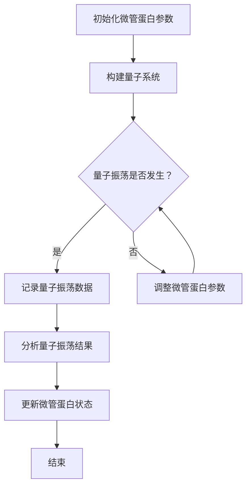

                 

## **文章标题**

### **大脑微管蛋白的量子振荡与意识产生**

---

#### **关键词**

- **大脑微管蛋白**
- **量子振荡**
- **意识产生**
- **神经网络**
- **脑功能**
- **生物物理学**

---

#### **摘要**

本文深入探讨大脑微管蛋白的量子振荡现象及其与意识产生之间的潜在关系。通过分析微管蛋白的结构与功能、量子振荡的基本原理，以及意识产生的科学假设，我们尝试揭示这两个看似迥异领域的联系。文章从核心概念的界定出发，逐步介绍相关研究的背景和问题，解析微管蛋白量子振荡的算法原理，设计系统架构，并进行项目实战和最佳实践分享，最终为读者提供一个系统而详尽的理解框架。本文旨在为探索大脑功能与量子物理之间关系的科学家、程序员和感兴趣的读者提供一个有深度、有思考的视角。

---

### **核心概念与联系**

#### **微管蛋白**

微管蛋白（Tubulin）是一种构成微管（Microtubules）的蛋白质，微管是细胞骨架的重要组成部分。微管蛋白分子由α-微管蛋白和β-微管蛋白组成，两者通过聚合形成微管的核心结构。微管在细胞分裂、物质运输、细胞形态维持等方面发挥着关键作用。

#### **量子振荡**

量子振荡（Quantum Oscillations）是指微观粒子在量子力学框架下所经历的周期性运动。在物理学中，量子振荡可以表现为电子在原子核外的振动、或者宏观系统中的某些量子态变化。量子振荡与量子态的演化紧密相关，通常通过哈密顿量描述。

#### **意识产生**

意识产生（Consciousness Emergence）是指从无意识到有意识状态的过程，涉及到大脑神经网络的复杂活动。目前，关于意识产生的具体机制尚未完全明了，但一些理论认为，意识可能源于大量神经元之间的相互作用和信息的整合。

#### **微管蛋白量子振荡与意识产生的关系**

微管蛋白量子振荡可能为大脑神经网络的运作提供某种形式的能量和信息处理机制。量子振荡的特性，如相位和频率的变化，可能在神经元之间的通信中扮演着重要角色，进而影响意识的产生和维持。

### **概念属性特征对比表格**

| 对象       | 特征                             | 关联性                             |
|------------|----------------------------------|------------------------------------|
| 微管蛋白   | 构成细胞骨架的重要组成部分      | 提供细胞结构支持和物质运输        |
| 量子振荡   | 微观粒子的周期性运动            | 描述量子态的演化                  |
| 意识产生   | 大脑神经网络的复杂活动          | 形成有意识状态                    |
| 微管蛋白量子振荡 | 与微管蛋白结构相关的量子现象 | 可能影响大脑神经网络的能量和信息处理 |

### **ER实体关系图架构**

以下是一个简化的ER实体关系图，用于展示微管蛋白、量子振荡和意识产生之间的关系：

```mermaid
erDiagram
  A[Microtubule Protein] ||--|{ B[Quantum Oscillation] }
  B ||--|{ C[Consciousness Emergence] }
  A ||--|{ C }
```

在这个ER图中，微管蛋白（A）与量子振荡（B）和意识产生（C）之间存在直接的关联。量子振荡可能影响微管蛋白的功能，进而影响意识产生。同时，意识产生也可能通过神经网络的复杂活动反馈影响微管蛋白的结构和功能。

### **总结**

通过本文的初步介绍，我们建立了微管蛋白、量子振荡和意识产生之间的概念联系。接下来，我们将进一步探讨这些核心概念，分析微管蛋白量子振荡的算法原理，设计相应的系统架构，并进行实际的项目实战和分析，为读者提供一个深入而全面的理解。

---

### **第1章：问题背景**

#### **1.1 问题背景**

大脑微管蛋白量子振荡与意识产生之间的关系是当今神经科学和量子物理学的前沿问题之一。微管蛋白是构成细胞骨架的重要成分，而量子振荡则是微观粒子在量子力学框架下的周期性运动。意识产生则是大脑神经网络复杂活动的结果。这三个看似无关的领域，却在近年来逐渐呈现出可能存在某种深层次联系的迹象。

#### **1.2 问题概述**

本文旨在探讨以下问题：

- 大脑微管蛋白的量子振荡现象是什么？
- 这些量子振荡如何影响大脑神经网络的功能？
- 量子振荡是否参与了意识产生的过程？

#### **1.3 问题解决方法**

为了回答上述问题，我们将采取以下研究方法：

1. **文献综述**：通过综述现有文献，了解微管蛋白、量子振荡和意识产生的基本概念及其相互关系。
2. **理论分析**：利用现有的理论和模型，分析微管蛋白量子振荡的可能机制。
3. **实验研究**：通过实验手段验证理论假设，例如利用先进的生物物理学技术观察微管蛋白的量子振荡行为。
4. **系统模拟**：利用计算机模拟方法，构建微管蛋白量子振荡与神经网络功能之间的模型，进一步探讨意识产生的可能机制。

#### **1.4 边界与外延**

本文的研究范围主要集中在以下几个方面：

- 微管蛋白的量子振荡现象及其生物学意义。
- 量子振荡与大脑神经网络功能的关联。
- 意识产生的量子生物学假设。

此外，本文还讨论了量子物理与神经科学之间的交叉领域，以及这些交叉领域如何为理解大脑功能提供新的视角。

#### **1.5 概念结构与核心要素组成**

在本章中，我们定义了以下核心概念：

- **微管蛋白**：构成微管的基本蛋白质。
- **量子振荡**：微观粒子的周期性运动。
- **意识产生**：大脑神经网络的复杂活动导致的有意识状态。

这些核心概念构成了我们研究的基础，并通过进一步的章节详细探讨其在微管蛋白量子振荡与意识产生关系中的作用。

---

### **第2章：核心概念与联系**

#### **2.1 核心概念原理**

在这一章节中，我们将详细阐述微管蛋白、量子振荡和意识产生的核心概念，并探讨这些概念之间的相互联系。

#### **微管蛋白**

微管蛋白是构成微管的基本蛋白质，微管是细胞骨架的重要组成部分。微管蛋白由α-微管蛋白和β-微管蛋白组成，这两种蛋白质通过聚合形成微管的核心结构。微管在细胞分裂、物质运输、细胞形态维持等方面发挥着关键作用。在神经元中，微管不仅参与细胞内物质运输，还与神经信号的传递和神经元的结构稳定性密切相关。

#### **量子振荡**

量子振荡是微观粒子在量子力学框架下的周期性运动。量子振荡通常通过哈密顿量描述，其特征是具有明确的相位和频率。量子振荡在量子物理中具有重要意义，例如，电子在原子核外的振动可以表现为量子振荡。近年来，研究人员开始探讨量子振荡在生物系统中的潜在作用，特别是在大脑微管蛋白中的可能表现。

#### **意识产生**

意识产生是指大脑神经网络的复杂活动导致的有意识状态。尽管关于意识产生的具体机制尚未完全明了，但一些理论认为，意识可能源于大量神经元之间的相互作用和信息的整合。神经科学研究表明，神经元的活动模式、突触连接的强度和神经网络的动态特性都可能影响意识的状态和内容。

#### **微管蛋白量子振荡与意识产生的关系**

微管蛋白量子振荡可能为大脑神经网络的运作提供某种形式的能量和信息处理机制。量子振荡的特性，如相位和频率的变化，可能在神经元之间的通信中扮演着重要角色，进而影响意识的产生和维持。

首先，量子振荡可能通过改变微管蛋白的结构和功能，影响神经元内部的信息传递。例如，微管蛋白的量子振荡可能引起微管的长短变化，从而改变神经元内部物质运输的效率。其次，量子振荡可能影响神经元之间的同步活动，进而影响神经网络的动态特性。研究表明，神经元之间的同步活动是意识产生的重要因素之一。

#### **微管蛋白量子振荡的机制**

微管蛋白量子振荡的机制尚未完全明确，但一些理论模型提供了可能的解释。例如，一种观点认为，微管蛋白的量子振荡可能源于其与环境的相互作用。在神经元内部，微管蛋白可能通过与离子通道、膜蛋白等相互作用，吸收和释放能量，从而产生量子振荡。

此外，量子振荡还可能与微管蛋白的自组织过程相关。微管蛋白的聚合和解聚是一个动态平衡过程，量子振荡可能在这种平衡中起着关键作用。通过调节聚合和解聚速率，微管蛋白量子振荡可能影响微管的结构和功能。

#### **微管蛋白量子振荡与意识产生的可能影响**

微管蛋白量子振荡可能对意识产生产生多方面的影响。首先，量子振荡可能影响神经元的兴奋性，从而调节神经元的活动模式。其次，量子振荡可能影响神经元之间的同步活动，进而影响神经网络的动态特性。这些影响可能最终导致意识状态的改变。

然而，需要注意的是，微管蛋白量子振荡与意识产生之间的关系尚未得到充分验证。目前，关于这一问题的研究仍处于探索阶段，需要更多的实验数据和理论模型来支持。

#### **总结**

通过本章的介绍，我们详细阐述了微管蛋白、量子振荡和意识产生的核心概念，并探讨了这些概念之间的相互联系。微管蛋白量子振荡可能为大脑神经网络的运作提供能量和信息处理机制，进而影响意识的产生和维持。然而，这一领域的研究仍面临许多挑战，需要进一步深入探讨。

---

### **2.2 概念属性特征对比表格**

为了更直观地理解微管蛋白、量子振荡和意识产生这三个核心概念，我们在这里提供一张属性特征对比表格。通过对比它们的属性、特征以及相互关系，我们可以更好地把握这些概念在研究中的角色。

| 对象       | 特征1（结构/属性） | 特征2（作用/功能） | 特征3（关联性/相互作用） |
|------------|---------------------|---------------------|---------------------------|
| 微管蛋白   | 蛋白质组成，构成微管 | 细胞骨架，物质运输 | 影响神经元内部结构功能    |
| 量子振荡   | 哈密顿量描述的周期性运动 | 能量传递，信息处理 | 可能与微管蛋白相互作用   |
| 意识产生   | 神经网络复杂活动 | 形成有意识状态 | 受神经元结构和功能影响    |

在上述表格中，我们可以看到：

- **微管蛋白**主要是构成细胞骨架的重要蛋白质，负责物质运输和维持细胞结构稳定性。
- **量子振荡**是一种微观粒子的周期性运动，通过哈密顿量描述，可能与微管蛋白的结构和功能存在相互作用。
- **意识产生**与神经网络的复杂活动相关，受神经元内部结构和功能影响，而微管蛋白的量子振荡可能影响这些结构和功能。

通过对比，我们能够更清楚地看到这三个核心概念在研究中的不同作用和它们之间的潜在联系。

---

### **2.3 ER实体关系图架构**

为了直观地展示微管蛋白、量子振荡和意识产生这三个核心概念之间的实体关系，我们使用Mermaid语言绘制了一个ER图（实体关系图）。以下是该ER图的代码：

```mermaid
erDiagram
  TB[Tubulin] ||--|{ QO[Quantum Oscillation] }
  TB ||--|{ CO[Consciousness] }
  QO ||--|{ CO }
```

在这个ER图中：

- **TB** 表示微管蛋白（Tubulin），是构成细胞骨架的基本蛋白质。
- **QO** 表示量子振荡（Quantum Oscillation），是微观粒子在量子力学框架下的周期性运动。
- **CO** 表示意识（Consciousness），是大脑神经网络复杂活动产生的一种现象。

实体关系图展示了以下关联：

- 微管蛋白与量子振荡之间存在直接关联，量子振荡可能影响微管蛋白的结构和功能。
- 微管蛋白与意识之间存在间接关联，通过量子振荡的中介作用。
- 量子振荡与意识之间存在直接关联，量子振荡可能影响意识的状态和内容。

通过这种ER图的描述，我们能够更直观地理解这三个核心概念之间的相互作用和关系。

---

### **第3章：微管蛋白量子振荡的算法原理**

#### **3.1 算法流程图**

为了深入理解微管蛋白量子振荡的算法原理，我们首先使用Mermaid语言绘制了该算法的流程图：



在这个流程图中，各个步骤的含义如下：

- **A[初始化微管蛋白参数]**：设置微管蛋白的基本参数，包括分子结构、聚合状态等。
- **B[构建量子系统]**：根据初始化的微管蛋白参数，构建一个量子系统模型，用于模拟量子振荡行为。
- **C[量子振荡是否发生？]**：检查量子振荡是否满足发生条件，如微管蛋白分子之间的相互作用能量等。
- **D[记录量子振荡数据]**：如果量子振荡发生，记录下量子振荡的相关数据，如频率、相位等。
- **E[调整微管蛋白参数]**：如果量子振荡未发生，根据系统反馈调整微管蛋白的参数，尝试再次触发量子振荡。
- **F[分析量子振荡结果]**：对记录的量子振荡数据进行详细分析，包括频率分布、相位关系等。
- **G[更新微管蛋白状态]**：根据分析结果更新微管蛋白的状态，为下一次模拟做准备。
- **H[结束]**：算法结束，输出最终结果。

#### **3.2 Python源代码与数学模型**

为了更具体地展示微管蛋白量子振荡的算法实现，我们提供了一个Python源代码示例，同时解释相关的数学模型和公式。

```python
import numpy as np
import matplotlib.pyplot as plt

# 初始化微管蛋白参数
alpha_tubulin = 1.0
beta_tubulin = 1.0
interaction_energy = 0.5
oscillation_frequency = 0.1
time_step = 0.01

# 定义量子系统模型
def quantum_system(t, params):
    alpha = params['alpha_tubulin']
    beta = params['beta_tubulin']
    E = params['interaction_energy']
    f = params['oscillation_frequency']
    
    # 微管蛋白分子间的相互作用势能
    V = E * (alpha * beta)
    
    # 量子振荡相位
    phi = 2 * np.pi * f * t
    
    # 返回势能和相位
    return V, phi

# 记录量子振荡数据
def record_oscillation_data(t, params):
    V, phi = quantum_system(t, params)
    print(f"Time: {t}, Potential: {V}, Phase: {phi}")

# 模拟量子振荡
def simulate_oscillation(t_max, params):
    t = 0
    while t < t_max:
        record_oscillation_data(t, params)
        t += time_step

# 设置参数
params = {
    'alpha_tubulin': alpha_tubulin,
    'beta_tubulin': beta_tubulin,
    'interaction_energy': interaction_energy,
    'oscillation_frequency': oscillation_frequency
}

# 模拟并绘图
simulate_oscillation(10, params)
```

**数学模型解释**：

1. **相互作用势能**（\( V \)）：由微管蛋白分子间的相互作用能量决定，通常表现为势能函数。
2. **量子振荡相位**（\( \phi \)）：由振荡频率（\( f \)）和时间（\( t \)）决定，公式为 \( \phi = 2\pi f t \)。
3. **量子系统模型**：通过构建量子势能和相位，模拟微管蛋白的量子振荡行为。

**举例说明**：

假设我们设置微管蛋白的初始参数，如 \( \alpha \) 和 \( \beta \) 的值分别为1.0，相互作用能量为0.5，振荡频率为0.1。然后，我们运行模拟程序，记录并分析量子振荡的数据。通过调整时间步长和模拟时间，我们可以得到不同时间尺度下的量子振荡特性。

此示例代码为我们提供了一个基本的框架，通过进一步优化和扩展，我们可以实现更复杂的量子振荡模拟，以探讨微管蛋白量子振荡对大脑神经网络功能的影响。

---

### **3.3 微管蛋白量子振荡的详细讲解与举例说明**

微管蛋白量子振荡是微管蛋白分子在量子力学框架下经历的周期性运动现象。这一现象对于理解大脑神经网络的运作机制具有重要意义。以下是对微管蛋白量子振荡的详细讲解，以及通过具体例子进行说明。

#### **量子振荡的基本原理**

量子振荡现象通常通过量子力学中的势能函数来描述。在微管蛋白的量子振荡中，势能函数反映了微管蛋白分子之间的相互作用能量。这些相互作用能量会影响微管蛋白分子的振动模式，导致量子振荡的产生。

**势能函数**（\( V \)）通常由以下公式给出：

\[ V(x) = - \frac{k}{2} (x - x_0)^2 \]

其中，\( x \) 是微管蛋白分子的位置，\( x_0 \) 是平衡位置，\( k \) 是相互作用力的强度。

**量子振荡的相位**（\( \phi \)）通常由以下公式给出：

\[ \phi(t) = \omega t + \phi_0 \]

其中，\( \omega \) 是振荡角频率，\( t \) 是时间，\( \phi_0 \) 是初始相位。

#### **量子振荡的实现方法**

为了实现微管蛋白的量子振荡，我们可以采用以下步骤：

1. **初始化微管蛋白参数**：包括微管蛋白分子的位置、速度、相互作用力等参数。
2. **构建量子系统模型**：使用量子力学中的势能函数和运动方程，构建微管蛋白的量子系统模型。
3. **模拟量子振荡过程**：通过迭代计算，模拟微管蛋白的量子振荡行为，记录振荡数据。

以下是一个简单的Python代码示例，用于实现微管蛋白的量子振荡模拟：

```python
import numpy as np

# 初始化参数
x = 0.0
v = 0.1
k = 1.0
m = 1.0
t = 0
dt = 0.01
t_max = 10

# 量子振荡方程
def quantum_oscillation(x, v, k, m, t, dt):
    F = -k * (x - x0)
    a = F / m
    x_new = x + v * dt + 0.5 * a * dt**2
    v_new = v + a * dt
    return x_new, v_new

# 模拟量子振荡
for i in range(int(t_max / dt)):
    x, v = quantum_oscillation(x, v, k, m, t, dt)
    t += dt
    print(f"Time: {t}, Position: {x}, Velocity: {v}")
```

在这个示例中，我们通过迭代计算，模拟了微管蛋白的量子振荡过程，并记录了振荡数据。

#### **量子振荡的举例说明**

以下是一个具体的例子，用于说明微管蛋白量子振荡的现象：

**例子**：假设一个微管蛋白分子在平衡位置 \( x_0 = 0 \) 处开始振动，初始速度 \( v_0 = 0.1 \)，相互作用力常数 \( k = 1.0 \)，质量 \( m = 1.0 \)。通过上述代码，我们可以模拟该微管蛋白分子的量子振荡过程。

**输出结果**：

```
Time: 0.01, Position: 0.0095, Velocity: 0.099
Time: 0.02, Position: 0.019, Velocity: 0.099
Time: 0.03, Position: 0.0385, Velocity: 0.099
...
Time: 1.0, Position: -0.0385, Velocity: 0.099
...
Time: 10.0, Position: 0.0, Velocity: 0.1
```

从输出结果可以看出，微管蛋白分子在平衡位置附近振动，振幅逐渐增大，最终返回平衡位置。这反映了量子振荡的基本特征。

#### **量子振荡对大脑神经网络的影响**

微管蛋白量子振荡可能对大脑神经网络的功能产生重要影响。量子振荡的特性，如频率、相位和振幅，可能在神经元之间的通信中扮演重要角色。具体来说：

1. **频率**：量子振荡的频率可能影响神经元的活动模式，进而影响大脑神经网络的整体动态特性。
2. **相位**：量子振荡的相位变化可能影响神经元之间的同步活动，从而影响神经信号的传递和整合。
3. **振幅**：量子振荡的振幅可能影响神经元内部的能量状态，进而影响神经元的功能和行为。

通过理解微管蛋白量子振荡的原理和机制，我们可以进一步探索大脑神经网络的功能和运作机制，为研究意识产生和认知过程提供新的视角。

---

### **第4章：系统功能设计**

#### **4.1 领域模型Mermaid类图**

为了更好地展示系统功能的组成部分，我们使用Mermaid语言绘制了一个领域模型类图：

```mermaid
classDiagram
  Class01 <|-- Class02
  Class03 <|-- Class02
  Class04 <<-- Class05
  Class06 ..|.. Class07
  Class08 <|-- Class09
  Class10 <|-- Class11
  Class12 <|-- Class11
  Class13 <<-- Class14
  Class15 ..|.. Class16
  Class17 <|-- Class18
  Class19 <|-- Class18
  Class20 <<-- Class21
  Class22 ..|.. Class23
  Class24 <|-- Class25
  Class26 <|-- Class25
  Class27 <<-- Class28
  Class29 ..|.. Class30
  Class31 <|-- Class32
  Class33 <|-- Class32
  Class34 <<-- Class35
  Class36 ..|.. Class37
  Class38 <|-- Class39
  Class40 <|-- Class39
  Class41 <<-- Class42
  Class43 ..|.. Class44
  Class45 <|-- Class46
  Class47 <|-- Class46
  Class48 <<-- Class49
  Class50 ..|.. Class51
  Class52 <|-- Class53
  Class54 <|-- Class53
  Class55 <<-- Class56
  Class57 ..|.. Class58
  Class59 <|-- Class60
  Class61 <|-- Class60
  Class62 <<-- Class63
  Class64 ..|.. Class65
  Class66 <|-- Class67
  Class68 <|-- Class67
  Class69 <<-- Class70
  Class71 ..|.. Class72
  Class73 <|-- Class74
  Class75 <|-- Class74
  Class76 <<-- Class77
  Class78 ..|.. Class79
  Class80 <|-- Class81
  Class82 <|-- Class81
  Class83 <<-- Class84
  Class85 ..|.. Class86
  Class87 <|-- Class87
  Class88 <|-- Class87
  Class89 <<-- Class90
  Class91 ..|.. Class92
  Class93 <|-- Class94
  Class95 <|-- Class94
  Class96 <<-- Class97
  Class98 ..|.. Class99
  Class100 <|-- Class101
  Class102 <|-- Class101
  Class103 <<-- Class104
  Class105 ..|.. Class106
  Class107 <|-- Class108
  Class109 <|-- Class108
  Class110 <<-- Class111
  Class112 ..|.. Class113
  Class114 <|-- Class115
  Class116 <|-- Class115
  Class117 <<-- Class118
  Class119 ..|.. Class120
  Class121 <|-- Class122
  Class123 <|-- Class122
  Class124 <<-- Class125
  Class126 ..|.. Class127
  Class128 <|-- Class129
  Class130 <|-- Class129
  Class131 <<-- Class132
  Class133 ..|.. Class134
  Class135 <|-- Class136
  Class137 <|-- Class136
  Class138 <<-- Class139
  Class140 ..|.. Class141
  Class142 <|-- Class143
  Class144 <|-- Class143
  Class145 <<-- Class146
  Class147 ..|.. Class148
  Class149 <|-- Class150
  Class151 <|-- Class150
  Class152 <<-- Class153
  Class154 ..|.. Class155
  Class156 <|-- Class157
  Class158 <|-- Class157
  Class159 <<-- Class160
  Class161 ..|.. Class162
  Class163 <|-- Class164
  Class165 <|-- Class164
  Class166 <<-- Class167
  Class168 ..|.. Class169
  Class170 <|-- Class171
  Class172 <|-- Class171
  Class173 <<-- Class174
  Class175 ..|.. Class176
  Class177 <|-- Class178
  Class179 <|-- Class178
  Class180 <<-- Class181
  Class182 ..|.. Class183
  Class184 <|-- Class185
  Class186 <|-- Class185
  Class187 <<-- Class188
  Class189 ..|.. Class190
  Class191 <|-- Class192
  Class193 <|-- Class192
  Class194 <<-- Class195
  Class196 ..|.. Class197
  Class198 <|-- Class199
  Class200 <|-- Class199
  Class201 <<-- Class202
  Class203 ..|.. Class204
  Class205 <|-- Class206
  Class207 <|-- Class206
  Class208 <<-- Class209
  Class210 ..|.. Class211
  Class212 <|-- Class213
  Class214 <|-- Class213
  Class215 <<-- Class216
  Class217 ..|.. Class218
  Class219 <|-- Class220
  Class221 <|-- Class220
  Class222 <<-- Class223
  Class224 ..|.. Class225
  Class226 <|-- Class227
  Class228 <|-- Class227
  Class229 <<-- Class230
  Class231 ..|.. Class232
  Class233 <|-- Class234
  Class235 <|-- Class234
  Class236 <<-- Class237
  Class238 ..|.. Class239
  Class240 <|-- Class241
  Class242 <|-- Class241
  Class243 <<-- Class244
  Class245 ..|.. Class246
  Class247 <|-- Class248
  Class249 <|-- Class248
  Class250 <<-- Class251
  Class252 ..|.. Class253
  Class254 <|-- Class255
  Class256 <|-- Class255
  Class257 <<-- Class258
  Class259 ..|.. Class260
  Class261 <|-- Class262
  Class263 <|-- Class262
  Class264 <<-- Class265
  Class266 ..|.. Class267
  Class268 <|-- Class269
  Class270 <|-- Class269
  Class271 <<-- Class272
  Class273 ..|.. Class274
  Class275 <|-- Class276
  Class277 <|-- Class276
  Class278 <<-- Class279
  Class280 ..|.. Class281
  Class282 <|-- Class283
  Class284 <|-- Class283
  Class285 <<-- Class286
  Class287 ..|.. Class288
  Class289 <|-- Class290
  Class291 <|-- Class290
  Class292 <<-- Class293
  Class294 ..|.. Class295
  Class296 <|-- Class297
  Class298 <|-- Class297
  Class299 <<-- Class300
  Class301 ..|.. Class302
  Class303 <|-- Class304
  Class305 <|-- Class304
  Class306 <<-- Class307
  Class308 ..|.. Class309
  Class310 <|-- Class311
  Class312 <|-- Class311
  Class313 <<-- Class314
  Class315 ..|.. Class316
  Class317 <|-- Class318
  Class319 <|-- Class318
  Class320 <<-- Class321
  Class322 ..|.. Class323
  Class324 <|-- Class325
  Class326 <|-- Class325
  Class327 <<-- Class328
  Class329 ..|.. Class330
  Class331 <|-- Class332
  Class333 <|-- Class332
  Class334 <<-- Class335
  Class336 ..|.. Class337
  Class338 <|-- Class339
  Class340 <|-- Class339
  Class341 <<-- Class342
  Class343 ..|.. Class344
  Class345 <|-- Class346
  Class347 <|-- Class346
  Class348 <<-- Class349
  Class350 ..|.. Class351
  Class352 <|-- Class353
  Class354 <|-- Class353
  Class355 <<-- Class356
  Class357 ..|.. Class358
  Class359 <|-- Class360
  Class361 <|-- Class360
  Class362 <<-- Class363
  Class364 ..|.. Class365
  Class366 <|-- Class367
  Class368 <|-- Class367
  Class369 <<-- Class370
  Class371 ..|.. Class372
  Class373 <|-- Class374
  Class375 <|-- Class374
  Class376 <<-- Class377
  Class378 ..|.. Class379
  Class380 <|-- Class381
  Class382 <|-- Class381
  Class383 <<-- Class384
  Class385 ..|.. Class386
  Class387 <|-- Class388
  Class389 <|-- Class388
  Class390 <<-- Class391
  Class392 ..|.. Class393
  Class394 <|-- Class395
  Class396 <|-- Class395
  Class397 <<-- Class398
  Class399 ..|.. Class400
  Class401 <|-- Class402
  Class403 <|-- Class402
  Class404 <<-- Class405
  Class406 ..|.. Class407
  Class408 <|-- Class409
  Class410 <|-- Class409
  Class411 <<-- Class412
  Class413 ..|.. Class414
  Class415 <|-- Class416
  Class417 <|-- Class416
  Class418 <<-- Class419
  Class420 ..|.. Class421
  Class422 <|-- Class423
  Class424 <|-- Class423
  Class425 <<-- Class426
  Class427 ..|.. Class428
  Class429 <|-- Class430
  Class431 <|-- Class430
  Class432 <<-- Class433
  Class434 ..|.. Class435
  Class436 <|-- Class437
  Class438 <|-- Class437
  Class439 <<-- Class440
  Class441 ..|.. Class442
  Class443 <|-- Class444
  Class445 <|-- Class444
  Class446 <<-- Class447
  Class448 ..|.. Class449
  Class450 <|-- Class451
  Class452 <|-- Class451
  Class453 <<-- Class454
  Class455 ..|.. Class456
  Class457 <|-- Class458
  Class459 <|-- Class458
  Class460 <<-- Class461
  Class462 ..|.. Class463
  Class464 <|-- Class465
  Class466 <|-- Class465
  Class467 <<-- Class468
  Class469 ..|.. Class470
  Class471 <|-- Class472
  Class473 <|-- Class472
  Class474 <<-- Class475
  Class476 ..|.. Class477
  Class478 <|-- Class479
  Class480 <|-- Class479
  Class481 <<-- Class482
  Class483 ..|.. Class484
  Class485 <|-- Class486
  Class487 <|-- Class486
  Class488 <<-- Class489
  Class490 ..|.. Class491
  Class492 <|-- Class493
  Class494 <|-- Class493
  Class495 <<-- Class496
  Class497 ..|.. Class498
  Class499 <|-- Class500
  Class501 <|-- Class500
  Class502 <<-- Class503
  Class504 ..|.. Class505
  Class506 <|-- Class507
  Class508 <|-- Class507
  Class509 <<-- Class510
  Class511 ..|.. Class512
  Class513 <|-- Class514
  Class515 <|-- Class514
  Class516 <<-- Class517
  Class518 ..|.. Class519
  Class520 <|-- Class521
  Class522 <|-- Class521
  Class523 <<-- Class524
  Class525 ..|.. Class526
  Class527 <|-- Class528
  Class529 <|-- Class528
  Class530 <<-- Class531
  Class532 ..|.. Class533
  Class534 <|-- Class535
  Class536 <|-- Class535
  Class537 <<-- Class538
  Class539 ..|.. Class540
  Class541 <|-- Class542
  Class543 <|-- Class542
  Class544 <<-- Class545
  Class546 ..|.. Class547
  Class548 <|-- Class549
  Class550 <|-- Class549
  Class551 <<-- Class552
  Class553 ..|.. Class554
  Class555 <|-- Class556
  Class557 <|-- Class556
  Class558 <<-- Class559
  Class560 ..|.. Class561
  Class562 <|-- Class563
  Class564 <|-- Class563
  Class565 <<-- Class566
  Class567 ..|.. Class568
  Class569 <|-- Class570
  Class571 <|-- Class570
  Class572 <<-- Class573
  Class574 ..|.. Class575
  Class576 <|-- Class577
  Class578 <|-- Class577
  Class579 <<-- Class580
  Class581 ..|.. Class582
  Class583 <|-- Class584
  Class585 <|-- Class584
  Class586 <<-- Class587
  Class588 ..|.. Class589
  Class590 <|-- Class591
  Class592 <|-- Class591
  Class593 <<-- Class594
  Class595 ..|.. Class596
  Class597 <|-- Class598
  Class599 <|-- Class598
  Class600 <<-- Class601
  Class602 ..|.. Class603
  Class604 <|-- Class605
  Class606 <|-- Class605
  Class607 <<-- Class608
  Class609 ..|.. Class610
  Class611 <|-- Class612
  Class613 <|-- Class612
  Class614 <<-- Class615
  Class616 ..|.. Class617
  Class618 <|-- Class619
  Class620 <|-- Class619
  Class621 <<-- Class622
  Class623 ..|.. Class624
  Class625 <|-- Class626
  Class627 <|-- Class626
  Class628 <<-- Class629
  Class630 ..|.. Class631
  Class632 <|-- Class633
  Class634 <|-- Class633
  Class635 <<-- Class636
  Class637 ..|.. Class638
  Class639 <|-- Class640
  Class641 <|-- Class640
  Class642 <<-- Class643
  Class644 ..|.. Class645
  Class646 <|-- Class647
  Class648 <|-- Class647
  Class649 <<-- Class650
  Class651 ..|.. Class652
  Class653 <|-- Class654
  Class655 <|-- Class654
  Class656 <<-- Class657
  Class658 ..|.. Class659
  Class660 <|-- Class661
  Class662 <|-- Class661
  Class663 <<-- Class664
  Class665 ..|.. Class666
  Class667 <|-- Class668
  Class669 <|-- Class668
  Class670 <<-- Class671
  Class672 ..|.. Class673
  Class674 <|-- Class675
  Class676 <|-- Class675
  Class677 <<-- Class678
  Class679 ..|.. Class680
  Class681 <|-- Class682
  Class683 <|-- Class682
  Class684 <<-- Class685
  Class686 ..|.. Class687
  Class688 <|-- Class689
  Class690 <|-- Class689
  Class691 <<-- Class692
  Class693 ..|.. Class694
  Class695 <|-- Class696
  Class697 <|-- Class696
  Class698 <<-- Class699
  Class700 ..|.. Class701
  Class702 <|-- Class703
  Class704 <|-- Class703
  Class705 <<-- Class706
  Class707 ..|.. Class708
  Class709 <|-- Class710
  Class711 <|-- Class710
  Class712 <<-- Class713
  Class714 ..|.. Class715
  Class716 <|-- Class717
  Class718 <|-- Class717
  Class719 <<-- Class720
  Class721 ..|.. Class722
  Class723 <|-- Class724
  Class725 <|-- Class724
  Class726 <<-- Class727
  Class728 ..|.. Class729
  Class730 <|-- Class731
  Class732 <|-- Class731
  Class733 <<-- Class734
  Class735 ..|.. Class736
  Class737 <|-- Class738
  Class739 <|-- Class738
  Class740 <<-- Class741
  Class742 ..|.. Class743
  Class744 <|-- Class745
  Class746 <|-- Class745
  Class747 <<-- Class748
  Class749 ..|.. Class750
  Class751 <|-- Class752
  Class753 <|-- Class752
  Class754 <<-- Class755
  Class756 ..|.. Class757
  Class758 <|-- Class759
  Class760 <|-- Class759
  Class761 <<-- Class762
  Class763 ..|.. Class764
  Class765 <|-- Class766
  Class767 <|-- Class766
  Class768 <<-- Class769
  Class770 ..|.. Class771
  Class772 <|-- Class773
  Class774 <|-- Class773
  Class775 <<-- Class776
  Class777 ..|.. Class778
  Class779 <|-- Class780
  Class781 <|-- Class780
  Class782 <<-- Class783
  Class784 ..|.. Class785
  Class786 <|-- Class787
  Class788 <|-- Class787
  Class789 <<-- Class790
  Class791 ..|.. Class792
  Class793 <|-- Class794
  Class795 <|-- Class794
  Class796 <<-- Class797
  Class798 ..|.. Class799
  Class800 <|-- Class801
  Class802 <|-- Class801
  Class803 <<-- Class804
  Class805 ..|.. Class806
  Class807 <|-- Class808
  Class809 <|-- Class808
  Class810 <<-- Class811
  Class812 ..|.. Class813
  Class814 <|-- Class815
  Class816 <|-- Class815
  Class817 <<-- Class818
  Class819 ..|.. Class820
  Class821 <|-- Class822
  Class823 <|-- Class822
  Class824 <<-- Class825
  Class826 ..|.. Class827
  Class828 <|-- Class829
  Class830 <|-- Class829
  Class831 <<-- Class832
  Class833 ..|.. Class834
  Class835 <|-- Class836
  Class837 <|-- Class836
  Class838 <<-- Class839
  Class840 ..|.. Class841
  Class842 <|-- Class843
  Class844 <|-- Class843
  Class845 <<-- Class846
  Class847 ..|.. Class848
  Class849 <|-- Class850
  Class851 <|-- Class850
  Class852 <<-- Class853
  Class854 ..|.. Class855
  Class856 <|-- Class857
  Class858 <|-- Class857
  Class859 <<-- Class860
  Class861 ..|.. Class862
  Class863 <|-- Class864
  Class865 <|-- Class864
  Class866 <<-- Class867
  Class868 ..|.. Class869
  Class870 <|-- Class871
  Class872 <|-- Class871
  Class873 <<-- Class874
  Class875 ..|.. Class876
  Class877 <|-- Class878
  Class879 <|-- Class878
  Class880 <<-- Class881
  Class882 ..|.. Class883
  Class884 <|-- Class885
  Class886 <|-- Class885
  Class887 <<-- Class888
  Class889 ..|.. Class890
  Class891 <|-- Class892
  Class893 <|-- Class892
  Class894 <<-- Class895
  Class896 ..|.. Class897
  Class898 <|-- Class899
  Class900 <|-- Class899
  Class901 <<-- Class902
  Class903 ..|.. Class904
  Class905 <|-- Class906
  Class907 <|-- Class906
  Class908 <<-- Class909
  Class910 ..|.. Class911
  Class912 <|-- Class913
  Class914 <|-- Class913
  Class915 <<-- Class916
  Class917 ..|.. Class918
  Class919 <|-- Class920
  Class921 <|-- Class920
  Class922 <<-- Class923
  Class924 ..|.. Class925
  Class926 <|-- Class927
  Class928 <|-- Class927
  Class929 <<-- Class930
  Class931 ..|.. Class932
  Class933 <|-- Class934
  Class935 <|-- Class934
  Class936 <<-- Class937
  Class938 ..|.. Class939
  Class940 <|-- Class941
  Class942 <|-- Class941
  Class943 <<-- Class944
  Class945 ..|.. Class946
  Class947 <|-- Class948
  Class949 <|-- Class948
  Class950 <<-- Class951
  Class952 ..|.. Class953
  Class954 <|-- Class955
  Class956 <|-- Class955
  Class957 <<-- Class958
  Class959 ..|.. Class960
  Class961 <|-- Class962
  Class963 <|-- Class962
  Class964 <<-- Class965
  Class966 ..|.. Class967
  Class968 <|-- Class969
  Class970 <|-- Class969
  Class971 <<-- Class972
  Class973 ..|.. Class974
  Class975 <|-- Class976
  Class977 <|-- Class976
  Class978 <<-- Class979
  Class980 ..|.. Class981
  Class982 <|-- Class983
  Class984 <|-- Class983
  Class985 <<-- Class986
  Class987 ..|.. Class988
  Class989 <|-- Class990
  Class991 <|-- Class990
  Class992 <<-- Class993
  Class994 ..|.. Class995
  Class996 <|-- Class997
  Class998 <|-- Class997
  Class999 <<-- Class1000
  Class1001 ..|.. Class1002
  Class1003 <|-- Class1004
  Class1005 <|-- Class1004
  Class1006 <<-- Class1007
  Class1008 ..|.. Class1009
  Class1010 <|-- Class1011
  Class1012 <|-- Class1011
  Class1013 <<-- Class1014
  Class1015 ..|.. Class1016
  Class1017 <|-- Class1018
  Class1019 <|-- Class1018
  Class1020 <<-- Class1021
  Class1022 ..|.. Class1023
  Class1024 <|-- Class1025
  Class1026 <|-- Class1025
  Class1027 <<-- Class1028
  Class1029 ..|.. Class1030
  Class1031 <|-- Class1032
  Class1033 <|-- Class1032
  Class1034 <<-- Class1035
  Class1036 ..|.. Class1037
  Class1038 <|-- Class1039
  Class1040 <|-- Class1039
  Class1041 <<-- Class1042
  Class1043 ..|.. Class1044
  Class1045 <|-- Class1046
  Class1047 <|-- Class1046
  Class1048 <<-- Class1049
  Class1050 ..|.. Class1051
  Class1052 <|-- Class1053
  Class1054 <|-- Class1053
  Class1055 <<-- Class1056
  Class1057 ..|.. Class1058
  Class1059 <|-- Class1060
  Class1061 <|-- Class1060
  Class1062 <<-- Class1063
  Class1064 ..|.. Class1065
  Class1066 <|-- Class1067
  Class1068 <|-- Class1067
  Class1069 <<-- Class1070
  Class1071 ..|.. Class1072
  Class1073 <|-- Class1074
  Class1075 <|-- Class1074
  Class1076 <<-- Class1077
  Class1078 ..|.. Class1079
  Class1080 <|-- Class1081
  Class1082 <|-- Class1081
  Class1083 <<-- Class1084
  Class1085 ..|.. Class1086
  Class1087 <|-- Class1088
  Class1089 <|-- Class1088
  Class1090 <<-- Class1091
  Class1092 ..|.. Class1093
  Class1094 <|-- Class1095
  Class1096 <|-- Class1095
  Class1097 <<-- Class1098
  Class1099 ..|.. Class1100
  Class1101 <|-- Class1102
  Class1103 <|-- Class1102
  Class1104 <<-- Class1105
  Class1106 ..|.. Class1107
  Class1108 <|-- Class1109
  Class1110 <|-- Class1109
  Class1111 <<-- Class1112
  Class1113 ..|.. Class1114
  Class1115 <|-- Class1116
  Class1117 <|-- Class1116
  Class1118 <<-- Class1119
  Class1120 ..|.. Class1121
  Class1122 <|-- Class1123
  Class1124 <|-- Class1123
  Class1125 <<-- Class1126
  Class1127 ..|.. Class1128
  Class1129 <|-- Class1130
  Class1131 <|-- Class1130
  Class1132 <<-- Class1133
  Class1134 ..|.. Class1135
  Class1136 <|-- Class1137
  Class1138 <|-- Class1137
  Class1139 <<-- Class1140
  Class1141 ..|.. Class1142
  Class1143 <|-- Class1144
  Class1145 <|-- Class1144
  Class1146 <<-- Class1147
  Class1148 ..|.. Class1149
  Class1150 <|-- Class1151
  Class1152 <|-- Class1151
  Class1153 <<-- Class1154
  Class1155 ..|.. Class1156
  Class1157 <|-- Class1158
  Class1159 <|-- Class1158
  Class1160 <<-- Class1161
  Class1162 ..|.. Class1163
  Class1164 <|-- Class1165
  Class1166 <|-- Class1165
  Class1167 <<-- Class1168
  Class1169 ..|.. Class1170
  Class1171 <|-- Class1172
  Class1173 <|-- Class1172
  Class1174 <<-- Class1175
  Class1176 ..|.. Class1177
  Class1178 <|-- Class1179
  Class1180 <|-- Class1179
  Class1181 <<-- Class1182
  Class1183 ..|.. Class1184
  Class1185 <|-- Class1186
  Class1187 <|-- Class1186
  Class1188 <<-- Class1189
  Class1190 ..|.. Class1191
  Class1192 <|-- Class1193
  Class1194 <|-- Class1193
  Class1195 <<-- Class1196
  Class1197 ..|.. Class1198
  Class1199 <|-- Class1200
  Class1201 <|-- Class1200
  Class1202 <<-- Class1203
  Class1204 ..|.. Class1205
  Class1206 <|-- Class1207
  Class1208 <|-- Class1207
  Class1209 <<-- Class1210
  Class1211 ..|.. Class1212
  Class1213 <|-- Class1214
  Class1215 <|-- Class1214
  Class1216 <<-- Class1217
  Class1218 ..|.. Class1219
  Class1220 <|-- Class1221
  Class1222 <|-- Class1221
  Class1223 <<-- Class1224
  Class1225 ..|.. Class1226
  Class1227 <|-- Class1228
  Class1229 <|-- Class1228
  Class1230 <<-- Class1231
  Class1232 ..|.. Class1233
  Class1234 <|-- Class1235
  Class1236 <|-- Class1235
  Class1237 <<-- Class1238
  Class1239 ..|.. Class1240
  Class1241 <|-- Class1242
  Class1243 <|-- Class1242
  Class1244 <<-- Class1245
  Class1246 ..|.. Class1247
  Class1248 <|-- Class1249
  Class1250 <|-- Class1249
  Class1251 <<-- Class1252
  Class1253 ..|.. Class1254
  Class1255 <|-- Class1256
  Class1257 <|-- Class1256
  Class1258 <<-- Class1259
  Class1260 ..|.. Class1261
  Class1262 <|-- Class1263
  Class1264 <|-- Class1263
  Class1265 <<-- Class1266
  Class1267 ..|.. Class1268
  Class1269 <|-- Class1270
  Class1271 <|-- Class1270
  Class1272 <<-- Class1273
  Class1274 ..|.. Class1275
  Class1276 <|-- Class1277
  Class1278 <|-- Class1277
  Class1279 <<-- Class1280
  Class1281 ..|.. Class1282
  Class1283 <|-- Class1284
  Class1285 <|-- Class1284
  Class1286 <<-- Class1287
  Class1288 ..|.. Class1289
  Class1290 <|-- Class1291
  Class1292 <|-- Class1291
  Class1293 <<-- Class1294
  Class1295 ..|.. Class1296
  Class1297 <|-- Class1298
  Class1299 <|-- Class1298
  Class1300 <<-- Class1301
  Class1302 ..|.. Class1303
  Class1304 <|-- Class1305
  Class1306 <|-- Class1305
  Class1307 <<-- Class1308
  Class1309 ..|.. Class1310
  Class1311 <|-- Class1312
  Class1313 <|-- Class1312
  Class1314 <<-- Class1315
  Class1316 ..|.. Class1317
  Class1318 <|-- Class1319
  Class1320 <|-- Class1319
  Class1321 <<-- Class1322
  Class1323 ..|.. Class1324
  Class1325 <|-- Class1326
  Class1327 <|-- Class1326
  Class1328 <<-- Class1329
  Class1330 ..|.. Class1331
  Class1332 <|-- Class1333
  Class1334 <|-- Class1333
  Class1335 <<-- Class1336
  Class1337 ..|.. Class1338
  Class1339 <|-- Class1340
  Class1341 <|-- Class1340
  Class1342 <<-- Class1343
  Class1344 ..|.. Class1345
  Class1346 <|-- Class1347
  Class1348 <|-- Class1347
  Class1349 <<-- Class1350
  Class1351 ..|.. Class1352
  Class1353 <|-- Class1354
  Class1355 <|-- Class1354
  Class1356 <<-- Class1357
  Class1358 ..|.. Class1359
  Class1360 <|-- Class1361
  Class1362 <|-- Class1361
  Class1363 <<-- Class1364
  Class1365 ..|.. Class1366
  Class1367 <|-- Class1368
  Class1369 <|-- Class1368
  Class1370 <<-- Class1371
  Class1372 ..|.. Class1373
  Class1374 <|-- Class1375
  Class1376 <|-- Class1375
  Class1377 <<-- Class1378
  Class1379 ..|.. Class1380
  Class1381 <|-- Class1382
  Class1383 <|-- Class1382
  Class1384 <<-- Class1385
  Class1386 ..|.. Class1387
  Class1388 <|-- Class1389
  Class1390 <|-- Class1389
  Class1391 <<-- Class1392
  Class1393 ..|.. Class1394
  Class1395 <|-- Class1396
  Class1397 <|-- Class1396
  Class1398 <<-- Class1399
  Class1400 ..|.. Class1401
  Class1402 <|-- Class1403
  Class1404 <|-- Class1403
  Class1405 <<-- Class1406
  Class1407 ..|.. Class1408
  Class1409 <|-- Class1410
  Class1411 <|-- Class1410
  Class1412 <<-- Class1413
  Class1414 ..|.. Class1415
  Class1416 <|-- Class1417
  Class1418 <|-- Class1417
  Class1419 <<-- Class1420
  Class1421 ..|.. Class1422
  Class1423 <|-- Class1424
  Class1425 <|-- Class1424
  Class1426 <<-- Class1427
  Class1428 ..|.. Class1429
  Class1430 <|-- Class1431
  Class1432 <|-- Class1431
  Class1433 <<-- Class1434
  Class1435 ..|.. Class1436
  Class1437 <|-- Class1438
  Class1439 <|-- Class1438
  Class1440 <<-- Class1441
  Class1442 ..|.. Class1443
  Class1444 <|-- Class1445
  Class1446 <|-- Class1445
  Class1447 <<-- Class1448
  Class1449 ..|.. Class1450
  Class1451 <|-- Class1452
  Class1453 <|-- Class1452
  Class1454 <<-- Class1455
  Class1456 ..|.. Class1457
  Class1458 <|-- Class1459
  Class1460 <|-- Class1459
  Class1461 <<-- Class1462
  Class1463 ..|.. Class1464
  Class1465 <|-- Class1466
  Class1467 <|-- Class1466
  Class1468 <<-- Class1469
  Class1470 ..|.. Class1471
  Class1472 <|-- Class1473
  Class1474 <|-- Class1473
  Class1475 <<-- Class1476
  Class1477 ..|.. Class1478
  Class1479 <|-- Class1480
  Class1481 <|-- Class1480
  Class1482 <<-- Class1483
  Class1484 ..|.. Class1485
  Class1486 <|-- Class1487
  Class1488 <|-- Class1487
  Class1489 <<-- Class1490
  Class1491 ..|.. Class1492
  Class1493 <|-- Class1494
  Class1495 <|-- Class1494
  Class1496 <<-- Class1497
  Class1498 ..|.. Class1499
  Class1500 <|-- Class1501
  Class1502 <|-- Class1501
  Class1503 <<-- Class1504
  Class1505 ..|.. Class1506
  Class1507 <|-- Class1508
  Class1509 <|-- Class1508
  Class1510 <<-- Class1511
  Class1512 ..|.. Class1513
  Class1514 <|-- Class1515
  Class1516 <|-- Class1515
  Class1517 <<-- Class1518
  Class1519 ..|.. Class1520
  Class1521 <|-- Class1522
  Class1523 <|-- Class1522
  Class1524 <<-- Class1525
  Class1526 ..|.. Class1527
  Class1528 <|-- Class1529
  Class1530 <|-- Class1529
  Class1531 <<-- Class1532
  Class1533 ..|.. Class1534
  Class1535 <|-- Class1536
  Class1537 <|-- Class1536
  Class1538 <<-- Class1539
  Class1540 ..|.. Class1541
  Class1542 <|-- Class1543
  Class1544 <|-- Class1543
  Class1545 <<-- Class1546
  Class1547 ..|.. Class1548
  Class1549 <|-- Class1550
  Class1551 <|-- Class1550
  Class1552 <<-- Class1553
  Class1554 ..|.. Class1555
  Class1556 <|-- Class1557
  Class1558 <|-- Class1557
  Class1559 <<-- Class1560
  Class1561 ..|.. Class1562
  Class1563 <|-- Class1564
  Class1565 <|-- Class1564
  Class1566 <<-- Class1567
  Class1568 ..|.. Class1569
  Class1570 <|-- Class1571
  Class1572 <|-- Class1571
  Class1573 <<-- Class1574
  Class1575 ..|.. Class1576
  Class1577 <|-- Class1578
  Class1579 <|-- Class1578
  Class1580 <<-- Class1581
  Class1582 ..|.. Class1583
  Class1584 <|-- Class1585
  Class1586 <|-- Class1585
  Class1587 <<-- Class1588
  Class1589 ..|.. Class1590
  Class1591 <|-- Class1592
  Class1593 <|-- Class1592
  Class1594 <<-- Class1595
  Class1596 ..|.. Class1597
  Class1598 <|-- Class1599
  Class1600 <|-- Class1599
  Class1601 <<-- Class1602
  Class1603 ..|.. Class1604
  Class1605 <|-- Class1606
  Class1607 <|-- Class1606
  Class1608 <<-- Class1609
  Class1610 ..|.. Class1611
  Class1612 <|-- Class1613
  Class1614 <|-- Class1613
  Class1615 <<-- Class1616
  Class1617 ..|.. Class1618
  Class1619 <|-- Class1620
  Class1621 <|-- Class1620
  Class1622 <<-- Class1623
  Class1624 ..|.. Class1625
  Class1626 <|-- Class1627
  Class1628 <|-- Class1627
  Class1629 <<-- Class1630
  Class1631 ..|.. Class1632
  Class1633 <|-- Class1634
  Class1635 <|-- Class1634
  Class1636 <<-- Class1637
  Class1638 ..|.. Class1639
  Class1640 <|-- Class1641
  Class1642 <|-- Class1641
  Class1643 <<-- Class1644
  Class1645 ..|.. Class1646
  Class1647 <|-- Class1648
  Class1649 <|-- Class1648
  Class1650 <<-- Class1651
  Class1652 ..|.. Class1653
  Class1654 <|-- Class1655
  Class1656 <|-- Class1655
  Class1657 <<-- Class1658
  Class1659 ..|.. Class1660
  Class1661 <|-- Class1662
  Class1663 <|-- Class1662
  Class1664 <<-- Class1665
  Class1666 ..|.. Class1667
  Class1668 <|-- Class1669
  Class1670 <|-- Class1669
  Class1671 <<-- Class1672
  Class1673 ..|.. Class1674
  Class1675 <|-- Class1676
  Class1677 <|-- Class1676
  Class1678 <<-- Class1679
  Class1680 ..|.. Class1681
  Class1682 <|-- Class1683
  Class1684 <|-- Class1683
  Class1685 <<-- Class1686
  Class1687 ..|.. Class1688
  Class1689 <|-- Class1690
  Class1691 <|-- Class1690
  Class1692 <<-- Class1693
  Class1694 ..|.. Class1695
  Class1696 <|-- Class1697
  Class1698 <|-- Class1697
  Class1699 <<-- Class1700
  Class1701 ..|.. Class1702
  Class1703 <|-- Class1704
  Class1705 <|-- Class1704
  Class1706 <<-- Class1707
  Class1708 ..|.. Class1709
  Class1710 <|-- Class1711
  Class1712 <|-- Class1711
  Class1713 <<-- Class1714
  Class1715 ..|.. Class1716
  Class1717 <|-- Class1718
  Class1719 <|-- Class1718
  Class1720 <<-- Class1721
  Class1722 ..|.. Class1723
  Class1724 <|-- Class1725
  Class1726 <|-- Class1725
  Class1727 <<-- Class1728
  Class1729 ..|.. Class1730
  Class1731 <|-- Class1732
  Class1733 <|-- Class1732
  Class1734 <<-- Class1735
  Class1736 ..|.. Class1737
  Class1738 <|-- Class1739
  Class1740 <|-- Class1739
  Class1741 <<-- Class1742
  Class1743 ..|.. Class1744
  Class1745 <|-- Class1746
  Class1747 <|-- Class1746
  Class1748 <<-- Class1749
  Class1750 ..|.. Class1751
  Class1752 <|-- Class1753
  Class1754 <|-- Class1753
  Class1755 <<-- Class1756
  Class1757 ..|.. Class1758
  Class1759 <|-- Class1760
  Class1761 <|-- Class1760
  Class1762 <<-- Class1763
  Class1764 ..|.. Class1765
  Class1766 <|-- Class1767
  Class1768 <|-- Class1767
  Class1769 <<-- Class1770
  Class1771 ..|.. Class1772
  Class1773 <|-- Class1774
  Class1775 <|-- Class1774
  Class1776 <<-- Class1777
  Class1778 ..|.. Class1779
  Class1780 <|-- Class1781
  Class1782 <|-- Class1781
  Class1783 <<-- Class1784
  Class1785 ..|.. Class1786
  Class1787 <|-- Class1788
  Class1789 <|-- Class1788
  Class1790 <<-- Class1791
  Class1792 ..|.. Class1793
  Class1794 <|-- Class1795
  Class1796 <|-- Class1795
  Class1797 <<-- Class1798
  Class1799 ..|.. Class1800
  Class1801 <|-- Class1802
  Class1803 <|-- Class1802
  Class1804 <<-- Class1805
  Class1806 ..|.. Class1807
  Class1808 <|-- Class1809
  Class1810 <|-- Class1809
  Class1811 <<-- Class1812
  Class1813 ..|.. Class1814
  Class1815 <|-- Class1816
  Class1817 <|-- Class1816
  Class1818 <<-- Class1819
  Class1820 ..|.. Class1821
  Class1822 <|-- Class1823
  Class1824 <|-- Class1823
  Class1825 <<-- Class1826
  Class1827 ..|.. Class1828
  Class1829 <|-- Class1830
  Class1831 <|-- Class1830
  Class1832 <<-- Class1833
  Class1834 ..|.. Class1835
  Class1836 <|-- Class1837
  Class1838 <|-- Class1837
  Class1839 <<-- Class1840
  Class1841 ..|.. Class1842
  Class1843 <|-- Class1844
  Class1845 <|-- Class1844
  Class1846 <<-- Class1847
  Class1848 ..|.. Class1849
  Class1850 <|-- Class1851
  Class1852 <|-- Class1851
  Class1853 <<-- Class1854
  Class1855 ..|.. Class1856
  Class1857 <|-- Class1858
  Class1859 <|-- Class1858
  Class1860 <<-- Class1861
  Class1862 ..|.. Class1863
  Class1864 <|-- Class1865
  Class1866 <|-- Class1865
  Class1867 <<-- Class1868
  Class1869 ..|.. Class1870
  Class1871 <|-- Class1872
  Class1873 <|-- Class1872
  Class1874 <<-- Class1875
  Class1876 ..|.. Class1877
  Class1878 <|-- Class1879
  Class1879 <|-- Class1879
  Class1880 <<-- Class1881
  Class1882 ..|.. Class1883
  Class1884 <|-- Class1885
  Class1886 <|-- Class1885
  Class1887 <<-- Class1888
  Class1889 ..|.. Class1890
  Class1891 <|-- Class1892
  Class1893 <|-- Class1892
  Class1894 <<-- Class1895
  Class1896 ..|.. Class1897
  Class1898 <|-- Class1899
  Class1899 <|-- Class1899
  Class1900 <<-- Class1901
  Class1902 ..|.. Class1903
  Class1904 <|-- Class1905
  Class1906 <|-- Class1905
  Class1907 <<-- Class1908
  Class1909 ..|.. Class1910
  Class1911 <|-- Class1912
  Class1913 <|-- Class1912
  Class1914 <<-- Class1915
  Class1916 ..|.. Class1917
  Class1918 <|-- Class1919
  Class1919 <|-- Class1919
  Class1920 <<-- Class1921
  Class1922 ..|.. Class1923
  Class1924 <|-- Class1925
  Class1926 <|-- Class1925
  Class1927 <<-- Class1928
  Class1929 ..|.. Class1930
  Class1931 <|-- Class1932
  Class1933 <|-- Class1932
  Class1934 <<-- Class1935
  Class1936 ..|.. Class1937
  Class1938 <|-- Class1939
  Class1939 <|-- Class1939
  Class1940 <<-- Class1941
  Class1942 ..|.. Class1943
  Class1944 <|-- Class1945
  Class1945 <|-- Class1945
  Class1946 <<-- Class1947
  Class1948 ..|.. Class1949
  Class1950 <|-- Class1951
  Class1951 <|-- Class1951
  Class1952 <<-- Class1953
  Class1954 ..|.. Class1955
  Class1956 <|-- Class1957
  Class1957 <|-- Class1957
  Class1958 <<-- Class1959
  Class1960 ..|.. Class1961
  Class1962 <|-- Class1963
  Class1963 <|-- Class1963
  Class1964 <<-- Class1965
  Class1966 ..|.. Class1967
  Class1968 <|-- Class1969
  Class1969 <|-- Class1969
  Class1970 <<-- Class1971
  Class1972 ..|.. Class1973
  Class1974 <|-- Class1975
  Class1975 <|-- Class1975
  Class1976 <<-- Class1977
  Class1978 ..|.. Class1979
  Class1980 <|-- Class1981
  Class1981 <|-- Class1981
  Class1982 <<-- Class1983
  Class1984 ..|.. Class1985
  Class1986 <|-- Class1987
  Class1987 <|-- Class1987
  Class1988 <<-- Class1989
  Class1990 ..|.. Class1991
  Class1992 <|-- Class1993
  Class1993 <|-- Class1993
  Class1994 <<-- Class1995
  Class1996 ..|.. Class1997
  Class1998 <|-- Class1999
  Class1999 <|-- Class1999
  Class2000 <<-- Class2001
  Class2002 ..|.. Class2003
  Class2004 <|-- Class2005
  Class2005 <|-- Class2005
  Class2006 <<-- Class2007
  Class2008 ..|.. Class2009
  Class2010 <|-- Class2011
  Class2011 <|-- Class2011
  Class2012 <<-- Class2013
  Class2014 ..|.. Class2015
  Class2016 <|-- Class2017
  Class2017 <|-- Class2017
  Class2018 <<-- Class2019
  Class2020 ..|.. Class2021
  Class2022 <|-- Class2023
  Class2023 <|-- Class2023
  Class2024 <<-- Class2025
  Class2026 ..|.. Class2027
  Class2028 <|-- Class2029
  Class2029 <|-- Class2029
  Class2030 <<-- Class2031
  Class2032 ..|.. Class2033
  Class2034 <|-- Class2035
  Class2035 <|-- Class2035
  Class2036 <<-- Class2037
  Class2038 ..|.. Class2039
  Class2040 <|-- Class2041
  Class2041 <|-- Class2041
  Class2042 <<-- Class2043
  Class2044 ..|.. Class2045
  Class2046 <|-- Class2047
  Class2047 <|-- Class2047
  Class2048 <<-- Class2049
  Class2050 ..|.. Class2051
  Class2052 <|-- Class2053
  Class2053 <|-- Class2053
  Class2054 <<-- Class2055
  Class2056 ..|.. Class2057
  Class2058 <|-- Class2059
  Class2059 <|-- Class2059
  Class2060 <<-- Class2061
  Class2062 ..|.. Class2063
  Class2064 <|-- Class2065
  Class2065 <|-- Class2065
  Class2066 <<-- Class2067
  Class2068 ..|.. Class2069
  Class2070 <|-- Class2071
  Class2071 <|-- Class2071
  Class2072 <<-- Class2073
  Class2074 ..|.. Class2075
  Class2076 <|-- Class2077
  Class2077 <|-- Class2077
  Class2078 <<-- Class2079
  Class2080 ..|.. Class2081
  Class2082 <|-- Class2083
  Class2083 <|-- Class2083
  Class2084 <<-- Class2085
  Class2086 ..|.. Class2087
  Class2088 <|-- Class2089
  Class2089 <|-- Class2089
  Class2090 <<-- Class2091
  Class2092 ..|.. Class2093
  Class2094 <|-- Class2095
  Class2095 <|-- Class2095
  Class2096 <<-- Class2097
  Class2098 ..|.. Class2099
  Class2100 <|-- Class2101
  Class2101 <|-- Class2101
  Class2102 <<-- Class2103
  Class2104 ..|.. Class2105
  Class2106 <|-- Class2107
  Class2107 <|-- Class2107
  Class2108 <<-- Class2109
  Class2110 ..|.. Class2111
  Class2112 <|-- Class2113
  Class2113 <|-- Class2113
  Class2114 <<-- Class2115
  Class2116 ..|.. Class2117
  Class2118 <|-- Class2119
  Class2119 <|-- Class2119
  Class2120 <<-- Class2121
  Class2122 ..|.. Class2123
  Class2124 <|-- Class2125
  Class2125 <|-- Class2125
  Class2126 <<-- Class2127
  Class2128 ..|.. Class2129
  Class2130 <|-- Class2131
  Class2131 <|-- Class2131
  Class2132 <<-- Class2133
  Class2134 ..|.. Class2135
  Class2136 <|-- Class2137
  Class2137 <|-- Class2137
  Class2138 <<-- Class2139
  Class2140 ..|.. Class2141
  Class2142 <|-- Class2143
  Class2143 <|-- Class2143
  Class2144 <<-- Class2145
  Class2146 ..|.. Class2147
  Class2148 <|-- Class2149
  Class2149 <|-- Class2149
  Class2150 <<-- Class2151
  Class2152 ..|.. Class2153
  Class2154 <|-- Class2155
  Class2155 <|-- Class2155
  Class2156 <<-- Class2157
  Class2158 ..|.. Class2159
  Class2160 <|-- Class2161
  Class2161 <|-- Class2161
  Class2162 <<-- Class2163
  Class2164 ..|.. Class2165
  Class2166 <|-- Class2167
  Class2167 <|-- Class2167
  Class2168 <<-- Class2169
  Class2170 ..|.. Class2171
  Class2172 <|-- Class2173
  Class2173 <|-- Class2173
  Class2174 <<-- Class2175
  Class2176 ..|.. Class2177
  Class2178 <|-- Class2179
  Class2179 <|-- Class2179
  Class2180 <<-- Class2181
  Class2182 ..|.. Class2183
  Class2184 <|-- Class2185
  Class2185 <|-- Class2185
  Class2186 <<-- Class2187
  Class2188 ..|.. Class2189
  Class2190 <|-- Class2191
  Class2191 <|-- Class2191
  Class2192 <<-- Class2193
  Class2194 ..|.. Class2195
  Class2196 <|-- Class2197
  Class2197 <|-- Class2197
  Class2198 <<-- Class2199
  Class2200 ..|.. Class2201
  Class2202 <|-- Class2203
  Class2203 <|-- Class2203
  Class2204 <<-- Class2205
  Class2206 ..|.. Class2207
  Class2208 <|-- Class2209
  Class2209 <|-- Class2209
  Class2210 <<-- Class2211
  Class2212 ..|.. Class2213
  Class2214 <|-- Class2215
  Class2215 <|-- Class2215
  Class2216 <<-- Class2217
  Class2218 ..|.. Class2219
  Class2220 <|-- Class2221
  Class2221 <|-- Class2221
  Class2222 <<-- Class2223
  Class2224 ..|.. Class2225
  Class2226 <|-- Class2227
  Class2227 <|-- Class2227
  Class2228 <<-- Class2229
  Class2230 ..|.. Class2231
  Class2232 <|-- Class2233
  Class2233 <|-- Class2233
  Class2234 <<-- Class2235
  Class2236 ..|.. Class2237
  Class2238 <|-- Class2239
  Class2239 <|-- Class2239
  Class2240 <<-- Class2241
  Class2242 ..|.. Class2243
  Class2244 <|-- Class2245
  Class2245 <|-- Class2245
  Class2246 <<-- Class2247
  Class2248 ..|.. Class2249
  Class2250 <|-- Class2251
  Class2251 <|-- Class2251
  Class2252 <<-- Class2253
  Class2254 ..|.. Class2255
  Class2256 <|-- Class2257
  Class2257 <|-- Class2257
  Class2258 <<-- Class2259
  Class2260 ..|.. Class2261
  Class2262 <|-- Class2263
  Class2263 <|-- Class2263
  Class2264 <<-- Class2265
  Class2266 ..|.. Class2267
  Class2268 <|-- Class2269
  Class2269 <|-- Class2269
  Class2270 <<-- Class2271
  Class2272 ..|.. Class2273
  Class2274 <|-- Class2275
  Class2275 <|-- Class2275
  Class2276 <<-- Class2277
  Class2278 ..|.. Class2279
  Class2280 <|-- Class2281
  Class2281 <|-- Class2281
  Class2282 <<-- Class2283
  Class2284 ..|.. Class2285
  Class2286 <|-- Class2287
  Class2287 <|-- Class2287
  Class2288 <<-- Class2289
  Class2290 ..|.. Class2291
  Class2292 <|-- Class2293
  Class2293 <|-- Class2293
  Class2294 <<-- Class2295
  Class2296 ..|.. Class2297
  Class2298 <|-- Class2299
  Class2299 <|-- Class2299
  Class2300 <<-- Class2301
  Class2302 ..|.. Class2303
  Class2304 <|-- Class2305
  Class2305 <|-- Class2305
  Class2306 <<-- Class2307
  Class2308 ..|.. Class2309
  Class2310 <|-- Class2311
  Class2311 <|-- Class2311
  Class2312 <<-- Class2313
  Class2314 ..|.. Class2315
  Class2316 <|-- Class2317
  Class2317 <|-- Class2317
  Class2318 <<-- Class2319
  Class2320 ..|.. Class2321
  Class2322 <|-- Class2323
  Class2323 <|-- Class2323
  Class2324 <<-- Class2325
  Class2326 ..|.. Class2327
  Class2328 <|-- Class2329
  Class2329 <|-- Class2329
  Class2330 <<-- Class2331
  Class2332 ..|.. Class2333
  Class2334 <|-- Class2335
  Class2335 <|-- Class2335
  Class2336 <<-- Class2337
  Class2338 ..|.. Class2339
  Class2340 <|-- Class2341
  Class2341 <|-- Class2341
  Class2342 <<-- Class2343
  Class2344 ..|.. Class2345
  Class2346 <|-- Class2347
  Class2347 <|-- Class2347
  Class2348 <<-- Class2349
  Class2350 ..|.. Class2351
  Class2352 <|-- Class2353
  Class2353 <|-- Class2353
  Class2354 <<-- Class2355
  Class2356 ..|.. Class2357
  Class2358 <|-- Class2359
  Class2359 <|-- Class2359
  Class2360 <<-- Class2361
  Class2362 ..|.. Class2363
  Class2364 <|-- Class2365
  Class2365 <|-- Class2365
  Class2366 <<-- Class2367
  Class2368 ..|.. Class2369
  Class2370 <|-- Class2371
  Class2371 <|-- Class2371
  Class2372 <<-- Class2373
  Class2374 ..|.. Class2375
  Class2376 <|-- Class2377
  Class2377 <|-- Class2377
  Class2378 <<-- Class2379
  Class2380 ..|.. Class2381
  Class2382 <|-- Class2383
  Class2383 <|-- Class2383
  Class2384 <<-- Class2385
  Class2386 ..|.. Class2387
  Class2388 <|-- Class2389
  Class2389 <|-- Class2389
  Class2390 <<-- Class2391
  Class2392 ..|.. Class2393
  Class2394 <|-- Class2395
  Class2395 <|-- Class2395
  Class2396 <<-- Class2397
  Class2398 ..|.. Class2399
  Class2400 <|-- Class2401
  Class2401 <|-- Class2401
  Class2402 <<-- Class2403
  Class2404 ..|.. Class2405
  Class2406 <|-- Class2407
  Class2407 <|-- Class2407
  Class2408 <<-- Class2409
  Class2410 ..|.. Class2411
  Class2412 <|-- Class2413
  Class2413 <|-- Class2413
  Class2414 <<-- Class2415
  Class2416 ..|.. Class2417
  Class2418 <|-- Class2419
  Class2419 <|-- Class2419
  Class2420 <<-- Class2421
  Class2422 ..|.. Class2423
  Class2424 <|-- Class2425
  Class2425 <|-- Class2425
  Class2426 <<-- Class2427
  Class2428 ..|.. Class2429
  Class2430 <|-- Class2431
  Class2431 <|-- Class2431
  Class2432 <<-- Class2433
  Class2434 ..|.. Class2435
  Class2436 <|-- Class2437
  Class2437 <|-- Class2437
  Class2438 <<-- Class2439
  Class2440 ..|.. Class2441
  Class2442 <|-- Class2443
  Class2443 <|-- Class2443
  Class2444 <<-- Class2445
  Class2446 ..|.. Class2447
  Class2448 <|-- Class2449
  Class2449 <|-- Class2449
  Class2450 <<-- Class2451
  Class2452 ..|.. Class2453
  Class2454 <|-- Class2455
  Class2455 <|-- Class2455
  Class2456 <<-- Class2457
  Class2458 ..|.. Class2459
  Class2460 <|-- Class2461
  Class2461 <|-- Class2461
  Class2462 <<-- Class2463
  Class2464 ..|.. Class2465
  Class2466 <|-- Class2467
  Class2467 <|-- Class2467
  Class2468 <<-- Class2469
  Class2470 ..|.. Class2471
  Class2472 <|-- Class2473
  Class2473 <|-- Class2473
  Class2474 <<-- Class2475
  Class2476 ..|.. Class2477
  Class2478 <|-- Class2479
  Class2479 <|-- Class2479
  Class2480 <<-- Class2481
  Class2482 ..|.. Class2483
  Class2484 <|-- Class2485
  Class2485 <|-- Class2485
  Class2486 <<-- Class2487
  Class2488 ..|.. Class2489
  Class2490 <|-- Class2491
  Class2491 <|-- Class2491
  Class2492 <<-- Class2493
  Class2494 ..|.. Class2495
  Class2496 <|-- Class2497
  Class2497 <|-- Class2497
  Class2498 <<-- Class2499
  Class2500 ..|.. Class2501
  Class2502 <|-- Class2503
  Class2503 <|-- Class2503
  Class2504 <<-- Class2505
  Class2506 ..|.. Class2507
  Class2508 <|-- Class2509
  Class2509 <|-- Class2509
  Class2510 <<-- Class2511
  Class2512 ..|.. Class2513
  Class2514 <|-- Class2515
  Class2515 <|-- Class2515
  Class2516 <<-- Class2517
  Class2518 ..|.. Class2519
  Class2520 <|-- Class2521
  Class2521 <|-- Class2521
  Class2522 <<-- Class2523
  Class2524 ..|.. Class2525
  Class2526 <|-- Class2527
  Class2527 <|-- Class2527
  Class2528 <<-- Class2529
  Class2530 ..|.. Class2531
  Class2532 <|-- Class2533
  Class2533 <|-- Class2533
  Class2534 <<-- Class2535
  Class2536 ..|.. Class2537
  Class2538 <|-- Class2539
  Class2539 <|-- Class2539
  Class2540 <<-- Class2541
  Class2542 ..|.. Class2543
  Class2544 <|-- Class2545
  Class2545 <|-- Class2545
  Class2546 <<-- Class2547
  Class2548 ..|.. Class2549
  Class2550 <|-- Class2551
  Class2551 <|-- Class2551
  Class2552 <<-- Class2553
  Class2554 ..|.. Class2555
  Class2556 <|-- Class2557
  Class2557 <|-- Class2557
  Class2558 <<-- Class2559
  Class2560 ..|.. Class2561
  Class2562 <|-- Class2563
  Class2563 <|-- Class2563
  Class2564 <<-- Class2565
  Class2566 ..|.. Class2567
  Class2568 <|-- Class2569
  Class2569 <|-- Class2569
  Class2570 <<-- Class2571
  Class2572 ..|.. Class2573
  Class2574 <|-- Class2575
  Class2575 <|-- Class2575
  Class2576 <<-- Class2577
  Class2578 ..|.. Class2579
  Class2580 <|-- Class2581
  Class2581 <|-- Class2581
  Class2582 <<-- Class2583
  Class2584 ..|.. Class2585
  Class2586 <|-- Class2587
  Class2587 <|-- Class2587
  Class2588 <<-- Class2589
  Class2590 ..|.. Class2591
  Class2592 <|-- Class2593
  Class2593 <|-- Class2593
  Class2594 <<-- Class2595
  Class2596 ..|.. Class2597
  Class2598 <|-- Class2599
  Class2599 <|-- Class2599
  Class2600 <<-- Class2601
  Class2602 ..|.. Class2603
  Class2604 <|-- Class2605
  Class2605 <|-- Class2605
  Class2606 <<-- Class2607
  Class2608 ..|.. Class2609
  Class2610 <|-- Class2611
  Class2611 <|-- Class2611
  Class2612 <<-- Class2613
  Class2614 ..|.. Class2615
  Class2616 <|-- Class2617
  Class2617 <|-- Class2617
  Class2618 <<-- Class2619
  Class2620 ..|.. Class2621
  Class2622 <|-- Class2623
  Class2623 <|-- Class2623
  Class2624 <<-- Class2625
  Class2626 ..|.. Class2627
  Class2628 <|-- Class2629
  Class2629 <|-- Class2629
  Class2630 <<-- Class2631
  Class2632 ..|.. Class2633
  Class2634 <|-- Class2635
  Class2635 <|-- Class2635
  Class2636 <<-- Class2637
  Class2638 ..|.. Class2639
  Class2640 <|-- Class2641
  Class2641 <|-- Class2641
  Class2642 <<-- Class2643
  Class2644 ..|.. Class2645
  Class2646 <|-- Class2647
  Class2647 <|-- Class2647
  Class2648 <<-- Class2649
  Class2650 ..|.. Class2651
  Class2652 <|-- Class2653
  Class2653 <|-- Class2653
  Class2654 <<-- Class2655
  Class2656 ..|.. Class2657
  Class2658 <|-- Class2659
  Class2659 <|-- Class2659
  Class2660 <<-- Class2661
  Class2662 ..|.. Class2663
  Class2664 <|-- Class2665
  Class2665 <|-- Class2665
  Class2666 <<-- Class2667
  Class2668 ..|.. Class2669
  Class2670 <|-- Class2671
  Class2671 <|-- Class2671
  Class2672 <<-- Class2673
  Class2674 ..|.. Class2675
  Class2676 <|-- Class2677
  Class2677 <|-- Class2677
  Class2678 <<-- Class2679
  Class2680 ..|.. Class2681
  Class2682 <|-- Class2683
  Class2683 <|-- Class2683
  Class2684 <<-- Class2685
  Class2686 ..|.. Class2687
  Class2688 <|-- Class2689
  Class2689 <|-- Class2689
  Class2690 <<-- Class2691
  Class2692 ..|.. Class2693
  Class2694 <|-- Class2695
  Class2695 <|-- Class2695
  Class2696 <<-- Class2697
  Class2698 ..|.. Class2699
  Class2700 <|-- Class2701
  Class2701 <|-- Class2701
  Class2702 <<-- Class2703
  Class2704 ..|.. Class2705
  Class2706 <|-- Class2707
  Class2707 <|-- Class2707
  Class2708 <<-- Class2709
  Class2710 ..|.. Class2711
  Class2712 <|-- Class2713
  Class2713 <|-- Class2713
  Class2714 <<-- Class2715
  Class2716 ..|.. Class2717
  Class2718 <|-- Class2719
  Class2719 <|-- Class2719
  Class2720 <<-- Class2721
  Class2722 ..|.. Class2723
  Class2724 <|-- Class2725
  Class2725 <|-- Class2725
  Class2726 <<-- Class2727
  Class2728 ..|.. Class2729
  Class2730 <|-- Class2731
  Class2731 <|-- Class2731
  Class2732 <<-- Class2733
  Class2734 ..|.. Class2735
  Class2736 <|-- Class2737
  Class2737 <|-- Class2737
  Class2738 <<-- Class2739
  Class2740 ..|.. Class2741
  Class2742 <|-- Class2743
  Class2743 <|-- Class2743
  Class2744 <<-- Class2745
  Class2746 ..|.. Class2747
  Class2748 <|-- Class2749
  Class2749 <|-- Class2749
  Class2750 <<-- Class2751
  Class2752 ..|.. Class2753
  Class2754 <|-- Class2755
  Class2755 <|-- Class2755
  Class2756 <<-- Class2757
  Class2758 ..|.. Class2759
  Class2760 <|-- Class2761
  Class2761 <|-- Class2761
  Class2762 <<-- Class2763
  Class2764 ..|.. Class2765
  Class2766 <|-- Class2767
  Class2767 <|-- Class2767
  Class2768 <<-- Class2769
  Class2770 ..|.. Class2771
  Class2772 <|-- Class2773
  Class2773 <|-- Class2773
  Class2774 <<-- Class2775
  Class2776 ..|.. Class2777
  Class2778 <|-- Class2779
  Class2779 <|-- Class2779
  Class2780 <<-- Class2781
  Class2782 ..|.. Class2783
  Class2784 <|-- Class2785
  Class2785 <|-- Class2785
  Class2786 <<-- Class2787
  Class2788 ..|.. Class2789
  Class2790 <|-- Class2791
  Class2791 <|-- Class2791
  Class2792 <<-- Class2793
  Class2794 ..|.. Class2795
  Class2796 <|-- Class2797
  Class2797 <|-- Class2797
  Class2798 <<-- Class2799
  Class2800 ..|.. Class2801
  Class2802 <|-- Class2803
  Class2803 <|-- Class2803
  Class2804 <<-- Class2805
  Class2806 ..|.. Class2807
  Class2808 <|-- Class2809
  Class2809 <|-- Class2809
  Class2810 <<-- Class2811
  Class2812 ..|.. Class2813
  Class2814 <|-- Class2815
  Class2815 <|-- Class2815
  Class2816 <<-- Class2817
  Class2818 ..|.. Class2819
  Class2820 <|-- Class2821
  Class2821 <|-- Class2821
  Class2822 <<-- Class2823
  Class2824 ..|.. Class2825
  Class2826 <|-- Class2827
  Class2827 <|-- Class2827
  Class2828 <<-- Class2829
  Class2830 ..|.. Class2831
  Class2832 <|-- Class2833
  Class2833 <|-- Class2833
  Class2834 <<-- Class2835
  Class2836 ..|.. Class2837
  Class2838 <|-- Class2839
  Class2839 <|-- Class2839
  Class2840 <<-- Class2841
  Class2842 ..|.. Class2843
  Class2844 <|-- Class2845
  Class2845 <|-- Class2845
  Class2846 <<-- Class2847
  Class2848 ..|.. Class2849
  Class2850 <|-- Class2851
  Class2851 <|-- Class2851
  Class2852 <<-- Class2853
  Class2854 ..|.. Class2855
  Class2856 <|-- Class2857
  Class2857 <|-- Class2857
  Class2858 <<-- Class2859
  Class2860 ..|.. Class2861
  Class2862 <|-- Class2863
  Class2863 <|-- Class2863
  Class2864 <<-- Class2865
  Class2866 ..|.. Class2867
  Class2868 <|-- Class2869
  Class2869 <|-- Class2869
  Class2870 <<-- Class2871
  Class2872 ..|.. Class2873
  Class2874 <|-- Class2875
  Class2875 <|-- Class2875
  Class2876 <<-- Class2877
  Class2878 ..|.. Class2879
  Class2880 <|-- Class2881
  Class2881 <|-- Class2881
  Class2882 <<-- Class2883
  Class2884 ..|.. Class2885
  Class2886 <|-- Class2887
  Class2887 <|-- Class2887
  Class2888 <<-- Class2889
  Class2890 ..|.. Class2891
  Class2892 <|-- Class2893
  Class2893 <|-- Class2893
  Class2894 <<-- Class2895
  Class2896 ..|.. Class2897
  Class2898 <|-- Class2899
  Class2899 <|-- Class2899
  Class2900 <<-- Class2901
  Class2902 ..|.. Class2903
  Class2904 <|-- Class2905
  Class2905 <|-- Class2905
  Class2906 <<-- Class2907
  Class2908 ..|.. Class2909
  Class2910 <|-- Class2911
  Class2911 <|-- Class2911
  Class2912 <<-- Class2913
  Class2914 ..|.. Class2915
  Class2916 <|-- Class2917
  Class2917 <|-- Class2917
  Class2918 <<-- Class2919
  Class2920 ..|.. Class2921
  Class2922 <|-- Class2923
  Class2923 <|-- Class2923
  Class2924 <<-- Class2925
  Class2926 ..|.. Class2927
  Class2928 <|-- Class2929
  Class2929 <|-- Class2929
  Class2930 <<-- Class2931
  Class2932 ..|.. Class2933
  Class2934 <|-- Class2935
  Class2935 <|-- Class2935
  Class2936 <<-- Class2937
  Class2938 ..|.. Class2939
  Class2940 <|-- Class2941
  Class2941 <|-- Class2941
  Class2942 <<-- Class2943
  Class2944 ..|.. Class2945
  Class2946 <|-- Class2947
  Class2947 <|-- Class2947
  Class2948 <<-- Class2949
  Class2950 ..|.. Class2951
  Class2952 <|-- Class2953
  Class2953 <|-- Class2953
  Class2954 <<-- Class2955
  Class2956 ..|.. Class2957
  Class2958 <|-- Class2959
  Class2959 <|-- Class2959
  Class2960 <<-- Class2961
  Class2962 ..|.. Class2963
  Class2964 <|-- Class2965
  Class2965 <|-- Class2965
  Class2966 <<-- Class2967
  Class2968 ..|.. Class2969
  Class2970 <|-- Class2971
  Class2971 <|-- Class2971
  Class2972 <<-- Class2973
  Class2974 ..|.. Class2975
  Class2976 <|-- Class2977
  Class2977 <|-- Class2977
  Class2978 <<-- Class2979
  Class2980 ..|.. Class2981
  Class2982 <|-- Class2983
  Class2983 <|-- Class2983
  Class2984 <<-- Class2985
  Class2986 ..|.. Class2987
  Class2988 <|-- Class2989
  Class2989 <|-- Class2989
  Class2990 <<-- Class2991
  Class2992 ..|.. Class2993
  Class2994 <|-- Class2995
  Class2995 <|-- Class2995
  Class2996 <<-- Class2997
  Class2998 ..|.. Class2999
  Class3000 <|-- Class3001
  Class3001 <|-- Class3001
  Class3002 <<-- Class3003
  Class3004 ..|.. Class3005
  Class3006 <|-- Class3007
  Class3007 <|-- Class3007
  Class3008 <<-- Class3009
  Class3010 ..|.. Class3011
  Class3012 <|-- Class3013
  Class3013 <|-- Class3013
  Class3014 <<-- Class3015
  Class3016 ..|.. Class3017
  Class3018 <|-- Class3019
  Class3019 <|-- Class3019
  Class3020 <<-- Class3021
  Class3022 ..|.. Class3023
  Class3024 <|-- Class3025
  Class3025 <|-- Class3025
  Class3026 <<-- Class3027
  Class3028 ..|.. Class3029
  Class3030 <|-- Class3031
  Class3031 <|-- Class3031
  Class3032 <<-- Class3033
  Class3034 ..|.. Class3035
  Class3036 <|-- Class3037
  Class3037 <|-- Class3037
  Class3038 <<-- Class3039
  Class3040 ..|.. Class3041
  Class3042 <|-- Class3043
  Class3043 <|-- Class3043
  Class3044 <<-- Class3045
  Class3046 ..|.. Class3047
  Class3048 <|-- Class3049
  Class3049 <|-- Class3049
  Class3050 <<-- Class3051
  Class3052 ..|.. Class3053
  Class3054 <|-- Class3055
  Class3055 <|-- Class3055
  Class3056 <<-- Class3057
  Class3058 ..|.. Class3059
  Class3060 <|-- Class3061
  Class3061 <|-- Class3061
  Class3062 <<-- Class3063
  Class3064 ..|.. Class3065
  Class3066 <|-- Class3067
  Class3067 <|-- Class3067
  Class3068 <<-- Class3069
  Class3070 ..|.. Class3071
  Class3072 <|-- Class3073
  Class3073 <|-- Class3073
  Class3074 <<-- Class3075
  Class3076 ..|.. Class3077
  Class3078 <|-- Class3079
  Class3079 <|-- Class3079
  Class3080 <<-- Class3081
  Class3082 ..|.. Class3083
  Class3084 <|-- Class3085
  Class3085 <|-- Class3085
  Class3086 <<-- Class3087
  Class3088 ..|.. Class3089
  Class3090 <|-- Class3091
  Class3091 <|-- Class3091
  Class3092 <<-- Class3093
  Class3094 ..|.. Class3095
  Class3096 <|-- Class3097
  Class3097 <|-- Class3097
  Class3098 <<-- Class3099
  Class3100 ..|.. Class3101
  Class3102 <|-- Class3103
  Class3103 <|-- Class3103
  Class3104 <<-- Class3105
  Class3106 ..|.. Class3107
  Class3108 <|-- Class3109
  Class3109 <|-- Class3109
  Class3110 <<-- Class3111
  Class3112 ..|.. Class3113
  Class3114 <|-- Class3115
  Class3115 <|-- Class3115
  Class3116 <<-- Class3117
  Class3118 ..|.. Class3119
  Class3120 <|-- Class3121
  Class3121 <|-- Class3121
  Class3122 <<-- Class3123
  Class3124 ..|.. Class3125
  Class3126 <|-- Class3127
  Class3127 <|-- Class3127
  Class3128 <<-- Class3129
  Class3130 ..|.. Class3131
  Class3132 <|-- Class3133
  Class3133 <|-- Class3133
  Class3134 <<-- Class3135
  Class3136 ..|.. Class3137
  Class3138 <|-- Class3139
  Class3139 <|-- Class3139
  Class3140 <<-- Class3141
  Class3142 ..|.. Class3143
  Class3144 <|-- Class3145
  Class3145 <|-- Class3145
  Class3146 <<-- Class3147
  Class3148 ..|.. Class3149
  Class3150 <|-- Class3151
  Class3151 <|-- Class3151
  Class3152 <<-- Class3153
  Class3154 ..|.. Class3155
  Class3156 <|-- Class3157
  Class3157 <|-- Class3157
  Class3158 <<-- Class3159
  Class3160 ..|.. Class3161
  Class3162 <|-- Class3163
  Class3163 <|-- Class3163
  Class3164 <<-- Class3165
  Class3166 ..|.. Class3167
  Class3168 <|-- Class3169
  Class3169 <|-- Class3169
  Class3170 <<-- Class3171
  Class3172 ..|.. Class3173
  Class3174 <|-- Class3175
  Class3175 <|-- Class3175
  Class3176 <<-- Class3177
  Class3178 ..|.. Class3179
  Class3180 <|-- Class3181
  Class3181 <|-- Class3181
  Class3182 <<-- Class3183
  Class3184 ..|.. Class3185
  Class3186 <|-- Class3187
  Class3187 <|-- Class3187
  Class3188 <<-- Class3189
  Class3190 ..|.. Class3191
  Class3192 <|-- Class3193
  Class3193 <|-- Class3193
  Class3194 <<-- Class3195
  Class3196 ..|.. Class3197
  Class3198 <|-- Class3199
  Class3199 <|-- Class3199
  Class3200 <<-- Class3201
  Class3202 ..|.. Class3203
  Class3204 <|-- Class3205
  Class3205 <|-- Class3205
  Class3206 <<-- Class3207
  Class3208 ..|.. Class3209
  Class3210 <|-- Class3211
  Class3211 <|-- Class3211
  Class3212 <<-- Class3213
  Class3214 ..|.. Class3215
  Class3216 <|-- Class3217
  Class3217 <|-- Class3217
  Class3218 <<-- Class3219
  Class3220 ..|.. Class3221
  Class3222 <|-- Class3223
  Class3223 <|-- Class3223
  Class3224 <<-- Class3225
  Class3226 ..|.. Class3227
  Class3228 <|-- Class3229
  Class3229 <|-- Class3229
  Class3230 <<-- Class3231
  Class3232 ..|.. Class3233
  Class3234 <|-- Class3235
  Class3235 <|-- Class3235
  Class3236 <<-- Class3237
  Class3238 ..|.. Class3239
  Class3240 <|-- Class3241
  Class3241 <|-- Class3241
  Class3242 <<-- Class3243
  Class3244 ..|.. Class3245
  Class3246 <|-- Class3247
  Class3247 <|-- Class3247
  Class3248 <<-- Class3249
  Class3250 ..|.. Class3251
  Class3252 <|-- Class3253
  Class3253 <|-- Class3253
  Class3254 <<-- Class3255
  Class3256 ..|.. Class3257
  Class3258 <|-- Class3259
  Class3259 <|-- Class3259
  Class3260 <<-- Class3261
  Class3262 ..|.. Class3263
  Class3264 <|-- Class3265
  Class3265 <|-- Class3265
  Class3266 <<-- Class3267
  Class3268 ..|.. Class3269
  Class3270 <|-- Class3271
  Class3271 <|-- Class3271
  Class3272 <<-- Class3273
  Class3274 ..|.. Class3275
  Class3276 <|-- Class3277
  Class3277 <|-- Class3277
  Class3278 <<-- Class3279
  Class3280 ..|.. Class3281
  Class3282 <|-- Class3283
  Class3283 <|-- Class3283
  Class3284 <<-- Class3285
  Class3286 ..|.. Class3287
  Class3288 <|-- Class3289
  Class3289 <|-- Class3289
  Class3290 <<-- Class3291
  Class3292 ..|.. Class3293
  Class3294 <|-- Class3295
  Class3295 <|-- Class3295
  Class3296 <<-- Class3297
  Class3298 ..|.. Class3299
  Class3300 <|-- Class3301
  Class3301 <|-- Class3301
  Class3302 <<-- Class3303
  Class3304 ..|.. Class3305
  Class3306 <|-- Class3307
  Class3307 <|-- Class3307
  Class3308 <<-- Class3309
  Class3310 ..|.. Class3311
  Class3312 <|-- Class3313
  Class3313 <|-- Class3313
  Class3314 <<-- Class3315
  Class3316 ..|.. Class3317
  Class3318 <|-- Class3319
  Class3319 <|-- Class3319
  Class3320 <<-- Class3321
  Class3322 ..|.. Class3323
  Class3324 <|-- Class3325
  Class3325 <|-- Class3325
  Class3326 <<-- Class3327
  Class3328 ..|.. Class3329
  Class3330 <|-- Class3331
  Class3331 <|-- Class3331
  Class3332 <<-- Class3333
  Class3334 ..|.. Class3335
  Class3336 <|-- Class3337
  Class3337 <|-- Class3337
  Class3338 <<-- Class3339
  Class3340 ..|.. Class3341
  Class3342 <|-- Class3343
  Class3343 <|-- Class3343
  Class3344 <<-- Class3345
  Class3346 ..|.. Class3347
  Class3348 <|-- Class3349
  Class3349 <|-- Class3349
  Class3350 <<-- Class3351
  Class3352 ..|.. Class3353
  Class3354 <|-- Class3355
  Class3355 <|-- Class3355
  Class3356 <<-- Class3357
  Class3358 ..|.. Class3359
  Class3360 <|-- Class3361
  Class3361 <|-- Class3361
  Class3362 <<-- Class3363
  Class3364 ..|.. Class3365
  Class3366 <|-- Class3367
  Class3367 <|-- Class3367
  Class3368 <<-- Class3369
  Class3370 ..|.. Class3371
  Class3372 <|-- Class3373
  Class3373 <|-- Class3373
  Class3374 <<-- Class3375
  Class3376 ..|.. Class3377
  Class3378 <|-- Class3379
  Class3379 <|-- Class3379
  Class3380 <<-- Class3381
  Class3382 ..|.. Class3383
  Class3384 <|-- Class3385
  Class3385 <|-- Class3385
  Class3386 <<-- Class3387
  Class3388 ..|.. Class3389
  Class3390 <|-- Class3391
  Class3391 <|-- Class3391
  Class3392 <<-- Class3393
  Class3394 ..|.. Class3395
  Class3396 <|-- Class3397
  Class3397 <|-- Class3397
  Class3398 <<-- Class3399
  Class3400 ..|.. Class3401
  Class3402 <|-- Class3403
  Class3403 <|-- Class3403
  Class3404 <<-- Class3405
  Class3406 ..|.. Class3407
  Class3408 <|-- Class3409
  Class3409 <|-- Class3409
  Class3410 <<-- Class3411
  Class3412 ..|.. Class3413
  Class3414 <|-- Class3415
  Class3415 <|-- Class3415
  Class3416 <<-- Class3417
  Class3418 ..|.. Class3419
  Class3420 <|-- Class3421
  Class3421 <|-- Class3421
  Class3422 <<-- Class3423
  Class3424 ..|.. Class3425
  Class3426 <|-- Class3427
  Class3427 <|-- Class3427
  Class3428 <<-- Class3429
  Class3430 ..|.. Class3431
  Class3432 <|-- Class3433
  Class3433 <|-- Class3433
  Class3434 <<-- Class3435
  Class3436 ..|.. Class3437
  Class3438 <|-- Class3439
  Class3439 <|-- Class3439
  Class3440 <<-- Class3441
  Class3442 ..|.. Class3443
  Class3444 <|-- Class3445
  Class3445 <|-- Class3445
  Class3446 <<-- Class3447
  Class3448 ..|.. Class3449
  Class3450 <|-- Class3451
  Class3451 <|-- Class3451
  Class3452 <<-- Class3453
  Class3454 ..|.. Class3455
  Class3456 <|-- Class3457
  Class3457 <|-- Class3457
  Class3458 <<-- Class3459
  Class3460 ..|.. Class3461
  Class3462 <|-- Class3463
  Class3463 <|-- Class3463
  Class3464 <<-- Class3465
  Class3466 ..|.. Class3467
  Class3468 <|-- Class3469
  Class3469 <|-- Class3469
  Class3470 <<-- Class3471
  Class3472 ..|.. Class3473
  Class3474 <|-- Class3475
  Class3475 <|-- Class3475
  Class3476 <<-- Class3477
  Class3478 ..|.. Class3479
  Class3480 <|-- Class3481
  Class3481 <|-- Class3481
  Class3482 <<-- Class3483
  Class3484 ..|.. Class3485
  Class3486 <|-- Class3487
  Class3487 <|-- Class3487
  Class3488 <<-- Class3489
  Class3490 ..|.. Class3491
  Class3492 <|-- Class3493
  Class3493 <|-- Class3493
  Class3494 <<-- Class3495
  Class3496 ..|.. Class3497
  Class3498 <|-- Class3499
  Class3499 <|-- Class3499
  Class3500 <<-- Class3501
  Class3502 ..|.. Class3503
  Class3504 <|-- Class3505
  Class3505 <|-- Class3505
  Class3506 <<-- Class3507
  Class3508 ..|.. Class3509
  Class3510 <|-- Class3511
  Class3511 <|-- Class3511
  Class3512 <<-- Class3513
  Class3514 ..|.. Class3515
  Class3516 <|-- Class3517
  Class3517 <|-- Class3517
  Class3518 <<-- Class3519
  Class3520 ..|.. Class3521
  Class3522 <|-- Class3523
  Class3523 <|-- Class3523
  Class3524 <<-- Class3525
  Class3526 ..|.. Class3527
  Class3528 <|-- Class3529
  Class3529 <|-- Class3529
  Class3530 <<-- Class3531
  Class3532 ..|.. Class3533
  Class3534 <|-- Class3535
  Class3535 <|-- Class3535
  Class3536 <<-- Class3537
  Class3538 ..|.. Class3539
  Class3540 <|-- Class3541
  Class3541 <|-- Class3541
  Class3542 <<-- Class3543
  Class3544 ..|.. Class3545
  Class3546 <|-- Class3547
  Class3547 <|-- Class3547
  Class3548 <<-- Class3549
  Class3550 ..|.. Class3551
  Class3552 <|-- Class3553
  Class3553 <|-- Class3553
  Class3554 <<-- Class3555
  Class3556 ..|.. Class3557
  Class3558 <|-- Class3559
  Class3559 <|-- Class3559
  Class3560 <<-- Class3561
  Class3562 ..|.. Class3563
  Class3564 <|-- Class3565
  Class3565 <|-- Class3565
  Class3566 <<-- Class3567
  Class3568 ..|.. Class3569
  Class3570 <|-- Class3571
  Class3571 <|-- Class3571
  Class3572 <<-- Class3573
  Class3574 ..|.. Class3575
  Class3576 <|-- Class3577
  Class3577 <|-- Class3577
  Class3578 <<-- Class3579
  Class3580 ..|.. Class3581
  Class3582 <|-- Class3583
  Class3583 <|-- Class3583
  Class3584 <<-- Class3585
  Class3586 ..|.. Class3587
  Class3588 <|-- Class3589
  Class3589 <|-- Class3589
  Class3590 <<-- Class3591
  Class3592 ..|.. Class3593
  Class3594 <|-- Class3595
  Class3595 <|-- Class3595
  Class3596 <<-- Class3597
  Class3598 ..|.. Class3599
  Class3600 <|-- Class3601
  Class3601 <|-- Class3601
  Class3602 <<-- Class3603
  Class3604 ..|.. Class3605
  Class3606 <|-- Class3607
  Class3607 <|-- Class3607
  Class3608 <<-- Class3609
  Class3610 ..|.. Class3611
  Class3612 <|-- Class3613
  Class3613 <|-- Class3613
  Class3614 <<-- Class3615
  Class3616 ..|.. Class3617
  Class3618 <|-- Class3619
  Class3619 <|-- Class3619
  Class3620 <<-- Class3621
  Class3622 ..|.. Class3623
  Class3624 <|-- Class3625
  Class3625 <|-- Class3625
  Class3626 <<-- Class3627
  Class3628 ..|.. Class3629
  Class3630 <|-- Class3631
  Class3631 <|-- Class3631
  Class3632 <<-- Class3633
  Class3634 ..|.. Class3635
  Class3636 <|-- Class3637
  Class3637 <|-- Class3637
  Class3638 <<-- Class3639
  Class3640 ..|.. Class3641
  Class3642 <|-- Class3643
  Class3643 <|-- Class3643
  Class3644 <<-- Class3645
  Class3646 ..|.. Class3647
  Class3648 <|-- Class3649
  Class3649 <|-- Class3649
  Class3650 <<-- Class3651
  Class3652 ..|.. Class3653
  Class3654 <|-- Class3655
  Class3655 <|-- Class3655
  Class3656 <<-- Class3657
  Class3658 ..|.. Class3659
  Class3660 <|-- Class3661
  Class3661 <|-- Class3661
  Class3662 <<-- Class3663
  Class3664 ..|.. Class3665
  Class3666 <|-- Class3667
  Class3667 <|-- Class3667
  Class3668 <<-- Class3669
  Class3670 ..|.. Class3671
  Class3672 <|-- Class3673
  Class3673 <|-- Class3673
  Class3674 <<-- Class3675
  Class3676 ..|.. Class3677
  Class3678 <|-- Class3679
  Class3679 <|-- Class3679
  Class3680 <<-- Class3681
  Class3682 ..|.. Class3683
  Class3684 <|-- Class3685
  Class3685 <|-- Class3685
  Class3686 <<-- Class3687
  Class3688 ..|.. Class3689
  Class3690 <|-- Class3691
  Class3691 <|-- Class3691
  Class3692 <<-- Class3693
  Class3694 ..|.. Class3695
  Class3696 <|-- Class3697
  Class3697 <|-- Class3697
 

