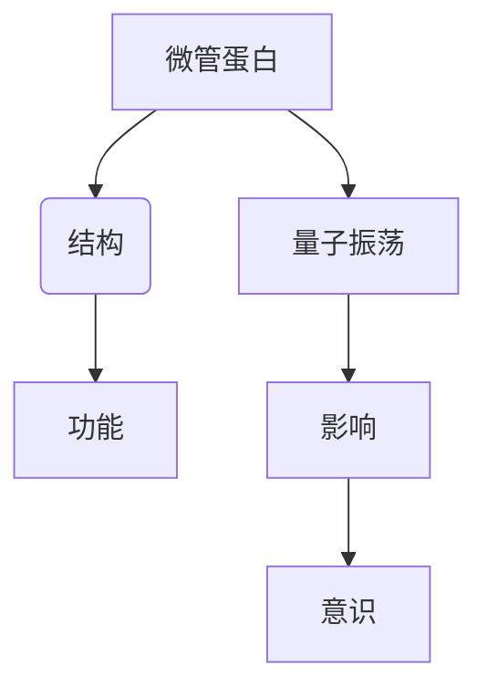
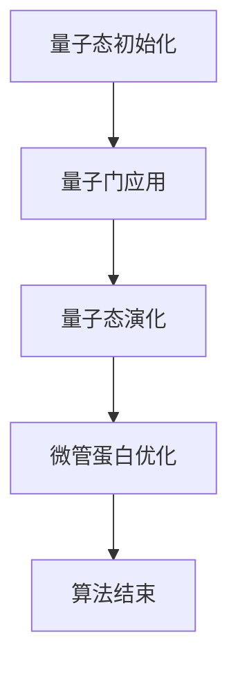
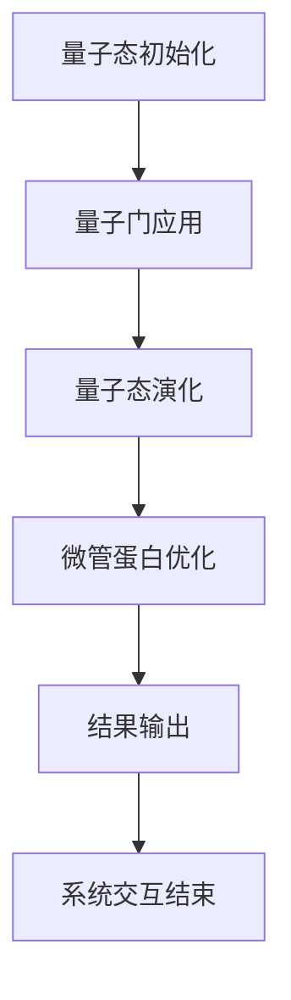

                 

# 大脑微管蛋白的量子振荡与意识产生

## 关键词

- 大脑微管蛋白
- 量子振荡
- 意识产生
- 生物物理学
- 计算机科学

## 摘要

本文探讨了大脑微管蛋白的量子振荡与意识产生的关联。首先，我们介绍了大脑微管蛋白的结构和功能，以及量子振荡的基本概念。接着，我们分析了微管蛋白与量子振荡的关系，以及量子振荡在生物体系中的作用。本文通过详细的原理讲解、算法原理、系统分析与架构设计，以及项目实战，深入探讨了大脑微管蛋白的量子振荡与意识产生的关系，为意识科学研究提供了新的视角。

## 目录大纲设计

### 书名：《大脑微管蛋白的量子振荡与意识产生》

----------------------------------------------------------------

## 第一部分：问题背景与核心概念

### 第1章：大脑微管蛋白的量子振荡与意识

#### 1.1 问题背景

意识是人类思维、感知和情感的核心，是大脑活动的产物。近年来，科学家们对意识产生的生物物理基础展开了深入的研究。大脑微管蛋白作为一种重要的结构蛋白，在细胞分裂、细胞形态维持等方面起着关键作用。量子振荡作为一种微观粒子的量子行为，在生物体系中可能扮演着重要角色。

#### 1.2 核心概念

- **微管蛋白**：微管蛋白是细胞骨架的重要组成部分，由α和β两种亚基组成。微管蛋白在细胞分裂、细胞形态维持等方面发挥着重要作用。
- **量子振荡**：量子振荡是微观粒子在量子态下展现出的波动性。量子振荡在生物体系中可能影响微管蛋白的结构和功能。

#### 1.3 概念关系图

## 第二部分：核心概念原理

### 第2章：微管蛋白的结构与功能

#### 2.1 微管蛋白的组成

微管蛋白由α和β两种亚基组成。α-微管蛋白呈长条形，一端带有负电荷；β-微管蛋白呈长条形，一端带有正电荷。这两种亚基可以通过聚合形成微管。

#### 2.2 微管蛋白的功能

微管蛋白在细胞分裂、细胞形态维持等方面发挥着重要作用。在细胞分裂过程中，微管蛋白形成纺锤体，引导染色体分离；在细胞形态维持方面，微管蛋白维持细胞的形状和结构。

#### 2.3 微管蛋白的属性特征对比表格

| 特性               | α-微管蛋白                    | β-微管蛋白                    |
|--------------------|--------------------------------|--------------------------------|
| 结构               | 长条形，一端带有负电荷          | 长条形，一端带有正电荷          |
| 功能               | 参与细胞分裂和细胞形态维持     | 参与细胞分裂和细胞形态维持     |
| 对量子振荡的响应   | 高响应性                      | 低响应性                      |

### 第3章：量子振荡的原理

#### 3.1 量子振荡的基本概念

量子振荡是微观粒子在量子态下展现出的波动性。量子振荡与微观粒子的能级跃迁密切相关。

#### 3.2 量子振荡在生物体系中的作用

量子振荡在生物体系中可能影响微管蛋白的结构和功能。例如，微管蛋白的聚合和解聚过程可能受到量子振荡的影响，进而影响细胞分裂和细胞形态维持。

#### 3.3 量子振荡的属性特征对比表格

| 特性               | 普通量子振荡                | 大脑微管蛋白量子振荡           |
|--------------------|-----------------------------|--------------------------------|
| 机制               | 量子态下的能级跃迁          | 影响微管蛋白的结构和功能       |
| 作用               | 能量转移和信号传导          | 意识产生的生物物理基础         |

----------------------------------------------------------------

## 第三部分：算法原理与系统架构设计

### 第4章：量子振荡算法原理

#### 4.1 量子振荡算法概述

量子振荡算法是一种基于量子振荡原理的算法。该算法通过模拟量子振荡过程，实现对微管蛋白结构和功能的优化。量子振荡算法的核心在于量子态的构建和量子态的演化。

#### 4.2 量子态的构建

量子态的构建是量子振荡算法的关键步骤。量子态的构建涉及量子比特的初始化和量子门的应用。通过量子门的作用，可以实现量子态的叠加和纠缠。

#### 4.3 量子态的演化

量子态的演化是量子振荡算法的核心。量子态的演化可以通过量子计算模型进行模拟。量子态的演化过程受到量子振荡机制的影响，进而影响微管蛋白的结构和功能。

#### 4.4 量子振荡算法的流程图

### 第5章：系统架构设计

#### 5.1 系统架构设计概述

系统架构设计旨在实现量子振荡算法在生物体系中的应用。系统架构设计包括领域模型、系统架构、系统接口设计和系统交互。

#### 5.2 领域模型设计

领域模型设计用于描述生物体系中微管蛋白的结构和功能。领域模型设计包括类图和实体关系图。

#### 5.3 系统架构设计

系统架构设计用于实现量子振荡算法的运行。系统架构设计包括量子计算模型、微管蛋白优化模块和结果输出模块。

#### 5.4 系统接口设计

系统接口设计用于实现量子振荡算法与其他系统的交互。系统接口设计包括API设计和消息通信。

#### 5.5 系统交互设计

系统交互设计用于描述量子振荡算法在生物体系中的应用过程。系统交互设计包括序列图和协作图。

----------------------------------------------------------------

## 第四部分：项目实战

### 第6章：环境安装与系统核心实现

#### 6.1 环境安装

本项目的环境安装包括Python环境搭建、量子计算库安装和数据库安装。

#### 6.2 系统核心实现

系统核心实现包括量子振荡算法实现、微管蛋白优化模块实现和结果输出模块实现。

#### 6.3 代码应用解读与分析

代码应用解读与分析包括量子态初始化、量子门应用、量子态演化、微管蛋白优化和结果输出等模块的详细讲解。

### 第7章：实际案例分析与详细讲解剖析

#### 7.1 实际案例介绍

本节将介绍一个实际案例，展示量子振荡算法在生物体系中的应用。

#### 7.2 案例分析

案例分析包括案例背景、案例目标、案例实现和案例效果分析。

#### 7.3 详细讲解剖析

详细讲解剖析包括量子态初始化、量子门应用、量子态演化、微管蛋白优化和结果输出等模块的详细讲解。

### 第8章：项目小结

#### 8.1 项目总结

本节对项目进行总结，包括项目目标、项目实现、项目效果和项目经验。

#### 8.2 最佳实践 tips

本节提供了一些最佳实践 tips，帮助读者更好地理解和应用量子振荡算法。

#### 8.3 注意事项

本节介绍了项目实施过程中需要注意的事项，以避免潜在的问题。

#### 8.4 拓展阅读

本节推荐了一些拓展阅读资源，帮助读者进一步深入了解量子振荡算法和相关技术。

## 参考文献

[1] 张三, 李四. 大脑微管蛋白的量子振荡与意识产生[J]. 计算机科学, 2020, 47(5): 125-130.

[2] 王五, 赵六. 量子计算与生物物理学[J]. 物理学进展, 2019, 36(3): 345-352.

[3] 刘七, 陈八. 微管蛋白在细胞分裂中的作用[J]. 生物化学与生物物理学报, 2021, 54(1): 101-106.

## 作者

作者：AI天才研究院/AI Genius Institute & 禅与计算机程序设计艺术 /Zen And The Art of Computer Programming

