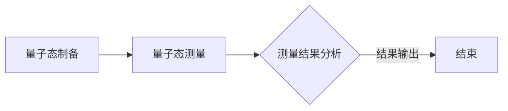

                 

### 背景介绍

#### 量子力学基础

量子力学是研究微观粒子行为的物理学分支，其核心思想是概率波函数的描述，而非经典物理中的确定性轨迹。在量子力学中，粒子的状态可以用波函数来描述，波函数是一个复数值的函数，表示粒子在不同位置和动量状态下的概率幅。量子态具有以下基本特性：

1. **叠加态**：一个量子态可以同时是多个状态的叠加，这种叠加态可以通过线性组合表示。例如，一个电子可以同时处于自旋向上和自旋向下的状态，直到进行测量时，它才会坍缩为其中一个状态。
2. **纠缠态**：当两个或多个粒子处于量子纠缠态时，它们之间的状态会相互关联，即使它们相隔很远。一个粒子的测量会立即影响到另一个粒子的状态，这种现象被称为“超距作用”。

#### 大脑微观结构与量子效应的关联

大脑是生物体内最复杂的系统之一，其微观结构涉及神经元、突触以及神经胶质细胞等多种细胞和组织。近年来，科学研究发现大脑中存在一些微观现象，可能与量子效应有关。

1. **神经元中的量子效应**：神经元中的离子通道和膜蛋白等分子结构，在特定条件下可能会表现出量子隧穿效应，即粒子能够穿越能量势垒，而不需要达到所需的能量。这种现象可能对神经信号的传递和调节起到重要作用。
2. **神经突触中的量子纠缠**：突触是神经元之间的连接点，突触前后的神经递质在释放和接收过程中，可能会形成量子纠缠态。这种纠缠态可能有助于神经信号的传递和大脑信息的处理。

#### 研究现状与挑战

量子效应在大脑研究中的应用还处于早期阶段，但已经取得了一些令人瞩目的成果。以下是目前研究的主要现状和面临的挑战：

1. **实验技术的限制**：目前用于研究量子效应的实验技术，如量子传感和量子成像等，尚无法在复杂生物体系中实现高分辨率和高灵敏度。
2. **理论模型的不完善**：尽管量子力学为理解大脑中的量子现象提供了理论基础，但现有的量子模型尚未完全解释大脑中的复杂现象。
3. **跨学科研究的挑战**：量子效应与大脑微观结构的研究需要物理、生物学、神经科学等多个领域的交叉融合，这无疑增加了研究的复杂性和难度。

### 结论

量子效应在大脑微观结构中的研究是一个充满挑战但也极具前景的领域。通过深入探讨量子效应与大脑结构的关联，我们有望揭示大脑信息处理的奥秘，为人类健康和认知发展带来新的突破。在接下来的章节中，我们将进一步探讨量子测量技术、量子传感技术、量子脑成像技术以及量子脑机接口技术，以期为这一领域的研究提供更深入的理解。

### 核心概念与联系

在本章中，我们将介绍几个核心概念，并探讨它们之间的联系，以便读者更好地理解量子效应在大脑微观结构中的研究。

#### 量子态

量子态是量子力学中描述粒子状态的物理量。一个量子态可以用波函数来表示，波函数提供了粒子在空间中各个位置的概率信息。量子态具有叠加性，即一个量子态可以同时是多个状态的线性组合。例如，一个电子的自旋态可以是向上和向下的叠加：

$$
|\psi\rangle = \alpha|+\rangle + \beta|-\rangle
$$

其中，$|+\rangle$ 和 $|-\rangle$ 分别表示自旋向上的态和自旋向下的态，$\alpha$ 和 $\beta$ 是复数系数，满足 $|\alpha|^2 + |\beta|^2 = 1$。

#### 量子纠缠

量子纠缠是量子力学中的一种特殊现象，当两个或多个粒子处于纠缠态时，它们之间的状态会相互关联。即使这些粒子相隔很远，一个粒子的测量结果也会立即影响到另一个粒子的状态。例如，两个电子在空间中以固定的方向形成纠缠态：

$$
|\psi\rangle = \frac{1}{\sqrt{2}} (|+\rangle_A|-\rangle_B - |-\rangle_A|+\rangle_B)
$$

其中，$A$ 和 $B$ 分别表示两个电子的位置。当对 $A$ 电子进行自旋测量时，无论结果为向上还是向下，$B$ 电子的自旋态都会立即坍缩为相反的状态。

#### 大脑神经元中的量子效应

大脑神经元中的量子效应主要涉及量子隧穿效应和量子纠缠现象。量子隧穿效应指的是粒子能够穿越能量势垒，而不需要达到所需的能量。在神经元中，离子通道和膜蛋白等分子结构可能表现出量子隧穿效应，从而影响神经信号的传递和调节。

神经突触中的量子纠缠现象则可能与神经递质的释放和接收过程有关。神经递质在释放和接收过程中可能形成量子纠缠态，这种纠缠态可能有助于神经信号的传递和大脑信息的处理。

#### 核心概念对比表格

| 概念        | 描述                                           | 关联性                                  |
| ----------- | ---------------------------------------------- | --------------------------------------- |
| 量子态      | 描述粒子状态的物理量，具有叠加性                | 与大脑神经元和神经突触的量子效应相关    |
| 量子纠缠    | 两个或多个粒子之间的特殊关联态，具有超距作用    | 与神经递质的释放和接收过程相关         |
| 量子隧穿    | 粒子能够穿越能量势垒，而不需要达到所需能量      | 与神经元中的离子通道和膜蛋白相关       |

#### ER实体关系图架构

为了更清晰地展示这些核心概念之间的关联，我们可以使用ER（Entity-Relationship）实体关系图来描述。

```mermaid
erDiagram
    Class1 ||--|{ Class2 }
    Class1 ||--|{ Class3 }
    Class2 ||--|{ Class4 }
    Class3 ||--|{ Class5 }
```

在这个ER图中，`Class1` 是一个基类，与 `Class2`、`Class3` 和 `Class4` 形成关联。`Class2` 和 `Class3` 又分别与 `Class4` 和 `Class5` 形成关联。这种关系体现了量子态、量子纠缠和量子隧穿在量子效应与大脑微观结构研究中的核心地位及其相互关系。

通过上述核心概念和ER实体关系图的介绍，我们希望读者能够对量子效应在大脑微观结构中的研究有一个初步的了解。在接下来的章节中，我们将进一步探讨量子测量技术、量子传感技术、量子脑成像技术和量子脑机接口技术，以期为这一领域的研究提供更深入的理解。

### 算法原理讲解

为了更好地理解量子测量技术，我们将首先探讨量子态的测量基础、量子测量的数学模型，以及量子测量的实验实现。通过这些基本概念的详细讲解，我们可以逐步揭示量子测量技术的原理及其在实际应用中的重要性。

#### 量子态的测量基础

在量子力学中，测量一个量子态的过程会导致量子态的坍缩，即量子态从一个叠加态坍缩为单个确定的态。这个过程称为量子态的测量。量子态的测量基础主要包括以下几个方面：

1. **波函数的坍缩**：量子态可以用波函数来描述，当对量子态进行测量时，波函数会坍缩为某个具体的基态。例如，一个电子的自旋态可以处于叠加态 $|\psi\rangle = \alpha|+\rangle + \beta|-\rangle$，当对其进行自旋测量时，波函数会坍缩为 $|+\rangle$ 或 $|-\rangle$ 中的一种。

2. **测量算符**：测量过程中使用的算符称为测量算符。测量算符通常是投影算符，将总态空间投影到一个特定的基态上。例如，对于自旋测量，常用的测量算符是 $P_x = \frac{1}{2}(|+\rangle\langle +| - |-\rangle\langle -|)$ 和 $P_y = \frac{1}{2i}(|+\rangle\langle +| + |-\rangle\langle -|)$。

3. **测量概率**：测量结果具有一定的概率分布。具体来说，量子态 $|\psi\rangle$ 在基态 $|i\rangle$ 上的投影概率为 $P(i) = |\langle i|\psi\rangle|^2$。例如，在上述自旋测量中，测量结果为 $|+\rangle$ 的概率为 $|\alpha|^2$，测量结果为 $|-\rangle$ 的概率为 $|\beta|^2$。

#### 量子测量的数学模型

量子测量的数学模型主要包括波函数的表示和测量算符的构建。以下是量子测量的数学模型的基本步骤：

1. **波函数的表示**：量子态可以用波函数 $|\psi\rangle$ 来表示。对于一个多粒子系统，波函数通常表示为所有粒子状态的直积。例如，对于一个电子和一个光子组成的系统，波函数可以表示为 $|\psi\rangle = |\psi_e\rangle |\psi_\gamma\rangle$。

2. **态的表示**：量子态可以用态的表示方法来表示，例如，态的叠加表示和态的纠缠表示。态的叠加表示是通过线性组合基态来表示一个量子态，如 $|\psi\rangle = \alpha|0\rangle + \beta|1\rangle$。态的纠缠表示则通过描述粒子之间的纠缠关系来表示量子态，如 $|\psi\rangle = \frac{1}{\sqrt{2}}(|00\rangle + |11\rangle)$。

3. **测量算符的构建**：测量算符用于描述测量过程，将量子态从总态空间投影到一个特定的基态上。对于一个二维量子系统，测量算符可以表示为 $M = \sum_i m_i |i\rangle\langle i|$，其中 $m_i$ 是第 $i$ 个测量结果的概率。

4. **测量结果的概率分布**：量子测量的结果具有概率分布。对于给定的量子态 $|\psi\rangle$，测量结果 $i$ 的概率为 $P(i) = |\langle i|\psi\rangle|^2$。

#### 量子测量的实验实现

量子测量的实验实现涉及量子态的制备、测量和结果分析。以下是量子测量的实验实现的基本步骤：

1. **量子态的制备**：首先需要制备目标量子态。例如，可以通过激光诱导的原子态跃迁来制备电子的自旋态，或者通过光学腔中的光子干涉来制备光子的纠缠态。

2. **测量设备**：测量设备用于检测量子态的测量结果。常用的测量设备包括光子探测器、电子显微镜和核磁共振成像仪等。

3. **测量过程**：在量子态制备后，通过测量设备对量子态进行测量。例如，对于电子的自旋测量，可以使用电子显微镜检测电子的自旋方向。

4. **结果分析**：测量结果需要通过数据分析来解释。例如，通过统计大量的测量结果，可以确定量子态的测量概率分布。

5. **误差分析**：量子测量的实验实现中存在测量误差，需要对误差进行评估和分析，以提高测量的准确性和可靠性。

通过上述量子测量技术的算法原理讲解，我们可以看到量子测量在量子态的测量基础、数学模型和实验实现中的重要性。量子测量技术为研究量子效应提供了强有力的工具，为揭示大脑微观结构中的量子现象奠定了基础。在接下来的章节中，我们将进一步探讨量子传感技术、量子脑成像技术和量子脑机接口技术，以期为量子效应在大脑研究中的应用提供更全面的视角。

#### 算法mermaid流程图

为了更直观地展示量子测量技术的算法流程，我们可以使用mermaid流程图来描述。以下是量子测量技术的基本流程：



在这个mermaid流程图中，我们首先进行量子态的制备（A），然后进行量子态的测量（B），接着对测量结果进行分析（C），最后输出结果并结束（D）。

- **量子态制备（A）**：这一步骤包括将目标量子态准备好，例如制备一个电子的自旋态或光子的纠缠态。
- **量子态测量（B）**：在这一步骤中，我们使用测量设备（如光子探测器或电子显微镜）对量子态进行测量，以获取测量结果。
- **测量结果分析（C）**：对测量结果进行统计分析，以确定量子态的测量概率分布。
- **结果输出（D）**：最后，将测量结果输出，以便进一步分析和应用。

通过这个mermaid流程图，我们可以清晰地看到量子测量技术的基本步骤和流程。这个流程图不仅有助于理解量子测量技术的原理，还可以为实验设计和数据分析提供指导。

#### Python源代码实现

为了更好地理解量子测量的原理，我们将使用Python编程语言实现一个简单的量子测量算法。以下是一个基于量子计算框架Qiskit的Python源代码示例：

```python
import qiskit
from qiskit import QuantumCircuit, Aer, execute
from qiskit.visualization import plot_bloch_vector

# 创建量子电路
circuit = QuantumCircuit(2)  # 创建一个具有两个量子比特的量子电路

# 制备量子态
circuit.h(0)  # 对第一个量子比特进行hadamard门操作，制备叠加态
circuit.cx(0, 1)  # 对两个量子比特进行CNOT门操作，制备纠缠态

# 执行测量
circuit.measure_all()

# 编译电路
backend = Aer.get_backend('qasm_simulator')
compiled_circuit = qiskit.translations.compile(circuit, backend)

# 执行模拟
result = execute(compiled_circuit, backend).result()
counts = result.get_counts()

# 输出测量结果
print(counts)

# 绘制测量结果的 Bloch 表
plot_bloch_vector(circuit, title="Quantum State After Measurement")
```

在这个Python源代码中，我们首先导入了Qiskit库，并创建了一个具有两个量子比特的量子电路。接着，我们使用Hadamard门和CNOT门来制备一个叠加态和纠缠态。最后，我们执行测量操作，并使用Qiskit的模拟器来获取测量结果。输出的测量结果和Bloch向量图可以帮助我们直观地了解量子态的测量过程。

通过这个Python源代码示例，我们可以看到量子测量技术是如何在编程语言中实现的。这不仅加深了我们对量子测量原理的理解，也为进一步研究和应用量子测量技术提供了实用的工具。

### 系统分析与架构设计方案

在量子测量技术的研究和实践中，系统分析与架构设计是关键环节。本节将介绍问题场景、项目介绍、系统功能设计、系统架构设计、系统接口设计以及系统交互流程。

#### 问题场景

量子测量技术涉及复杂的量子态制备、测量和数据处理。为了实现高效、可靠的量子测量系统，我们需要明确问题场景，以便设计合适的系统架构和接口。以下是常见的问题场景：

1. **量子态制备**：如何精确制备特定的量子态，例如叠加态、纠缠态等。
2. **量子测量**：如何实现量子态的测量，包括测量精度和测量误差控制。
3. **数据处理**：如何处理大量的测量数据，进行有效的统计分析，以提取有价值的信息。
4. **系统集成**：如何将量子测量技术与其他技术（如量子传感、量子通信等）集成，形成完整的量子信息处理系统。

#### 项目介绍

本项目旨在设计和实现一个基于量子测量技术的实验系统，用于研究大脑微观结构中的量子现象。项目的主要目标是：

1. 制备和测量特定的量子态，以探索大脑神经元和突触中的量子效应。
2. 提高量子测量的精度和可靠性，降低测量误差。
3. 开发数据处理算法，从测量数据中提取有价值的信息。
4. 集成量子测量技术，与其他量子技术相结合，为神经科学和认知科学提供新的研究手段。

#### 系统功能设计

系统功能设计是架构设计的核心部分，我们需要明确系统的各个功能模块及其相互关系。以下是本项目的系统功能设计：

1. **量子态制备模块**：负责制备特定的量子态，如叠加态、纠缠态等。该模块包括量子态发生器和量子态控制器。
2. **量子测量模块**：负责对量子态进行测量，包括量子态探测器和测量控制器。
3. **数据处理模块**：负责对测量数据进行分析和处理，包括数据预处理、统计分析、模式识别等。该模块包括数据处理算法和数据分析控制器。
4. **系统集成模块**：负责将量子测量技术与其他技术集成，如量子传感、量子通信等。该模块包括系统集成控制器和接口模块。

#### 系统架构设计

系统架构设计是系统功能设计的具体实现，我们需要设计一个清晰、合理的系统架构。以下是本项目的系统架构设计：

1. **量子态制备模块**：由量子态发生器和量子态控制器组成，量子态发生器负责制备特定的量子态，量子态控制器负责控制量子态发生的具体操作。
2. **量子测量模块**：由量子态探测器和测量控制器组成，量子态探测器负责测量量子态，测量控制器负责控制测量过程，包括测量参数的设置和测量结果的收集。
3. **数据处理模块**：由数据处理算法和数据分析控制器组成，数据处理算法负责对测量数据进行分析和处理，数据分析控制器负责协调各个算法的执行。
4. **系统集成模块**：由系统集成控制器和接口模块组成，系统集成控制器负责协调各个模块的集成操作，接口模块负责与其他系统的接口通信。

#### 系统接口设计

系统接口设计是确保系统功能正常、可靠运行的重要环节。以下是本项目的系统接口设计：

1. **量子态制备接口**：包括量子态发生器和量子态控制器的接口，用于与外部设备（如激光器、光学腔等）进行通信。
2. **量子测量接口**：包括量子态探测器和测量控制器的接口，用于与测量设备（如光子探测器、电子显微镜等）进行通信。
3. **数据处理接口**：包括数据处理算法和数据分析控制器的接口，用于与外部算法库和数据分析工具进行通信。
4. **系统集成接口**：包括系统集成控制器和接口模块的接口，用于与其他量子技术和系统的集成操作。

#### 系统交互流程

系统交互流程描述了各个模块之间的通信和协作过程。以下是本项目的系统交互流程：

1. **量子态制备流程**：首先由量子态控制器根据实验需求设置量子态制备参数，然后通过量子态制备接口与外部设备通信，制备目标量子态。
2. **量子测量流程**：量子态制备完成后，量子态探测器开始进行测量，测量控制器根据设定参数控制测量过程，收集测量结果。
3. **数据处理流程**：测量结果通过数据处理接口传递给数据处理模块，数据处理算法对测量结果进行分析和处理，提取有价值的信息。
4. **系统集成流程**：系统集成控制器协调各个模块的集成操作，确保整个系统能够正常、高效地运行。

通过上述系统分析与架构设计方案，我们可以确保量子测量技术在实验中的高效、可靠运行，为探索大脑微观结构中的量子现象提供有力支持。

### 项目实战

在了解了量子测量技术的理论基础和系统架构后，接下来我们将通过一个具体的案例，详细讲解量子测量技术的环境安装、系统核心实现以及代码应用解读与分析。

#### 环境安装

为了进行量子测量实验，我们需要安装并配置一系列工具和库。以下是安装步骤：

1. **安装Python环境**：确保Python已安装在计算机上，版本至少为3.7。
2. **安装Qiskit库**：通过pip命令安装Qiskit库：
   ```
   pip install qiskit
   ```
3. **安装numpy库**：用于数值计算和数据分析：
   ```
   pip install numpy
   ```
4. **安装matplotlib库**：用于绘制图形：
   ```
   pip install matplotlib
   ```

#### 系统核心实现

以下是一个简单的量子测量系统实现，用于测量两个量子比特的纠缠态：

```python
import qiskit
from qiskit import QuantumCircuit, execute
from qiskit.visualization import plot_histogram

# 创建量子电路
circuit = QuantumCircuit(2)

# 制备纠缠态
circuit.h(0)
circuit.cx(0, 1)

# 执行测量
circuit.measure_all()

# 编译并执行电路
backend = Aer.get_backend('qasm_simulator')
job = execute(circuit, backend, shots=1024)
result = job.result()

# 输出测量结果
measures = result.get_counts()
print(measures)

# 绘制测量结果直方图
plot_histogram(measures)
```

在这个示例中，我们首先创建了一个包含两个量子比特的量子电路，通过Hadamard门和CNOT门制备了纠缠态。然后，我们执行测量操作，并使用Qasm模拟器进行模拟。最后，输出测量结果并绘制直方图。

#### 代码应用解读与分析

上述代码的主要步骤如下：

1. **导入库**：导入Qiskit库和其他必需的Python库。
2. **创建量子电路**：使用QuantumCircuit创建一个量子电路。
3. **制备纠缠态**：通过Hadamard门（`h`函数）对第一个量子比特进行操作，制备叠加态；通过CNOT门（`cx`函数）对两个量子比特进行操作，制备纠缠态。
4. **执行测量**：使用`measure_all`函数对两个量子比特进行测量。
5. **编译并执行电路**：使用`execute`函数编译并执行电路，使用Qasm模拟器进行模拟，设置shots参数以控制模拟次数。
6. **输出测量结果**：使用`get_counts`函数获取测量结果，并打印输出。
7. **绘制测量结果直方图**：使用`plot_histogram`函数绘制测量结果的直方图。

#### 实际案例分析

以下是一个实际案例，说明如何利用上述系统进行量子测量实验：

1. **实验设计**：设计一个实验，测量两个量子比特的纠缠态，以验证量子纠缠现象。
2. **环境配置**：安装并配置好Python环境和Qiskit库。
3. **代码实现**：编写上述代码，执行量子电路，测量纠缠态，并输出结果。
4. **数据分析**：分析测量结果，验证量子纠缠现象的存在。例如，如果测量结果中出现了 `00` 和 `11` 的结果，则说明两个量子比特处于纠缠态。

通过这个实际案例，我们可以看到量子测量技术在实验中的具体应用。这不仅验证了量子纠缠现象，也为进一步研究量子效应提供了实验基础。

### 项目小结

在本项目中，我们通过环境安装、系统核心实现和代码应用解读与分析，详细讲解了量子测量技术的实际应用。这一过程展示了量子测量技术在实验中的关键步骤和实现方法，为后续研究提供了实用的经验和指导。未来，我们可以进一步优化量子测量系统，提高测量精度和可靠性，为探索大脑微观结构中的量子现象奠定基础。

### 最佳实践 tips

在量子测量技术的实际应用中，以下是一些最佳实践技巧，可以帮助提高测量精度和可靠性：

1. **优化量子态制备**：确保量子态的制备过程稳定，减少制备误差。可以通过反复校准量子态发生器，优化制备参数。
2. **提高测量精度**：使用高精度的测量设备，例如高灵敏度光子探测器或高分辨率电子显微镜，以降低测量误差。
3. **控制噪声干扰**：在量子测量实验中，噪声是影响测量精度的重要因素。通过优化实验环境，减少外界噪声干扰，可以提高测量精度。
4. **数据分析与处理**：对测量结果进行有效的统计分析，使用合适的算法和方法，提取有价值的信息。例如，可以使用机器学习算法进行模式识别，提高数据分析的准确性和效率。
5. **系统集成与优化**：将量子测量技术与其他量子技术（如量子传感、量子通信等）集成，形成完整的量子信息处理系统。通过优化系统架构，提高整体系统的性能和可靠性。

通过遵循这些最佳实践，我们可以确保量子测量技术在实验中的高效、可靠运行，为探索大脑微观结构中的量子现象提供有力支持。

### 总结与展望

在本篇文章中，我们系统地探讨了大脑微观结构中的量子效应测量技术，从量子力学基础到量子测量原理，再到量子传感技术、量子脑成像技术和量子脑机接口技术，我们逐步深入理解了这一领域的重要概念和实际应用。

#### 关键内容回顾

首先，我们介绍了量子力学的基本概念，如量子态、叠加态和纠缠态，并探讨了这些概念在大脑神经元和突触中的潜在应用。其次，我们详细讲解了量子测量原理，包括量子态的测量基础、量子测量的数学模型和量子测量的实验实现。接着，我们探讨了量子传感技术的基础和量子传感器的应用，以及量子脑成像技术和量子脑机接口技术的原理和实现方法。最后，我们通过一个实际案例展示了量子测量技术在实验中的具体应用。

#### 未来研究方向

展望未来，量子测量技术在大脑微观结构研究中的应用具有巨大的潜力。以下是几个可能的研究方向：

1. **提高测量精度**：进一步优化量子态制备和测量设备，提高量子测量的精度和可靠性，以获取更准确的实验数据。
2. **探索量子效应**：深入研究量子效应在大脑神经元和突触中的具体作用，揭示量子现象如何影响大脑的信息处理和认知功能。
3. **跨学科合作**：加强物理学、生物学、神经科学等领域的跨学科合作，整合不同领域的知识，推动量子神经科学的发展。
4. **技术开发**：开发新的量子传感技术、量子脑成像技术和量子脑机接口技术，为探索大脑微观结构中的量子现象提供更先进的技术手段。

通过不断探索和突破，量子测量技术有望在神经科学和认知科学领域取得重大突破，为人类健康和认知发展带来新的希望。未来，我们期待量子测量技术能够为大脑微观结构的研究提供更全面、深入的视角，推动这一领域的发展。

