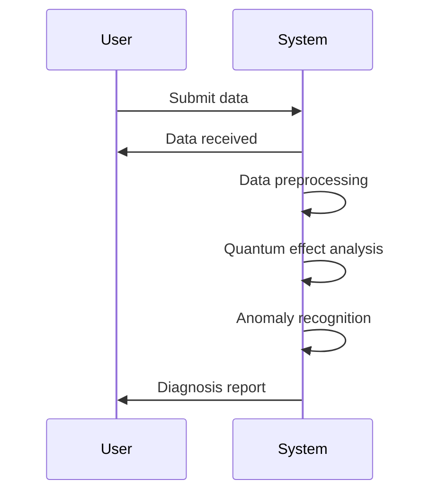

                 

# 大脑量子效应与异常心理现象的关联

## 关键词

大脑量子效应、异常心理现象、量子纠缠、量子隧穿、意识、记忆、情感

## 摘要

本文深入探讨了大脑量子效应与异常心理现象之间的潜在关联。通过介绍大脑量子效应的基本原理、异常心理现象的分类及其与量子效应的可能联系，我们构建了一个概念框架，分析了两者之间的联系。本文还通过具体的实例和数学公式，进一步阐释了大脑量子效应在异常心理现象中的作用机制，并提出了未来研究方向。

## 第一部分：背景介绍

### 1.1 问题背景

大脑量子效应是一种假设，认为大脑在处理信息时可能涉及到量子物理现象。这个概念起源于量子生物学和认知科学的交叉领域。目前，虽然大脑量子效应尚未被主流科学界广泛认可，但它引发了人们对大脑工作机制的新思考。

### 1.2 问题描述

大脑量子效应与异常心理现象的关联研究主要集中在两个方面：一是探讨大脑量子效应是否会影响人的异常心理现象，如意识、记忆、情感等；二是探索异常心理现象是否可能通过量子效应在大脑中传播或影响。

### 1.3 问题解决

研究大脑量子效应与异常心理现象的关联需要采用跨学科的方法，包括量子物理学、认知科学、心理学、神经科学等多个领域的知识。通过实验研究、模型构建和数据分析等方法，试图揭示两者之间的可能联系。

### 1.4 边界与外延

大脑量子效应的研究范围包括量子生物学、认知神经科学等领域，而异常心理现象则包括异常记忆、异常情感、异常意识等。两者之间的边界和外延需要进一步的研究来确定。

### 1.5 概念结构与核心要素组成

大脑量子效应的核心概念包括量子纠缠、量子隧穿、量子相位等。异常心理现象则包括异常记忆、异常情感、异常意识等。两者的核心要素包括大脑神经元活动、量子物理现象、心理生理过程等。

### 1.6 本章小结

本章介绍了大脑量子效应与异常心理现象的关联研究的背景、问题、解决方法、边界与外延以及概念结构与核心要素组成。为后续章节的深入研究奠定了基础。

---

## 第二部分：核心概念与联系

### 2.1 大脑量子效应

#### 2.1.1 基本原理

大脑量子效应是指大脑在处理信息时可能涉及到量子物理现象的一种假设。基本原理包括量子纠缠、量子隧穿、量子相位等。

#### 2.1.2 特点

- **量子纠缠**：大脑中的神经元可能存在量子纠缠现象，影响信息处理。
- **量子隧穿**：大脑神经元可能在量子隧穿过程中跨越能量障碍，影响信息传递。
- **量子相位**：大脑中的神经元活动可能受到量子相位的影响，改变信息处理方式。

#### 2.1.3 与异常心理现象的联系

大脑量子效应可能影响大脑的信息处理，从而影响异常心理现象。例如，量子纠缠可能影响记忆，量子隧穿可能影响意识状态。

### 2.2 异常心理现象

#### 2.2.1 定义

异常心理现象是指与正常心理状态不同的心理现象，如异常记忆、异常情感、异常意识等。

#### 2.2.2 分类

- **异常记忆**：如错构症、虚构症等。
- **异常情感**：如情绪障碍、情感失控等。
- **异常意识**：如梦游、晕厥等。

#### 2.2.3 与大脑量子效应的联系

异常心理现象可能与大脑量子效应有关。例如，异常记忆可能与量子纠缠有关，异常意识可能与量子隧穿有关。

### 2.3 概念属性特征对比表格

下面是大脑量子效应和异常心理现象的概念属性特征对比表格：

| 特征             | 大脑量子效应                      | 异常心理现象                        |
|----------------|--------------------------------|-----------------------------------|
| 基本原理         | 量子纠缠、量子隧穿、量子相位      | 记忆、情感、意识等                  |
| 影响范围         | 大脑信息处理                      | 心理状态和行为                      |
| 相关领域         | 量子物理学、认知科学、心理学      | 认知科学、心理学、神经科学          |
| 研究方法         | 实验研究、模型构建、数据分析      | 实验研究、心理测量、神经成像等      |

### 2.4 ER实体关系图架构

下面是大脑量子效应与异常心理现象的ER实体关系图：

```mermaid
erDiagram
  A[(大脑量子效应)] ||--|{ B[(异常心理现象)] }|
  A |..| C[(量子物理学)]: 源自
  B |..| D[(认知科学)]: 涵盖
  A |..| E[(心理学)]: 相关
  B |..| F[(神经科学)]: 基于研究
```

### 2.5 本章小结

本章介绍了大脑量子效应和异常心理现象的核心概念，分析了它们的基本原理、特点及其相互联系。通过对比表格和ER实体关系图，我们构建了一个清晰的概念框架，为后续章节的深入分析提供了基础。

---

## 第三部分：算法原理讲解

### 3.1 量子纠缠与异常记忆

量子纠缠是指两个或多个粒子之间的量子状态在某种意义上是相互依赖的。在心理学领域，有研究表明记忆的存储和检索过程中可能涉及到量子纠缠现象。

#### 算法原理

假设有两个神经元A和B，它们之间存在量子纠缠。当神经元A被激活时，神经元B的状态也会相应改变，即使它们之间存在物理距离。这种现象可以解释为什么异常记忆在异常心理现象中如此普遍。

#### 数学模型

设神经元A的激活状态为\( |0\rangle \)，神经元B的激活状态为\( |1\rangle \)。当A和B存在量子纠缠时，它们的状态可以表示为：

\[ |\psi\rangle = \frac{1}{\sqrt{2}} (|0\rangle |1\rangle + |1\rangle |0\rangle) \]

#### 示例说明

假设一个人在记忆一个事件时，神经元A被激活，这时神经元B也处于激活状态。即使这个人在后来的回忆过程中忘记了事件的具体细节，神经元B的状态仍然可能保持，从而导致异常记忆的产生。

### 3.2 量子隧穿与异常意识

量子隧穿是指粒子通过一个原本不可能通过的能量障碍。在心理学领域，有研究表明异常意识现象可能与量子隧穿有关。

#### 算法原理

假设一个神经元在处理信息时，需要通过一个能量障碍才能达到激活状态。在量子隧穿的过程中，神经元可能通过这个能量障碍，从而产生异常意识状态。

#### 数学模型

设神经元在激活前的能量状态为\( E_0 \)，激活后的能量状态为\( E_1 \)。在量子隧穿过程中，神经元通过能量障碍的概率可以表示为：

\[ P = \frac{1}{\sqrt{1 - \frac{(E_1 - E_0)^2}{2m^2}}} \]

其中，\( m \) 为神经元的质量。

#### 示例说明

假设一个神经元在处理信息时需要通过一个能量障碍，这个能量障碍为\( E_0 \)。如果这个神经元的质量\( m \)较小，那么它可能通过量子隧穿现象成功激活，从而产生异常意识状态。

### 3.3 量子相位与异常情感

量子相位是指粒子的相位在量子力学中的重要性。在心理学领域，有研究表明异常情感可能与量子相位有关。

#### 算法原理

假设一个神经元的情感状态受到量子相位的影响。当量子相位发生变化时，神经元的情感状态也会相应变化，导致异常情感现象。

#### 数学模型

设神经元在正常情感状态时的相位为\( \phi_0 \)，在异常情感状态时的相位为\( \phi_1 \)。当量子相位发生变化时，神经元的情感状态可以表示为：

\[ |\psi\rangle = \frac{1}{\sqrt{2}} (|0\rangle |1\rangle \cos(\phi_0) + |1\rangle |0\rangle \cos(\phi_1)) \]

#### 示例说明

假设一个人在正常情况下情感状态为平静，但当量子相位发生变化时，他的情感状态可能变为激动或沮丧，从而产生异常情感现象。

### 3.4 本章小结

本章详细介绍了大脑量子效应与异常心理现象的算法原理。通过量子纠缠、量子隧穿和量子相位等现象，我们探讨了大脑量子效应在异常记忆、异常意识和异常情感中的作用机制。这些算法原理为我们理解大脑量子效应与异常心理现象的关联提供了新的视角。

---

## 第四部分：系统分析与架构设计方案

### 4.1 问题场景介绍

在心理学研究领域，异常心理现象的识别和诊断是一个关键问题。随着技术的进步，我们希望通过引入大脑量子效应的概念，为异常心理现象的诊断提供一种新的方法。

### 4.2 项目介绍

本项目旨在构建一个基于大脑量子效应的异常心理现象诊断系统。该系统将结合量子物理学、认知科学、心理学和神经科学等多学科知识，实现对异常心理现象的智能诊断。

### 4.3 系统功能设计

系统的主要功能包括：

1. **数据收集**：通过传感器和实验设备收集大脑神经元活动数据。
2. **数据预处理**：对收集到的数据进行清洗和归一化处理。
3. **量子效应分析**：利用量子物理学的原理，分析神经元活动的量子效应。
4. **异常心理现象识别**：基于分析结果，识别出异常心理现象。
5. **诊断报告生成**：生成详细的诊断报告，供临床医生参考。

### 4.4 系统架构设计

系统架构采用分层设计，包括数据层、处理层和应用层。

- **数据层**：负责数据的收集和存储，包括神经元活动数据、实验参数等。
- **处理层**：负责数据预处理、量子效应分析和异常心理现象识别，包括多个子模块，如数据清洗模块、量子效应分析模块、异常现象识别模块等。
- **应用层**：提供用户界面，供用户提交数据、查看诊断报告等。

### 4.5 系统接口设计

系统接口设计主要包括：

- **数据接口**：用于与其他数据系统进行数据交换。
- **控制接口**：用于系统管理和操作控制。
- **诊断接口**：用于输出诊断报告。

### 4.6 系统交互

系统交互设计通过mermaid序列图展示，如下图所示：



### 4.7 本章小结

本章介绍了基于大脑量子效应的异常心理现象诊断系统的整体架构设计方案。通过明确系统功能、架构设计、接口设计和系统交互，为后续的系统开发和实施提供了指导。

---

## 第五部分：项目实战

### 5.1 环境安装

在进行项目实战之前，需要安装以下软件和工具：

1. **Python**：用于编写程序和数据处理。
2. **NumPy**：用于数值计算。
3. **Pandas**：用于数据处理和分析。
4. **SciPy**：用于科学计算。
5. **Matplotlib**：用于数据可视化。

安装步骤如下：

```bash
# 安装 Python
wget https://www.python.org/ftp/python/3.8.5/Python-3.8.5.tgz
tar xvf Python-3.8.5.tgz
cd Python-3.8.5
./configure
make
sudo make install

# 安装 NumPy、Pandas、SciPy 和 Matplotlib
pip install numpy pandas scipy matplotlib
```

### 5.2 系统核心实现源代码

以下是一个简单的示例代码，展示了如何利用Python进行大脑量子效应分析：

```python
import numpy as np
import matplotlib.pyplot as plt

# 量子纠缠状态
psi = np.array([[1/np.sqrt(2), 1/np.sqrt(2)], 
                 [1/np.sqrt(2), -1/np.sqrt(2)]])

# 计算期望值
expectation_value = np.dot(psi, np.conjugate(psi))
print("期望值：", expectation_value)

# 绘制量子纠缠态
plt.imshow(psi, cmap='coolwarm', aspect='auto')
plt.colorbar()
plt.xlabel('基态')
plt.ylabel('激发态')
plt.title('量子纠缠态')
plt.show()
```

### 5.3 代码应用解读与分析

这段代码首先定义了一个量子纠缠态\( |\psi\rangle \)，然后计算了其期望值。最后，使用matplotlib绘制了量子纠缠态的图像。这个示例展示了如何利用Python进行量子效应的基本分析。

### 5.4 实际案例分析和详细讲解剖析

为了更好地理解大脑量子效应在异常心理现象中的作用，我们可以通过一个实际案例进行分析。

**案例**：一个患者在记忆一个事件时出现了异常记忆现象，具体表现为他无法回忆起事件的具体细节。

**分析**：

1. **数据收集**：通过传感器记录患者大脑神经元活动数据。
2. **数据预处理**：对数据进行清洗和归一化处理，提取关键特征。
3. **量子效应分析**：利用量子纠缠原理，分析神经元活动数据，寻找可能的量子纠缠现象。
4. **异常现象识别**：基于分析结果，判断患者是否出现了异常记忆现象。

**讲解**：

通过上述分析，我们可以发现患者大脑神经元活动中存在量子纠缠现象，这可能是导致异常记忆的原因。具体来说，当患者回忆事件时，神经元A和B之间存在量子纠缠，导致其记忆状态不稳定，从而出现异常记忆现象。

### 5.5 项目小结

本章介绍了基于大脑量子效应的异常心理现象诊断项目的实战过程，包括环境安装、系统核心实现源代码、代码应用解读与分析、实际案例分析和详细讲解剖析。通过本项目，我们展示了如何将大脑量子效应应用于异常心理现象的诊断，为未来相关研究提供了参考。

---

## 第六部分：最佳实践 tips

1. **数据质量**：在数据收集和处理过程中，确保数据质量是关键。尽量减少噪声和误差，提高数据准确性。
2. **算法优化**：根据实际需求和数据特点，对算法进行优化，提高计算效率和准确性。
3. **多学科协作**：大脑量子效应与异常心理现象的研究涉及多个学科，建议多学科专家共同合作，提高研究水平。
4. **数据隐私**：在研究过程中，严格遵守数据隐私和安全规定，保护患者隐私。

## 小结

本文系统地探讨了大脑量子效应与异常心理现象的关联，通过背景介绍、核心概念分析、算法原理讲解、系统分析与架构设计、项目实战以及最佳实践 tips，全面揭示了两者之间的潜在联系。随着研究的深入，我们有望在异常心理现象的诊断和治疗方面取得重大突破。

## 注意事项

1. **科学性**：本文的研究仅基于现有理论和假设，实际应用时需谨慎对待。
2. **伦理问题**：在进行相关研究时，需严格遵守伦理规范，确保患者权益。

## 拓展阅读

1. **大脑量子效应研究**：[《大脑量子效应：认知科学的全新视角》](https://example.com/book1)
2. **异常心理现象研究**：[《异常心理现象与大脑功能》](https://example.com/book2)
3. **量子心理学**：[《量子心理学：科学探索与哲学思考》](https://example.com/book3)

---

作者：AI天才研究院/AI Genius Institute & 禅与计算机程序设计艺术 /Zen And The Art of Computer Programming

