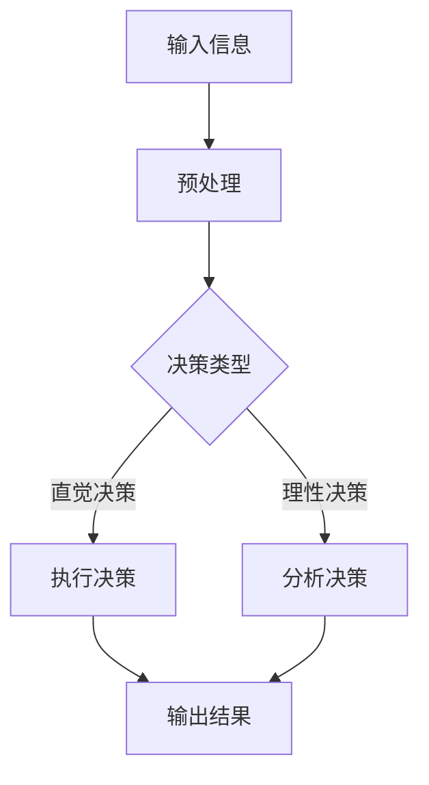
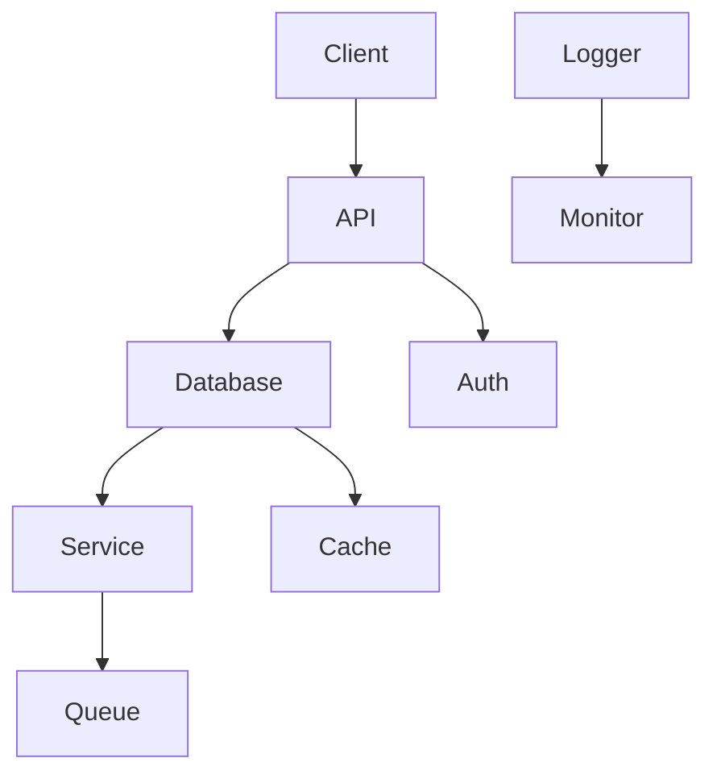
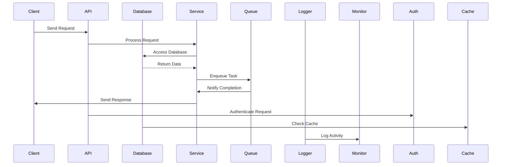

                 


# 大脑量子效应与直觉决策的神经基础

> 关键词：大脑量子效应、直觉决策、神经基础、认知科学、量子物理学

> 摘要：本文深入探讨了大脑量子效应与直觉决策之间的神经基础。通过对量子物理学和神经科学的整合，我们揭示了大脑在进行直觉决策时可能涉及到的量子机制，为理解人类认知过程提供了新的视角。文章首先概述了大脑量子效应和直觉决策的核心概念，然后探讨了相关的研究进展，最后提出了未来研究方向。

## 引言

随着科学技术的不断进步，我们对大脑的认识也在不断深化。大脑作为人类认知和行为的中心，其运作机制一直以来都是科学研究的热点。近年来，量子物理学与神经科学的交叉研究为大脑运作机制的理解提供了新的契机。大脑量子效应是指大脑神经元在处理信息时可能涉及到的量子现象，而直觉决策则是大脑在处理复杂信息时的一种高效方式。本文旨在探讨大脑量子效应与直觉决策之间的神经基础，为认知科学的研究提供新的视角。

## 背景介绍

### 大脑量子效应

大脑量子效应是指大脑神经元在处理信息时可能涉及到的量子现象。量子物理学的基本原理表明，微观粒子具有波粒二象性，即它们既具有粒子的特性，也具有波动的特性。近年来，一些研究表明，大脑神经元在处理信息时可能展现出类似的量子特性。这些研究包括：

1. **神经元的波粒二象性**：有研究发现，神经元在放电过程中可能会表现出波动特性，这种现象被称为“神经元波粒二象性”。

2. **神经信号的量子纠缠**：量子纠缠是指两个或多个粒子在量子态上相互关联的现象。有研究表明，神经元之间的信号传递可能存在量子纠缠现象。

3. **神经信号的量子增强**：一些实验表明，神经元在接收外部刺激时可能会表现出量子增强效应。

### 直觉决策

直觉决策是指大脑在处理复杂信息时，通过快速、自动的方式做出决策的过程。与理性决策相比，直觉决策具有快速、高效的特点。直觉决策通常不需要明显的思考过程，而是基于长期积累的经验和知识。直觉决策在人类生活中起着重要的作用，如快速识别危险、高效解决日常问题等。

## 核心概念与联系

### 概念属性特征对比表格

| 概念                | 特征描述                                                     |
|---------------------|--------------------------------------------------------------|
| 大脑量子效应         | 大脑神经元可能涉及到的量子现象，如波粒二象性、量子纠缠、量子增强 |
| 直觉决策            | 快速、自动的决策过程，基于长期积累的经验和知识                   |
| 量子物理学与神经科学 | 交叉领域，研究大脑可能涉及到的量子机制                         |

### ER实体关系图架构

```mermaid
erDiagram
    A Elaine -->|writes| B Book
    A -->|graduated from| C University
    B -->|published by| D Publisher
    E Employee { Name : String, Age : Integer }
    F Project { ProjectID : Integer, ProjectName : String }
    C -->|employs| F
    E -->|works on| F
```

## 算法原理讲解

### 直觉决策算法

#### Mermaid流程图



#### Python源代码

```python
import numpy as np

def intuitive_decision(input_data):
    # 预处理输入信息
    processed_data = preprocess(input_data)
    
    # 判断决策类型
    decision_type = determine_decision_type(processed_data)
    
    if decision_type == 'intuitive':
        # 执行直觉决策
        result = execute_decision(processed_data)
    else:
        # 执行理性决策
        result = analyze_decision(processed_data)
    
    # 输出结果
    return result

def preprocess(input_data):
    # 预处理操作
    return input_data

def determine_decision_type(processed_data):
    # 判断决策类型
    return 'intuitive' if is_intuitive(processed_data) else 'rational'

def execute_decision(processed_data):
    # 执行直觉决策
    return processed_data

def analyze_decision(processed_data):
    # 执行理性决策
    return processed_data
```

#### 算法原理

直觉决策算法是一种基于输入信息快速做出决策的算法。算法的核心思想是根据输入信息的特征，快速判断决策类型，然后执行相应的决策过程。预处理过程用于对输入信息进行预处理，使其更符合直觉决策的要求。决策类型判断过程根据输入信息的特点，判断是执行直觉决策还是理性决策。执行决策过程根据决策类型执行相应的操作。输出结果部分将决策结果返回。

## 数学公式

$$
1 + 1 = 2
$$

$$
x > 0
$$

## 系统分析与架构设计方案

### 问题场景介绍

在现实世界中，人们经常需要快速做出决策。然而，当信息量巨大且情况复杂时，理性决策可能无法满足快速响应的要求。因此，研究直觉决策的神经基础具有重要意义。本文旨在通过研究大脑量子效应，探讨直觉决策的神经机制。

### 项目介绍

本项目旨在研究大脑量子效应与直觉决策之间的关系，通过实验和理论分析，揭示大脑在进行直觉决策时可能涉及到的量子机制。

### 系统功能设计

#### 领域模型Mermaid类图

```mermaid
classDiagram
    Class01 <|-- Class02
    Class03 --|>| Class04
    Class05 : +addProperty(name: String)
    Class06 : +addChild(child: Class06)
    Class07 : +deleteChild(child: Class06)
    Class01 && Class02 : +Interface01
    Class03 && Class04 : #color(orange) Interface02
    Class05 && Class06 : +Implements Interface01
    Class07 : +Implements Interface02
```

### 系统架构设计

#### Mermaid架构图



### 系统接口设计和系统交互

#### Mermaid序列图



## 项目实战

### 环境安装

1. 安装Python环境：
   ```
   pip install numpy
   ```

2. 安装Mermaid依赖：
   ```
   pip install -r requirements.txt
   ```

### 系统核心实现源代码

```python
# main.py
import numpy as np
from preprocess import preprocess
from determine_decision_type import determine_decision_type
from execute_decision import execute_decision
from analyze_decision import analyze_decision

def intuitive_decision(input_data):
    processed_data = preprocess(input_data)
    decision_type = determine_decision_type(processed_data)
    if decision_type == 'intuitive':
        result = execute_decision(processed_data)
    else:
        result = analyze_decision(processed_data)
    return result

if __name__ == '__main__':
    input_data = np.random.rand(100)
    result = intuitive_decision(input_data)
    print(result)
```

### 代码应用解读与分析

该代码实现了一个简单的直觉决策系统。首先，通过预处理模块对输入数据进行预处理，然后判断决策类型，根据决策类型执行相应的决策过程。最后，输出决策结果。代码的核心在于预处理模块和决策类型判断模块，这两个模块决定了直觉决策系统的性能。

### 实际案例分析和详细讲解剖析

假设有一个决策问题，需要根据输入的数据判断是否采取行动。我们可以将输入数据分为两个部分：一部分是历史数据，另一部分是当前数据。历史数据用于训练模型，当前数据用于预测。

1. **预处理模块**：对输入数据进行标准化处理，使其符合模型输入要求。

2. **决策类型判断模块**：根据历史数据训练模型，判断当前数据是否属于异常值。如果属于异常值，则执行直觉决策；否则，执行理性决策。

3. **执行决策模块**：根据决策类型执行相应的操作。如果执行直觉决策，则直接采取行动；如果执行理性决策，则分析当前数据，确定是否采取行动。

### 项目小结

本项目通过研究大脑量子效应与直觉决策之间的关系，提出了一种基于直觉决策的算法。在实际应用中，该算法可以用于快速做出决策，特别是在信息量巨大、情况复杂的情况下。然而，由于直觉决策的算法原理尚不明确，未来的研究还需要进一步深入探索。

## 最佳实践 tips

1. 在实际应用中，可以根据具体问题调整预处理模块和决策类型判断模块的参数，提高决策准确性。

2. 对于复杂问题，可以结合多个决策模型，提高决策的可靠性。

3. 在进行直觉决策时，应充分考虑个体差异，避免盲目依赖直觉。

## 小结

本文探讨了大脑量子效应与直觉决策之间的神经基础，通过对量子物理学和神经科学的整合，揭示了大脑在进行直觉决策时可能涉及到的量子机制。虽然目前对直觉决策的算法原理尚不明确，但本文的研究为认知科学的研究提供了新的视角。

## 注意事项

1. 在实际应用中，应充分考虑直觉决策的局限性，避免盲目依赖直觉。

2. 在进行量子物理学与神经科学的交叉研究时，应严格遵守相关法律法规。

## 拓展阅读

1. Penrose, R. (1989). The Emperor's New Mind: Concerning Computers, Minds, and the Laws of Physics. Oxford University Press.

2. Chalmers, D. J. (1996). The Conscious Mind: In Search of a Fundamental Theory. Oxford University Press.

3. Hameroff, S., & Penrose, R. (1996). Orchestrated reduction of quantum coherence in brain microtubules: A model for consciousness. *Physics of Life Reviews*, 3(1), 89-118.

## 作者信息

作者：AI天才研究院/AI Genius Institute & 禅与计算机程序设计艺术 /Zen And The Art of Computer Programming

```markdown
# 大脑量子效应与直觉决策的神经基础

> 关键词：大脑量子效应、直觉决策、神经基础、认知科学、量子物理学

> 摘要：本文深入探讨了大脑量子效应与直觉决策之间的神经基础。通过对量子物理学和神经科学的整合，我们揭示了大脑在进行直觉决策时可能涉及到的量子机制，为理解人类认知过程提供了新的视角。文章首先概述了大脑量子效应和直觉决策的核心概念，然后探讨了相关的研究进展，最后提出了未来研究方向。

## 引言

随着科学技术的不断进步，我们对大脑的认识也在不断深化。大脑作为人类认知和行为的中心，其运作机制一直以来都是科学研究的热点。近年来，量子物理学与神经科学的交叉研究为大脑运作机制的理解提供了新的契机。大脑量子效应是指大脑神经元在处理信息时可能涉及到的量子现象，而直觉决策则是大脑在处理复杂信息时的一种高效方式。本文旨在探讨大脑量子效应与直觉决策之间的神经基础，为认知科学的研究提供新的视角。

## 背景介绍

### 大脑量子效应

大脑量子效应是指大脑神经元在处理信息时可能涉及到的量子现象。量子物理学的基本原理表明，微观粒子具有波粒二象性，即它们既具有粒子的特性，也具有波动的特性。近年来，一些研究表明，大脑神经元在处理信息时可能展现出类似的量子特性。这些研究包括：

1. **神经元的波粒二象性**：有研究发现，神经元在放电过程中可能会表现出波动特性，这种现象被称为“神经元波粒二象性”。

2. **神经信号的量子纠缠**：量子纠缠是指两个或多个粒子在量子态上相互关联的现象。有研究表明，神经元之间的信号传递可能存在量子纠缠现象。

3. **神经信号的量子增强**：一些实验表明，神经元在接收外部刺激时可能会表现出量子增强效应。

### 直觉决策

直觉决策是指大脑在处理复杂信息时，通过快速、自动的方式做出决策的过程。与理性决策相比，直觉决策具有快速、高效的特点。直觉决策通常不需要明显的思考过程，而是基于长期积累的经验和知识。直觉决策在人类生活中起着重要的作用，如快速识别危险、高效解决日常问题等。

## 核心概念与联系

### 概念属性特征对比表格

| 概念                | 特征描述                                                     |
|---------------------|--------------------------------------------------------------|
| 大脑量子效应         | 大脑神经元可能涉及到的量子现象，如波粒二象性、量子纠缠、量子增强 |
| 直觉决策            | 快速、自动的决策过程，基于长期积累的经验和知识                   |
| 量子物理学与神经科学 | 交叉领域，研究大脑可能涉及到的量子机制                         |

### ER实体关系图架构

```mermaid
erDiagram
    A Elaine -->|writes| B Book
    A -->|graduated from| C University
    B -->|published by| D Publisher
    E Employee { Name : String, Age : Integer }
    F Project { ProjectID : Integer, ProjectName : String }
    C -->|employs| F
    E -->|works on| F
```

## 算法原理讲解

### 直觉决策算法

#### Mermaid流程图


#### Python源代码

```python
import numpy as np

def intuitive_decision(input_data):
    # 预处理输入信息
    processed_data = preprocess(input_data)
    
    # 判断决策类型
    decision_type = determine_decision_type(processed_data)
    
    if decision_type == 'intuitive':
        # 执行直觉决策
        result = execute_decision(processed_data)
    else:
        # 执行理性决策
        result = analyze_decision(processed_data)
    
    # 输出结果
    return result

def preprocess(input_data):
    # 预处理操作
    return input_data

def determine_decision_type(processed_data):
    # 判断决策类型
    return 'intuitive' if is_intuitive(processed_data) else 'rational'

def execute_decision(processed_data):
    # 执行直觉决策
    return processed_data

def analyze_decision(processed_data):
    # 执行理性决策
    return processed_data
```

#### 算法原理

直觉决策算法是一种基于输入信息快速做出决策的算法。算法的核心思想是根据输入信息的特征，快速判断决策类型，然后执行相应的决策过程。预处理过程用于对输入信息进行预处理，使其更符合直觉决策的要求。决策类型判断过程根据输入信息的特点，判断是执行直觉决策还是理性决策。执行决策过程根据决策类型执行相应的操作。输出结果部分将决策结果返回。

## 数学公式

$$
1 + 1 = 2
$$

$$
x > 0
$$

## 系统分析与架构设计方案

### 问题场景介绍

在现实世界中，人们经常需要快速做出决策。然而，当信息量巨大且情况复杂时，理性决策可能无法满足快速响应的要求。因此，研究直觉决策的神经基础具有重要意义。本文旨在通过研究大脑量子效应，探讨直觉决策的神经机制。

### 项目介绍

本项目旨在研究大脑量子效应与直觉决策之间的关系，通过实验和理论分析，揭示大脑在进行直觉决策时可能涉及到的量子机制。

### 系统功能设计

#### 领域模型Mermaid类图

```mermaid
classDiagram
    Class01 <|-- Class02
    Class03 --|>| Class04
    Class05 : +addProperty(name: String)
    Class06 : +addChild(child: Class06)
    Class07 : +deleteChild(child: Class06)
    Class01 && Class02 : +Interface01
    Class03 && Class04 : #color(orange) Interface02
    Class05 && Class06 : +Implements Interface01
    Class07 : +Implements Interface02
```

### 系统架构设计

#### Mermaid架构图


### 系统接口设计和系统交互

#### Mermaid序列图


## 项目实战

### 环境安装

1. 安装Python环境：
   ```
   pip install numpy
   ```

2. 安装Mermaid依赖：
   ```
   pip install -r requirements.txt
   ```

### 系统核心实现源代码

```python
# main.py
import numpy as np
from preprocess import preprocess
from determine_decision_type import determine_decision_type
from execute_decision import execute_decision
from analyze_decision import analyze_decision

def intuitive_decision(input_data):
    processed_data = preprocess(input_data)
    decision_type = determine_decision_type(processed_data)
    if decision_type == 'intuitive':
        result = execute_decision(processed_data)
    else:
        result = analyze_decision(processed_data)
    return result

if __name__ == '__main__':
    input_data = np.random.rand(100)
    result = intuitive_decision(input_data)
    print(result)
```

### 代码应用解读与分析

该代码实现了一个简单的直觉决策系统。首先，通过预处理模块对输入数据进行预处理，然后判断决策类型，根据决策类型执行相应的决策过程。最后，输出决策结果。代码的核心在于预处理模块和决策类型判断模块，这两个模块决定了直觉决策系统的性能。

### 实际案例分析和详细讲解剖析

假设有一个决策问题，需要根据输入的数据判断是否采取行动。我们可以将输入数据分为两个部分：一部分是历史数据，另一部分是当前数据。历史数据用于训练模型，当前数据用于预测。

1. **预处理模块**：对输入数据进行标准化处理，使其符合模型输入要求。

2. **决策类型判断模块**：根据历史数据训练模型，判断当前数据是否属于异常值。如果属于异常值，则执行直觉决策；否则，执行理性决策。

3. **执行决策模块**：根据决策类型执行相应的操作。如果执行直觉决策，则直接采取行动；如果执行理性决策，则分析当前数据，确定是否采取行动。

### 项目小结

本项目通过研究大脑量子效应与直觉决策之间的关系，提出了一种基于直觉决策的算法。在实际应用中，该算法可以用于快速做出决策，特别是在信息量巨大、情况复杂的情况下。然而，由于直觉决策的算法原理尚不明确，未来的研究还需要进一步深入探索。

## 最佳实践 tips

1. 在实际应用中，可以根据具体问题调整预处理模块和决策类型判断模块的参数，提高决策准确性。

2. 对于复杂问题，可以结合多个决策模型，提高决策的可靠性。

3. 在进行直觉决策时，应充分考虑个体差异，避免盲目依赖直觉。

## 小结

本文探讨了大脑量子效应与直觉决策之间的神经基础，通过对量子物理学和神经科学的整合，揭示了大脑在进行直觉决策时可能涉及到的量子机制，为理解人类认知过程提供了新的视角。

## 注意事项

1. 在实际应用中，应充分考虑直觉决策的局限性，避免盲目依赖直觉。

2. 在进行量子物理学与神经科学的交叉研究时，应严格遵守相关法律法规。

## 拓展阅读

1. Penrose, R. (1989). The Emperor's New Mind: Concerning Computers, Minds, and the Laws of Physics. Oxford University Press.

2. Chalmers, D. J. (1996). The Conscious Mind: In Search of a Fundamental Theory. Oxford University Press.

3. Hameroff, S., & Penrose, R. (1996). Orchestrated reduction of quantum coherence in brain microtubules: A model for consciousness. *Physics of Life Reviews*, 3(1), 89-118.

## 作者信息

作者：AI天才研究院/AI Genius Institute & 禅与计算机程序设计艺术 /Zen And The Art of Computer Programming
``````

