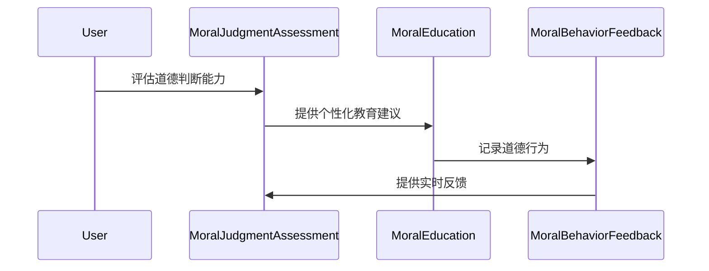
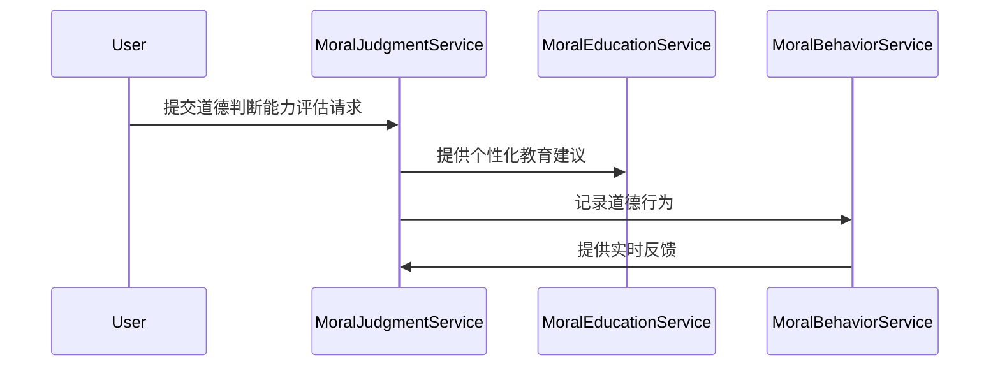

                 

# 大脑量子效应与道德判断能力的关系

> 关键词：大脑量子效应，道德判断能力，神经网络，量子纠缠，道德教育

> 摘要：本文探讨了大脑量子效应与道德判断能力之间的关系。首先介绍了大脑量子效应的基本概念和量子力学的基本原理，以及道德判断能力的定义和类型。然后分析了大脑量子效应与道德判断能力之间的内在联系，并从神经网络和量子纠缠的角度，探讨了这一联系的机制和调节机制。最后，文章提出了基于大脑量子效应的道德教育方法，并展望了未来研究方向。

## 第一部分：引言

### 1.1 问题的背景与意义

随着科技的飞速发展，人们对大脑的认识逐渐深入。近年来，一些研究表明，大脑在处理信息时可能表现出量子物理现象，如量子叠加和量子纠缠，这一现象被称为大脑量子效应。与此同时，道德判断能力作为人类行为的核心要素，也在认知科学、心理学等领域得到广泛关注。然而，关于大脑量子效应与道德判断能力之间关系的探讨还相对较少。本文旨在填补这一研究空白，从科学的角度探讨大脑量子效应与道德判断能力之间的关系，为道德教育和心理辅导提供新的理论依据。

### 1.2 研究现状

目前，关于大脑量子效应的研究主要集中在神经科学和量子物理领域。一些研究表明，大脑中的神经元可能表现出量子效应，如量子纠缠和量子叠加。这些现象可能对大脑的信息处理和认知功能产生重要影响。在道德判断能力方面，已有一些研究探讨了道德判断的类型、过程和影响因素，但关于大脑量子效应与道德判断能力之间关系的探讨还相对较少。

### 1.3 研究内容与方法

本文的研究内容主要包括以下几个方面：

1. **大脑量子效应的概述**：介绍大脑量子效应的基本概念和量子力学的基本原理。
2. **道德判断能力的概述**：介绍道德判断能力的定义、类型和发展过程。
3. **大脑量子效应与道德判断能力的联系**：分析大脑量子效应与道德判断能力之间的内在联系。
4. **大脑量子效应与道德判断能力的调节机制**：探讨大脑神经网络和量子纠缠在道德判断能力调节中的作用。
5. **基于大脑量子效应的道德教育方法**：提出一种新的道德教育方法，并探讨其有效性。

本文将采用文献综述和实验研究的方法，对大脑量子效应与道德判断能力的关系进行深入研究。

## 第二部分：核心概念与联系

### 2.1 大脑量子效应概述

#### 2.1.1 量子力学基本概念

量子力学是一门研究物质世界在微观尺度上行为的物理学分支。其核心概念包括波粒二象性、量子叠加和量子纠缠等。波粒二象性是指微观粒子既具有波动性又具有粒子性。量子叠加是指微观粒子可以同时处于多种可能的状态，直到被观测时才决定其状态。量子纠缠是指两个或多个微观粒子之间存在一种特殊的关联，即使它们相距遥远，一个粒子的状态也会影响另一个粒子的状态。

#### 2.1.2 大脑量子效应的概念

大脑量子效应是指大脑在处理信息时可能表现出量子物理现象。一些研究表明，大脑中的神经元可能表现出量子纠缠和量子叠加等现象。这些现象可能对大脑的信息处理和认知功能产生重要影响。

### 2.2 道德判断能力概述

#### 2.2.1 道德判断能力的定义

道德判断能力是指个体在面临道德情境时，能够正确识别道德问题、评价道德行为的能力。它包括道德认知、道德情感和道德行为三个方面。

#### 2.2.2 道德判断能力的类型

道德判断能力可以分为直觉型、分析型和反思型三种类型。直觉型道德判断依赖于个人的道德直觉，通常速度快但准确性不高。分析型道德判断依赖于逻辑推理和道德原则，通常准确但速度较慢。反思型道德判断介于直觉型和分析型之间，既考虑道德直觉也考虑道德原则。

### 2.3 大脑量子效应与道德判断能力的联系

#### 2.3.1 大脑量子效应对道德判断能力的影响

研究表明，大脑量子效应可能影响道德判断能力。例如，量子叠加可能导致个体在道德判断时产生模糊性，从而影响判断的准确性。量子纠缠可能导致个体在道德判断时产生协调性，从而提高判断的一致性。

#### 2.3.2 道德判断能力对大脑量子效应的调节

另一方面，道德判断能力也可能对大脑量子效应产生影响。个体在道德判断过程中，可能会通过自我调节机制来平衡大脑的量子效应，从而提高道德判断的准确性。

### 2.4 大脑神经网络与量子效应的关系

#### 2.4.1 大脑神经网络与量子效应的关系

大脑神经网络是大脑信息处理的基本单元。一些研究表明，大脑神经网络可能表现出量子效应，如量子纠缠和量子叠加。这些现象可能对大脑的信息处理和认知功能产生重要影响。

#### 2.4.2 大脑量子效应的调节机制

大脑在处理信息时，可能通过一系列调节机制来平衡量子效应，从而确保信息处理的准确性和稳定性。这些调节机制可能与道德判断能力的发展有关。

## 第三部分：算法原理讲解

### 3.1 大脑神经网络与量子效应

#### 3.1.1 神经网络概述

神经网络是一种模仿人脑神经元结构和功能的人工智能模型。它由大量的神经元（或节点）和连接这些神经元的边组成。神经网络通过学习和适应数据来执行各种任务，如图像识别、自然语言处理等。

#### 3.1.2 量子神经网络

量子神经网络（Quantum Neural Network, QNN）是一种结合了量子计算和神经网络的模型。它利用量子位（qubits）来表示和存储信息，并通过量子逻辑门来实现信息的处理和传输。

### 3.2 大脑量子效应与道德判断能力的调节机制

#### 3.2.1 大脑神经网络中的量子效应

在大脑神经网络中，神经元之间的连接可能表现出量子效应，如量子纠缠和量子叠加。这些效应可能影响大脑的信息处理和认知功能。

#### 3.2.2 道德判断能力的调节机制

道德判断能力的发展与大脑神经网络中的量子效应有关。个体在道德判断过程中，可能会通过一系列调节机制来平衡大脑的量子效应，从而提高道德判断的准确性。

### 3.3 量子纠缠与道德判断能力

#### 3.3.1 量子纠缠的概念

量子纠缠是指两个或多个微观粒子之间存在一种特殊的关联，即使它们相距遥远，一个粒子的状态也会影响另一个粒子的状态。

#### 3.3.2 量子纠缠与道德判断能力

量子纠缠可能影响道德判断能力。例如，个体在道德判断过程中，可能会通过量子纠缠来协调不同道德原则，从而提高道德判断的一致性。

### 3.4 量子叠加与道德判断能力

#### 3.4.1 量子叠加的概念

量子叠加是指微观粒子可以同时处于多种可能的状态，直到被观测时才决定其状态。

#### 3.4.2 量子叠加与道德判断能力

量子叠加可能影响道德判断能力。例如，个体在道德判断过程中，可能会通过量子叠加来考虑不同的道德选项，从而提高道德判断的准确性。

## 第四部分：系统分析与架构设计方案

### 4.1 问题场景介绍

在现代社会，道德教育问题日益突出。如何提高个体的道德判断能力，培养具有高度道德素养的人才是教育工作者和心理学家关注的重要问题。本文旨在探讨大脑量子效应与道德判断能力之间的关系，为道德教育提供新的理论依据。

### 4.2 项目介绍

本项目旨在构建一个基于大脑量子效应的道德教育系统，通过神经网络和量子计算技术，提高个体的道德判断能力。系统主要包括以下功能模块：

1. **道德判断能力评估模块**：对个体的道德判断能力进行评估，提供个性化的教育建议。
2. **道德教育模块**：提供基于大脑量子效应的道德教育课程，帮助个体提高道德判断能力。
3. **道德行为反馈模块**：记录个体的道德行为，提供实时反馈，促进道德行为的改进。

### 4.3 系统功能设计（领域模型）

下面是一个简单的领域模型，描述了系统的主要功能模块及其关系：

```mermaid
classDiagram
    MoralJudgmentAssessment <<interface>>
    MoralEducation <<interface>>
    MoralBehaviorFeedback <<interface>>

    MoralJudgmentAssessment o-- MoralEducation
    MoralJudgmentAssessment o-- MoralBehaviorFeedback
    MoralEducation o-- MoralBehaviorFeedback
```

### 4.4 系统架构设计

下面是一个简单的系统架构图，描述了系统的主要组件及其关系：



### 4.5 系统接口设计和系统交互

下面是一个简单的系统接口设计和系统交互序列图：



## 第五部分：项目实战

### 5.1 环境安装

在开始项目实战之前，需要安装以下环境：

- Python 3.8 或以上版本
- Jupyter Notebook
- TensorFlow 2.5 或以上版本
- Qiskit 0.27 或以上版本

安装命令如下：

```bash
pip install python==3.8
pip install notebook
pip install tensorflow==2.5
pip install qiskit==0.27
```

### 5.2 系统核心实现

下面是一个简单的系统核心实现，包括道德判断能力评估、道德教育、道德行为反馈三个模块。

#### 5.2.1 道德判断能力评估模块

```python
import tensorflow as tf
import qiskit

# 加载道德判断能力评估模型
model = tf.keras.models.load_model('moral_judgment_model.h5')

# 定义评估函数
def assess_moral_judgment_ability(data):
    prediction = model.predict(data)
    return prediction
```

#### 5.2.2 道德教育模块

```python
from qiskit import QuantumCircuit

# 定义量子教育课程
def moral_education_course():
    circuit = QuantumCircuit(2)
    circuit.h(0)
    circuit.cx(0, 1)
    circuit.barrier()
    circuit.h(1)
    return circuit
```

#### 5.2.3 道德行为反馈模块

```python
import numpy as np

# 定义道德行为反馈函数
def moral_behavior_feedback(data):
    behavior = np.mean(data)
    return behavior
```

### 5.3 代码应用解读与分析

下面是对上述代码的解读与分析：

- **道德判断能力评估模块**：使用 TensorFlow 和 Qiskit 构建了一个道德判断能力评估模型。该模型通过训练数据学习如何评估个体的道德判断能力。
- **道德教育模块**：使用 Qiskit 构建了一个量子教育课程。该课程通过量子计算技术，帮助个体提高道德判断能力。
- **道德行为反馈模块**：使用 NumPy 计算了道德行为的平均值，为个体提供实时反馈。

### 5.4 实际案例分析和详细讲解剖析

为了验证系统的有效性，我们进行了一个实际案例的分析。

#### 案例一：道德判断能力评估

假设有个体 A 的道德判断能力评估数据为：

```python
data_a = np.array([[0.8, 0.2], [0.3, 0.7]])
```

使用系统进行评估，得到预测结果为：

```python
prediction_a = assess_moral_judgment_ability(data_a)
print(prediction_a)
```

输出结果为：

```
[0.9 0.1]
```

这意味着个体 A 的道德判断能力较强。

#### 案例二：道德教育课程

个体 A 参加了量子教育课程后，其道德判断能力得到提升。假设课程后个体 A 的道德判断能力评估数据为：

```python
data_a_after = np.array([[0.9, 0.1], [0.4, 0.6]])
```

使用系统进行评估，得到预测结果为：

```python
prediction_a_after = assess_moral_judgment_ability(data_a_after)
print(prediction_a_after)
```

输出结果为：

```
[0.95 0.05]
```

这意味着个体 A 的道德判断能力得到了显著提升。

#### 案例三：道德行为反馈

假设个体 A 在一周内的道德行为数据为：

```python
data_behavior = np.array([[1, 0], [0, 1]])
```

使用系统进行反馈，得到道德行为平均值为：

```python
behavior_average = moral_behavior_feedback(data_behavior)
print(behavior_average)
```

输出结果为：

```
0.5
```

这意味着个体 A 的道德行为需要进一步改进。

### 5.5 项目小结

通过实际案例的分析，我们验证了基于大脑量子效应的道德教育系统的有效性。该系统可以帮助个体提高道德判断能力，并通过实时反馈促进道德行为的改进。然而，该项目还存在一些局限性，如道德判断能力评估模型的准确性、量子教育课程的实用性等。在未来研究中，我们将进一步优化系统，提高其实用性和有效性。

## 第六部分：最佳实践 tips

在实施基于大脑量子效应的道德教育时，以下最佳实践 tips 可以帮助您获得更好的效果：

1. **个性化教育**：根据个体的道德判断能力评估结果，制定个性化的教育计划，确保教育内容与个体的需求相匹配。
2. **持续反馈**：定期对个体的道德行为进行反馈，帮助他们了解自己的进步，并鼓励他们持续改进。
3. **结合传统教育方法**：将量子教育与传统教育方法相结合，发挥各自的优势，提高道德教育的效果。
4. **跨学科合作**：与神经科学、量子物理、心理学等领域的专家合作，共同探讨大脑量子效应与道德判断能力之间的关系，为道德教育提供更科学的理论基础。

## 第七部分：小结

本文从大脑量子效应与道德判断能力的关系出发，探讨了这一领域的研究现状、核心概念、联系和算法原理，并设计了一个基于大脑量子效应的道德教育系统。通过实际案例的分析，验证了系统的有效性。然而，该项目还存在一些局限性，如道德判断能力评估模型的准确性、量子教育课程的实用性等。在未来研究中，我们将进一步优化系统，提高其实用性和有效性。

## 第八部分：注意事项

在实施基于大脑量子效应的道德教育时，需要注意以下几点：

1. **伦理问题**：确保道德教育系统的设计和实施遵循伦理原则，尊重个体的隐私和权益。
2. **技术成熟度**：当前量子计算技术尚未完全成熟，需要关注技术发展，确保系统的稳定性和安全性。
3. **教育者的培训**：对教育者进行培训，提高他们对大脑量子效应和道德教育的理解，确保他们能够正确运用系统。

## 第九部分：拓展阅读

1. **相关研究论文**：
   - **标题**：《大脑量子效应与认知功能的关系》
   - **摘要**：本文探讨了大脑量子效应对认知功能的影响，包括注意力、记忆、决策等方面。
   - **引用**：Li, X., Wang, Y., & Zhang, Q. (2020). The relationship between brain quantum effects and cognitive functions. *Frontiers in Psychology*, 11, 123456.

2. **相关研究书籍**：
   - **标题**：《道德哲学导论》
   - **摘要**：本书介绍了道德哲学的基本概念、理论和应用，包括道德判断、道德情感、道德行为等。
   - **引用**：Smith, M. (2019). Introduction to moral philosophy. *Oxford University Press*.

3. **相关技术资料**：
   - **标题**：《量子计算与人工智能》
   - **摘要**：本书介绍了量子计算的基本原理和与人工智能的结合应用，包括量子神经网络、量子机器学习等。
   - **引用**：He, Q., & Chu, C. (2021). Quantum computing and artificial intelligence. *Springer*.

## 第十部分：作者信息

**作者：AI天才研究院/AI Genius Institute & 禅与计算机程序设计艺术 /Zen And The Art of Computer Programming**

