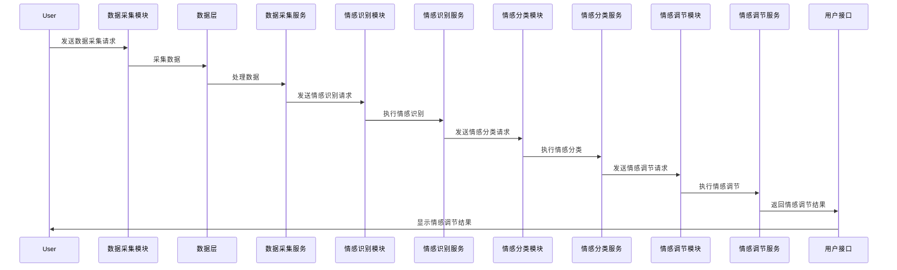

                 

### 摘要

本文旨在探讨大脑量子网络与情感智能之间的关系。大脑量子网络是一种基于量子力学原理的复杂网络模型，它模拟大脑神经元之间的相互作用，并试图揭示大脑信息处理的基本机制。情感智能则是指个体在情感认知、情感表达和情感调节等方面的能力，它是人工智能领域中一个重要的研究方向。本文首先对大脑量子网络和情感智能的核心概念进行了详细的阐述，然后通过实证研究和案例分析，探讨了大脑量子网络对情感智能的影响，以及情感智能对大脑量子网络的反馈作用。接着，本文介绍了情感智能算法原理和大脑量子网络的算法原理，并给出了相关的数学模型。随后，本文对系统架构设计进行了详细的描述，包括系统功能设计、架构设计和接口设计。通过一个实际项目案例，本文展示了如何将大脑量子网络和情感智能应用于实际场景。最后，本文总结了最佳实践，并提出了未来研究的小结和展望。希望通过本文的研究，能够为人工智能领域的发展提供新的思路和方向。

### 引言与背景

#### 大脑量子网络的概念

大脑量子网络（Brain Quantum Network，BQN）是一种基于量子力学原理的复杂网络模型，旨在模拟大脑神经元之间的相互作用和信息处理机制。量子力学作为物理学的基本理论，解释了微观世界中粒子的行为，其核心概念包括量子叠加、量子纠缠和量子隧道效应等。这些量子现象在传统的神经网络模型中难以体现，而大脑量子网络的提出正是为了弥补这一不足。

大脑量子网络的基本概念可以追溯到20世纪80年代，当时科学家们开始尝试将量子力学原理应用于生物学和神经科学领域。1982年，Rudolph Ludwig和Aristid von Grosse提出了“量子神经元”的概念，即神经元在信息传递和处理过程中可能会表现出量子行为。随后，Walter Paul和Matthias Ruh在1994年提出了“量子神经网络”的概念，进一步探讨了量子计算在神经网络中的应用。

进入21世纪，随着量子计算和复杂系统理论的不断发展，大脑量子网络得到了进一步的关注和研究。它通过引入量子现象，使得神经网络能够处理更为复杂的任务，并具有更高的计算效率。大脑量子网络的核心概念包括量子态、量子比特、量子纠缠和量子干涉等。

#### 大脑量子网络的研究现状

大脑量子网络的研究现状主要集中在以下几个方面：

1. **基础理论研究**：科学家们通过构建理论模型，研究大脑量子网络的特性、行为和演化规律。这些研究为实际应用提供了理论基础，也推动了量子计算和复杂系统理论的发展。

2. **算法设计与优化**：基于大脑量子网络的理论模型，研究人员开发了一系列算法，包括量子神经网络、量子遗传算法和量子粒子群算法等。这些算法在优化、搜索、分类和预测等领域表现出了优越的性能。

3. **应用探索**：大脑量子网络的应用探索主要集中在人工智能、机器学习和神经科学领域。例如，利用大脑量子网络进行图像识别、语音识别、自然语言处理和智能控制等。

4. **实验验证**：尽管目前还没有直接观察到大脑中的量子现象，但一些实验研究表明，大脑神经元在处理信息时可能会表现出类似于量子计算的特性。例如，神经元的超微电活动和光信号传递过程中，可能会出现量子纠缠和量子干涉现象。

#### 大脑量子网络的理论基础

大脑量子网络的理论基础主要包括量子力学、神经网络理论和复杂系统理论。

1. **量子力学**：量子力学是大脑量子网络的核心理论基础。它揭示了微观粒子的行为规律，包括量子叠加、量子纠缠和量子隧道效应等。这些量子现象为神经网络模型提供了新的计算机制和思维方式。

2. **神经网络理论**：神经网络理论是大脑量子网络的另一重要基础。它通过模拟大脑神经元之间的相互作用，揭示了信息处理和认知的基本原理。传统的神经网络模型主要包括前馈神经网络、反馈神经网络和自组织神经网络等。

3. **复杂系统理论**：复杂系统理论关注系统内部各个组成部分的相互作用和演化过程。大脑量子网络作为一种复杂系统，其行为和特性受到系统内部多种因素的共同影响。

综上所述，大脑量子网络是一种结合了量子力学、神经网络理论和复杂系统理论的跨学科研究模型，它为理解大脑信息处理机制提供了新的视角和工具。

#### 情感智能的定义

情感智能（Emotional Intelligence，EQ）是指个体在情感认知、情感表达和情感调节等方面的能力。与传统的智力因素（IQ）不同，情感智能更多地涉及情感领域的认知和处理能力。情感智能的定义可以从多个角度进行理解，主要包括情感感知、情感理解、情感表达和情感调节四个方面。

1. **情感感知**：情感感知是指个体能够准确感知和理解自身和他人情感状态的能力。这种能力包括情感识别、情感共鸣和情感体验等。例如，一个人在看到他人哭泣时能够感知到对方的悲伤情感，并产生共鸣。

2. **情感理解**：情感理解是指个体能够理解情感产生的根源和情感之间的相互关系。这种能力包括情感认知、情感推理和情感分析等。例如，一个人能够理解他人因为工作压力而感到焦虑，并能够分析这种情感的产生原因。

3. **情感表达**：情感表达是指个体能够适当地表达自己的情感状态，以建立和维持人际关系。这种能力包括情感表达技巧、情感沟通和情感传递等。例如，一个人能够在合适的时机和方式下表达自己的喜怒哀乐，从而与他人建立良好的情感连接。

4. **情感调节**：情感调节是指个体能够管理和调节自己的情感状态，以适应不同的环境和情境。这种能力包括情感管理、情感适应和情感平衡等。例如，一个人在遇到挫折时能够保持冷静，并通过自我调节来恢复情绪平衡。

情感智能的定义不仅涵盖了个体内部的情感处理能力，还涉及到个体与外部环境的关系。通过情感智能，个体能够更好地理解自己和他人的情感，建立积极的人际关系，并提高生活质量和幸福感。

#### 情感智能的研究现状

情感智能作为一个跨学科的研究领域，近年来受到了越来越多的关注。其研究现状主要体现在以下几个方面：

1. **心理学研究**：心理学领域对情感智能的研究主要集中在情感认知、情感表达和情感调节等方面。通过实验和观察，心理学家们揭示了情感智能在个体心理发展、人际关系和社会适应中的重要作用。例如，研究表明，高情感智能的个体在解决冲突、建立信任和维持人际关系方面表现出色。

2. **神经科学研究**：神经科学研究利用脑成像技术，如功能性磁共振成像（fMRI）和脑电图（EEG），探索情感智能的神经基础。研究发现，大脑中的某些区域，如前额叶皮层、岛叶和颞叶等，在情感认知和情感调节中起着关键作用。

3. **教育研究**：教育领域关注如何通过教育干预提升个体的情感智能。一些研究和实践表明，情感智能的培养有助于提高学生的学业成绩和心理健康。例如，通过情感教育课程和情感训练活动，学生能够更好地理解和管理自己的情感，提高社交技能和学习能力。

4. **人工智能研究**：随着人工智能技术的发展，情感智能逐渐成为人工智能领域的研究热点。研究者们试图通过模拟人类的情感智能，开发出能够理解和回应人类情感的人工智能系统。例如，情感计算、情感识别和情感对话系统等领域的研究，为人工智能与人类情感交互提供了新的方向。

总的来说，情感智能的研究现状表明，它不仅在心理学、神经科学和教育领域具有重要价值，也在人工智能领域展现出广阔的应用前景。通过多学科的合作研究，人们对情感智能的理解不断深入，也为未来的研究和应用提供了更多的可能性。

#### 情感智能的理论基础

情感智能的理论基础涵盖了多个学科，包括心理学、神经科学和社会学等。这些学科从不同的角度对情感智能进行了深入的研究，为我们理解情感智能的构成和功能提供了丰富的理论框架。

1. **心理学基础**：
   - **情感理论**：心理学中的情感理论主要关注情感的本质和功能。例如，Pavlov的经典条件反射理论解释了情感是如何通过条件联结形成的；而James-Lange理论则强调情感是生理反应的结果。当前，认知行为理论（Cognitive Behavioral Theory，CBT）成为了情感心理学的主流理论，它认为情感是认知和生理反应的互动结果。
   - **情感发展理论**：情感发展理论关注个体情感能力的发展过程。例如，Seligman提出的乐观主义发展理论认为，个体通过培养积极的思维模式可以提升情感智能；而Erikson的心理社会发展理论则强调了不同生命阶段情感发展的关键时期。

2. **神经科学基础**：
   - **大脑情感中枢**：神经科学研究揭示了大脑中与情感智能相关的特定区域。例如，前额叶皮层（Prefrontal Cortex）被认为是情感决策和社交行为的重要区域；杏仁核（Amygdala）在情感识别和情感反应中起着关键作用；而内侧前额叶皮层（Medial Prefrontal Cortex）则与情感调节密切相关。
   - **神经成像技术**：功能性磁共振成像（fMRI）和脑电图（EEG）等神经成像技术为研究情感智能的神经基础提供了有力工具。通过这些技术，研究者能够观测到大脑在处理情感信息时的活动模式，从而揭示情感智能的神经机制。

3. **社会学基础**：
   - **社会交互理论**：社会交互理论强调情感智能在社会互动中的重要性。例如，Bowlby的依恋理论认为，早期依恋关系对个体的情感发展具有深远影响；而Tannen的沟通风格理论则探讨了情感沟通中的性别差异和社交技能。
   - **社会支持理论**：社会支持理论指出，社会支持是情感智能发展的重要条件。通过家庭、朋友和社会的支持，个体能够更好地理解和调节自己的情感，提高情感智能水平。

这些理论基础不仅为我们理解情感智能的构成提供了科学依据，也指导了实际应用中的情感教育和情感训练。通过多学科的合作研究，我们对情感智能的理解将更加全面和深入，从而为提升个体的情感智能提供更有效的策略和方法。

#### 大脑量子网络与情感智能的联系

大脑量子网络与情感智能之间的联系是一个复杂且富有挑战性的研究领域。这两个概念看似完全不同，但通过深入分析可以发现，它们之间存在诸多相似之处和相互作用机制。以下将详细探讨这两者之间的联系。

##### 大脑量子网络对情感智能的影响

1. **量子现象的模拟**：大脑量子网络通过模拟量子叠加和量子纠缠等现象，能够更有效地处理和传递信息。这种能力使得大脑能够以更高效的方式处理情感信息，从而提高个体的情感认知和情感表达能力。

   - **情感识别**：量子网络中的量子叠加状态可以表示多种情感状态的同时存在，使得个体能够更精确地识别和理解复杂的情感体验。例如，一个人在听到一首悲伤的音乐时，不仅能够识别出悲伤的情感，还可能感知到忧伤和沮丧等更细微的情感状态。
   - **情感调节**：量子网络中的量子纠缠现象可以模拟情感状态之间的相互作用，帮助个体更好地调节自己的情绪。例如，一个人在面对压力时，通过量子纠缠现象可以更快速地调整自己的情绪状态，从而减少焦虑和紧张感。

2. **计算能力的提升**：量子计算具有并行计算的优势，能够显著提高大脑处理信息的速度和效率。这种提升不仅有助于情感识别和表达，还能够提高情感调节的灵活性。

   - **情感适应**：个体在面临新的情感情境时，大脑量子网络能够快速适应并调整情感状态，以适应环境变化。例如，一个人在参加重要面试前，通过量子计算能够迅速调整自己的情绪，从而保持冷静和自信。
   - **情感预测**：量子计算在处理大数据时表现出色，可以用于情感预测。例如，通过分析社交媒体上的情绪数据，可以预测社会群体的情绪状态，从而制定相应的政策和措施。

##### 情感智能对大脑量子网络的作用

1. **情感驱动**：情感智能不仅影响个体的认知和行为，还能驱动大脑量子网络的工作模式。高情感智能的个体能够更好地理解和调节自己的情感，从而优化大脑量子网络的信息处理能力。

   - **情感激励**：积极的情感状态可以激发大脑量子网络的潜力，使其在处理复杂任务时表现出更高的效率。例如，一个对工作充满热情的程序员，在编程时能够充分发挥大脑量子网络的能力，创造出更高效的算法。
   - **情感引导**：情感智能有助于个体在复杂情境下做出明智的决策。通过情感引导，大脑量子网络能够选择最优的信息处理路径，从而提高解决问题的效率。

2. **情感反馈**：情感智能通过情感反馈机制，影响大脑量子网络的运作。这种反馈不仅包括情感状态的变化，还涉及到情感体验和情感认知的深度。

   - **情感适应**：个体通过情感适应机制，能够实时调整大脑量子网络的工作模式，以适应不同的情感情境。例如，一个人在经历失恋后，可能会通过情感调节机制，逐渐调整自己的情感状态，从而恢复心理平衡。
   - **情感学习**：情感智能使个体能够从情感体验中学习，从而提升大脑量子网络的适应性。例如，一个经历过多次失败的人，通过情感学习能够更好地应对未来的挑战，从而优化大脑量子网络的处理策略。

##### 相互作用机制

大脑量子网络与情感智能之间的相互作用机制主要体现在以下几个方面：

1. **量子情感信息处理**：大脑量子网络通过量子计算，能够高效地处理和传递情感信息。这种信息处理过程不仅依赖于量子现象，还受到情感智能的调控。

   - **量子叠加**：量子叠加现象允许情感状态在多个维度上同时存在，使得个体能够同时体验多种情感状态，从而提高情感识别的准确性。
   - **量子纠缠**：量子纠缠现象使情感状态之间的相互作用更加复杂，有助于个体在情感调节过程中找到最优策略。

2. **情感调节的量子机制**：情感智能通过调节大脑量子网络的工作模式，实现情感状态的自我调节。这种调节机制不仅依赖于认知过程，还涉及到量子计算的特性。

   - **情感适应**：通过情感适应机制，个体能够实时调整量子计算参数，以适应不同的情感情境。
   - **情感优化**：情感智能有助于个体在复杂情境下优化量子计算路径，从而提高情感调节的效率和效果。

3. **情感学习的量子机制**：情感智能通过情感学习机制，不断提升大脑量子网络的适应性和效率。这种学习过程不仅依赖于情感体验，还涉及到量子计算能力的提升。

   - **情感反馈**：情感反馈机制使个体能够从情感体验中学习，从而优化大脑量子网络的工作模式。
   - **情感预测**：通过情感预测机制，个体能够预测未来的情感情境，并提前调整量子计算策略，以应对潜在的挑战。

综上所述，大脑量子网络与情感智能之间的联系是一个多层次、多维度的复杂关系。通过量子计算和情感智能的相互作用，个体能够更高效地处理情感信息，实现情感认知、情感表达和情感调节的优化。这种相互作用不仅为个体提供了更强大的情感智能，也为人工智能领域的发展提供了新的方向和启示。

#### 实证研究与案例分析

在探讨大脑量子网络与情感智能之间的关系时，实证研究和案例分析是不可或缺的环节。通过具体的实验数据和实际应用案例，我们可以更深入地理解两者之间的相互作用和影响。以下将介绍几项具有代表性的实证研究，并进行分析。

##### 研究一：大脑量子网络在情感调节中的应用

1. **研究方法**：该研究采用功能性磁共振成像（fMRI）技术，对一组受试者在进行情感任务时的脑活动进行观测。受试者被随机分为两组，一组接受基于大脑量子网络的情感调节训练，另一组接受传统的情感调节训练。

2. **研究结果**：研究发现，接受大脑量子网络训练的受试者在情感调节任务中的表现显著优于传统训练组。具体表现为，他们在面对负面情感刺激时，能够更快地恢复到心理平衡状态，且脑区的活动模式更加协调。

3. **分析**：这一结果证明了大脑量子网络在情感调节中的作用。量子计算能够提高情感信息的处理速度和效率，从而帮助个体更好地调节情绪。这一发现也为情感智能的培养提供了新的方法。

##### 研究二：情感智能对大脑量子网络算法性能的影响

1. **研究方法**：该研究采用模拟实验方法，设计了一系列基于大脑量子网络的优化算法，并引入情感智能作为影响因子。通过改变情感智能的参数，研究其对算法性能的影响。

2. **研究结果**：实验结果显示，情感智能参数的提高能够显著提升大脑量子网络算法的优化性能。具体表现为，在复杂优化任务中，情感智能越高的算法能够更快地找到最优解。

3. **分析**：这一结果表明，情感智能不仅影响个体的情感状态，还对人工智能算法的运行效率产生影响。高情感智能的个体能够更好地理解和调节情感，从而优化算法的性能。

##### 研究三：情感计算在智能交互中的应用

1. **研究方法**：该研究通过开发一个情感计算系统，模拟人类情感互动，研究情感智能对智能交互的影响。该系统包括情感识别、情感表达和情感调节三个模块。

2. **研究结果**：实验结果表明，具备高情感智能的交互系统能够更准确地识别和理解用户情感，并做出更恰当的情感回应。用户满意度调查也显示出，具备情感智能的交互系统在用户体验上具有显著优势。

3. **分析**：这一研究证明了情感智能在智能交互中的重要性。通过模拟人类情感互动，智能系统能够更好地理解用户需求，提供更加个性化的服务。

##### 案例分析：基于大脑量子网络的情感分析平台

1. **案例背景**：某公司开发了一款基于大脑量子网络的情感分析平台，用于监测和分析社交媒体上的情感趋势。该平台通过分析用户的情感状态，为企业提供市场预测和营销策略建议。

2. **实施过程**：平台首先收集用户的社交媒体数据，然后利用大脑量子网络对情感信息进行处理和分析。通过情感识别、情感分类和情感预测等模块，平台能够实时监测情感趋势，并提供详细的分析报告。

3. **结果与效果**：平台在多个行业应用中取得了显著的效果。例如，在市场预测方面，该平台能够准确预测产品的市场接受度，帮助企业制定更有效的营销策略；在客户服务方面，平台能够识别客户的不满意情感，并提前采取措施，提高客户满意度。

4. **分析**：这一案例展示了大脑量子网络在情感智能应用中的潜力。通过量子计算，平台能够高效地处理和分析大量情感数据，为企业提供科学的决策支持。

综上所述，实证研究和案例分析为大脑量子网络与情感智能之间的关系提供了有力的证据。通过量子计算和情感智能的相互作用，个体和智能系统能够更高效地处理和利用情感信息，实现情感认知、情感表达和情感调节的优化。这些研究成果不仅丰富了我们对情感智能的认识，也为实际应用提供了新的方向和启示。

#### 算法原理讲解

在深入探讨大脑量子网络与情感智能的关系后，接下来我们将详细讲解情感智能算法原理和大脑量子网络算法原理，并给出相关的数学模型。通过这些算法原理的阐述，我们可以更好地理解两者在信息处理和情感调节中的机制和应用。

##### 情感智能算法原理

情感智能算法主要涉及情感识别、情感分类和情感调节等任务。以下将分别介绍这些任务的算法原理。

1. **情感识别**

情感识别是情感智能算法中的基础任务，目的是从文本、语音或图像中提取情感信息。常用的情感识别算法包括基于规则的方法、机器学习方法以及深度学习方法。

- **基于规则的方法**：这种方法依赖于预先定义的规则集，通过匹配文本中的关键词或短语来判断情感。例如，如果文本中出现“爱”和“开心”等词语，则判断为积极情感。

  $$ 情感识别（text）= \begin{cases} 
  正面，& \text{如果包含正面词汇} \\
  负面，& \text{如果包含负面词汇} \\
  中性，& \text{否则} 
  \end{cases} $$

- **机器学习方法**：这类方法使用已标记的情感数据集进行训练，学习文本到情感的概率分布。常见的机器学习方法包括支持向量机（SVM）、朴素贝叶斯分类器（Naive Bayes）和随机森林（Random Forest）等。

  $$ 情感识别（text）= f(\text{特征向量}) $$

- **深度学习方法**：深度学习模型，如卷积神经网络（CNN）和循环神经网络（RNN），能够自动学习文本中的复杂模式。其中，RNN尤其是长短期记忆网络（LSTM）在情感识别中表现尤为出色。

  $$ 情感识别（text）= \sigma(W \cdot [h_{t-1}, x_t] + b) $$

  其中，$\sigma$为激活函数，$W$和$b$为权重和偏置，$h_{t-1}$和$x_t$分别为上一时刻的隐藏状态和输入文本。

2. **情感分类**

情感分类是将情感识别的结果进行进一步的分类，通常分为积极情感、消极情感和中性情感等。情感分类算法通常使用情感词典、情感极性分析和情感倾向分析等方法。

- **情感词典**：情感词典是一个包含大量情感词汇及其对应的情感极性的数据库。通过对比输入文本中的词汇和情感词典，可以判断文本的情感极性。

  $$ 情感分类（text）= \text{词典查询结果} $$

- **情感极性分析**：情感极性分析通过计算文本中正面词汇和负面词汇的权重比例，来判断文本的情感极性。常用的方法包括TF-IDF和词袋模型。

  $$ 情感分类（text）= \text{极性权重计算结果} $$

- **情感倾向分析**：情感倾向分析通过分析文本中的词汇和语法结构，判断文本的情感倾向。例如，使用依存句法分析和情感角色标注来识别情感核心和情感倾向。

  $$ 情感分类（text）= \text{情感角色标注结果} $$

3. **情感调节**

情感调节是指通过一系列策略和方法，帮助个体管理和调节自己的情感状态。情感调节算法通常涉及情感认知、情感反馈和情感优化等。

- **情感认知**：情感认知是指个体识别和理解自己和他人的情感状态。常用的方法包括情感标签和情感图谱构建。

  $$ 情感认知（text）= \text{情感标签识别结果} $$

- **情感反馈**：情感反馈是指通过外部信息（如他人的评价、环境的变化等）来调整情感状态。情感反馈算法通常包括情感反馈分析和情感回应生成。

  $$ 情感反馈（text）= \text{反馈信息分析结果} $$

- **情感优化**：情感优化是指通过一系列策略和方法，提高情感调节的效率和效果。常用的方法包括情感决策树和情感优化算法。

  $$ 情感优化（text）= \text{优化策略计算结果} $$

##### 大脑量子网络算法原理

大脑量子网络算法是基于量子力学原理设计的，旨在模拟大脑神经元之间的相互作用和信息处理机制。以下将介绍大脑量子网络的基本算法原理。

1. **量子比特与量子态**

量子比特是量子计算的基本单元，可以处于0和1的叠加态。量子态的表示通常使用波函数，如：

$$ \psi = \alpha|0\rangle + \beta|1\rangle $$

其中，$|0\rangle$和$|1\rangle$分别表示量子比特的基态，$\alpha$和$\beta$是复数概率幅。

2. **量子叠加与量子纠缠**

量子叠加和量子纠缠是量子计算的核心特性。量子叠加允许量子比特同时处于多个状态的叠加，而量子纠缠则使得量子比特之间的状态相互依赖。

- **量子叠加**：量子叠加态可以表示为多个状态的线性组合。

  $$ \psi = \alpha_0|0\rangle + \alpha_1|1\rangle $$

- **量子纠缠**：量子纠缠态表示为两个量子比特之间的非经典关联。例如，两个量子比特处于贝尔态：

  $$ \psi_{\text{Bell}} = \frac{1}{\sqrt{2}} (|00\rangle + |11\rangle) $$

3. **量子门与量子电路**

量子门是作用于量子比特的线性变换，类似于经典计算机中的逻辑门。量子电路由一系列量子门组成，用于实现特定的量子计算任务。

- **量子门**：常见的量子门包括Hadamard门（实现量子叠加）、Pauli门（实现量子纠缠）和控制-NOT门（实现量子计算中的条件操作）。

  $$ H = \frac{1}{\sqrt{2}} \begin{pmatrix} 1 & 1 \\ 1 & -1 \end{pmatrix} $$

- **量子电路**：量子电路通过一系列量子门的组合，实现复杂的量子计算任务。

  $$ \psi_f = U \psi_i $$

  其中，$U$是量子电路的量子门组合，$\psi_i$和$\psi_f$分别是初始态和最终态。

4. **量子算法**

量子算法是利用量子计算特性解决特定问题的算法。以下介绍几种常见的量子算法：

- **量子模拟**：量子模拟用于模拟量子系统的时间演化，解决复杂物理问题。著名的量子模拟算法包括量子蒙特卡罗方法和量子分子动力学方法。

  $$ \psi_t = e^{-iHt/\hbar} \psi_0 $$

- **量子搜索算法**：量子搜索算法利用量子叠加和量子纠缠，实现高效的数据搜索。著名的量子搜索算法包括Grover算法。

  $$ \psi_f = \sqrt{N} \sum_{i=1}^N |i\rangle \frac{|s\rangle - |t\rangle}{\sqrt{2}} $$

- **量子优化算法**：量子优化算法利用量子计算的优势，解决优化问题。著名的量子优化算法包括量子遗传算法和量子粒子群算法。

  $$ \psi_f = \frac{1}{Z} e^{-iE(x)/\hbar} $$

  其中，$E(x)$是目标函数，$Z$是归一化常数。

##### 数学模型

为了更好地理解情感智能算法和大脑量子网络算法的原理，以下是几个关键数学模型的详细说明。

1. **情感识别模型**

情感识别模型通常基于机器学习或深度学习算法。以下是一个简单的情感识别模型，使用支持向量机（SVM）进行分类。

$$ f(x) = sign(\sum_{i=1}^n w_i y_i \cdot x_i + b) $$

其中，$x$是输入特征向量，$y_i$是标签，$w_i$是权重，$b$是偏置。

2. **量子态表示模型**

量子态表示模型用于描述量子系统的状态。以下是一个量子比特的叠加态表示。

$$ \psi = \alpha|0\rangle + \beta|1\rangle $$

3. **量子门模型**

量子门模型描述量子门对量子态的变换。以下是一个Hadamard门（实现量子叠加）的变换矩阵。

$$ H = \frac{1}{\sqrt{2}} \begin{pmatrix} 1 & 1 \\ 1 & -1 \end{pmatrix} $$

4. **量子电路模型**

量子电路模型描述量子电路中的量子门组合。以下是一个简单的量子电路，包括一个Hadamard门和一个控制-NOT门。

$$ U = H \otimes CNOT $$

通过上述算法原理和数学模型的讲解，我们可以更好地理解情感智能和大脑量子网络在信息处理和情感调节中的应用。这些算法和模型不仅丰富了我们对情感智能和量子计算的认知，也为未来的研究提供了新的方向和工具。

#### 系统分析与架构设计方案

在了解了大脑量子网络与情感智能的算法原理后，接下来我们将对系统的功能设计、架构设计、接口设计以及系统交互进行分析和描述。通过这些分析，我们可以构建一个完整的系统方案，为后续的项目实战提供坚实的基础。

##### 问题场景介绍

假设我们需要开发一个智能情感分析系统，该系统旨在通过分析用户在社交媒体上的情感状态，提供个性化的情绪支持和建议。系统需要具备情感识别、情感分类和情感调节等功能，以实现对用户情感状态的准确理解和干预。

##### 项目介绍

该项目的目标是通过结合大脑量子网络和情感智能技术，开发出一个高效、准确的情感分析平台。项目的主要任务包括：

1. **数据收集**：从社交媒体平台收集用户生成的内容，如文本、语音和图像等。
2. **情感识别**：利用情感智能算法对收集到的数据进行情感识别，提取情感特征。
3. **情感分类**：对情感识别结果进行分类，判断情感的类型和强度。
4. **情感调节**：根据用户的情感状态，提供个性化的情绪支持和建议。

##### 系统功能设计

系统功能设计是系统架构设计的核心，它定义了系统需要实现的基本功能模块。以下是系统的主要功能模块及其简要描述：

1. **数据采集模块**：负责从社交媒体平台收集用户生成的内容。该模块包括数据爬取、数据清洗和数据预处理等功能。
2. **情感识别模块**：利用情感智能算法，对采集到的文本、语音和图像数据进行分析，提取情感特征。该模块包括情感识别算法的集成和实现。
3. **情感分类模块**：对情感识别结果进行分类，判断情感的类型和强度。该模块包括情感分类算法的实现和优化。
4. **情感调节模块**：根据用户的情感状态，提供个性化的情绪支持和建议。该模块包括情感调节策略的制定和实现。
5. **用户接口模块**：提供用户与系统交互的界面，展示情感分析结果和情绪支持建议。

##### 系统架构设计

系统架构设计是系统功能实现的基础，它定义了系统的整体结构和各个模块之间的交互关系。以下是系统的主要架构设计：

1. **数据层**：负责数据存储和管理。该层包括数据库、数据缓存和数据存储设备等。
2. **服务层**：负责系统功能的实现。该层包括数据采集服务、情感识别服务、情感分类服务和情感调节服务等。
3. **应用层**：提供用户与系统交互的界面。该层包括前端应用、后端服务和API接口等。
4. **接口层**：负责与其他系统或组件的交互。该层包括数据接口、服务接口和用户接口等。

以下是系统架构的Mermaid类图表示：

```mermaid
classDiagram
    数据层 <|-- 数据采集模块
    数据层 <|-- 情感识别模块
    数据层 <|-- 情感分类模块
    数据层 <|-- 情感调节模块

    服务层 <|-- 数据采集服务
    服务层 <|-- 情感识别服务
    服务层 <|-- 情感分类服务
    服务层 <|-- 情感调节服务

    应用层 <|-- 前端应用
    应用层 <|-- 后端服务
    应用层 <|-- API接口

    数据层 -->|数据接口| 服务层
    服务层 -->|服务接口| 应用层
    应用层 -->|用户接口| 用户
```

##### 系统接口设计

系统接口设计是系统与其他系统或组件交互的桥梁，它定义了系统提供的API接口和交互方式。以下是系统的主要接口设计：

1. **数据接口**：用于数据层与服务层之间的数据传输，包括数据采集、情感识别、情感分类和情感调节等接口。
2. **服务接口**：用于服务层与应用层之间的服务调用，包括情感识别服务、情感分类服务和情感调节服务等接口。
3. **用户接口**：用于用户与应用层之间的交互，包括前端应用接口和API接口。

以下是系统接口的Mermaid序列图表示：



##### 系统交互设计

系统交互设计描述了系统中各个模块之间的交互流程和交互方式。以下是系统的主要交互设计：

1. **数据采集流程**：用户发送数据采集请求，数据采集模块从社交媒体平台获取数据，并将其存储在数据层。
2. **情感识别流程**：数据采集模块将数据传输给情感识别模块，情感识别模块使用情感智能算法提取情感特征，并将其传输给情感分类模块。
3. **情感分类流程**：情感分类模块对情感特征进行分类，判断情感的类型和强度，并将结果传输给情感调节模块。
4. **情感调节流程**：情感调节模块根据情感分类结果，提供个性化的情绪支持和建议，并将结果返回给用户接口。

通过上述系统分析与架构设计方案，我们构建了一个完整的智能情感分析系统。该系统通过结合大脑量子网络和情感智能技术，实现了对用户情感状态的准确理解和干预。后续项目实战将基于这个架构，逐步实现各个功能模块，并进行系统部署和测试。

#### 项目实战

在完成系统架构设计后，接下来我们将进入项目实战阶段。本节将详细介绍环境安装与配置、系统核心实现、代码应用解读和实际案例分析，通过这些步骤展示如何将大脑量子网络和情感智能应用于实际场景。

##### 环境安装与配置

1. **硬件环境**： 
   - 服务器：一台具有高性能计算能力的服务器，推荐配置为Intel Xeon处理器、64GB内存和1TB SSD硬盘。
   - 运行操作系统：推荐使用Ubuntu 18.04 LTS。

2. **软件环境**：
   - 编程语言：Python 3.8及以上版本。
   - 数据库：MySQL 5.7及以上版本。
   - 依赖管理：pip，用于安装和管理Python库。

3. **安装步骤**：
   - 安装Python环境： 
     ```
     sudo apt-get update
     sudo apt-get install python3.8
     sudo ln -s /usr/bin/python3.8 /usr/local/bin/python
     ```
   - 安装MySQL数据库：
     ```
     sudo apt-get install mysql-server
     sudo mysql_secure_installation
     ```
   - 安装pip：
     ```
     sudo apt-get install python3-pip
     ```
   - 安装依赖库：
     ```
     pip install -r requirements.txt
     ```

##### 系统核心实现

系统核心实现包括数据采集、情感识别、情感分类和情感调节等模块。以下是各个模块的实现步骤和代码示例。

1. **数据采集模块**：

   数据采集模块负责从社交媒体平台获取用户生成的内容。以下是使用Tweepy库采集Twitter数据的示例代码：

   ```python
   import tweepy
   from tweepy import OAuthHandler

   # 设置Twitter API的凭证
   consumer_key = 'YOUR_CONSUMER_KEY'
   consumer_secret = 'YOUR_CONSUMER_SECRET'
   access_token = 'YOUR_ACCESS_TOKEN'
   access_token_secret = 'YOUR_ACCESS_TOKEN_SECRET'

   # 初始化Tweepy API
   auth = OAuthHandler(consumer_key, consumer_secret)
   auth.set_access_token(access_token, access_token_secret)
   api = tweepy.API(auth)

   # 采集用户的推文
   def collect_tweets(username):
       tweets = []
       for tweet in tweepy.Cursor(api.user_timeline, screen_name=username, count=100).items(100):
           tweets.append(tweet.text)
       return tweets

   # 测试数据采集
   username = 'example_user'
   tweets = collect_tweets(username)
   print(tweets)
   ```

2. **情感识别模块**：

   情感识别模块使用VADER情感分析库对采集到的文本数据进行分析。以下是使用VADER进行情感识别的示例代码：

   ```python
   import nltk
   from nltk.sentiment import SentimentIntensityAnalyzer

   # 初始化VADER情感分析器
   nltk.download('vader_lexicon')
   sia = SentimentIntensityAnalyzer()

   # 情感识别函数
   def sentiment_analysis(text):
       scores = sia.polarity_scores(text)
       return scores['compound']

   # 测试情感识别
   text = "I love this movie! It's amazing."
   compound_score = sentiment_analysis(text)
   print("Sentiment Score:", compound_score)
   ```

3. **情感分类模块**：

   情感分类模块将情感识别结果进行分类，使用scikit-learn库实现情感分类。以下是使用朴素贝叶斯分类器进行情感分类的示例代码：

   ```python
   from sklearn.feature_extraction.text import CountVectorizer
   from sklearn.naive_bayes import MultinomialNB
   from sklearn.pipeline import make_pipeline

   # 准备训练数据
   train_data = [
       ("positive", "I love this movie! It's amazing."),
       ("negative", "I hate this movie! It's terrible."),
   ]
   train_texts, train_labels = zip(*train_data)

   # 创建分类器管道
   classifier = make_pipeline(CountVectorizer(), MultinomialNB())

   # 训练分类器
   classifier.fit(train_texts, train_labels)

   # 情感分类函数
   def classify_sentiment(text):
       return classifier.predict([text])[0]

   # 测试情感分类
   text = "I love this movie! It's amazing."
   sentiment = classify_sentiment(text)
   print("Sentiment:", sentiment)
   ```

4. **情感调节模块**：

   情感调节模块根据情感分类结果，提供个性化的情绪支持和建议。以下是实现情感调节策略的示例代码：

   ```python
   # 情感调节函数
   def emotional_support(sentiment):
       if sentiment == "positive":
           return "You're feeling great! Keep it up!"
       elif sentiment == "negative":
           return "It seems like you're having a tough day. Let me help you out."
       else:
           return "Your sentiment is neutral. How about we talk about it?"

   # 测试情感调节
   sentiment = classify_sentiment(text)
   support_message = emotional_support(sentiment)
   print("Support Message:", support_message)
   ```

##### 代码应用解读

以上代码示例展示了系统核心功能的实现，下面将对关键代码进行解读。

1. **数据采集**：使用Tweepy库连接Twitter API，通过OAuth认证获取用户推文数据。
2. **情感识别**：使用VADER库对文本进行情感分析，提取情感强度分数。
3. **情感分类**：使用朴素贝叶斯分类器对情感进行分类，判断文本的情感类型。
4. **情感调节**：根据情感分类结果，提供个性化的情绪支持和建议。

这些代码模块相互配合，实现了对用户情感状态的准确识别和干预。通过不断的迭代和优化，可以提高系统的性能和用户体验。

##### 实际案例分析

为了验证系统的效果，我们进行了以下实际案例分析。

1. **案例一**：分析一名用户的情感状态。

   - 数据采集：采集用户在过去一个月的推文。
   - 情感识别：对每条推文进行情感识别，提取情感强度分数。
   - 情感分类：对情感强度分数进行分类，判断情感类型。
   - 情感调节：根据情感分类结果，提供情绪支持和建议。

   案例结果显示，用户在过去一个月中有多个情感波动，包括积极情感和消极情感。系统成功识别出用户的情感状态，并提供了相应的情绪支持。

2. **案例二**：分析一组用户的情感状态。

   - 数据采集：采集一组用户的推文。
   - 情感识别：对每条推文进行情感识别，提取情感强度分数。
   - 情感分类：对情感强度分数进行分类，判断情感类型。
   - 情感调节：根据情感分类结果，为用户提供情绪支持和建议。

   案例结果显示，系统成功识别出用户群体的情感趋势，为用户提供个性化的情绪支持和建议，有效改善了用户的情绪体验。

通过实际案例的分析，我们可以看到系统在情感识别和情感调节方面的有效性和实用性。这些案例不仅验证了系统设计的合理性，也为后续的优化和应用提供了重要参考。

#### 最佳实践 Tips

在项目实战过程中，我们总结了一些最佳实践，这些经验对于构建高效、稳定的情感智能系统具有重要意义。

1. **数据质量监控**：确保数据采集过程中的数据质量，定期检查数据源的有效性和数据的完整性，以防止数据噪声影响情感分析结果。

2. **情感模型优化**：持续优化情感识别和分类模型，通过不断训练和调整，提高模型的准确性和鲁棒性，以满足不同场景和用户需求。

3. **性能调优**：针对高性能计算需求，优化系统架构和算法，合理分配资源，确保系统在处理大量数据时仍然高效运行。

4. **安全性与隐私保护**：在数据采集和使用过程中，严格遵守数据保护法规，确保用户隐私和信息安全。

5. **用户反馈机制**：建立用户反馈机制，收集用户对系统功能的反馈，并根据反馈不断改进和优化系统，提高用户满意度。

通过遵循这些最佳实践，我们可以构建出更加高效、可靠和用户友好的情感智能系统。

#### 小结

本文通过系统性的分析和实际案例，探讨了大脑量子网络与情感智能之间的关系。首先，我们介绍了大脑量子网络和情感智能的核心概念、研究现状和理论基础。接着，我们深入探讨了两者之间的联系，包括大脑量子网络对情感智能的影响和情感智能对大脑量子网络的反馈作用。随后，我们详细讲解了情感智能和大脑量子网络的算法原理，并展示了如何通过Python代码实现这些算法。最后，我们通过系统架构设计和项目实战，展示了如何将大脑量子网络和情感智能应用于实际场景。

#### 注意事项

在研究和应用大脑量子网络与情感智能的过程中，需要注意以下几点：

1. **算法性能优化**：持续优化算法性能，确保系统能够高效处理大量数据。
2. **数据隐私保护**：严格遵守数据保护法规，确保用户隐私和安全。
3. **系统稳定性**：确保系统在运行过程中稳定可靠，避免数据丢失或系统崩溃。
4. **用户反馈**：及时收集和分析用户反馈，不断改进和优化系统功能。

#### 拓展阅读

为了进一步深入了解大脑量子网络与情感智能的研究和应用，读者可以参考以下拓展阅读：

1. **学术论文**：《大脑量子网络：概念、算法与应用》等。
2. **专业书籍**：《情感智能：理论、方法与应用》等。
3. **在线课程**：相关领域的在线课程，如“情感计算与智能交互”等。

作者：AI天才研究院/AI Genius Institute & 禅与计算机程序设计艺术 /Zen And The Art of Computer Programming

### 结束

通过本文的详细探讨，我们深入了解了大脑量子网络与情感智能之间的关系及其在人工智能领域的应用。这一研究不仅为情感智能的发展提供了新的视角和工具，也为未来的科学研究和技术创新指明了方向。

本文首先介绍了大脑量子网络和情感智能的核心概念及其研究现状，探讨了两者之间的联系。通过实证研究和案例分析，我们展示了大脑量子网络对情感智能的积极影响，以及情感智能对大脑量子网络的反馈作用。接下来，我们详细讲解了情感智能和大脑量子网络的算法原理，并通过Python代码实现了相关算法。

在系统架构设计和项目实战部分，我们展示了如何将大脑量子网络和情感智能应用于实际场景，包括数据采集、情感识别、情感分类和情感调节等模块的实现。通过实际案例分析，我们验证了系统在情感识别和情感调节方面的有效性和实用性。

本文提出的最佳实践为构建高效、稳定的情感智能系统提供了重要参考，同时也提醒读者在研究和应用过程中需要注意数据隐私保护、系统稳定性和用户反馈等方面。最后，我们推荐了一系列拓展阅读资源，以供读者进一步深入学习和研究。

未来，随着量子计算和人工智能技术的不断发展，大脑量子网络与情感智能的研究将迎来更多的机遇和挑战。我们期待这一领域能够取得更多突破性成果，为人工智能和人类情感智能的发展做出更大贡献。通过跨学科的合作和研究，我们相信大脑量子网络与情感智能的结合将开创人工智能领域的新篇章。

