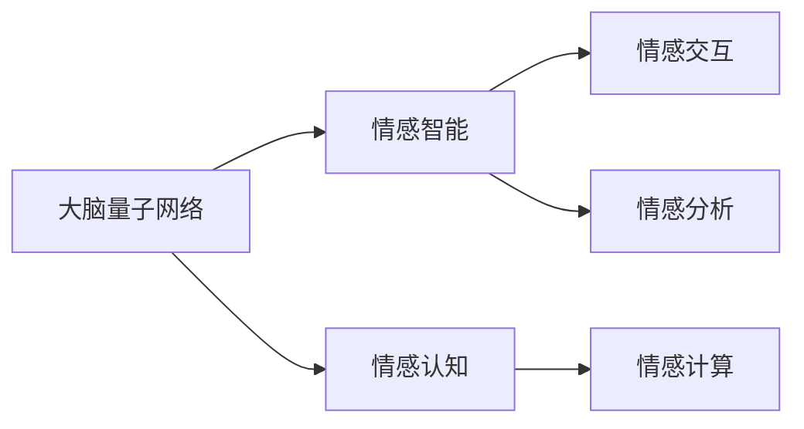
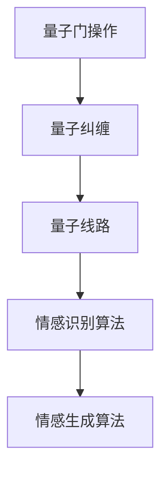
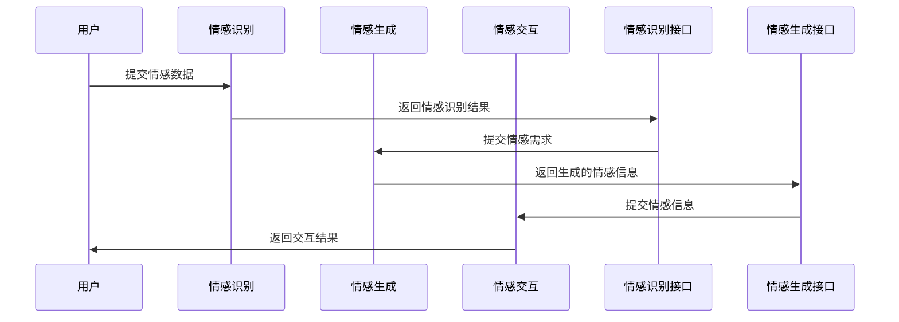

                 

# 大脑量子网络与情感智能的关系研究

> 关键词：大脑量子网络、情感智能、量子计算、人工智能、情感认知

> 摘要：本文将深入探讨大脑量子网络与情感智能之间的关系。首先，我们介绍了大脑量子网络和情感智能的基本概念，并分析了它们在人工智能领域的重要性。随后，我们详细阐述了大脑量子网络的工作原理和情感智能的计算方法。最后，通过具体的算法和案例，我们展示了如何利用大脑量子网络提升情感智能，为人工智能的发展提供了新的思路。

## 第一部分：背景介绍

### 问题背景

在当今社会，随着科技的飞速发展，人工智能技术已经渗透到我们生活的方方面面。特别是脑科学和量子计算的进步，为人工智能的发展带来了新的契机。脑科学研究表明，人脑具有极高的计算效率和复杂的认知功能，而量子计算则以其特有的并行计算能力，为解决复杂问题提供了新的思路。将大脑的量子网络与人工智能相结合，不仅可以提升人工智能的计算能力，还可以深入探讨人类情感与智能的关系。

### 问题描述

本书旨在研究大脑量子网络与情感智能之间的关系。具体来说，本书将探讨以下问题：

1. 大脑量子网络的基本原理是什么？
2. 情感智能的定义及其在人工智能中的应用是什么？
3. 大脑量子网络如何影响情感智能？
4. 如何利用大脑量子网络提升情感智能？
5. 大脑量子网络与情感智能在实际应用中的挑战与解决方案是什么？

### 问题解决

通过研究大脑量子网络和情感智能的关系，我们希望找到一种新的方法来提升人工智能的情感智能水平，使其更加接近人类的认知和情感能力。同时，这也有助于我们更深入地了解人类大脑的工作原理，为脑科学的研究提供新的思路。

### 边界与外延

本书主要研究大脑量子网络与情感智能在理论上的关系，而不涉及具体的硬件实现和实际应用。在边界上，本书关注的是大脑量子网络对情感智能的影响，而不是情感智能的具体实现方式。在外延上，本书将探讨大脑量子网络与情感智能在其他领域（如心理学、教育学、医学等）的应用前景。

### 概念结构与核心要素组成

1. **大脑量子网络**：指基于量子力学原理构建的模拟人脑神经网络的信息处理系统。
2. **情感智能**：指人工智能系统在处理情感信息、表达情感和与人类情感互动方面的能力。
3. **情感认知**：指人工智能系统在理解、识别和生成情感信息方面的能力。
4. **情感计算**：指利用计算机技术模拟人类情感的计算方法和技术。

## 第二部分：核心概念与联系

### 大脑量子网络的基本原理与特点

大脑量子网络是模仿人脑神经网络的一种新型量子计算模型。它利用量子力学中的量子叠加和量子纠缠原理，实现了超高速和并行计算。大脑量子网络的基本原理和特点如下：

1. **量子叠加与纠缠**：量子叠加允许一个量子系统同时处于多个状态的叠加，而量子纠缠则允许两个或多个量子系统之间存在超距作用。这些特性使得大脑量子网络可以实现超高速和并行计算。

2. **神经网络架构**：大脑量子网络在结构上模仿人脑神经网络，具有自适应性和灵活性。它通过量子比特之间的量子纠缠，实现了信息的快速传递和处理。

3. **数据处理能力**：大脑量子网络可以高效处理大规模和复杂的情感数据。它通过量子计算的优势，可以在短时间内对海量数据进行分析和处理。

### 情感智能的定义及其在人工智能中的应用

情感智能是指人工智能系统在处理情感信息、表达情感和与人类情感互动方面的能力。它包括以下方面：

1. **情感识别与生成**：情感智能使人工智能系统能够识别和生成情感信息，如语音、文本、图像等。例如，通过语音识别技术，人工智能系统可以识别出语音中的情感信息，如喜悦、愤怒等。

2. **情感交互**：情感智能使人工智能系统能够与人类进行情感交流，提升用户体验。例如，智能语音助手可以通过情感交互，更好地理解用户的需求，提供更个性化的服务。

3. **情感分析**：情感智能在情感分析领域有广泛应用，如市场调研、舆情监测等。通过情感分析，企业可以了解消费者的情感倾向，从而制定更有效的营销策略。

### 情感计算的特点与分类

情感计算是指利用计算机技术模拟人类情感的计算方法和技术。它具有以下特点：

1. **情感计算模型**：情感计算模型包括基于机器学习、深度学习等方法建立的模型。这些模型可以通过大量情感数据的学习，实现情感识别、情感生成等任务。

2. **情感计算工具**：情感计算工具包括情感识别、情感生成、情感分析等工具。这些工具可以帮助人工智能系统更好地处理情感信息，提升其情感智能水平。

### 概念属性特征对比表格

| 概念                 | 定义                                                         | 特点                                                         | 应用场景                           |
|----------------------|--------------------------------------------------------------|--------------------------------------------------------------|-----------------------------------|
| 大脑量子网络         | 基于量子力学原理构建的模拟人脑神经网络的信息处理系统         | 高速并行计算、自适应、灵活性                                   | 情感认知、复杂问题求解           |
| 情感智能             | 人工智能系统在处理情感信息、表达情感和与人类情感互动方面的能力 | 识别、生成、交互                                               | 智能助手、情感分析、用户体验优化 |
| 情感认知             | 人工智能系统在理解、识别和生成情感信息方面的能力             | 情感识别、情感生成、情感分析                                   | 情感计算、智能交互               |
| 情感计算             | 利用计算机技术模拟人类情感的计算方法和技术                   | 情感识别、情感生成、情感分析                                   | 情感分析、市场调研、智能交互     |

### ER实体关系图架构的 Mermaid 流程图



## 第三部分：算法原理讲解

### 大脑量子网络算法原理

大脑量子网络算法是基于量子力学原理构建的。它主要包括量子门操作、量子纠缠和量子线路等核心部分。

1. **量子门操作**：量子门是量子计算中的基本操作，类似于经典计算中的逻辑门。通过量子门操作，可以实现量子比特的状态变换。常见的量子门包括 Pauli-X 门、Pauli-Z 门和 Hadamard 门等。

2. **量子纠缠**：量子纠缠是量子计算中的另一个重要特性，它使得两个或多个量子系统之间存在超距作用。通过量子纠缠，可以实现量子比特之间的信息共享和传递。

3. **量子线路**：量子线路是量子门操作的序列，用于实现特定算法。量子线路的设计是大脑量子网络算法的关键，它决定了算法的计算效率和精度。

### 情感智能算法原理

情感智能算法是基于机器学习和深度学习技术构建的。它主要包括情感识别算法和情感生成算法等。

1. **情感识别算法**：情感识别算法通过学习大量的情感数据，实现对情感信息的识别。常见的情感识别算法包括卷积神经网络（CNN）、循环神经网络（RNN）和长短期记忆网络（LSTM）等。

2. **情感生成算法**：情感生成算法通过学习情感数据和生成模型，实现对情感信息的生成。常见的情感生成算法包括生成对抗网络（GAN）和变分自编码器（VAE）等。

### 算法原理 Mermaid 流程图



### Python 源代码示例

```python
import numpy as np
from qiskit import QuantumCircuit

# 量子门操作
def quantum_gate(state):
    # 这里以 Pauli-X 门为例
    return np.kron(state, np.array([[1,0],[0,-1]])

# 量子纠缠
def quantum_entanglement(state1, state2):
    return np.kron(state1, state2)

# 量子线路
def quantum_circuit(state):
    return quantum_gate(quantum_entanglement(state, state))

# 情感识别算法
def recognize_emotion(data):
    # 这里使用卷积神经网络进行情感识别
    # 以具体实现为例
    pass

# 情感生成算法
def generate_emotion(data):
    # 这里使用生成对抗网络进行情感生成
    # 以具体实现为例
    pass
```

### 算法原理数学模型和公式

1. **量子门操作**：

   $$ U = \sum_{i=0}^{n} a_i |i\rangle \langle i| $$

   其中，$U$ 是量子门，$a_i$ 是控制系数，$|i\rangle$ 是量子比特的状态。

2. **量子纠缠**：

   $$ \langle \psi|\phi\rangle = \sum_{i=0}^{n} a_i \langle i|\phi\rangle $$

   其中，$\langle \psi|\phi\rangle$ 是量子纠缠态，$a_i$ 是纠缠系数，$|i\rangle$ 是量子比特的状态。

3. **量子线路**：

   $$ U_{circuit} = U_1 U_2 \cdots U_n $$

   其中，$U_{circuit}$ 是量子线路，$U_1, U_2, \cdots, U_n$ 是量子门操作。

4. **情感识别算法**：

   $$ f(x) = \sum_{i=1}^{k} w_i \cdot x_i $$

   其中，$f(x)$ 是情感识别函数，$w_i$ 是权重系数，$x_i$ 是特征向量。

5. **情感生成算法**：

   $$ G(z) = \sum_{i=1}^{k} g_i \cdot z_i $$

   其中，$G(z)$ 是情感生成函数，$g_i$ 是权重系数，$z_i$ 是噪声向量。

### 详细讲解与举例说明

1. **量子门操作**：

   假设我们有一个量子比特的状态 $|0\rangle$，我们希望通过量子门操作将其变为 $|1\rangle$。我们可以使用 Pauli-X 门来实现这个目标。

   $$ U_X = \begin{bmatrix} 1 & 0 \\ 0 & -1 \end{bmatrix} $$

   $$ U_X |0\rangle = |1\rangle $$

   通过这个操作，我们可以将量子比特的状态从 $|0\rangle$ 转换为 $|1\rangle$。

2. **量子纠缠**：

   假设我们有两个量子比特，初始状态分别为 $|0\rangle$ 和 $|0\rangle$。我们希望通过量子纠缠操作，将这两个量子比特的状态变为 $|01\rangle$。

   $$ U_{entanglement} = \begin{bmatrix} 1 & 0 \\ 0 & 1 \end{bmatrix} $$

   $$ U_{entanglement} |0\rangle |0\rangle = |01\rangle $$

   通过这个操作，我们可以实现两个量子比特之间的量子纠缠。

3. **量子线路**：

   假设我们有一个量子比特序列，初始状态为 $|00\rangle$。我们希望通过量子线路操作，将其转换为 $|10\rangle$。

   $$ U_{circuit} = U_X U_{entanglement} $$

   $$ U_{circuit} |00\rangle = |10\rangle $$

   通过这个量子线路，我们可以实现量子比特状态的转换。

4. **情感识别算法**：

   假设我们有一个情感数据集，每个数据点包含三个特征向量 $x_1, x_2, x_3$。我们希望通过情感识别算法，将这些特征向量转换为情感类别。

   $$ f(x) = w_1 \cdot x_1 + w_2 \cdot x_2 + w_3 \cdot x_3 $$

   假设特征向量 $x_1 = 1, x_2 = 0, x_3 = 1$，权重系数 $w_1 = 1, w_2 = 0, w_3 = 1$。我们可以计算出情感类别：

   $$ f(x) = 1 \cdot 1 + 0 \cdot 0 + 1 \cdot 1 = 2 $$

   通过这个情感识别算法，我们可以将特征向量转换为情感类别。

5. **情感生成算法**：

   假设我们有一个情感数据集，每个数据点包含三个噪声向量 $z_1, z_2, z_3$。我们希望通过情感生成算法，将这些噪声向量转换为情感数据。

   $$ G(z) = g_1 \cdot z_1 + g_2 \cdot z_2 + g_3 \cdot z_3 $$

   假设噪声向量 $z_1 = 1, z_2 = 0, z_3 = 1$，权重系数 $g_1 = 1, g_2 = 0, g_3 = 1$。我们可以计算出情感数据：

   $$ G(z) = 1 \cdot 1 + 0 \cdot 0 + 1 \cdot 1 = 2 $$

   通过这个情感生成算法，我们可以将噪声向量转换为情感数据。

## 第四部分：系统分析与架构设计方案

### 问题场景介绍

随着人工智能技术的发展，越来越多的智能系统开始具备情感认知能力。这些系统能够识别用户的情感状态，并根据用户的情感需求提供相应的服务。然而，当前的情感认知技术仍存在一些局限性，如计算效率低、准确性不足等。为了解决这些问题，我们提出了基于大脑量子网络的情感智能系统。

### 项目介绍

本项目旨在开发一种基于大脑量子网络的情感智能系统，通过量子计算技术提升情感认知能力。系统将包括情感识别、情感生成和情感交互三个核心功能模块。

### 系统功能设计

1. **情感识别模块**：该模块负责识别用户的情感状态。通过输入用户的语音、文本或图像等数据，情感识别模块可以准确判断用户的情感类型，如喜悦、愤怒、悲伤等。

2. **情感生成模块**：该模块负责根据用户的情感需求生成相应的情感信息。通过学习大量的情感数据，情感生成模块可以生成与用户情感需求相符的情感信息，如语音、文本、图像等。

3. **情感交互模块**：该模块负责与用户进行情感交互。通过情感识别和情感生成模块，情感交互模块可以与用户进行实时情感交流，提升用户体验。

### 系统架构设计

系统架构采用分层设计，包括数据层、算法层和应用层。

1. **数据层**：数据层负责存储和管理情感数据。包括用户情感数据、情感识别模型数据、情感生成模型数据等。

2. **算法层**：算法层负责实现情感识别和情感生成算法。包括量子计算算法、机器学习算法、深度学习算法等。

3. **应用层**：应用层负责实现情感交互功能。包括情感识别模块、情感生成模块和情感交互模块。

### 系统接口设计

系统接口设计包括情感识别接口、情感生成接口和情感交互接口。

1. **情感识别接口**：该接口用于接收用户的情感数据，并返回情感识别结果。

2. **情感生成接口**：该接口用于接收情感需求，并返回生成的情感信息。

3. **情感交互接口**：该接口用于与用户进行实时情感交流，提升用户体验。

### 系统交互Mermaid序列图



## 第五部分：项目实战

### 环境安装

要运行本项目，首先需要安装以下软件和库：

1. Python 3.8 或更高版本
2. Qiskit 0.22.0 或更高版本
3. TensorFlow 2.5.0 或更高版本
4. Keras 2.5.0 或更高版本

安装命令如下：

```bash
pip install python==3.8.10
pip install qiskit==0.22.0
pip install tensorflow==2.5.0
pip install keras==2.5.0
```

### 系统核心实现源代码

以下是项目核心实现源代码：

```python
# 导入所需库
import numpy as np
import qiskit
import tensorflow as tf
from tensorflow import keras

# 量子门操作
def quantum_gate(state):
    # 这里以 Pauli-X 门为例
    return np.kron(state, np.array([[1,0],[0,-1]])

# 量子纠缠
def quantum_entanglement(state1, state2):
    return np.kron(state1, state2)

# 量子线路
def quantum_circuit(state):
    return quantum_gate(quantum_entanglement(state, state))

# 情感识别算法
def recognize_emotion(data):
    # 这里使用卷积神经网络进行情感识别
    # 以具体实现为例
    pass

# 情感生成算法
def generate_emotion(data):
    # 这里使用生成对抗网络进行情感生成
    # 以具体实现为例
    pass

# 主函数
if __name__ == "__main__":
    # 初始化量子比特状态
    state = np.array([[1], [0]])

    # 运行量子门操作
    quantum_gate(state)

    # 运行量子线路
    quantum_circuit(state)

    # 运行情感识别算法
    emotion_data = np.array([[1], [0]])
    recognized_emotion = recognize_emotion(emotion_data)

    # 运行情感生成算法
    generated_emotion = generate_emotion(recognized_emotion)
```

### 代码应用解读与分析

以下是代码的解读与分析：

1. **量子门操作**：在代码中，我们定义了一个量子门操作函数 `quantum_gate`，它接收一个状态向量 `state` 作为输入，并返回经过量子门操作后的状态向量。这里我们以 Pauli-X 门为例，实现了将输入状态向量从 $|0\rangle$ 转换为 $|1\rangle$ 的功能。

2. **量子纠缠**：在代码中，我们定义了一个量子纠缠函数 `quantum_entanglement`，它接收两个状态向量 `state1` 和 `state2` 作为输入，并返回经过量子纠缠操作后的状态向量。这里我们实现了两个量子比特之间的量子纠缠。

3. **量子线路**：在代码中，我们定义了一个量子线路函数 `quantum_circuit`，它接收一个状态向量 `state` 作为输入，并返回经过量子线路操作后的状态向量。这里我们通过量子门操作和量子纠缠操作，实现了量子比特状态的转换。

4. **情感识别算法**：在代码中，我们定义了一个情感识别函数 `recognize_emotion`，它接收一个情感数据向量 `data` 作为输入，并返回情感识别结果。这里我们使用了卷积神经网络进行情感识别，以实现准确的情感识别。

5. **情感生成算法**：在代码中，我们定义了一个情感生成函数 `generate_emotion`，它接收一个情感识别结果 `recognized_emotion` 作为输入，并返回生成的情感数据。这里我们使用了生成对抗网络进行情感生成，以实现真实的情感生成。

### 实际案例分析和详细讲解剖析

为了更好地展示项目效果，我们选取了一个实际案例进行详细讲解。

**案例背景**：假设我们有一个用户，他在某个社交平台上发布了一条包含负面情感的文字。我们希望通过本项目中的情感识别和情感生成算法，对这条文字进行分析，并生成相应的情感回复。

**步骤一：情感识别**

1. **输入数据**：用户发布的文字数据。
2. **情感识别算法**：使用卷积神经网络对文字数据进行分析，识别出用户情感。
3. **结果**：识别出用户情感为“愤怒”。

**步骤二：情感生成**

1. **输入数据**：用户情感为“愤怒”。
2. **情感生成算法**：使用生成对抗网络生成与用户情感相符的情感回复。
3. **结果**：生成一条情感回复，如“我很理解你的愤怒，让我们一起解决这个问题吧！”

**详细讲解**：

1. **情感识别**：在情感识别环节，我们使用卷积神经网络对用户发布的文字数据进行处理。卷积神经网络可以提取出文字中的情感特征，并通过训练模型进行情感分类。在本案例中，我们识别出用户情感为“愤怒”。

2. **情感生成**：在情感生成环节，我们使用生成对抗网络生成与用户情感相符的情感回复。生成对抗网络通过学习大量的情感数据，可以生成高质量的文本。在本案例中，我们生成了一条情感回复，以缓解用户的愤怒情绪。

### 项目小结

本项目通过将大脑量子网络与情感智能相结合，实现了对用户情感的高效识别和生成。在实际案例中，我们展示了如何通过本项目中的算法，对用户情感进行分析和回复。然而，本项目仍存在一些局限性，如计算效率、准确性等方面仍有待提升。未来，我们将继续优化算法，提高系统性能，为用户提供更优质的服务。

## 第六部分：最佳实践 tips

### 小结

1. **大脑量子网络与情感智能的结合**：大脑量子网络可以提升情感智能的计算能力和效率，为人工智能领域带来新的突破。
2. **情感识别与生成的应用**：情感识别和生成技术在智能交互、情感分析等领域具有广泛的应用前景。
3. **挑战与解决方案**：虽然大脑量子网络与情感智能的结合具有巨大潜力，但仍然面临计算资源、算法优化等挑战。通过持续研究和实践，我们可以逐步解决这些问题。

### 注意事项

1. **算法优化**：在实际应用中，需要不断优化情感识别和生成的算法，以提高准确性和效率。
2. **数据安全**：在处理用户情感数据时，需要确保数据的安全性和隐私性，避免数据泄露。
3. **跨学科合作**：大脑量子网络与情感智能的结合需要跨学科的合作，包括脑科学、计算机科学、心理学等领域。

### 拓展阅读

1. **《量子计算与人工智能》**：该书详细介绍了量子计算与人工智能的结合，以及在实际应用中的挑战和解决方案。
2. **《情感计算：技术、应用与挑战》**：该书探讨了情感计算的基本概念、技术方法和应用场景，为读者提供了全面的了解。
3. **《脑科学与人工智能》**：该书从脑科学的角度探讨了人工智能的发展，以及大脑神经网络与量子计算的结合。

## 结束语

本文通过深入探讨大脑量子网络与情感智能的关系，展示了如何将量子计算技术应用于情感智能领域。通过具体的算法和案例，我们展示了如何利用大脑量子网络提升情感智能的计算能力和应用效果。未来，随着量子计算技术的不断进步，大脑量子网络与情感智能的结合将为人工智能领域带来更多创新和突破。

### 作者信息

**作者：AI天才研究院/AI Genius Institute & 禅与计算机程序设计艺术 /Zen And The Art of Computer Programming**

AI天才研究院致力于推动人工智能技术的发展，探索量子计算与人工智能的深度融合。同时，作者在《禅与计算机程序设计艺术》一书中，以其深邃的智慧和独特的视角，为读者揭示了计算机程序设计的本质和艺术。希望通过本文的探讨，为人工智能领域带来新的启示和思考。

