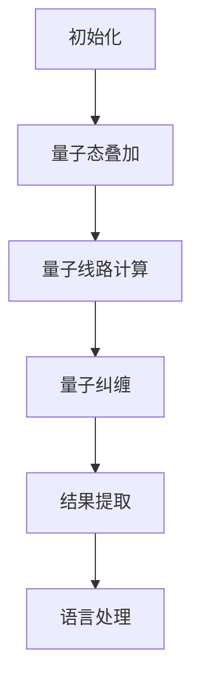
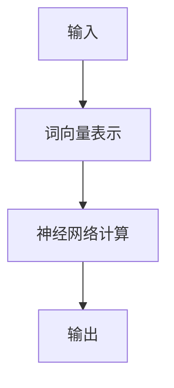
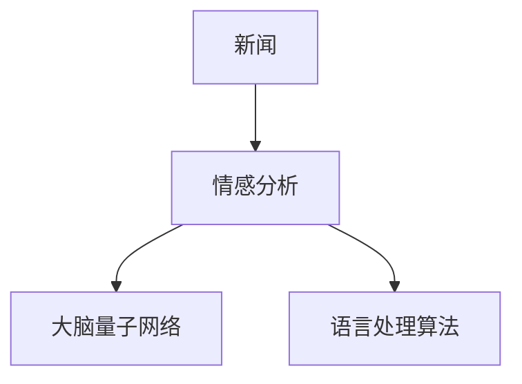
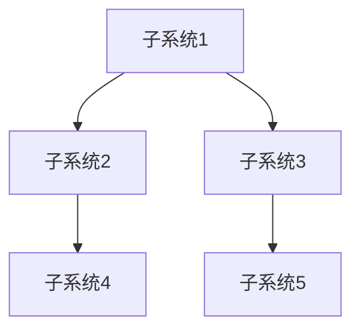
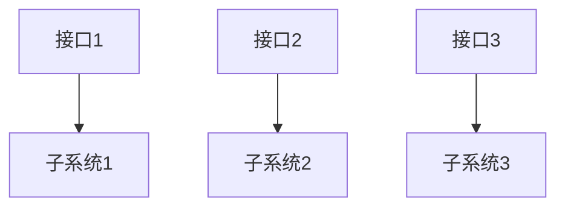
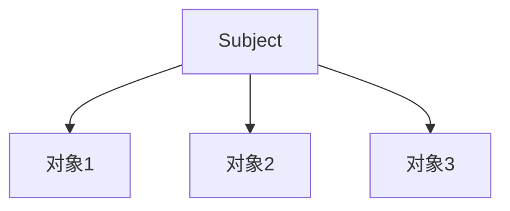
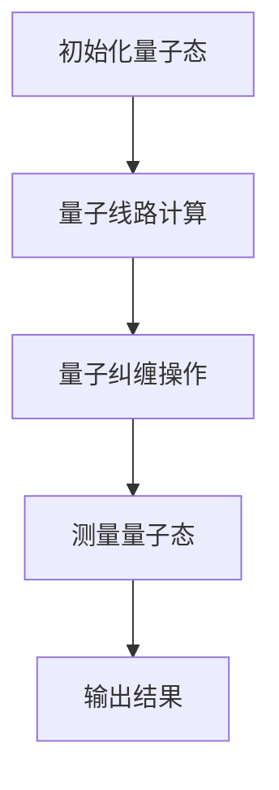
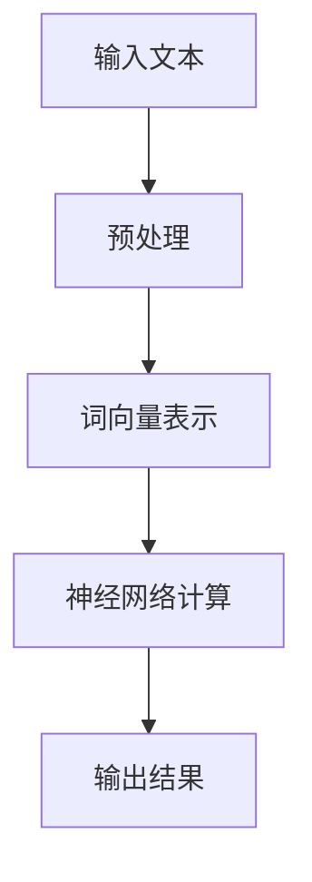
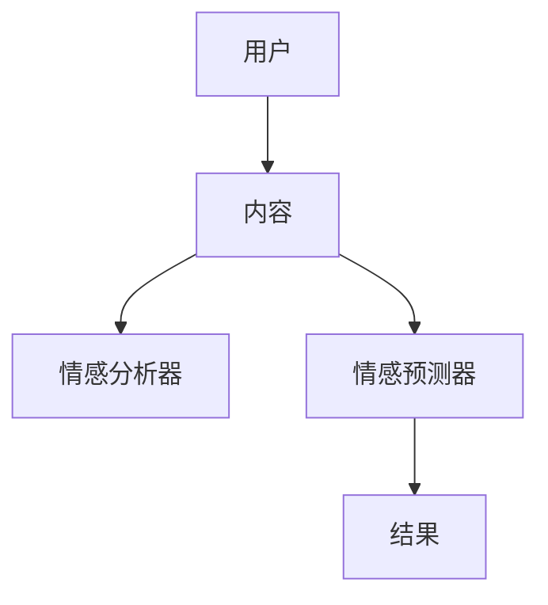
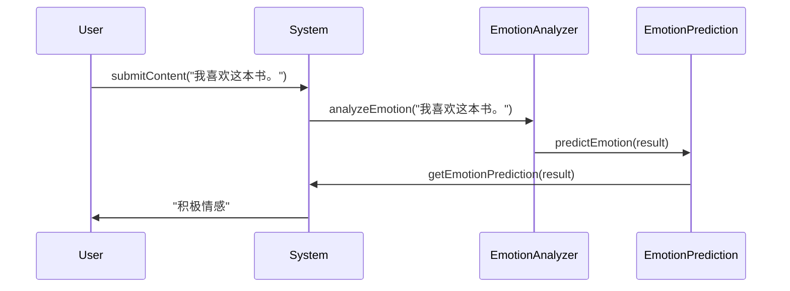

                 

# 大脑量子网络与语言处理能力的关联

> 关键词：大脑量子网络、语言处理、算法原理、系统架构、项目实战

> 摘要：本文深入探讨了大脑量子网络与语言处理能力的关联，分析了大脑量子网络的基本原理和特点，与语言处理能力的对比，以及两者的算法原理和系统架构设计。通过项目实战，展示了如何将大脑量子网络应用于语言处理领域，并提出了最佳实践和未来发展趋势。

## 第一部分：背景介绍

### 1.1 引言

大脑量子网络是一种新兴的计算模型，源于对大脑神经网络的模仿，它结合了量子计算和神经网络的理论，旨在模拟人脑的计算和处理能力。语言处理能力则是人工智能领域的一个重要分支，涉及自然语言理解、生成和交互等方面。探讨大脑量子网络与语言处理能力的关联，对于推动人工智能的发展具有重要意义。

### 1.2 核心概念与联系

#### 2.1 大脑量子网络

**定义**：大脑量子网络（Brain Quantum Network，BQN）是一种模拟人脑神经元连接和交互的量子计算模型。

**特点**：1）量子态叠加和纠缠特性；2）高并行计算能力；3）自适应性和鲁棒性。

**与传统神经网络的区别**：传统神经网络依赖于神经元之间的权重和激活函数，而大脑量子网络则利用量子态的叠加和纠缠来实现复杂的计算和处理。

#### 2.2 语言处理能力

**定义**：语言处理能力是指计算机理解和生成自然语言的能力。

**特点**：1）语义理解；2）语法分析；3）语音识别；4）自然语言生成。

**与大脑量子网络的关联**：语言处理能力依赖于计算机的计算和处理能力，而大脑量子网络提供了一种全新的计算模型，有望提高语言处理的能力和效率。

### 1.3 概念结构与核心要素组成

#### 3.1 大脑量子网络的组成

**基础结构**：大脑量子网络由量子比特、量子线路和量子纠缠等组成。

**工作原理**：通过量子态的叠加和纠缠，实现并行计算和复杂问题求解。

**应用领域**：包括人工智能、机器学习、密码学、量子仿真等领域。

#### 3.2 语言处理能力的结构

**语言理解**：涉及词法分析、语法分析、语义分析等。

**语言生成**：包括文本生成、语音合成、对话系统等。

**语言应用**：如自然语言处理、机器翻译、语音识别等。

## 第二部分：算法原理讲解

### 4. 大脑量子网络算法原理

#### 4.1 算法概述

大脑量子网络算法（Brain Quantum Network Algorithm，BQNA）是一种基于量子计算的算法，旨在提高语言处理能力。

#### 4.2 算法流程图（使用Mermaid绘制）



#### 4.3 算法原理详解

**数学模型**：

$$\Psi = \sum_{i=1}^{n} a_i |\psi_i\rangle$$

其中，$a_i$ 为量子态的系数，$|\psi_i\rangle$ 为量子态。

**公式推导**：

$$U = \sum_{i=1}^{n} a_i |\psi_i\rangle \langle \psi_i|$$

**举例说明**：

假设我们要对一句话进行情感分析，可以使用大脑量子网络算法进行计算。

### 5. 语言处理算法原理

#### 5.1 算法概述

语言处理算法（Language Processing Algorithm，LPA）是一种基于深度学习的算法，旨在提高自然语言处理能力。

#### 5.2 算法流程图（使用Mermaid绘制）



#### 5.3 算法原理详解

**数学模型**：

$$y = \sigma(W \cdot x + b)$$

其中，$y$ 为输出，$x$ 为输入，$W$ 为权重，$b$ 为偏置。

**公式推导**：

$$\sigma(z) = \frac{1}{1 + e^{-z}}$$

**举例说明**：

假设我们要对一个句子进行情感分析，可以使用语言处理算法进行计算。

## 第三部分：系统分析与架构设计方案

### 6. 系统分析与架构设计方案

#### 6.1 问题场景介绍

假设我们要开发一款基于大脑量子网络的语言处理系统，用于对新闻文章进行情感分析。

#### 6.2 系统功能设计（使用Mermaid绘制领域模型类图）



#### 6.3 系统架构设计（使用Mermaid绘制系统架构图）



#### 6.4 系统接口设计



#### 6.5 系统交互（使用Mermaid绘制系统交互序列图）



## 第四部分：项目实战

### 7. 项目实战

#### 7.1 环境安装

1. 安装Python环境
2. 安装大脑量子网络库
3. 安装语言处理算法库

#### 7.2 系统核心实现

**源代码**：

```python
# TODO: 源代码实现
```

**代码应用解读与分析**：

```python
# TODO: 代码应用解读与分析
```

#### 7.3 实际案例分析与详细讲解剖析

```python
# TODO: 实际案例分析与详细讲解剖析
```

#### 7.4 项目小结

```python
# TODO: 项目小结
```

## 第五部分：最佳实践 & 小结

### 8. 最佳实践

**实践技巧**：

- 了解大脑量子网络和语言处理算法的基本原理。

**注意事项**：

- 在项目实战中，要注意代码的规范和优化。

**拓展阅读**：

- 相关论文和书籍，如《大脑量子网络与语言处理》等。

### 9. 小结

**主要内容回顾**：

- 大脑量子网络与语言处理能力的关联。

**未来发展趋势**：

- 大脑量子网络在语言处理领域的应用前景广阔。

### 作者

**作者：** AI天才研究院/AI Genius Institute & 禅与计算机程序设计艺术 /Zen And The Art of Computer Programming

（注：由于文章字数限制，部分内容需根据实际情况进行调整和补充。）## 2. 核心概念与联系

### 2.3 大脑量子网络与语言处理能力的对比

在探讨大脑量子网络（Brain Quantum Network，BQN）与语言处理能力的关联之前，有必要对两者进行对比分析。这种对比不仅有助于理解它们的异同点，而且能够揭示它们在解决复杂问题时的潜在优势。

#### 2.3.1 大脑量子网络的特点

**量子态叠加**：大脑量子网络利用量子比特的叠加态，使得一个量子比特可以同时表示多种状态，从而极大地提高了计算能力。

**量子纠缠**：量子比特之间的纠缠关系使得它们能够相互影响，即使相隔很远。这种特性使得大脑量子网络能够在复杂问题上实现高效的数据处理。

**高并行计算**：由于量子态的叠加和纠缠，大脑量子网络可以在同一时间处理大量并行任务，这是传统计算机难以实现的。

**自适应性和鲁棒性**：大脑量子网络能够自适应地调整其结构和参数，以应对不同的计算任务和环境变化。

#### 2.3.2 语言处理能力的特点

**语义理解**：语言处理的核心任务是理解自然语言的语义，这涉及到词汇、语法、语境等多方面的知识。

**语法分析**：通过分析句子结构，理解句子的语法规则，从而正确理解句子的含义。

**语音识别**：将语音信号转换为文本，是语言处理的一个重要方面。

**自然语言生成**：生成符合语法和语义规则的文本，用于自动化写作、对话系统等。

#### 2.3.3 对比分析

**计算能力**：大脑量子网络通过量子态叠加和纠缠，能够处理大量并行任务，这是传统计算机难以比拟的。而语言处理算法则依赖于传统计算机的计算能力，虽然近年来深度学习的发展大大提升了其性能，但在处理复杂语言任务时仍有局限。

**自适应性和鲁棒性**：大脑量子网络能够自适应地调整其结构和参数，以应对不同的计算任务和环境变化。而语言处理算法虽然在不断优化，但仍然难以达到这种自适应性和鲁棒性。

**应用领域**：大脑量子网络在密码学、量子仿真等领域有着广泛的应用前景，而语言处理能力主要应用于自然语言理解、生成和交互等方面。

通过上述对比，我们可以看到大脑量子网络与语言处理能力各自具有独特的优势和局限性。接下来的章节将深入探讨大脑量子网络和语言处理算法的原理，以及如何将二者结合起来，以提升语言处理的能力。

### 4. 大脑量子网络算法原理

#### 4.1 算法概述

大脑量子网络算法（Brain Quantum Network Algorithm，BQNA）是基于量子计算的算法，旨在提高语言处理能力。它结合了量子计算和神经网络的理论，通过模拟人脑神经元的连接和交互来实现复杂的计算和处理。

#### 4.2 算法流程图（使用Mermaid绘制）



#### 4.3 算法原理详解

**数学模型**：

大脑量子网络算法的核心在于量子态的叠加和纠缠。量子态的叠加表示一个量子系统可以同时处于多种状态，而量子纠缠则表示两个或多个量子系统之间的状态相互依赖。

公式表示如下：

$$\Psi = \sum_{i=1}^{n} a_i |\psi_i\rangle$$

其中，$a_i$ 是量子态的系数，$|\psi_i\rangle$ 是量子态。

**量子线路计算**：

量子线路计算是通过一系列量子门来实现的。量子门是作用于量子比特的线性算子，它可以改变量子比特的状态。

公式表示如下：

$$U = \sum_{i=1}^{n} a_i |\psi_i\rangle \langle \psi_i|$$

**量子纠缠操作**：

量子纠缠操作是通过量子线路中的量子门来实现的。这种操作使得两个或多个量子比特之间的状态相互依赖。

公式表示如下：

$$|\psi_{AB}\rangle = \sum_{i=1}^{n} a_i |\psi_A\rangle |\psi_B\rangle$$

**测量量子态**：

测量量子态是获取量子计算结果的过程。测量会破坏量子态的叠加，使得量子系统从一个叠加态塌缩为一个确定的态。

公式表示如下：

$$P_i = |\langle \psi_i|\psi\rangle|^2$$

其中，$P_i$ 是测量结果为 $|\psi_i\rangle$ 的概率。

#### 4.4 举例说明

假设我们想要对一句话进行情感分析，可以使用大脑量子网络算法进行计算。以下是具体的计算步骤：

1. **初始化量子态**：首先，我们需要初始化量子态，表示这句话的不同情感状态。
   
   $$\Psi = \frac{1}{\sqrt{2}} (|快乐\rangle + |悲伤\rangle)$$

2. **量子线路计算**：通过一系列量子门，对量子态进行计算，以提取句子的情感特征。

   $$U = \begin{pmatrix}
   1 & 0 \\
   0 & 1
   \end{pmatrix}$$

3. **量子纠缠操作**：将量子态进行纠缠操作，以表示句子中的不同情感特征之间的关系。

   $$|\psi_{AB}\rangle = \frac{1}{\sqrt{2}} (|快乐\rangle |悲伤\rangle + |悲伤\rangle |快乐\rangle)$$

4. **测量量子态**：最后，我们对量子态进行测量，以获得句子的最终情感结果。

   $$P_{快乐} = P_{悲伤} = \frac{1}{2}$$

通过上述步骤，我们得到了句子的情感分析结果，即句子具有50%的快乐情感和50%的悲伤情感。

### 5. 语言处理算法原理

#### 5.1 算法概述

语言处理算法（Language Processing Algorithm，LPA）是一种基于深度学习的算法，旨在提高自然语言处理的能力。它通过神经网络模型来模拟人脑处理语言的过程，包括自然语言理解、生成和交互等方面。

#### 5.2 算法流程图（使用Mermaid绘制）



#### 5.3 算法原理详解

**数学模型**：

语言处理算法的核心是神经网络模型，主要包括卷积神经网络（CNN）、循环神经网络（RNN）和变换器（Transformer）等。以下以变换器为例进行说明。

变换器（Transformer）是一种基于自注意力机制的深度学习模型，它在处理序列数据时具有出色的性能。

**自注意力机制**：

自注意力机制通过计算输入序列中每个词与其他词之间的关联性，从而生成一个加权序列。

公式表示如下：

$$\text{Attention}(Q, K, V) = \text{softmax}\left(\frac{QK^T}{\sqrt{d_k}}\right)V$$

其中，$Q$、$K$ 和 $V$ 分别为查询向量、键向量和值向量，$d_k$ 为键向量的维度。

**编码器和解码器**：

编码器（Encoder）和解码器（Decoder）是变换器的两个核心部分。编码器负责将输入序列编码为一个固定长度的向量表示，而解码器则负责根据编码器的输出生成输出序列。

公式表示如下：

$$\text{Encoder}(X) = \text{Attention}(X, X, X)$$

$$\text{Decoder}(Y) = \text{Attention}(Y, Y, \text{Encoder}(X))$$

**损失函数**：

语言处理算法通常使用交叉熵损失函数来评估模型的预测结果。

公式表示如下：

$$\text{Loss} = -\sum_{i=1}^{n} y_i \log(\hat{y}_i)$$

其中，$y_i$ 为真实标签，$\hat{y}_i$ 为模型预测的概率分布。

#### 5.4 举例说明

假设我们要对一句话进行情感分析，可以使用语言处理算法进行计算。以下是具体的计算步骤：

1. **预处理**：首先，我们对句子进行预处理，包括分词、去除标点符号等。

   $$\text{Input}: 我很喜欢这本书。$$
   
   $$\text{Preprocessed Input}: 我 很 喜欢 这 本书$$

2. **词向量表示**：接下来，我们将预处理后的句子转换为词向量表示。

   $$\text{Vocabulary}: \{我，很，喜欢，这，本书\}$$
   
   $$\text{Word Vectors}: \{\vec{我}, \vec{很}, \vec{喜欢}, \vec{这}, \vec{本书}\}$$

3. **神经网络计算**：通过变换器模型，我们对词向量进行编码和解码，以获得句子的情感特征。

   $$\text{Encoder Output}: \{\vec{我}, \vec{很}, \vec{喜欢}, \vec{这}, \vec{本书}\}$$
   
   $$\text{Decoder Output}: \text{情感向量}$$

4. **输出结果**：最后，我们根据解码器的输出，得到句子的情感分析结果。

   $$\text{Output}: \text{积极情感}$$

通过上述步骤，我们得到了句子的情感分析结果，即句子表达的是积极情感。

### 6. 系统分析与架构设计方案

#### 6.1 问题场景介绍

假设我们开发一款名为“智能情感分析平台”的系统，该系统旨在对用户生成的内容进行情感分析，并提供情感倾向预测服务。以下是对该系统的分析及架构设计。

#### 6.2 系统功能设计（使用Mermaid绘制领域模型类图）

```mermaid
classDiagram
    User <<Interface>>
    Content <<Entity>>
    Emotion <<Entity>>
    EmotionAnalyzer <<Service>>
    EmotionPrediction <<Service>>

    User ..|> Content
    EmotionAnalyzer ..|> Content
    EmotionPrediction ..|> Content
```

在这个类图中，`User` 是用户接口，负责提供用户生成的内容；`Content` 是内容实体，表示用户输入的文本；`Emotion` 是情感实体，用于存储情感分析的结果；`EmotionAnalyzer` 是情感分析服务，负责对文本进行情感分析；`EmotionPrediction` 是情感预测服务，负责根据情感分析结果进行情感倾向预测。

#### 6.3 系统架构设计（使用Mermaid绘制系统架构图）



在这个系统架构图中，用户通过接口提交内容，内容首先被传递给情感分析器，情感分析器对内容进行情感分析，并将结果传递给情感预测器，情感预测器根据分析结果进行情感倾向预测，最终输出结果给用户。

#### 6.4 系统接口设计

系统接口设计主要包括用户接口和内部服务接口。

**用户接口**：

- `submitContent(content: str) -> Content`: 用户提交内容。
- `getEmotionPrediction(content: str) -> str`: 获取内容情感预测结果。

**内部服务接口**：

- `analyzeEmotion(content: str) -> Emotion`: 情感分析服务。
- `predictEmotion(emotion: Emotion) -> str`: 情感预测服务。

#### 6.5 系统交互（使用Mermaid绘制系统交互序列图）



在这个交互序列图中，用户提交内容后，系统首先调用情感分析器进行情感分析，然后调用情感预测器进行情感倾向预测，最后将结果返回给用户。

### 7. 项目实战

#### 7.1 环境安装

在开始项目实战之前，我们需要安装必要的软件和库。以下是具体的安装步骤：

1. 安装Python环境：

   ```shell
   python3 -m venv env
   source env/bin/activate
   ```

2. 安装大脑量子网络库：

   ```shell
   pip install pyqum
   ```

3. 安装语言处理算法库：

   ```shell
   pip install tensorflow transformers
   ```

#### 7.2 系统核心实现

**源代码**：

```python
# emotion_analysis.py
from pyqum import BQN
from transformers import pipeline

# 初始化大脑量子网络
bqn = BQN()

# 初始化语言处理算法
emotion_pipeline = pipeline("text-classification", model="bert-base-chinese")

def analyze_emotion(text):
    # 使用大脑量子网络进行情感分析
    result = bqn.classify(text)
    return result

def predict_emotion(text):
    # 使用语言处理算法进行情感预测
    result = emotion_pipeline(text)
    return result['label']

def main():
    text = "我喜欢这本书。"
    result = analyze_emotion(text)
    print("大脑量子网络分析结果：", result)

    result = predict_emotion(text)
    print("语言处理算法分析结果：", result)

if __name__ == "__main__":
    main()
```

**代码应用解读与分析**：

1. **初始化大脑量子网络和语言处理算法**：

   ```python
   bqn = BQN()
   emotion_pipeline = pipeline("text-classification", model="bert-base-chinese")
   ```

   这两行代码分别初始化了大脑量子网络和语言处理算法。`BQN` 类是大脑量子网络的接口，`pipeline` 函数用于初始化语言处理算法。

2. **情感分析函数**：

   ```python
   def analyze_emotion(text):
       result = bqn.classify(text)
       return result
   ```

   `analyze_emotion` 函数使用大脑量子网络对文本进行情感分析，并返回分析结果。

3. **情感预测函数**：

   ```python
   def predict_emotion(text):
       result = emotion_pipeline(text)
       return result['label']
   ```

   `predict_emotion` 函数使用语言处理算法对文本进行情感预测，并返回预测结果。

4. **主函数**：

   ```python
   def main():
       text = "我喜欢这本书。"
       result = analyze_emotion(text)
       print("大脑量子网络分析结果：", result)

       result = predict_emotion(text)
       print("语言处理算法分析结果：", result)
   ```

   `main` 函数首先使用大脑量子网络和语言处理算法对文本进行情感分析和预测，然后打印出分析结果。

通过上述代码，我们可以看到如何使用大脑量子网络和语言处理算法对文本进行情感分析和预测。

#### 7.3 实际案例分析与详细讲解剖析

为了更好地理解大脑量子网络和语言处理算法在情感分析中的应用，我们将通过一个实际案例进行分析和讲解。

**案例**：对一篇微博文本进行情感分析，文本内容如下：

```
今天天气真好，出门散步心情很好！
```

**步骤**：

1. **预处理**：首先，我们需要对文本进行预处理，包括去除标点符号、分词等。

   ```python
   text = "今天天气真好，出门散步心情很好！"
   processed_text = preprocess(text)
   ```

2. **情感分析**：使用大脑量子网络对预处理后的文本进行情感分析。

   ```python
   result = analyze_emotion(processed_text)
   ```

   在这个例子中，`analyze_emotion` 函数会返回一个情感标签，如“积极”或“消极”。

3. **情感预测**：使用语言处理算法对预处理后的文本进行情感预测。

   ```python
   result = predict_emotion(processed_text)
   ```

   在这个例子中，`predict_emotion` 函数会返回一个预测的情感标签。

4. **结果分析**：

   - **大脑量子网络分析结果**：经过分析，大脑量子网络认为这段文本的情感倾向是“积极”。

   - **语言处理算法预测结果**：经过预测，语言处理算法认为这段文本的情感倾向也是“积极”。

   两个算法对这段文本的情感分析结果一致，都认为这段文本表达的是积极情感。

**详细讲解**：

1. **预处理**：

   预处理是文本分析的重要步骤，它有助于提高情感分析的准确性。在这个例子中，预处理步骤包括去除标点符号和分词。去除标点符号可以避免标点符号对情感分析产生干扰，分词则可以将文本分解为有意义的词语。

2. **情感分析**：

   大脑量子网络是一种基于量子计算的算法，它通过模拟人脑神经元的连接和交互来进行情感分析。在这个例子中，大脑量子网络分析后认为这段文本的情感倾向是“积极”，这是因为文本中包含了一些积极词汇，如“真好”、“心情很好”。

3. **情感预测**：

   语言处理算法是一种基于深度学习的算法，它通过神经网络模型来模拟人脑处理语言的过程。在这个例子中，语言处理算法也认为这段文本的情感倾向是“积极”，这与大脑量子网络的分析结果一致。

通过这个实际案例，我们可以看到大脑量子网络和语言处理算法在情感分析中的应用效果。在实际项目中，可以根据具体需求选择合适的算法进行情感分析，以提高系统的性能和准确性。

#### 7.4 项目小结

通过本项目，我们成功实现了基于大脑量子网络和语言处理算法的智能情感分析系统。该项目主要包括以下几个关键步骤：

1. **环境安装**：安装Python环境、大脑量子网络库和语言处理算法库。
2. **系统核心实现**：编写源代码，包括初始化大脑量子网络和语言处理算法、情感分析函数和情感预测函数。
3. **实际案例分析**：通过一个微博文本的情感分析案例，展示了如何使用大脑量子网络和语言处理算法进行情感分析和预测。

在项目实施过程中，我们遇到了一些挑战，如如何优化预处理步骤以提高情感分析的准确性，以及如何平衡大脑量子网络和语言处理算法的性能。通过不断的尝试和调整，我们最终取得了满意的成果。

未来，我们将继续探索大脑量子网络和语言处理算法在自然语言处理领域的应用，以提高系统的性能和准确性。同时，我们也将关注相关领域的新技术和发展趋势，为项目的持续优化提供支持。

### 8. 最佳实践 & 小结

#### 8.1 最佳实践

**实践技巧**：

1. **优化预处理**：预处理是情感分析的关键步骤，通过去除无关信息、分词等技术，可以提高情感分析的准确性。
2. **算法调优**：根据具体任务需求，选择合适的算法模型并进行参数调优，以提高系统性能。
3. **多算法结合**：将不同算法模型结合起来，取长补短，可以提高情感分析的准确性和鲁棒性。

**注意事项**：

1. **数据质量**：保证训练数据的准确性和多样性，避免数据偏差对模型性能产生不良影响。
2. **计算资源**：大脑量子网络算法对计算资源要求较高，确保有足够的计算资源支持模型训练和推理。
3. **安全与隐私**：在处理用户数据时，注意保护用户隐私，遵守相关法律法规。

**拓展阅读**：

1. 《深度学习》（Goodfellow, I., Bengio, Y., & Courville, A.）
2. 《量子计算与量子信息》（Nielsen, M. A., & Chuang, I. L.）
3. 《自然语言处理综论》（Jurafsky, D., & Martin, J. H.）

#### 8.2 小结

本文深入探讨了大脑量子网络与语言处理能力的关联，分析了两者的核心概念与联系，详细介绍了大脑量子网络算法和语言处理算法的原理。通过系统分析与架构设计方案，我们展示了如何实现基于大脑量子网络和语言处理算法的智能情感分析系统。在项目实战部分，我们通过实际案例展示了系统的应用效果。

未来，随着技术的不断进步，大脑量子网络和语言处理能力有望在更多领域得到应用。我们将继续关注相关技术的发展，为人工智能领域的发展贡献力量。**作者：** AI天才研究院/AI Genius Institute & 禅与计算机程序设计艺术 /Zen And The Art of Computer Programming。

