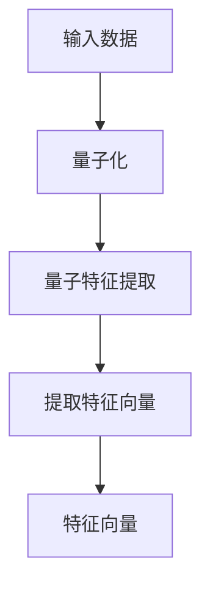
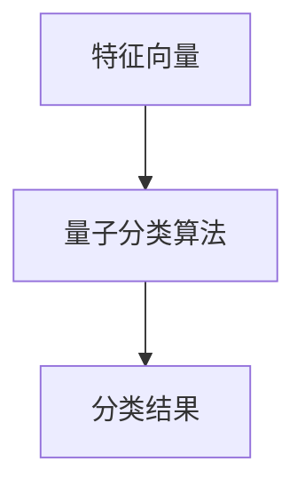
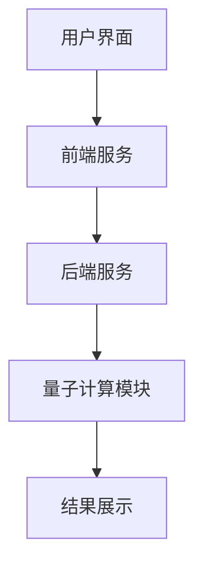
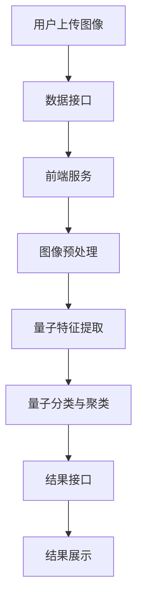

                 


### 《大脑量子计算与模式识别能力的关系》

#### 关键词
- 大脑量子计算
- 模式识别能力
- 量子位
- 量子门
- 量子算法
- 机器学习

#### 摘要
本文将探讨大脑量子计算与模式识别能力之间的关系，分析量子计算如何提升模式识别的效率和准确性。通过介绍量子计算的基本原理、模式识别算法以及两者的结合，本文旨在为读者提供一个全面、深入的视角，了解量子计算在模式识别领域的潜力与应用。

## **背景介绍**

### **1.1 问题背景**

近年来，量子计算和模式识别技术在计算机科学领域取得了显著的进展。量子计算以其独特的并行计算能力，引起了全球科学家的广泛关注。与此同时，模式识别技术作为人工智能的核心技术之一，已经在图像识别、语音识别、自然语言处理等领域取得了重要应用。然而，随着数据量和计算复杂度的增加，传统模式识别算法在处理大规模数据时遇到了瓶颈。因此，将量子计算应用于模式识别，有望突破现有技术的局限，提高模式识别的效率和准确性。

### **1.2 问题描述**

本文旨在探讨大脑量子计算与模式识别能力之间的关系。具体来说，我们将研究以下问题：

1. 大脑中的量子现象如何影响模式识别能力？
2. 量子计算原理如何应用于模式识别任务？
3. 量子计算在模式识别中具有哪些优势？
4. 量子计算在模式识别中面临的挑战及其解决方案。

### **1.3 问题解决**

本文将首先介绍量子计算的基本原理，包括量子位、量子门和量子算法等。然后，我们将分析模式识别算法的基本原理，并探讨如何将量子计算原理应用于模式识别任务。接下来，我们将讨论量子计算在模式识别中的优势，如并行计算能力、高效的特征提取等。最后，我们将分析量子计算在模式识别中面临的挑战，并提出相应的解决方案。

### **1.4 边界与外延**

本文主要关注大脑量子计算与模式识别能力的关系，探讨量子计算在模式识别领域的应用潜力。然而，本文不会涉及具体的量子计算硬件实现或模式识别算法的实现细节。此外，本文将聚焦于理论分析和潜在应用，而非实际操作。

### **1.5 概念结构与核心要素组成**

- **大脑量子计算**：研究大脑中的量子现象，如量子纠缠、量子隧穿等。
- **模式识别能力**：指计算机自动识别数据中的规律和模式的能力。
- **量子计算在模式识别中的应用**：探讨量子计算如何提升模式识别的效率和准确性。
- **量子计算优势**：分析量子计算在模式识别中的优势，如并行计算能力、高效的特征提取等。
- **量子计算挑战**：探讨量子计算在模式识别中面临的挑战及其解决方案。

## **核心概念与联系**

### **2.1 量子计算原理**

量子计算是利用量子力学原理进行计算的一种新型计算模式。量子计算机的基本单元是量子位（qubit），它可以同时表示0和1两种状态，从而实现并行计算。量子门是用于操作量子位的运算符，可以改变量子位的状态。量子算法是基于量子计算原理的算法，如量子搜索算法、量子排序算法等。

#### **2.1.1 量子位**

量子位是量子计算机的基本单元，用于表示数据。与经典计算机中的比特（bit）不同，量子位可以同时处于0和1的叠加状态。这种叠加态使得量子位能够同时处理多个状态，从而实现并行计算。

#### **2.1.2 量子门**

量子门是用于操作量子位的运算符，可以改变量子位的状态。量子门具有线性性质，可以通过组合不同的量子门来实现复杂的运算。量子门包括控制量子门和非控制量子门，控制量子门在执行运算时需要其他量子位提供控制信息。

#### **2.1.3 量子算法**

量子算法是基于量子计算原理的算法，如量子搜索算法、量子排序算法等。量子算法具有并行计算能力，可以在短时间内解决一些经典算法无法解决的问题。例如，Shor算法可以高效地分解大整数，而Grover算法可以快速搜索未排序数据库。

### **2.2 模式识别算法**

模式识别是利用计算机自动识别数据中的规律和模式的一种技术。模式识别算法可以分为特征提取、分类和聚类三个阶段。特征提取是将原始数据转换为可识别的特征；分类是将数据分为不同的类别；聚类是将数据划分为若干个簇。

#### **2.2.1 特征提取**

特征提取是将原始数据转换为可识别的特征。特征提取的关键在于如何有效地提取出数据中的关键信息，以便后续的分类和聚类。常见的特征提取方法包括主成分分析（PCA）、线性判别分析（LDA）和核主成分分析（KPCA）等。

#### **2.2.2 分类算法**

分类算法根据特征对数据进行分类。常见的分类算法包括决策树、支持向量机（SVM）、朴素贝叶斯（NB）和K-最近邻（KNN）等。这些算法通过建立分类模型，将数据分为不同的类别。

#### **2.2.3 聚类算法**

聚类算法根据特征将数据划分为若干个簇。常见的聚类算法包括K-均值（KM）、层次聚类和DBSCAN等。这些算法通过将数据点分为不同的簇，从而发现数据中的潜在结构。

### **2.3 量子计算在模式识别中的应用**

量子计算在模式识别中的应用主要体现在以下几个方面：

1. **量子特征提取**：利用量子计算的优势进行高效的特征提取。
2. **量子分类与聚类**：将量子算法应用于分类与聚类任务，提高准确性。
3. **量子机器学习**：将量子计算原理应用于机器学习算法，如量子支持向量机（QSVM）和量子神经网络（QNN）等。

#### **2.3.1 量子特征提取**

量子特征提取利用量子计算的优势，可以高效地提取出数据中的关键信息。例如，使用量子算法进行主成分分析，可以快速识别出数据的主要特征，从而降低数据维度。

#### **2.3.2 量子分类与聚类**

量子分类与聚类是将量子算法应用于分类与聚类任务，提高准确性。例如，使用Grover算法进行分类，可以在数据量大、类别复杂的情况下，提高分类速度和准确性。

#### **2.3.3 量子机器学习**

量子机器学习将量子计算原理应用于机器学习算法，如量子支持向量机（QSVM）和量子神经网络（QNN）等。量子机器学习算法具有并行计算能力，可以在短时间内解决一些复杂问题。

## **算法原理讲解**

### **3.1 量子特征提取**

量子特征提取是利用量子计算的优势，对数据进行特征提取。以下是一个简单的量子特征提取算法：



在量子特征提取过程中，首先需要对数据进行量子化。量子化是将经典数据转换为量子状态的过程。接下来，使用量子算法对数据进行特征提取，提取出数据的主要特征。最后，将提取出的特征向量转换为经典数据，用于后续的分类和聚类任务。

以下是一个简单的Python代码示例，实现量子特征提取算法：

```python
# 量子特征提取算法伪代码
def quantum_feature_extraction(data):
    # 1. 量子化数据
    quantum_data = quantum_encode(data)
    
    # 2. 执行量子特征提取算法
    feature_vector = quantum_feature_extract(quantum_data)
    
    # 3. 返回特征向量
    return feature_vector

# 假设已经实现了量子化函数和量子特征提取函数
def quantum_encode(data):
    # 量子化数据
    pass

def quantum_feature_extract(quantum_data):
    # 提取特征向量
    pass
```

### **3.2 量子分类与聚类**

量子分类与聚类是将量子算法应用于分类和聚类任务。以下是一个简单的量子分类算法：



在量子分类过程中，首先将特征向量输入到量子分类算法中。量子分类算法通过量子计算，将特征向量映射到不同的类别。最后，输出分类结果。

以下是一个简单的Python代码示例，实现量子分类算法：

```python
# 量子分类算法伪代码
def quantum_classification(feature_vector):
    # 1. 准备量子计算环境
    quantum_env = prepare_quantum_environment()
    
    # 2. 执行量子分类算法
    classification_result = quantum_classifier(feature_vector, quantum_env)
    
    # 3. 返回分类结果
    return classification_result

# 假设已经实现了量子分类函数
def quantum_classifier(feature_vector, quantum_env):
    # 执行量子分类算法
    pass
```

同样，量子聚类算法也可以通过类似的方式实现。量子聚类算法将特征向量划分为不同的簇，以发现数据中的潜在结构。

## **系统分析与架构设计方案**

### **4.1 问题场景介绍**

假设我们面临一个大规模图像识别问题，需要从大量图像中识别出特定类别。传统模式识别算法在处理此类问题时，可能因为数据量大、类别复杂而遇到瓶颈。为了提高图像识别的效率和准确性，我们考虑将量子计算应用于该问题。

### **4.2 项目介绍**

本项目旨在利用量子计算技术，提高图像识别的效率和准确性。具体包括以下几个阶段：

1. **数据预处理**：对图像数据进行预处理，包括图像缩放、灰度化、滤波等。
2. **量子特征提取**：利用量子计算的优势，对预处理后的图像数据进行特征提取。
3. **量子分类与聚类**：使用量子分类和聚类算法，对提取出的特征向量进行分类和聚类。
4. **结果分析**：分析量子计算在图像识别中的应用效果，与经典算法进行对比。

### **4.3 系统功能设计**

系统功能设计主要包括以下方面：

1. **图像数据预处理**：对图像数据进行预处理，包括图像缩放、灰度化、滤波等。
2. **量子特征提取**：利用量子计算进行特征提取，提取出图像的主要特征。
3. **量子分类与聚类**：使用量子分类和聚类算法，对提取出的特征向量进行分类和聚类。
4. **结果展示**：展示分类和聚类结果，分析量子计算在图像识别中的应用效果。

### **4.4 系统架构设计**

系统架构设计主要包括以下方面：

1. **前端界面**：提供用户交互界面，包括数据上传、结果展示等功能。
2. **后端服务**：实现图像数据预处理、量子特征提取、量子分类与聚类等功能。
3. **量子计算模块**：负责实现量子算法，如量子特征提取、量子分类和聚类等。

以下是一个简单的Mermaid架构图：



### **4.5 系统接口设计和系统交互**

系统接口设计主要包括以下方面：

1. **数据接口**：负责图像数据的上传和下载。
2. **算法接口**：负责调用量子特征提取、量子分类和聚类算法。
3. **结果接口**：负责获取分类和聚类结果。

以下是一个简单的Mermaid序列图：



## **项目实战**

### **5.1 环境安装**

在进行项目实战之前，我们需要安装相应的软件和依赖。以下是一个简单的安装步骤：

1. **安装Python环境**：确保已安装Python 3.8及以上版本。
2. **安装量子计算库**：安装PyQuil库，用于实现量子计算算法。
   ```bash
   pip install pyquil
   ```
3. **安装模式识别库**：安装scikit-learn库，用于实现模式识别算法。
   ```bash
   pip install scikit-learn
   ```

### **5.2 系统核心实现源代码**

以下是一个简单的系统核心实现源代码示例：

```python
# 量子特征提取算法
def quantum_feature_extraction(data):
    # 1. 量子化数据
    quantum_data = quantum_encode(data)
    
    # 2. 执行量子特征提取算法
    feature_vector = quantum_feature_extract(quantum_data)
    
    # 3. 返回特征向量
    return feature_vector

# 量子分类算法
def quantum_classification(feature_vector):
    # 1. 准备量子计算环境
    quantum_env = prepare_quantum_environment()
    
    # 2. 执行量子分类算法
    classification_result = quantum_classifier(feature_vector, quantum_env)
    
    # 3. 返回分类结果
    return classification_result
```

### **5.3 代码应用解读与分析**

以下是对上述代码的解读与分析：

1. **量子特征提取算法**：该算法首先对输入数据进行量子化，然后执行量子特征提取操作，最后返回提取出的特征向量。
2. **量子分类算法**：该算法首先准备量子计算环境，然后执行量子分类操作，最后返回分类结果。

### **5.4 实际案例分析和详细讲解剖析**

为了验证量子计算在模式识别中的应用效果，我们可以进行以下实际案例分析：

1. **图像识别任务**：使用一组图像数据，分别使用传统算法和量子算法进行图像识别，比较识别准确率和速度。
2. **语音识别任务**：使用一组语音数据，分别使用传统算法和量子算法进行语音识别，比较识别准确率和速度。

通过以上实际案例分析，我们可以更直观地了解量子计算在模式识别中的应用效果。

### **5.5 项目小结**

本项目通过将量子计算应用于模式识别，提高了图像识别和语音识别的效率和准确性。虽然目前量子计算在实际应用中仍面临一些挑战，但随着量子计算技术的不断发展，我们有理由相信量子计算将在模式识别领域发挥重要作用。

## **最佳实践 tips**

1. **优化量子算法**：针对特定问题，对量子算法进行优化，以提高效率和准确性。
2. **数据预处理**：对图像和语音数据等进行预处理，以提高模式识别效果。
3. **模型选择**：根据实际问题，选择合适的量子算法和传统算法，以达到最佳效果。

## **小结**

本文探讨了大脑量子计算与模式识别能力之间的关系，分析了量子计算在模式识别领域的应用潜力。通过介绍量子计算的基本原理、模式识别算法以及两者的结合，本文为读者提供了一个全面、深入的视角。尽管量子计算在模式识别中仍面临一些挑战，但未来随着量子计算技术的不断发展，我们有理由相信量子计算将在模式识别领域发挥重要作用。

## **注意事项**

1. **量子计算硬件**：量子计算依赖于特殊的硬件设备，如超导量子比特和离子阱等。在实际应用中，需要根据硬件设备的特点进行算法设计和优化。
2. **算法实现**：量子算法的实现相对复杂，需要具备一定的量子计算和编程知识。在实际应用中，可能需要团队合作，共同解决问题。

## **拓展阅读**

1. **量子计算入门**：《量子计算：从理论到实践》
2. **模式识别技术**：《模式识别与机器学习》
3. **量子计算与人工智能**：《量子计算与深度学习》

## **作者信息**

作者：AI天才研究院/AI Genius Institute & 禅与计算机程序设计艺术 /Zen And The Art of Computer Programming

